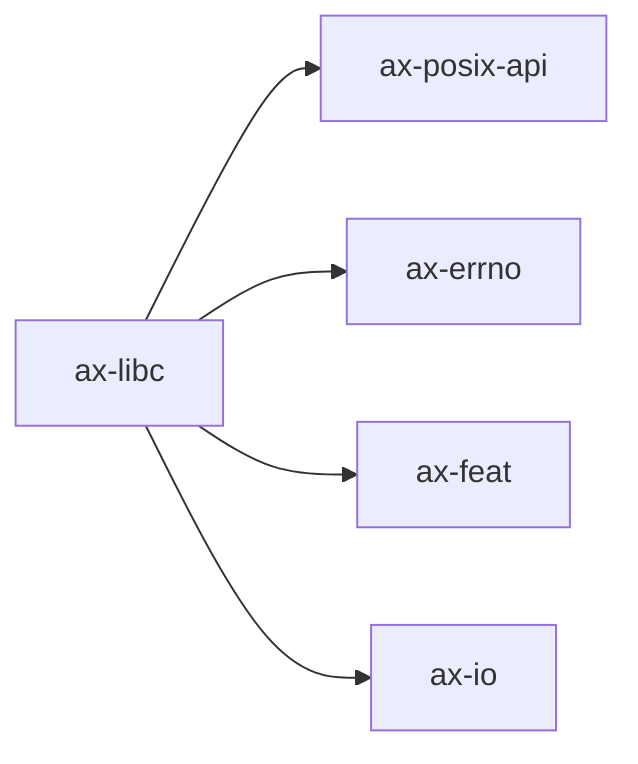

# `ax-libc`

> 路径：`os/arceos/ulib/axlibc`
> 类型：库 crate
> 分层：ArceOS 层 / ArceOS 用户库层
> 版本：`0.5.0`
> 文档依据：当前仓库源码、`Cargo.toml` 与 未检测到 crate 层 README

`ax-libc` 的核心定位是：ArceOS user program library for C apps

## 架构设计
- 目录角色：ArceOS 用户库层
- crate 形态：库 crate
- 工作区位置：子工作区 `os/arceos`
- feature 视角：主要通过 `alloc`、`epoll`、`fd`、`fp-simd`、`fs`、`irq`、`multitask`、`net` 等能力 feature 控制编译期能力装配；平台实现固定由 `axplat-dyn` 运行时发现。
- 关键数据结构：可直接观察到的关键数据结构/对象包括 `MemoryControlBlock`、`CTRL_BLK_SIZE`。

### 模块结构
- `utils`：通用工具函数和辅助类型
- `fd_ops`：内部子模块（按 feature: fd 条件启用）
- `fs`：文件系统、挂载或路径解析逻辑（按 feature: fs 条件启用）
- `io_mpx`：内部子模块（按 feature: select, epoll 条件启用）
- `malloc`：Provides the corresponding malloc(size_t) and free(size_t) when using the C user program. The normal malloc(size_t) and free(size_t) are provided by the library malloc.h, and sys_…（按 feature: alloc 条件启用）
- `net`：网络栈、socket 或协议适配（按 feature: net 条件启用）
- `pipe`：内部子模块（按 feature: pipe 条件启用）
- `pthread`：内部子模块（按 feature: multitask 条件启用）

### 核心机制
- 内存分配器初始化、扩容或对象分配路径

## 核心功能
- 功能定位：ArceOS user program library for C apps
- 对外接口：从源码可见的主要公开入口包括 `e`、`MemoryControlBlock`。
- 典型使用场景：主要作为仓库中的专用支撑 crate 被上层组件调用。
- 关键调用链示例：该 crate 没有单一固定的初始化链，通常由上层调用者按 feature/trait 组合接入。

## 依赖关系


### 直接依赖
- `ax-posix-api`
- `ax-errno`
- `ax-feat`
- `axio`

### 间接依赖
- `ax-arm-pl031`
- `axaddrspace`
- `ax-alloc`
- `ax-allocator`
- `axbacktrace`
- `ax-cpu`
- `ax-display`
- `ax-dma`
- 另外还有 `62` 个同类项未在此展开

### 3.3 被依赖情况
- 当前未发现本仓库内其他 crate 对其存在直接本地依赖。

### 被依赖情况
- 当前未发现更多间接消费者，或该 crate 主要作为终端入口使用。

### 外部依赖
- `bindgen`

## 开发指南
### 接入方式
```toml
[dependencies]
ax-libc = { workspace = true }

# 如果在仓库外独立验证，也可以显式绑定本地路径：
# ax-libc = { path = "os/arceos/ulib/axlibc" }
```

### 初始化
1. 在 `Cargo.toml` 中接入该 crate，并根据需要开启相关 feature。
2. 若 crate 暴露初始化入口，优先调用 `init`/`new`/`build`/`start` 类函数建立上下文。
3. 在最小消费者路径上验证公开 API、错误分支与资源回收行为。

### API 使用
- 优先关注函数入口：`e`。
- 上下文/对象类型通常从 `MemoryControlBlock` 等结构开始。

## 测试
### 测试覆盖
- 当前 crate 目录中未发现显式 `tests/`/`benches/`/`fuzz/` 入口，更可能依赖上层系统集成测试或跨 crate 回归。

### 单元测试
- 建议覆盖公开 API、状态转换和异常分支。

### 集成测试
- 建议补充最小消费者路径，验证该 crate 在真实调用链中可用。

### 覆盖率
- 覆盖率建议：公开 API、边界条件和关键错误处理路径需要显式覆盖。

## 跨项目定位
### ArceOS
`ax-libc` 直接位于 `os/arceos/` 目录树中，是 ArceOS 工程本体的一部分，承担 ArceOS 用户库层。

### StarryOS
当前未检测到 StarryOS 工程本体对 `ax-libc` 的显式本地依赖，若参与该系统，通常经外部工具链、配置或更底层生态间接体现。

### Axvisor
当前未检测到 Axvisor 工程本体对 `ax-libc` 的显式本地依赖，若参与该系统，通常经外部工具链、配置或更底层生态间接体现。
