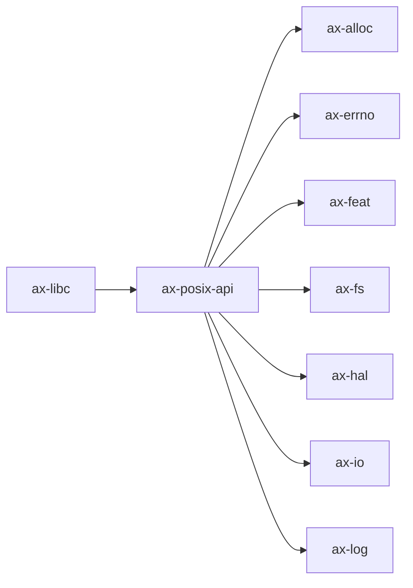

# `ax-posix-api`

> 路径：`os/arceos/api/arceos_posix_api`
> 类型：库 crate
> 分层：ArceOS 层 / ArceOS 公共 API/feature 聚合层
> 版本：`0.5.0`
> 文档依据：当前仓库源码、`Cargo.toml` 与 未检测到 crate 层 README

`ax-posix-api` 的核心定位是：POSIX-compatible APIs for ArceOS modules

## 架构设计
- 目录角色：ArceOS 公共 API/feature 聚合层
- crate 形态：库 crate
- 工作区位置：子工作区 `os/arceos`
- feature 视角：主要通过 `alloc`、`epoll`、`fd`、`fs`、`irq`、`multitask`、`net`、`pipe`、`select`、`smp` 控制编译期能力装配。
- 关键数据结构：该 crate 暴露的数据结构较少，关键复杂度主要体现在模块协作、trait 约束或初始化时序。

### 模块结构
- `utils`：通用工具函数和辅助类型
- `imp`：内部实现细节与 trait/backend 绑定
- `ctypes`：内部子模块

### 核心机制
- 事件轮询与 I/O 多路复用

## 核心功能
- 功能定位：POSIX-compatible APIs for ArceOS modules
- 对外接口：从源码可见的主要公开入口包括 `char_ptr_to_str`、`check_null_ptr`、`check_null_mut_ptr`。
- 典型使用场景：主要作为仓库中的专用支撑 crate 被上层组件调用。
- 关键调用链示例：该 crate 没有单一固定的初始化链，通常由上层调用者按 feature/trait 组合接入。

## 依赖关系


### 直接依赖
- `ax-alloc`
- `ax-errno`
- `ax-feat`
- `ax-fs`
- `ax-hal`
- `axio`
- `ax-log`
- `ax-net`
- `ax-runtime`
- `ax-sync`
- `ax-task`
- 另外还有 `1` 个同类项未在此展开

### 间接依赖
- `ax-arm-pl031`
- `axaddrspace`
- `ax-allocator`
- `axbacktrace`
- `ax-cpu`
- `ax-display`
- `ax-dma`
- `ax-driver`
- `rdrive`
- 另外还有 `52` 个同类项未在此展开

### 3.3 被依赖情况
- `ax-libc`

### 被依赖情况
- 当前未发现更多间接消费者，或该 crate 主要作为终端入口使用。

### 外部依赖
- `bindgen`
- `flatten_objects`
- `lazy_static`
- `spin`

## 开发指南
### 接入方式
```toml
[dependencies]
ax-posix-api = { workspace = true }

# 如果在仓库外独立验证，也可以显式绑定本地路径：
# ax-posix-api = { path = "os/arceos/api/arceos_posix_api" }
```

### 初始化
1. 在 `Cargo.toml` 中接入该 crate，并根据需要开启相关 feature。
2. 若 crate 暴露初始化入口，优先调用 `init`/`new`/`build`/`start` 类函数建立上下文。
3. 在最小消费者路径上验证公开 API、错误分支与资源回收行为。

### API 使用
- 优先关注函数入口：`char_ptr_to_str`、`check_null_ptr`、`check_null_mut_ptr`。

## 测试
### 测试覆盖
- 当前 crate 目录中未发现显式 `tests/`/`benches/`/`fuzz/` 入口，更可能依赖上层系统集成测试或跨 crate 回归。

### 单元测试
- 建议覆盖公开 API、状态转换和异常分支。

### 集成测试
- 建议补充最小消费者路径，验证该 crate 在真实调用链中可用。

### 覆盖率
- 覆盖率建议：公开 API、边界条件和关键错误处理路径需要显式覆盖。

## 跨项目定位
### ArceOS
`ax-posix-api` 直接位于 `os/arceos/` 目录树中，是 ArceOS 工程本体的一部分，承担 ArceOS 公共 API/feature 聚合层。

### StarryOS
当前未检测到 StarryOS 工程本体对 `ax-posix-api` 的显式本地依赖，若参与该系统，通常经外部工具链、配置或更底层生态间接体现。

### Axvisor
当前未检测到 Axvisor 工程本体对 `ax-posix-api` 的显式本地依赖，若参与该系统，通常经外部工具链、配置或更底层生态间接体现。
