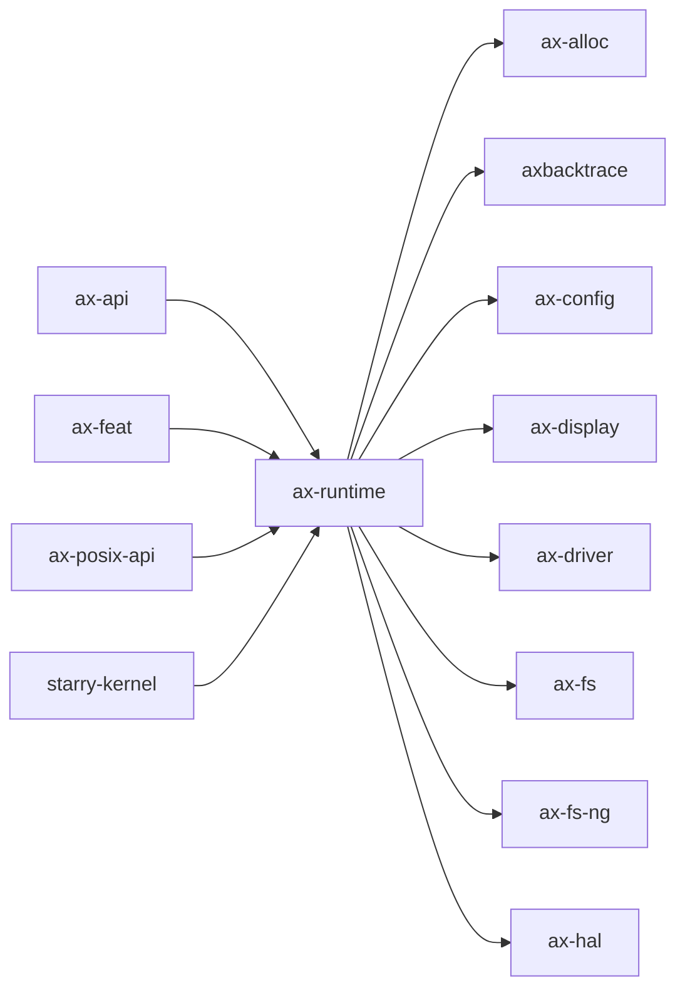

# `ax-runtime`

> 路径：`os/arceos/modules/axruntime`
> 类型：库 crate
> 分层：ArceOS 层 / ArceOS 内核模块
> 版本：`0.5.0`
> 文档依据：当前仓库源码、`Cargo.toml` 与 未检测到 crate 层 README

`ax-runtime` 的核心定位是：Runtime library of ArceOS

## 架构设计
- 目录角色：ArceOS 内核模块
- crate 形态：库 crate
- 工作区位置：子工作区 `os/arceos`
- feature 视角：主要通过 `alloc`、`ax-driver`、`buddy-slab`、`display`、`dma`、`fs`、`fs-ng`、`input`、`ipi`、`irq` 等（另有 9 个 feature） 控制编译期能力装配。
- 关键数据结构：可直接观察到的关键数据结构/对象包括 `LogIfImpl`、`AddrTranslatorImpl`、`KlibImpl`、`LOGO`、`INITED_CPUS`、`TRANSLATOR`、`PERIODIC_INTERVAL_NANOS`。

### 模块结构
- `lang_items`：裸机语言项和运行时补齐（按目标架构/平台: none 分派）
- `mp`：多核启动与 CPU 协同初始化（按 feature: smp 条件启用）
- `klib`：Platform implementation of the axklib::Klib trait. This crate provides the platform-side glue that implements the small set of kernel helper functions defined in axklib. The imple…（按 feature: paging 条件启用）

### 核心机制
- 该 crate 的实现主要围绕顶层模块分工展开，重点在子系统边界、trait/类型约束以及初始化流程。

## 核心功能
- 功能定位：Runtime library of ArceOS
- 对外接口：从源码可见的主要公开入口包括 `rust_main`、`start_secondary_cpus`、`rust_main_secondary`、`LogIfImpl`、`AddrTranslatorImpl`、`KlibImpl`。
- 典型使用场景：主要作为仓库中的专用支撑 crate 被上层组件调用。
- 关键调用链示例：按当前源码布局，常见入口/初始化链可概括为 `main()` -> `is_init_ok()` -> `init_allocator()` -> `init_interrupt()` -> `init_tls()` -> ...。

## 依赖关系


### 直接依赖
- `ax-alloc`
- `axbacktrace`
- `axconfig`
- `ax-display`
- `ax-driver`
- `ax-fs`
- `ax-fs-ng`
- `ax-hal`
- `ax-input`
- `ax-ipi`
- `axklib`
- `ax-log`
- 另外还有 `8` 个同类项未在此展开

### 间接依赖
- `ax-arm-pl031`
- `axaddrspace`
- `ax-allocator`
- `ax-config-gen`
- `ax-config-macros`
- `ax-cpu`
- `ax-dma`
- `rdrive`
- `rd-block`
- `rd-net`
- `rdif-display`
- 另外还有 `43` 个同类项未在此展开

### 3.3 被依赖情况
- `ax-api`
- `ax-feat`
- `ax-posix-api`
- `starry-kernel`

### 被依赖情况
- `arceos-affinity`
- `arceos-display`
- `arceos-exception`
- `arceos-fs-shell`
- `arceos-irq`
- `arceos-memtest`
- `arceos-net-echoserver`
- `arceos-net-httpclient`
- `arceos-net-httpserver`
- `arceos-net-udpserver`
- `arceos-parallel`
- `arceos-priority`
- 另外还有 `14` 个同类项未在此展开

### 外部依赖
- `cfg-if`
- `chrono`
- `indoc`

## 开发指南
### 接入方式
```toml
[dependencies]
ax-runtime = { workspace = true }

# 如果在仓库外独立验证，也可以显式绑定本地路径：
# ax-runtime = { path = "os/arceos/modules/axruntime" }
```

### 初始化
1. 在 `Cargo.toml` 中接入该 crate，并根据需要开启相关 feature。
2. 若 crate 暴露初始化入口，优先调用 `init`/`new`/`build`/`start` 类函数建立上下文。
3. 在最小消费者路径上验证公开 API、错误分支与资源回收行为。

### API 使用
- 优先关注函数入口：`rust_main`、`start_secondary_cpus`、`rust_main_secondary`。
- 上下文/对象类型通常从 `LogIfImpl`、`AddrTranslatorImpl`、`KlibImpl` 等结构开始。

## 测试
### 测试覆盖
- 当前 crate 目录中未发现显式 `tests/`/`benches/`/`fuzz/` 入口，更可能依赖上层系统集成测试或跨 crate 回归。

### 单元测试
- 建议覆盖公开 API、状态转换和异常分支。

### 集成测试
- 建议补充最小消费者路径，验证该 crate 在真实调用链中可用。

### 覆盖率
- 覆盖率建议：公开 API、边界条件和关键错误处理路径需要显式覆盖。

## 跨项目定位
### ArceOS
`ax-runtime` 直接位于 `os/arceos/` 目录树中，是 ArceOS 工程本体的一部分，承担 ArceOS 内核模块。

### StarryOS
`ax-runtime` 不在 StarryOS 目录内部，但被 `starry-kernel` 等 StarryOS crate 直接依赖，说明它是该系统的共享构件或底层服务。

### Axvisor
`ax-runtime` 主要通过 `axvisor` 等上层 crate 被 Axvisor 间接复用，通常处于更底层的公共依赖层。
