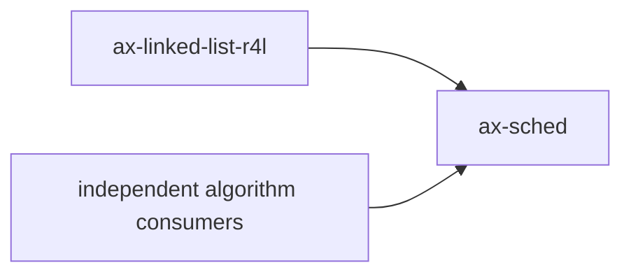

# `axsched`

> 路径：`components/axsched`
> 类型：库 crate
> 分层：组件层 / 调度算法基础件
> 版本：`0.3.1`
> 文档依据：`Cargo.toml`、`README.md`、`src/lib.rs`、`src/fifo.rs`、`src/round_robin.rs`、`src/cfs.rs`、`src/tests.rs`

`axsched` 是 ArceOS 调度算法库。它通过统一的 `BaseScheduler` trait 提供 FIFO、RR、CFS 三种就绪队列算法，供 `ax-task` 这类真正的任务运行时选择和封装。它是典型的叶子基础件：只负责“在一组 runnable 实体里选下一个”，不负责任务生命周期、阻塞/唤醒、上下文切换或 CPU bring-up。

## 架构设计
### 设计定位
`axsched` 的核心分层边界非常明确：

- `axsched`：提供调度算法和就绪队列操作。
- `ax-task`：提供任务状态机、等待队列、定时器、退出回收和上下文切换。

`BaseScheduler` 的文档也直接说明了一点：调度器里的实体都被视为“可运行实体”，睡眠或阻塞的任务应该在外层先移出调度器。这意味着 `axsched` 从设计上就不是完整的任务系统。

### 模块结构
- `src/lib.rs`：统一 trait 定义与三种算法导出。
- `src/fifo.rs`：协作式 FIFO 调度器。
- `src/round_robin.rs`：带时间片的 RR 调度器。
- `src/cfs.rs`：简化版 CFS 调度器。
- `src/tests.rs`：三种算法共享的测试与性能基准入口。

### 1.3 关键类型
- `BaseScheduler`：所有调度器都必须实现的统一接口。
- `FifoScheduler<T>` / `FifoTask<T>`：FIFO 策略及其任务包装。
- `RRScheduler<T, S>` / `RRTask<T, S>`：RR 策略及其时间片任务包装。
- `CFScheduler<T>` / `CFSTask<T>`：CFS 策略及其 vruntime/priority 包装。

### 1.4 三种算法的真实实现方式
- `FifoScheduler`：
  - 使用 `ax_linked_list_r4l::List<Arc<FifoTask<T>>>` 维护就绪队列。
  - `task_tick()` 永远返回 `false`，不会因时钟中断要求抢占。
- `RRScheduler`：
  - 每个 `RRTask` 多一个 `time_slice: AtomicIsize`。
  - `task_tick()` 每次 tick 把时间片减一，减到零时返回 `true` 请求重调度。
  - `put_prev_task()` 在“抢占且还有剩余时间片”时把任务放到队首，否则重置时间片后放回队尾。
- `CFScheduler`：
  - 用 `BTreeMap<(vruntime, taskid), Arc<CFSTask<T>>>` 维护有序就绪队列。
  - `CFSTask` 保存 `init_vruntime`、`delta`、`nice` 和唯一 `id`。
  - 权重表 `NICE2WEIGHT_*` 直接参考 Linux nice 权重。

需要特别说明的是：这里的 CFS 是“能工作的简化实现”，并不是 Linux 调度器的完整移植。

## 核心功能
### 功能概览
- 在统一 trait 下暴露三类可替换的调度算法。
- 为每类算法定义适配的任务包装类型。
- 给上层运行时提供 `add/remove/pick/put_prev/task_tick/set_priority` 这组就绪队列操作。

### 使用场景
- `BaseScheduler`、`FifoScheduler`、`RRScheduler` 和 `CFScheduler` 保留为独立算法库 API。
- 新的 `components/ax-task` 不再依赖本 crate；它使用统一的 per-CPU 多类 runqueue 和 EEVDF/RT/Deadline accounting。

### 边界说明
- `axsched` 不保存任务的 `Running/Ready/Blocked/Exited` 状态机；那是 `ax-task::TaskState` 的职责。
- `axsched` 不做上下文切换；它只决定“应该切到谁”。
- `axsched` 的 `set_priority()` 语义因算法不同而不同，不能把它误解为统一系统优先级接口。

## 依赖关系


### 直接依赖
- `ax-linked-list-r4l`：FIFO 和 RR 使用的 intrusive 链表容器。
- `alloc` / `BTreeMap`：CFS 的有序队列依赖标准 `alloc` 数据结构。

### 主要消费者
- 本 crate 当前作为独立算法组件保留；新的任务运行时不再通过它选择生产调度类。

## 开发指南
### 接入方式
```toml
[dependencies]
ax-sched = { workspace = true }
```

### 注意事项
1. `BaseScheduler::remove_task()` 的安全约束不能放松；调用方默认会假定待删实体确实在队列中。
2. 修改 FIFO/RR 时，要同时检查 `ax-linked-list-r4l` 上的节点所有权和 O(1) 删除语义是否仍成立。
3. 修改 CFS 的权重或 vruntime 逻辑时，要同步评估 `set_priority()`、`task_tick()` 和 `put_prev_task()` 的协同关系。
4. 不要把阻塞、睡眠、退出回收等逻辑塞进 `axsched`；这会破坏它与 `ax-task` 的清晰分层。

### 4.3 开发建议
- 如果要新增新算法，优先新增一个实现 `BaseScheduler` 的独立调度器，而不是把现有三个调度器改成巨大的 feature if-else。
- 任务生命周期、SMP load balance 和生产 policy 变更应直接在新 `ax-task` 的领域模块中实现，不要让 `axsched` 感知系统拓扑。

## 测试
### 测试覆盖
`src/tests.rs` 为 FIFO、RR、CFS 三种算法统一生成了三类测试：

- `test_sched()`：验证调度顺序。
- `bench_yield()`：测量高频 pick/put 的开销。
- `bench_remove()`：测量大量 remove 的性能。

### 单元测试
- FIFO 的顺序稳定性。
- RR 的时间片耗尽与 `put_prev_task()` 位置策略。
- CFS 的 vruntime 排序与 `nice` 映射。

### 集成测试
- 本 crate 的算法单测保持独立；系统级行为由 `ax-task` 的 Linux/Zephyr/reference 测试覆盖。

### 覆盖率
- 对 `axsched`，算法行为覆盖比普通行覆盖更重要。
- 任何改动 ready queue 结构、时间片逻辑或 vruntime 规则的提交，都应补对应算法的专门测试。

## 跨项目定位
### ArceOS
`axsched` 在 ArceOS 中是 `ax-task` 背后的算法底座。它决定调度策略，但不直接承担任务系统本体。

### StarryOS
StarryOS 通过复用 `ax-task` 间接复用 `axsched`。因此它在 StarryOS 中仍是调度算法叶子件，而不是 Linux 兼容线程系统本身。

### Axvisor
Axvisor 若通过共享任务栈把 vCPU 组织成宿主任务，也会间接受用 `axsched`。它提供的是调度算法，不是 hypervisor 并发模型的完整定义。
