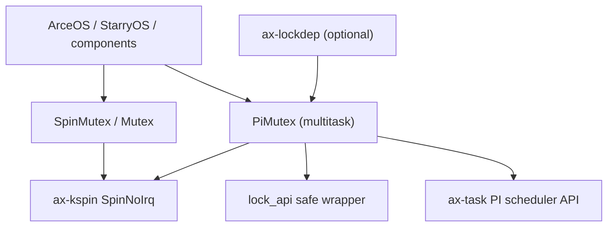
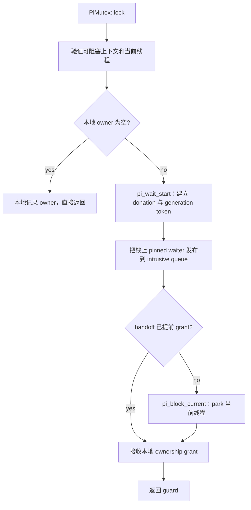

# `ax-sync`

> 路径：`os/arceos/modules/axsync`
>
> 类型：`no_std` 库 crate
>
> 分层：ArceOS 层 / ArceOS 内核模块
>
> 版本：`0.5.28`

`ax-sync` 提供两类语义必须由调用者显式区分的互斥锁：始终非睡眠的
`SpinMutex`，以及仅在 `multitask` feature 下可用的优先级继承睡眠锁
`PiMutex`。兼容名称 `Mutex` 固定为 `SpinMutex` 的别名，不会再因 Cargo feature
合并而改变锁语义。

## 公共 API 与固定语义

| API | 可用条件 | 语义 |
| --- | --- | --- |
| `SpinMutex<T>` / `SpinMutexGuard` | 始终可用 | `ax_kspin::SpinNoIrq` 的显式名称；非睡眠、IRQ-safe，guard 不可跨线程或 CPU 发送。 |
| `Mutex<T>` / `MutexGuard` | 始终可用 | `SpinMutex` 的兼容别名；打开 `multitask` 后仍是同一种非睡眠锁。新代码应优先写显式名称。 |
| `PiMutex<T>` / `PiMutexGuard` | `multitask` | 非重入、按有效调度紧迫度排序的优先级继承睡眠锁，guard 为 `GuardNoSend`。 |
| `RawPiMutex` | `multitask` | `PiMutex` 使用的 `lock_api::RawMutex`；兼容名称 `RawMutex` 当前仍保留。 |
| `spin` | 始终可用 | 直接再导出 `ax-kspin`，供调用者选择其他 IRQ/抢占组合。 |

Cargo 的 feature 会在整个依赖图中合并，因此 feature 不能安全地承担“同一个类型名
切换成另一种并发语义”的职责。现在 `multitask` 只增加 `PiMutex`、PI lockdep 和相关
实现，不改变 `Mutex`、`MutexGuard` 的类型或行为。

## 架构边界



职责划分如下：

- `ax-kspin` 提供短临界区所需的原子锁、IRQ/抢占 guard 和 lockdep 接入。
- `ax-sync` 维护 PI mutex 的本地 owner、waiter intrusive queue 与 handoff 协议。
- `ax-task` 维护线程的 base/effective 调度策略、传递式 donation、远端 owner
  reschedule、Deadline donor 记账以及 park/wake 状态机。
- OS runtime 通过 `TaskRuntime` 和 `LockRuntime` 提供 IRQ、抢占、IPI 与上下文切换能力。

`ax-task` 不反向依赖 `ax-sync`。PI 边界只传 `PiLockId`、`ThreadId`、
`PiWaitToken` 和定向 wake handle，不把 `ax-sync` 的锁对象或 waiter 指针交给调度器。

### 模块结构

- `src/lib.rs`：导出固定语义的 `SpinMutex` / `Mutex`，并在 `multitask` 下显式导出
  `PiMutex`。
- `src/mutex.rs`：实现 PI raw mutex、本地 owner/waiter 状态、handoff 和
  `lock_api` 适配。
- `src/pi.rs`：实现栈上 pinned waiter 节点及按紧迫度排序的 intrusive queue。
- `src/lockdep.rs`：在 `lockdep` feature 下记录 PI mutex 的 acquire/release。

## 非睡眠锁

`SpinMutex` 和兼容 `Mutex` 都是 `SpinNoIrq`：持锁期间关闭本地 IRQ，并通过
`LockRuntime` 保持相应抢占约束。它们适合 IRQ 与任务上下文共享的短状态、固定容量
队列和无需睡眠的快速路径。

持有这类锁时不得：

- park、sleep、yield 或等待另一个任务；
- 执行可能阻塞的 I/O、reclaim 或未知后端回调；
- fault 用户内存；
- 进行可能无界扩容的分配。

`SpinMutex` 的 `try_lock()` 同样不会睡眠，但成功后仍进入上述非睡眠临界区。

## PI 睡眠锁

`PiMutex` 只应在已经建立当前线程和调度器的普通任务上下文使用。hard IRQ、早期启动
或其他不可阻塞上下文必须使用非睡眠锁或重新划分临界区。

### 无竞争路径不进入 PI 图

无竞争 acquisition 只在 mutex 本地元数据中设置 owner；无 waiter 的 release 也只清除
本地 owner。两者都不会向 `TaskSystem` 注册锁所有权或 donation edge。这样，普通快速
路径不会维护一个全局“所有 PI 锁”表。

只有观察到其他 owner 后，waiter 才调用调度器 PI API：



`try_lock()` 只检查本地 owner：成功时记录 owner，失败时立即返回，不 donation、不 park。

### waiter 发布与 handoff 顺序

竞争路径遵守以下顺序：

1. waiter 在释放 mutex 元数据锁后调用 `pi_wait_start`，先建立 scheduler donation。
2. donation 成功后，才把栈上 pinned waiter 节点发布到本地 intrusive queue。
3. owner 解锁时先关闭新 waiter 注册窗口，等待已经开始的注册完成，再按有效调度 key
   选择最紧迫 waiter。
4. 本地 owner 和 waiter grant 先发布，然后调用 `pi_mutex_handoff` 原子转移 scheduler
   donation，再在所有元数据锁之外定向 wake 新 owner。

等待排序使用线程最新的 effective scheduling key，因此 Deadline、FIFO/RR 与 Fair
donor 能按调度器紧迫度参与同一队列。相同 key 使用单调 sequence 保持 FIFO。
`ax-task` 继续沿 `blocked_on` owner 链传播 donation；检测到环时按内核不变量错误
终止，而不是留下部分 donation。

同 CPU 的 waiter 注册和 owner handoff 会暂时持有嵌套 `PreemptGuard`，避免一方被另一方
抢占后永久等待注册窗口。所有 donation、park、handoff 与 wake 都在本地 waiter 元数据
锁之外执行。

### 预分配与零分配调度操作

PI 等待状态不在竞争发生时动态创建：

- 每个 `ThreadCore` 创建时已经内嵌一个 `PiWaitState`，包含 generation 与 granted
  generation 原子字段。
- `ThreadRecord` 已经内嵌 `blocked_on: Option<PiWaitRegistration>`、waiter 计数和
  effective policy/donor 状态。
- `PiWaitToken` 是引用上述预分配状态的按值 handshake token；克隆其中已有的
  `Arc<ThreadCore>` 只增加引用计数，不进行堆分配。
- `ax-sync` 的 `WaiterNode` 固定在当前 `PiMutex::lock` 调用栈上，并以 intrusive node
  入队，不为 waiter 分配容器节点。

无竞争 acquisition/release 完全停留在 mutex-local owner 元数据中；调度器不提供也不需要
“登记无竞争 owner”的接口。`pi_wait_start`、`pi_wait_cancel` 和 `pi_mutex_handoff` 只修改
现有线程注册表和预分配状态，不扩容、不分配或释放内存。
`components/ax-task/tests/pi_allocation_contract.rs` 使用计数 allocator 固定这一契约。

generation token 同时覆盖 wake-before-block：handoff 若先发生，waiter 会观察 grant 而
不再 park；若 waiter 已进入 parking，定向 wake 会推进同一个线程状态机。取消被 owner
变化追越的注册同样只清理现有状态。

## 使用方式

### 显式非睡眠锁

```rust
use ax_sync::SpinMutex;

static COUNTER: SpinMutex<u64> = SpinMutex::new(0);

let mut guard = COUNTER.lock();
*guard += 1;
```

旧代码可以继续使用 `ax_sync::Mutex`，但它只是 `SpinMutex` 的兼容名称。不要用这个兼容
名称表达“可睡眠”。

### 显式 PI 睡眠锁

依赖侧先启用 feature：

```toml
[dependencies]
ax-sync = { workspace = true, features = ["multitask"] }
```

然后显式使用 `PiMutex`：

```rust
use ax_sync::PiMutex;

static STATE: PiMutex<u64> = PiMutex::new(0);

let mut guard = STATE.lock();
*guard += 1;
```

若临界区需要等待、I/O 或 fault，应先尽量把这些操作移到锁外；确实需要睡眠互斥时才
选择 `PiMutex`。不能通过启用 `multitask` 期待现有 `Mutex` 自动变成睡眠锁。

## Feature 与依赖

- `default = []`：仍然提供 `SpinMutex`、兼容 `Mutex` 和 `spin`。
- `multitask`：增加 `PiMutex`、`PiMutexGuard`、`RawPiMutex`、`RawMutex` 和 PI 模块。
- `lockdep`：隐含 `multitask`，并接入 `ax-kspin/lockdep` 与 `ax-lockdep` task context。

直接依赖：

- `ax-kspin`：非睡眠锁、PI 元数据短锁和抢占 guard。
- `ax-task`：线程身份、PI donation、park/handoff/wake 与有效调度策略。
- `lock_api`：`PiMutex` 的 safe wrapper。
- `ax-lockdep`：仅在 `lockdep` feature 下使用。

## 测试与修改约束

当前回归覆盖：

- 默认和 `multitask` 配置下，`Mutex == SpinMutex` 的类型契约，以及显式 `PiMutex`
  API 是否存在。
- 无竞争 acquisition/release 不进入 scheduler PI 图。
- waiter donation 必须先于本地 intrusive publication，handoff grant 必须先于 wake。
- donation 紧迫度排序、相同紧迫度 FIFO、传递式 donation、撤销、远端 owner
  reschedule、Deadline donor 与 cycle fatal。
- Loom waiter registration/unlock 交错。
- scheduler PI register/cancel/handoff 的零分配契约。

修改时必须保持：

1. `Mutex` 的非睡眠语义不随 feature 改变。
2. 无竞争 `PiMutex` 不注册 scheduler PI edge。
3. scheduler donation 先于 waiter 指针发布；handoff grant 先于 wake。
4. 不在 PI 元数据锁内调用调度器、阻塞或 wake。
5. scheduler PI 操作保持零分配，等待状态继续由线程对象预分配。
6. `PiMutex` 保持非重入且 guard 不可发送。

StarryOS、文件系统和其他历史消费者若确实依赖睡眠互斥，应逐点显式迁移到
`PiMutex`，并同时审计临界区中的 I/O、fault、分配和回调；不能再把兼容 `Mutex`
解释为睡眠锁。
