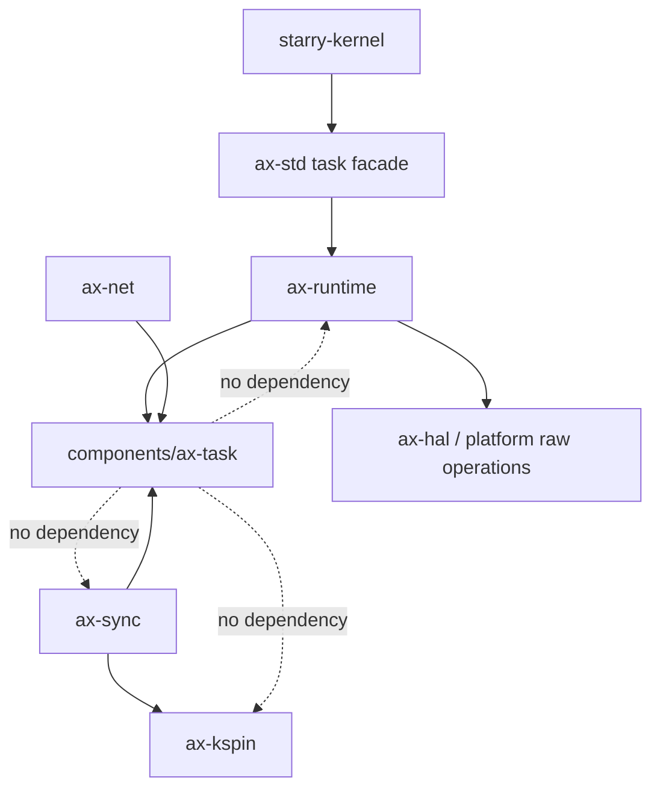
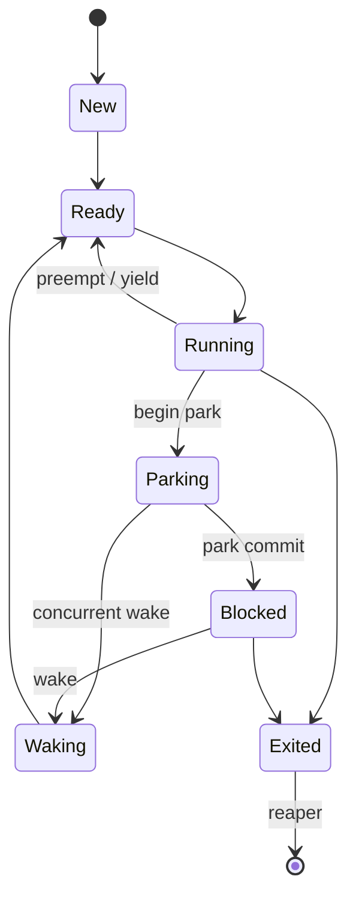

# `ax-task`

> 路径：`components/ax-task`
>
> 类型：`no_std + alloc` 库 crate
>
> 分层：共享组件 / OS 无关任务调度
>
> 版本：`0.7.0`

`ax-task` 是不持有全局调度器、per-CPU 静态变量或具体 OS 能力的任务调度库。
OS 显式创建一个固定地址的 `TaskSystem`，为每个 CPU 创建一个固定地址的
`CpuLocal`，再通过 `TaskRuntime` trait-ffi 注入 IRQ、时间、IPI、上下文、栈、TLS、
地址空间和诊断能力。

它始终按 IRQ、抢占和 SMP 安全语义编译，不再通过 `multitask`、`sched-rr`、
`sched-cfs`、`preempt` 或 `smp` feature 生成不同的调度器实现。

## 依赖边界



`ax-task` 不依赖 `ax-hal`、`ax-percpu`、`ax-ipi`、`ax-runtime`、`ax-mm`、
`ax-kspin`、`ax-sync`、`lock_api`、`spin` 或旧 `ax-sched`。内部临界区使用私有
ticket lock，并通过 `TaskRuntime` 的嵌套 IRQ guard 服务保存和恢复最外层 IRQ 状态。

## 对象模型

- `TaskSystem`：拓扑、online mask、generation-based 线程注册表、CPU 对象表、
  Deadline admission、PI 依赖图和系统统计的所有者。
- `CpuLocal`：owner CPU 唯一修改的 current/idle、Deadline/RT/Fair runqueue、
  remote wake/policy/migration/reclaim inbox、固定容量 timer heap 和粘滞
  `need_resched`。
- `ThreadId`：slot index 与 generation 的组合，slot 复用后旧 ID 必然失效。
- `ThreadHandle`：普通任务上下文中的强引用和控制句柄。
- `WeakThreadHandle`：普通任务上下文中的非拥有观察句柄。
- `ThreadWakeHandle`：直接指向稳定 wake header 的 IRQ-safe 唤醒能力，不通过全局
  ID map 查找。
- `ThreadResources`：runtime 创建的 context、stack、TLS 和 address-space opaque
  handle；线程 reaper 按 context → TLS → stack 的顺序释放。

线程生命周期使用受检查的转换：



## 调度策略

调度类顺序固定为：

```text
Deadline > RT FIFO/RR > Fair Normal/Batch > Fair Idle > CPU idle
```

- Fair 使用 Linux nice `-20..=19` 权重和 EEVDF 的 vruntime、lag eligibility、
  service request、virtual deadline。Normal 支持 wakeup preemption，Batch 不因普通
  wake 立即抢占，Idle 使用最低 fair 权重。
- FIFO 使用 `1..=99` 优先级；高优先级立即抢占，同优先级 wake 不抢占；被高优先级
  抢占时保留位置，主动 yield 才移到队尾。
- RR 与 FIFO 使用相同优先级域，默认 quantum 为 5 ms；仅在 quantum 到期且存在同级
  waiter 时轮转。
- Deadline 验证 `0 < runtime <= deadline <= period`，使用 absolute-deadline EDF 与
  CBS 预算、throttle、replenishment、miss/overrun 统计。GRUB reclaim 通过
  ActiveContending、ActiveNonContending、Inactive 三态和 zero-lag 定时转换维护
  `this_bw`/`running_bw`，不会在任务刚阻塞时提前借出带宽。默认 root-domain
  admission cap 为 95%，Deadline 线程 affinity 必须覆盖完整 online root domain。
- RT bandwidth 默认每 CPU `950 ms / 1 s`。PI owner 可进入有记录的 critical rescue
  直至 unlock，防止 quota 或 donor CBS 耗尽造成锁死。

`ax-sync` 负责 PI mutex 的短元数据临界区和 waiter 排序；`ax-task` 负责 base/effective
policy、传递式 donation、owner runqueue 重排、远端 IPI、Deadline donor CBS 记账和
unlock 后撤销。

## SMP 与 IRQ 约束

每个 runqueue 只允许 owner CPU 修改。远端 wake 和 policy/migration 更新使用嵌入对象
的 intrusive MPSC inbox；发布端只做有界原子操作并按 epoch 合并 scheduler IPI，不会
获取远端 runqueue 锁。owner 每个安全点最多 drain 配置的 batch 数，未清空时保留
`need_resched`。

timer heap 在 `CpuLocal` 创建时按配置一次性预分配，默认容量 4096。IRQ expiry 每次
最多处理 64 个节点，把事件复制到预分配输出区，不扩容、不释放、不调用 callback。

idle 路径固定执行：发布 polling → memory barrier → 重查 runqueue/inbox/
`need_resched` → WFI。`need_resched` 只有真正进入 scheduler 后才能清除。

## `TaskRuntime` 接入

`TaskRuntime` 使用显式 Rust ABI trait-ffi。边界只传 `repr(C)`/`repr(transparent)` 值、
opaque handle、整数和静态函数；不传引用、`Arc`、`Future` 或 trait object。

ArceOS 的实现位于 `os/arceos/modules/axruntime/src/task.rs`：

1. 主核和副核先完成架构 per-CPU 与 runtime guard state。
2. runtime 创建并固定 `TaskSystem`/`CpuLocal`，安装 bootstrap 与 idle context。
3. timer 与 scheduler IPI handler 可用后才把 CPU 发布到 online mask。
4. timer IRQ 只做预算/时间片记账、bounded expiry、`need_resched` 和下一次 one-shot
   计算；scheduler IPI 只 ack epoch 并置 sticky reschedule。
5. IRQ-return 或最外层 preempt-enable 进入 scheduler safe point；调度状态和 current
   已提交、runqueue 锁已释放且 IRQ 仍关闭时，依次执行 previous switch-out hook、安装
   next 地址空间、执行 next switch-in hook，最后切换 context。

其他 OS 应创建自己的对象并实现同一能力边界；crate 不提供默认 host runtime 符号，
每个测试二进制使用独立 fake runtime。

## 单线程协程执行器

`LocalExecutor` 绑定 owner `ThreadId`，future 只由 owner thread poll/drop，因此支持
`!Send` future，owner thread 迁移 CPU 不改变所有权。每个 `CoroutineHeader` 保存 owner
ID、generation、原子状态和 intrusive node，并持有固定地址的 shared executor header；
shared header 保存 generation-checked `ThreadWakeHandle`，不依赖 CPU 固定位置。

自定义 `RawWaker` 的 clone/wake/wake_by_ref/drop 均不分配、不释放、不 poll、不调用
用户代码、不获取 blocking/remote-runqueue lock。重复 wake 通过 `RUN_QUEUED` CAS
合并；self-wake 进入下一批；每批最多 poll 64 个 coroutine。owner 在 completion、取消
或 executor shutdown 时先清空并销毁 `!Send` future；最后一个 waker 即使在 hard IRQ
释放也只发布 task-system deferred-reclaim node，header 内存随后由普通任务上下文的
有界 reaper 回收。

## 验证要求

- `scripts/test/test_ax_task_boundary.py` 固定新路径、旧 crate 删除、forbidden dependency、
  无 scheduler/per-CPU 全局状态和 Cargo 图边界。
- host model 测试覆盖线程状态、调度类顺序、EEVDF/RT/CBS、Deadline admission、PI、
  generation ID、bounded inbox/timer 与 executor wake/reclaim。
- 并发测试必须覆盖 wake-before/during-park、远端 inbox publication、policy requeue、
  migration、IPI epoch、late waker、timer cancel/complete/reclaim 和 PI donor accounting。
- 系统测试需要在 SMP1/SMP2/SMP4 上覆盖普通调度、RT/DL、remote IRQ wake、affinity、
  balance、Starry 调度 ABI，并覆盖 x86_64、aarch64、riscv64、loongarch64。

本轮不支持 CPU hotplug、NUMA、cgroup/energy-aware scheduling、异构 CPU capacity、
FUTEX_PI、IRQ threaded handler、动态卸载或通用跨线程异步执行池。
