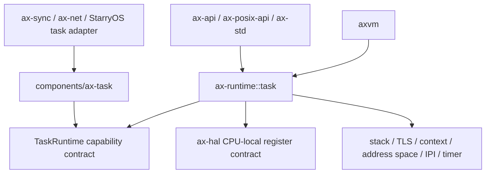
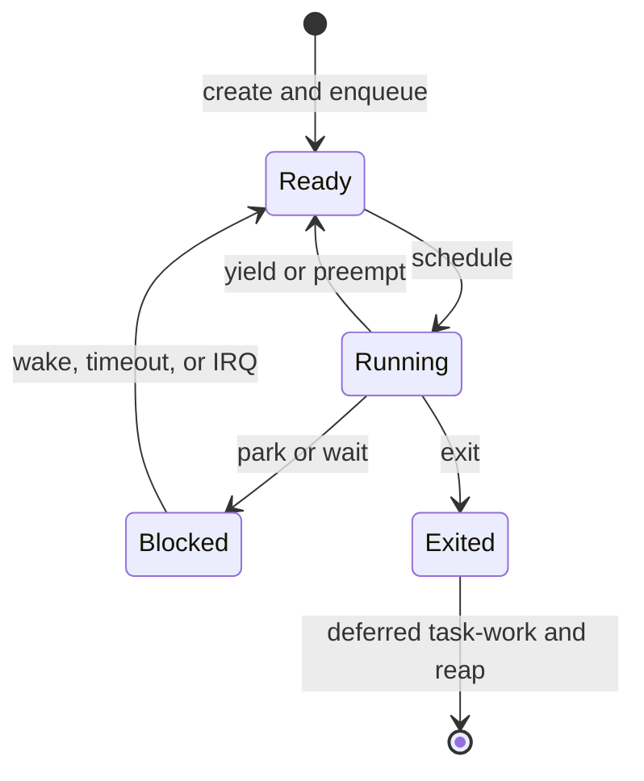

# `ax-task`

> 路径：`components/ax-task`
> 类型：库 crate
> 分层：组件层 / OS 无关任务调度核心
> 版本：`0.7.0`
> 文档依据：`Cargo.toml`、`src/lib.rs`、`src/runtime.rs`、`src/facade.rs`、`src/system/*`、`src/thread/*`、`src/scheduler/*`、`src/wait_queue.rs`、`src/irq_wait.rs`、`src/executor/*`

`ax-task` 提供不依赖具体 OS、体系结构和全局单例的 IRQ-safe SMP 任务调度核心。
它负责线程身份与生命周期、每 CPU 调度状态、运行时调度策略、阻塞/唤醒协议、
定时事件、优先级继承和延迟回收；栈、TLS、体系结构上下文、页表、IRQ guard、
IPI、时钟和 idle wait 等资源由接入它的 OS runtime 持有。

## 分层边界


```mermaid
graph TD
    consumers["ax-sync / ax-net / StarryOS task adapter"] --> core["components/ax-task"]
    core --> contract["TaskRuntime capability contract"]
    runtime["ax-runtime::task"] --> contract
    runtime --> cpu["ax-hal CPU-local register contract"]
    runtime --> resources["stack / TLS / context / address space / IPI / timer"]
    api["ax-api / ax-posix-api / ax-std"] --> runtime
    axvm["axvm"] --> runtime
```

- `ax-task` 不分配内核栈，不读写 CPU-local 寄存器，也不直接切换页表或体系结构上下文。
- `ax-runtime::task` 实现 `TaskRuntime`，并拥有 ArceOS/StarryOS 实际使用的全局
  `TaskSystem`、每 CPU `CpuLocal` 和运行时资源。
- `ax-sync`、`ax-net` 等底层 crate 可以直接依赖核心的句柄、等待和 worker 能力，
  避免形成对 `ax-runtime` 的反向依赖环。
- StarryOS 通过自己的 task adapter 保存 Linux TID/PID、signal、scope、perf 和
  exit 状态；核心线程身份不会直接作为用户态 TID。

## 核心模型

### 显式系统与每 CPU 所有权

- `TaskSystem` 保存线程注册表、跨 CPU 调度状态、负载均衡、延迟回收和远程投递状态。
- 每个上线 CPU 拥有一个固定地址、已 pin 的 `CpuLocal`。
- `CpuRemote` 只提供跨 CPU 可用的远程端点；owner-only 状态必须由当前 CPU 在
  runtime guard 下访问。
- 核心不创建隐藏的全局调度器，OS 必须显式创建和发布系统及 CPU-local 对象。

### 线程身份与句柄

- `ThreadId` 同时携带 registry slot 和 reuse generation；slot 被复用后，旧身份
  无法通过 registry 校验，从而避免 ABA。
- `ThreadHandle` 是强引用句柄，提供生命周期、策略、亲和、join 和扩展访问。
- `ThreadWakeHandle` 是仅用于唤醒的能力，底层服务无需持有完整线程对象。
- `ThreadExtension` 通过稳定回调表把 OS 自有状态挂到线程上，核心只负责在
  switch、exit、deadline overrun 和 drop 边界触发回调。

### 生命周期


```mermaid
stateDiagram-v2
    [*] --> Ready: create and enqueue
    Ready --> Running: schedule
    Running --> Ready: yield or preempt
    Running --> Blocked: park or wait
    Blocked --> Ready: wake, timeout, or IRQ
    Running --> Exited: exit
    Exited --> [*]: deferred task-work and reap
```

线程进入阻塞状态时使用 prepare/publish/commit 握手，避免条件变化与 park 之间丢失
唤醒。退出后的回调、资源释放和 registry 回收由 deferred task-work 在任务上下文
中完成，硬 IRQ 路径只做有界、无分配的投递。

## 调度策略

`SchedulePolicy` 在运行时选择策略，不再通过 `sched-cfs`、`sched-rr` 等 feature
固定整套内核：

- `Fair`：EEVDF 公平调度，使用 `Nice` 和 `FairMode`。
- `Fifo`：固定优先级 FIFO，使用 POSIX `RtPriority`。
- `RoundRobin`：固定优先级 RR，并携带可查询的 quantum。
- `Deadline`：EDF + CBS accounting，参数由 `DeadlinePolicy` 校验。

普通线程默认使用 `Fair` / nice 0。亲和性由 `CpuSet` 表达，远程更新和当前线程迁移
分别遵守各自的发布与安全点协议。

## 等待、IRQ 与 future

- `WaitQueue` 提供任务上下文的条件等待、截止时间等待和通知。
- `IrqWaitCell` / `IrqWakeHandle` 把 IRQ 生产者与任务消费者连接起来；注册和投递
  采用有界协议。
- `LocalExecutor` 把 Rust `Future` 绑定到一个 generation-valid
  `ThreadWakeHandle`，但不包含 StarryOS 的 signal/restart 语义。
- ArceOS 的同步 `block_on`、sleep/timeout glue 位于 `ax-runtime::task`；
  StarryOS 的 signal-interruptible future 包装位于
  `os/StarryOS/kernel/src/task/future.rs`。

## `TaskRuntime` 能力边界

`src/runtime.rs` 使用值类型、透明 opaque handle 和函数指针描述 OS 能力。主要能力
包括：

- 查询当前 `TaskSystem`、当前 CPU owner handle 和远程 CPU handle。
- 嵌套 IRQ/preemption guard 与 scheduler baton 转换。
- monotonic time、oneshot timer、scheduler IPI 和 idle wait。
- 分配/释放 stack、TLS、kernel/user context 和 address space。
- 绑定线程身份、准备上下文切换、完成 switch tail 与回收旧资源。
- 安装地址空间、刷新 TLB，以及报告不可恢复的 runtime invariant。

调度入口必须在 IRQ 关闭期间把最后一层普通 preemption depth 原子转换为 scheduler
baton；新上下文或恢复上下文完成 switch tail 后，才恢复对应的 IRQ/preemption
状态。

## ArceOS runtime 接入

实现位于 `os/arceos/modules/axruntime/src/task.rs` 和 `guard.rs`。当前 CPU-local
访问遵守 `cpu-local`/`ax-percpu` 的寄存器所有权标准：

- `cpu-local` 定义体系结构寄存器契约，`ax-percpu` 只提供 typed layout/storage。
- runtime 只在防迁移 guard 的非逃逸回调中获得 `CpuPin`。
- 当前上下文和当前线程 header 使用 `CurrentContext`、`CurrentThreadHeader`。
- 普通 preemption depth 和本 CPU `need_resched` 位由固定
  `CpuRuntimeAnchor` 持有，不随线程切换迁移。
- 上下文切换使用 prepared/previous binding token，incoming tail 消费旧 binding
  后，旧线程才允许在其他 CPU 运行。
- 不创建第二份“当前任务”per-CPU 指针，也不直接读写 raw TP。

启动顺序为：

1. per-CPU、allocator 和 early platform。
2. `TaskSystem`、本 CPU `CpuLocal` 与 bootstrap context。
3. IPI、IRQ 和 timer。
4. 发布 CPU online。
5. 启动 deferred task-work service。

次核建立 CPU-local、bootstrap 和 idle 线程后才上线。timer IRQ 执行有界 accounting
与 scheduler safe point；scheduler IPI handler 先确认当前投递，再允许新的远程
wake 重新投递。

## 常用接口

底层 crate 通常使用：

- `current_thread_handle()` / `current_thread_id()`
- `thread_handle()` / `ThreadHandle::wake_handle()`
- `WaitQueue` / `IrqWaitCell`
- `yield_current_cpu()` / `sleep()` / `sleep_until()`
- `set_thread_policy()` / `set_thread_affinity()`
- PI wait/wake 与 task-backed worker/executor API

ArceOS 应用和 POSIX API 使用 `ax_runtime::task` 的 spawn、join、sleep、yield、
address-space 和调度策略接口。`ax_std::os::arceos::modules::ax_task` 仅作为
`ax_runtime::task` 的兼容 re-export。

## 验证

核心最低验证：

```bash
cargo test -p ax-task
cargo xtask clippy --package ax-task
```

其中测试覆盖线程 registry、generation 校验、调度策略、SMP balance、timer、
wait/IRQ、PI、executor、task-work、上下文切换尾部和 loom 并发模型。

运行时改动还应分别验证：

- bootstrap 与 secondary CPU 上线顺序。
- scheduler baton、嵌套 IRQ guard 和 context switch tail。
- stack/TLS/address-space 创建、切换和回收。
- timer deadline、IPI 合并/重复投递、remote wake 和 SMP affinity。
- ArceOS 与 StarryOS 的四架构 QEMU task/system 组。
