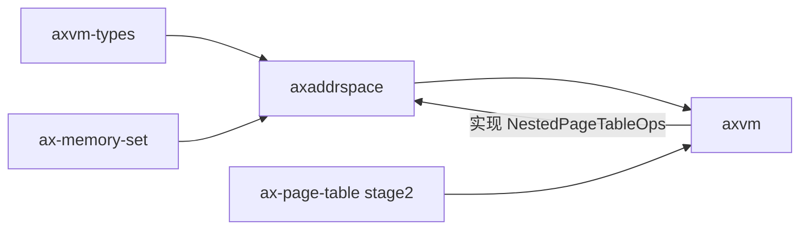

# `axaddrspace`

> 路径：`virtualization/axaddrspace`
> 类型：`no_std` 库 crate
> 分层：虚拟化策略层 / Guest 物理地址空间
> 版本：`0.5.16`

`axaddrspace` 管理 Guest 物理地址范围及其映射策略。它不拥有具体页表实现，也不直接依赖生产环境的 `ax-page-table`；页表和宿主页帧能力统一通过 `NestedPageTableOps` 注入。

## 组件边界



该依赖方向用于保证：

- `axaddrspace` 只表达 Guest RAM、线性映射、懒分配和事务规则；
- `ax-page-table` 提供 Stage-2/EPT/NPT 的机械实现；
- `axvm` 组合具体架构页表、宿主页来源和 `axaddrspace`；
- `axaddrspace` 不反向绑定某个 allocator 或页表 crate。

`ax-page-table` 只作为 `axaddrspace` 测试中的 dev-dependency，用于验证 capability adapter，不是生产直接依赖。

## 模块结构

| 模块 | 职责 |
| --- | --- |
| `address_space` | `AddrSpace<Npt>`、范围校验、map/unmap、fault 和地址翻译 |
| `address_space::backend` | `Linear`、`Alloc` 及 `ax-memory-set` 两阶段事务适配 |
| `paging` | `NestedPageTableOps` 和本层需要的 `PageSize` |
| `memory_accessor` | Guest 对象和缓冲区读写能力 |
| `error` | 可匹配的 `AddrSpaceError` 与 `AddrSpaceResult` |

Guest 地址、范围和 `MappingFlags` 来自 `axvm-types`，没有在本 crate 内重复定义。

## `NestedPageTableOps`

`NestedPageTableOps` 是地址空间真正需要的最小页表 capability：

- 查询根物理地址和页表层数；
- 分配、释放宿主页帧；
- 宿主物理地址到虚拟地址转换；
- map、unmap、remap、protect、query；
- 对连续范围执行 map/unmap。

接口的地址侧使用 `GuestPhysAddr`，说明本 crate 管理 GPA/IPA，不是 Guest 进程虚拟地址空间。

具体 `ax-page-table::stage2` 类型由 `axvm` adapter 实现该 trait。这样可以在测试中使用 mock NPT，也可以在不同架构上保持同一 `AddrSpace` 策略。

## `AddrSpace<Npt>`

核心状态包括：

```text
AddrSpace<Npt>
├── va_range: GuestPhysAddrRange
├── areas: MemorySet<Backend<Npt>>
└── pt: Npt
```

`new_empty(page_table, base, size)` 接收已经构造好的页表 capability。调用方不能只给一个层数让 `axaddrspace` 私自选择具体页表实现。

主要接口：

| 接口 | 语义 |
| --- | --- |
| `map_linear` | GPA 到已知 HPA 的固定偏移映射 |
| `map_alloc` | 由 NPT capability 分配宿主页，可立即填充或懒分配 |
| `unmap` | 事务化撤销指定 GPA 范围 |
| `handle_page_fault` | 检查 area 权限并把补页交给 backend |
| `translate` | 查询 GPA 对应 HPA |
| `translate_and_get_limit` | 返回 HPA 和当前 area 可访问边界 |
| `translated_byte_buffer` | 按页表查询结果切分宿主可访问片段 |

线性映射使用带符号的 `GPA - HPA` 差值，允许 HPA 高于或低于 GPA；构造和使用偏移时均检查越界。

## 映射事务

`Backend<Npt>` 实现 `ax-memory-set::MappingBackend`，使用 `prepare`、`commit`、`rollback` 和 `finalize`：

1. `prepare` 校验范围，预留保存旧映射所需的 `Vec` 容量，并记录每个 4 KiB 页的旧状态；
2. `commit` 执行 map、unmap 或 protect；
3. 任一页失败时，`rollback` 恢复已修改的 PTE；
4. unmap 全部提交后，`finalize` 才释放 allocation backend 拥有的宿主页。

`MapPrecondition::Vacant` 会拒绝覆盖已有 PTE。重叠替换必须由上层 `MemorySet` 事务明确组织，不能依靠 backend 静默覆盖。

## Backend 所有权

### `Linear`

`Linear` 不拥有宿主页，只保存带符号偏移。unmap 只撤销 PTE，不释放外部物理内存。

### `Alloc`

`Alloc { populate }` 通过 `NestedPageTableOps::alloc_frame` 获取宿主页：

- `populate = true`：map 事务中为全部页建立映射；
- `populate = false`：先发布 area，fault 时按需分配；
- map 回滚或最终 unmap 时，只释放本 backend 实际取得的 frame。

## Guest 内存访问

`GuestMemoryAccessor` 基于 `translate_and_get_limit` 提供对象和缓冲区读写。跨 area 的缓冲区操作逐段重新翻译，并使用 checked address advance；未映射、访问长度不足和地址溢出返回类型化错误。

该 trait 是 Guest 内存访问能力，不负责 DMA 映射、IOMMU domain 或设备生命周期。

## 依赖关系

生产直接依赖只有：

- `ax-memory-addr`：宿主物理和虚拟地址；
- `ax-memory-set`：VMA 集合及映射事务；
- `axvm-types`：Guest 地址和映射权限；
- `ax-lazyinit`、`log`、`thiserror`：初始化、诊断和错误类型。

主要消费者包括 `axvm`、`axdevice`、`axvisor_api` 和 Axvisor。Guest Stage-2 页表由这些组合层按架构提供。

## 验证

```bash
cargo test -p axaddrspace
cargo xtask clippy --package axaddrspace
```

测试覆盖线性映射、分配型映射、懒分配、范围和对齐错误、带符号偏移、事务回滚、页帧释放计数及 Guest buffer 访问。

系统验收还需要 Axvisor 对应架构构建、Guest RAM 压力测试和 Stage-2 fault 回归。
