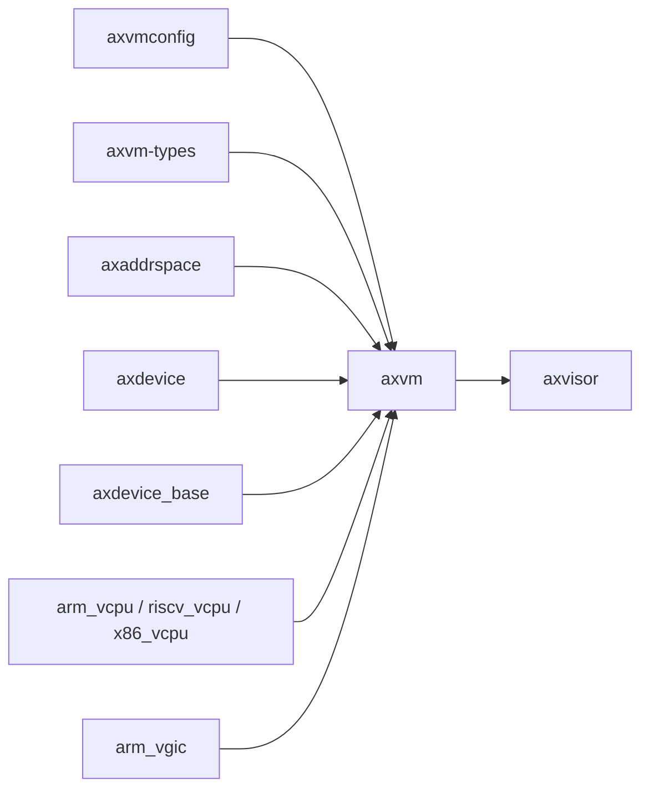

# `axvm`

> 路径：`virtualization/axvm`
> 类型：库 crate
> 分层：组件层 / 可复用基础组件
> 版本：`0.5.24`
> 文档依据：`Cargo.toml`、`README.md`、`src/lib.rs`、`src/lifecycle/{machine,status}.rs`、`src/runtime/vcpus.rs`、`src/vm/mod.rs`、`src/manager.rs`、`docs/lifecycle.md`、`docs/lifecycle-internals.md`

`axvm` 是 Axvisor 虚拟化软件栈中的“VM 资源管理层”。它不负责 Hypervisor 顶层编排，也不直接实现所有架构相关虚拟化细节，而是把虚拟机对象、vCPU 列表、客户机地址空间、设备集合和生命周期状态封装成一个统一的 `AxVM` 抽象，供上层 VMM 直接使用。

## 架构设计
### 设计定位
从职责上看，`axvm` 位于三类组件的交汇处：

- 向下依赖 `axvm-types`、各架构 vCPU crate、`axaddrspace`、`axdevice` 等组件，承接 vCPU、地址空间和设备模型。
- 向外通过 `src/host/` 的宿主 trait（`HostCpu`、`HostMemory`、`HostTime` 等，由 `ArceOsHost` 实现）把宿主能力注入进来，例如地址翻译、时间、当前 VM/vCPU/pCPU 信息和中断注入。
- 向上被 Axvisor 的 `vmm` 层直接调用，作为真正的 VM 实例与生命周期实体。

可以把 `axvm` 理解为“可被 Hypervisor 编排的 VM 对象层”，而不是顶层 Hypervisor 程序。

### 模块结构
- `src/lib.rs`：crate 入口，导出 `AxVM`、`AxVMRef`、`VMMemoryRegion`、`VmStatus`/`StopReason`、`config` 等。
- `src/lifecycle/`：VM 生命周期状态机权威实现——`machine.rs`（内部状态机 `Machine<R, H>` 及 `start_with`/`request_stop_with`/`finish_stop`/`pause`/`resume`/`reset_with`/`destroy_with` 等转换函数）、`status.rs`（对外枚举 `VmStatus`/`StopReason` 与 `as_str()`）。
- `src/vm/mod.rs`：`AxVM` 高层对象，把生命周期操作暴露为 `start()`、`pause()`、`resume()`、`stop()`、`reset()`、`destroy()`、`status()`，并提供 `stop_and_join_runtime`（强制静默）等内部路径。
- `src/runtime/`：vCPU task 主循环（`vcpus.rs` 的 `vcpu_run`）、runtime 编排（`mod.rs`）与 hypercall/IVC 通道。
- `src/manager.rs`：全局 VM 注册表与 `create_vm_from_toml`/`remove_vm` 等管理入口。
- `src/config.rs`：把 `axvmconfig` 的 TOML 侧配置转成运行时 `AxVMConfig`、`AxVCpuConfig`、`VMImageConfig`、`PhysCpuList` 等结构。

### 1.3 关键数据结构
- `AxVM`（`AxVMRef = Arc<AxVM>`）：虚拟机主对象，由 manager 注册表持有，生命周期操作见 §2.2。
- `Machine<AxVMResources, Arc<VmRuntimeHandle>>`：`AxVM.machine` 字段持有的生命周期状态机（见 §1.4），`AxVMResources` 承载 vCPU/设备/地址空间等架构资源；`VmRuntimeHandle` 承载运行态资源（vCPU 等待队列、task 注册表、中断缓冲、中断路由、退出计数），仅在 `Running`/`Paused`/`Stopping` 期间存活（见 lifecycle-internals.md §1）。
- `VMMemoryRegion`：记录客户机物理地址、宿主虚拟地址、布局信息和是否需要回收。
- `VmStatus`：`Ready`、`Running`、`Pausing`、`Paused`、`Stopping`、`Stopped`、`Destroying`、`Destroyed`、`Failed`，描述 VM 生命周期（`Pausing` 为预留态，当前无转换写入）。
- `VcpuSnapshot`：对外暴露的架构无关 vCPU 状态快照。
- `AxVMConfig` / `AxVMCrateConfig`：前者用于运行时 VM 创建，后者更贴近 TOML 配置源。

### 1.4 VM 生命周期与主线
VM 生命周期状态机的**权威参考**是 crate 内文档 `virtualization/axvm/docs/lifecycle.md`（对外状态模型：
完整状态图、转换规则表与源码行号对照）与 `docs/lifecycle-internals.md`（实现者视角：内部状态图、
生命周期 × runtime 双维度、runtime 生命周期、不可观测状态与锁语义）。此处只做概要。

状态机（`src/lifecycle/machine.rs` 的 `Machine<R, H>`，对外由 `src/lifecycle/status.rs` 的 `VmStatus`
暴露）为 9 状态：`Ready`、`Running`、`Pausing`（预留）、`Paused`、`Stopping`、`Stopped`、
`Destroying`、`Destroyed`、`Failed`。核心主线：

1. `AxVM::new(config)` → `Ready`：VM 已创建、尚未启动。
2. `start()`（`start_with`）→ `Running`：同步、原子，无 "starting" 过渡态；runtime 存活，vCPU task 已入队（协作式调度下不保证已执行第一条指令，见 lifecycle-internals.md §1.3）。
3. `pause()` → `Paused`、`resume()` → `Running`：`pause` 是请求语义（状态立即翻转到 `Paused`，
   但无确认 API 证明 vCPU 已暂停），只翻 flag + suspend 设备；vCPU 在下次 VM-exit 才观察到
   `suspending()`，`resume` 通过 `notify_all_vcpus` 唤醒。
4. `stop(reason)`（`request_stop_with`）：从 `Running`/`Paused` → `Stopping`（异步请求，只置标志即返回）；
   从 `Ready` → `Stopped`（同步直达，vCPU 从未运行、无需收敛）。最后一个正常退出的 vCPU 在自身退出路径
   调 `finish_stop`（`src/runtime/vcpus.rs`）才到 `Stopped`。
5. `destroy()`：对运行态先 `stop_and_join_runtime(Forced)` 强制静默，再释放资源到 `Destroyed`（终态）。
   `reset()` 为分步：强制静默 → `reset_with`（→`Ready`）→ prepare → `start()`。

语义要点：

- `stop`/`pause` 都是**请求而非完成**：`Stopping`/`Paused` 只代表状态机翻转，vCPU 要等下一次 VM-exit
  才观察到；掩中断忙循环的 guest 永不 VM-exit，`Stopping` 可能无限期停留（wedged）。
- `Failed` 是终态（转换闭包失败进入），只能 `destroy` 离开。
- 状态机另有 `Switching` 内部态（转换函数入口占位，持锁期间不可观测，对外映射为 `Failed`）；
  `Destroying` 同理，`destroy_with` 全程持 machine lock，正常路径不可观测；但**清理闭包失败时不回滚**，
  `status()` 可观测到 `Destroying`，重试 `destroy()` 可到 `Destroyed`（见 lifecycle-internals.md §4）。

### 1.5 架构相关分层
`axvm` 自身不把所有架构细节写死，而是通过 `src/vcpu.rs` 做一层统一绑定：

- `x86_64`：对接 `x86_vcpu`，在运行时选择 VMX 或 SVM 路径。
- `riscv64`：对接 `riscv_vcpu`。
- `aarch64`：对接 `arm_vcpu`，并与 `arm_vgic` 协作处理中断控制器与虚拟定时设备。

同时，架构 vCPU crate 只保留贴近硬件的后端能力，统一生命周期和运行循环在 `axvm` 中完成。

## 核心功能
### 功能概览
- 管理虚拟机对象生命周期：创建、初始化、启动、停止。
- 管理 vCPU 列表与物理 CPU 亲和信息。
- 管理客户机地址空间和内存区域。
- 管理直通设备与仿真设备配置。
- 统一处理 VM exit，并把硬件相关能力通过 HAL 向上层隔离。

### 2.2 关键 API
- `AxVM::new(config)`：创建 VM 对象（`Ready`）。
- `AxVM::start()`：`Ready`/`Stopped` → `Running`，同步重建 runtime（vCPU/设备/中断架构，RAM backing 保留）。
- `AxVM::pause()` / `resume()`：`Running` ↔ `Paused`；`pause` 为请求语义，vCPU 异步观察。
- `AxVM::stop(reason)`：请求停止（异步），返回即 `Stopping`；`Stopped` 需等最后一个 vCPU 退出。
- `AxVM::reset()`：分步强制静默 → `Ready` → 重新 `start()`。
- `AxVM::destroy()`：强制静默后释放资源到 `Destroyed`。
- `AxVM::status()` / `running()` / `stopping()` / `suspending()` / `stopped()`：状态查询。
- `AxVM::alloc_ivc_channel()` / `release_ivc_channel()`：IVC 通道管理。

### 使用场景
`axvm` 最典型的消费方不是应用程序，而是 VMM：

- 根据 TOML 配置创建一个 VM。
- 准备内存映射、内核镜像和设备配置。
- 在上层任务系统中为每个 vCPU 分配执行实体（`src/runtime/vcpus.rs` 的 `vcpu_run` 主循环）。
- 在 vCPU 主循环中处理 hypercall、MMIO、外部中断等 VM exit 事件。

### 2.4 使用示意
```rust
// 伪代码：以 Arc<AxVM> 为句柄驱动生命周期
let vm = AxVM::new(config)?;          // -> Ready
vm.start()?;                          // -> Running，vCPU task 由 runtime 内部 spawn
vm.pause()?;                          // -> Paused（请求语义）
vm.resume()?;                         // -> Running
vm.stop(StopReason::Clean)?;          // -> Stopping（异步），等 vCPU 退出后 Stopped
vm.destroy()?;                        // -> Destroyed
```

实际使用由 `virtualization/axvm/src/runtime/*` 与 `src/manager.rs` 编排，而不是由普通库使用者直接手写。

## 依赖关系


### 直接依赖
- `axvm-types`：提供 VM/vCPU 共享值类型、架构协议 trait 和 VM exit 原因。
- `axaddrspace`：提供客户机地址空间管理与 GPA 映射能力。
- `axdevice`、`axdevice_base`：提供虚拟设备与直通设备建模。
- `axvmconfig`：提供从配置文件到运行时结构的配置来源。
- 架构相关 vCPU crate：`x86_vcpu`、`riscv_vcpu`、`arm_vcpu`。
- `arm_vgic`：在 AArch64 路径上参与虚拟中断控制器与定时设备支持。

### 间接依赖
- `ax-page-table-multiarch`、`ax-page-table-entry`：通过地址空间和页表路径参与 VM 内存管理。
- `ax-memory-set` 等：在地址空间和内存建模路径上间接提供支撑。
- `axvisor_api` 生态：更多出现在消费者侧，但会影响 `axvm` 的宿主接入方式。

### 3.3 关键直接消费者
当前仓库内最重要、也是几乎唯一的直接消费者是 `os/axvisor`。它通过 `axvm` 的 manager 注册表
（`src/manager.rs` 的 `AxvmRuntime::start_vm`/`stop_vm` 等）与 `AxVMRef` 操作 VM，经 AxVisor 侧
`create_vm_from_toml`（os/axvisor/src/manager.rs:45）编排创建，并围绕它组织 vCPU 任务、配置加载与
控制台命令。

## 开发指南
### 接入方式
```toml
[dependencies]
axvm = { workspace = true }
```

`axvm` 不提供 `vmx` 或 `svm` feature。x86 后端在 AxVM 初始化时由 CPU 能力选择，并在所有参与虚拟化的物理 CPU 上验证一致性。Nested page table 层级由运行时硬件能力探测和 VM 配置共同决定。

### 4.2 初始化顺序
1. 先从 `axvmconfig` 或其他来源构造 `AxVMConfig`。
2. 调 `AxVM::new()` 创建 VM 对象（`Ready`）。
3. 由上层 VMM 调 `start()` 绑定 vCPU、设备并重建 runtime（`Running`）。
4. `start()` 内部为每个 vCPU spawn task（`src/runtime/vcpus.rs` 的 `vcpu_run` 主循环）。
5. 停止时 `stop()`（`Stopping`）→ 最后一个 vCPU 退出调 `finish_stop` → `Stopped`；`destroy()` 强制静默后释放资源。

### 4.3 开发注意事项
- 修改 `src/vm/prepare/`（vCPU/设备/地址空间准备）时，要同时验证三条子路径：vCPU 创建、设备初始化、
  地址空间映射（对应 prepare/ 下 vcpus.rs / devices.rs / address_space.rs 各自的构建逻辑）。
- 修改 `VmStatus`/`Machine` 时，要同步检查上层 VMM 的状态机是否仍匹配（对外状态权威参考见 `virtualization/axvm/docs/lifecycle.md`，`Machine`/`VmRuntimeHandle` 双维度见 `docs/lifecycle-internals.md` §1）。
- 修改 `src/runtime/vcpus.rs` 的 vCPU 主循环时，要把这类改动视为 Hypervisor 热路径改动，优先关注 VM exit 分类和错误恢复。
- 修改 `src/host/` 的宿主适配（`HostCpu`/`HostMemory`/`HostTime` 等 trait）时，要同步验证 Axvisor 的宿主侧实现，否则整个虚拟化栈会失配。

## 测试
### 单元测试
当前 crate 内没有完整的 `tests/` 目录，说明 `axvm` 的主要验证方式不是普通 host 单元测试，而是与真实 VMM 路径集成验证。后续若补充单元测试，优先覆盖：

- `VmStatus` 状态转换（`src/lifecycle/machine.rs` 已内置覆盖非法转换与 reset/destroy 拒止的测试）。
- 内存区域合并、对齐和回收。
- 配置解析到运行时结构的转换边界。
- 错误输入下的失败路径。

### 集成测试
更重要的是系统级验证：

- Axvisor 的 VM 创建、启动、停止路径。
- AArch64、x86_64、RISC-V 三种架构相关适配。
- 直通设备与仿真设备场景。
- Guest 镜像可正常加载与启动。

### 5.3 覆盖率要求
- 生命周期主线必须覆盖：`new -> start -> pause/resume -> stop -> Stopped -> start()`（重启，
  `Stopped` 是静默态非终态）`-> Running -> stop -> Stopped -> destroy -> Destroyed`，并覆盖
  `reset()` 路径与 `request_stop`（异步）到 `finish_stop` 的完成路径。
- 至少要覆盖一种地址空间映射场景和一种设备处理场景。
- VM exit 热路径应通过集成测试覆盖成功与异常分支。
- `src/lifecycle/machine.rs` 已内置状态机单元测试（非法转换不改变状态、reset/destroy 在 runtime 存活时被拒等）。

## 跨项目定位
### ArceOS
`axvm` 与 ArceOS 的关系不是“标准模块依赖”，而是“运行在 ArceOS 宿主之上的虚拟化资源层”。它属于 ArceOS Hypervisor 生态的一部分，复用了 ArceOS 风格的组件化设计，但并不直接参与普通 ArceOS unikernel 的默认运行路径。

### StarryOS
当前仓库中没有发现 StarryOS 对 `axvm` 的直接依赖。若 StarryOS 参与虚拟化场景，更常见的是作为 Axvisor 的 guest，而不是把 `axvm` 直接链接进 `starry-kernel`。

### Axvisor
`axvm` 是 Axvisor VMM 的核心依赖之一。Axvisor 负责 VM 配置解析、镜像加载、vCPU 任务调度和控制台命令，而 `axvm` 负责真正承载 VM 对象、状态与底层资源。这种分层使得 Axvisor 可以专注于“编排”，而把“VM 资源生命周期”交给 `axvm` 处理。
