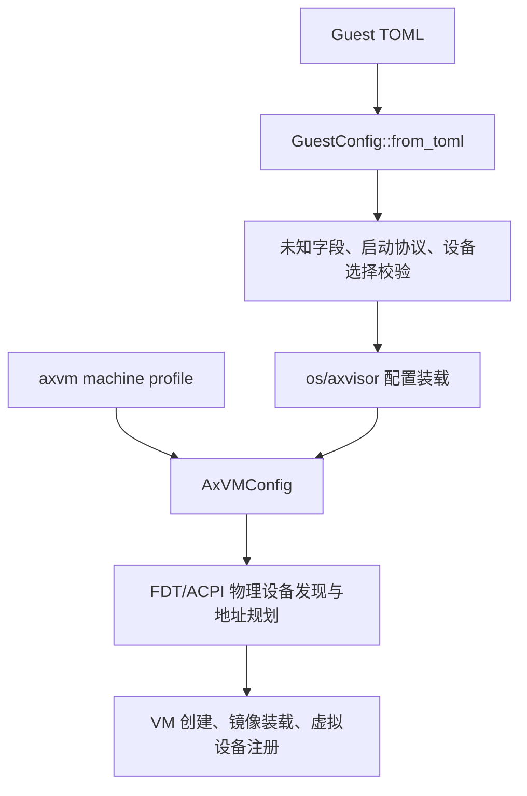

# `axvmconfig`

> 路径：`virtualization/axvmconfig`
> 类型：库 + 二进制混合 crate
> 分层：组件层 / 客户机配置模型
> 版本：`0.8.2`

`axvmconfig` 定义 Axvisor 面向用户的客户机 TOML 语义。它只表达客户机身份、CPU、镜像、内存以及物理设备选择；虚拟串口、中断控制器、定时器和固件接口等 machine 固有事实不属于配置。

## 架构设计

根结构是 `GuestConfig`：

- `base: VMBaseConfig`
- `kernel: VMKernelConfig`
- `devices: GuestDevices`

所有用户可见结构直接派生 `Serialize`、`Deserialize`，在宿主 `std` 构建中同时派生 `JsonSchema`，并启用 `deny_unknown_fields`。格式没有版本号，也不提供旧字段别名。

### 客户机类型

`GuestType` 只有两个值：

- `virtualized`：物理地址空间从空集开始，只加入 `devices.passthrough` 显式选择的设备。
- `passthrough`：从平台发现的全部 guest-assignable 物理设备开始，再移除 `devices.disabled`、宿主拥有的设备和 machine 虚拟资源。

`GuestType` 决定内部 `AddressSpacePolicy`，但后者不是用户字段。设备直通不隐含物理 IRQ 直达；运行时仍通过客户机虚拟中断控制器路由中断。

### 物理设备选择

`GuestDevices` 只包含：

```toml
[devices]
passthrough = [{ path = "/soc/ethernet@1000" }]
disabled = [{ path = "/soc/gpio@2000" }]
```

`PhysicalDeviceRef` 当前使用绝对设备树路径标识一个物理设备。它不携带地址、长度、IRQ 或设备类型；这些资源由平台发现层解析。路径必须以 `/` 开头且不能是根路径，同一设备不能同时出现在 `passthrough` 与 `disabled`。

宿主物理 UART 永远是 host-owned 设备，不能显式选择，也不会出现在 `passthrough` 客户机的默认集合中。每个客户机的虚拟串口由 `axvm::machine` 固定创建，因此配置中没有 `serial` 字段。

### 镜像与内存

`VMKernelConfig` 保留：

- 内核、固件、DTB、ramdisk 路径及加载地址
- `boot_protocol`
- `image_location`、`cmdline`、`disk_path`
- `memory_regions`

`VmMemConfig` 仍使用 `gpa`、`size`、`flags` 和 `map_type` 描述客户机内存。启动协议验证返回结构化错误，不以宽松回退掩盖无效组合。

## 数据流



`os/axvisor` 把 `GuestConfig` 转成内部 `AxVMConfig`，同时注入应用层 `SerialBackend`。machine profile 提供固定虚拟设备描述；用户配置不能覆盖这些资源。

## 工具能力

启用默认 `std` feature 后，crate 提供：

- `axvmconfig check --config-path <guest.toml>`：解析并验证配置。
- `axvmconfig generate ...`：生成按架构组织的模板。
- `schemars::JsonSchema`：供 `jkconfig` 和外部工具生成菜单。

Axvisor 的交互编辑入口是：

```bash
cargo xtask axvisor config vm <guest.toml>
```

该命令调用 `jkconfig::run::<GuestConfig>`；菜单只包含用户可配置字段，不出现串口型号、地址、IRQ、后端或启停项。

## 已移除的格式

以下字段会被当作未知字段拒绝：

- `version`、`vm_type`、`address_space_policy`、`interrupt_mode`
- `emu_devices`、数字设备类型、`cfg_list`
- `passthrough_devices`、`excluded_devices`
- `passthrough_addresses`、`passthrough_ports`
- `serial` 及任何裸设备地址或 IRQ

这是一次不向前兼容的格式重构；模板、仓库内客户机配置和工具必须同步迁移。

## 开发边界

- 用户策略属于 `axvmconfig`；machine 固有资源属于 `virtualization/axvm/src/machine.rs`。
- 物理设备资源解析属于平台 FDT/ACPI 发现层，不应重新泄漏为 TOML 数值字段。
- 新虚拟设备需要 machine profile、设备实现、中断路由和固件描述共同落地，不能通过扩张 `GuestDevices` 绕过边界。
- 新配置字段必须有未知字段拒绝、round-trip、模板和 menuconfig schema 覆盖。

## 验证

```bash
cargo test -p axvmconfig
cargo run -p axvmconfig -- check --config-path <guest.toml>
cargo xtask axvisor config vm --help
```

仓库测试还应验证所有 `os/axvisor/configs/vms/**/*.toml` 都能由当前 `GuestConfig` 解析，以及旧字段与串口字段全部被拒绝。
