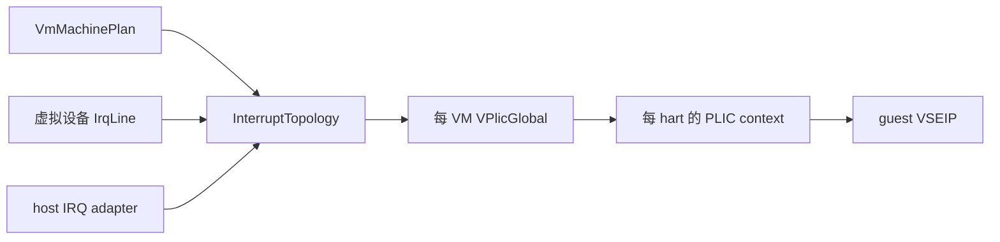

# `riscv_vplic`

> 路径：`virtualization/riscv_vplic`

## 定位

`riscv_vplic` 是一个 `no_std + alloc` 的、每 VM 独立的软件 PLIC。它实现 PLIC 1.0.0 的 guest MMIO 编程模型，并保存 priority、enable、pending、active、level、threshold 与 claim/complete 状态。

该 crate 不访问 host PLIC MMIO，也不假设 host 与 guest PLIC 地址相同。物理 IRQ 的 ownership、host claim/complete 和重新路由由 AxVM 的 host IRQ adapter 管理；adapter 只通过已经注册的中断拓扑输入向 vPLIC 更新 edge 或 level 状态。

## 架构边界



- 设备只持有 `IrqLine`，不认识 vCPU 或 PLIC context。
- `InterruptTopology` 负责把设备 source 连接到已分配的 PLIC source。
- `VPlicGlobal` 只拥有 guest 可见的寄存器和 delivery 状态。
- vCPU binding 负责 context 与 hart/vCPU 的关联。
- host IRQ adapter 位于 AxVM/平台边界，不属于 `riscv_vplic`。

## 主要接口

```rust
use axvm_types::GuestPhysAddr;
use riscv_vplic::VPlicGlobal;

let plic = VPlicGlobal::new(
    GuestPhysAddr::from(0x0c00_0000),
    Some(0x40_0000),
    2,
)?;

// 新机型必须显式建立 source ownership；空集合表示全部拒绝。
plic.restrict_to_assigned_sources();
plic.assign_source(10)?;

// edge source
plic.set_pending(10)?;

// level source
plic.set_source_level(10, true)?;
# Ok::<(), riscv_vplic::VplicError>(())
```

`VPlicGlobal::new()` 校验 MMIO 区间、溢出和 context 覆盖范围。`assign_source()` 与 `restrict_to_assigned_sources()` 建立本 VM 的 source ownership：未分配 source 的寄存器位表现为 RAZ/WI，输入 API 则返回 `VplicError::SourceNotAssigned`。

为了迁移旧的独立调用者，新对象在显式设置 assignment policy 前仍处于 unrestricted 状态；AxVM 创建控制器时会立即切换到 restricted 状态，并只分配 `VmMachinePlan` 中出现的 source。

## 中断状态机

- `set_pending(source)` 锁存一次 edge 请求。
- `set_source_level(source, true)` 记录电平并置 pending。
- claim 选择当前 context 中已 enable、priority 高于 threshold 的最高优先级 source；同优先级按较小 source ID 选择。
- claim 清 pending 并置 active。
- complete 清 active；若 level 仍为 asserted，则重新置 pending。
- 未分配 source 不可被设备输入触发，guest 对其 priority/enable 位的写入无效。

所有 VM 状态都位于对应的 `VPlicGlobal` 实例内，没有跨 VM 全局 pending/active 状态。寄存器状态转换在自旋锁内完成；host 物理控制器操作不在这个锁内发生。

## MMIO 与错误语义

当前寄存器访问只接受 32 位对齐访问，支持：

- source priority；
- pending bitmap（只读）；
- 每 context enable bitmap；
- 每 context priority threshold；
- claim/complete。

越界 source/context、缺失或过小的 aperture、错误宽度、未对齐和未实现寄存器都返回结构化 `VplicError`。在 `axdevice_base::BaseDeviceOps` 边界，这些错误转换为 `DeviceError`，生产路径不通过 panic 处理 guest 输入。

## 限制

- source 数量仍由 crate 的 PLIC 常量上限决定。
- 当前只建模 PLIC，不包含 AIA/APLIC/IMSIC。
- VSEIP 的最终同步依赖 AxVM 的当前 vCPU binding；跨 vCPU 唤醒由上层控制器适配层负责。
- 物理 IRQ ownership 和 host claim/complete 必须由平台 adapter 提供，不能通过 guest MMIO 隐式取得。

## 验证

```bash
cargo fmt --all
cargo xtask clippy --package riscv_vplic
cargo test -p riscv_vplic --all-features
RUSTDOCFLAGS="-Dwarnings" cargo doc -p riscv_vplic --no-deps
```
