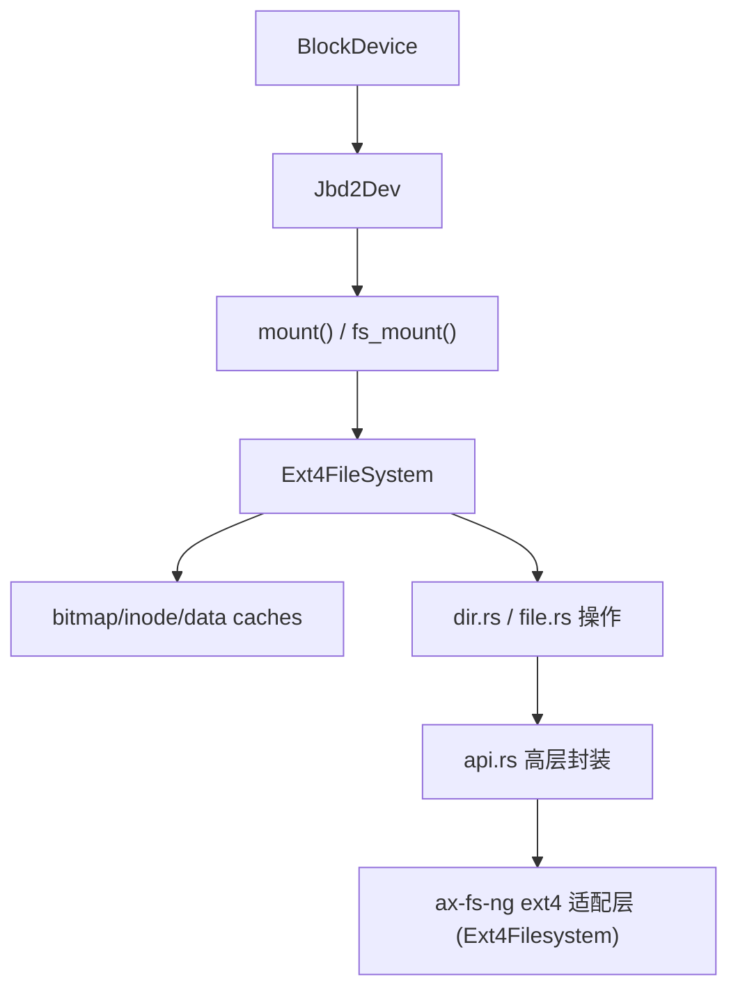
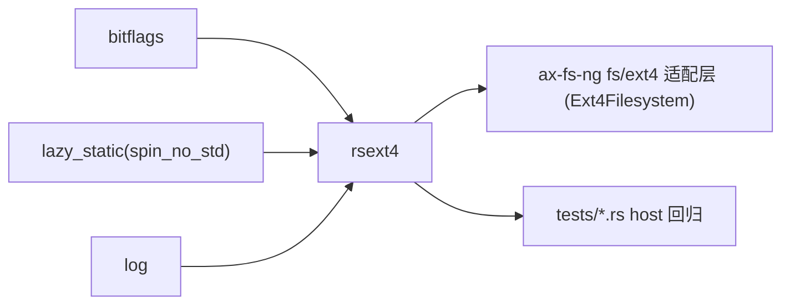

# `rsext4`

> 路径：`components/rsext4`
> 类型：库 crate（host 回归测试位于 `tests/`）
> 分层：组件层 / 可复用基础组件
> 版本：`0.1.0`
> 文档依据：`Cargo.toml`、`README.md`、`src/lib.rs`、`src/ext4/{mod,fs,sync,mount,mkfs}.rs`、`src/api/{mod,fs,io}.rs`、`src/blockdev/{mod,traits,journal,cached_device}.rs`、`src/jbd2/jbd2.rs`、`src/cache/{data_block,inode_table,bitmap}.rs`、`src/file/*`、`src/dir/*`、`tests/*.rs`、`os/arceos/modules/axfs-ng/src/fs/ext4/`

`rsext4` 是当前仓库里的独立 ext4 引擎。它自己定义块设备接口、挂载与卸载流程、目录/文件 API、JBD2 日志代理、多级缓存和若干 host 侧验证程序；在这棵代码树里，它是新 `ax-fs-ng` ext4 路径的**实际后端**（`ax-fs-ng` 的 `ext4` feature 即 `dep:rsext4`），而不是一条历史并行路线。

## 架构设计
### 设计定位
`rsext4` 的边界非常靠下：

- 它直接面向 ext4 语义和块设备，而不是面向统一 VFS trait。
- 它对外导出的接口既有高层 API（`mount`、`open`、`read_at`、`mkdir` 等），也有大量后端内部模块，属于“引擎 + 宽导出 API”的风格。
- 在当前仓库里，`ax-fs-ng` 通过 `os/arceos/modules/axfs-ng/src/fs/ext4/`（`Ext4Filesystem`、`Ext4Disk` 适配层）把它包装成 `axfs_ng_vfs::FilesystemOps`。StarryOS 的 ext4 根文件系统即由此路径提供。

### 模块结构
- `src/blockdev/{mod,traits,journal,cached_device}.rs`：定义 `BlockDevice` trait、`BlockDev` 缓冲封装（4 入口 clock LRU）以及 `Jbd2Dev`。
- `src/ext4/{mod,fs,mount,mkfs,sync,alloc,lookup}.rs`：文件系统核心对象 `Ext4FileSystem`，包含超级块、块组描述符、分配器和三层缓存。
- `src/api/{mod,fs,io,file_handle}.rs`：高层调用入口，如 `mount`、`umount`、`open`、`read_at`、`write_at`。
- `src/file/*`、`src/dir/*`：文件/目录操作，包括创建、删除、rename、link、symlink、truncate 等。
- `src/jbd2/*`：ordered 模式元数据日志提交与回放。
- `src/cache/{data_block,inode_table,bitmap}.rs`：三类缓存，各自维护 BTreeMap + LRU 访问计数。
- `tests/*.rs`：host 文件镜像驱动的回归用例（如 `host_persistence.rs`、`integration_test.rs`、`linux_image_repro.rs`、`cache_coherence_repro.rs`）。

### 1.3 核心对象与数据路径
`rsext4` 并不是单层 API，而是一条较完整的 ext4 数据通路：



### 1.4 关键机制
#### 固定 4 KiB ext4 block
`config.rs` 把 ext4 block size 固定为 `4096`，而 `BlockDevice::block_size()` 默认值是 `512`。因此像 `ax-fs-ng` 的 `Ext4Disk` 这种外层适配器必须负责把 512B block 设备转换成 `rsext4` 眼中的 4 KiB block 设备。

#### 多级缓存
默认 feature `USE_MULTILEVEL_CACHE` 开启时：

- 数据块缓存
- inode 表缓存
- 位图缓存

都会延迟写回。只有在显式 `flush_all()` / `sync_filesystem()` / `umount()` 或缓存淘汰时，脏数据才会真正落盘。

#### JBD2 代理
`Jbd2Dev` 的日志模型是：

- 只对元数据走 journal。
- `_mode == 0` 表示 ordered 模式。
- commit queue 达到阈值时会触发事务提交。
- 重放逻辑从 journal superblock 状态出发，尽量顺序回放完整事务。

也就是说，它更像“为 ext4 核心补上元数据日志持久化”的块设备代理，而不是完整实现 Linux 内核同等级的 JBD2 子系统。

### 1.5 与相邻 crate 的边界
- `rsext4` 在 `ax-fs-ng` 之下，只负责 ext4 格式语义，不负责根目录、当前目录或挂载名字空间。
- `rsext4` 和 `axfs-ng-vfs` 处于完全不同层级：前者是格式引擎，后者是 VFS 对象模型；`ax-fs-ng` 的 `fs/ext4/` 适配层负责把前者接入后者。
- 当前仓库里的 StarryOS 经 `ax-fs-ng` 的 ext4 路径直接使用它。

## 核心功能
### 功能概览
- `mkfs`、`mount`、`umount`。
- `open`/`lseek`/`read_at`/`write_at`。
- `mkdir`/`mkfile`/`delete_file`/`delete_dir`。
- `link`/`unlink`/`create_symbol_link`/`rename`/`mv`。
- `truncate`、extent 解析、洞区读零。

### 2.2 关键实现细节
#### 文件句柄
`OpenFile` 持有：

- `inode_num`
- `path`
- `inode`
- `offset`

读取和写入都会基于该 offset 推进，并在必要时刷新 inode 状态。

#### extent 读取
`src/api/io.rs::read_at()` 在 ext4 extent 模式下会先解析逻辑块到物理块映射，再逐块读取；如果遇到洞区，则直接用 `0` 填充返回结果。

#### 全量同步
`Ext4FileSystem::sync_filesystem()` 会依次：

1. 刷新数据块缓存
2. 刷新 inode 表缓存
3. 刷新位图缓存
4. 写回块组描述符
5. 写回超级块
6. 刷新底层块设备

这条顺序在默认多级缓存打开时尤其重要。

### 2.3 真实限制与注意事项
- README 已明确说明：默认启用多级缓存时，写操作不会立即落盘，关键持久化时机必须显式同步。
- 当前 journal 主要围绕 metadata ordered 模式组织，不是多模式通用实现。
- `src/lib.rs` 直接 `pub use` 大量后端模块，说明这个 crate 对上层暴露的是“偏底层引擎接口”，而不是收敛后的极简 facade。
- `src/lib.rs` 头部仅有 `#![no_std]`（无 `#![deny(warnings)]`）；构建不会因普通告警而失败。

## 依赖关系


### 直接依赖
- `bitflags`：位图与标志位表达。
- `lazy_static`：no_std 下的静态对象辅助。
- `log`：调试与事务日志输出。

### 主要消费者
- `ax-fs-ng` 的 `fs/ext4` 路径（`Ext4Filesystem` / `Ext4Disk`）：当前仓库里的主要生产消费者，StarryOS ext4 根文件系统即经此路径。
- `tests/*.rs`：host 侧文件镜像驱动的回归程序。

### 3.3 与相邻 crate 的关系
- `rsext4` 只解决 ext4，不解决统一文件系统接口。
- `ax-fs-ng` 的 `fs/ext4` 适配层负责把它翻译成 `axfs_ng_vfs` 所需的节点语义。
- 当前仓库中没有 `lwext4_rust`；ext4 由 `rsext4` 提供。

## 开发指南
### 接入方式
```toml
[dependencies]
rsext4 = { workspace = true }
```

如果你是在 `ax-fs-ng` 栈中接入，一般不会直接暴露 `rsext4` 给上层，而是通过 `fs/ext4` 适配层消费。

### 4.2 使用与改动约束
1. 先实现 `BlockDevice`，再用 `Jbd2Dev::initial_jbd2dev()` 包装。
2. 在需要“真正落盘”的边界上调用 `sync_filesystem()`、`umount()` 或显式 flush。
3. 修改缓存实现时，必须同时考虑淘汰写回、顺序同步和 journal 回放三条路径。
4. 修改 block size、superblock 或块组描述符相关代码时，要重新验证 `ax-fs-ng` 的 512B/4096B 适配层（`fs/ext4/mod.rs` 的 `Ext4Disk`）。

### 4.3 扩展建议
- 如果你只是想在系统里“支持 ext4”，优先在外层做 VFS 适配，不要直接把 `rsext4` 暴露给所有调用者。
- 如果你改的是 JBD2 路径，最好保留 `tests/` 那套 host 镜像回归（如 `host_persistence.rs`、`linux_image_repro.rs`），因为它能覆盖断电重放等系统外很难复现的路径。
- 如果你打算继续增强 ext4 元数据或缓存能力，应优先保持 `sync_filesystem()` 的写回顺序稳定。

## 测试
### 测试覆盖
`rsext4` 的测试覆盖明显强于其它几个目标 crate：

- 多个后端模块自带 `#[test]`，覆盖位图、块组描述符、extent、缓存、CRC32C、JBD2 结构等。
- `tests/*.rs` 会在 host 文件镜像上执行 mkfs、mount、大文件 IO、link/unlink、symlink、truncate、journal 回放、断电持久化等场景。
- `tests/host_persistence.rs`、`tests/linux_image_repro.rs`、`tests/cache_coherence_repro.rs`、`tests/file_operations.rs` 则是这些场景的集中用例库。

### 单元测试
- extent 映射与洞区读取。
- 三层缓存的淘汰与写回。
- superblock / group descriptor / bitmap checksum。
- JBD2 descriptor / commit / replay 的结构与顺序。

### 集成测试
- `ax-fs-ng` 的 `fs/ext4` 适配层与 `rsext4` 的联调。
- 512B 底层块设备经过 4 KiB block 适配后的读写正确性。
- journal 打开后的断电回放。

### 5.4 高风险回归点
- 默认多级缓存打开时的持久化语义。
- `Jbd2Dev` 元数据写回顺序。
- `truncate`、`mv`、`link`、`symlink` 组合路径。
- `ax-fs-ng` 适配层对 block size 的换算。

## 跨项目定位
### ArceOS
在 ArceOS 文件系统栈里，`rsext4` 是 ext4 叶子格式引擎。它通过 `ax-fs-ng` 的 `fs/ext4` 适配层进入系统，而不是直接成为统一文件 API。

### StarryOS
当前仓库里的 StarryOS 主线经 `ax-fs-ng` 的 ext4 路径直接依赖 `rsext4`——它是 StarryOS ext4 根文件系统的实际后端（x86_64/riscv64 自编译均使用此路径），而非历史并行路线。

### Axvisor
当前仓库里的 `os/axvisor` 没有直接依赖 `rsext4`。它在这棵代码树中的跨项目定位主要是“ArceOS/StarryOS 文件系统栈的 ext4 引擎”，而不是 Axvisor 当前公共文件系统层。
