# 层级关系

> 统计概览见 [组件概述](/docs/components)。

```mermaid
flowchart TB
  direction TB
  L16["<b>层级 16</b><br/>堆叠层（依赖更底层 crate）<br/>`arceos-affinity`、`arceos-display`、`arceos-exception`、`arceos-fs-shell`、`arceos-irq`、`arceos-memtest`、`arceos-net-echoserver`、`arceos-net-httpclient`、`arceos-net-httpserver`、`arceos-net-udpserver`、`arceos-parallel`、`arceos-priority`、`arceos-sleep`、`arceos-tls`、`arceos-wait-queue`、`arceos-yield`、`arceos-helloworld`、`arceos-httpclient`、`arceos-httpserver` …共21个"]
  classDef ls16 fill:#eceff1,stroke:#455a64,stroke-width:2px,color:#000
  class L16 ls16
  L15["<b>层级 15</b><br/>堆叠层（依赖更底层 crate）<br/>`ax-libc`、`ax-std`、`starryos`、`starryos-test`"]
  classDef ls15 fill:#f8bbd0,stroke:#c2185b,stroke-width:2px,color:#000
  class L15 ls15
  L14["<b>层级 14</b><br/>堆叠层（依赖更底层 crate）<br/>`ax-api`、`ax-posix-api`、`starry-kernel`"]
  classDef ls14 fill:#b2ebf2,stroke:#00838f,stroke-width:2px,color:#000
  class L14 ls14
  L13["<b>层级 13</b><br/>堆叠层（依赖更底层 crate）<br/>`ax-runtime`"]
  classDef ls13 fill:#ffcdd2,stroke:#c62828,stroke-width:2px,color:#000
  class L13 ls13
  L12["<b>层级 12</b><br/>堆叠层（依赖更底层 crate）<br/>`ax-runtime`"]
  classDef ls12 fill:#e1bee7,stroke:#6a1b9a,stroke-width:2px,color:#000
  class L12 ls12
  L11["<b>层级 11</b><br/>堆叠层（依赖更底层 crate）<br/>`ax-net`"]
  classDef ls11 fill:#ffe0b2,stroke:#ef6c00,stroke-width:2px,color:#000
  class L11 ls11
  L10["<b>层级 10</b><br/>堆叠层（依赖更底层 crate）<br/>`ax-display`、`ax-fs`、`ax-fs-ng`、`ax-input`"]
  classDef ls10 fill:#fff9c4,stroke:#f9a825,stroke-width:2px,color:#000
  class L10 ls10
  L9["<b>层级 9</b><br/>堆叠层（依赖更底层 crate）<br/>`ax-driver`"]
  classDef ls9 fill:#e8f5e9,stroke:#2e7d32,stroke-width:2px,color:#000
  class L9 ls9
  L8["<b>层级 8</b><br/>堆叠层（依赖更底层 crate）<br/>`dma-api`、`ax-sync`"]
  classDef ls8 fill:#eceff1,stroke:#455a64,stroke-width:2px,color:#000
  class L8 ls8
  L7["<b>层级 7</b><br/>堆叠层（依赖更底层 crate）<br/>`ax-ipi`、`ax-mm`、`ax-task`、`axvm`"]
  classDef ls7 fill:#f8bbd0,stroke:#c2185b,stroke-width:2px,color:#000
  class L7 ls7
  L6["<b>层级 6</b><br/>堆叠层（依赖更底层 crate）<br/>`arm_vcpu`、`ax-hal`、`axdevice`、`riscv_vcpu`、`x86_vcpu`"]
  classDef ls6 fill:#b2ebf2,stroke:#00838f,stroke-width:2px,color:#000
  class L6 ls6
  L5["<b>层级 5</b><br/>堆叠层（依赖更底层 crate）<br/>`arm_vgic`、`riscv_vplic`、`x86_vlapic`"]
  classDef ls5 fill:#ffcdd2,stroke:#c62828,stroke-width:2px,color:#000
  class L5 ls5
  L4["<b>层级 4</b><br/>堆叠层（依赖更底层 crate）<br/>`axdevice_base`、`axplat-dyn`、`axvisor_api`、`starry-signal`"]
  classDef ls4 fill:#e1bee7,stroke:#6a1b9a,stroke-width:2px,color:#000
  class L4 ls4
  L3["<b>层级 3</b><br/>堆叠层（依赖更底层 crate）<br/>`ax-alloc`、`ax-cpu`、`ax-log`、`ax-plat`、`axaddrspace`、`scope-local`、`starry-process`、`test-simple`、`test-weak`、`test-weak-partial`、`tg-xtask`"]
  classDef ls3 fill:#ffe0b2,stroke:#ef6c00,stroke-width:2px,color:#000
  class L3 ls3
  L2["<b>层级 2</b><br/>堆叠层（依赖更底层 crate）<br/>`ax-fs-devfs`、`ax-fs-ramfs`、`ax-kspin`、`ax-percpu`、`axbuild`、`impl-simple-traits`、`impl-weak-partial`、`impl-weak-traits`"]
  classDef ls2 fill:#fff9c4,stroke:#f9a825,stroke-width:2px,color:#000
  class L2 ls2
  L1["<b>层级 1</b><br/>堆叠层（依赖更底层 crate）<br/>`ax-alloc`、`ax-ctor-bare`、`ax-fs-vfs`、`ax-io`、`ax-kernel-guard`、`ax-memory-set`、`ax-page-table`、`ax-plat-macros`、`ax-sched`、`axfs-ng-vfs`、`axhvc`、`axklib`、`axvmconfig`、`define-simple-traits`、`define-weak-traits` …共19个"]
  classDef ls1 fill:#e8f5e9,stroke:#2e7d32,stroke-width:2px,color:#000
  class L1 ls1
  L0["<b>层级 0</b><br/>基础层（无仓库内直接依赖）<br/>`aarch64_sysreg`、`ax-arm-pl031`、`ax-cpumask`、`ax-crate-interface`、`ax-ctor-bare-macros`、`ax-errno`、`ax-lazyinit`、`ax-linked-list-r4l`、`ax-memory-addr`、`ax-percpu-macros`、`ax-riscv-plic`、`ax-timer-list`、`axbacktrace` …共24个"]
  classDef ls0 fill:#eceff1,stroke:#455a64,stroke-width:2px,color:#000
  class L0 ls0
  L16 --> L15
  L15 --> L14
  L14 --> L13
  L13 --> L12
  L12 --> L11
  L11 --> L10
  L10 --> L9
  L9 --> L8
  L8 --> L7
  L7 --> L6
  L6 --> L5
  L5 --> L4
  L4 --> L3
  L3 --> L2
  L2 --> L1
  L1 --> L0
```

## 4. 层级表

| 层级 | 层名 | 分类 | crate | 版本 | 路径 |
|------|------|------|-------|------|------|
| 0 | 基础层（无仓库内直接依赖） | ArceOS 层 | `bwbench-client` | `0.3.0` | `os/arceos/tools/bwbench_client` |
| 0 | 基础层（无仓库内直接依赖） | ArceOS 层 | `deptool` | `0.3.0` | `os/arceos/tools/deptool` |
| 0 | 基础层（无仓库内直接依赖） | ArceOS 层 | `mingo` | `0.8.0` | `os/arceos/tools/raspi4/chainloader` |
| 0 | 基础层（无仓库内直接依赖） | 组件层 | `aarch64_sysreg` | `0.3.1` | `virtualization/aarch64_sysreg` |
| 0 | 基础层（无仓库内直接依赖） | 组件层 | `ax-arm-pl031` | `0.4.1` | `drivers/rtc/arm_pl031` |
| 0 | 基础层（无仓库内直接依赖） | 组件层 | `ax-cpumask` | `0.3.0` | `components/cpumask` |
| 0 | 基础层（无仓库内直接依赖） | 组件层 | `ax-crate-interface` | `0.5.0` | `components/crate_interface` |
| 0 | 基础层（无仓库内直接依赖） | 组件层 | `ax-ctor-bare-macros` | `0.4.1` | `components/ctor_bare/ctor_bare_macros` |
| 0 | 基础层（无仓库内直接依赖） | 组件层 | `ax-errno` | `0.4.2` | `components/axerrno` |
| 0 | 基础层（无仓库内直接依赖） | 组件层 | `ax-lazyinit` | `0.4.2` | `components/ax-lazyinit` |
| 0 | 基础层（无仓库内直接依赖） | 组件层 | `ax-linked-list-r4l` | `0.5.0` | `components/linked_list_r4l` |
| 0 | 基础层（无仓库内直接依赖） | 组件层 | `ax-memory-addr` | `0.6.1` | `memory/memory_addr` |
| 0 | 基础层（无仓库内直接依赖） | 组件层 | `ax-percpu-macros` | `0.4.3` | `components/percpu/percpu_macros` |
| 0 | 基础层（无仓库内直接依赖） | 组件层 | `ax-riscv-plic` | `0.4.0` | `drivers/intc/riscv_plic` |
| 0 | 基础层（无仓库内直接依赖） | 组件层 | `ax-timer-list` | `0.3.0` | `components/timer_list` |
| 0 | 基础层（无仓库内直接依赖） | 组件层 | `axbacktrace` | `0.3.2` | `components/axbacktrace` |
| 0 | 基础层（无仓库内直接依赖） | 组件层 | `axpoll` | `0.3.2` | `components/axpoll` |
| 0 | 基础层（无仓库内直接依赖） | 组件层 | `axvisor_api_proc` | `0.5.0` | `virtualization/axvisor_api_proc` |
| 0 | 基础层（无仓库内直接依赖） | 组件层 | `buddy-slab-allocator` | `0.4.1` | `memory/buddy-slab-allocator` |
| 0 | 基础层（无仓库内直接依赖） | 组件层 | `riscv-h` | `0.4.0` | `virtualization/riscv-h` |
| 0 | 基础层（无仓库内直接依赖） | 组件层 | `rsext4` | `0.3.0` | `components/rsext4` |
| 0 | 基础层（无仓库内直接依赖） | 组件层 | `smoltcp` | `0.14.0` | `components/starry-smoltcp` |
| 1 | 堆叠层 | 组件层 | `ax-alloc` | `0.4.0` | `memory/ax-alloc` |
| 1 | 堆叠层 | 组件层 | `ax-ctor-bare` | `0.4.1` | `components/ctor_bare/ctor_bare` |
| 1 | 堆叠层 | 组件层 | `ax-fs-vfs` | `0.3.2` | `components/axfs_crates/axfs_vfs` |
| 1 | 堆叠层 | 组件层 | `ax-io` | `0.5.0` | `components/axio` |
| 1 | 堆叠层 | 组件层 | `ax-kernel-guard` | `0.3.3` | `components/kernel_guard` |
| 1 | 堆叠层 | 组件层 | `ax-memory-set` | `0.6.1` | `memory/memory_set` |
| 1 | 堆叠层 | 组件层 | `ax-page-table` | `0.8.1` | `memory/ax-page-table` |
| 1 | 堆叠层 | 组件层 | `ax-plat-macros` | `0.3.8` | `platforms/ax-plat-macros` |
| 1 | 堆叠层 | 组件层 | `ax-sched` | `0.5.1` | `components/axsched` |
| 1 | 堆叠层 | 组件层 | `axfs-ng-vfs` | `0.3.1` | `components/axfs-ng-vfs` |
| 1 | 堆叠层 | 组件层 | `axhvc` | `0.4.0` | `virtualization/axhvc` |
| 1 | 堆叠层 | 组件层 | `axklib` | `0.5.0` | `components/axklib` |
| 1 | 堆叠层 | 组件层 | `axvmconfig` | `0.4.2` | `virtualization/axvmconfig` |
| 1 | 堆叠层 | 组件层 | `define-simple-traits` | `0.3.0` | `components/crate_interface/test_crates/define-simple-traits` |
| 1 | 堆叠层 | 组件层 | `define-weak-traits` | `0.3.0` | `components/crate_interface/test_crates/define-weak-traits` |
| 1 | 堆叠层 | 组件层 | `fxmac_rs` | `0.4.1` | `drivers/net/fxmac_rs` |
| 1 | 堆叠层 | 组件层 | `smoltcp-fuzz` | `0.2.1` | `components/starry-smoltcp/fuzz` |
| 1 | 堆叠层 | 组件层 | `starry-vm` | `0.5.0` | `components/starry-vm` |
| 2 | 堆叠层 | 工具层 | `axbuild` | `0.4.0` | `scripts/axbuild` |
| 2 | 堆叠层 | 组件层 | `ax-fs-devfs` | `0.3.2` | `components/axfs_crates/axfs_devfs` |
| 2 | 堆叠层 | 组件层 | `ax-fs-ramfs` | `0.3.2` | `components/axfs_crates/axfs_ramfs` |
| 2 | 堆叠层 | 组件层 | `ax-kspin` | `0.3.1` | `components/kspin` |
| 2 | 堆叠层 | 组件层 | `ax-percpu` | `0.4.3` | `components/percpu/percpu` |
| 2 | 堆叠层 | 组件层 | `impl-simple-traits` | `0.3.0` | `components/crate_interface/test_crates/impl-simple-traits` |
| 2 | 堆叠层 | 组件层 | `impl-weak-partial` | `0.3.0` | `components/crate_interface/test_crates/impl-weak-partial` |
| 2 | 堆叠层 | 组件层 | `impl-weak-traits` | `0.3.0` | `components/crate_interface/test_crates/impl-weak-traits` |
| 3 | 堆叠层 | ArceOS 层 | `ax-alloc` | `0.5.0` | `memory/ax-alloc` |
| 3 | 堆叠层 | ArceOS 层 | `ax-log` | `0.5.0` | `os/arceos/modules/axlog` |
| 3 | 堆叠层 | 工具层 | `tg-xtask` | `0.5.0` | `xtask` |
| 3 | 堆叠层 | 组件层 | `ax-cpu` | `0.5.0` | `components/axcpu` |
| 3 | 堆叠层 | 组件层 | `ax-plat` | `0.5.1` | `platforms/ax-plat` |
| 3 | 堆叠层 | 组件层 | `axaddrspace` | `0.5.0` | `components/axaddrspace` |
| 3 | 堆叠层 | 组件层 | `scope-local` | `0.3.2` | `components/scope-local` |
| 3 | 堆叠层 | 组件层 | `starry-process` | `0.4.0` | `components/starry-process` |
| 3 | 堆叠层 | 组件层 | `test-simple` | `0.3.0` | `components/crate_interface/test_crates/test-simple` |
| 3 | 堆叠层 | 组件层 | `test-weak` | `0.3.0` | `components/crate_interface/test_crates/test-weak` |
| 3 | 堆叠层 | 组件层 | `test-weak-partial` | `0.3.0` | `components/crate_interface/test_crates/test-weak-partial` |
| 4 | 堆叠层 | 平台层 | `axplat-dyn` | `0.5.0` | `platforms/axplat-dyn` |
| 4 | 堆叠层 | 组件层 | `axdevice_base` | `0.4.2` | `virtualization/axdevice_base` |
| 4 | 堆叠层 | 组件层 | `axvisor_api` | `0.5.0` | `virtualization/axvisor_api` |
| 4 | 堆叠层 | 组件层 | `starry-signal` | `0.5.0` | `components/starry-signal` |
| 5 | 堆叠层 | 组件层 | `arm_vgic` | `0.4.2` | `virtualization/arm_vgic` |
| 5 | 堆叠层 | 组件层 | `riscv_vplic` | `0.4.2` | `virtualization/riscv_vplic` |
| 5 | 堆叠层 | 组件层 | `x86_vlapic` | `0.4.2` | `virtualization/x86_vlapic` |
| 6 | 堆叠层 | ArceOS 层 | `ax-hal` | `0.5.0` | `os/arceos/modules/axhal` |
| 6 | 堆叠层 | 组件层 | `arm_vcpu` | `0.5.0` | `virtualization/arm_vcpu` |
| 6 | 堆叠层 | 组件层 | `axdevice` | `0.4.2` | `virtualization/axdevice` |
| 6 | 堆叠层 | 组件层 | `riscv_vcpu` | `0.5.0` | `virtualization/riscv_vcpu` |
| 6 | 堆叠层 | 组件层 | `x86_vcpu` | `0.5.0` | `virtualization/x86_vcpu` |
| 7 | 堆叠层 | ArceOS 层 | `ax-ipi` | `0.5.0` | `os/arceos/modules/axipi` |
| 7 | 堆叠层 | ArceOS 层 | `ax-mm` | `0.5.0` | `os/arceos/modules/axmm` |
| 7 | 堆叠层 | ArceOS 层 | `ax-task` | `0.5.0` | `os/arceos/modules/axtask` |
| 7 | 堆叠层 | 组件层 | `axvm` | `0.5.0` | `virtualization/axvm` |
| 8 | 堆叠层 | ArceOS 层 | `dma-api` | `0.5.0` | `memory/dma-api` |
| 8 | 堆叠层 | ArceOS 层 | `ax-sync` | `0.5.0` | `os/arceos/modules/axsync` |
| 9 | 堆叠层 | ArceOS 层 | `ax-driver` | `0.5.0` | `drivers/ax-driver` |
| 10 | 堆叠层 | ArceOS 层 | `ax-display` | `0.5.0` | `os/arceos/modules/axdisplay` |
| 10 | 堆叠层 | ArceOS 层 | `ax-fs` | `0.5.0` | `os/arceos/modules/axfs` |
| 10 | 堆叠层 | ArceOS 层 | `ax-fs-ng` | `0.5.0` | `os/arceos/modules/axfs-ng` |
| 10 | 堆叠层 | ArceOS 层 | `ax-input` | `0.5.0` | `os/arceos/modules/axinput` |
| 11 | 堆叠层 | 组件层 | `ax-net` | `0.7.1` | `net/ax-net` |
| 12 | 堆叠层 | ArceOS 层 | `ax-runtime` | `0.5.0` | `os/arceos/modules/axruntime` |
| 13 | 堆叠层 | ArceOS 层 | `ax-runtime` | `0.5.0` | `os/arceos/api/feature` |
| 14 | 堆叠层 | ArceOS 层 | `ax-api` | `0.5.0` | `os/arceos/api/arceos_api` |
| 14 | 堆叠层 | ArceOS 层 | `ax-posix-api` | `0.5.0` | `os/arceos/api/arceos_posix_api` |
| 14 | 堆叠层 | StarryOS 层 | `starry-kernel` | `0.4.0` | `os/StarryOS/kernel` |
| 15 | 堆叠层 | ArceOS 层 | `ax-libc` | `0.5.0` | `os/arceos/ulib/axlibc` |
| 15 | 堆叠层 | ArceOS 层 | `ax-std` | `0.5.0` | `os/arceos/ulib/axstd` |
| 15 | 堆叠层 | StarryOS 层 | `starryos` | `0.4.0` | `os/StarryOS/starryos` |
| 15 | 堆叠层 | 测试层 | `starryos-test` | `0.5.0` | `test-suit/starryos` |
| 16 | 堆叠层 | ArceOS 层 | `arceos-helloworld` | `0.3.0` | `apps/arceos/helloworld` |
| 16 | 堆叠层 | ArceOS 层 | `arceos-httpclient` | `0.3.0` | `apps/arceos/httpclient` |
| 16 | 堆叠层 | ArceOS 层 | `arceos-httpserver` | `0.3.0` | `apps/arceos/httpserver` |
| 16 | 堆叠层 | ArceOS 层 | `arceos-shell` | `0.3.0` | `apps/arceos/shell` |
| 16 | 堆叠层 | Axvisor 层 | `axvisor` | `0.5.0` | `os/axvisor` |
| 16 | 堆叠层 | 测试层 | `arceos-affinity` | `0.3.0` | `test-suit/arceos/rust/task/affinity` |
| 16 | 堆叠层 | 测试层 | `arceos-display` | `0.3.0` | `test-suit/arceos/rust/display` |
| 16 | 堆叠层 | 测试层 | `arceos-exception` | `0.3.0` | `test-suit/arceos/rust/exception` |
| 16 | 堆叠层 | 测试层 | `arceos-fs-shell` | `0.3.0` | `test-suit/arceos/rust/fs/shell` |
| 16 | 堆叠层 | 测试层 | `arceos-irq` | `0.3.0` | `test-suit/arceos/rust/task/irq` |
| 16 | 堆叠层 | 测试层 | `arceos-memtest` | `0.3.0` | `test-suit/arceos/rust/memtest` |
| 16 | 堆叠层 | 测试层 | `arceos-net-echoserver` | `0.3.0` | `test-suit/arceos/rust/net/echoserver` |
| 16 | 堆叠层 | 测试层 | `arceos-net-httpclient` | `0.3.0` | `test-suit/arceos/rust/net/httpclient` |
| 16 | 堆叠层 | 测试层 | `arceos-net-httpserver` | `0.3.0` | `test-suit/arceos/rust/net/httpserver` |
| 16 | 堆叠层 | 测试层 | `arceos-net-udpserver` | `0.3.0` | `test-suit/arceos/rust/net/udpserver` |
| 16 | 堆叠层 | 测试层 | `arceos-parallel` | `0.3.0` | `test-suit/arceos/rust/task/parallel` |
| 16 | 堆叠层 | 测试层 | `arceos-priority` | `0.3.0` | `test-suit/arceos/rust/task/priority` |
| 16 | 堆叠层 | 测试层 | `arceos-sleep` | `0.3.0` | `test-suit/arceos/rust/task/sleep` |
| 16 | 堆叠层 | 测试层 | `arceos-tls` | `0.3.0` | `test-suit/arceos/rust/task/tls` |
| 16 | 堆叠层 | 测试层 | `arceos-wait-queue` | `0.3.0` | `test-suit/arceos/rust/task/wait_queue` |
| 16 | 堆叠层 | 测试层 | `arceos-yield` | `0.3.0` | `test-suit/arceos/rust/task/yield` |

### 4.2 按层紧凑

| 层级 | 数 | 成员 |
|------|-----|------|
| 0 | 24 | `aarch64_sysreg` `ax-arm-pl031` `ax-cpumask` `ax-crate-interface` `ax-ctor-bare-macros` `ax-errno` `ax-lazyinit` `ax-linked-list-r4l` `ax-memory-addr` `ax-percpu-macros` `ax-riscv-plic` `ax-timer-list` `axbacktrace` `axpoll` `axvisor_api_proc` `buddy-slab-allocator` `bwbench-client` `deptool` `mingo` `riscv-h` `rsext4` `smoltcp` |
| 1 | 19 | `ax-alloc` `ax-ctor-bare` `ax-fs-vfs` `ax-io` `ax-kernel-guard` `ax-memory-set` `ax-page-table` `ax-plat-macros` `ax-sched` `axfs-ng-vfs` `axhvc` `axklib` `axvmconfig` `define-simple-traits` `define-weak-traits` `fxmac_rs` `smoltcp-fuzz` `starry-vm` |
| 2 | 9 | `ax-fs-devfs` `ax-fs-ramfs` `ax-kspin` `ax-percpu` `axbuild` `impl-simple-traits` `impl-weak-partial` `impl-weak-traits` |
| 3 | 11 | `ax-alloc` `ax-cpu` `ax-log` `ax-plat` `axaddrspace` `scope-local` `starry-process` `test-simple` `test-weak` `test-weak-partial` `tg-xtask` |
| 4 | 4 | `axdevice_base` `axplat-dyn` `axvisor_api` `starry-signal` |
| 5 | 3 | `arm_vgic` `riscv_vplic` `x86_vlapic` |
| 6 | 5 | `arm_vcpu` `ax-hal` `axdevice` `riscv_vcpu` `x86_vcpu` |
| 7 | 4 | `ax-ipi` `ax-mm` `ax-task` `axvm` |
| 8 | 2 | `dma-api` `ax-sync` |
| 9 | 1 | `ax-driver` |
| 10 | 5 | `ax-display` `ax-fs` `ax-fs-ng` `ax-input` `ax-net` |
| 11 | 1 | `ax-net` |
| 12 | 1 | `ax-runtime` |
| 13 | 1 | `ax-runtime` |
| 14 | 3 | `ax-api` `ax-posix-api` `starry-kernel` |
| 15 | 4 | `ax-libc` `ax-std` `starryos` `starryos-test` |
| 16 | 21 | `arceos-affinity` `arceos-display` `arceos-exception` `arceos-fs-shell` `arceos-irq` `arceos-memtest` `arceos-net-echoserver` `arceos-net-httpclient` `arceos-net-httpserver` `arceos-net-udpserver` `arceos-parallel` `arceos-priority` `arceos-sleep` `arceos-tls` `arceos-wait-queue` `arceos-yield` `arceos-helloworld` `arceos-httpclient` `arceos-httpserver` `arceos-shell` `axvisor` |
### 4.3 直接依赖 / 被直接依赖（仓库内组件）

下列仅统计**本仓库 129 个 crate 之间**的直接边。
**层级**与本文 §4.1 一致（自底向上编号，0 为仅依赖仓库外的底层）。简介优先 `Cargo.toml` 的 `description`，否则取 crate 文档摘要，否则为路径启发说明；**不超过 50 字**。
列为空时记为 —。

| crate | 层级 | 简介（≤50字） | 直接依赖的组件 | 直接被依赖的组件 |
|-------|------|----------------|------------------|------------------|
| `aarch64_sysreg` | 0 | Address translation of system registers | — | `arm_vgic` |
| `arceos-affinity` | 16 | A simple demo to test the cpu affinity of tasks u… | `ax-std` | — |
| `arceos-display` | 16 | 系统级测试与回归入口 | `ax-std` | — |
| `arceos-exception` | 16 | 系统级测试与回归入口 | `ax-std` | — |
| `arceos-fs-shell` | 16 | 系统级测试与回归入口 | `ax-crate-interface` `ax-fs-ramfs` `ax-fs-vfs` `ax-std` | — |
| `arceos-irq` | 16 | A simple demo to test the irq state of tasks unde… | `ax-std` | — |
| `arceos-memtest` | 16 | 系统级测试与回归入口 | `ax-std` | — |
| `arceos-net-echoserver` | 16 | 系统级测试与回归入口 | `ax-std` | — |
| `arceos-net-httpclient` | 16 | 系统级测试与回归入口 | `ax-std` | — |
| `arceos-net-httpserver` | 16 | Simple HTTP server. Benchmark with Apache HTTP se… | `ax-std` | — |
| `arceos-net-udpserver` | 16 | 系统级测试与回归入口 | `ax-std` | — |
| `arceos-parallel` | 16 | 系统级测试与回归入口 | `ax-std` | — |
| `arceos-priority` | 16 | 系统级测试与回归入口 | `ax-std` | — |
| `arceos-sleep` | 16 | 系统级测试与回归入口 | `ax-std` | — |
| `arceos-tls` | 16 | 系统级测试与回归入口 | `ax-std` | — |
| `arceos-wait-queue` | 16 | A simple demo to test the wait queue for tasks un… | `ax-std` | — |
| `arceos-yield` | 16 | 系统级测试与回归入口 | `ax-std` | — |
| `arm_vcpu` | 6 | Aarch64 VCPU implementation for Arceos Hypervisor | `ax-errno` `ax-percpu` `axaddrspace` `axdevice_base` `axvisor_api` | `axvm` |
| `arm_vgic` | 5 | ARM Virtual Generic Interrupt Controller (VGIC) i… | `aarch64_sysreg` `ax-errno` `ax-memory-addr` `axaddrspace` `axdevice_base` `axvisor_api` | `axdevice` `axvm` |
| `ax-alloc` | 3 | Runtime heap and page allocation boundary | `ax-errno` `ax-kspin` `ax-memory-addr` `ax-percpu` `ax-plat` `axbacktrace` `buddy-slab-allocator` | `ax-api` `ax-driver` `ax-runtime` `ax-fs-ng` `ax-hal` `ax-mm` `ax-posix-api` `axplat-dyn` `starry-kernel` |
| `ax-api` | 14 | Public APIs and types for ArceOS modules | `ax-alloc` `ax-display` `dma-api` `ax-driver` `ax-errno` `ax-runtime` `ax-fs` `ax-hal` `ax-io` `ax-ipi` `ax-log` `ax-mm` `ax-net` `ax-runtime` `ax-sync` `ax-task` | `ax-std` |
| | 2 | Platform-specific constants and parameters for Ar… | | `ax-api` `dma-api` `ax-driver` `ax-runtime` `ax-hal` `ax-ipi` `ax-net` `ax-posix-api` `ax-runtime` `ax-task` `axvisor` `starry-kernel` |
| | 0 | A TOML-based configuration generation tool for Ar… | — | |
| | 1 | Procedural macros for converting TOML format conf… | | `axplat-dyn` |
| `ax-cpu` | 3 | Privileged instruction and structure abstractions… | `ax-lazyinit` `ax-memory-addr` `ax-page-table` `ax-percpu` `axbacktrace` | `ax-hal` `axplat-dyn` `starry-signal` |
| `ax-cpumask` | 0 | CPU mask library in Rust | — | `ax-task` `axvisor` `axvisor_api` `axvm` |
| `ax-crate-interface` | 0 | Provides a way to define an interface (trait) in … | — | `arceos-fs-shell` `ax-driver` `ax-kernel-guard` `ax-log` `ax-plat` `ax-plat-macros` `ax-runtime` `ax-task` `axvisor` `axvisor_api` `define-simple-traits` `define-weak-traits` `fxmac_rs` `impl-simple-traits` `impl-weak-partial` `impl-weak-traits` `riscv_vcpu` `test-simple` `test-weak` `test-weak-partial` `x86_vcpu` |
| `ax-ctor-bare` | 1 | Register constructor functions for Rust at compli… | `ax-ctor-bare-macros` | `ax-runtime` |
| `ax-ctor-bare-macros` | 0 | Macros for registering constructor functions for … | — | `ax-ctor-bare` |
| `ax-display` | 10 | ArceOS graphics module | `ax-driver` `ax-lazyinit` `ax-sync` | `ax-api` `ax-runtime` `ax-runtime` `starry-kernel` |
| `dma-api` | 1 | Device DMA capability and move-only RAII owners | `ax-kspin` `bytemuck` `mbarrier` | `ax-driver` `axklib` `starry-kernel` |
| `ax-driver` | 9 | ArceOS device drivers | `anyhow` `ax-crate-interface` `dma-api` `ax-errno` `ax-kernel-guard` `ax-kspin` `axklib` `mmio-api` `rdrive` `rd-net` `rdif-*` `virtio-drivers` | `ax-api` `ax-display` `ax-runtime` `ax-fs` `ax-fs-ng` `ax-input` `ax-net` `ax-runtime` `starry-kernel` |
| `ax-errno` | 0 | Generic error code representation. | — | `arm_vcpu` `arm_vgic` `ax-alloc` `ax-alloc` `ax-api` `ax-driver` `ax-fs` `ax-fs-ng` `ax-fs-vfs` `ax-io` `ax-libc` `ax-memory-set` `ax-mm` `ax-net` `ax-net` `ax-page-table` `ax-posix-api` `ax-std` `ax-task` `axaddrspace` `axdevice` `axdevice_base` `axfs-ng-vfs` `axhvc` `axklib` `axplat-dyn` `axvisor` `axvm` `axvmconfig` `riscv_vcpu` `riscv_vplic` `starry-kernel` `starry-vm` `x86_vcpu` `x86_vlapic` |
| `ax-runtime` | 13 | Top-level feature selection for ArceOS | `ax-alloc` `ax-display` `ax-driver` `ax-fs` `ax-fs-ng` `ax-hal` `ax-input` `ax-ipi` `ax-kspin` `ax-log` `ax-net` `ax-runtime` `ax-sync` `ax-task` `axbacktrace` | `ax-api` `ax-libc` `ax-posix-api` `ax-std` `starry-kernel` `starryos` `starryos-test` |
| `ax-fs` | 10 | ArceOS filesystem module | `ax-driver` `ax-errno` `ax-fs-devfs` `ax-fs-ramfs` `ax-fs-vfs` `ax-hal` `ax-io` `ax-lazyinit` `rsext4` | `ax-api` `ax-runtime` `ax-posix-api` `ax-runtime` |
| `ax-fs-devfs` | 2 | Device filesystem used by ArceOS | `ax-fs-vfs` | `ax-fs` |
| `ax-fs-ng` | 10 | ArceOS filesystem module | `ax-alloc` `ax-driver` `ax-errno` `ax-hal` `ax-io` `ax-kspin` `ax-sync` `axfs-ng-vfs` `axpoll` `scope-local` | `ax-runtime` `ax-net` `ax-runtime` `starry-kernel` |
| `ax-fs-ramfs` | 2 | RAM filesystem used by ArceOS | `ax-fs-vfs` | `arceos-fs-shell` `ax-fs` |
| `ax-fs-vfs` | 1 | Virtual filesystem interfaces used by ArceOS | `ax-errno` | `arceos-fs-shell` `ax-fs` `ax-fs-devfs` `ax-fs-ramfs` |
| `ax-hal` | 6 | ArceOS hardware abstraction layer, provides unifi… | `ax-alloc` `ax-cpu` `ax-kernel-guard` `ax-memory-addr` `ax-page-table` `ax-percpu` `ax-plat` `axplat-dyn` | `ax-api` `dma-api` `ax-driver` `ax-runtime` `ax-fs` `ax-fs-ng` `ax-ipi` `ax-mm` `ax-net` `ax-net` `ax-posix-api` `ax-runtime` `ax-task` `axvisor` `starry-kernel` |
| `arceos-helloworld` | 16 | ArceOS 示例程序 | `ax-std` | — |
| `arceos-httpclient` | 16 | ArceOS 示例程序 | `ax-std` | — |
| `arceos-httpserver` | 16 | Simple HTTP server. Benchmark with Apache HTTP se… | `ax-std` | — |
| `ax-input` | 10 | Input device management for ArceOS | `ax-driver` `ax-lazyinit` `ax-sync` | `ax-runtime` `ax-runtime` `starry-kernel` |
| `ax-io` | 1 | `std::io` for `no_std` environment | `ax-errno` | `ax-api` `ax-fs` `ax-fs-ng` `ax-libc` `ax-net` `ax-net` `ax-posix-api` `ax-std` `starry-kernel` |
| `ax-ipi` | 7 | ArceOS IPI management module | `ax-hal` `ax-kspin` `ax-lazyinit` `ax-percpu` | `ax-api` `ax-runtime` `ax-runtime` |
| `ax-kernel-guard` | 1 | RAII wrappers to create a critical section with l… | `ax-crate-interface` | `ax-hal` `ax-kspin` `ax-percpu` `ax-task` `axvisor` `starry-kernel` |
| `ax-kspin` | 2 | Spinlocks used for kernel space that can disable … | `ax-kernel-guard` | `ax-alloc` `dma-api` `ax-runtime` `ax-fs-ng` `ax-ipi` `ax-log` `ax-mm` `ax-plat` `ax-std` `ax-sync` `ax-task` `axvisor` `starry-kernel` `starry-process` `starry-signal` |
| `ax-lazyinit` | 0 | Initialize a static value lazily. | — | `ax-cpu` `ax-display` `ax-fs` `ax-input` `ax-ipi` `ax-mm` `ax-net` `ax-std` `ax-task` `axaddrspace` `axvisor` `starry-process` |
| `ax-libc` | 15 | ArceOS user program library for C apps | `ax-errno` `ax-runtime` `ax-io` `ax-posix-api` | — |
| `ax-linked-list-r4l` | 0 | Linked lists that supports arbitrary removal in c… | — | `ax-sched` |
| `ax-log` | 3 | Macros for multi-level formatted logging used by … | `ax-crate-interface` `ax-kspin` | `ax-api` `ax-runtime` `ax-posix-api` `ax-runtime` `starry-kernel` |
| `ax-memory-addr` | 0 | Wrappers and helper functions for physical and vi… | — | `arm_vgic` `ax-alloc` `ax-cpu` `dma-api` `ax-hal` `ax-memory-set` `ax-mm` `ax-page-table` `ax-plat` `ax-task` `axaddrspace` `axdevice` `axklib` `axplat-dyn` `axvisor` `axvisor_api` `axvm` `riscv_vcpu` `starry-kernel` `x86_vcpu` `x86_vlapic` |
| `ax-memory-set` | 1 | Data structures and operations for managing memor… | `ax-errno` `ax-memory-addr` | `ax-mm` `axaddrspace` `starry-kernel` |
| `ax-mm` | 7 | ArceOS virtual memory management module | `ax-alloc` `ax-errno` `ax-hal` `ax-kspin` `ax-lazyinit` `ax-memory-addr` `ax-memory-set` `ax-page-table` | `ax-api` `dma-api` `ax-runtime` `starry-kernel` |
| `ax-net` | 11 | Unified network stack | `ax-errno` `ax-fs-ng` `ax-hal` `ax-io` `ax-sync` `ax-task` `axfs-ng-vfs` `axpoll` `rd-net` `smoltcp` | `ax-api` `ax-runtime` `ax-posix-api` `ax-runtime` `starry-kernel` |
| `ax-page-table` | 1 | Shared entry, stage-1, stage-2 and boot page-table core | `ax-errno` `ax-memory-addr` | `ax-cpu` `ax-hal` `ax-mm` `axaddrspace` `axvisor` `axvm` `someboot` `somehal` `starry-kernel` |
| `ax-percpu` | 2 | Define and access per-CPU data structures | `ax-kernel-guard` `ax-percpu-macros` | `arm_vcpu` `ax-alloc` `ax-cpu` `ax-hal` `ax-ipi` `ax-plat` `ax-runtime` `ax-task` `axplat-dyn` `axvisor` `axvm` `scope-local` `starry-kernel` |
| `ax-percpu-macros` | 0 | Macros to define and access a per-CPU data struct… | — | `ax-percpu` |
| `ax-plat` | 3 | This crate provides a unified abstraction layer f… | `ax-crate-interface` `ax-kspin` `ax-memory-addr` `ax-percpu` `ax-plat-macros` | `ax-hal` `ax-runtime` `axplat-dyn` |
| `ax-plat-macros` | 1 | Procedural macros for the `axplat` crate | `ax-crate-interface` | `ax-plat` |
| `ax-posix-api` | 14 | POSIX-compatible APIs for ArceOS modules | `ax-alloc` `ax-errno` `ax-runtime` `ax-fs` `ax-hal` `ax-io` `ax-log` `ax-net` `ax-runtime` `ax-sync` `ax-task` `scope-local` | `ax-libc` |
| `ax-riscv-plic` | 0 | RISC-V platform-level interrupt controller (PLIC)… | — | — |
| `ax-runtime` | 12 | Runtime library of ArceOS | `ax-alloc` `ax-crate-interface` `ax-ctor-bare` `ax-display` `ax-driver` `ax-fs` `ax-fs-ng` `ax-hal` `ax-input` `ax-ipi` `ax-log` `ax-mm` `ax-net` `ax-net` `ax-percpu` `ax-plat` `ax-task` `axbacktrace` `axklib` | `ax-api` `ax-runtime` `ax-posix-api` `starry-kernel` |
| `ax-sched` | 1 | Various scheduler algorithms in a unified interfa… | `ax-linked-list-r4l` | `ax-task` |
| `arceos-shell` | 16 | ArceOS 示例程序 | `ax-std` | — |
| `ax-std` | 15 | ArceOS user library with an interface similar to … | `ax-api` `ax-errno` `ax-runtime` `ax-io` `ax-kspin` `ax-lazyinit` | `arceos-affinity` `arceos-display` `arceos-exception` `arceos-fs-shell` `arceos-irq` `arceos-memtest` `arceos-net-echoserver` `arceos-net-httpclient` `arceos-net-httpserver` `arceos-net-udpserver` `arceos-parallel` `arceos-priority` `arceos-sleep` `arceos-tls` `arceos-wait-queue` `arceos-yield` `arceos-helloworld` `arceos-httpclient` `arceos-httpserver` `arceos-shell` `axvisor` |
| `ax-sync` | 8 | ArceOS synchronization primitives | `ax-kspin` `ax-task` | `ax-api` `ax-display` `ax-runtime` `ax-fs-ng` `ax-input` `ax-net` `ax-net` `ax-posix-api` `starry-kernel` |
| `ax-task` | 7 | ArceOS task management module | `ax-cpumask` `ax-crate-interface` `ax-errno` `ax-hal` `ax-kernel-guard` `ax-kspin` `ax-lazyinit` `ax-memory-addr` `ax-percpu` `ax-sched` `ax-timer-list` `axpoll` | `ax-api` `ax-runtime` `ax-net` `ax-net` `ax-posix-api` `ax-runtime` `ax-sync` `starry-kernel` |
| `ax-timer-list` | 0 | A list of timed events that will be triggered seq… | — | `ax-task` `axvisor` |
| `axaddrspace` | 3 | ArceOS-Hypervisor guest address space management … | `ax-errno` `ax-lazyinit` `ax-memory-addr` `ax-memory-set` `ax-page-table` | `arm_vcpu` `arm_vgic` `axdevice` `axdevice_base` `axvisor` `axvisor_api` `axvm` `riscv_vcpu` `riscv_vplic` `x86_vcpu` `x86_vlapic` |
| `axbacktrace` | 0 | Backtrace for ArceOS | — | `ax-alloc` `ax-cpu` `ax-runtime` `ax-runtime` `starry-kernel` |
| `axbuild` | 2 | An OS build lib toolkit used by arceos | `axvmconfig` | `axvisor` `starryos` `tg-xtask` |
| `axdevice` | 6 | A reusable, OS-agnostic device abstraction layer … | `arm_vgic` `ax-errno` `ax-memory-addr` `axaddrspace` `axdevice_base` `axvmconfig` `riscv_vplic` | `axvisor` `axvm` |
| `axdevice_base` | 4 | Basic traits and structures for emulated devices … | `ax-errno` `axaddrspace` `axvmconfig` | `arm_vcpu` `arm_vgic` `axdevice` `axvisor` `axvm` `riscv_vplic` `x86_vcpu` `x86_vlapic` |
| `axfs-ng-vfs` | 1 | Virtual filesystem layer for ArceOS | `ax-errno` `axpoll` | `ax-fs-ng` `ax-net` `starry-kernel` |
| `axhvc` | 1 | AxVisor HyperCall definitions for guest-hyperviso… | `ax-errno` | `axvisor` |
| `axklib` | 1 | Small kernel-helper abstractions used across the … | `ax-errno` `ax-memory-addr` | `ax-runtime` `axplat-dyn` `axvisor` |
| `axplat-dyn` | 4 | A dynamic platform module for ArceOS, providing r… | `ax-cpu` `ax-driver` `ax-errno` `ax-memory-addr` `ax-percpu` `ax-plat` `axklib` `rdrive` `somehal` | `ax-driver` `ax-hal` |
| `axpoll` | 0 | A library for polling I/O events and waking up ta… | — | `ax-fs-ng` `ax-net` `ax-task` `axfs-ng-vfs` `starry-kernel` |
| `axvisor` | 16 | A lightweight type-1 hypervisor based on ArceOS | `ax-cpumask` `ax-crate-interface` `ax-errno` `ax-hal` `ax-kernel-guard` `ax-kspin` `ax-lazyinit` `ax-memory-addr` `ax-page-table` `ax-percpu` `ax-std` `ax-timer-list` `axaddrspace` `axbuild` `axdevice` `axdevice_base` `axhvc` `axklib` `axvisor_api` `axvm` `riscv_vcpu` `riscv_vplic` | — |
| `axvisor_api` | 4 | Basic API for components of the Hypervisor on Arc… | `ax-cpumask` `ax-crate-interface` `ax-memory-addr` `axaddrspace` `axvisor_api_proc` | `arm_vcpu` `arm_vgic` `axvisor` `axvm` `riscv_vcpu` `riscv_vplic` `x86_vcpu` `x86_vlapic` |
| `axvisor_api_proc` | 0 | Procedural macros for the `axvisor_api` crate | — | `axvisor_api` |
| `axvm` | 7 | Virtual Machine resource management crate for Arc… | `arm_vcpu` `arm_vgic` `ax-cpumask` `ax-errno` `ax-memory-addr` `ax-page-table` `ax-percpu` `axaddrspace` `axdevice` `axdevice_base` `axvisor_api` `axvmconfig` `riscv_vcpu` `x86_vcpu` | `axvisor` |
| `axvmconfig` | 1 | A simple VM configuration tool for ArceOS-Hypervi… | `ax-errno` | `axbuild` `axdevice` `axdevice_base` `axvm` |
| `buddy-slab-allocator` | 0 | Buddy page allocator with fixed-class per-CPU slabs | — | `ax-alloc` |
| `bwbench-client` | 0 | A raw socket benchmark client. | — | — |
| `define-simple-traits` | 1 | Define simple traits without default implementati… | `ax-crate-interface` | `impl-simple-traits` `test-simple` |
| `define-weak-traits` | 1 | Define traits with default implementations using … | `ax-crate-interface` | `impl-weak-partial` `impl-weak-traits` `test-weak` `test-weak-partial` |
| `deptool` | 0 | ArceOS 配套工具与辅助程序 | — | — |
| `fxmac_rs` | 1 | FXMAC Ethernet driver in Rust for PhytiumPi (Phyt… | `ax-crate-interface` | `ax-driver` |
| `impl-simple-traits` | 2 | Implement the simple traits defined in define-sim… | `ax-crate-interface` `define-simple-traits` | `test-simple` |
| `impl-weak-partial` | 2 | Partial implementation of WeakDefaultIf trait. Th… | `ax-crate-interface` `define-weak-traits` | `test-weak-partial` |
| `impl-weak-traits` | 2 | Full implementation of weak_default traits define… | `ax-crate-interface` `define-weak-traits` | `test-weak` |
| `mingo` | 0 | ArceOS 配套工具与辅助程序 | — | — |
| `riscv-h` | 0 | RISC-V virtualization-related registers | — | `riscv_vcpu` `riscv_vplic` |
| `riscv_vcpu` | 6 | ArceOS-Hypervisor riscv vcpu module | `ax-crate-interface` `ax-errno` `ax-memory-addr` `ax-page-table` `axaddrspace` `axvisor_api` `riscv-h` | `axvisor` `axvm` |
| `riscv_vplic` | 5 | RISCV Virtual PLIC implementation. | `ax-errno` `axaddrspace` `axdevice_base` `axvisor_api` `riscv-h` | `axdevice` `axvisor` |
| `rsext4` | 0 | A lightweight ext4 file system. | — | `ax-fs` |
| `scope-local` | 3 | Scope local storage | `ax-percpu` | `ax-fs-ng` `ax-posix-api` `starry-kernel` |
| `smoltcp` | 0 | A TCP/IP stack designed for bare-metal, real-time… | — | `ax-net` `ax-net` `smoltcp-fuzz` |
| `smoltcp-fuzz` | 1 | 可复用基础组件 | `smoltcp` | — |
| `starry-kernel` | 14 | A Linux-compatible OS kernel built on ArceOS unik… | `ax-alloc` `ax-display` `ax-driver` `ax-errno` `ax-runtime` `ax-fs-ng` `ax-hal` `ax-input` `ax-io` `ax-kernel-guard` `ax-kspin` `ax-log` `ax-memory-addr` `ax-memory-set` `ax-mm` `ax-net` `ax-page-table` `ax-percpu` `ax-runtime` `ax-sync` `ax-task` `axbacktrace` `axfs-ng-vfs` `axpoll` `scope-local` `starry-process` `starry-signal` `starry-vm` | `starryos` `starryos-test` |
| `starry-mm` | 2 | Linux VMA accounting, overcommit and memory-stat policy | `ax-errno` `ax-hal` `ax-memory-addr` `scope-local` | `starry-kernel` |
| `starry-process` | 3 | Process management for Starry OS | `ax-kspin` `ax-lazyinit` | `starry-kernel` |
| `starry-signal` | 4 | Signal management library for Starry OS | `ax-cpu` `ax-kspin` `starry-vm` | `starry-kernel` |
| `starry-vm` | 1 | Virtual memory management library for Starry OS | `ax-errno` | `starry-kernel` `starry-signal` |
| `starryos` | 15 | A Linux-compatible OS kernel built on ArceOS unik… | `ax-runtime` `axbuild` `starry-kernel` | — |
| `starryos-test` | 15 | A Linux-compatible OS kernel built on ArceOS unik… | `ax-runtime` `starry-kernel` | — |
| `test-simple` | 3 | Integration tests for simple traits (without weak… | `ax-crate-interface` `define-simple-traits` `impl-simple-traits` | — |
| `test-weak` | 3 | Integration tests for weak_default traits with FU… | `ax-crate-interface` `define-weak-traits` `impl-weak-traits` | — |
| `test-weak-partial` | 3 | Integration tests for weak_default traits with PA… | `ax-crate-interface` `define-weak-traits` `impl-weak-partial` | — |
| `tg-xtask` | 3 | 根工作区任务编排工具 | `axbuild` | — |
| `x86_vcpu` | 6 | x86 Virtual CPU implementation for the Arceos Hyp… | `ax-crate-interface` `ax-errno` `ax-memory-addr` `ax-page-table` `axaddrspace` `axdevice_base` `axvisor_api` `x86_vlapic` | `axvm` |
| `x86_vlapic` | 5 | x86 Virtual Local APIC | `ax-errno` `ax-memory-addr` `axaddrspace` `axdevice_base` `axvisor_api` | `x86_vcpu` |
