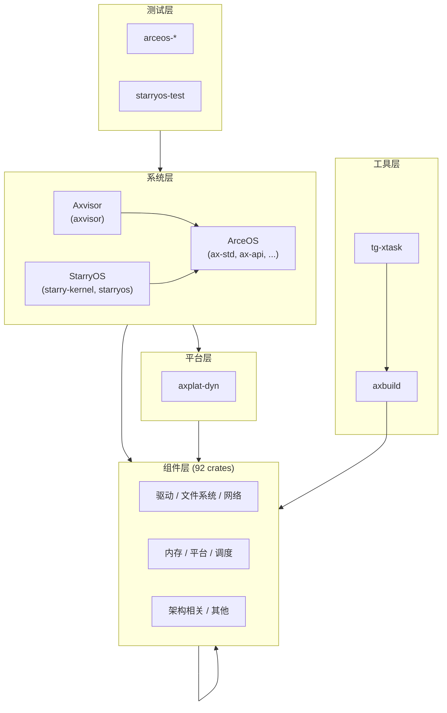

# 概述

TGOSKits 仓库包含 **146** 个 crate，按仓库内直接路径依赖自底向上分为 **16** 层。

## 分类统计

| 分类 | 数 |
|------|------|
| ArceOS 层 | 30 |
| Axvisor 层 | 2 |
| StarryOS 层 | 2 |
| 工具层 | 2 |
| 平台层 | 1 |
| 测试层 | 17 |
| 组件层 | 92 |

## 依赖图

分类间的整体依赖方向（自底向上）。各分类内部及单个 crate 的依赖关系见 [层级关系](layers) 及各 crate 文档。

## 外部依赖概要

关系统计来自根目录 **Cargo.lock**，仅统计直接依赖。

| 类别 | 外部包条目数（去重 name+version） |
|------|-------------------------------------|
| 工具库/其他 | 528 |
| 宏/代码生成 | 53 |
| 系统/平台 | 50 |
| 网络/协议 | 29 |
| 异步/并发 | 27 |
| 加密/安全 | 26 |
| 序列化/数据格式 | 24 |
| 日志/错误 | 14 |
| 命令行/配置 | 11 |
| 嵌入式/裸机 | 11 |
| 数据结构/算法 | 10 |
| 设备树/固件 | 8 |

## Crate 索引

| Crate | 分类 | 路径 | 直接依赖 | 被依赖 | 文档 |
| --- | --- | --- | ---: | ---: | --- |
| `aarch64_sysreg` | 组件层 | `virtualization/aarch64_sysreg` | 0 | 1 | [查看](crates/aarch64-sysreg) |
| `arceos-affinity` | 测试层 | `test-suit/arceos/rust/task/affinity` | 1 | 0 | [查看](crates/arceos-affinity) |
| `arceos-display` | 测试层 | `test-suit/arceos/rust/display` | 1 | 0 | [查看](crates/arceos-display) |
| `arceos-exception` | 测试层 | `test-suit/arceos/rust/exception` | 1 | 0 | [查看](crates/arceos-exception) |
| `arceos-fs-shell` | 测试层 | `test-suit/arceos/rust/fs/shell` | 4 | 0 | [查看](crates/arceos-fs-shell) |
| `arceos-irq` | 测试层 | `test-suit/arceos/rust/task/irq` | 1 | 0 | [查看](crates/arceos-irq) |
| `arceos-memtest` | 测试层 | `test-suit/arceos/rust/memtest` | 1 | 0 | [查看](crates/arceos-memtest) |
| `arceos-net-echoserver` | 测试层 | `test-suit/arceos/rust/net/echoserver` | 1 | 0 | [查看](crates/arceos-net-echoserver) |
| `arceos-net-httpclient` | 测试层 | `test-suit/arceos/rust/net/httpclient` | 1 | 0 | [查看](crates/arceos-net-httpclient) |
| `arceos-net-httpserver` | 测试层 | `test-suit/arceos/rust/net/httpserver` | 1 | 0 | [查看](crates/arceos-net-httpserver) |
| `arceos-net-udpserver` | 测试层 | `test-suit/arceos/rust/net/udpserver` | 1 | 0 | [查看](crates/arceos-net-udpserver) |
| `arceos-parallel` | 测试层 | `test-suit/arceos/rust/task/parallel` | 1 | 0 | [查看](crates/arceos-parallel) |
| `arceos-priority` | 测试层 | `test-suit/arceos/rust/task/priority` | 1 | 0 | [查看](crates/arceos-priority) |
| `arceos-sleep` | 测试层 | `test-suit/arceos/rust/task/sleep` | 1 | 0 | [查看](crates/arceos-sleep) |
| `arceos-tls` | 测试层 | `test-suit/arceos/rust/task/tls` | 1 | 0 | [查看](crates/arceos-tls) |
| `arceos-wait-queue` | 测试层 | `test-suit/arceos/rust/task/wait_queue` | 1 | 0 | [查看](crates/arceos-wait-queue) |
| `arceos-yield` | 测试层 | `test-suit/arceos/rust/task/yield` | 1 | 0 | [查看](crates/arceos-yield) |
| `arm_vcpu` | 组件层 | `virtualization/arm_vcpu` | 6 | 1 | [查看](crates/arm-vcpu) |
| `arm_vgic` | 组件层 | `virtualization/arm_vgic` | 6 | 2 | [查看](crates/arm-vgic) |
| `ax-alloc` | ArceOS 层 | `os/arceos/modules/axalloc` | 6 | 11 | [查看](crates/ax-alloc) |
| `ax-allocator` | 组件层 | `memory/axallocator` | 2 | 2 | [查看](crates/ax-allocator) |
| `ax-api` | ArceOS 层 | `os/arceos/api/arceos_api` | 17 | 1 | [查看](crates/ax-api) |
| `ax-arm-pl031` | 组件层 | `drivers/rtc/arm_pl031` | 0 | 1 | [查看](crates/ax-arm-pl031) |
| `ax-cpu` | 组件层 | `components/axcpu` | 6 | 14 | [查看](crates/ax-cpu) |
| `ax-cpumask` | 组件层 | `components/cpumask` | 0 | 4 | [查看](crates/ax-cpumask) |
| `ax-crate-interface` | 组件层 | `components/crate_interface` | 0 | 22 | [查看](crates/ax-crate-interface) |
| `ax-ctor-bare` | 组件层 | `components/ctor_bare/ctor_bare` | 1 | 1 | [查看](crates/ax-ctor-bare) |
| `ax-ctor-bare-macros` | 组件层 | `components/ctor_bare/ctor_bare_macros` | 0 | 1 | [查看](crates/ax-ctor-bare-macros) |
| `ax-display` | ArceOS 层 | `os/arceos/modules/axdisplay` | 3 | 4 | [查看](crates/ax-display) |
| `ax-dma` | ArceOS 层 | `os/arceos/modules/axdma` | 7 | 2 | [查看](crates/ax-dma) |
| `ax-driver` | ArceOS 层 | `drivers/ax-driver` | 15 | 10 | [查看](../architecture/driver/overview) |
| `ax-errno` | 组件层 | `components/axerrno` | 0 | 36 | [查看](crates/ax-errno) |
| `ax-feat` | ArceOS 层 | `os/arceos/api/axfeat` | 16 | 7 | [查看](crates/ax-feat) |
| `ax-fs` | ArceOS 层 | `os/arceos/modules/axfs` | 10 | 4 | [查看](crates/ax-fs) |
| `ax-fs-devfs` | 组件层 | `components/axfs_crates/axfs_devfs` | 1 | 1 | [查看](crates/ax-fs-devfs) |
| `ax-fs-ng` | ArceOS 层 | `os/arceos/modules/axfs-ng` | 10 | 4 | [查看](crates/ax-fs-ng) |
| `ax-fs-ramfs` | 组件层 | `components/axfs_crates/axfs_ramfs` | 1 | 2 | [查看](crates/ax-fs-ramfs) |
| `ax-fs-vfs` | 组件层 | `components/axfs_crates/axfs_vfs` | 1 | 4 | [查看](crates/ax-fs-vfs) |
| `ax-hal` | ArceOS 层 | `os/arceos/modules/axhal` | 13 | 15 | [查看](crates/ax-hal) |
| `arceos-helloworld` | ArceOS 层 | `apps/arceos/helloworld` | 1 | 0 | [查看](crates/arceos-helloworld) |
| `arceos-httpclient` | ArceOS 层 | `apps/arceos/httpclient` | 1 | 0 | [查看](crates/arceos-httpclient) |
| `arceos-httpserver` | ArceOS 层 | `apps/arceos/httpserver` | 1 | 0 | [查看](crates/arceos-httpserver) |
| `ax-input` | ArceOS 层 | `os/arceos/modules/axinput` | 3 | 3 | [查看](crates/ax-input) |
| `ax-io` | 组件层 | `components/axio` | 1 | 9 | [查看](crates/ax-io) |
| `ax-ipi` | ArceOS 层 | `os/arceos/modules/axipi` | 5 | 3 | [查看](crates/ax-ipi) |
| `ax-kernel-guard` | 组件层 | `components/kernel_guard` | 1 | 6 | [查看](crates/kernel-guard) |
| `ax-kspin` | 组件层 | `components/kspin` | 1 | 21 | [查看](crates/ax-kspin) |
| `ax-lazyinit` | 组件层 | `components/ax-lazyinit` | 0 | 17 | [查看](crates/ax-lazyinit) |
| `ax-libc` | ArceOS 层 | `os/arceos/ulib/axlibc` | 4 | 0 | [查看](crates/ax-libc) |
| `ax-linked-list-r4l` | 组件层 | `components/linked_list_r4l` | 0 | 1 | [查看](crates/ax-linked-list-r4l) |
| `ax-log` | ArceOS 层 | `os/arceos/modules/axlog` | 2 | 5 | [查看](crates/ax-log) |
| `ax-memory-addr` | 组件层 | `memory/memory_addr` | 0 | 24 | [查看](crates/ax-memory-addr) |
| `ax-memory-set` | 组件层 | `memory/memory_set` | 2 | 3 | [查看](crates/ax-memory-set) |
| `ax-mm` | ArceOS 层 | `os/arceos/modules/axmm` | 8 | 4 | [查看](crates/ax-mm) |
| `ax-net` | 组件层 | `net/ax-net` | 11 | 6 | [查看](crates/ax-net) |
| `ax-page-table-entry` | 组件层 | `memory/page_table_entry` | 1 | 12 | [查看](crates/ax-page-table-entry) |
| `ax-page-table-multiarch` | 组件层 | `memory/page_table_multiarch` | 3 | 7 | [查看](crates/ax-page-table-multiarch) |
| `ax-percpu` | 组件层 | `components/percpu/percpu` | 2 | 17 | [查看](crates/ax-percpu) |
| `ax-percpu-macros` | 组件层 | `components/percpu/percpu_macros` | 0 | 1 | [查看](crates/ax-percpu-macros) |
| `ax-plat` | 组件层 | `platforms/ax-plat` | 6 | 15 | [查看](crates/ax-plat) |
| `ax-plat-macros` | 组件层 | `platforms/ax-plat-macros` | 1 | 1 | [查看](crates/ax-plat-macros) |
| `ax-posix-api` | ArceOS 层 | `os/arceos/api/arceos_posix_api` | 13 | 1 | [查看](crates/ax-posix-api) |
| `ax-runtime` | ArceOS 层 | `os/arceos/modules/axruntime` | 20 | 4 | [查看](crates/ax-runtime) |
| `ax-sched` | 组件层 | `components/axsched` | 1 | 1 | [查看](crates/ax-sched) |
| `arceos-shell` | ArceOS 层 | `apps/arceos/shell` | 1 | 0 | [查看](crates/arceos-shell) |
| `ax-std` | ArceOS 层 | `os/arceos/ulib/axstd` | 6 | 22 | [查看](crates/ax-std) |
| `ax-sync` | ArceOS 层 | `os/arceos/modules/axsync` | 2 | 9 | [查看](crates/ax-sync) |
| `ax-task` | ArceOS 层 | `os/arceos/modules/axtask` | 13 | 8 | [查看](crates/ax-task) |
| `axaddrspace` | 组件层 | `virtualization/axaddrspace` | 6 | 12 | [查看](crates/axaddrspace) |
| `axbacktrace` | 组件层 | `components/axbacktrace` | 0 | 5 | [查看](crates/axbacktrace) |
| `axbuild` | 工具层 | `scripts/axbuild` | 1 | 3 | [查看](crates/axbuild) |
| `axdevice` | 组件层 | `virtualization/axdevice` | 8 | 2 | [查看](crates/axdevice) |
| `axdevice_base` | 组件层 | `virtualization/axdevice_base` | 3 | 8 | [查看](crates/axdevice-base) |
| `axfs-ng-vfs` | 组件层 | `components/axfs-ng-vfs` | 2 | 3 | [查看](crates/axfs-ng-vfs) |
| `axhvc` | 组件层 | `virtualization/axhvc` | 1 | 1 | [查看](crates/axhvc) |
| `axklib` | 组件层 | `components/axklib` | 2 | 3 | [查看](crates/axklib) |
| `axplat-dyn` | 平台层 | `platforms/axplat-dyn` | 11 | 2 | [查看](crates/axplat-dyn) |
| `axpoll` | 组件层 | `components/axpoll` | 0 | 5 | [查看](crates/axpoll) |
| `axvisor` | Axvisor 层 | `os/axvisor` | 27 | 0 | [查看](crates/axvisor) |
| `axvisor_api` | 组件层 | `virtualization/axvisor_api` | 5 | 10 | [查看](crates/axvisor-api) |
| `axvisor_api_proc` | 组件层 | `virtualization/axvisor_api_proc` | 0 | 1 | [查看](crates/axvisor-api-proc) |
| `axvm` | 组件层 | `virtualization/axvm` | 16 | 1 | [查看](crates/axvm) |
| `axvmconfig` | 组件层 | `virtualization/axvmconfig` | 1 | 4 | [查看](crates/axvmconfig) |
| `bitmap-allocator` | 组件层 | `memory/bitmap-allocator` | 0 | 1 | [查看](crates/bitmap-allocator) |
| `bwbench-client` | ArceOS 层 | `os/arceos/tools/bwbench_client` | 0 | 0 | [查看](crates/bwbench-client) |
| `define-simple-traits` | 组件层 | `components/crate_interface/test_crates/define-simple-traits` | 1 | 2 | [查看](crates/define-simple-traits) |
| `define-weak-traits` | 组件层 | `components/crate_interface/test_crates/define-weak-traits` | 1 | 4 | [查看](crates/define-weak-traits) |
| `deptool` | ArceOS 层 | `os/arceos/tools/deptool` | 0 | 0 | [查看](crates/deptool) |
| `fxmac_rs` | 组件层 | `drivers/net/fxmac_rs` | 1 | 1 | [查看](crates/fxmac-rs) |
| `impl-simple-traits` | 组件层 | `components/crate_interface/test_crates/impl-simple-traits` | 2 | 1 | [查看](crates/impl-simple-traits) |
| `impl-weak-partial` | 组件层 | `components/crate_interface/test_crates/impl-weak-partial` | 2 | 1 | [查看](crates/impl-weak-partial) |
| `impl-weak-traits` | 组件层 | `components/crate_interface/test_crates/impl-weak-traits` | 2 | 1 | [查看](crates/impl-weak-traits) |
| `mingo` | ArceOS 层 | `os/arceos/tools/raspi4/chainloader` | 0 | 0 | [查看](crates/mingo) |
| `riscv-h` | 组件层 | `virtualization/riscv-h` | 0 | 2 | [查看](crates/riscv-h) |
| `ax-riscv-plic` | 组件层 | `drivers/intc/riscv_plic` | 0 | 1 | [查看](crates/ax-riscv-plic) |
| `riscv_vcpu` | 组件层 | `virtualization/riscv_vcpu` | 8 | 2 | [查看](crates/riscv-vcpu) |
| `riscv_vplic` | 组件层 | `virtualization/riscv_vplic` | 5 | 2 | [查看](crates/riscv-vplic) |
| `rsext4` | 组件层 | `components/rsext4` | 0 | 1 | [查看](crates/rsext4) |
| `scope-local` | 组件层 | `components/scope-local` | 1 | 3 | [查看](crates/scope-local) |
| `smoltcp` | 组件层 | `components/starry-smoltcp` | 0 | 3 | [查看](crates/smoltcp) |
| `smoltcp-fuzz` | 组件层 | `components/starry-smoltcp/fuzz` | 1 | 0 | [查看](crates/smoltcp-fuzz) |
| `starry-kernel` | StarryOS 层 | `os/StarryOS/kernel` | 29 | 2 | [查看](crates/starry-kernel) |
| `starry-process` | 组件层 | `components/starry-process` | 2 | 1 | [查看](crates/starry-process) |
| `starry-signal` | 组件层 | `components/starry-signal` | 3 | 1 | [查看](crates/starry-signal) |
| `starry-vm` | 组件层 | `components/starry-vm` | 1 | 2 | [查看](crates/starry-vm) |
| `starryos` | StarryOS 层 | `os/StarryOS/starryos` | 3 | 0 | [查看](crates/starryos) |
| `starryos-test` | 测试层 | `test-suit/starryos` | 2 | 0 | [查看](crates/starryos-test) |
| `test-simple` | 组件层 | `components/crate_interface/test_crates/test-simple` | 3 | 0 | [查看](crates/test-simple) |
| `test-weak` | 组件层 | `components/crate_interface/test_crates/test-weak` | 3 | 0 | [查看](crates/test-weak) |
| `test-weak-partial` | 组件层 | `components/crate_interface/test_crates/test-weak-partial` | 3 | 0 | [查看](crates/test-weak-partial) |
| `tg-xtask` | 工具层 | `xtask` | 1 | 0 | [查看](crates/tg-xtask) |
| `ax-timer-list` | 组件层 | `components/timer_list` | 0 | 2 | [查看](crates/ax-timer-list) |
| `x86_vcpu` | 组件层 | `virtualization/x86_vcpu` | 9 | 1 | [查看](crates/x86-vcpu) |
| `x86_vlapic` | 组件层 | `virtualization/x86_vlapic` | 5 | 1 | [查看](crates/x86-vlapic) |
