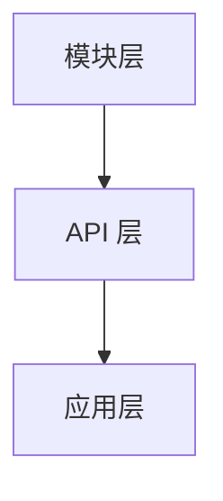

# 文档部署

TGOSKits 的文档站点基于 [Docusaurus 3](https://docusaurus.io/) 构建，通过 GitHub Actions 自动部署到 GitHub Pages。本文档介绍文档站点的架构、本地开发、写作规范和部署流程。

---

## 1. 技术栈

| 组件 | 版本 | 用途 |
|------|------|------|
| [Docusaurus](https://docusaurus.io/) | 3.10+ | 静态站点生成器 |
| [MDX](https://mdxjs.com/) | 3.0 | Markdown + JSX（支持在文档中使用组件） |
| [Mermaid](https://mermaid.js.org/) | — | 流程图 / 架构图渲染（`@docusaurus/theme-mermaid`） |
| [prism-react-renderer](https://github.com/FormidableLabs/prism-react-renderer) | 2.x | 代码高亮 |
| Node.js | ≥ 18 | 运行时 |
| Yarn | — | 包管理（Corepack） |

## 2. 目录结构

```
docs/
├── docusaurus.config.js   # 站点主配置
├── sidebars.docs.js       # 主文档 sidebar（混合自动生成）
├── sidebars.community.js  # 社区文档 sidebar（手动列举）
├── package.json           # 依赖和脚本
├── yarn.lock              # 依赖锁定
├── docs/                  # 主文档内容
│   ├── introduction/      # 项目介绍
│   ├── quickstart/        # 快速开始
│   ├── architecture/      # 架构设计
│   ├── build/             # 构建与运行
│   ├── contributing/      # 贡献
│   ├── development/       # 开发指南
│   ├── components/        # 组件库
│   └── debug/             # 在线调试
├── blog/                  # 博客文章
│   └── 2026/
│       └── 04-10-introducing-tgoskits/
│           └── introducing-tgoskits.md
├── community/             # 社区文档（独立 sidebar）
│   ├── introduction.md
│   ├── resources.md
│   └── support.md
├── src/                   # 自定义 React 组件和样式
│   ├── css/
│   │   └── custom.css     # 自定义样式
│   └── pages/
│       ├── index.js       # 首页
│       └── index.css      # 首页样式
└── static/                # 静态资源
    └── images/
        └── site/          # Logo、Favicon 等
```

## 3. 站点配置

### 3.1 关键配置

```js
// 站点基础信息
title: 'TGOSKits'
url: 'https://rcore-os.github.io'
baseUrl: '/tgoskits/'
organizationName: 'rcore-os'
projectName: 'tgoskits'
deploymentBranch: 'gh-pages'

// 国际化
i18n: { defaultLocale: 'zh-Hans', locales: ['zh-Hans'] }

// Mermaid 图表支持
markdown: { mermaid: true }
themes: ['@docusaurus/theme-mermaid']
```

### 3.2 Sidebar 组织

主文档 sidebar 使用 category + generated-index 混合自动生成，社区 sidebar 采用手动列举：

```js
// sidebars.docs.js — category + autogenerated 混合
const sidebars = {
  docs: [
    {
      type: 'category',
      label: '项目介绍',
      link: generatedIndex('项目介绍', '/introduction', '...'),
      items: [{type: 'autogenerated', dirName: 'introduction'}],
    },
    // ...
  ],
};

// sidebars.community.js — 手动列举
const sidebars = {
  community: [
    'introduction',
    'team',
    'contributing',
    // ...
  ],
};
```

目录结构和排序由各目录下的 `_category_.json` 文件控制：

```json
{
  "label": "组件库",
  "position": 7,
  "link": {
    "type": "generated-index",
    "title": "组件库",
    "slug": "/components",
    "description": "组件概述与各组件文档。"
  }
}
```

### 3.3 多文档实例

除主文档（`docs/docs/`）外，还有一个独立的社区文档实例（`docs/community/`），通过 `@docusaurus/plugin-content-docs` 插件的额外实例实现：

```js
plugins: [
  [
    '@docusaurus/plugin-content-docs',
    {
      id: 'community',
      path: 'community',
      routeBasePath: 'community',
      sidebarPath: './sidebars.community.js',
    },
  ],
],
```

## 4. 本地开发

### 4.1 安装依赖

```bash
cd docs
corepack enable   # 启用 Corepack（管理 Yarn 版本）
yarn install       # 安装依赖
```

### 4.2 启动开发服务器

```bash
yarn start
# 或指定监听地址
yarn start --host 0.0.0.0
```

开发服务器支持热更新（HMR），修改 Markdown 文件后浏览器会自动刷新。

### 4.3 构建静态站点

```bash
yarn build
```

构建产物位于 `docs/build/`。构建时会检查所有内部链接是否有效。

### 4.4 本地预览构建结果

```bash
yarn build
yarn serve
```

## 5. 写作规范

### 5.1 文档文件组织

- 每个顶层目录对应一个章节，包含 `_category_.json` 定义标题、位置和索引页
- 文件名使用小写 + 短横线：`my-topic.md`
- sidebar 顺序由 `_category_.json` 的 `position` 字段和文件内的 `sidebar_position` front matter 控制

### 5.2 链接风格

Docusaurus 支持三种链接方式：

| 类型 | 格式 | 说明 |
|------|------|------|
| 绝对路径 | `[文本](/docs/components/overview)` | 推荐跨章节引用 |
| 相对路径 | `[文本](../components/overview)` | 同一章节内引用 |
| 外部链接 | `[文本](https://...)` | 外部 URL |

### 5.3 Mermaid 图表

文档支持 Mermaid 语法，可直接在 Markdown 中嵌入流程图、架构图：

````markdown

````

### 5.4 代码块

支持语法高亮和标题：

````markdown
```rust title="src/main.rs"
fn main() {
    println!("Hello");
}
```
````

### 5.5 Front Matter

可选的 YAML front matter：

```yaml
---
sidebar_position: 1
sidebar_label: "自定义标签"
title: "自定义标题"
---
```

## 6. 部署

文档通过 GitHub Actions 自动部署到 GitHub Pages。

### 6.1 前置配置

部署前需要在 GitHub 仓库中完成以下配置：

**1) 启用 GitHub Pages**

进入仓库 **Settings → Pages**：

| 配置项 | 值 |
|--------|-----|
| Source | **GitHub Actions**（不是 "Deploy from a branch"） |

选择 "GitHub Actions" 后，Pages 将由工作流的 `actions/deploy-pages` 负责部署，不再使用传统的 `gh-pages` 分支方式。

**2) 配置 Environments**

进入仓库 **Settings → Environments**，创建 `github-pages` 环境：

| 配置项 | 说明 |
|--------|------|
| Environment name | `github-pages` |
| Deployment branch | `main`（或按需限制） |

如果需要审批流程，可在此环境中配置 **Required reviewers**，要求指定人员批准后才执行部署。

> 工作流 `.github/workflows/docs.yml` 中已通过 `environment: name: github-pages` 引用此环境，因此环境名称必须匹配。

### 6.2 自动部署

文档通过 GitHub Actions 自动部署，工作流定义在 `.github/workflows/docs.yml`：

**触发条件**：
- 推送到 `main` 分支且 `docs/` 目录有变更
- 手动触发（`workflow_dispatch`）

**部署流程**：

```
push to main (docs/ changed)
  → Job: build
    → Checkout 代码
    → 设置 Node.js 20
    → yarn install
    → yarn build（构建静态站点）
    → 上传 build/ 为 Pages artifact
  → Job: deploy
    → 部署到 GitHub Pages
```

**部署结果**：
- URL：`https://rcore-os.github.io/tgoskits/`

### 6.3 手动部署

如有需要，也可从本地部署：

```bash
cd docs
yarn deploy
```

> 注意：`yarn deploy` 使用 `docusaurus deploy` 命令，会将构建产物推送到 `gh-pages` 分支。需要对应仓库的写权限。这种方式与 GitHub Actions 部署互为替代，不会冲突。

## 7. 添加文档

### 7.1 添加新页面

1. 在对应目录下创建 `.md` 文件
2. 如需控制顺序，添加 `sidebar_position` front matter
3. 如需在导航栏中显示，确认 `_category_.json` 已配置

### 7.2 添加新章节

1. 在 `docs/docs/` 下创建新目录
2. 创建 `_category_.json`：

```json
{
  "label": "新章节名",
  "position": <排序位置>,
  "link": {
    "type": "generated-index",
    "title": "章节标题",
    "slug": "/chapter-slug",
    "description": "章节描述。"
  }
}
```

3. 添加 Markdown 文件

### 7.3 添加博客文章

在 `docs/blog/` 下按 `YYYY/MM-DD-title/title.md` 格式创建：

```markdown
---
slug: my-blog-post
title: 博客标题
authors: [author-name]
tags: [tag1, tag2]
---

博客内容...
```

作者信息在 `docs/blog/authors.yml` 中定义。

## 8. 常见问题

### Q: 本地构建报错 `Cannot find module`？

```bash
cd docs
yarn install
```

### Q: 修改了 sidebar 但页面没变化？

重启开发服务器：`Ctrl+C` 然后 `yarn start`。

### Q: 构建时出现 broken links 错误？

当前配置会在发现 broken links 时阻断构建。请根据 `yarn build` 的输出定位并修复问题链接。

### Q: 如何更新 Docusaurus 版本？

```bash
cd docs
yarn upgrade @docusaurus/core@latest @docusaurus/preset-classic@latest @docusaurus/theme-mermaid@latest
yarn install
```

升级后运行 `yarn build` 确认无兼容问题。
