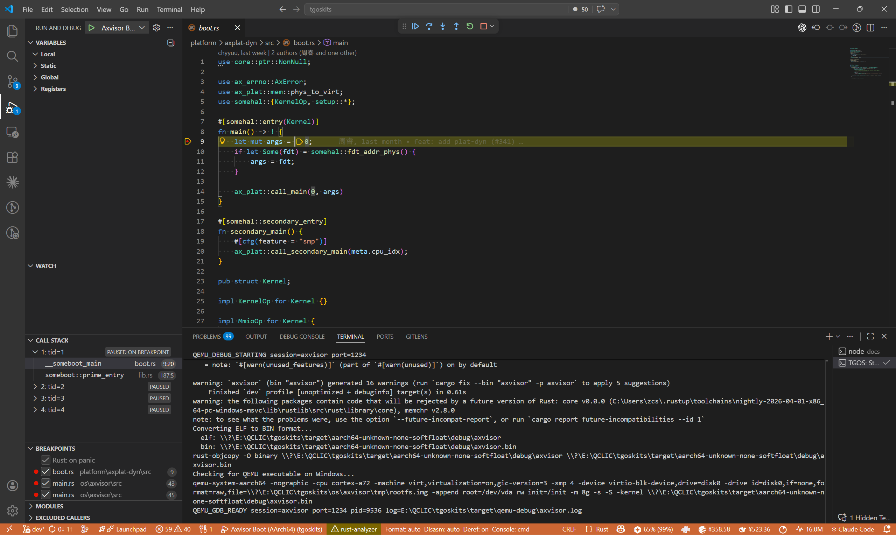
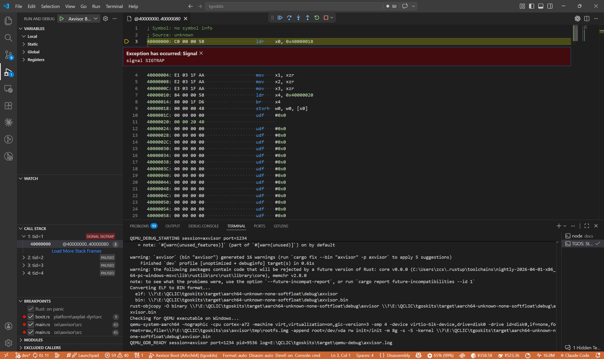

# 调试流程

本文档说明一次完整的 VS Code 本地调试是如何启动、等待、附加和清理的，并展示当前预置调试目标在界面中的表现。

## 调试目标选择

当前通过 VS Code `Run and Debug` 面板选择目标配置。预置的 AArch64 调试入口包括：

- `ArceOS Main`
- `ArceOS Boot`
- `StarryOS Main`
- `StarryOS Boot`
- `Axvisor Main`
- `Axvisor Boot`

界面中的调试目标选择如下图所示：

## Main 与 Boot 的入口差异

设计上每个系统都提供 `Main` 和 `Boot` 两类入口：

- `Main`：用于验证主路径上的 Rust 逻辑
- `Boot`：用于观察更早的引导、runtime 与平台初始化过程

`Main` 类入口通常会直接把调试器带到 Rust 源码主路径附近：

`Boot` 类入口则更适合观察更早的引导阶段，包括符号尚未完全恢复时的低级入口状态：

## 启动时序

一次完整的本地调试按如下时序执行：

1. VS Code 触发 `preLaunchTask`
2. `tasks.json` 先执行对应的 `Build ... debug image`
3. 构建完成后执行 `Start ... QEMU debug`
4. `session.py` 启动 QEMU 并等待 GDB stub 就绪
5. `session.py` 打印 `QEMU_GDB_READY`
6. VS Code 再附加 LLDB

这里最关键的设计点是“显式分离 build 与 start”。

如果把“构建 + 起 QEMU”完全揉在同一个后台任务里，首次冷编译时 VS Code 很容易在目标二进制尚未准备完成时就尝试附加，导致调试入口不稳定。当前任务链通过顺序依赖把这类时序问题前置消解掉。

## 任务分层

调试流程中各层职责如下：

- `launch.json`：决定附加目标、断点入口和 post-debug 清理
- `tasks.json`：决定 build 和 start 的先后顺序
- `session.py`：决定 QEMU 会话的启动、等待、状态输出和停止

这种分层让“界面入口”“任务编排”“会话管理”三件事保持解耦，便于独立调整。

## 失败与退出

当前会话在 `session.py` 中抽象为一组稳定状态：

- `starting`
- `running`
- `ready`
- `failed-before-ready`
- `stopping`
- `exited`

这些状态会写入 `target/qemu-debug/*.log`，用于定位：

- 构建尚未完成时的启动失败
- QEMU 未成功启动
- GDB stub 未就绪
- 调试结束后的清理过程
