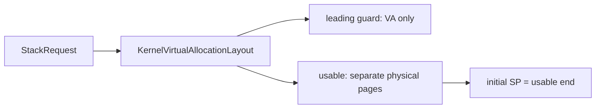

# 内核任务栈保护页

动态任务栈的保护页由 `ax-runtime` 接入 `ax-mm::KernelVirtualAllocation`。栈占用连续虚拟地址，usable 页逐页申请物理 backing，最低 guard 范围保持未映射。越界访问由硬件触发 fault，runtime 输出当前栈的范围诊断。

## 1. 分配与释放

`components/ax-task` 只持有 opaque `StackHandle`，不参与 VMA 或物理页分配。`axruntime/src/task/resources.rs` 的 `RuntimeStack` 持有 heap 或 virtual backing，线程 resource reaper 负责在上下文停止使用后消费 handle。

### 1.1 虚拟栈布局

启用 `stack-guard-page` 时，`allocate_virtual_stack()` 预留 guard 和 usable 范围。启用 `vmap-task-stack` 也会使用虚拟 backing，但是否包含 guard 由 `StackRequest::guard_size` 决定。两者都关闭时使用原有 heap 路径。



例如 256 KiB usable 加一个 4 KiB guard，需要 260 KiB VA 和 64 个数据页。请求更大对齐时，usable 和 guard 大小按该对齐向上取整，不通过申请连续 65 页造成 Buddy 高阶碎片。

### 1.2 锁和失败边界

`KernelVirtualAllocation::allocate()` 在 kernel address-space 锁外分配 backing 的 `Vec`、`Arc` 和物理页。预留 VMA 后，每页执行“加锁取得计划 → 锁外准备 page-table deposit → 加锁重验安装”。未发布 deposit 的最终释放也在锁外。

一旦预留成功，token 就负责整个区间。部分 PTE 安装失败会把 reservation 标成 `Retiring`；元数据继续保留所有 frame。新 guard 从未建立映射，因此创建过程不撤销 direct-map 页，也不依赖尚未上线的 CPU 处理 shootdown。

### 1.3 退休与隔离

token 的普通 `Drop` 只发布退休状态。显式 `release()` 或 `retry_kernel_virtual_quarantines()` 清除 usable leaf，调用 `flush_tlb_range_all_cpus()`，确认后移除 VMA，并在锁外释放 backing。

| 状态 | 资源责任 |
| --- | --- |
| `Live` | runtime token 可使用栈，VMA 保留 backing |
| `Retiring` | 栈停止使用，等待撤销映射 |
| `Quarantined` | VA 和 frame 仍保留，等待完整 TLB 确认或重试 |
| 移除元数据 | 锁外释放数据页，VA 可复用 |

共享 kernel 页表目录在 leaf 撤销后仍保留，其生命周期属于 kernel root。这与本地 Linux 7.1 的 `mm/vmalloc.c::vunmap_pte_range()` 一致。释放失败不把 frame 交回 allocator；后续普通栈分配会先执行有界退休重试。

## 2. 保护范围与诊断

诊断属于 runtime stack owner，调用方不需要查找第二个全局栈登记表。`diagnose_current_stack_guard_page_fault()` 从当前线程的 `RuntimeStack` 读取 reservation 和 usable 边界。

### 2.1 覆盖边界

动态线程、runtime service thread 和独立分配的 idle thread 使用相同分配入口。引导栈通过 `StackHandle::NONE` 表达借用，不由 runtime 释放。

| 栈类型 | 保护页 |
| --- | --- |
| runtime 分配的动态栈 | 启用 guard 配置时覆盖 |
| someboot 的 boot/main/secondary 栈 | 不覆盖 |
| 独立 IRQ、overflow 或 double-fault 栈 | 需要独立生命周期设计 |
| Starry 用户栈 | 由用户 VMA 权限与缺页策略管理 |

canary 继续检查没有触及 guard 的栈内破坏。guard 不替代 canary，也不能保护通过一次大跨越完全跳过 guard 的写入。

### 2.2 故障输出

ArceOS 和 Starry fault handler 先检查当前任务 guard；命中后输出以下字段，再进入原有 fatal fault 路径。

```text
task stack guard page hit: fault_addr=0x..., stack=[0x.....0x...), guard=[0x.....0x...)
```

诊断只检查当前动态栈，不承诺跨任务地址反查。当前栈已经耗尽时仍可能无法完成复杂日志；架构专用 overflow stack 是独立能力。

## 3. 验证入口

正式 `task-stack-guard-page` 用例属于 ArceOS Rust QEMU 套件。它先迁移任务，再主动触发保护页 fault；运行器只接受用例开始标记之后包含完整地址字段的 guard 诊断。

### 3.1 专项回归

从仓库根目录运行已有测试入口。boot 阶段的同名诊断或普通 panic 均不能被当作成功。

```bash
cargo xtask arceos test qemu --arch x86_64 --test-group rust --test-case task-stack-guard-page
```

运行器规则位于 `scripts/axbuild/src/arceos/test/rust_qemu.rs`。正则使用 ASCII 单词边界，与实际匹配器的 DFA 能力一致。

### 3.2 系统配置

Starry 必须启用自己的 feature，才能同时打开内核 fault 诊断与底层 runtime 的 guard 分配。

```bash
FEATURES=starry-kernel/stack-guard-page cargo xtask starry test qemu --arch x86_64 -c qemu/system
```

普通系统套件与专项 fatal-fault 用例证明不同边界：前者检查启用配置后的系统行为，后者检查 guard 命中和诊断传播。四架构的验证结果应分别记录，不能由单架构通过推断全部可用。
