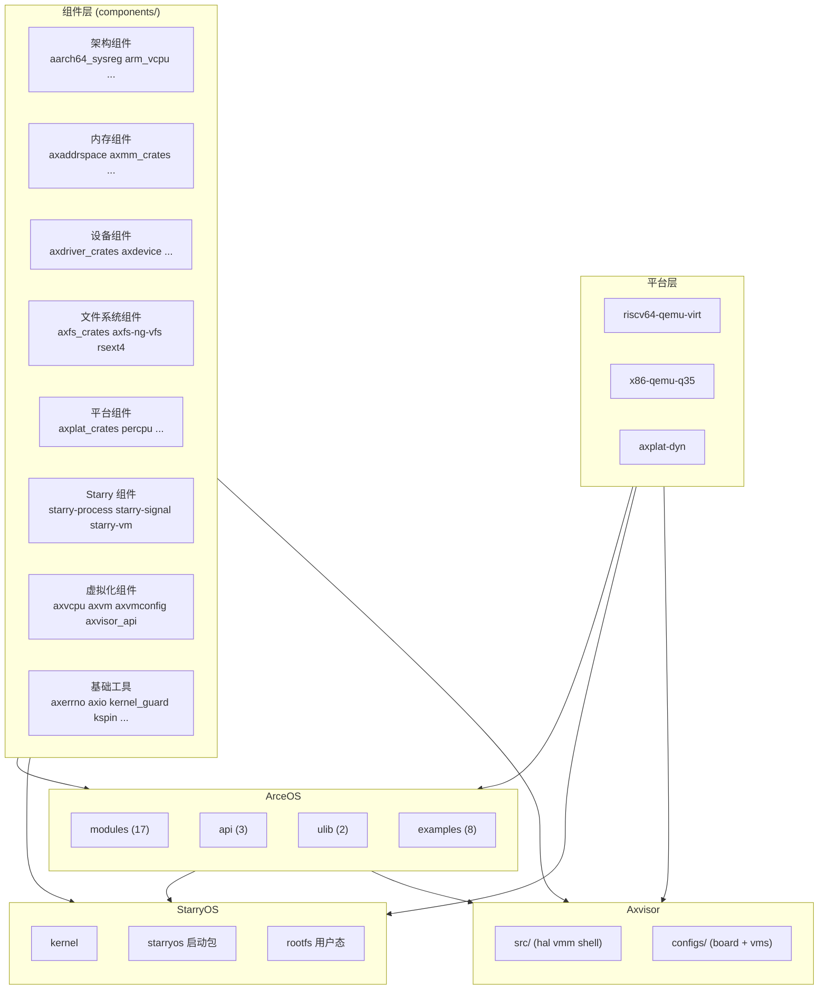

# 架构与组件层次

TGOSKits 是一个统一的 Cargo workspace，包含 140 余个 crate，覆盖三个操作系统（ArceOS、StarryOS、Axvisor）及其共享组件层。理解这些 crate 之间的层次关系和依赖方向，是判断改动影响范围和选择验证策略的前提。

## 核心层次

TGOSKits 按职责将 crate 组织为六个核心层次和一个辅助层，每一层都面向明确的职责边界。

| 层次 | 路径 | 角色 | 规模 |
|------|------|------|------|
| 共享组件 | `components/` | 独立可复用 crate：架构组件、内存管理、设备抽象、同步原语、工具库 | 54 个目录，77 个 crate |
| ArceOS 内核 | `os/arceos/modules/` | ArceOS 内核模块：HAL、调度、内存、驱动、文件系统、网络 | 17 个模块 |
| ArceOS API | `os/arceos/api/` | Feature 聚合与 API 封装 | 3 个 crate |
| ArceOS 用户库 | `os/arceos/ulib/` | 应用开发接口 | 2 个 crate |
| StarryOS 内核 | `os/StarryOS/kernel/` | 宏内核逻辑：syscall、进程、信号、内存管理、文件系统 | 7 个子系统 |
| Axvisor 运行时 | `os/axvisor/` | Hypervisor 运行时：HAL 适配、VMM、shell、配置 | 6 个模块 |

辅助层：

- `platform/` 与 `components/axplat_crates/` — 平台实现，当前包含 `riscv64-qemu-virt`、`x86-qemu-q35`、`axplat-dyn`
- `drivers/` — SoC 专用驱动（blk、net、npu、pci、soc）
- `test-suit/` — 系统级测试入口（ArceOS、StarryOS、Axvisor）

## 依赖方向

依赖关系从底层组件流向三个操作系统，ArceOS 同时作为 StarryOS 和 Axvisor 的基础运行时。

| 依赖路径 | 含义 |
|----------|------|
| `components/` → ArceOS modules | ArceOS 模块基于共享组件构建 |
| `components/` → StarryOS kernel | Starry 专用组件（starry-process、starry-signal、starry-vm）独立于 ArceOS 模块 |
| `components/` → Axvisor runtime | 虚拟化组件（axvm、axvcpu、axvisor_api）被 Axvisor 直接使用 |
| ArceOS modules → StarryOS kernel | StarryOS 复用 ArceOS 的 HAL、调度、内存、驱动等基础能力 |
| ArceOS modules → Axvisor runtime | Axvisor 复用 ArceOS 的 std、HAL、alloc、task、sync |
| `platform/` → 三个系统 | 平台实现通过 ax-hal 注入各系统 |

## 改动影响评估

修改不同层次的代码时，影响范围差异显著。以下规则帮助在改动前预判验证范围。

| 改动位置 | 影响范围 | 验证策略 |
|----------|---------|---------|
| `components/` | 跨系统基础设施，三个系统都可能受影响 | 至少验证 ArceOS + 一个上游系统 |
| `os/arceos/modules/` | ArceOS 本身 + StarryOS/Axvisor 的复用路径 | 不要只测 ArceOS，补跑上游系统最小用例 |
| `os/StarryOS/kernel/` | 仅 StarryOS | 重点关注 rootfs 和 Linux 兼容行为 |
| `os/axvisor/` | 仅 Axvisor | 代码、配置和 Guest 镜像要一起验证 |
| `platform/` | 所有使用该平台的系统 | 至少验证对应架构的 ArceOS 基础启动 |

## 关联文档

- [ArceOS 内部机制](./arceos-internals) — ArceOS 分层、Feature 装配、模块协作的完整说明
- [StarryOS 内部机制](./starryos-internals) — StarryOS 宏内核结构、syscall 分发、进程模型
- [Axvisor 内部机制](./axvisor-internals) — Axvisor Hypervisor 运行时、配置体系、vCPU 管理
- [组件开发指南](/docs/design/reference/components) — 组件修改与验证的完整说明
