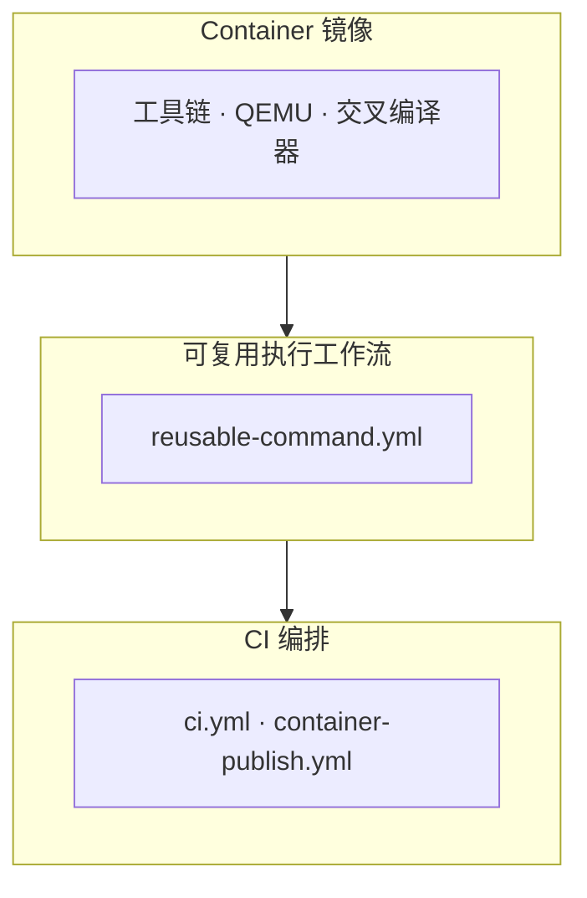
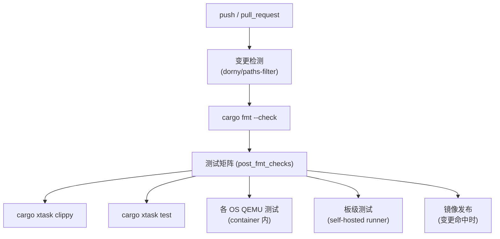

# CI

TGOSKits 将构建与运行依赖收敛到统一的 container 镜像，由 GitHub Actions 和本地开发流程共同消费。CI 系统的目标是**确保每次代码变更都经过格式检查、静态分析和自动化测试的完整验证**，同时通过容器化保证本地开发环境与 CI 环境的一致性。

CI 的设计遵循"环境即代码"原则：工具链版本（Rust、QEMU、交叉编译器）全部固定在 Dockerfile 中，避免因环境差异导致"本地通过 CI 不通过"的问题。开发者可以通过 `cargo xtask` 在本地复现完整的 CI 流水线，无需手动安装任何依赖。

## 三层架构

| 层级 | 作用 | 主要入口 |
|------|------|----------|
| Container 镜像 | 固化工具链、QEMU、交叉编译器 | `container/Dockerfile`、`container/Dockerfile.axvisor-lvz` |
| 可复用工作流 | 统一在 host 或 container 中执行命令 | `.github/workflows/reusable-command.yml` |
| CI 编排 | 选择测试矩阵、决定何时发布镜像 | `.github/workflows/ci.yml`、`.github/workflows/container-publish.yml` |

三层架构将关注点分离：Container 镜像层确保可重现的构建环境，可复用工作流层提供标准化的命令执行接口（支持在 container 或 bare metal 上运行），CI 编排层决定测试矩阵和发布策略。`reusable-command.yml` 是关键的中间层——它接收命令和参数作为输入，在指定的环境中执行，返回结果给上层编排。

## 基础镜像

基础镜像定义在 `container/Dockerfile`，以 `ubuntu:24.04` 为底。

| 类别 | 内容 |
|------|------|
| 系统基础 | `build-essential`、`clang`、`cmake`、`make`、`meson`、`ninja-build`、`pkg-config`、`python3` |
| 文件系统/镜像工具 | `dosfstools`、`e2fsprogs`、`xz-utils` |
| QEMU | 源码构建 `QEMU_VERSION=10.2.1`，覆盖 `aarch64`、`riscv64`、`x86_64`、`loongarch64` |
| Rust 环境 | 依据 `rust-toolchain.toml` 安装 toolchain + `cargo-binutils`、`axconfig-gen`、`cargo-axplat` |
| 交叉编译工具链 | `aarch64`、`riscv64`、`x86_64`、`loongarch64` 的 musl 交叉编译器 |

基础镜像从源码编译 QEMU（而非使用发行版包）以确保所有目标架构的支持和版本一致性。Rust 工具链版本通过 `rust-toolchain.toml` 固定，CI 构建时自动读取该文件安装对应版本。交叉编译器使用 musl libc 变体，与 ArceOS 和 StarryOS 的用户态测试环境匹配。

## LVZ 扩展镜像

`container/Dockerfile.axvisor-lvz` 基于基础镜像扩展，额外构建 `QEMU-LVZ`，暴露 `AXBUILD_QEMU_SYSTEM_LOONGARCH64` 环境变量。

LVZ 扩展镜像用于 Axvisor 在 loongarch64 架构上的测试。龙芯的硬件虚拟化扩展（LVZ）需要定制版 QEMU，基础镜像中的标准 QEMU 不支持。该镜像从 `QEMU-LVZ` 仓库源码编译并安装到独立路径，通过 `AXBUILD_QEMU_SYSTEM_LOONGARCH64` 环境变量告知 axbuild 使用该版本。

## CI 流水线

CI 流水线在每次 push 或 pull_request 时触发。首先通过 `dorny/paths-filter` 检测变更范围，跳过纯文档变更；然后执行 `cargo fmt --check` 确保代码格式；最后进入测试矩阵，并行执行 clippy 检查、std 测试、各 OS 的 QEMU 测试和板级测试。

### 触发条件

- `push` / `pull_request`，但 `*.md`、`docs/**` 等纯文档变更会跳过
- 同一分支连续推送会取消旧的运行

路径过滤机制确保只有影响代码的变更才会触发完整测试，避免文档更新浪费 CI 资源。并发取消策略（`concurrency` 配置）确保同一分支的多次快速推送只保留最新的一次运行。

### Self-hosted 测试

板级测试和部分 Axvisor 测试需要物理板或特定 runner 环境，运行在 self-hosted runner 上。

self-hosted runner 连接了实际的物理板卡（如 OrangePi-5-Plus），用于验证 OS 在真实硬件上的行为。这些测试无法在 GitHub Actions 的标准 runner 上执行，因为它们需要物理设备的串口连接和电源控制。

## 命名规则

### 文件命名

| 文件类型 | 格式 | 示例 |
|----------|------|------|
| QEMU 配置 | `qemu-{arch}.toml` | `qemu-aarch64.toml`、`qemu-x86_64.toml` |
| 板级配置 | `board-{board_name}.toml` | `board-orangepi-5-plus.toml` |
| 构建配置 | `build-{target}.toml` | `build-x86_64-unknown-none.toml` |

统一的命名规则使得 axbuild 可以通过文件名模式自动发现和匹配配置文件。例如 `discover_qemu_cases()` 通过匹配 `qemu-{arch}.toml` 文件来定位测试用例，`discover_build_wrappers()` 通过匹配 `build-{target}.toml` 来识别构建组。

### 架构命名

| 架构缩写 | 完整 Target |
|----------|-------------|
| `x86_64` | `x86_64-unknown-none` |
| `aarch64` | `aarch64-unknown-none-softfloat` |
| `riscv64` | `riscv64gc-unknown-none-elf` |
| `loongarch64` | `loongarch64-unknown-none-softfloat` |

## 镜像发布

镜像通过 `.github/workflows/container-publish.yml` 发布到 GHCR。标签策略：Git tag 对应版本镜像 + 每次推送 `latest`。

### 发布触发

- 基础镜像：`Dockerfile`、`container-publish.yml`、`ci.yml`、`rust-toolchain.toml` 变更
- LVZ 镜像：`Dockerfile.axvisor-lvz` 变更

镜像发布采用按需触发策略：只有当容器定义文件或工具链版本发生变更时才重新构建和发布镜像，避免不必要的构建开销。发布后的镜像被 CI 流水线和本地开发者共同使用，确保环境一致性。
