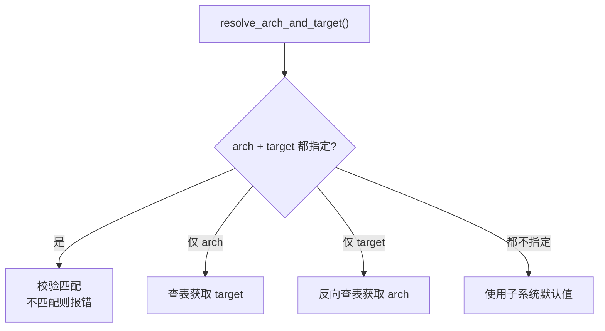
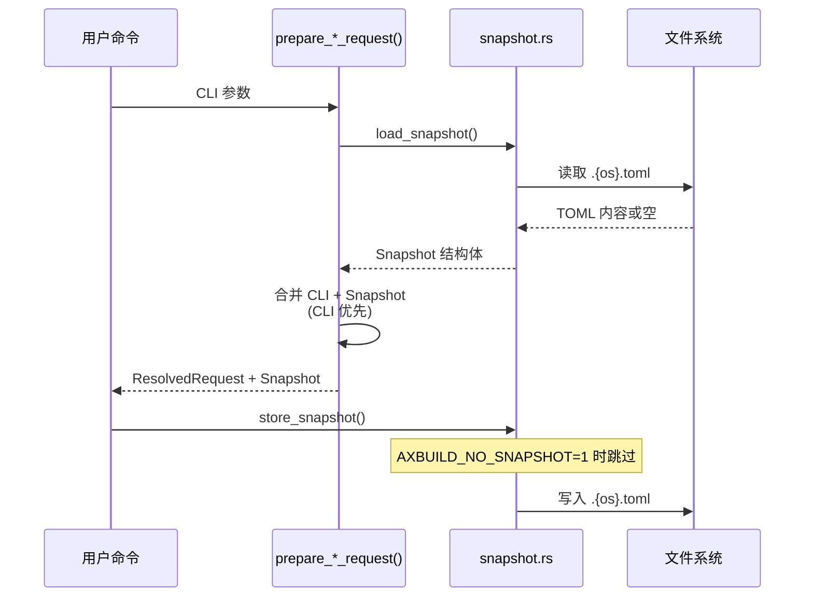
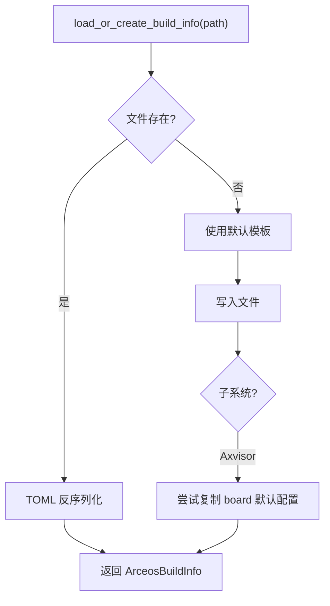

# 参数与配置

构建系统的配置涉及三类数据：**Arch/Target 映射**（架构与编译目标的对应关系）、**Snapshot**（最近一次命令参数的持久化）、**Build Info**（构建配置，含 features、环境变量和平台行为）。三套子系统共享这套配置框架，但各有自己的默认值和定制行为。所有配置逻辑集中在 `scripts/axbuild/src/context/` 目录中。

## Arch / Target 映射

`context/arch.rs` 维护统一的 arch ↔ target 映射表，三套子系统共享映射关系，但默认值不同。

TGOSKits 支持四种 CPU 架构，每种架构对应一个固定的 target triple。`context/arch.rs` 中的 `resolve_arch_and_target()` 函数负责处理用户通过 `--arch` 和 `--target` 传入的参数，确保两者一致或在只指定其一时自动补全另一个。这种设计使得用户可以用简短的 `--arch aarch64` 代替完整的 `--target aarch64-unknown-none-softfloat`。

### 映射表

| `--arch` | target triple | 说明 |
|----------|---------------|------|
| `aarch64` | `aarch64-unknown-none-softfloat` | ARM 64 位 |
| `x86_64` | `x86_64-unknown-none` | x86 64 位 |
| `riscv64` | `riscv64gc-unknown-none-elf` | RISC-V 64 位 |
| `loongarch64` | `loongarch64-unknown-none-softfloat` | 龙芯 64 位 |

### 解析规则



| 指定方式 | 行为 |
|----------|------|
| `--arch` + `--target` | 校验匹配，不匹配则报错 |
| 仅 `--arch` | 自动查找 target |
| 仅 `--target` | 自动反向查找 arch |
| 都不指定 | 使用子系统默认值 |

当用户同时提供 `--arch` 和 `--target` 时，系统会校验两者的映射关系，如果不匹配则立即报错，防止因参数不一致导致编译失败。四个分支中最常用的是"仅 `--arch`"和"都不指定"——前者允许用户快速切换架构，后者依赖 Snapshot 中保存的上次参数。

### 默认值

| 子系统 | 默认 arch | 默认 target |
|--------|-----------|-------------|
| ArceOS | `aarch64` | `aarch64-unknown-none-softfloat` |
| StarryOS | `riscv64` | `riscv64gc-unknown-none-elf` |
| Axvisor | `aarch64` | `aarch64-unknown-none-softfloat` |

各子系统的默认值对应其最常用的开发和测试架构：ArceOS 和 Axvisor 主要在 aarch64 上验证，StarryOS 以 riscv64 为主。

### 特殊行为

- **plat_dyn**：仅 `aarch64` 支持 `plat_dyn = true`（动态平台加载），其他架构使用静态平台绑定
- **to_bin**：`x86_64` 不使用 `--bin`（直接生成 ELF 即可），其余架构默认将 ELF 转为 raw binary
- **LoongArch QEMU**：运行 Axvisor loongarch64 时自动搜索 LVZ 版 QEMU（详见 [运行](./run#loongarch-特殊处理)）

## Snapshot

Snapshot 保存最近一次的参数状态，使短命令可以复用之前的 `--arch`、`--package` 等参数。

Snapshot 机制解决了一个常见的工作流痛点：用户首次执行 `cargo xtask arceos build --package arceos-httpserver --arch aarch64` 后，后续只需 `cargo xtask arceos qemu` 即可自动复用之前的 package 和 arch 设置，无需每次都重复输入完整参数。Snapshot 以 TOML 文件的形式存储在 workspace 根目录，每次成功执行命令后自动更新。

### 文件位置

| 子系统 | 文件 |
|--------|------|
| ArceOS | `.arceos.toml` |
| StarryOS | `.starry.toml` |
| Axvisor | `.axvisor.toml` |

### 示例

```toml
# .arceos.toml
package = "arceos-httpserver"
arch = "aarch64"
target = "aarch64-unknown-none-softfloat"
plat_dyn = true

[qemu]
qemu_config = "test-suit/arceos/..."

[uboot]
uboot_config = "..."
```

### 读写时序



每次命令执行时，`resolve.rs` 先从文件系统加载 Snapshot，然后将 CLI 参数与 Snapshot 合并（CLI 显式指定的参数优先），最终得到完整的 `ResolvedRequest`。命令执行成功后，合并后的参数会写回 Snapshot 文件。设置环境变量 `AXBUILD_NO_SNAPSHOT=1` 可跳过 Snapshot 的读写，在 CI 等需要每次使用默认参数的场景中很有用。

`SnapshotPersistence` 枚举控制是否写回：用户手动调用的命令使用 `Store`（保留参数供下次复用），测试套件使用 `Discard`（不污染用户的 Snapshot 文件）。

### 合并策略

| 参数 | 规则 |
|------|------|
| `package`、`arch`、`target` | CLI 优先，回退 snapshot |
| `smp`、`plat_dyn` | CLI 覆盖 snapshot |
| `qemu_config`、`uboot_config` | 仅完全继承 snapshot 时复用 |

`qemu_config` 和 `uboot_config` 的合并策略比较特殊：只有当用户完全没有提供相关参数，且 Snapshot 中有值时才复用，避免将测试场景的配置意外带入正常开发流程。

## Build Info

Build Info 是构建配置的核心数据结构，描述 features、环境变量和平台行为。

Build Info 是连接用户参数与 Cargo 构建的桥梁。它将散落在各处的配置（CLI 参数、Snapshot、子系统默认值、平台约定）收敛为一个统一的数据结构，最终被转换为 ostool 的 `Cargo` 配置执行编译。Build Info 以 TOML 文件的形式持久化到 `target/axbuild/config/` 目录，用户可以通过编辑该文件直接微调构建参数（如添加 features、修改环境变量），而无需修改源码。

### 文件位置

```text
target/axbuild/config/
└── <package>/build-<target>.toml
```

由 `default_build_info_path_in_workspace()` 生成路径。可通过 `--config` 覆盖。

首次构建时，系统会在上述路径创建默认的 Build Info 文件；后续构建直接读取该文件。用户可以直接编辑该文件来调整 features、环境变量等配置，修改会在下次构建时生效。

### ArceosBuildInfo

三套子系统共用的核心类型：

```rust
pub struct ArceosBuildInfo {
    pub env: HashMap<String, String>,    // 构建时环境变量
    pub features: Vec<String>,           // Cargo features
    pub log: LogLevel,                   // 日志级别
    pub max_cpu_num: Option<usize>,      // SMP 核数
    pub axconfig_overrides: Vec<String>, // ax-config-gen 覆盖
    pub plat_dyn: bool,                  // 动态平台
}
```

子系统定制：
- **StarryOS**：强制 `plat_dyn = false`（StarryOS 不支持动态平台），默认 feature `["qemu"]`
- **Axvisor**：默认清空 features，从 board config 加载 VM 配置

### 加载流程



对于 Axvisor，首次创建 Build Info 时还会尝试从 `os/axvisor/configs/board/` 目录复制与板卡名匹配的默认配置，这使得 Axvisor 的 `defconfig` 流程能直接提供可用的初始配置。

### 环境变量注入

| 环境变量 | 来源 | 说明 |
|----------|------|------|
| `AX_LOG` | `log` | 日志级别 |
| `SMP` | `max_cpu_num` | CPU 核数 |
| `AX_IP` / `AX_GW` | `env` | 网络 |
| `AX_CONFIG_PATH` | axconfig 生成 | 平台配置路径 |
| `AX_PLATFORM` | 平台检测 | 平台名 |
| `AX_ARCH` | arch 解析 | 架构名 |
| `AX_TARGET` | target 解析 | target triple |
| `AXVISOR_VM_CONFIGS` | `--vmconfigs` | VM 配置列表 |

这些环境变量在 Cargo 编译时通过 `--env` 传递，被 OS 源码中的 `env!()` 宏在编译期读取。其中 `AX_LOG` 控制日志过滤级别，`SMP` 决定系统启动的 CPU 核数，`AX_CONFIG_PATH` 指向由 `ax-config-gen` 预生成的平台配置文件。各子系统还会额外注入自己的环境变量（如 Axvisor 的 `AXVISOR_VM_CONFIGS`）。
