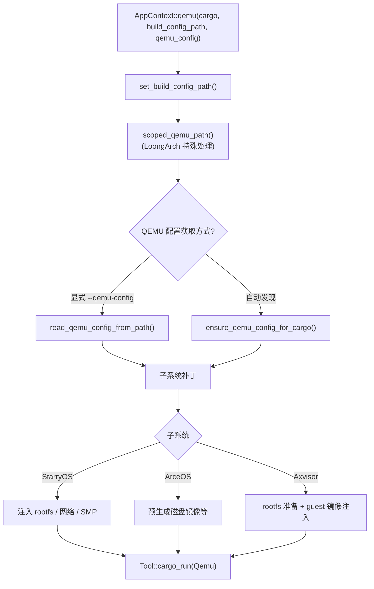
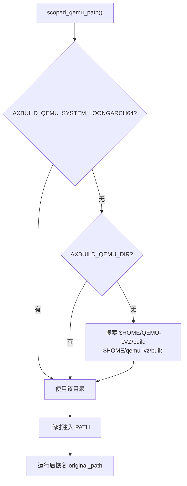
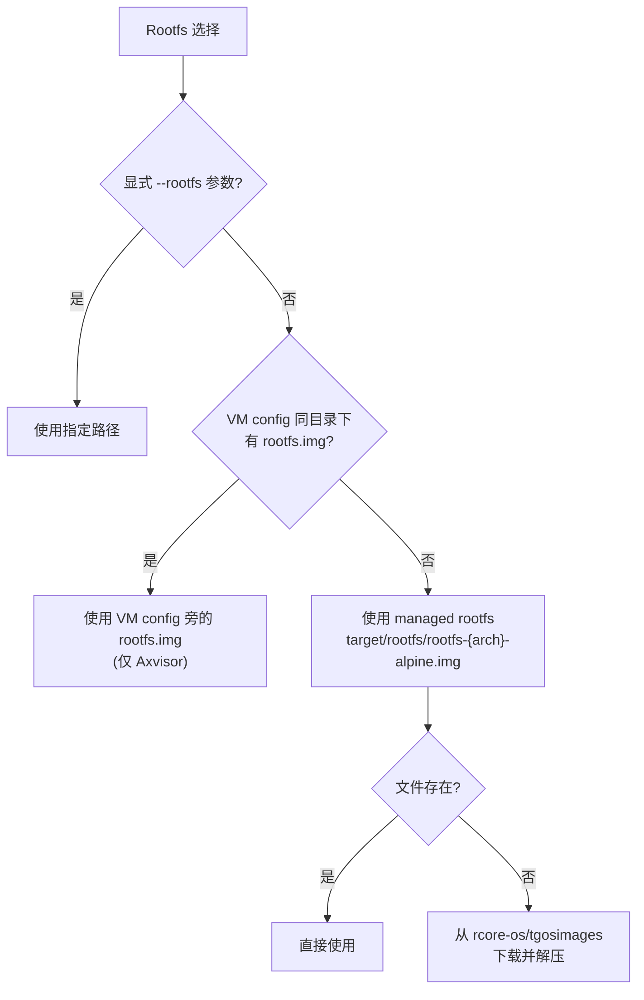

# 运行

`cargo xtask <os> qemu/uboot/board` 在构建基础上增加运行环节。运行过程的核心是**将编译好的 OS 产物部署到目标环境（QEMU 虚拟机、U-Boot 引导或物理板卡）中执行**，并收集运行输出。`AppContext` 封装了四个执行方法，将底层编译和运行委托给 `ostool::Tool`。

运行阶段与构建阶段共享同一个 `AppContext` 实例。当用户执行 `cargo xtask <os> qemu` 时，系统会先完成完整的构建流程（见 [构建](./build)），然后将编译产物配置到目标运行环境中。三个运行目标（QEMU、U-Boot、Board）的差异主要体现在配置获取方式和运行时环境准备上。

## 执行方法

| 方法 | 功能 | ostool 调用 |
|------|------|-------------|
| `build()` | 纯编译 | `Tool::cargo_build()` |
| `qemu()` | 编译 + QEMU 运行 | `Tool::cargo_run(Qemu)` |
| `run_qemu()` | 仅 QEMU 运行（已构建） | `Tool::run_qemu()` |
| `uboot()` | 编译 + U-Boot 运行 | `Tool::cargo_run(Uboot)` |
| `board()` | 编译 + 板卡运行 | `Tool::cargo_run_board()` |

五个方法中，`build()` 仅编译不运行；`qemu()`、`uboot()` 和 `board()` 先编译再运行；`run_qemu()` 仅运行已编译好的产物，用于测试场景中每组构建后逐 case 运行。`qemu()` 和 `uboot()` 调用 ostool 的 `cargo_run()`（传入不同的运行模式），`board()` 调用 `cargo_run_board()` 与远程板卡交互，`run_qemu()` 调用 ostool 的 `run_qemu()` 直接启动 QEMU。

## QEMU 运行

QEMU 运行是三个运行目标中最复杂的，因为需要准备完整的虚拟机环境。流程分为四个阶段：**配置获取**（从显式路径或自动发现得到 QEMU 配置）、**环境准备**（子系统特有的 rootfs、网络、磁盘等准备）、**子系统补丁**（将子系统特定的运行时参数注入 QEMU 配置）、**执行**（通过 ostool 启动 QEMU 并等待运行完成）。

### QEMU 配置获取

1. **显式指定**：`--qemu-config <path>` → `Tool::read_qemu_config_from_path_for_cargo()`
2. **自动发现**：ostool 根据包名和 target 自动查找 → `Tool::ensure_qemu_config_for_cargo()`

显式指定用于测试场景（每个测试用例有自己的 `qemu-{arch}.toml`），自动发现用于开发场景（ostool 在标准路径中搜索匹配的配置文件）。

### LoongArch 特殊处理

Axvisor 的 loongarch64 target 需要带 LVZ 扩展的定制 QEMU。`AppContext::scoped_qemu_path()` 自动搜索：

龙芯架构的虚拟化需要 LVZ（Loongson Virtualization Extension）支持的 QEMU，而标准发行版的 QEMU 不包含此扩展。axbuild 通过 `scoped_qemu_path()` 自动定位 LVZ 版 QEMU：优先使用环境变量 `AXBUILD_QEMU_SYSTEM_LOONGARCH64` 指定的路径，其次搜索 `$HOME/QEMU-LVZ/build` 等常见安装位置。找到后临时将该目录添加到 PATH 前面，运行完成后恢复原始 PATH。

## U-Boot 运行

编译后通过 U-Boot 运行，调用 `Tool::cargo_run(Uboot)`。U-Boot 配置通过 `--uboot-config` 指定，否则由 ostool 自动检测。

U-Boot 运行模式用于需要通过 U-Boot 引导加载器的场景（如物理板卡的网络启动）。与 QEMU 运行相比，U-Boot 运行需要额外的引导配置（TFTP 服务器地址、内核加载地址等），这些参数在 U-Boot 配置文件中定义。

## 板卡运行

编译后在远程板卡运行，通过 `ostool-server` 交互。接收 `BoardRunConfig` 和 `RunBoardOptions`（含 `server`、`port`、`board_type`）。

板卡运行是三个运行目标中最接近真实硬件的。`ostool-server` 运行在连接物理板卡的宿主机上，提供板卡分配、固件部署和串口交互的 API。axbuild 将编译产物和运行配置发送给 ostool-server，后者负责将固件刷写到板卡并收集串口输出。

板卡管理命令：

| 子命令 | 说明 |
|--------|------|
| `cargo xtask board ls` | 列出可用远程板卡类型 |
| `cargo xtask board connect -b <type>` | 分配板卡并连接串口 |
| `cargo xtask board config` | 编辑板卡服务器配置 |

## rootfs 基础设施

`scripts/axbuild/src/rootfs/` 提供三套子系统共享的 rootfs 管理：

| 模块 | 职责 |
|------|------|
| `store` | 镜像查找、命名、下载、缓存（按 arch 区分） |
| `inject` | 内容提取与 overlay 目录注入 |
| `qemu` | 将 rootfs 路径补丁到 QEMU 配置（`-drive`、`-net`） |
| `runtime` | 运行时依赖同步 |

rootfs 是 StarryOS 和 Axvisor 运行的基础——OS 内核本身需要一个用户空间文件系统来执行 init 脚本和测试命令。`rootfs/` 模块将 rootfs 的获取、缓存和注入逻辑封装为可复用的原语，避免各子系统重复实现。`store` 模块负责从远程仓库下载 Alpine Linux 基础镜像并按架构缓存到 `target/rootfs/`；`inject` 模块将 overlay 目录的内容合并到 rootfs 镜像中；`qemu` 模块将 rootfs 路径注入 QEMU 的 `-drive` 和 `-net` 参数。

### Rootfs 选择

Rootfs 选择遵循三级回退策略：用户显式指定优先，其次检查 VM 配置旁的本地镜像（Axvisor 特有），最后回退到 managed rootfs（自动下载并缓存的 Alpine Linux 镜像）。这种设计确保了首次使用时自动获取基础镜像，后续运行直接复用缓存。

StarryOS 额外管理：
- APK 区域自动配置（`/etc/apk/repositories`）
- DNS 解析器注入（QEMU slirp 模式 `nameserver 10.0.2.3`）
- ext4 镜像格式检测与文件替换

StarryOS 的 rootfs 管理比 Axvisor 更复杂，因为它需要在 rootfs 内安装额外的软件包（通过 APK）和配置网络（DNS 解析器），以支持 Shell 和 Python 测试用例的运行。
