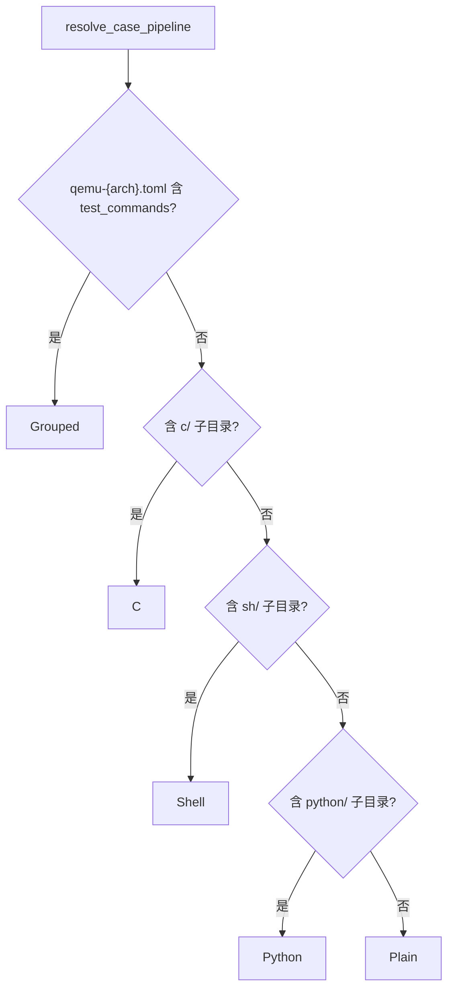
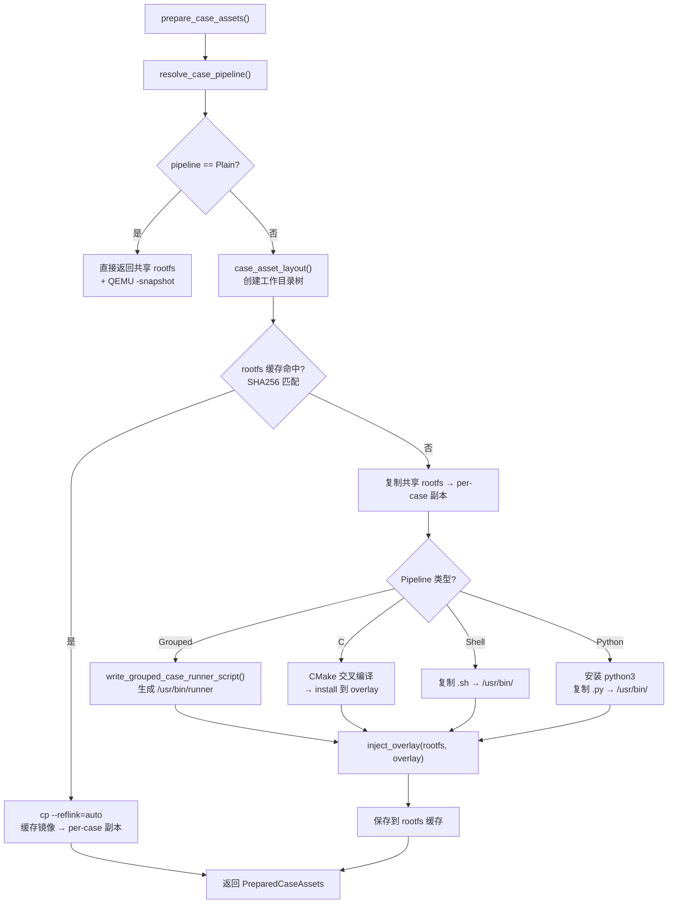

# 资产准备

资产准备是用例发现与 QEMU 执行之间的桥梁。它根据每个用例的类型（Plain/C/Shell/Python/Grouped），决定是否需要向 rootfs 镜像中注入额外的文件（可执行程序、脚本、Python 解释器等），并生成 per-case 的 rootfs 副本供 QEMU 使用。

资产准备的性能优化依赖 **SHA256 内容哈希缓存**：当用例源文件和 rootfs 基础镜像都没有变化时，直接从缓存复制（利用 CoW 快照），跳过 CMake 编译和 overlay 注入等耗时操作。这使得重复运行测试套件的速度大幅提升。

## Pipeline 判定

`resolve_case_pipeline()` 根据用例目录内容判定资产处理方式，**互斥**（只能选一种）：



| Pipeline | 触发条件 | 处理方式 |
|----------|----------|----------|
| **Plain** | 无 `c/`、`sh/`、`python/`，无 `test_commands` | 直接使用共享 rootfs，QEMU `-snapshot` |
| **Grouped** | `test_commands` 非空 | 生成 runner 脚本 → overlay 注入 rootfs |
| **C** | 含 `c/` 子目录 | CMake 交叉编译 → 安装到 overlay → 注入 rootfs |
| **Shell** | 含 `sh/` 子目录 | 复制脚本到 `/usr/bin/` → overlay 注入 rootfs |
| **Python** | 含 `python/` 子目录 | 安装 python3 + 复制 `.py` → overlay 注入 rootfs |

Pipeline 判定的优先级顺序是有意义的：`test_commands` 优先于目录检测，因为 Grouped 模式可能在没有任何资产子目录的情况下使用。五种 Pipeline 的处理复杂度从 Plain（零成本）到 C（需要完整的交叉编译工具链）递增。

## 总体流程



对于 Plain 用例，资产准备几乎是零开销——直接使用共享的 rootfs 镜像，配合 QEMU 的 `-snapshot` 选项实现无写回的只读运行。对于需要注入的用例，流程为：创建 per-case 工作目录 → 检查缓存 → 缓存未命中时执行具体的 pipeline → 注入 overlay → 写入缓存。缓存命中时使用 `cp --reflink=auto`（在支持 CoW 的文件系统上几乎是瞬间完成）。

## 工作目录布局

每个需要注入的 case 会创建以下目录树：

```text
target/{target}/qemu-cases/{case_name}/
├── cache/
│   ├── apk-cache/              APK 包缓存（跨 run 复用）
│   └── rootfs/                 预注入 rootfs 缓存（{sha256}.img）
└── runs/{pid}-{sequence}/
    ├── staging-root/            rootfs 内容提取暂存
    ├── build/                   CMake 构建目录
    ├── overlay/                 overlay 注入内容
    │   └── usr/bin/             可执行文件/脚本
    ├── cross-bin/               交叉编译 wrapper 脚本
    ├── guest-bin/               guest 命令 wrapper
    ├── cmake-toolchain.cmake    CMake 工具链文件
    └── case-rootfs.img          per-case rootfs 副本
```

工作目录按 `case_name` 隔离，使得不同用例的构建产物和缓存互不干扰。`cache/` 目录在多次运行间持久存在（缓存命中检查在此进行），`runs/` 目录按 `{pid}-{sequence}` 命名以支持并发执行。`overlay/` 目录中的内容会被整体注入到 rootfs 镜像中——`inject_overlay()` 函数遍历 overlay 目录树，将文件逐个复制到 rootfs 对应路径。

## Rootfs 缓存

为避免重复的资产准备（CMake 编译、overlay 注入），系统使用 **SHA256 内容哈希** 缓存。

缓存键计算涉及：
- 架构、target、pipeline 类型
- case 目录所有源文件的**递归哈希**
- rootfs 镜像元数据
- `CROSS_COMPILE` 等环境变量
- CMake 工具链模板（C pipeline）
- Python pipeline 版本标记

缓存命中时，直接 `cp --reflink=auto`（CoW 快照）复制缓存镜像，跳过所有构建和注入步骤。

缓存键的设计目标是**确保任何影响用例运行行为的变更都会使缓存失效**。源文件的递归哈希覆盖了 C 源码、Shell 脚本、Python 脚本等所有可能变化的文件。环境变量（如 `CROSS_COMPILE`）的变更也会导致缓存失效，因为不同的编译器可能产生不同的二进制产物。`--reflink=auto` 在 Btrfs 等支持 CoW 的文件系统上实现零拷贝快照，在 ext4 上退化为普通复制。

## Grouped Pipeline

Grouped case 生成一个 shell runner 脚本，按顺序执行 `test_commands` 中的每条命令：

```bash
#!/bin/sh
set -u
failed=0
printf '%s\n' 'SUITE_GROUPED_TEST_BEGIN: /usr/bin/test-a'
if sh -c '/usr/bin/test-a'; then
    printf '%s\n' 'SUITE_GROUPED_TEST_PASSED: /usr/bin/test-a'
else
    status=$?
    printf '%s status=%s\n' 'SUITE_GROUPED_TEST_FAILED: /usr/bin/test-a' "$status"
    failed=1
fi
# ... 更多命令 ...
if [ "$failed" -eq 0 ]; then
    printf '%s\n' 'SUITE_GROUPED_TESTS_PASSED'
    exit 0
fi
printf '%s\n' 'SUITE_GROUPED_TESTS_FAILED'
exit 1
```

QEMU 配置被覆盖：`shell_init_cmd` → runner 路径，`success_regex` / `fail_regex` → grouped 专用正则。

Grouped Pipeline 的设计动机是支持一个用例内执行多条命令并分别判定结果。生成的 runner 脚本按顺序执行每条命令，输出带有结构化标记（`SUITE_GROUPED_TEST_BEGIN/PASSED/FAILED`）的日志，使得 axbuild 可以通过正则匹配精确统计每条命令的通过/失败状态。QEMU 配置中的 `shell_init_cmd` 和正则被自动覆盖为 grouped 专用版本。

## C Pipeline

C 用例通过 CMake 交叉编译：

1. 从 `cross_compile_spec(arch)` 获取 musl 交叉编译器路径
2. 生成 `cmake-toolchain.cmake`（含 CC、CXX、AR、RANLIB、SYSROOT）
3. `cmake -B build -DCMAKE_INSTALL_PREFIX=/usr`
4. `cmake --build build`
5. `cmake --install build --prefix overlay/usr`
6. `inject_overlay(rootfs_copy, overlay_dir)`

C Pipeline 是最复杂的资产处理流程，涉及完整的交叉编译工具链配置。`cross_compile_spec()` 根据目标架构返回 musl 交叉编译器的路径前缀（如 `aarch64-linux-musl-`），生成的 CMake 工具链文件设置了正确的编译器、归档器和 sysroot 路径。编译产物通过 `cmake --install` 安装到 overlay 目录，最终整体注入 rootfs。

## Shell Pipeline

最简单的注入方式：

1. 复制 `sh/` 下所有文件到 `overlay/usr/bin/`
2. 设置可执行权限（0o755）
3. `inject_overlay(rootfs_copy, overlay_dir)`

Shell Pipeline 不涉及编译，仅做文件复制和权限设置。注入的脚本文件会被放到 rootfs 的 `/usr/bin/` 目录下，使得 QEMU 内的 shell 可以直接通过文件名调用。
