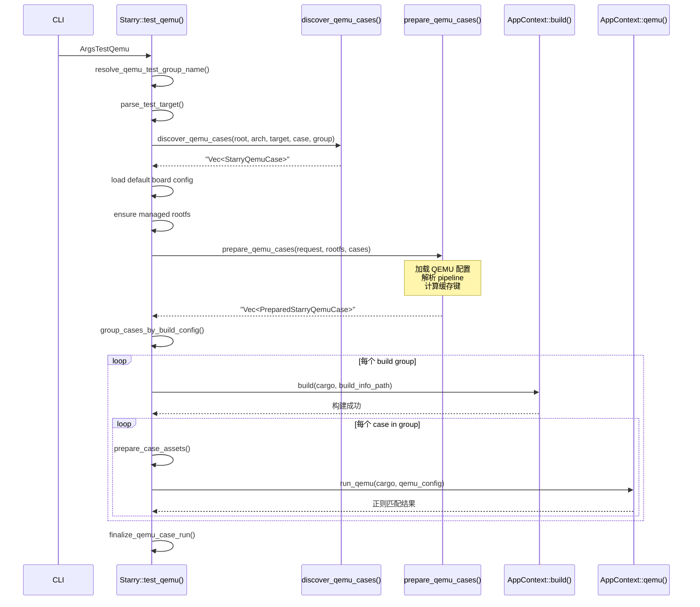

# StarryOS 测试

StarryOS 的测试体系围绕 **normal/stress 双分组**和 **五种 pipeline 类型**（Plain/C/Shell/Python/Grouped）展开。与 ArceOS 不同，StarryOS 编译的是完整的操作系统内核（而非单个 app），因此同一构建组内的所有用例共享同一个 StarryOS 内核镜像。StarryOS 测试还需要 rootfs 支持——测试命令在 rootfs 的用户空间中执行，内核负责提供系统调用和进程管理。

## 命令

```text
# QEMU 测试
cargo xtask starry test qemu --arch <arch> [--test-group <group>] [--stress] [--test-case <case>]
# 板级测试
cargo xtask starry test board [--test-group <group>] [--test-case <case>] [--board <name>]
```

QEMU 测试和板级测试使用不同的命令入口。`--stress` 是 `--test-group stress` 的快捷方式，方便运行压力测试组。板级测试通过 `--board` 参数指定目标板卡类型。

## 分组

| 分组 | 路径 | 选择方式 |
|------|------|----------|
| `normal` | `test-suit/starryos/normal/` | 默认 |
| `stress` | `test-suit/starryos/stress/` | `--stress` 或 `--test-group stress` |

normal 组包含功能测试（如 smoke、syscall、affinity），stress 组包含压力测试（如并发、长时间运行）。两组的目录结构相同，只是内容不同。默认运行 normal 组，因为 stress 组的测试通常耗时较长。

## 用例类型

- **Plain**：仅 `qemu-{arch}.toml`（如 `smoke`、`affinity`）
- **C**：含 `c/` 子目录，CMake 交叉编译（如 `bugfix`、`test-mremap`）
- **Shell**：含 `sh/` 子目录（如 `busybox`）
- **Python**：含 `python/` 子目录（如 `python-hello`）
- **Grouped**：`qemu-{arch}.toml` 中使用 `test_commands`（如 `bugfix`）

StarryOS 支持全部五种 pipeline 类型，这得益于其完整的用户空间环境（Alpine Linux rootfs）。C 用例通过 musl 交叉编译器编译为静态可执行文件，Shell 用例直接复制到 rootfs 的 `/usr/bin/`，Python 用例需要先在 rootfs 中安装 python3 解释器。

## QEMU 执行流程



序列图展示了完整的 StarryOS QEMU 测试流程。关键步骤说明：

1. **参数解析**：`resolve_qemu_test_group_name()` 根据 `--stress` 和 `--test-group` 参数确定测试组名（`normal` 或 `stress`），`parse_test_target()` 解析目标架构。
2. **用例发现**：`discover_qemu_cases()` 执行 DFS 扫描，返回所有匹配的 `StarryQemuCase`。
3. **rootfs 准备**：`ensure managed rootfs` 确保目标架构的 Alpine Linux rootfs 镜像已下载并缓存。
4. **资产准备**：`prepare_qemu_cases()` 为每个用例判定 pipeline 类型、计算缓存键、准备 per-case rootfs。
5. **分组构建**：按 build config 分组后，每组只调用一次 `AppContext::build()` 编译 StarryOS 内核。
6. **逐 case 运行**：内层循环中，每个用例独立准备资产、运行 QEMU、通过正则判定结果。
7. **结果汇总**：`finalize_qemu_case_run()` 收集所有用例的通过/失败状态，输出结构化报告。

## 结果报告

StarryOS 测试完成后输出结构化报告：

```text
starry normal qemu summary:
passed (3):
  qemu-smp1/smoke (1.23s)
  qemu-smp1/syscall (2.45s)
  qemu-smp4/affinity (3.67s)
failed (1):
  qemu-smp1/bugfix (5.89s)
total: 13.24s
```

报告按通过和失败分类列出每个用例的 display_name 和耗时，最后给出总耗时。这种格式便于快速定位失败的用例，同时评估整体测试性能。

## Board 执行流程

1. 从 `test-suit/starryos/<group>/` 递归发现 `board-*.toml`
2. 每个 board config 关联到最近的 build wrapper
3. 按 case / board 过滤
4. 逐组构建 → 加载 board run config → `AppContext::board()` 运行

StarryOS 板级测试的流程与 QEMU 测试类似，但运行目标从 QEMU 虚拟机切换为物理板卡。每个 board 配置文件通过 `nearest_build_wrapper()` 向上查找最近的构建配置，复用已有的 build wrapper 定义。`AppContext::board()` 将编译好的 StarryOS 内核通过 ostool-server 部署到目标板卡，等待串口输出并进行结果判定。
