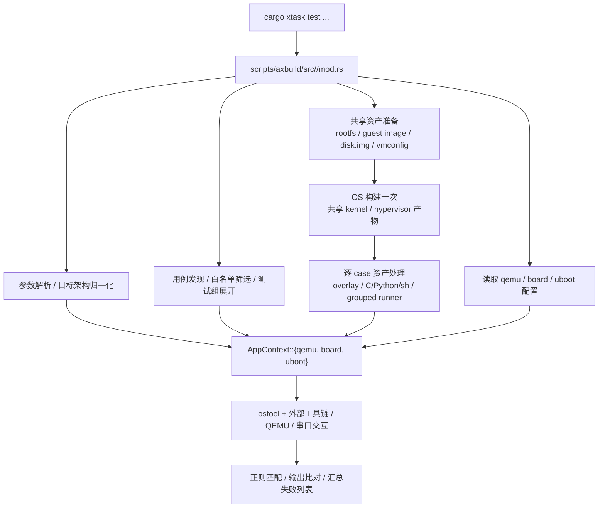
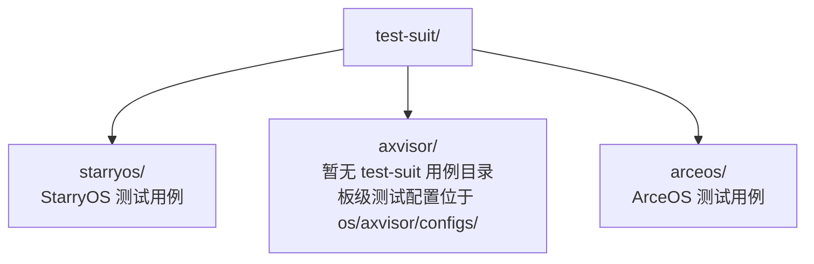

# 测试套件总览

`test-suit/` 是所有 OS 测试用例的统一入口，按操作系统划分为独立目录。每个目录由对应的 `cargo xtask <os>` 子命令负责发现、构建和运行测试。

## 1. 总体定位

`docs/docs/design/test` 关注测试套件的组织方式、实现入口、运行链路和基础设施。重点是“测试如何被组织和执行”，而不是各子系统所有构建命令的完整使用手册。

## 2. 测试架构总图

当前仓库的主流测试链路统一收敛到 `scripts/axbuild` 中的测试入口，再通过 `AppContext` 和 `ostool` 执行底层构建、QEMU、U-Boot 或板级运行。StarryOS 与 Axvisor 的 QEMU 测试现在采用基本一致的编排模型：先发现本轮要运行的全部 case，再准备共享构建请求和 rootfs，OS 本体只构建一次，随后逐 case 读取运行配置并启动 QEMU。

本目录中的测试文档主要描述以下实现要素：

- 测试入口在什么代码路径
- 用例是自动发现还是硬编码注册
- 运行前会准备哪些资产
- 哪些资产在 suite 级共享，哪些资产在 case 级注入
- 成功/失败如何判定
- 当前哪些能力是正式支持，哪些仍是占位或限制项

## 3. 目录结构总览

除 `test-suit/` 下的 OS 级测试外，仓库还维护两类主机端（host）自动化验证：

| 验证类型 | 入口命令 | 配置来源 |
|----------|---------|---------|
| 标准库测试 | `cargo xtask test` | `scripts/test/std_crates.csv`（包白名单） |
| Clippy 检查 | `cargo xtask clippy` | `scripts/test/clippy_crates.csv`（包清单） |

标准库测试对白名单中的每个 crate 执行 `cargo test -p <package>`，验证其在当前工具链下能否通过编译和单元测试。这两类验证均在 CI 的 container 环境中运行，与 OS 级 QEMU 测试共享同一基础镜像。

## 4. 实现入口

当前测试体系的主要实现入口如下：

| 范围 | 主要实现入口 | 说明 |
|------|--------------|------|
| StarryOS 测试 | `scripts/axbuild/src/starry/mod.rs`、`scripts/axbuild/src/starry/test.rs`、`scripts/axbuild/src/test/` | 负责 case 发现、共享 rootfs 准备、OS build-once、case 资产注入和运行汇总 |
| Axvisor 测试 | `scripts/axbuild/src/axvisor/mod.rs`、`scripts/axbuild/src/axvisor/test.rs`、`scripts/axbuild/src/test/` | 负责 QEMU/U-Boot/板测分发、guest/rootfs 准备、OS build-once 和 test-suit 用例展开 |
| ArceOS 测试 | `scripts/axbuild/src/arceos/mod.rs`、`scripts/axbuild/src/arceos/test.rs`、`scripts/axbuild/src/test/` | 负责 Rust/C 测试分流、包白名单、C 测试目录白名单和运行汇总 |
| 主机端测试 | `scripts/axbuild/src/test/std.rs`、`cargo xtask clippy` 对应入口 | 负责白名单 std 测试和静态检查 |

## 5. 覆盖范围

本目录覆盖主流测试套件的实现与组织方式，重点包括：

- StarryOS 的 `test-suit` 驱动 QEMU / board 测试
- Axvisor 的 QEMU / U-Boot / board 测试入口
- ArceOS 的 Rust / C QEMU 测试入口
- 测试基础设施、容器环境和命名规则

未在本目录中完整展开的内容包括：

- `ostool` 内部的 QEMU / board / U-Boot 执行细节
- 各 OS 普通 `build/qemu/board/uboot` 命令的完整构建系统细节
- 非主流或仍在演进中的占位测试能力

## 6. 文档结构

当前测试文档按系统边界和共享主题拆分如下：

| 主题 | 文档 | 内容范围 |
|------|------|----------|
| 测试体系总览 | 本文 | 测试架构、目录结构、实现入口、文档结构 |
| CI 自动测试 | [CI 自动测试实现](/docs/design/test/ci) | `ci.yml` 的触发条件、矩阵展开、host/container 分流、跳过逻辑与镜像发布 |
| 命名规则与共享配置 | [命名规则与共享配置](/docs/design/test/naming) | 共享配置文件类型、目录/文件命名规则、架构命名、发现路径约定 |
| 测试基础设施与环境 | [测试基础设施与环境](/docs/design/test/infrastructure) | Container 镜像设计、CI 集成方式、镜像发布流程与触发条件 |
| StarryOS 测试套件 | [StarryOS 测试套件设计](/docs/design/test/starryos) | 分组、现有用例清单、C/Rust/无源码用例、QEMU 与板级测试流程、新增用例指南 |
| Axvisor 测试套件 | [Axvisor 测试套件设计](/docs/design/test/axvisor) | QEMU、U-Boot、板级测试的 test-suit 用例组织和新增指南 |
| ArceOS 测试套件 | [ArceOS 测试套件设计](/docs/design/test/arceos) | C/Rust 测试结构、发现机制、构建运行流程、构建配置与新增指南 |

## 7. 相关文档

- [CI 自动测试实现](/docs/design/test/ci)：GitHub Actions 中的自动测试与镜像发布链路
- [命名规则与共享配置](/docs/design/test/naming)：共享配置类型、命名规则与发现路径约定
- [测试基础设施与环境](/docs/design/test/infrastructure)：Container 镜像、CI 环境与发布流程
- [StarryOS 测试套件设计](/docs/design/test/starryos)：StarryOS 测试编排、case 结构与运行流程
- [Axvisor 测试套件设计](/docs/design/test/axvisor)：Axvisor 的 QEMU/U-Boot/board 测试入口
- [ArceOS 测试套件设计](/docs/design/test/arceos)：ArceOS Rust/C 测试入口与执行流程
