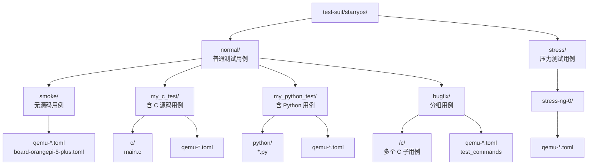
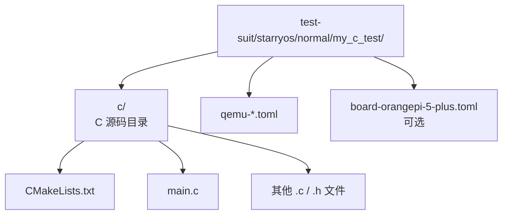
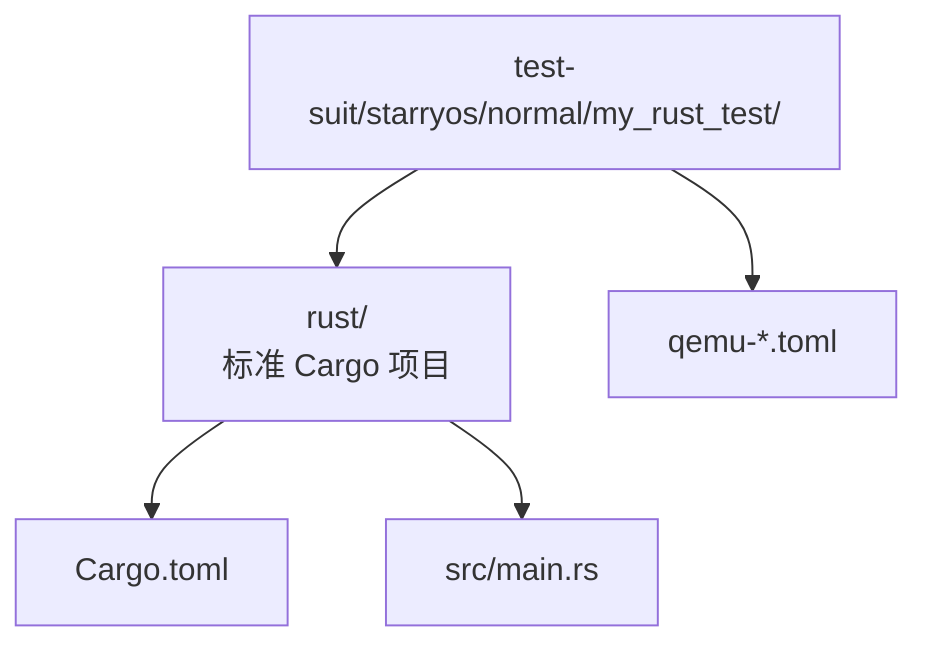
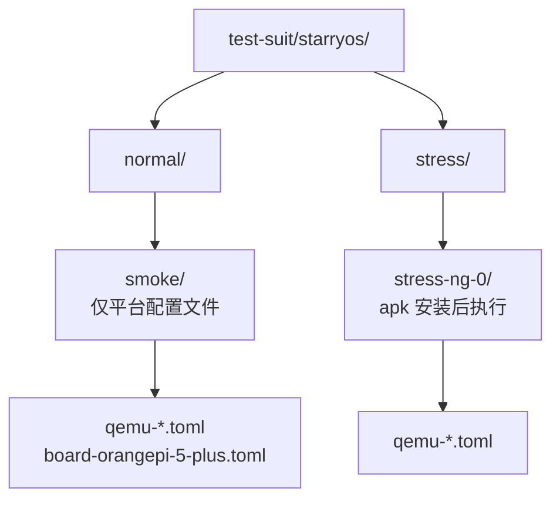

# StarryOS 测试套件设计

## 1. 概览

StarryOS 测试分为**普通测试**（`normal/`）和**压力测试**（`stress/`）两组。每组下第一层是 build group（例如 `qemu-smp1`、`qemu-smp4`），build group 下的子目录才是测试 case。case 可以无源码（仅平台配置文件），也可以包含 C、Shell 或 Python 资产（分别放在 `c/`、`sh/` 或 `python/` 子目录中）。case 目录名即测试用例名，由 xtask 自动扫描发现。

从 `scripts/axbuild` 的当前实现看，StarryOS QEMU 测试已经和 Axvisor QEMU 测试采用基本一致的 suite 编排方式：先发现本轮全部 case，准备共享 build request 和 rootfs，OS 本体只构建一次，然后逐 case 加载 `qemu-{arch}.toml` 并运行。case 资产仍按 case 准备和注入，但 rootfs 不再复制多份。

### 1.1 入口

当前 StarryOS 测试套件的权威实现入口主要在：

- `scripts/axbuild/src/starry/mod.rs`
- `scripts/axbuild/src/starry/test.rs`
- `scripts/axbuild/src/test/`
- `scripts/axbuild/src/starry/rootfs.rs`

其中：

- `mod.rs` 负责 CLI 参数解析、测试分发和逐 case 执行
- `test.rs` 负责测试组、case 发现、目标归一化和结果汇总
- `scripts/axbuild/src/test/` 负责 case 资产准备、测例构建和共享 QEMU 汇总能力
- `rootfs.rs` 负责 rootfs 下载和默认 QEMU 参数补齐



### 1.2 分组

| 分组 | 路径 | 说明 | 运行命令 |
|------|------|------|----------|
| normal | `test-suit/starryos/normal/` | 普通功能测试 | `cargo xtask starry test qemu --target <arch>` |
| stress | `test-suit/starryos/stress/` | 压力/负载测试 | `cargo xtask starry test qemu --target <arch> --stress` |

#### 1.2.1 执行链路

从实现上看，`cargo xtask starry test qemu ...` 的主流程为：

1. 在 `mod.rs` 中解析 `--target`、`--test-group`、`--test-case`
2. 在 `test.rs` 中归一化目标架构并发现当前测试组的 case
3. 依据目标架构发现匹配的 build group，并确保共享 managed rootfs 已就绪
4. 预读所有 case 的 `qemu-{arch}.toml`，按 build config 和 `-smp` 需求分组
5. 按每个构建分组构建 StarryOS
6. 对每个 case：
   - 读取 case 自己的 `qemu-{arch}.toml`
   - 调用共享 `test::case::prepare_case_assets(...)` 准备 case overlay、C/Python/sh 资产或 grouped runner
   - 将 case 资产注入共享 rootfs 路径；不会为每个 case 复制一份 rootfs 镜像
   - 将 case 级 QEMU 配置交给 `AppContext::qemu(...)`
7. 汇总通过/失败列表并输出总耗时

在当前实现中，case 目录结构、rootfs 资产准备和 QEMU 判定逻辑属于同一条执行链路；suite 级共享 OS 构建与 rootfs，case 级只处理需要注入的 overlay 和运行配置。

### 1.3 普通用例

以下为 `normal/` 目录下当前已注册的全部测试用例：

| 用例名 | 类型 | 说明 | 特殊说明 |
|--------|------|------|----------|
| `affinity` | 无源码 | CPU affinity / 调度相关冒烟命令 | 当前仅有 `qemu-x86_64.toml` |
| `bug-rename-replace` | C | rename/replace 行为回归测试 | 使用 `prebuild.sh` |
| `bug-tmpfs-hardlink-cache` | C | tmpfs hardlink cache 回归测试 | 使用 `prebuild.sh` |
| `bugfix` | 分组 C 用例 | 多个 bugfix 子用例聚合运行 | `qemu-{arch}.toml` 使用 `test_commands`，子目录下包含多个 `c/` 用例 |
| `busybox` | Shell | BusyBox 测试脚本 | 使用 `sh/` 目录注入脚本 |
| `findutils` | C | findutils 相关测试 | 使用 `prebuild.sh` |
| `grep` | C | grep 相关测试 | 使用 `prebuild.sh` |
| `python-hello` | Python | Python 运行环境与脚本冒烟测试 | 使用 `python/` 目录并在 rootfs 中安装 python3 |
| `riscv64-regression` | 无源码 | RISC-V 回归命令集合 | 当前仅有 `qemu-riscv64.toml` |
| `smoke` | 无源码 | 冒烟测试：启动后执行 Shell 命令验证系统基本可用 | 含板级配置 `board-orangepi-5-plus.toml` |
| `syscall` | 无源码 | 系统调用测试集合 | 使用 guest rootfs 中已有测试命令 |
| `test-shm-deadlock` | C | shared memory deadlock 回归测试 | 使用 `prebuild.sh` |
| `test-vectored-io` | C | vectored I/O 回归测试 | 使用 `prebuild.sh` |
| `usb` | USB 设备驱动测试 | USB 子系统功能验证 | 使用 case 级 `build-aarch64-unknown-none-softfloat.toml` 和 `prebuild.sh` |

### 1.4 压力用例

| 用例名 | 类型 | 说明 |
|--------|------|------|
| `stress-ng-0` | 无源码 | 通过 apk 安装 stress-ng 执行 CPU/内存/信号压力测试 |

> **注**：StarryOS 当前暂无正式落地的 Rust 测试用例；分组用例中如果出现 Rust 子用例，`scripts/axbuild/src/test/build.rs` 目前会显式拒绝。Rust 测试的目录结构模板（§4）保留供后续扩展使用。

## 2. C 用例

### 2.1 结构



### 2.2 源码

| 文件/目录 | 必需 | 说明 |
|-----------|------|------|
| `c/` | 是（C 测试） | C 源码目录，包含所有 `.c`、`.h` 文件和 CMake 脚本 |
| `c/CMakeLists.txt` | 是 | CMake 构建脚本，定义目标架构的交叉编译规则 |
| `c/main.c` | 是 | C 入口文件，包含 `main()` 函数 |
| `c/*.c` | 是 | 其他 C 源文件 |

#### 2.2.1 扩展文件

部分测试用例可能包含以下额外文件：

| 文件/目录 | 说明 | 示例用例 |
|-----------|------|----------|
| `c/prebuild.sh` | 构建前执行的预处理脚本，用于生成代码或准备依赖 | `usb` |
| `c/include/` | 额外的头文件目录，供 C 源码 `#include` 引用 | `usb` |

#### 2.2.2 架构支持

默认情况下，每个测试用例应为所有支持的目标架构提供对应的 `qemu-{arch}.toml`。若某用例仅适用于特定架构，则只需提供该架构的配置文件，xtask 扫描时将自动跳过不匹配的架构。当前示例：

| 用例名 | 支持架构 | 原因 |
|--------|---------|------|
| `times` | 仅 riscv64 | 该测试验证 riscv64 特定的 times 系统调用行为 |

### 2.3 QEMU 配置

`qemu-{arch}.toml` QEMU 测试配置，放在用例根目录下（与 `c/` 同级），定义 QEMU 启动参数、Shell 交互行为以及测试结果判定规则。

**示例** — `normal/qemu-smp1/smoke/qemu-x86_64.toml`：

```toml
args = [
    "-nographic",
    "-device",
    "virtio-blk-pci,drive=disk0",
    "-drive",
    "id=disk0,if=none,format=raw,file=${workspace}/target/rootfs/rootfs-x86_64-alpine.img",
    "-device",
    "virtio-net-pci,netdev=net0",
    "-netdev",
    "user,id=net0",
]
uefi = false
to_bin = false
shell_prefix = "root@starry:"
shell_init_cmd = "pwd && echo 'All tests passed!'"
success_regex = ["(?m)^All tests passed!\\s*$"]
fail_regex = ['(?i)\bpanic(?:ked)?\b']
timeout = 15
```

**示例** — `stress/stress-ng-0/qemu-x86_64.toml`：

```toml
args = [
    "-nographic",
    "-device",
    "virtio-blk-pci,drive=disk0",
    "-drive",
    "id=disk0,if=none,format=raw,file=${workspace}/target/rootfs/rootfs-x86_64-alpine.img",
    "-device",
    "virtio-net-pci,netdev=net0",
    "-netdev",
    "user,id=net0",
]
uefi = false
to_bin = false
shell_prefix = "starry:~#"
shell_init_cmd = '''
apk update && \
apk add stress-ng && \
stress-ng --cpu 8 --timeout 10s && \
stress-ng --sigsegv 8 --sigsegv-ops 1000    && \
pwd && ls -al && echo 'All tests passed!'
'''
success_regex = ["(?m)^All tests passed!\\s*$"]
fail_regex = ['(?i)\bpanic(?:ked)?\b', '(m)^stress-ng: info: .*failed: [1-9]\d*\s*$']
timeout = 50
```

**字段说明：**

| 字段 | 类型 | 必需 | 默认值 | 说明 |
|------|------|------|--------|------|
| `args` | `[String]` | 是 | — | QEMU 命令行参数，支持 `${workspace}` 占位符 |
| `uefi` | `bool` | 否 | `false` | 是否使用 UEFI 启动 |
| `to_bin` | `bool` | 否 | `false` | 是否将 ELF 转换为 raw binary |
| `shell_prefix` | `String` | 否 | — | Shell 提示符前缀，用于检测 shell 就绪 |
| `shell_init_cmd` | `String` | 否 | — | Shell 就绪后执行的命令，支持多行 `'''` |
| `success_regex` | `[String]` | 是 | — | 成功判定正则列表，任一匹配即判定成功 |
| `fail_regex` | `[String]` | 否 | `[]` | 失败判定正则列表，任一匹配即判定失败 |
| `timeout` | `u64` | 否 | — | 超时秒数 |

### 2.4 Board 配置

`board-{board_name}.toml` 板级测试配置，放在用例根目录下（与 `c/` 同级），用于物理开发板上的测试，通过串口交互判定结果。与 QEMU 配置相比没有 `args`、`uefi`、`to_bin` 字段，但增加了 `board_type` 标识板型。

**示例** — `normal/board-orangepi-5-plus/npu-yolov8/board-orangepi-5-plus.toml`：

```toml
board_type = "OrangePi-5-Plus"
shell_prefix = "root@starry:/root #"
shell_init_cmd = "pwd && echo 'test pass'"
success_regex = ["(?m)^test pass\\s*$"]
fail_regex = []
timeout = 300
```

**字段说明：**

| 字段 | 类型 | 必需 | 说明 |
|------|------|------|------|
| `board_type` | `String` | 是 | 板型标识，需对应 `os/StarryOS/configs/board/{board_name}.toml` |
| `shell_prefix` | `String` | 是 | Shell 提示符前缀 |
| `shell_init_cmd` | `String` | 是 | Shell 就绪后执行的命令 |
| `success_regex` | `[String]` | 是 | 成功判定正则列表 |
| `fail_regex` | `[String]` | 否 | 失败判定正则列表 |
| `timeout` | `u64` | 是 | 超时秒数，物理板通常需要更长时间（如 300s） |

### 2.5 QEMU 流程

#### 2.5.1 参数

```text
cargo xtask starry test qemu --target <arch> [--test-group <group>] [--stress] [--test-case <case>]
```

| 参数 | 说明 |
|------|------|
| `--target` / `-t` | 目标架构或完整 target triple（如 `aarch64`、`riscv64`、`x86_64`、`loongarch64`，或 `aarch64-unknown-none-softfloat`、`riscv64gc-unknown-none-elf`） |
| `--test-group` / `-g` | 指定测试组名，默认 `normal`；压力测试使用 `stress` |
| `--stress` | 运行 `stress` 组测试，等价于 `-g stress` |
| `--test-case` / `-c` | 仅运行指定用例 |

#### 2.5.2 发现

xtask 扫描 `test-suit/starryos/{normal|stress}/` 下所有 build group，先根据 `build-<target>.toml` 或 `build-<arch>.toml` 找到当前 arch/target 可用的构建配置，再扫描其中的 case 子目录。若 case 下存在 `qemu-{arch}.toml`，则将该 TOML 文件作为 QEMU 运行配置加载。

```text
构建配置: test-suit/starryos/<group>/<build_group>/build-<target>.toml
发现路径: test-suit/starryos/<group>/<build_group>/<case-name>/qemu-<arch>.toml
```

例如，对于架构 `aarch64`：

- `test-suit/starryos/normal/qemu-smp1/smoke/qemu-aarch64.toml` → build group `qemu-smp1`，用例名 `smoke`
- `test-suit/starryos/stress/stress-ng-0/stress-ng-0/qemu-aarch64.toml` → build group `stress-ng-0`，用例名 `stress-ng-0`

#### 2.5.3 构建

xtask 定位用例目录中的 `c/CMakeLists.txt`，配置交叉编译工具链（根据目标架构选择对应的 sysroot 和 compiler），然后执行 `cmake --build` 编译 C 程序。

CMake 脚本需要满足以下要求：

- 使用 `cmake_minimum_required()` 指定最低版本
- 通过 `project()` 声明项目名称和语言
- 定义可执行目标，将所有 `.c` 源文件加入编译
- 使用交叉编译工具链（xtask 会通过 `CMAKE_TOOLCHAIN_FILE` 传入）

**示例** — `c/CMakeLists.txt`：

```cmake
cmake_minimum_required(VERSION 3.20)
project(my_c_test C)

add_executable(my_c_test main.c)
```

源码要求：

- 入口函数为标准 `int main(void)` 或 `int main(int argc, char *argv[])`
- 可引用标准 C 库头文件（`<stdio.h>`、`<stdlib.h>`、`<string.h>` 等）
- 可引用 POSIX 头文件（`<pthread.h>`、`<unistd.h>`、`<sys/socket.h>` 等）
- 所有 `.c` 和 `.h` 文件放在 `c/` 目录下

#### 2.5.4 Rootfs

rootfs 镜像是 StarryOS 测试的基础运行环境，提供完整的 Linux 用户态文件系统（含 shell、apk 包管理器等）。xtask 在测试运行前自动下载或复用 managed rootfs，并将需要的 case 资产以 overlay 方式注入其中。

**1. 下载 rootfs**

xtask 根据目标架构选择对应的 rootfs 镜像，检查本地是否已存在。若不存在，自动从远程仓库下载压缩包并解压：

```text
下载地址: https://github.com/rcore-os/tgosimages/releases/download/v0.0.5/rootfs-{arch}-alpine.img.tar.xz
存放路径: {workspace}/target/rootfs/rootfs-{arch}-alpine.img
```

各架构对应的 rootfs 文件：

| 架构 | rootfs 文件 | 存放路径 |
|------|------------|----------|
| `x86_64` | `rootfs-x86_64-alpine.img` | `target/rootfs/` |
| `aarch64` | `rootfs-aarch64-alpine.img` | `target/rootfs/` |
| `riscv64` | `rootfs-riscv64-alpine.img` | `target/rootfs/` |
| `loongarch64` | `rootfs-loongarch64-alpine.img` | `target/rootfs/` |

下载流程：

1. 检查 `target/rootfs/rootfs-{arch}-alpine.img` 是否存在
2. 若不存在，下载 `rootfs-{arch}-alpine.img.tar.xz` 到 `target/rootfs/` 目录
3. 从 `.tar.xz` 归档中解出对应 `.img` 镜像
4. 保留归档作为缓存，后续缺失镜像时可复用

也可通过命令手动下载：

```text
cargo xtask starry rootfs --arch <arch>
```

**2. 注入编译产物**

对于含 C、Shell、Python 或 grouped 子用例的测试用例，xtask 将编译产物、脚本、Python 运行环境或 grouped runner 注入到对应架构的 managed rootfs 镜像中，使其在系统启动后可直接通过 shell 执行。

当前实现不会为每个 case 复制一份 rootfs。`test_qemu` 先调用 `ensure_rootfs_in_target_dir(...)` 得到本轮共享的 rootfs 路径，随后每个 case 把自己的 overlay 注入到这个路径。case 之间的构建工作目录仍按 `target/<target>/qemu-cases/<case>/` 隔离，但底层磁盘镜像路径是共享的。

**3. 配置 QEMU 磁盘参数**

xtask 自动将 rootfs 镜像路径注入到 QEMU 的 `-drive` 参数中，替换 TOML 配置里的 `${workspace}` 占位符。如果配置中没有声明磁盘设备参数，xtask 会自动添加默认的 `virtio-blk-pci` 和 `virtio-net-pci` 设备。

#### 2.5.5 执行

1. 加载 `qemu-{arch}.toml` 配置，构造 QEMU 启动命令
2. 启动 QEMU，开始捕获串口输出
3. 若设置了 `shell_prefix`，等待该前缀出现后发送 `shell_init_cmd`
4. 每收到新输出时，先检查 `fail_regex`（任一匹配 → 失败），再检查 `success_regex`（任一匹配 → 成功）
5. 超时未判定 → 失败

#### 2.5.6 补充

StarryOS 当前实现是**suite 级构建一次，逐 case 准备运行资产**：

- 每个 case 会读取自己的 `qemu-{arch}.toml`
- StarryOS 本体在本轮 suite 中只构建一次
- 本轮 suite 共享同一个 managed rootfs 路径，不再复制多份 rootfs
- 只有需要 C/Shell/Python/grouped 资产的 case 会执行 overlay 注入
- 若 QEMU 参数中未声明磁盘设备，运行前会自动补齐默认磁盘与网络参数

这使得不同 case 可以拥有不同的 shell 初始化命令、成功/失败判据和 case 级注入资产；需要注意的是，注入目标是共享 managed rootfs，因此新增测试应避免依赖“每个 case 都从全新 rootfs 开始”的假设。

### 2.6 Board 流程

#### 2.6.1 参数

```text
cargo xtask starry test board [--board <board>] [--test-group <group>] [--test-case <case>] [--board-type <type>] [--server <addr>] [--port <port>]
```

| 参数 | 说明 |
|------|------|
| `--board` | 指定开发板名，运行该开发板下所有匹配的 board 测例 |
| `--test-group` / `-g` | 指定测试组名，默认 `normal` |
| `--test-case` / `-c` | 指定 case 目录名（如 `smoke`），作为额外 case 过滤 |
| `--board-type` / `-b` | 指定板型（如 `OrangePi-5-Plus`） |
| `--server` | 串口服务器地址 |
| `--port` | 串口服务器端口 |

`test board` 的板卡名来自 `board-<board>.toml` 文件名。指定 `--board` 时会运行该
开发板下所有匹配 case；`--test-case` 只作为额外 case 目录过滤。单个板测执行项按
`<case>/<board>` 展示，例如 `smoke/orangepi-5-plus`。

#### 2.6.2 发现

xtask 扫描 `test-suit/starryos/normal/` 下所有 `<build_group>/<case>` 子目录，检查其中是否存在 `board-{board_name}.toml` 文件。若存在，进一步验证对应的构建配置 `os/StarryOS/configs/board/{board_name}.toml` 是否存在，从中提取架构和 target 信息；若 build group 提供匹配 `build-<target>.toml`，则优先使用该构建配置。

```text
测试配置:   test-suit/starryos/normal/board-orangepi-5-plus/<case>/board-<board_name>.toml
构建配置:   os/StarryOS/configs/board/<board_name>.toml
```

#### 2.6.3 构建

当前 StarryOS board 测试不走 `test::case::prepare_case_assets(...)`，也不会为 case 下的 `c/`、`sh/` 或 `python/` 目录执行构建/注入流水线。它根据 `board-<board>.toml` 映射到的 `os/StarryOS/configs/board/<board>.toml`（或 build group 级 `build-{arch|target}.toml` 覆盖）构建 StarryOS 本体，然后交给 `AppContext::board(...)` 运行。

#### 2.6.4 Rootfs

当前 StarryOS board 测试不在 test flow 中下载 managed rootfs，也不执行 case 资产注入。板级 rootfs 或启动介质由对应板级构建/运行配置和外部板测环境负责。

#### 2.6.5 执行

1. 加载 `board-{board_name}.toml` 配置，通过串口服务器连接物理板
2. 等待 `shell_prefix` 出现后发送 `shell_init_cmd`
3. 检查 `fail_regex` 和 `success_regex` 判定结果
4. 超时未判定 → 失败

### 2.7 新增用例

**新增普通测试：**

1. 在 `test-suit/starryos/normal/` 下创建用例目录（如 `my_c_feature/`）
2. 创建 `c/` 子目录，放入 `CMakeLists.txt` 和 `.c` 源文件
3. 为每个支持的架构创建 `qemu-{arch}.toml`
4. 如需在物理板上测试，创建 `board-{board_name}.toml`；当前 board flow 不会自动构建并注入 case 资产，板测命令应依赖板级环境中已经可用的程序或文件

**新增压力测试：**

1. 在 `test-suit/starryos/stress/` 下创建用例目录
2. 创建 `c/` 子目录，放入 `CMakeLists.txt` 和 `.c` 源文件
3. 为每个支持的架构创建 `qemu-{arch}.toml`
4. 压力测试通常使用更长的 `timeout` 和更复杂的 `shell_init_cmd`

## 3. Shell / Python / 分组用例

除 C 用例外，当前共享 case 资产流水线还支持 Shell、Python 和 grouped 三类 StarryOS QEMU case。这些能力都由 `scripts/axbuild/src/test/case.rs` 发现，再由 `scripts/axbuild/src/test/build.rs` 或 `case.rs` 准备注入资产。

### 3.1 Shell 用例

Shell 用例在 case 根目录下提供 `sh/` 子目录。xtask 会把该目录下的普通文件复制到 overlay 的 `/usr/bin/`，设置可执行权限，然后注入 rootfs。

当前示例：

| 用例名 | 目录 | 运行方式 |
|--------|------|----------|
| `busybox` | `test-suit/starryos/normal/busybox/sh/` | `shell_init_cmd` 调用注入到 `/usr/bin/` 的脚本 |

### 3.2 Python 用例

Python 用例在 case 根目录下提供 `python/` 子目录。xtask 会先在 staging rootfs 中通过 `apk add python3` 安装 Python 运行环境，再把 `python/` 下的 `.py` 文件复制到 overlay 的 `/usr/bin/` 并注入 rootfs。

当前示例：

| 用例名 | 目录 | 运行方式 |
|--------|------|----------|
| `python-hello` | `test-suit/starryos/normal/python-hello/python/` | `shell_init_cmd = "python3 /usr/bin/test_hello.py"` |

### 3.3 分组用例

分组用例在 case 级 `qemu-{arch}.toml` 中使用 `test_commands`，并可在 case 目录下放置多个子用例目录，例如 `bugfix/<subcase>/c/`。xtask 发现 `test_commands` 后会：

1. 扫描 case 目录下包含 `c/` 或 `rust/` 的子目录
2. 当前只允许 C 子用例；Rust 子用例会被拒绝
3. 分别构建并安装所有 C 子用例到 overlay
4. 生成 `/usr/bin/starry-run-case-tests`
5. 将 QEMU 的 `shell_init_cmd` 改写为运行 grouped runner，并补充 grouped 成功/失败正则

`shell_init_cmd` 和 `test_commands` 不能同时出现在同一个 `qemu-{arch}.toml` 中；`scripts/axbuild/src/starry/test.rs` 会在加载配置时检查并报错。

当前示例：

| 用例名 | 子用例类型 | 说明 |
|--------|------------|------|
| `bugfix` | 多个 C 子用例 | 用 `test_commands` 顺序执行 `/usr/bin/<subcase>`，最后匹配 `STARRY_GROUPED_TESTS_PASSED` |

## 4. Rust 用例（预留模板）

当前 `scripts/axbuild/src/test/case.rs` 和 `scripts/axbuild/src/test/build.rs` 还没有接入直接的 Rust case 构建/注入流水线；分组用例中出现 Rust 子用例时也会被显式拒绝。因此本节保留的是未来扩展模板，不代表当前仓库已有可运行的 Rust case。

### 4.1 结构



### 4.2 源码

| 文件/目录 | 必需 | 说明 |
|-----------|------|------|
| `rust/` | 是（Rust 测试） | Rust 源码目录，标准 Cargo 项目结构 |
| `rust/Cargo.toml` | 是 | 包定义文件 |
| `rust/src/main.rs` | 是 | 入口源码文件 |
| `rust/src/*.rs` | 是 | 其他源码文件 |

源码要求：

- 入口函数为标准 `fn main()`
- 可使用 `#![no_std]` 和 `#![no_main]` 配合自定义入口（视 OS 支持而定）
- `Cargo.toml` 中声明所需的依赖和 features

### 4.3 QEMU 配置

配置文件格式与 C 测试用例相同，详见[第 2.3 节 QEMU 测试配置](#23-qemu-测试配置)。

### 4.4 Board 配置

配置文件格式与 C 测试用例相同，详见[第 2.4 节 板级测试配置](#24-板级测试配置)。

### 4.5 QEMU 流程

#### 4.5.1 参数

与 C 测试用例相同：`cargo xtask starry test qemu --target <arch> [--test-group <group>] [--stress] [--test-case <case>]`

详见[第 2 节 C 测试用例](#2-c-测试用例)。

#### 4.5.2 发现

与 C 测试用例相同，xtask 扫描 `test-suit/starryos/{normal|stress}/` 下所有子目录中的 `qemu-{arch}.toml`。

#### 4.5.3 构建

预期扩展方式是由 xtask 定位用例目录中的 `rust/Cargo.toml`，根据目标架构配置交叉编译目标，执行 `cargo build` 编译 Rust 程序。当前实现尚未落地这一步。

#### 4.5.4 Rootfs

与 C 测试用例相同，详见[第 2.5.4 节 rootfs 准备与注入](#254-rootfs-准备与注入)。

#### 4.5.5 执行

与 C 测试用例相同，详见[第 2.5.5 节 执行测例](#255-执行测例)。

### 4.6 Board 流程

#### 4.6.1 参数

与 C 测试用例相同：`cargo xtask starry test board [--board <board>] [--test-group <group>] [--test-case <case>] [--board-type <type>] [--server <addr>] [--port <port>]`

详见[第 2 节 C 测试用例](#2-c-测试用例)。

#### 4.6.2 发现

与 C 测试用例相同，xtask 扫描 `test-suit/starryos/normal/` 下所有子目录中的 `board-{board_name}.toml`。

#### 4.6.3 构建

当前 board 测试不支持 Rust case 构建；Rust board 测试仍属于未来扩展模板。

#### 4.6.4 Rootfs

当前 board 测试不走 QEMU case rootfs 注入流程；Rust board rootfs 准备仍属于未来扩展模板。

#### 4.6.5 执行

与 C 测试用例相同，详见[第 2.6.5 节 执行测例](#265-执行测例)。

### 4.7 新增用例

**新增普通测试：**

1. 在 `test-suit/starryos/normal/` 下创建用例目录
2. 创建 `rust/` 子目录，放入 `Cargo.toml` 和 `src/main.rs`
3. 为每个支持的架构创建 `qemu-{arch}.toml`
4. 如需在物理板上测试，创建 `board-{board_name}.toml`；当前 board flow 不会自动构建并注入 case 资产

**新增压力测试：**

1. 在 `test-suit/starryos/stress/` 下创建用例目录
2. 创建 `rust/` 子目录，放入 `Cargo.toml` 和 `src/main.rs`
3. 为每个支持的架构创建 `qemu-{arch}.toml`

## 5. 无源码用例

无源码用例不需要编写 C 或 Rust 代码，而是利用 StarryOS 文件系统中包管理器（如 `apk add`）直接安装已有的可执行程序，然后通过 Shell 交互驱动测试。此类用例只需提供平台配置文件（`qemu-{arch}.toml` 或 `board-{board_name}.toml`），测试逻辑完全由 `shell_init_cmd` 中的命令序列定义。

典型的无源码用例是 `stress-ng-0`：系统启动后，`shell_init_cmd` 中通过 `apk add stress-ng` 安装压力测试工具，再执行对应的测试命令。

### 5.1 结构



### 5.2 配置

配置文件格式与 C、Shell、Python 和 Rust 模板用例相同，详见[第 2.3 节 QEMU 测试配置](#23-qemu-测试配置)和[第 2.4 节 板级测试配置](#24-板级测试配置)。

关键区别在于：

- 目录中不包含 `c/` 或 `rust/` 子目录
- 测试逻辑完全由 `shell_init_cmd` 定义，通常包含安装和执行两个阶段

**示例** — `stress/stress-ng-0/qemu-x86_64.toml`：

```toml
shell_init_cmd = '''
apk update && \
apk add stress-ng && \
stress-ng --cpu 8 --timeout 10s && \
stress-ng --sigsegv 8 --sigsegv-ops 1000 && \
pwd && ls -al && echo 'All tests passed!'
'''
```

### 5.3 流程

1. xtask 扫描发现用例目录中的 `qemu-{arch}.toml`
2. 由于没有 `c/`、`sh/`、`python/` 或 grouped 子用例，跳过 case 资产构建和 rootfs 注入步骤
3. 直接使用本轮共享的 StarryOS managed rootfs 镜像启动 QEMU
4. 等待 `shell_prefix` 出现后发送 `shell_init_cmd`（安装并运行测试程序）
5. 通过 `success_regex` / `fail_regex` 判定结果

### 5.4 新增用例

**新增普通测试：**

1. 在 `test-suit/starryos/normal/` 下创建用例目录（如 `my_smoke_test/`）
2. 为每个支持的架构创建 `qemu-{arch}.toml`，在 `shell_init_cmd` 中编写安装和测试命令
3. 如需在物理板上测试，创建 `board-{board_name}.toml`；当前 board flow 不会自动注入 case 资产

**新增压力测试：**

1. 在 `test-suit/starryos/stress/` 下创建用例目录
2. 为每个支持的架构创建 `qemu-{arch}.toml`
3. 压力测试通常使用更长的 `timeout` 和更复杂的 `shell_init_cmd`

## 6. 限制

- StarryOS 当前**没有正式在仓库中落地的 Rust 测试用例**；Rust 章节主要描述目录模板和未来扩展方式，当前代码不会构建直接 Rust case。
- 当前仓库中的 StarryOS board case 位于 `normal/` 组；如后续新增其他组，可用 `-g/--test-group` 指定。
- CI 中虽然预留了 StarryOS `stress` 测试矩阵，但 `.github/workflows/ci.yml` 里当前仍是占位命令 `echo "TODO!"`，尚未接入正式执行。
- 文档中的 QEMU / board 配置字段是当前主流实现约定，但底层执行仍依赖 `ostool` 的配置解析与运行行为。
- QEMU suite 中 StarryOS 本体只构建一次，rootfs 使用 `target/rootfs/` 下的 managed 镜像；测试不再为每个 case 复制独立 rootfs。
