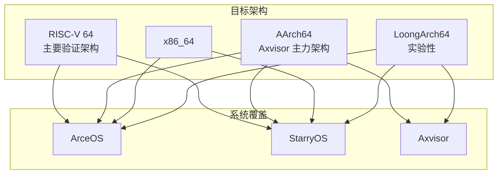
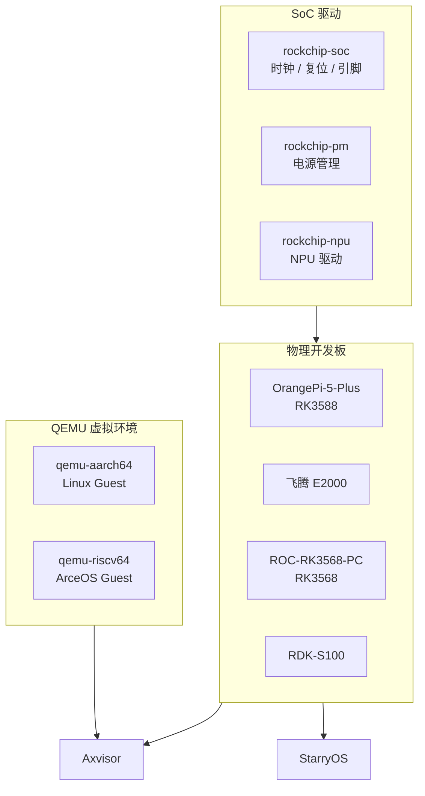

# 环境与平台

## 开发环境

本节说明本地开发所需的宿主环境、Rust 工具链、外部依赖以及预构建容器镜像的用法。

### 宿主要求

当前推荐的开发宿主环境为 **Linux x86_64**（Ubuntu 22.04+ 或 Debian 12+）。仓库提供两种环境准备方式：

| 方式 | 适用场景 | 说明 |
|------|---------|------|
| **手动安装** | 日常本地开发 | 通过 `rustup`、系统包管理器逐项安装 |
| **Container 镜像** | CI / 需要精确复现 CI 环境 | 基于 `container/Dockerfile` 构建，含预装 QEMU 和交叉工具链 |

### 工具链

工具链版本由 `rust-toolchain.toml` 锁定，`cargo` 会自动安装：

| 属性 | 值 |
|------|-----|
| 频道 | `nightly-2026-04-27` |
| Profile | `minimal` |
| 组件 | `rust-src`, `llvm-tools`, `rustfmt`, `clippy` |

**内置交叉编译目标**：

| Target Triple | 架构 | 浮点模式 |
|--------------|------|---------|
| `x86_64-unknown-none` | x86_64 | — |
| `riscv64gc-unknown-none-elf` | RISC-V 64 | 硬浮点 (GC) |
| `aarch64-unknown-none-softfloat` | AArch64 | 软浮点 |
| `loongarch64-unknown-none-softfloat` | LoongArch64 | 软浮点 |

### 外部依赖

| 类别 | 工具 | 用途 | 安装方式 |
|------|------|------|---------|
| 模拟器 | QEMU ≥ 10.2.1 | 系统级验证的执行环境 | 源码构建或发行版包（Container 内已预装） |
| 辅助构建 | `cmake`, `make`, `ninja-build` | C 测试用例交叉编译 | 系统 apt 包 |
| 辅助分析 | `cargo-binutils` | 二进制分析（`cargo size`, `cargo objdump`） | `cargo install cargo-binutils` |
| 镜像操作 | `ostool` | ELF / 镜像格式转换 | Cargo 依赖（v0.15） |

### 容器镜像

标准测试镜像定义在 `container/Dockerfile`，以 Ubuntu 24.04 为基础：

| 内容 | 版本 / 说明 |
|------|------------|
| QEMU | 10.2.1 源码构建，覆盖 system + linux-user target |
| 交叉编译器 | aarch64 / riscv64 / x86_64 / loongarch64 musl 工具链 |
| Rust toolchain | 与 `rust-toolchain.toml` 一致 |
| 工作目录 | `/workspace` |

对于 Axvisor LoongArch LVZ 场景，另有扩展镜像 `container/Dockerfile.axvisor-lvz`。

```bash
docker build -t tgoskits-test-env -f container/Dockerfile .
docker run -it --rm -v "$(pwd)":/workspace -w /workspace tgoskits-test-env
```

## 目标架构

TGOSKits 当前支持四种目标架构，各架构在三套系统中的测试覆盖程度不同。下图展示了架构与系统之间的支持关系。



| 目标架构 | Target Triple | QEMU 机器类型 | ArceOS | StarryOS | Axvisor | 成熟度 |
|----------|--------------|---------------|--------|----------|---------|--------|
| **RISC-V 64** | `riscv64gc-unknown-none-elf` | `-machine virt -cpu rv64` | ✅ 全量测试 | ✅ 全量测试 | 有配置占位 | **主要验证架构** |
| **AArch64** | `aarch64-unknown-none-softfloat` | `-cpu cortex-a53` | ✅ 全量测试 | ✅ 全量测试（含板级） | ✅ QEMU + 多板级 | **Axvisor 主力架构** |
| **x86_64** | `x86_64-unknown-none` | `-machine q35 -cpu max` | ✅ 全量测试 | ✅ 全量测试 | stub 实现 | 非首选 |
| **LoongArch64** | `loongarch64-unknown-none-softfloat` | `-machine virt -cpu la464` | ✅ 全量测试 | ✅ 全量测试 | LVZ 扩展镜像 | 实验性 |

### 快速验证

按以下顺序执行可最快确认环境可用，三条命令覆盖三套系统的最小启动路径。

| 优先级 | 系统 | 命令 | 预期结果 |
|--------|------|------|---------|
| 1 | ArceOS | `cargo xtask arceos qemu --package arceos-helloworld --arch riscv64` | QEMU 输出 "Hello, world!" 后退出 |
| 2 | StarryOS | `cargo xtask starry qemu --target riscv64` | 启动 Shell 并执行冒烟命令（首次自动准备 rootfs） |
| 3 | Axvisor | `cargo xtask axvisor test qemu --target aarch64` | Guest 输出 "guest test pass!"（首次自动下载 Guest 镜像） |

## 板级支持

除 QEMU 虚拟环境外，TGOSKits 还在多块物理开发板上进行实际硬件验证。Axvisor 通过 `os/axvisor/configs/` 中的板级配置管理硬件支持，StarryOS 则通过测试用例目录内的 `board-*.toml` 声明板级用例。



### Axvisor 开发板

Axvisor 通过硬编码的测试组管理板级支持，每组对应一块物理开发板或 QEMU 虚拟环境。下表列出当前已注册的全部开发板及其 Guest 配置。

| 开发板 | SoC | Guest OS | VM 配置 | 测试状态 |
|--------|-----|----------|---------|---------|
| **qemu-aarch64** | — (QEMU) | Linux | `qemu/aarch64/linux-smp1.toml` | ✅ CI 自动运行 |
| **qemu-riscv64** | — (QEMU) | ArceOS | `qemu/riscv64/arceos-smp1.toml` | 配置就绪 |
| **OrangePi-5-Plus** | RK3588 | Linux | `orangepi-5-plus/linux-smp1.toml` | ✅ CI self-hosted |
| **phytiumpi** | 飞腾 E2000 | Linux | `phytiumpi/linux-smp1.toml` | ✅ CI self-hosted |
| **ROC-RK3568-PC** | RK3568 | Linux | `roc-rk3568-pc/linux-smp1.toml` | ✅ CI self-hosted |
| **RDK-S100** | — | Linux | `rdk-s100/linux-smp1.toml` | ✅ CI self-hosted |

板级配置位于 `os/axvisor/configs/`：
- `board/<board_name>.toml` — 构建配置（编译选项、内核特性）
- `vms/<platform>/<guest>-<variant>.toml` — 虚拟机配置（内存、CPU、设备列表）

### StarryOS 开发板

StarryOS 通过测试用例目录中的 `board-{board_name}.toml` 声明板级支持，xtask 自动扫描发现。

| 开发板 | 对应用例 | 说明 |
|--------|---------|------|
| **OrangePi-5-Plus** | `normal/board-orangepi-5-plus/` | NPU YOLOv8、网络冒烟、PCIe 枚举 |

### SoC 驱动

`drivers/` 目录包含面向特定 SoC 平台的驱动代码，主要服务于 OrangePi-5-Plus（RK3588）和 ROC-RK3568-PC 等 Rockchip 硬件。

| 驱动 | 目标平台 | 功能 |
|------|---------|------|
| `rockchip-soc/` | RK3588 | 时钟控制器、复位和引脚控制 |
| `rockchip-pm/` | Rockchip 系列 | 电源管理 |
| `rockchip-npu/` | Rockchip 系列 | NPU（神经网络处理器） |

## 选型建议

根据开发目标选择合适的架构和运行环境，可以减少不必要的准备成本。

| 目标 | 推荐路径 |
|------|---------|
| **首次跑通** | QEMU + RISC-V 64（ArceOS helloworld），零前置准备 |
| **改 ArceOS / StarryOS** | QEMU + RISC-V 64 或 AArch64 |
| **改 Axvisor** | QEMU + AArch64 → OrangePi-5-Plus 板级 |
| **做新硬件适配** | 参考现有 `configs/board/*.toml` + `drivers/` |
| **复现 CI 问题** | Container 镜像 (`container/Dockerfile`) |
