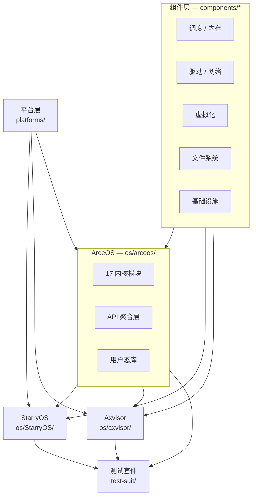
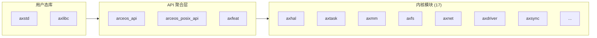
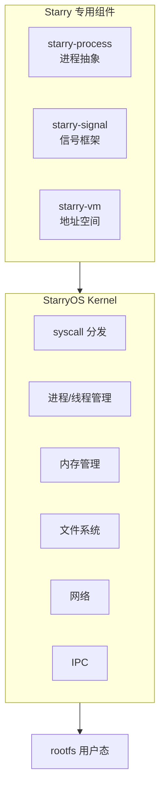
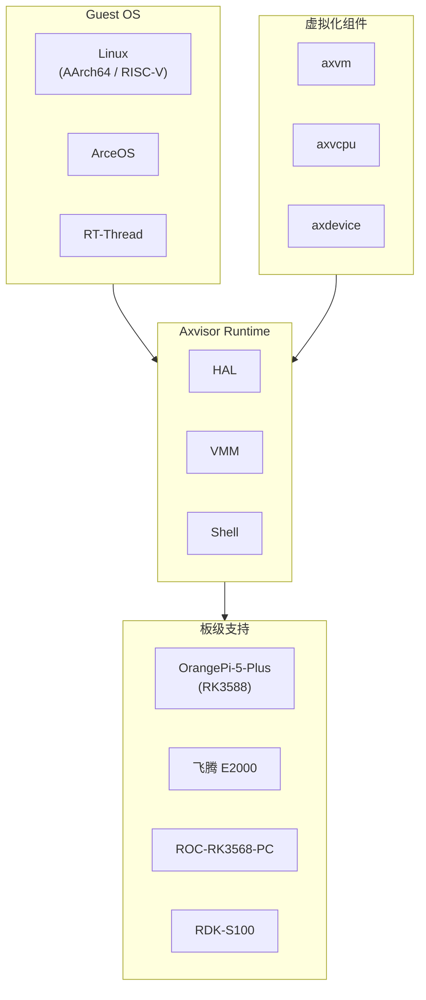
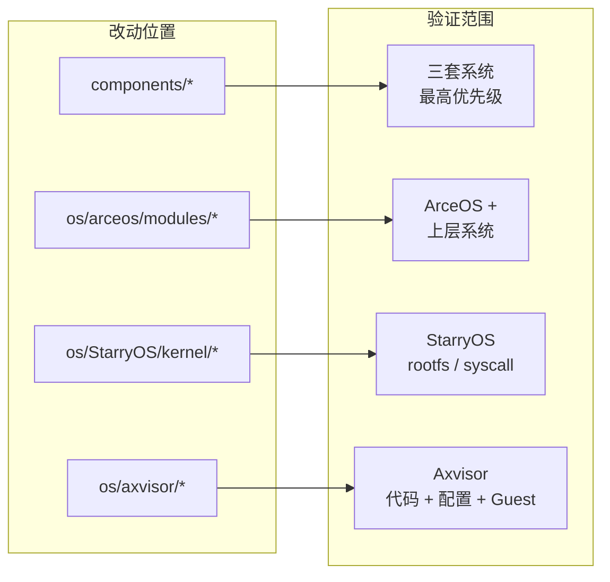

# 项目概览

TGOSKits 是一个面向操作系统与虚拟化开发的统一集成工作区。它通过 Git Subtree 将 **ArceOS** 模块化内核、**StarryOS** Linux 兼容系统、**Axvisor** Type-I 虚拟化监视器以及多个独立组件 crate 汇聚到同一个 Cargo workspace 中，通过 `cargo xtask` 统一调度构建、运行、测试和集成验证。

## 项目元数据

以下为仓库的核心构建属性，工具链版本由 `rust-toolchain.toml` 锁定，Rust Edition 和 Resolver 版本由根 `Cargo.toml` 统一管理。

| 属性 | 值 |
|------|-----|
| 组织 | `rcore-os/tgoskits` |
| 版本 | v0.5.11 |
| 协议 | Apache-2.0 |
| Rust Edition | 2024（Resolver v3） |
| 工具链 | `nightly-2026-04-27`（minimal profile） |
| 构建 | Release 默认启用 LTO |

## 核心架构

TGOSKits 采用分层设计：底层是可复用的组件 crate，中间是三套操作系统 / Hypervisor 实现，上层是平台适配和测试套件。下图展示了各层之间的依赖与数据流向。



组件 crate 以独立可复用形式存在，通过 Cargo workspace 依赖解析被三套系统按需引用。ArceOS 是 StarryOS 和 Axvisor 的共同依赖基础，位于系统层的最底层。

| 层次 | 路径 | 职责 |
|------|------|------|
| 组件层 | `components/` | 调度、内存、驱动、文件系统、网络、虚拟化等基础能力 |
| 系统层 | `os/{arceos,starryos,axvisor}/` | 三套操作系统 / Hypervisor 的核心实现 |
| 平台层 | `platforms/` | 架构与板级适配 |
| 测试层 | `test-suit/`、`scripts/test/` | 系统级 QEMU / 板级测试及主机端验证 |

## 目录结构

仓库根目录按职责划分为组件、系统、平台、驱动、测试、构建工具和文档七个主要区域。以下仅列出关键目录及典型内容。

```text
tgoskits/
├── components/                # 独立可复用组件 crate（Git Subtree 管理）
│   ├── axsched/               # 调度算法（CFS、RR、多级反馈队列）
│   ├── axallocator/           # 内存分配器（bitmap、buddy 等策略）
│   ├── axvm / axvcpu / axdevice/  # 虚拟化抽象（VM / vCPU / 虚拟设备）
│   ├── starry-process/        # StarryOS 进程管理
│   ├── starry-signal/         # StarryOS 信号机制
│   ├── arm_vcpu / riscv_vcpu / x86_vcpu/  # 架构相关 vCPU
│   ├── arm_vgic / x86_vlapic / riscv_vplic/  # 中断控制器虚拟化
│   └── ...                    # 文件系统、同步原语、错误码、CPU 抽象等
├── os/
│   ├── arceos/                # ArceOS 模块化 unikernel
│   │   ├── modules/           # 17 个内核模块（axhal, axtask, axmm...）
│   │   ├── api/               # API 聚合层（arceos_api, posix_api, axfeat）
│   │   ├── ulib/              # 用户态库（axstd, axlibc）
│   │   └── examples/          # 内置示例（helloworld, shell, http*）
│   ├── StarryOS/              # StarryOS Linux 兼容系统
│   │   ├── starryos/          # 主实现
│   │   ├── kernel/            # 内核（syscall, 进程, 信号, 文件系统）
│   │   └── configs/           # 板级与 QEMU 平台配置
│   └── axvisor/               # Axvisor Type-I Hypervisor
│       ├── src/               # HAL, VMM, Shell, 任务管理
│       ├── configs/           # 板级 / VM / 测试配置
│       └── xtask/             # Axvisor 专用构建任务
├── platforms/                  # 平台适配层
│   ├── axplat-dyn/            # 动态平台支持
│   └── somehal/                # 动态平台底层运行时/固件桥接
├── drivers/                   # SoC 专用驱动（RK3588 时钟 / NPU / 电源管理）
├── test-suit/                 # 系统级测试套件
│   ├── arceos/                # ArceOS（7 C + 18 Rust）
│   ├── starryos/              # StarryOS（normal + stress 分组）
│   └── axvisor/               # Axvisor（QEMU + 板级）
├── scripts/axbuild/           # 统一构建系统（tg-axbuild）
├── xtask/                     # xtask 入口 crate
└── docs/                      # 文档站点（Docusaurus）
```

## 三套核心系统

仓库包含三套独立的系统实现，它们共享底层组件和 ArceOS 基础设施，但在定位和能力域上各有侧重。以下分别介绍各系统的架构设计和关键能力。

### ArceOS

ArceOS 是仓库中最基础的模块化 Unikernel 内核，也是 StarryOS 和 Axvisor 的共同依赖基础。采用分层模块化架构（17 个内核模块 + API 聚合层 + 用户态库）。



| 层次 | 内容 | 职责 |
|------|------|------|
| 内核模块 (`modules/`) | `axhal`, `axtask`, `axmm`, `axdriver`, `axfs`, `axnet`, `axsync`, `axlog`, `axruntime` 等 | 硬件抽象、调度、内存管理、设备驱动、文件系统、网络栈 |
| API 聚合层 (`api/`) | `arceos_api`, `arceos_posix_api`, `axfeat` | 向上提供统一 API 接口与 feature 开关 |
| 用户态库 (`ulib/`) | `axstd`, `axlibc` | Rust 标准库子集与 C 库兼容层 |

→ 开发指南：[ArceOS 开发指南](/docs/development/arceos) | 架构说明：[ArceOS 架构](/docs/architecture/arceos)

### StarryOS

StarryOS 建立在 ArceOS 基础设施之上，通过组件化方式实现 Linux 兼容语义，支持基于 rootfs 的完整用户态程序执行。



| 能力域 | 实现要点 |
|--------|---------|
| Syscall 兼容 | Linux syscall 语义等价实现（`kernel/src/syscall/`，覆盖进程、文件、内存、信号、网络、IPC） |
| 进程模型 | 多进程地址空间、进程树、`/proc` 伪文件系统（`starry-process`） |
| 线程与信号 | POSIX 线程、信号传递与处理（`starry-signal`） |
| 用户态验证 | 基于 Alpine rootfs 的完整用户态执行链路 |

测试套件按 `normal` / `stress` 两大分组组织，通过 build group 共享构建产物和 rootfs。

→ 开发指南：[StarryOS 开发指南](/docs/development/starryos) | 架构说明：[StarryOS 架构](/docs/architecture/starryos)

### Axvisor

Axvisor 是运行在 ArceOS 基础设施之上的 Type-I Hypervisor，提供完整的虚拟化管理能力，支持多架构、多 Guest、多开发板。



| 能力域 | 实现要点 |
|--------|---------|
| 虚拟化抽象 | `axvm`（VM 管理）、`axvcpu`（vCPU 抽象）、`axdevice`（虚拟设备） |
| 架构支持 | ARM vCPU/VGIC、RISC-V vCPU/vPLIC、x86 vCPU/vLAPIC |
| Guest 支持 | Linux（AArch64 / RISC-V）、ArceOS、RT-Thread、Nimbos |
| 配置体系 | 板级配置（`configs/board/*.toml`）+ VM 配置（`configs/vms/**/*.toml`）双层结构 |

→ 开发指南：[Axvisor 开发指南](/docs/development/axvisor) | 架构说明：[Axvisor 架构](/docs/architecture/axvisor)

## 改动影响评估

在分层架构中，改动所处的层次直接决定了影响范围和验证策略。下图和表格按改动位置映射到对应的验证范围，帮助开发者在修改代码前快速定位需要覆盖的测试路径。



| 改动位置 | 影响范围 | 验证策略 |
|----------|---------|---------|
| `components/*` | 跨系统基础设施 | `cargo xtask test` → 各系统最小 QEMU 路径 |
| `os/arceos/modules/*` | ArceOS → StarryOS / Axvisor | 先测 ArceOS，再测上层系统 |
| `os/StarryOS/kernel/*` | StarryOS | 重点关注 rootfs 和 syscall 行为 |
| `os/axvisor/*` | Axvisor | 代码 + 配置 + Guest 镜像一起验证 |

## 构建命令入口

所有构建、运行和测试操作均通过 `cargo xtask` 调度，底层由 `scripts/axbuild/`（tg-axbuild）实现。

| 命令 | 功能 | 典型用法 |
|------|------|---------|
| `cargo xtask test` | 主机端标准库单元测试（`std_crates.csv` 白名单） | `cargo xtask test` |
| `cargo xtask clippy` | Clippy 静态检查（支持全量、指定包和增量模式） | `cargo xtask clippy --since origin/main` |
| `cargo xtask arceos <sub>` | ArceOS 构建/运行/QEMU 测试 | `cargo xtask arceos qemu --arch riscv64` |
| `cargo xtask starry <sub>` | StarryOS 构建/运行/QEMU 测试/板级测试 | `cargo xtask starry qemu --target aarch64` |
| `cargo xtask axvisor <sub>` | Axvisor 构建/运行/QEMU/U-Boot/板级测试 | `cargo xtask axvisor test qemu --target aarch64` |
| `cargo xtask board <sub>` | 远程开发板管理 | `cargo xtask board list` |

→ 命令体系详解：[构建流程](/docs/build) | [命令总览](/docs/build/commands)
