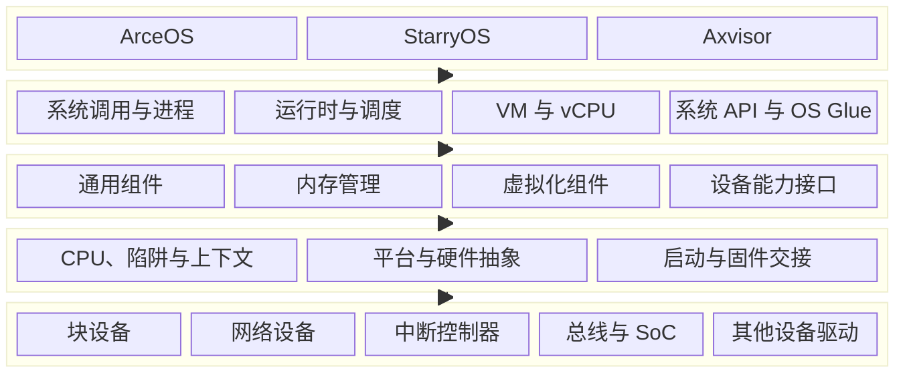
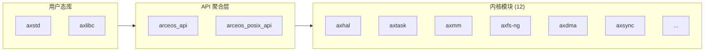
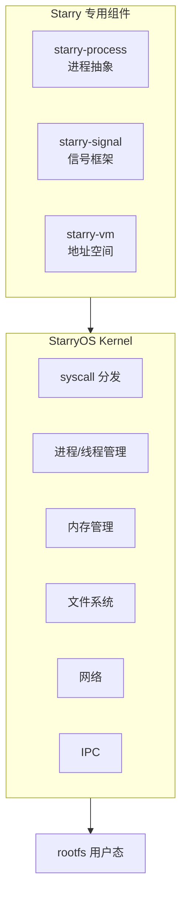
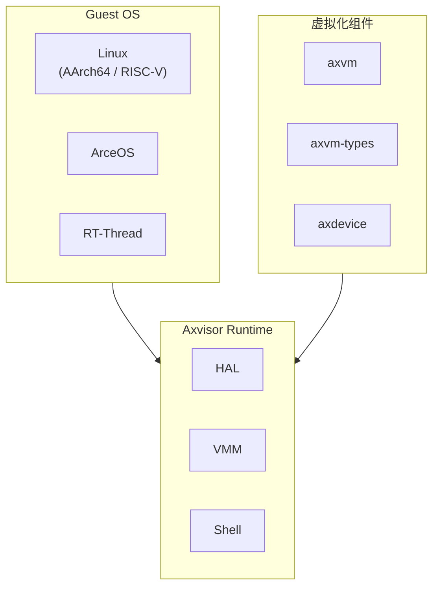

# 项目概览

TGOSKits 是面向操作系统、Linux 兼容内核与虚拟化监视器研发的 Rust 集成工作区。仓库同时维护 **ArceOS**、**StarryOS**、**Axvisor** 三种系统形态，以及它们共享的组件、内存管理、驱动、虚拟化和平台实现；构建、运行与测试统一由 `cargo xtask` 和 `scripts/axbuild` 调度。

## 1. 项目定位

TGOSKits 的边界不是单一操作系统发行版，而是系统软件组件的开发、组合和跨系统验证环境。项目将可以独立演进的 crate 与完整系统放入同一 workspace，使底层能力可以在多个系统中复用，同时保留各系统独立的产品边界。

### 1.1 系统范围

仓库覆盖模块化内核、Linux 兼容内核和 Type-I Hypervisor 三类运行环境。三套系统共享底层 Rust crate，但分别维护启动入口、配置集合、运行时语义和测试套件。

| 系统 | 定位 | 主要入口 | 配置目录 | 测试目录 |
| --- | --- | --- | --- | --- |
| ArceOS | 可组合的模块化操作系统 | `os/arceos/` | `os/arceos/configs/` | `test-suit/arceos/` |
| StarryOS | 面向 Linux 应用兼容的多进程系统 | `os/StarryOS/` | `os/StarryOS/configs/` | `test-suit/starryos/` |
| Axvisor | 支持多 Guest 的 Type-I Hypervisor | `os/axvisor/` | `os/axvisor/configs/` | `test-suit/axvisor/` |

### 1.2 工作区模型

根 `Cargo.toml` 统一管理 184 个 workspace 成员和公共依赖。可复用 crate 按领域分布在 `components/`、`memory/`、`drivers/`、`virtualization/` 与 `platforms/`，其中部分独立仓库通过 Git Subtree 汇聚，并由 `scripts/repo/repo.py` 维护双向同步关系。

| 领域 | 目录 | 主要职责 |
| --- | --- | --- |
| 通用组件 | `components/` | 调度、同步、CPU 抽象、进程、信号、VFS 接口等 |
| 内存 | `memory/` | 分配器、地址类型、页表、地址空间、DMA 与 MMIO API |
| 驱动 | `drivers/` | Driver Core、设备接口、总线及 SoC 设备实现 |
| 虚拟化 | `virtualization/` | VM、vCPU、地址空间、虚拟中断控制器和虚拟设备 |
| 平台 | `platforms/` | 启动、固件交接、动态平台与硬件抽象实现 |

## 2. 工程架构

TGOSKits 的工程组织由统一构建基线、分层运行时架构、领域化仓库目录和跨架构平台支持共同构成。四部分分别定义代码采用什么工具链构建、系统能力如何分层、实现应归属哪个目录，以及构建配置可以选择哪些目标平台。

### 2.1 架构和平台

工作区覆盖 AArch64、RISC-V 64、x86_64 和 LoongArch64 四种 64 位架构。平台层同时支持编译期选择的静态板卡和基于 FDT、ACPI、UEFI 或 U-Boot 信息建立的动态平台；CPU、页表、启动和硬件抽象实现通过统一能力边界供三套系统组合。具体 target、QEMU 模式、物理板卡和测试覆盖由“架构与平台”文档维护。

### 2.2 工程基线

根 `Cargo.toml` 统一定义 workspace 包版本、Rust Edition、Resolver、许可证和 release profile；`rust-toolchain.toml` 独立锁定可复现的编译工具链。项目级基线只记录不属于具体平台的 workspace 属性。

| 属性 | 值 |
|------|-----|
| 组织 | `rcore-os/tgoskits` |
| Workspace 版本 | 0.5.12 |
| Workspace 成员 | 184 |
| 协议 | Apache-2.0 |
| Rust Edition | 2024（Resolver v3） |
| 构建 | Release 默认禁用 LTO |

### 2.3 核心架构

TGOSKits 的运行时架构划分为五层。最上层是 ArceOS、StarryOS 和 Axvisor 三种系统形态，其下依次为系统能力、共享组件、平台与硬件抽象，最底层是直接管理设备的驱动实现。上层只能通过下一层公开的能力边界使用底层资源。



框图从上到下表示依赖方向，不表示启动时序。系统能力层承载各系统特有的运行时语义，共享组件层提供可跨系统复用的内存、虚拟化和设备接口；平台层隔离 CPU、固件与板级差异；驱动层通过 MMIO、DMA 和 IRQ 契约控制实际设备。

| 层次 | 路径 | 职责 |
|------|------|------|
| 系统产品 | `os/` | 定义内核或 Hypervisor 的运行时语义和最终镜像 |
| 共享能力 | `components/`、`memory/`、`drivers/`、`virtualization/` | 提供可组合的领域实现与能力边界 |
| 架构平台 | `platforms/`、`scripts/targets/` | 实现启动、CPU 架构、板级和 target 映射 |
| 工程系统 | `xtask/`、`scripts/axbuild/`、`test-suit/` | 解析配置、生成构建参数并执行分层验证 |

### 2.4 仓库结构

仓库根目录按领域边界组织，而不是按单一系统拆分全部代码。共享实现位于领域目录，系统目录只保留产品组合与 OS Glue，构建和测试工具作为独立工程层维护。

```text
tgoskits/
├── components/                # 调度、同步、CPU、进程、信号和 VFS 等通用组件
├── memory/                    # 分配器、页表、地址空间、DMA 与 MMIO API
├── drivers/                   # 驱动核心、设备接口、总线、SoC 与具体设备驱动
├── virtualization/            # VM、vCPU、虚拟中断控制器与虚拟设备
├── os/
│   ├── arceos/                # ArceOS 模块化 unikernel
│   │   ├── modules/           # 12 个内核模块（axhal, axtask, axmm...）
│   │   ├── api/               # API 聚合层（arceos_api, posix_api）
│   │   ├── ulib/              # 用户态库（axstd, axlibc）
│   │   └── tools/             # 构建与板级辅助工具
│   ├── StarryOS/              # StarryOS Linux 兼容系统
│   │   ├── starryos/          # 主实现
│   │   ├── kernel/            # 内核（syscall, 进程, 信号, 文件系统）
│   │   └── configs/           # 板级与 QEMU 平台配置
│   └── axvisor/               # Axvisor Type-I Hypervisor
│       ├── src/               # HAL, VMM, Shell, 任务管理
│       ├── configs/           # 板级 / VM / 测试配置
│       └── xtask/             # Axvisor 专用构建任务
├── platforms/                 # 启动、固件交接、动态平台与硬件抽象
├── test-suit/                 # 系统级测试套件
│   ├── arceos/                # ArceOS Rust/C 系统测试
│   ├── starryos/              # StarryOS（normal + stress 分组）
│   └── axvisor/               # Axvisor（QEMU + 板级）
├── scripts/
│   ├── axbuild/               # 三套系统共用的构建与运行编排
│   ├── targets/               # Rust target JSON 与 target 映射
│   └── repo/                  # Git Subtree 组件同步工具
├── xtask/                     # 工作区命令入口
└── docs/                      # 文档站点（Docusaurus）
```

目录边界同时约束依赖方向：可移植逻辑进入领域 crate，平台相关实现进入 `platforms/` 或驱动适配层，具体系统的组装代码留在 `os/`。这种划分使同一组件可以被多个系统构建配置复用。

## 3. 核心系统

仓库包含三套独立的系统实现，它们共享底层组件和 ArceOS 基础设施，但在定位和能力域上各有侧重。以下分别介绍各系统的架构设计和关键能力。

### 3.1 ArceOS

ArceOS 是仓库中最基础的模块化 Unikernel 内核，也是 StarryOS 和 Axvisor 的共同依赖基础。采用分层模块化架构（12 个内核模块 + API 聚合层 + 用户态库）。



图中的依赖方向体现了 ArceOS 从用户态库经过 API 聚合层进入内核模块的调用边界。维护具体能力时，需要继续通过下表定位负责实现的目录和模块集合。

| 层次 | 内容 | 职责 |
|------|------|------|
| 内核模块 (`modules/`) | `axhal`, `axtask`, `axmm`, `axfs-ng`, `axdma`, `axsync`, `axlog`, `axruntime` 等 | 硬件抽象、调度、内存管理、DMA、文件系统、同步原语与运行时初始化 |
| API 聚合层 (`api/`) | `arceos_api`, `arceos_posix_api` | 向上提供统一 API 接口与 POSIX 兼容层 |
| 用户态库 (`ulib/`) | `axstd`, `axlibc` | Rust 标准库子集与 C 库兼容层 |

### 3.2 StarryOS

StarryOS 建立在 ArceOS 基础设施之上，通过组件化方式实现 Linux 兼容语义，支持基于 rootfs 的完整用户态程序执行。



图中的 Starry 专用组件负责提供进程、信号和地址空间等领域抽象，Kernel 层则组合这些抽象并实现 Linux syscall 语义。下表按用户可见能力归纳对应的维护重点。

| 能力域 | 实现要点 |
|--------|---------|
| Syscall 兼容 | Linux syscall 语义等价实现（`kernel/src/syscall/`，覆盖进程、文件、内存、信号、网络、IPC） |
| 进程模型 | 多进程地址空间、进程树、`/proc` 伪文件系统（`starry-process`） |
| 线程与信号 | POSIX 线程、信号传递与处理（`starry-signal`） |
| 用户态验证 | 基于 Alpine rootfs 的完整用户态执行链路 |

测试套件按 `normal` / `stress` 两大分组组织，通过 build group 共享构建产物和 rootfs。

### 3.3 Axvisor

Axvisor 是运行在 ArceOS 基础设施之上的 Type-I Hypervisor，提供完整的虚拟化管理能力，支持多架构、多 Guest、多开发板。



Axvisor Runtime 通过虚拟化组件管理 Guest 生命周期，并通过平台能力接口隔离硬件差异。下表进一步说明各能力域的组件入口和配置边界。

| 能力域 | 实现要点 |
|--------|---------|
| 虚拟化抽象 | `axvm`（VM 与 vCPU wrapper/run loop）、`axvm-types`（共享 vCPU/exit 协议）、`axdevice`（虚拟设备） |
| 架构支持 | ARM vCPU/VGIC、RISC-V vCPU/vPLIC、x86 vCPU/vLAPIC |
| Guest 支持 | Linux（AArch64 / RISC-V）、ArceOS、RT-Thread、Nimbos |
| 配置体系 | 板级配置（`configs/board/*.toml`）+ VM 配置（`configs/vms/**/*.toml`）双层结构 |

## 4. 构建与配置

三套系统共享 `scripts/axbuild` 提供的配置解析和运行编排。板卡配置保存 target、feature、CPU 数量、VM 列表等静态输入；`defconfig` 将所选板卡写入默认构建快照；`build`、`qemu`、`uboot` 和 `board` 在此基础上生成镜像并选择运行后端。

### 4.1 配置模型

每套系统在 `configs/board/` 中维护命名板卡配置，配置名由 `config ls` 枚举。ArceOS 配置额外选择应用包，StarryOS 配置描述内核与 rootfs 运行参数，Axvisor 配置还可以关联 `configs/vms/` 下的 Guest 定义。

| 阶段 | 输入或产物 | 实现入口 |
| --- | --- | --- |
| 配置发现 | `configs/board/*.toml` | `cargo arceos config ls` |
| 默认配置 | 选中的板卡名 | `cargo arceos defconfig qemu-riscv64` |
| 构建解析 | target、feature、SMP、VM 配置 | `scripts/axbuild/` |
| 产物生成 | ELF、二进制镜像、rootfs 或 Guest 资产 | `cargo arceos build` |
| 运行后端 | QEMU、U-Boot、远程板卡 | `qemu`、`uboot`、`board` 子命令 |

### 4.2 命令入口

所有构建、运行和测试操作均通过 `cargo xtask` 调度，底层由 `scripts/axbuild/`（tg-axbuild）实现。

| 命令 | 功能 | 典型用法 |
|------|------|---------|
| `cargo xtask test` | 主机端标准库单元测试（`std_crates.csv` 白名单） | `cargo xtask test` |
| `cargo xtask clippy` | Clippy 静态检查（支持全量、指定包和增量模式） | `cargo xtask clippy --since origin/main` |
| `cargo arceos` | ArceOS 配置、构建与运行 | `cargo arceos defconfig qemu-riscv64` |
| `cargo starry` | StarryOS 配置、构建、运行与测试 | `cargo starry defconfig qemu-aarch64` |
| `cargo axvisor` | Axvisor 配置、构建、运行与测试 | `cargo axvisor defconfig qemu-aarch64` |
| `cargo xtask board` | 远程开发板管理 | `cargo xtask board ls` |

快捷命令由根目录 `.cargo/config.toml` 映射到 `cargo xtask`。两种写法进入同一实现，不维护相互独立的构建逻辑。

## 5. 验证体系

验证按运行边界分为 Host、QEMU 和物理板卡三个层级。Host 层检查可在标准库环境运行的 crate 与静态规则，QEMU 层验证完整系统镜像，板卡层覆盖固件交接、真实中断控制器、DMA 和设备驱动。

| 层级 | 主要入口 | 覆盖范围 | 外部依赖 |
| --- | --- | --- | --- |
| Host | `cargo xtask test`、`cargo xtask clippy` | 白名单 crate、格式、静态检查 | Rust 工具链 |
| QEMU | `cargo starry test qemu --target riscv64gc-unknown-none-elf` | 启动、系统调用、设备模型、Guest 运行 | QEMU、rootfs 或 Guest 镜像 |
| Board | `cargo starry test board --list` | 固件、板级平台和真实设备 | self-hosted runner、板卡服务器、串口 |

`test-suit/arceos` 同时维护 Rust 与 C 用例，`test-suit/starryos` 按 `normal` 和 `stress` 组织 Linux 兼容性场景，`test-suit/axvisor` 分离 QEMU、U-Boot 和远程板卡用例。测试配置定义构建组、成功或失败判定规则以及所需运行资产。
