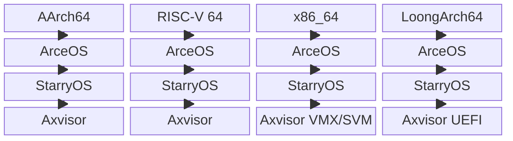

# 架构与平台

## 1. 开发环境

本地构建环境由宿主系统、仓库锁定的 Rust 工具链、外部构建工具和预构建容器组成。

### 1.1 宿主要求

当前推荐的开发宿主环境为 **Linux x86_64**（Ubuntu 22.04+ 或 Debian 12+）。仓库提供两种环境准备方式：

| 方式 | 适用场景 | 说明 |
|------|---------|------|
| **手动安装** | 日常本地开发 | 通过 `rustup`、系统包管理器逐项安装 |
| **Container 镜像** | CI / 需要精确复现 CI 环境 | 基于 `container/Dockerfile` 构建，含预装 QEMU 和交叉工具链 |

### 1.2 工具链

工具链版本由 `rust-toolchain.toml` 锁定，`cargo` 会自动安装：

| 属性 | 值 |
|------|-----|
| 频道 | `nightly-2026-07-15` |
| Profile | `minimal` |
| 组件 | `rust-src`, `llvm-tools`, `rustfmt`, `clippy` |

**内置交叉编译目标**：

| Target Triple | 架构 | 浮点模式 |
|--------------|------|---------|
| `x86_64-unknown-none` | x86_64 | — |
| `riscv64gc-unknown-none-elf` | RISC-V 64 | 硬浮点 (GC) |
| `aarch64-unknown-none-softfloat` | AArch64 | 软浮点 |
| `loongarch64-unknown-none-softfloat` | LoongArch64 | 软浮点 |

### 1.3 外部依赖

仓库的系统构建、镜像处理和运行验证依赖 QEMU、基础编译工具与二进制分析工具。下表将这些宿主工具映射到具体用途，维护 `container/Dockerfile` 或排查本地与 CI 差异时，应同步核对对应版本和安装来源。

| 类别 | 工具 | 用途 | 安装方式 |
|------|------|------|---------|
| 模拟器 | QEMU ≥ 10.2.1 | 系统级验证的执行环境 | 源码构建或发行版包（Container 内已预装） |
| 辅助构建 | `cmake`, `make`, `ninja-build` | C 测试用例交叉编译 | 系统 apt 包 |
| 辅助分析 | `cargo-binutils` | 二进制分析（`cargo size`, `cargo objdump`） | `cargo install cargo-binutils` |
| 镜像操作 | `ostool` | ELF / 镜像格式转换与 QEMU/U-Boot 运行支持 | Cargo 依赖（v0.24） |

### 1.4 容器镜像

标准测试镜像定义在 `container/Dockerfile`，以 Ubuntu 24.04 为基础：

| 内容 | 版本 / 说明 |
|------|------------|
| QEMU | 10.2.1 源码构建，覆盖 system + linux-user target |
| 交叉编译器 | aarch64 / riscv64 / x86_64 / loongarch64 musl 工具链 |
| Rust toolchain | 与 `rust-toolchain.toml` 一致 |
| 工作目录 | `/workspace` |

对于 Axvisor LoongArch LVZ 场景，另有扩展镜像 `container/Dockerfile.axvisor-lvz`。

```bash
docker build -t tgoskits-test-env -f container/Dockerfile .
docker run -it --rm -v "$(pwd)":/workspace -w /workspace tgoskits-test-env
```

## 2. 目标架构

TGOSKits 为 AArch64、RISC-V 64、x86_64 和 LoongArch64 提供统一的板卡配置命名与 QEMU 测试入口。架构支持状态以仓库中的 `configs/board/qemu-*.toml`、`test-suit` 构建配置和运行用例为准，不使用“主力”或“实验性”等缺少判定标准的标签。

### 2.1 支持矩阵

三套系统均已提供四架构 QEMU 构建配置。ArceOS 为四架构维护 Rust、C 和 `axtest` 用例；StarryOS 为四架构维护 grouped system 与 TTY 输入测试；Axvisor 为四架构维护 smoke 用例，其中 x86_64 区分 VMX/SVM，LoongArch64 使用动态 UEFI/OVMF 启动路径。



框图按列展示各架构在三套系统中的配置覆盖，不表示 ArceOS、StarryOS 与 Axvisor 之间的运行时依赖。下表给出实际 target、虚拟平台和可维护的测试证据。

| 目标架构 | Target Triple | QEMU 平台 | ArceOS | StarryOS | Axvisor |
| --- | --- | --- | --- | --- | --- |
| AArch64 | `aarch64-unknown-none-softfloat` | `virt` | Rust/C/axtest | system/TTY | Guest smoke |
| RISC-V 64 | `riscv64gc-unknown-none-elf` | `virt` | Rust/C/axtest | system/TTY | Guest smoke，启用 `sstc` |
| x86_64 | `x86_64-unknown-none` | `q35`、ACPI | Rust/C/axtest | system/TTY | VMX/SVM smoke、NimbOS UEFI 用例 |
| LoongArch64 | `loongarch64-unknown-none-softfloat` | `virt` | Rust/C/axtest | system/TTY | 动态 UEFI smoke，使用 LVZ 容器 |

### 2.2 快速验证

三个系统使用相同的配置选择模型。`config ls` 查询板卡名，`defconfig` 写入默认构建配置，`qemu` 沿用所选 target、feature 和运行参数。

```bash
cargo arceos config ls
cargo arceos defconfig qemu-riscv64
cargo arceos qemu

cargo starry config ls
cargo starry defconfig qemu-riscv64
cargo starry qemu

cargo axvisor config ls
cargo axvisor defconfig qemu-aarch64
cargo axvisor qemu
```

单次 `qemu` 命令验证构建和启动路径；需要稳定的成功与失败判定时，可执行 `cargo starry test qemu --target riscv64gc-unknown-none-elf` 等测试入口，由 `test-suit` 中的 `success_regex`、`fail_regex` 和超时配置决定结果。

## 3. 板级支持

物理平台支持分为三个独立事实：系统存在板卡构建配置、`test-suit` 存在可发现的板测用例、CI self-hosted 矩阵实际执行该用例。下表分别标注这些状态，避免把“可以构建”误写成“已经持续集成验证”。

### 3.1 Axvisor 开发板

Axvisor 板测由 `test-suit/axvisor/normal/board-<platform>/` 自动发现，不再使用硬编码板卡白名单。目录中的 `build-<target>.toml` 定义 host 构建参数，具体 case 的 `board-*.toml` 定义板卡类型、Guest shell、成功/失败正则和超时。

| 开发板 | 架构或 SoC | 构建配置 | 板测用例 | Self-hosted CI |
| --- | --- | --- | --- | --- |
| OrangePi-5-Plus | AArch64 / RK3588 | 有 | Linux smoke | 有 |
| Phytium Pi | AArch64 / E2000 | 有 | Linux smoke | 有 |
| ROC-RK3568-PC | AArch64 / RK3568 | 有 | Linux smoke | 有 |
| ASUS NUC15 CRH | x86_64 / VMX | 有 | Linux smoke | 有 |
| RDK-S100 | AArch64 | 有 | Linux smoke | 当前 CI 矩阵未启用 |
| TAC E400 | AArch64 | 有 | 无 | 无 |

Axvisor 的 VM 配置位于 `os/axvisor/configs/vms/`，描述 Guest 内存、vCPU、镜像和虚拟设备。板卡构建配置位于 `os/axvisor/configs/board/`，两者分别维护 host 平台与 Guest 运行契约。

### 3.2 StarryOS 开发板

StarryOS 板测由 `test-suit/starryos/board-<platform>/` 自动发现。每个平台目录维护一个 `build-<target>.toml`，其下各 case 使用 `board-<platform>.toml` 描述启动探针、shell 命令和判定规则。

| 开发板 | 架构或 SoC | 板测覆盖 | Self-hosted CI |
| --- | --- | --- | --- |
| OrangePi-5-Plus | AArch64 / RK3588 | 启动、USB、网络、rtnetlink、PCIe、PWM、NPU | 有 |
| AKA-00-SG2002 | RISC-V 64 / SG2002 | 启动、USB、TPU YOLO | 有 |
| LicheeRV-Nano-SG2002 | RISC-V 64 / SG2002 | 启动 | 当前 CI 矩阵未启用 |
| VisionFive 2 | RISC-V 64 / JH7110 | 启动与 MMC rootfs | 有 |
| K230 CanMV | RISC-V 64 / K230 | 有板卡构建配置，暂无板测目录 | 无 |
| Loongson 2K1000 | LoongArch64 / LS2K1000 | 有板卡构建配置，当前采用手工 U-Boot 验证 | 无 |

### 3.3 SoC 驱动

`drivers/` 已按设备类型组织为 Driver Core、接口与具体设备实现。通用能力通过 `rdif-*`、`mmio-api`、`dma-api` 和 IRQ 契约暴露，系统侧由 `ax-driver` 与运行时适配层完成设备发现和注册。

| 设备类别 | 代表 crate | 覆盖能力或平台 |
| --- | --- | --- |
| 块设备 | `sdhci-host`、`dwmmc-host`、`starfive-jh7110-dwmmc`、`nvme-driver` | SD/MMC、JH7110 MMC、NVMe |
| 网络 | `realtek-rtl8125`、`eth-intel`、`fxmac_rs`、`rd-net` | PCIe 网卡与 SoC Ethernet |
| 中断控制器 | `arm-gic-driver`、`riscv_plic`、`rdif-intc` | GIC、PLIC 与统一中断控制器接口 |
| PCIe | `pcie`、`rk3588-pci`、`rdif-pcie` | 通用 PCIe 与 RK3588 Host Controller |
| USB | `usb-host`、`usb-if`、`usb-serial` | USB Host、设备接口与串口设备 |
| AI 与多媒体 | `rockchip-npu`、`k230-kpu`、`sg2002-tpu`、`rockchip-rga`、`rockchip-jpeg` | NPU/KPU/TPU、图形与视频加速 |
| 平台设备 | `rockchip-pwm`、`arm_pl031`、`some-serial`、`arm-scmi-rs` | PWM、RTC、串口与固件协议 |

接口 crate 位于 `drivers/interface/`，设备实现按类型放在 `drivers/blk`、`drivers/net`、`drivers/intc`、`drivers/pci`、`drivers/usb`、`drivers/npu` 等目录。新增平台支持时，应在具体设备驱动与 OS Glue 之间保持这些能力边界。
