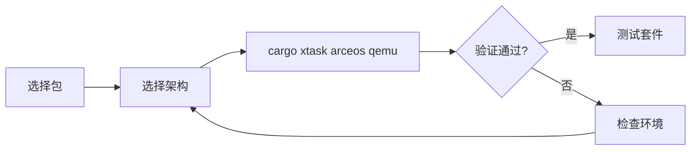

# ArceOS 快速上手

ArceOS 的最短路径通常是选择一个示例包，通过 `cargo xtask arceos qemu` 直接构建并启动。



## 1. 快速启动

本节给出 ArceOS 在不同架构上的最短启动命令。推荐优先选择 `arceos-std-helloworld`，因为它依赖最少、输出最直接，适合确认基础构建链路和 QEMU 路径是否正常。

### 1.1 RISC-V 64

`riscv64` 是当前最适合作为第一条验证路径的架构之一。命令短、反馈明确，也最便于和测试套件中的主流验证路径对应起来。

```bash
cargo xtask arceos qemu --package arceos-std-helloworld --target riscv64gc-unknown-none-elf
```

### 1.2 AArch64

如果后续工作会涉及 StarryOS 或 Axvisor，AArch64 路径会更容易和其他系统对齐。它适合在完成第一条最小运行路径后继续验证。

```bash
cargo xtask arceos qemu --package arceos-std-helloworld --target aarch64-unknown-none-softfloat
```

### 1.3 x86_64

`x86_64` 更适合本地 x86 平台适配或与 PC 类平台环境对照时使用。启动方式与其他架构一致，主要差别在目标 triple 和底层平台配置。

```bash
cargo xtask arceos qemu --package arceos-std-helloworld --target x86_64-unknown-none
```

### 1.4 LoongArch64

LoongArch64 路径适合作为补充验证，而不是第一次上手的默认首选。使用前建议先确认本地环境或容器环境中对应 QEMU 已可用。

```bash
cargo xtask arceos qemu --package arceos-std-helloworld --target loongarch64-unknown-none-softfloat
```

## 2. 常用包

ArceOS 的快速上手不仅是“把系统跑起来”，还常常需要快速切换到不同类型的示例应用。`--package` 是最常见的切换方式，因此这里列出当前仓库中最适合做入门验证的几个包。

`--package` 用于选择要启动的应用。当前仓库中常见快速上手包包括：

| 包名 | 功能 |
|------|------|
| `arceos-std-helloworld` | 最小 Hello World |
| `arceos-std-httpserver` | HTTP 服务器 |
| `arceos-std-httpclient` | HTTP 客户端 |
| `arceos-std-shell` | 交互式 Shell |

示例：

```bash
# HTTP 服务器
cargo xtask arceos qemu --package arceos-std-httpserver --target riscv64gc-unknown-none-elf

# 文件系统 Shell
cargo xtask arceos qemu --package arceos-std-shell --target aarch64-unknown-none-softfloat

# 仅构建
cargo xtask arceos build --package arceos-std-helloworld --target riscv64gc-unknown-none-elf
```

## 3. 测试入口

当单个示例已经可以稳定启动后，下一步通常是切到测试套件入口做批量验证。ArceOS 的测试支持 Rust 与 C 两条路径，并允许按测试组或测试用例做筛选。

ArceOS 的测试入口支持 Rust/C 混合测试、单独 Rust 测试、单独 C 测试和用例过滤：

```bash
# 全部测试（Rust + C）
cargo xtask arceos test qemu --target riscv64gc-unknown-none-elf

# 仅 Rust
cargo xtask arceos test qemu --target riscv64gc-unknown-none-elf --only-rust

# 仅 C
cargo xtask arceos test qemu --target riscv64gc-unknown-none-elf --only-c

# 指定单个 Rust 测试用例
cargo xtask arceos test qemu --target aarch64-unknown-none-softfloat --test-group rust --test-case task-affinity
```

详细说明见：[ArceOS 测试套件设计](/docs/build/test/arceos)

若需要继续理解 ArceOS 的模块层、组件关系或测试实现，可以继续阅读：

- [ArceOS 开发指南](/docs/development/arceos)
- [ArceOS 测试套件设计](/docs/build/test/arceos)
- [组件开发指南](/docs/development/components)
