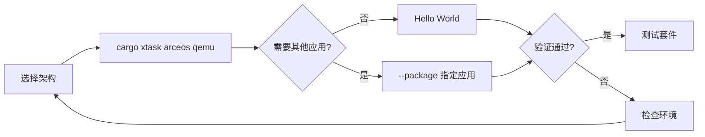

# ArceOS 快速上手

ArceOS 的最短路径是直接运行 `cargo xtask arceos qemu`。该 QEMU 子命令会选择对应架构的 board 模板，默认启动 Hello World。



## 1. QEMU 快速启动

不带 `--package` 时，QEMU 子命令从 `os/arceos/configs/board/qemu-<arch>.toml` 读取默认应用与 feature；当前模板使用最小的 `arceos-helloworld`。需要运行其他应用时，再通过 `--package` 显式覆盖。

### 1.1 RISC-V 64

`qemu-riscv64` 使用 `riscv64gc-unknown-none-elf` target 和 QEMU virt 平台。

```bash
cargo xtask arceos qemu --target riscv64gc-unknown-none-elf
```

### 1.2 AArch64

`qemu-aarch64` 使用 `aarch64-unknown-none-softfloat` target 和 QEMU virt 平台。

```bash
cargo xtask arceos qemu --target aarch64-unknown-none-softfloat
```

### 1.3 x86_64

`qemu-x86_64` 使用 `x86_64-unknown-none` target 和 PC 类 QEMU 平台配置。

```bash
cargo xtask arceos qemu --target x86_64-unknown-none
```

### 1.4 LoongArch64

`qemu-loongarch64` 使用 `loongarch64-unknown-none-softfloat` target，运行环境需要提供 `qemu-system-loongarch64`。

```bash
cargo xtask arceos qemu --target loongarch64-unknown-none-softfloat
```

完成 `defconfig` 后，后续命令通常不需要重复传入 `--package`、`--target` 或 `--arch`。切换架构时重新执行以上三步即可。

## 2. 常用包

`--package` 用于覆盖板卡配置中的默认应用。仓库提供网络、文件系统和最小运行环境等不同类型的示例包。

`--package` 用于选择要启动的应用。当前仓库中常见快速上手包包括：

| 包名 | 功能 |
|------|------|
| `arceos-helloworld` | 最小 Hello World |
| `arceos-httpserver` | HTTP 服务器 |
| `arceos-httpclient` | HTTP 客户端 |
| `arceos-shell` | 交互式 Shell |

下面的命令分别覆盖网络服务、文件系统交互和仅构建场景。显式传入 `--package` 和 `--target` 会覆盖 `defconfig` 中的默认值，并在不重写默认配置的情况下切换应用。

```bash
# HTTP 服务器
cargo xtask arceos qemu --package arceos-httpserver --target riscv64gc-unknown-none-elf

# 文件系统 Shell
cargo xtask arceos qemu --package arceos-shell --target aarch64-unknown-none-softfloat

# 仅构建
cargo xtask arceos build --package arceos-helloworld --target riscv64gc-unknown-none-elf
```

## 3. 测试入口

ArceOS 测试入口使用 `--test-group rust` 或 `--test-group c` 选择测试组，并通过 `--test-case` 进一步筛选单个用例。显式指定测试组可以避免当前板卡 `defconfig` 影响 QEMU 测试目录发现。

```bash
# Rust 测试组
cargo xtask arceos test qemu --target riscv64gc-unknown-none-elf --test-group rust

# C 测试组
cargo xtask arceos test qemu --target riscv64gc-unknown-none-elf --test-group c

# 指定单个 Rust 测试用例
cargo xtask arceos test qemu --target aarch64-unknown-none-softfloat --test-group rust --test-case task-affinity
```

详细说明见：[ArceOS 测试套件设计](/docs/build/arceos/test)
