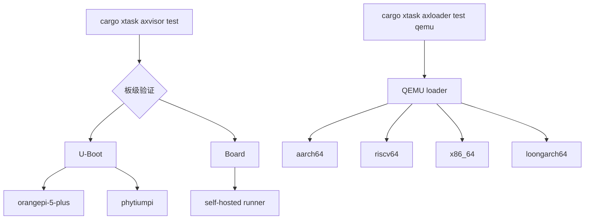

# Axvisor 快速上手

Axvisor 的最短本地验证路径是独立的 Axloader QEMU loader 测试；Axvisor 命令本身继续负责 build、run、U-Boot 和 Board 流程。当前 Axloader QEMU 测试覆盖 AArch64、RISC-V64、x86_64 和 LoongArch64；板测则依赖 self-hosted 环境。



## 1. QEMU

Axvisor loader 的快速验证建议优先从 `axloader test qemu` 开始，而不是直接进入更复杂的板级或 U-Boot 路径。这样可以先确认 hypervisor、Guest 资产和基础运行链路是否已经正常。

### 1.1 AArch64

`aarch64` 是当前 Axvisor 最主流的快速验证路径。无论是本地理解整体链路，还是和 CI 中的自动测试对应，这一条都最值得先跑通。

```bash
cargo xtask axloader test qemu --target aarch64-unknown-none-softfloat
```

### 1.2 x86_64

`x86_64` 适合作为第二条验证路径，用于确认不同平台上的 hypervisor 启动和 Guest 运行行为。它也是当前 `axloader test qemu` 明确支持的目标之一。

```bash
cargo xtask axloader test qemu --target x86_64-unknown-none
```

> `axloader test qemu` 当前支持 `aarch64`、`riscv64`、`x86_64` 和 `loongarch64`。
> `--guest` 不是 `axloader test qemu` 的参数；如果需要板级 U-Boot 测试中的 guest 选择，应使用 `cargo xtask axvisor test uboot ...`。

## 2. U-Boot 测试

当需要贴近板级启动链路时，可以进入 `test uboot`。这一入口不是通用目录扫描，而是围绕仓库中已经维护好的板型与 Guest 组合展开。

当前 `test uboot` 使用硬编码白名单中的 `(board, guest)` 组合。主流示例：

```bash
cargo xtask axvisor test uboot --board orangepi-5-plus --guest linux
cargo xtask axvisor test uboot --board phytiumpi --guest linux
cargo xtask axvisor test uboot --board roc-rk3568-pc --guest linux
```

## 3. Board 测试

`test board` 适合在已有板级环境或 self-hosted runner 条件下使用。这里的命令按
test-suit 中的板卡名选择平台；指定 `--board` 后，会依次运行所有匹配该开发板的
`board-*.toml` 测例。

当前 `test board` 使用板卡名：

```bash
cargo xtask axvisor test board --board orangepi-5-plus-linux
```

> Board 测试通常需要 self-hosted runner、串口服务器或物理板环境，本地普通开发机通常无法直接复现。

若需要继续理解测试分组、QEMU/U-Boot/board 三条链路的实现细节，可以继续阅读：

- [Axvisor 开发指南](/docs/development/axvisor)
- [Axvisor 测试套件设计](/docs/build/test/axvisor)
- [CI 自动测试实现](/docs/build/ci)
