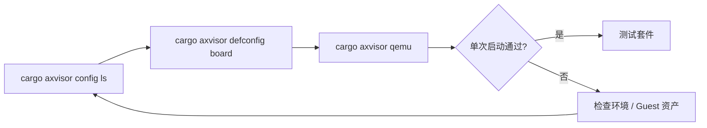

# Axvisor 快速上手

Axvisor 通过板卡配置确定目标架构、平台特性和默认 VM 配置。`cargo axvisor config ls` 列出配置名称，`cargo axvisor defconfig BOARD_NAME` 写入默认构建配置，后续 `cargo axvisor qemu` 沿用该配置。



## 1. QEMU

四种架构使用相同的三步流程：查看配置、选择 QEMU 板卡配置、构建并启动。配置文件定义 target、Axvisor feature 和 VM 配置列表。

### 1.1 AArch64

`qemu-aarch64` 使用 `aarch64-unknown-none-softfloat` target，并启用文件系统和 VirtIO 块设备支持。

```bash
cargo axvisor config ls
cargo axvisor defconfig qemu-aarch64
cargo axvisor qemu
```

### 1.2 RISC-V 64

`qemu-riscv64` 使用 `riscv64gc-unknown-none-elf` target，并启用 `sstc`、文件系统和 VirtIO 块设备支持。

```bash
cargo axvisor config ls
cargo axvisor defconfig qemu-riscv64
cargo axvisor qemu
```

### 1.3 x86_64

`qemu-x86_64` 使用 `x86_64-unknown-none` target，并启用文件系统和 VirtIO 块设备支持。

```bash
cargo axvisor config ls
cargo axvisor defconfig qemu-x86_64
cargo axvisor qemu
```

### 1.4 LoongArch64

LoongArch64 路径依赖 LVZ 虚拟化扩展，必须使用专用的 [QEMU-LVZ](https://github.com/Hengyu-Yu/QEMU-LVZ)，不能使用标准 `qemu-system-loongarch64`。

```bash
cargo axvisor config ls
cargo axvisor defconfig qemu-loongarch64
cargo axvisor qemu
```

完成 `defconfig` 后，后续命令通常不需要重复传入 `--target` 或 `--arch`。切换架构时重新执行以上三步即可。

## 2. U-Boot 测试

当需要贴近板级启动链路时，可以进入 `test uboot`。这一入口通过 `test-suit/axvisor/normal/board-<platform>/` 目录发现 `(board, guest)` 组合，而非硬编码白名单。

当前 `test uboot` 已维护的板型组合示例：

```bash
cargo xtask axvisor test uboot --board orangepi-5-plus --guest linux
cargo xtask axvisor test uboot --board phytiumpi --guest linux
cargo xtask axvisor test uboot --board roc-rk3568-pc --guest linux
```

## 3. Board 测试

`test board` 依赖已有板级环境或 self-hosted runner。这里的命令按
test-suit 中的板卡名选择平台；指定 `--board` 后，会依次运行所有匹配该开发板的
`board-*.toml` 测例。

当前 `test board` 使用板卡名：

```bash
cargo xtask axvisor test board --board orangepi-5-plus-linux
```

> Board 测试通常需要 self-hosted runner、串口服务器或物理板环境，本地普通开发机通常无法直接复现。
