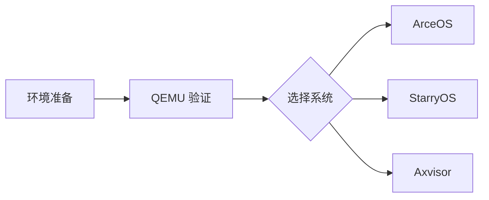

# 环境准备

ArceOS、StarryOS 和 Axvisor 共用同一套宿主工具链、QEMU 环境和 `cargo xtask` 命令入口。



## 1. 环境

QEMU 构建和启动需要 Linux 宿主、仓库锁定的 Rust 工具链、基础构建工具及足够的产物存储空间。

### 1.1 最低要求

下表列出三套系统 QEMU 路径共用的最低环境要求；板级烧录、Guest 制作和厂商工具链不在此范围内。

| 项目 | 要求 |
|------|------|
| 操作系统 | Linux x86_64（推荐 Ubuntu 22.04+ / Debian 12+） |
| Rust 工具链 | 由仓库 `rust-toolchain.toml` 管理 |
| QEMU | 推荐 10.2.1，与仓库容器镜像和 CI 环境一致 |
| 磁盘空间 | 建议至少 20 GB（工具链、QEMU、构建产物、rootfs、Guest 镜像） |

### 1.2 容器环境

仓库提供预构建的容器镜像，已包含完整的开发环境（QEMU、Rust toolchain、交叉编译工具链等），与 CI 环境完全一致：

```bash
# 拉取预构建镜像
docker pull ghcr.io/rcore-os/tgoskits-container:latest

# 启动容器，将当前工作区挂载进去
docker run -it --rm \
  -v "$(pwd)":/workspace \
  -w /workspace \
  ghcr.io/rcore-os/tgoskits-container:latest
```

进入容器后即可直接运行 `cargo xtask` 命令，无需安装任何依赖。

镜像详情见 [CI 与容器镜像](/docs/build/ci)。

### 1.3 本地构建容器

如果需要自定义容器内容，也可以从 Dockerfile 本地构建：

```bash
docker build -t tgoskits-env -f container/Dockerfile .
docker run -it --rm -v "$(pwd)":/workspace -w /workspace tgoskits-env
```

### 1.4 手动安装

不使用容器时，需要在宿主机安装 Rust、基础构建工具和各架构的 QEMU。QEMU 版本应与容器和 CI 使用的 10.2.1 保持一致：

```bash
# 1. 安装 Rust（会按仓库 toolchain 自动切换）
curl --proto '=https' --tlsv1.2 -sSf https://sh.rustup.rs | sh

# 2. 安装基础构建工具（Ubuntu / Debian）
sudo apt update
sudo apt install -y cmake make ninja-build pkg-config

# 3. 安装发行版提供的 QEMU
sudo apt install -y qemu-system-arm qemu-system-misc qemu-system-x86

# 4. 安装常用 Rust 辅助工具
cargo install cargo-binutils
```

这些命令不包含板级烧录、Guest 制作或厂商工具链。发行版提供的 QEMU 版本或架构集合不一致时，应使用仓库容器复现 CI 环境。

## 2. QEMU 支持

QEMU 运行需要同时满足板卡配置支持目标架构、Rust target 可用以及宿主机存在对应的 `qemu-system-*` 程序。

### 2.1 架构支持

仓库中的板卡配置通过 target triple 选择架构实现，并由对应的 `qemu-system-*` 程序提供虚拟平台。下表中的组合均有现成配置或测试路径支撑，也是快速上手文档采用的标准名称。

| 架构 | 常见 Target Triple | 常用 QEMU |
|------|--------------------|-----------|
| `riscv64` | `riscv64gc-unknown-none-elf` | `qemu-system-riscv64` |
| `aarch64` | `aarch64-unknown-none-softfloat` | `qemu-system-aarch64` |
| `x86_64` | `x86_64-unknown-none` | `qemu-system-x86_64` |
| `loongarch64` | `loongarch64-unknown-none-softfloat` | `qemu-system-loongarch64`；Axvisor 需要 LVZ 版本 |

### 2.2 验证 QEMU

以下命令验证四种架构的模拟器是否存在并输出版本。仓库容器和 CI 使用 QEMU 10.2.1。

```bash
qemu-system-riscv64 --version
qemu-system-aarch64 --version
qemu-system-x86_64 --version
qemu-system-loongarch64 --version
```

版本命令只能确认模拟器可执行文件存在；实际启动仍会继续验证机器类型、固件和镜像依赖。若某个架构的 QEMU 未安装，优先使用容器环境，而不是在宿主机单独拼装不同来源的工具。

### 2.3 Axvisor LoongArch64 LVZ

Axvisor 的 LoongArch64 路径依赖 LVZ 虚拟化扩展，标准 QEMU 无法运行该配置。项目使用专用的 [QEMU-LVZ](https://github.com/Hengyu-Yu/QEMU-LVZ)，并提供已经包含该二进制、LoongArch OVMF 和交叉工具链的容器镜像。

```bash
docker pull ghcr.io/rcore-os/tgoskits-container-axvisor-lvz:latest
docker run --rm -it \
  -v "$PWD:/workspace" \
  -w /workspace \
  ghcr.io/rcore-os/tgoskits-container-axvisor-lvz:latest
```

进入容器后再执行 Axvisor 的 `config ls`、`defconfig qemu-loongarch64` 和 `qemu` 命令。其他系统的 LoongArch64 QEMU 路径不要求 LVZ 扩展，仍可使用标准 `qemu-system-loongarch64`。

## 3. 命令入口

TGOSKits 通过 `cargo xtask` 调度各系统命令，并在 `.cargo/config.toml` 中提供 `cargo arceos`、`cargo starry`、`cargo axvisor` 快捷别名。各系统使用 `config ls` 查询板卡配置，以 `defconfig BOARD_NAME` 选择默认配置，再执行 `build`、`qemu`、`uboot`、`board` 或测试命令。

```bash
cargo xtask --help
cargo starry --help
```

常见入口如下：

| 目标 | 文档 | 常用命令 |
|------|------|----------|
| ArceOS | [ArceOS 快速上手](./arceos) | `cargo arceos defconfig qemu-riscv64` |
| StarryOS | [StarryOS 快速上手](./starryos) | `cargo starry defconfig qemu-riscv64` |
| Axvisor | [Axvisor 快速上手](./axvisor) | `cargo axvisor defconfig qemu-aarch64` |
