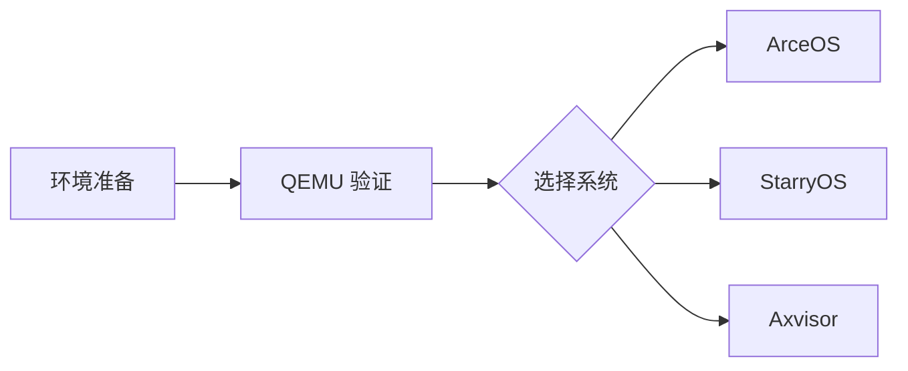

# 环境准备

本文是 ArceOS、StarryOS、Axvisor 快速上手的公共前置文档，重点说明当前仓库推荐的开发环境、QEMU 支持范围和统一命令入口。



## 1. 环境

本节给出快速上手所需的最小环境集合。目标不是覆盖所有开发场景，而是先确保常用 QEMU 路径和基础构建链路可以稳定运行。

### 1.1 最低要求

如果只是跟随快速上手文档完成首次启动，下面这组要求已经足够。后续若涉及板测、Guest 镜像或更复杂的系统调试，再按具体系统补充依赖。

| 项目 | 要求 |
|------|------|
| 操作系统 | Linux x86_64（推荐 Ubuntu 22.04+ / Debian 12+） |
| Rust 工具链 | 由仓库 `rust-toolchain.toml` 管理 |
| QEMU | 推荐 10.2.1，与仓库容器镜像和 CI 环境一致 |
| 磁盘空间 | 建议至少 20 GB（工具链、QEMU、构建产物、rootfs、Guest 镜像） |

### 1.2 Docker 镜像（推荐）

仓库提供预构建的容器镜像，已包含完整的开发环境（QEMU、Rust toolchain、交叉编译工具链等），与 CI 环境完全一致：

```bash
# 拉取预构建镜像
docker pull ghcr.io/rcore-os/tgoskits-container:latest

# 启动容器，将当前工作区挂载进去
docker run -it --rm \
  -v "$(pwd)":/workspace \
  -w /workspace \
  ghcr.io/rcore-os/tgoskits-container:latest
```

进入容器后即可直接运行 `cargo xtask` 命令，无需安装任何依赖。

镜像详情见 [CI 与容器镜像](/docs/build/ci)。

### 1.3 本地构建容器

如果需要自定义容器内容，也可以从 Dockerfile 本地构建：

```bash
docker build -t tgoskits-env -f container/Dockerfile .
docker run -it --rm -v "$(pwd)":/workspace -w /workspace tgoskits-env
```

### 1.4 手动安装

手动安装适合已经有本地工具链管理习惯，或者不方便使用容器的环境。建议把它视为容器方案的替代路径，而不是默认首选路径。如果不使用容器，请至少准备 Rust、基础构建工具和常用 QEMU。推荐使用与容器和 CI 一致的 QEMU 10.2.1；发行版自带 QEMU 可用于快速体验，但如果遇到架构缺失或运行差异，请优先切换到容器环境：

```bash
# 1. 安装 Rust（会按仓库 toolchain 自动切换）
curl --proto '=https' --tlsv1.2 -sSf https://sh.rustup.rs | sh

# 2. 安装基础构建工具（Ubuntu / Debian）
sudo apt update
sudo apt install -y cmake make ninja-build pkg-config

# 3. 安装常用 QEMU（推荐版本：10.2.1）
sudo apt install -y qemu-system-arm qemu-system-riscv64 qemu-system-x86

# 4. 安装常用 Rust 辅助工具
cargo install cargo-binutils
```

> 手动安装适合已有本地环境的开发者；首次上手更建议直接使用容器。

## 2. QEMU 支持

三套系统的快速上手都依赖 QEMU，因此先明确当前主流支持的目标架构会更有帮助。这里列出的组合，都是仓库中已有现成命令和测试路径支撑的常用目标。当前仓库主流快速上手路径覆盖以下架构：

| 架构 | 常见 Target Triple | 常用 QEMU |
|------|--------------------|-----------|
| `riscv64` | `riscv64gc-unknown-none-elf` | `qemu-system-riscv64` |
| `aarch64` | `aarch64-unknown-none-softfloat` | `qemu-system-aarch64` |
| `x86_64` | `x86_64-unknown-none` | `qemu-system-x86_64` |
| `loongarch64` | `loongarch64-unknown-none-softfloat` | `qemu-system-loongarch64` |

### 2.1 验证 QEMU

如果这些命令都能正常输出版本信息，通常说明宿主机上的 QEMU 安装已经满足快速上手的基本要求。建议尽量与容器和 CI 使用的 QEMU 10.2.1 对齐；若某个架构缺失，或不同版本导致运行差异，优先切换到容器环境会更省事。

```bash
qemu-system-riscv64 --version
qemu-system-aarch64 --version
qemu-system-x86_64 --version
qemu-system-loongarch64 --version
```

> 若某个架构的 QEMU 未安装，优先使用容器环境而不是在宿主机单独补齐。

## 3. 命令入口

TGOSKits 当前通过 `cargo xtask` 统一封装各系统的常用命令。无论是快速启动、测试套件还是镜像准备，优先从这一入口进入，通常最接近仓库当前的维护方式。当前仓库推荐通过 `cargo xtask` 统一调度：

```bash
cargo xtask --help
```

常见入口如下：

| 目标 | 文档 | 常用命令 |
|------|------|----------|
| ArceOS | [ArceOS 快速上手](./arceos) | `cargo xtask arceos qemu ...` |
| StarryOS | [StarryOS 快速上手](./starryos) | `cargo xtask starry qemu ...` |
| Axloader | [Axvisor 快速上手](./axvisor) | `cargo xtask axloader test qemu ...` |
| Axvisor | [Axvisor 快速上手](./axvisor) | `cargo xtask axvisor test board ...` |

环境确认无误后，可以直接进入具体系统的快速上手页面。每一页都会给出当前项目中可用的最短命令路径，而不是抽象的概念说明。

如果需要先了解仓库整体结构，也可以继续阅读：[项目概览](../introduction/overview)
