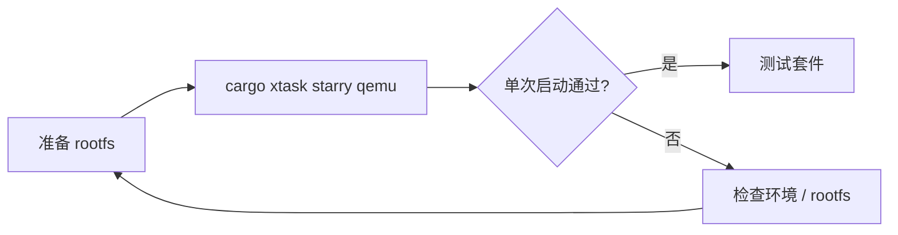

# StarryOS 快速上手

StarryOS 的最短启动路径通常包含 rootfs。当前 `qemu` 路径会在缺少 rootfs 时自动补齐，也可以显式先执行 `rootfs`。



## 1. 快速启动

StarryOS 的快速启动比 ArceOS 多了一层 rootfs 资产准备，因此这里同时给出“一步运行”和“显式分步”两种方式。第一次上手时，任选其一即可。

### 1.1 RISC-V 64

`riscv64` 仍然是最适合作为首条验证路径的架构。它在文档和测试套件中都较常用，适合先确认 rootfs 和 QEMU 路径是否已经接通。

推荐第一次从 `riscv64` 开始：

```bash
cargo xtask starry qemu --target riscv64gc-unknown-none-elf
```

或显式分步执行：

```bash
cargo xtask starry rootfs --arch riscv64
cargo xtask starry qemu --target riscv64gc-unknown-none-elf
```

### 1.2 AArch64

如果后续会继续关注板级路径或与 Axvisor 的 AArch64 环境对齐，可以尽快补跑这一条。它也是 StarryOS 当前非常重要的一条验证路径。

```bash
cargo xtask starry qemu --target aarch64-unknown-none-softfloat
```

分步执行：

```bash
cargo xtask starry rootfs --arch aarch64
cargo xtask starry qemu --target aarch64-unknown-none-softfloat
```

### 1.3 x86_64

`x86_64` 适合作为 PC 类平台的补充验证路径。命令和其它架构基本一致，差异主要体现在目标 triple 和对应的 QEMU 配置上。

```bash
cargo xtask starry qemu --target x86_64-unknown-none
```

分步执行：

```bash
cargo xtask starry rootfs --arch x86_64
cargo xtask starry qemu --target x86_64-unknown-none
```

### 1.4 LoongArch64

LoongArch64 路径更适合在主流架构已经跑通之后再验证。这样出现问题时，也更容易区分是环境问题还是实验性架构路径带来的差异。

```bash
cargo xtask starry qemu --target loongarch64-unknown-none-softfloat
```

分步执行：

```bash
cargo xtask starry rootfs --arch loongarch64
cargo xtask starry qemu --target loongarch64-unknown-none-softfloat
```

> `starry rootfs` 当前使用 `--arch`，不是 `--target`。  
> `starry qemu` 的 `--target` 可接受完整 target triple，也可接受简写架构名。

### 1.5 LicheeRV-Nano-SG2002

LicheeRV-Nano-SG2002 当前走 U-Boot 串口启动路径，适合在已经烧录并能正常进入 Linux 的开发板上验证 StarryOS。StarryOS 直接使用板上的 Linux 原生 ext4 根文件系统，默认根分区为 `root=/dev/mmcblk0p2`，不需要再单独制作 Starry rootfs 分区。

本地开发板启动使用 `quick-start`。默认串口配置来自 `os/StarryOS/configs/board/licheerv-nano-sg2002-uboot.toml`，默认串口是 `/dev/ttyUSB0`，波特率为 `115200`：

```bash
# 只构建 SG2002 StarryOS
cargo xtask starry quick-start licheerv-nano-sg2002 build

# 构建并通过本地串口上传、启动
cargo xtask starry quick-start licheerv-nano-sg2002 run

# 如需指定串口
cargo xtask starry quick-start licheerv-nano-sg2002 run --serial /dev/ttyUSB1
```

这条路径会构建 `riscv64gc-unknown-none-elf` 目标，并由 ostool 生成 FIT image，通过 U-Boot 的 `loady` 串口传输到 `fit_load_addr = 0x82200000`，再执行 `bootm 0x82200000`。内核入口地址为 `kernel_load_addr = 0x80200000`。

远端 CI / 板卡服务器启动使用 board test 入口：

```bash
cargo xtask starry test board --board licheerv-nano-sg2002 --server <ip> --port <port>
```

这里的 `--board licheerv-nano-sg2002` 用于选择 `test-suit/starryos` 下的 LicheeRV-Nano-SG2002 用例；实际向 ostool-server 申请的物理板卡类型写在用例配置中，当前同样为 `LicheeRV-Nano-SG2002`。

## 2. 测试入口

StarryOS 除了单次启动外，更常见的验证方式是直接进入测试套件。这里的命令会读取 `test-suit/starryos` 下的用例配置并运行；迁出的压力测试通过 Starry app 命令显式选择。

```bash
# 全部 test-suit QEMU 测试
cargo xtask starry test qemu --target riscv64gc-unknown-none-elf

# 压力测试
cargo xtask starry app qemu -t stress/git --arch riscv64

# 仅运行指定用例
cargo xtask starry test qemu --target aarch64-unknown-none-softfloat -c qemu-smp1/system

# 其他架构
cargo xtask starry test qemu --target x86_64-unknown-none
cargo xtask starry test qemu --target loongarch64-unknown-none-softfloat
```

如果需要板测：

```bash
cargo xtask starry test board --board orangepi-5-plus --server <ip> --port <port>
cargo xtask starry test board --board licheerv-nano-sg2002 --server <ip> --port <port>
```

详细说明见：[StarryOS 测试套件设计](/docs/build/test/starry)

若需要继续了解 case 结构、rootfs 组织方式和测试实现细节，可以继续阅读：

- [StarryOS 开发指南](/docs/development/starryos)
- [StarryOS 测试套件设计](/docs/build/test/starry)
- [QEMU 运行](/docs/build/overview)
