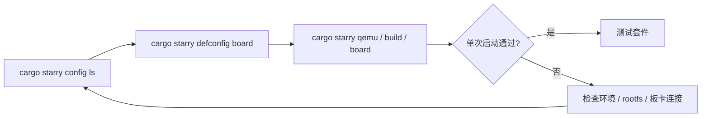

# StarryOS 快速上手

StarryOS 通过板卡配置确定目标架构、平台 feature 和运行参数。`cargo starry config ls` 列出配置名称，`cargo starry defconfig BOARD_NAME` 将选中配置写入默认构建配置和命令快照，后续 `build`、`qemu`、`uboot` 或 `board` 命令沿用该配置。



## 1. 选择板卡配置

先查看仓库当前支持的 StarryOS 板卡配置：

```bash
cargo starry config ls
```

输出中的名称可以直接传给 `defconfig`：

```bash
cargo starry defconfig qemu-riscv64
```

完成 `defconfig` 后，后续命令通常不需要再重复传 `--config`、`--target` 或 `--arch`。`quick-start` 是旧的便捷入口，后续会废弃；新的快速上手路径请使用 `config ls`、`defconfig` 和常规 `cargo starry` 子命令。

## 2. QEMU 快速启动

StarryOS 的 QEMU 启动通常包含 rootfs。当前 `qemu` 路径会在缺少 rootfs 时自动补齐，也可以显式先执行 `rootfs`。

### 2.1 RISC-V 64

`qemu-riscv64` 使用 RISC-V 64 target，并在启动时准备对应架构的 rootfs。

```bash
cargo starry defconfig qemu-riscv64
cargo starry qemu
```

或显式分步执行：

```bash
cargo starry defconfig qemu-riscv64
cargo starry rootfs --arch riscv64
cargo starry build
cargo starry qemu
```

### 2.2 AArch64

`qemu-aarch64` 使用 AArch64 target，并在启动时准备对应架构的 rootfs。

```bash
cargo starry defconfig qemu-aarch64
cargo starry qemu
```

分步执行：

```bash
cargo starry defconfig qemu-aarch64
cargo starry rootfs --arch aarch64
cargo starry build
cargo starry qemu
```

### 2.3 x86_64

`qemu-x86_64` 使用 x86_64 target 和 PC 类 QEMU 平台配置。

```bash
cargo starry defconfig qemu-x86_64
cargo starry qemu
```

分步执行：

```bash
cargo starry defconfig qemu-x86_64
cargo starry rootfs --arch x86_64
cargo starry build
cargo starry qemu
```

### 2.4 LoongArch64

`qemu-loongarch64` 使用 LoongArch64 target，运行环境需要提供 `qemu-system-loongarch64`。

```bash
cargo starry defconfig qemu-loongarch64
cargo starry qemu
```

分步执行：

```bash
cargo starry defconfig qemu-loongarch64
cargo starry rootfs --arch loongarch64
cargo starry build
cargo starry qemu
```

> `starry rootfs` 当前使用 `--arch`，不是 `--target`。  
> `starry qemu` 的 `--target` 可接受完整 target triple，也可接受简写架构名。

## 3. 开发板快速启动

开发板路径复用 `cargo starry defconfig BOARD_NAME` 选择构建配置，但 rootfs 来源、镜像传输方式和启动固件由具体硬件决定。以下三种板卡分别覆盖 LoongArch64 SATA、RISC-V SD 卡和 ostool-server 管理路径，不能互换 U-Boot 地址或根设备参数。

### 3.1 Loongson 2K1000

2K1000 使用 LoongArch64 动态平台路径，target 为 `loongarch64-unknown-none-softfloat`。U-Boot 通过 `go` 启动内核并传入 FDT，StarryOS 从板载 SATA SSD 的 ext4 分区挂载 rootfs。

#### 3.1.1 实现组件

LS2K1000 启动链路由早期引导、动态平台、中断控制器、设备发现和文件系统组件共同组成。下表把用户可见的串口、存储、网络和 rootfs 能力映射到对应 crate 与实现位置，便于按故障阶段定位代码。

| 类型 | crates | feature 或实现位置 | 作用 |
| --- | --- | --- | --- |
| 早期启动 | `someboot` | `platforms/someboot/src/arch/loongarch64/` | 解析 U-Boot 传入的 FDT，建立页表并启动 SMP |
| CPU 与动态平台 | `ax-cpu`、`axplat-dyn`、`ax-hal` | `components/axcpu/src/loongarch64/`、`platforms/axplat-dyn/` | 提供 LoongArch64 上下文、陷阱和动态平台接口 |
| 中断控制器 | `somehal`、`rdif-intc`、`irq-framework` | `platforms/somehal/src/arch/loongarch64/liointc.rs` | 探测并驱动 LS2K1000 LIOINTC |
| 驱动发现 | `rdrive`、`ax-driver` | `drivers/ax-driver/` | 根据 FDT 探测并注册板载设备 |
| 用户地址空间 | `starry-kernel` | `starry-kernel` feature `loongarch64-low-va` | 使用符合 2K1000 40-bit VA 限制的用户地址布局 |
| 串口 | `ax-driver`、`some-serial`、`rdif-serial` | `ax-driver` feature `serial`；`drivers/ax-driver/src/serial/ns16550.rs` | 驱动 NS16550，并注册运行期 `ttyS0` |
| RTC | `ax-driver` | `ax-driver` feature `rtc`；`drivers/ax-driver/src/time/loongson.rs` | 探测 `loongson,ls2k1000-rtc` |
| SATA | `ax-driver`、`simple-ahci`、`rdif-block` | `ax-driver` feature `ls2k1000-ahci`；`drivers/ax-driver/src/block/ahci.rs` | 驱动 AHCI 控制器并向文件系统提供 block device；当前使用同步 polling |
| 网络 | `ax-driver`、`rd-net`、`ax-net` | `ax-driver` feature `ls2k1000-gmac`；`drivers/ax-driver/src/net/loongson_gmac.rs` | 驱动板载 GMAC 并注册 `eth0` |
| 根文件系统 | `ax-fs-ng`、`rsext4` | — | 扫描 SATA 分区并挂载 ext4 rootfs |

板卡配置位于 `os/StarryOS/configs/board/ls2k1000.toml`。LS2K1000 AHCI 的 FDT/MMIO 适配已经合并在 `drivers/ax-driver/src/block/ahci.rs`，控制器核心复用 `simple-ahci`。LIOINTC 实现在 `somehal`；GMAC、RTC 和 NS16550 的 FDT 适配也位于 `ax-driver`。

#### 3.1.2 构建镜像

先选择 2K1000 配置并构建：

```bash
cargo starry defconfig ls2k1000
cargo starry build
```

也可以不修改默认配置，直接显式指定配置文件：

```bash
cargo starry build \
  --config os/StarryOS/configs/board/ls2k1000.toml
```

`ls2k1000.toml` 中的 `loongarch64-unknown-none-softfloat` 是 StarryOS 用于选择架构和平台配置的逻辑 target。实际构建时，`axbuild` 会将它映射到 `scripts/targets/std/pie/loongarch64-unknown-linux-musl.json`，因此默认 release 产物位于 `target/loongarch64-unknown-linux-musl/release/`。该目录包含 `starryos` ELF 和 `starryos.bin`，U-Boot/TFTP 使用其中的 `starryos.bin`。

实板启动前还需要准备：

- 可用的 U-Boot 网络和 TFTP 服务；
- 板载 SATA SSD 上可由 StarryOS 挂载的 ext4 rootfs；
- 串口终端，用于查看启动日志并进入 StarryOS shell。

当前配置没有写死 `root=` 参数。已验证的磁盘布局中只有一个受支持的 ext4 分区，`ax-fs-ng` 会扫描 AHCI 设备和分区表后自动选择它作为根文件系统。如果磁盘上存在多个可用文件系统分区，应显式整理根设备选择，不能依赖“唯一分区”规则。

#### 3.1.3 网络引导

先把生成的 `starryos.bin` 放到 TFTP 根目录。下面的 IP 地址是示例，应按本地网络修改：

```console
setenv ipaddr 192.168.99.20
setenv serverip 192.168.99.10
setenv netmask 255.255.255.0
```

[PR #1368](https://github.com/rcore-os/tgoskits/pull/1368) 实板验证使用下面的镜像和 FDT 地址。换用不同 U-Boot 或内存布局时，应先确认地址不会覆盖 U-Boot、FDT、内核或其它保留内存：

```console
setenv loadaddr 0x9000000098000000
setenv fdt_addr 0x900000000a000000
```

可以一次性保存下面的启动脚本：

```console
setenv starry_fdt_addr 'fdt addr ${fdtcontroladdr}'
setenv starry_fdt_size 'fdt header get fdt_size totalsize'
setenv starry_fdt_move 'fdt move ${fdtcontroladdr} ${fdt_addr} ${fdt_size}'
setenv starry_fdt_select 'fdt addr ${fdt_addr}'

setenv starry_load_tftp 'tftpboot ${loadaddr} starryos.bin'

setenv starry_hdr_entry 'setexpr hdr ${loadaddr} + 0x8'
setenv starry_read_entry 'setexpr.l kentry *0x${hdr}'
setenv starry_hdr_load 'setexpr hdr ${loadaddr} + 0x18'
setenv starry_read_load 'setexpr.l kload *0x${hdr}'
setenv starry_calc_off 'setexpr off ${kentry} - ${kload}'
setenv starry_calc_entry 'setexpr entry ${loadaddr} + ${off}'
setenv starry_print_entry 'printenv kentry kload off entry'

setenv starry_go 'go ${entry} ${fdt_addr}'
setenv boot_starry 'run starry_fdt_addr starry_fdt_size starry_fdt_move starry_fdt_select starry_load_tftp starry_hdr_entry starry_read_entry starry_hdr_load starry_read_load starry_calc_off starry_calc_entry starry_print_entry starry_go'
saveenv
```

之后每次启动执行：

```console
run boot_starry
```

仓库目前也没有 `ls2k1000-board.toml` 或 `test-suit/starryos/board-ls2k1000`，所以 `cargo starry board` 和 `cargo starry test board` 还不是 2K1000 的维护入口。普通 QEMU 同样没有 LS2K1000/2K1000 machine，无法覆盖 LIOINTC、AHCI 和 GMAC 实板路径。因此 `qemu-loongarch64` 只能验证 LoongArch64 通用路径，不能替代上面的手工物理板验证。

### 3.2 LicheeRV-Nano-SG2002

LicheeRV-Nano-SG2002 使用 U-Boot 串口启动路径，要求开发板已经烧录并能正常进入 Linux。StarryOS 直接使用板上的 Linux 原生 ext4 根文件系统，默认根分区为 `root=/dev/mmcblk0p2`，不需要再单独制作 Starry rootfs 分区。

#### 3.2.1 实现组件

SG2002 路径需要 someboot 完成固件交接，并由板级支持、串口和 SD 卡驱动建立可交互的 StarryOS 环境。下表列出各启动阶段的实现入口，排查根设备或控制台问题时应从相应组件开始。

| 类型 | crates | feature 或实现位置 | 作用 |
| --- | --- | --- | --- |
| 早期启动 | `someboot` | `platforms/someboot/src/arch/riscv64/` | 接收 U-Boot 传入的 FDT，建立页表并进入内核 |
| CPU 与动态平台 | `ax-cpu`、`axplat-dyn`、`ax-hal` | `axplat-dyn` feature `thead-mae` | 提供玄铁 C906/RISC-V 上下文、陷阱和动态平台接口 |
| 板级支持 | `starry-kernel`、`sg200x-bsp` | `starry-kernel` feature `sg2002` | 提供 SG2002 板级设备和用户态支持 |
| 驱动发现 | `rdrive`、`ax-driver` | `drivers/ax-driver/` | 根据 FDT 探测并注册板载设备 |
| 串口 | `ax-driver`、`some-serial`、`rdif-serial` | `ax-driver` feature `serial` | 注册运行期硬件控制台和 TTY |
| SD 卡 | `ax-driver`、`cv181x-sdhci`、`sdmmc-protocol`、`rdif-block` | `ax-driver` feature `cvsd` | 初始化 SD 卡并向文件系统提供 block device |
| 根文件系统 | `ax-fs-ng`、`rsext4` | — | 挂载 `/dev/mmcblk0p2` 上的 ext4 rootfs |

板卡构建配置位于 `os/StarryOS/configs/board/licheerv-nano-sg2002.toml`。其中 `cvsd` feature 会启用 CV181x SDHCI、SD/MMC 协议和块设备接口，`sg2002` feature 提供 StarryOS 所需的 SG2002 板级支持。

#### 3.2.2 构建准备

实板启动前需要准备：

- 能正常进入 U-Boot 的 LicheeRV-Nano-SG2002；
- 已烧录并能启动 Linux 的 SD 卡；
- SD 卡第二分区中可由 StarryOS 挂载的 ext4 根文件系统；
- 用于 U-Boot 和 StarryOS 交互的串口连接。

选择 SG2002 构建配置并单独构建内核：

```bash
cargo starry defconfig licheerv-nano-sg2002
cargo starry build
```

也可以不修改默认配置，直接显式指定配置文件：

```bash
cargo starry build \
  --config os/StarryOS/configs/board/licheerv-nano-sg2002.toml
```

该配置使用 `riscv64gc-unknown-none-elf` 目标，并启用 SG2002 板级支持、T-Head MAE、SD 卡和串口驱动。后面的 `cargo starry uboot` 或 `cargo starry board` 都会自动构建，因此只想快速启动时可以跳过这里的 `cargo starry build`。

#### 3.2.3 固件启动

本地串口启动使用 `uboot` 子命令。默认配置来自 `os/StarryOS/configs/board/licheerv-nano-sg2002-uboot.toml`，串口是 `/dev/ttyUSB0`，波特率为 `115200`：

```bash
cargo starry uboot \
  --uboot-config os/StarryOS/configs/board/licheerv-nano-sg2002-uboot.toml
```

这条路径会构建 `riscv64gc-unknown-none-elf` 目标，并根据 SG2002 的 ITS 模板生成 FIT image，随后通过 U-Boot 的 `loady` 串口传输到 `fit_load_addr = 0x82200000`，再执行 `bootm 0x82200000`。内核入口地址为 `kernel_load_addr = 0x80200000`。

也可以通过 ostool-server 自动完成板卡申请、U-Boot 启动和串口连接。执行前必须把 `OSTOOL_SERVER` 和 `OSTOOL_PORT` 设置为实际板卡服务器的地址与端口；命令中的 shell 检查会在变量缺失时直接报错：

```bash
cargo starry board \
  --board-config os/StarryOS/configs/board/licheerv-nano-sg2002-board.toml \
  --server "${OSTOOL_SERVER:?set OSTOOL_SERVER}" \
  --port "${OSTOOL_PORT:?set OSTOOL_PORT}"
```

`licheerv-nano-sg2002-board.toml` 中维护的是 StarryOS 侧的运行和判定配置：板卡类型为 `LicheeRV-Nano-SG2002`，shell 提示符为 `root@starry:`，超时时间为 600 秒。进入 shell 后会执行：

```bash
echo STARRY_SG2002_BOOT_OK
```

看到下面的输出表示内核启动、SD 卡 rootfs 挂载和用户态 shell 均已成功：

```text
STARRY_SG2002_BOOT_OK
```

如果要使用 test-suit 运行板级启动验证：

```bash
cargo starry test board \
  --board licheerv-nano-sg2002 \
  --server "${OSTOOL_SERVER:?set OSTOOL_SERVER}" \
  --port "${OSTOOL_PORT:?set OSTOOL_PORT}"
```

常规远端启动使用 `os/StarryOS/configs/board` 下的配置；板测使用 `test-suit/starryos/board-licheerv-nano-sg2002` 下的配置。若启动停在根设备探测阶段，请确认 SD 卡第二分区存在可挂载的 ext4 根文件系统。

### 3.3 StarFive VisionFive 2

VisionFive 2 与 LicheeRV-Nano-SG2002 一样通过 U-Boot 启动。VisionFive 2 使用动态平台配置，并通过 JH7110 MMC 驱动挂载开发板上已有的 Linux ext4 根文件系统；与 QEMU 路径不同，这里不需要执行 `cargo starry rootfs`。仓库当前已验证的自动化流程由 ostool-server 申请板卡，通过 U-Boot 加载内核并连接串口。

#### 3.3.1 实现组件

VisionFive 2 通过动态平台和 FDT 发现 PLIC、串口、RTC 与 JH7110 MMC，最终从 SD 卡挂载 ext4 rootfs。下表给出这些硬件能力对应的 crate 和 feature，用于区分通用驱动问题与 JH7110 SoC 适配问题。

| 类型 | crates | feature 或实现位置 | 作用 |
| --- | --- | --- | --- |
| 早期启动 | `someboot` | `platforms/someboot/src/arch/riscv64/` | 接收 U-Boot 传入的 FDT，建立页表并进入内核 |
| CPU 与动态平台 | `ax-cpu`、`axplat-dyn`、`ax-hal` | `components/axcpu/src/riscv/`、`platforms/axplat-dyn/` | 提供 RISC-V 上下文、陷阱和动态平台接口 |
| 中断控制器 | `somehal`、`ax-riscv-plic`、`rdif-intc`、`irq-framework` | `platforms/somehal/src/arch/riscv64/plic.rs` | 从 FDT 探测并驱动 JH7110 PLIC |
| 驱动发现 | `rdrive`、`ax-driver` | `drivers/ax-driver/` | 根据 FDT 探测并注册板载设备 |
| 串口 | `ax-driver`、`some-serial`、`rdif-serial` | `ax-driver` feature `serial` | 注册运行期硬件控制台和 TTY |
| RTC | `ax-driver` | `ax-driver` feature `rtc`；`drivers/ax-driver/src/time/starfive.rs` | 探测 `starfive,jh7110-rtc` |
| 时钟与复位 | `ax-driver`、`rdif-clk`、`rdif-reset` | `ax-driver` feature `starfive-soc`；`drivers/ax-driver/src/soc/starfive/` | 准备 JH7110 MMC 所需的 SYSCRG 时钟和复位 |
| SD/MMC | `starfive-jh7110-dwmmc`、`dwmmc-host`、`sdmmc-protocol`、`rdif-block` | `ax-driver` feature `starfive-jh7110-dwmmc` | 初始化 SD 卡并向文件系统提供 block device |
| 根文件系统 | `ax-fs-ng`、`rsext4` | — | 扫描 SD 卡分区并挂载 ext4 rootfs |

板卡构建配置位于 `os/StarryOS/configs/board/visionfive2.toml`。其中 `starfive-jh7110-dwmmc` feature 会同时启用通用 DWMMC/SD 协议、块设备接口以及 JH7110 SoC 时钟和复位支持。

#### 3.3.2 构建准备

实板启动前需要准备：

- 能正常进入 U-Boot 的 VisionFive 2；
- 开发板上可由 StarryOS 识别的 SD 卡；
- SD 卡中可挂载的 Linux ext4 根文件系统；
- 可访问 VisionFive 2 的 ostool-server 和串口连接。

板卡路径不会像 QEMU 一样自动下载或制作 rootfs 镜像。`ax-fs-ng` 会扫描 JH7110 MMC 块设备及其分区表，并根据 U-Boot 传入的 `root=` 参数选择根分区；没有明确指定时，再从探测到的文件系统中选择。

选择 VisionFive 2 配置并单独构建内核：

```bash
cargo starry defconfig visionfive2
cargo starry build
```

也可以不修改默认配置，直接显式指定配置文件：

```bash
cargo starry build \
  --config os/StarryOS/configs/board/visionfive2.toml
```

该配置使用 `riscv64gc-unknown-none-elf` 目标，并启用串口、RTC 和 `starfive-jh7110-dwmmc` 驱动。后面的 `cargo starry board` 也会自动构建，因此只想快速启动时可以跳过这里的 `cargo starry build`。

#### 3.3.3 固件启动

当前维护入口使用 ostool-server 驱动 VisionFive 2 的 U-Boot 启动流程，并复用前文设置的 `OSTOOL_SERVER` 与 `OSTOOL_PORT`：

```bash
cargo starry board \
  --board-config os/StarryOS/configs/board/visionfive2-board.toml \
  --server "${OSTOOL_SERVER:?set OSTOOL_SERVER}" \
  --port "${OSTOOL_PORT:?set OSTOOL_PORT}"
```

这条命令会使用 `visionfive2.toml` 构建 StarryOS，并将构建产物转换为板卡运行时需要的内核镜像；随后根据 `visionfive2-board.toml` 向 ostool-server 申请 `VisionFive2`，由服务器控制开发板进入 U-Boot、传输并加载内核。U-Boot 启动内核并传入当前开发板的 FDT 后，StarryOS 会从 FDT 发现 PLIC、串口、RTC 和 JH7110 MMC，从 SD 卡选择并挂载 ext4 rootfs，进入 `root@starry:` shell，最后执行预设的 shell 探针并在成功后释放板卡。

VisionFive 2 的镜像传输方式、U-Boot 加载地址和具体启动命令由 ostool-server 的 `VisionFive2` 板卡配置管理，不在 `visionfive2-board.toml` 中写死。因此不能直接复用 SG2002 的 `loady` 地址或 `bootm` 命令；调试这些参数时应检查所连接板卡服务器的 VisionFive 2 配置和 U-Boot 串口日志。

`visionfive2-board.toml` 中维护的是 StarryOS 侧的运行和判定配置：板卡类型为 `VisionFive2`，shell 提示符为 `root@starry:`，超时时间为 600 秒。进入 shell 后会执行：

```bash
echo STARRY_VISIONFIVE2_SHELL_OK
```

看到下面的输出表示内核启动、MMC rootfs 挂载和用户态 shell 均已成功：

```text
STARRY_VISIONFIVE2_SHELL_OK
```

如果要使用 test-suit 运行同一条板级启动验证：

```bash
cargo starry test board \
  --board visionfive2 \
  --server "${OSTOOL_SERVER:?set OSTOOL_SERVER}" \
  --port "${OSTOOL_PORT:?set OSTOOL_PORT}"
```

常规启动使用 `os/StarryOS/configs/board` 下的配置；板测使用 `test-suit/starryos/board-visionfive2` 下的配置。若启动停在根设备探测阶段，请先确认 SD 卡能被 U-Boot/Linux 正常识别，并且其中存在可挂载的 ext4 根文件系统。

## 4. 测试入口

StarryOS 除了单次启动外，更常见的验证方式是直接进入测试套件。这里的命令会读取 `test-suit/starryos` 下的用例配置并运行；迁出的压力测试通过 Starry app 命令显式选择。

```bash
# 全部 test-suit QEMU 测试
cargo starry test qemu --target riscv64gc-unknown-none-elf

# 压力测试
cargo starry app qemu -t stress/git --arch riscv64

# 仅运行指定用例
cargo starry test qemu --target aarch64-unknown-none-softfloat -c qemu/system

# 其他架构
cargo starry test qemu --target x86_64-unknown-none
cargo starry test qemu --target loongarch64-unknown-none-softfloat
```

如果需要板测：

```bash
cargo starry test board --board orangepi-5-plus --server "${OSTOOL_SERVER:?set OSTOOL_SERVER}" --port "${OSTOOL_PORT:?set OSTOOL_PORT}"
cargo starry test board --board licheerv-nano-sg2002 --server "${OSTOOL_SERVER:?set OSTOOL_SERVER}" --port "${OSTOOL_PORT:?set OSTOOL_PORT}"
cargo starry test board --board visionfive2 --server "${OSTOOL_SERVER:?set OSTOOL_SERVER}" --port "${OSTOOL_PORT:?set OSTOOL_PORT}"
```

详细说明见：[StarryOS 测试套件设计](/docs/build/starry/test)
