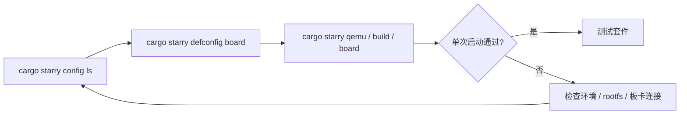

# StarryOS 快速上手

StarryOS 的快速上手建议先选择板卡配置，再执行常规构建或运行命令。`cargo starry config ls` 用于查看当前支持的板卡名称，`cargo starry defconfig <board>` 会把选中的板卡配置写入默认构建配置并记录到 StarryOS 命令快照，后续 `cargo starry build`、`cargo starry qemu`、`cargo starry uboot` 或 `cargo starry board` 会沿用这份配置。



## 1. 选择板卡配置

先查看仓库当前支持的 StarryOS 板卡配置：

```bash
cargo starry config ls
```

输出中的名称可以直接传给 `defconfig`：

```bash
cargo starry defconfig <board>
```

完成 `defconfig` 后，后续命令通常不需要再重复传 `--config`、`--target` 或 `--arch`。`quick-start` 是旧的便捷入口，后续会废弃；新的快速上手路径请使用 `config ls`、`defconfig` 和常规 `cargo starry` 子命令。

## 2. QEMU 快速启动

StarryOS 的 QEMU 启动通常包含 rootfs。当前 `qemu` 路径会在缺少 rootfs 时自动补齐，也可以显式先执行 `rootfs`。

### 2.1 RISC-V 64

`riscv64` 仍然是最适合作为首条验证路径的架构。它在文档和测试套件中都较常用，适合先确认 rootfs 和 QEMU 路径是否已经接通。

推荐第一次从 `riscv64` 开始：

```bash
cargo starry defconfig qemu-riscv64
cargo starry qemu
```

或显式分步执行：

```bash
cargo starry defconfig qemu-riscv64
cargo starry rootfs --arch riscv64
cargo starry build
cargo starry qemu
```

### 2.2 AArch64

如果后续会继续关注板级路径或与 Axvisor 的 AArch64 环境对齐，可以尽快补跑这一条。它也是 StarryOS 当前非常重要的一条验证路径。

```bash
cargo starry defconfig qemu-aarch64
cargo starry qemu
```

分步执行：

```bash
cargo starry defconfig qemu-aarch64
cargo starry rootfs --arch aarch64
cargo starry build
cargo starry qemu
```

### 2.3 x86_64

`x86_64` 适合作为 PC 类平台的补充验证路径。命令和其它架构基本一致，差异主要体现在目标 triple 和对应的 QEMU 配置上。

```bash
cargo starry defconfig qemu-x86_64
cargo starry qemu
```

分步执行：

```bash
cargo starry defconfig qemu-x86_64
cargo starry rootfs --arch x86_64
cargo starry build
cargo starry qemu
```

### 2.4 LoongArch64

LoongArch64 路径更适合在主流架构已经跑通之后再验证。这样出现问题时，也更容易区分是环境问题还是实验性架构路径带来的差异。

```bash
cargo starry defconfig qemu-loongarch64
cargo starry qemu
```

分步执行：

```bash
cargo starry defconfig qemu-loongarch64
cargo starry rootfs --arch loongarch64
cargo starry build
cargo starry qemu
```

> `starry rootfs` 当前使用 `--arch`，不是 `--target`。  
> `starry qemu` 的 `--target` 可接受完整 target triple，也可接受简写架构名。

## 3. 开发板快速启动

### 3.1 Loongson 2K1000

2K1000 使用 LoongArch64 动态平台路径，target 为 `loongarch64-unknown-none-softfloat`。U-Boot 通过 `go` 启动内核并传入 FDT，StarryOS 从板载 SATA SSD 的 ext4 分区挂载 rootfs。

#### 3.1.1 相关 crates 与驱动

| 类型 | crates | feature 或实现位置 | 作用 |
| --- | --- | --- | --- |
| 早期启动 | `someboot` | `platforms/someboot/src/arch/loongarch64/` | 解析 U-Boot 传入的 FDT，建立页表并启动 SMP |
| CPU 与动态平台 | `ax-cpu`、`axplat-dyn`、`ax-hal` | `components/axcpu/src/loongarch64/`、`platforms/axplat-dyn/` | 提供 LoongArch64 上下文、陷阱和动态平台接口 |
| 中断控制器 | `somehal`、`rdif-intc`、`irq-framework` | `platforms/somehal/src/arch/loongarch64/liointc.rs` | 探测并驱动 LS2K1000 LIOINTC |
| 驱动发现 | `rdrive`、`ax-driver` | `drivers/ax-driver/` | 根据 FDT 探测并注册板载设备 |
| 用户地址空间 | `starry-kernel` | `starry-kernel` feature `loongarch64-low-va` | 使用符合 2K1000 40-bit VA 限制的用户地址布局 |
| 串口 | `ax-driver`、`some-serial`、`rdif-serial` | `ax-driver` feature `serial`；`drivers/ax-driver/src/serial/ns16550.rs` | 驱动 NS16550，并注册运行期 `ttyS0` |
| RTC | `ax-driver` | `ax-driver` feature `rtc`；`drivers/ax-driver/src/time/loongson.rs` | 探测 `loongson,ls2k1000-rtc` |
| SATA | `ax-driver`、`simple-ahci`、`rdif-block` | `ax-driver` feature `ls2k1000-ahci`；`drivers/ax-driver/src/block/ahci.rs` | 驱动 AHCI 控制器并向文件系统提供 block device；当前使用同步 polling |
| 网络 | `ax-driver`、`rd-net`、`ax-net` | `ax-driver` feature `ls2k1000-gmac`；`drivers/ax-driver/src/net/loongson_gmac.rs` | 驱动板载 GMAC 并注册 `eth0` |
| 根文件系统 | `ax-fs-ng`、`rsext4` | — | 扫描 SATA 分区并挂载 ext4 rootfs |

板卡配置位于 `os/StarryOS/configs/board/ls2k1000.toml`。LS2K1000 AHCI 的 FDT/MMIO 适配已经合并在 `drivers/ax-driver/src/block/ahci.rs`，控制器核心复用 `simple-ahci`。LIOINTC 实现在 `somehal`；GMAC、RTC 和 NS16550 的 FDT 适配也位于 `ax-driver`。

#### 3.1.2 构建镜像

先选择 2K1000 配置并构建：

```bash
cargo starry defconfig ls2k1000
cargo starry build
```

也可以不修改默认配置，直接显式指定配置文件：

```bash
cargo starry build \
  --config os/StarryOS/configs/board/ls2k1000.toml
```

`ls2k1000.toml` 中的 `loongarch64-unknown-none-softfloat` 是 StarryOS 用于选择架构和平台配置的逻辑 target。实际构建时，`axbuild` 会将它映射到 `scripts/targets/std/pie/loongarch64-unknown-linux-musl.json`，因此默认 release 产物位于 `target/loongarch64-unknown-linux-musl/release/`。该目录包含 `starryos` ELF 和 `starryos.bin`，U-Boot/TFTP 使用其中的 `starryos.bin`。

实板启动前还需要准备：

- 可用的 U-Boot 网络和 TFTP 服务；
- 板载 SATA SSD 上可由 StarryOS 挂载的 ext4 rootfs；
- 串口终端，用于查看启动日志并进入 StarryOS shell。

当前配置没有写死 `root=` 参数。已验证的磁盘布局中只有一个受支持的 ext4 分区，`ax-fs-ng` 会扫描 AHCI 设备和分区表后自动选择它作为根文件系统。如果磁盘上存在多个可用文件系统分区，应显式整理根设备选择，不能依赖“唯一分区”规则。

#### 3.1.3 通过 TFTP 和 U-Boot 启动

先把生成的 `starryos.bin` 放到 TFTP 根目录。下面的 IP 地址是示例，应按本地网络修改：

```bash
setenv ipaddr 192.168.99.20
setenv serverip 192.168.99.10
setenv netmask 255.255.255.0
```

[PR #1368](https://github.com/rcore-os/tgoskits/pull/1368) 实板验证使用下面的镜像和 FDT 地址。换用不同 U-Boot 或内存布局时，应先确认地址不会覆盖 U-Boot、FDT、内核或其它保留内存：

```bash
setenv loadaddr 0x9000000098000000
setenv fdt_addr 0x900000000a000000
```

可以一次性保存下面的启动脚本：

```bash
setenv starry_fdt_addr 'fdt addr ${fdtcontroladdr}'
setenv starry_fdt_size 'fdt header get fdt_size totalsize'
setenv starry_fdt_move 'fdt move ${fdtcontroladdr} ${fdt_addr} ${fdt_size}'
setenv starry_fdt_select 'fdt addr ${fdt_addr}'

setenv starry_load_tftp 'tftpboot ${loadaddr} starryos.bin'

setenv starry_hdr_entry 'setexpr hdr ${loadaddr} + 0x8'
setenv starry_read_entry 'setexpr.l kentry *0x${hdr}'
setenv starry_hdr_load 'setexpr hdr ${loadaddr} + 0x18'
setenv starry_read_load 'setexpr.l kload *0x${hdr}'
setenv starry_calc_off 'setexpr off ${kentry} - ${kload}'
setenv starry_calc_entry 'setexpr entry ${loadaddr} + ${off}'
setenv starry_print_entry 'printenv kentry kload off entry'

setenv starry_go 'go ${entry} ${fdt_addr}'
setenv boot_starry 'run starry_fdt_addr starry_fdt_size starry_fdt_move starry_fdt_select starry_load_tftp starry_hdr_entry starry_read_entry starry_hdr_load starry_read_load starry_calc_off starry_calc_entry starry_print_entry starry_go'
saveenv
```

之后每次启动执行：

```bash
run boot_starry
```

仓库目前也没有 `ls2k1000-board.toml` 或 `test-suit/starryos/board-ls2k1000`，所以 `cargo starry board` 和 `cargo starry test board` 还不是 2K1000 的维护入口。普通 QEMU 同样没有 LS2K1000/2K1000 machine，无法覆盖 LIOINTC、AHCI 和 GMAC 实板路径。因此 `qemu-loongarch64` 只能验证 LoongArch64 通用路径，不能替代上面的手工物理板验证。

### 3.2 LicheeRV-Nano-SG2002

LicheeRV-Nano-SG2002 当前走 U-Boot 串口启动路径，适合在已经烧录并能正常进入 Linux 的开发板上验证 StarryOS。StarryOS 直接使用板上的 Linux 原生 ext4 根文件系统，默认根分区为 `root=/dev/mmcblk0p2`，不需要再单独制作 Starry rootfs 分区。

先选择 SG2002 构建配置：

```bash
cargo starry defconfig licheerv-nano-sg2002
cargo starry build
```

本地 U-Boot 串口启动使用常规 `uboot` 子命令。默认串口配置来自 `os/StarryOS/configs/board/licheerv-nano-sg2002-uboot.toml`，默认串口是 `/dev/ttyUSB0`，波特率为 `115200`：

```bash
cargo starry uboot \
  --uboot-config os/StarryOS/configs/board/licheerv-nano-sg2002-uboot.toml
```

这条路径会构建 `riscv64gc-unknown-none-elf` 目标，并根据 SG2002 的 ITS 模板生成 FIT image，随后通过 U-Boot 的 `loady` 串口传输到 `fit_load_addr = 0x82200000`，再执行 `bootm 0x82200000`。内核入口地址为 `kernel_load_addr = 0x80200000`。

远端板卡服务器启动使用常规 `board` 子命令：

```bash
cargo starry board \
  --board-config os/StarryOS/configs/board/licheerv-nano-sg2002-board.toml \
  --server <ip> \
  --port <port>
```

如果要运行完整板级测试，再使用 test-suit 入口：

```bash
cargo starry test board --board licheerv-nano-sg2002 --server <ip> --port <port>
```

这里的 `--board licheerv-nano-sg2002` 用于选择 `test-suit/starryos` 下的 LicheeRV-Nano-SG2002 用例；实际向 ostool-server 申请的物理板卡类型写在用例配置中，当前同样为 `LicheeRV-Nano-SG2002`。

## 4. 测试入口

StarryOS 除了单次启动外，更常见的验证方式是直接进入测试套件。这里的命令会读取 `test-suit/starryos` 下的用例配置并运行；迁出的压力测试通过 Starry app 命令显式选择。

```bash
# 全部 test-suit QEMU 测试
cargo starry test qemu --target riscv64gc-unknown-none-elf

# 压力测试
cargo starry app qemu -t stress/git --arch riscv64

# 仅运行指定用例
cargo starry test qemu --target aarch64-unknown-none-softfloat -c qemu-smp1/system

# 其他架构
cargo starry test qemu --target x86_64-unknown-none
cargo starry test qemu --target loongarch64-unknown-none-softfloat
```

如果需要板测：

```bash
cargo starry test board --board orangepi-5-plus --server <ip> --port <port>
cargo starry test board --board licheerv-nano-sg2002 --server <ip> --port <port>
```

详细说明见：[StarryOS 测试套件设计](/docs/build/starry/test)

若需要继续了解 case 结构、rootfs 组织方式和测试实现细节，可以继续阅读：

- [StarryOS 开发指南](/docs/development/starryos)
- [StarryOS 测试套件设计](/docs/build/starry/test)
- [QEMU 运行](/docs/build/overview)
