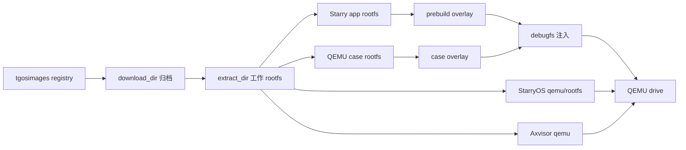
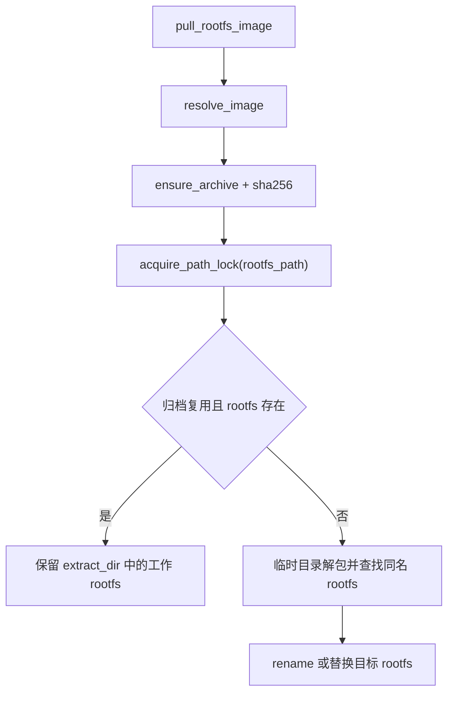
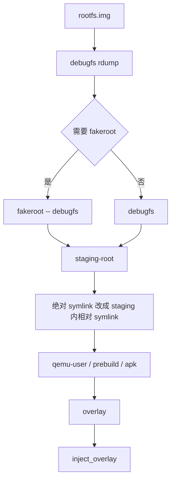

# Rootfs 处理实现

Rootfs 是 TGOSKits 运行 StarryOS、Axvisor、部分 ArceOS 场景和 QEMU 测试用例时共享的文件系统资产。当前实现由 `scripts/axbuild/src/image/` 管理镜像来源和本地存储，由 `scripts/axbuild/src/rootfs/` 管理镜像内容注入、扩容和 QEMU drive 补丁，再由 `starry/`、`axvisor/`、`arceos/` 与 `test/case/` 按各自语义消费这些能力。

## 1. 总体模型

Rootfs 处理链路分为“镜像来源”“工作镜像”“运行时改写”和“测试隔离”四层。镜像来源只负责可校验归档，工作镜像允许被启动脚本和 QEMU 修改，运行时改写通过 `debugfs` 写入镜像内容，测试隔离则通过 per-drive snapshot 或 per-case 镜像副本避免污染共享 rootfs。

### 1.1 目录分层

`ImageConfig::new_default()` 将下载缓存和可修改 rootfs 拆到不同目录：下载归档默认进入系统临时目录 `/tmp/tgosimages`，解压后的 rootfs 默认进入当前 workspace 的 `tmp/axbuild/rootfs`。这个拆分使自托管 runner 可以共享下载缓存，同时避免不同工作区共享会被 QEMU 写入的 rootfs。

| 层级 | 默认位置 | 主要代码 | 作用 |
| --- | --- | --- | --- |
| 下载缓存 | `/tmp/tgosimages` | `image/config.rs`、`image/storage.rs` | 保存 registry 副本和已校验的压缩归档 |
| 工作 rootfs | `<workspace>/tmp/axbuild/rootfs` | `Storage::pull_rootfs_image()` | 保存可被 StarryOS、Axvisor、app 和调试命令修改的 `.img` |
| app 工作区 | `<workspace>/tmp/axbuild/starry-app/<app>` | `starry/app/rootfs.rs` | 保存 app prebuild 的 `staging-root` 和 `overlay` |
| QEMU case 工作区 | `<workspace>/target/<target>/qemu-cases/<case>` | `test/case/layout.rs` | 保存测试构建目录、overlay、per-case rootfs 和 rootfs 缓存 |
| board case 工作区 | `<workspace>/target/<target>/board-cases/<case>` | `board_case_asset_layout()` | 保存板卡测试上传目录和构建中间产物 |

`TGOS_IMAGE_DOWNLOAD_DIR` 只适合放在跨任务持久缓存中，`TGOS_IMAGE_EXTRACT_DIR` 则应该跟随当前 workspace。后者包含可写 rootfs，既可能被 `ensure_apk_region_in_rootfs()` 改写，也可能在 persist 模式的 QEMU 运行后发生内容变化。

### 1.2 数据流

运行路径先通过 image 子系统准备 rootfs，再根据系统类型决定是否注入 overlay、是否补 QEMU drive、以及是否丢弃 guest 写入。`rootfs/qemu::patch_rootfs()` 只修改 QEMU 参数，`rootfs/inject.rs` 才会修改镜像内容。



图中的 registry 和 download cache 是只读来源，`extract_dir` 是本地工作副本。任何需要向镜像写入文件的流程都会先确认它操作的是工作 rootfs 或 per-case 副本，而不是压缩归档。

## 2. 镜像存储

Managed rootfs 是 image 子系统中的一类特殊镜像。它必须满足 `rootfs-*.img` 命名规则，拉取后直接输出为 `extract_dir/<image-name>`，不同于通用镜像会解压到 `extract_dir/<name>` 目录。

### 2.1 配置来源

`ImageConfig::read_config()` 读取 `<workspace>/tmp/axbuild/.image.toml`，文件不存在时会写入默认值。配置字段只有 `registry`、`download_dir` 和 `extract_dir`，旧字段或未知字段会在规范化回写时被删除。

```toml
registry = "https://raw.githubusercontent.com/rcore-os/tgosimages/refs/heads/main/registry/default.toml"
download_dir = "/tmp/tgosimages"
extract_dir = "<workspace>/tmp/axbuild/rootfs"
```

CLI 覆盖由 `ConfigOverrides` 处理，环境变量覆盖由 `ImageConfig::read_config_with_env()` 处理。`cargo xtask image -R/-D/-E ...` 的优先级高于环境变量，环境变量高于 `.image.toml`。

| 配置 | 环境变量 | 命令行参数 | 默认行为 |
| --- | --- | --- | --- |
| registry | 无 | `-R`、`--registry` | 跟踪 `tgosimages` main 分支的 `registry/default.toml` |
| 下载目录 | `TGOS_IMAGE_DOWNLOAD_DIR` | `-D`、`--download-dir` | 使用系统临时目录下的 `tgosimages` |
| 解压目录 | `TGOS_IMAGE_EXTRACT_DIR` | `-E`、`--extract-dir` | 使用当前 workspace 的 `tmp/axbuild/rootfs` |

配置文件是本机状态，不应提交。需要固定镜像版本时，应在本地 `.image.toml` 中指向版本 registry，或在命令行中为 `image pull` 指定 `name:version`。

### 2.2 Registry 解析

`ImageRegistry::fetch_with_includes()` 从配置的 registry URL 下载 TOML，并递归展开 `includes`。同一个 `(name, version)` 只保留第一次出现的条目，`ImageRegistry::find()` 在未指定版本时选择 `released_at` 最大的条目。

| 字段 | 代码类型 | 运行影响 |
| --- | --- | --- |
| `name` | `ImageEntry::name` | 作为 rootfs 文件名或通用镜像目录名 |
| `version` | `ImageEntry::version` | 支持 `name:version` 精确选择 |
| `released_at` | `Option<DateTime<Utc>>` | 未指定版本时用于选择最新条目 |
| `sha256` | `ImageEntry::sha256` | 下载后必须匹配，否则归档不会生效 |
| `arch` | `ImageEntry::arch` | `image ls` 展示和人工核对使用 |
| `url` | `ImageEntry::url` | 实际压缩归档来源 |

registry 每次创建 `Storage` 时都会重新获取，并把展开后的副本写入 `download_dir/images.toml`。这个副本用于诊断和查看，不是离线 fallback，也不改变下一次同步策略。

### 2.3 拉取流程

`Storage::pull_rootfs_image()` 先通过 registry 解析镜像，再调用 `download_file_verified_sha256()` 准备归档。归档复用且目标 rootfs 已存在时，函数会保留现有工作镜像；只有归档新增、归档被替换或目标 rootfs 缺失时，才通过 `extract_rootfs_archive()` 重新解包。



并发控制使用 `acquire_path_lock()` 锁住目标 rootfs 路径，避免多个 xtask 同时解包或改写同一个镜像。压缩格式由文件魔数判断，支持 gzip、xz 和未压缩 tar。

### 2.4 架构映射

默认 rootfs 名称来自 `context/arch.rs` 的 `ARCH_SPECS`。`default_rootfs_image_for_arch()` 被 StarryOS、Axvisor、ArceOS 显式 rootfs 和 `cargo xtask image pull --arch` 共同使用。

| 架构 | Rust target | 默认 rootfs | qemu-user 候选 |
| --- | --- | --- | --- |
| `aarch64` | `aarch64-unknown-none-softfloat` | `rootfs-aarch64-alpine.img` | `qemu-aarch64-static`、`qemu-aarch64` |
| `x86_64` | `x86_64-unknown-none` | `rootfs-x86_64-alpine.img` | `qemu-x86_64-static`、`qemu-x86_64` |
| `riscv64` | `riscv64gc-unknown-none-elf` | `rootfs-riscv64-alpine.img` | `qemu-riscv64-static`、`qemu-riscv64` |
| `loongarch64` | `loongarch64-unknown-none-softfloat` | `rootfs-loongarch64-alpine.img` | `qemu-loongarch64-static`、`qemu-loongarch64` |

裸 rootfs 参数由 `resolve_rootfs_path()` 解释。`alpine`、`busybox` 和 `debian` 会扩展为 `rootfs-<arch>-<distro>.img`，带目录组件的路径则被视为用户显式管理的路径。

## 3. 内容改写

Rootfs 内容改写统一经过 `scripts/axbuild/src/rootfs/inject.rs`。这层只面向 ext 类镜像，通过 `debugfs` 读取文件、替换文件、导出整棵 rootfs 或注入 overlay，不直接处理 QEMU 参数。

### 3.1 读取和替换

`read_text_file()`、`read_binary_file()` 和 `replace_file()` 用于定点读取或替换 guest 内文件。StarryOS 的 `ensure_apk_region_in_rootfs()` 依赖这些接口读取 `/etc/apk/repositories`、写回区域镜像源，并同步 `/etc/resolv.conf` 为 QEMU slirp 可用的 `10.0.2.3`。

| 函数 | 行为 | 典型使用 |
| --- | --- | --- |
| `read_binary_file()` | 执行 `debugfs -R "cat <guest-path>"` | 读取 rootfs 内二进制或文本文件 |
| `read_text_file()` | 在二进制读取基础上校验 UTF-8 | 读取 `/etc/apk/repositories` |
| `replace_file()` | 先 `rm` 再 `write`，Unix 下同步源文件 mode | 写回 resolv.conf 或 repositories |
| `looks_like_ext_image()` | 检查 ext superblock magic | 避免对非 ext 镜像执行 APK 改写 |

`STARRY_APK_REGION` 由 `starry/apk.rs` 解析，支持 `china`、`cn`、`us` 和 `usa`。未设置时默认使用 `us`，非法值会直接报错，而不是保留旧 repository 内容继续运行。

### 3.2 导出和注入

`extract_rootfs()` 使用 `debugfs rdump /` 导出镜像内容到 staging root。普通用户或用户命名空间下执行时，`RootfsExtraction` 会强制通过 `fakeroot -- debugfs` 运行，避免 `rdump` 在恢复 inode owner 时产生大量权限失败并留下不完整元数据。



导出后会调用 `relativize_absolute_symlinks()`。这是为了让 staging root 作为 qemu-user sysroot 使用时，guest 里的绝对 symlink 不会错误解析到 host 根目录。

### 3.3 Overlay 规则

`inject_overlay()` 将 host overlay 目录转换为一组 `debugfs -w` 命令。目录和普通文件先写入，symlink 第二轮写入，因为 `debugfs symlink` 会检查目标；普通文件会先删除目标再写入，Unix 下还会用 `sif` 保留源文件权限。

| Overlay 条目 | 处理规则 | 约束 |
| --- | --- | --- |
| 目录 | 生成 `mkdir /path` | 已存在目录的 stderr 会被过滤 |
| 普通文件 | 生成 `rm /path`、`write <host> /path` | Unix 下同步 mode |
| symlink | 第二轮生成 `symlink <link> <target>` | 相对 host 目标转换为绝对 guest 路径 |
| 其他类型 | 返回错误 | 不支持 socket、FIFO、设备节点等条目 |

`run_debugfs_script()` 会在写 stdin 前启动后台线程消费 stderr，避免 `debugfs` stderr 管道填满后和 stdin 写入形成死锁。它只过滤 “File exists” 一类无害目录创建信息，其他 stderr 会继续输出。

### 3.4 扩容工具

`resize_ext_rootfs_image()` 为 ext rootfs 提供 grow-only 扩容能力。它会拒绝缩小镜像，支持原地扩容或先复制到 `--output`，再依次执行 `e2fsck -fy` 和 `resize2fs`。

| 工具 | 查找规则 | 作用 |
| --- | --- | --- |
| `E2FSCK` | 环境变量、`PATH`、Homebrew fallback | 修复和检查扩容前文件系统 |
| `RESIZE2FS` | 环境变量、`PATH`、Homebrew fallback | 扩展 ext 文件系统到镜像末尾 |
| `truncate` | 由调用方或脚本使用 | 扩大镜像文件长度 |

CLI 入口是 `cargo xtask image resize <image> --size-mib <MIB>`。Starry app 的 `prebuild.sh` 也可以直接对 `STARRY_ROOTFS` 执行扩容，例如 `java-web` 和 `starrywrt` 会在注入大量运行资产前扩大 per-app 镜像。

### 3.5 运行库同步

`sync_runtime_dependencies()` 扫描 overlay 中的 ELF 文件，使用 host `readelf -d` 读取 `NEEDED` 项，再从 staging root 的 `lib`、`usr/lib` 和 `usr/local/lib` 查找缺失库并复制进 overlay。这个流程让注入的二进制在 guest 内运行时能找到同 rootfs 版本的动态库。

动态库复制会保留源文件 mode，并把新复制的库重新加入待处理队列，以便继续追踪二级依赖。没有在 staging root 中找到的库不会自动下载，调用方必须确保 prebuild 或测试构建流程已经准备好对应依赖。

## 4. QEMU 挂载

QEMU rootfs 挂载由 `rootfs/qemu::patch_rootfs()` 统一处理。它解析 `-drive` 和 `-device` 参数，替换或插入 rootfs drive，并根据写入策略决定是否给 rootfs drive 设置 `snapshot=on`。

### 4.1 Drive 选择

`RootfsPatchMode::EnsureDiskBootNet` 会确保标准 rootfs 启动所需的 NVMe drive、block device 和 user-mode network 参数存在。`RootfsPatchMode::ReplaceDriveOnly` 只替换已有 rootfs drive 或在匹配设备旁插入 drive，适合动态平台或已经完整描述设备的 QEMU TOML。

| 模式 | 选择规则 | 使用场景 |
| --- | --- | --- |
| `EnsureDiskBootNet` | 优先 `id=disk0`，再选直接 block interface，再选已被 device 引用的 drive；缺失时补 NVMe、drive 和 netdev | StarryOS 默认 QEMU、ArceOS 显式 rootfs |
| `ReplaceDriveOnly` | 替换 `disk0` 或其别名 drive；缺失但有 matching block device 时插入 drive | Axvisor、StarryOS 动态平台、测试配置 |

默认 wiring 使用 `disk0`、`nvme,drive=disk0,serial=tgoskits,max_ioqpairs=64,msix_qsize=65` 和 `user,id=net0`。如果配置使用 `if=sd` 这类直接挂载接口，patcher 会尊重已有块设备语义。

### 4.2 写入策略

`RootfsWritePolicy::Discard` 删除全局 `-snapshot`，并只在 rootfs drive 上设置 `snapshot=on`。这样可以隔离 rootfs 写入，同时不影响 pflash、VVFAT ESP 或额外 drive 的写入语义。

| 策略 | QEMU 参数效果 | 冲突检查 |
| --- | --- | --- |
| `Discard` | rootfs drive 增加 `snapshot=on` | 会移除全局 `-snapshot` |
| `Persist` | 不添加 drive snapshot | 若全局 `-snapshot` 存在或 rootfs drive 已有非 off snapshot，则报错 |

StarryOS 普通 QEMU 和 Axvisor 普通 QEMU 使用 persist，让用户显式运行后的 rootfs 改动保留。QEMU 测试路径使用 discard，避免一次测试的写入影响下一次测试或共享镜像。

### 4.3 路径重写

Checked-in QEMU TOML 可以使用 `${workspace}/tmp/axbuild/rootfs/<name>.img` 指向默认 managed rootfs 目录。`resolve_managed_rootfs_path()` 会把这个默认前缀重写到当前 `TGOS_IMAGE_EXTRACT_DIR`，同时仍然要求文件名符合 `rootfs-*.img`。

这个重写只作用于 managed rootfs 路径。带目录组件但不在默认 rootfs 目录或当前 extract dir 下的路径会作为用户自管镜像保留，axbuild 不会替用户下载或重建它。

## 5. 系统消费

三套系统对 rootfs 的所有权不同：StarryOS 默认依赖 managed Alpine rootfs，Axvisor 可以从 VM 配置推导 guest rootfs，ArceOS 默认运行仍保留 FAT32 兼容镜像。文档和配置应按系统边界描述行为，避免把一种系统的 rootfs 语义套到另一个系统。

### 5.1 StarryOS

`cargo xtask starry rootfs` 调用 `ensure_rootfs_in_tmp_dir()`，按 arch 准备默认 managed rootfs，并在 ext 镜像上同步 APK 镜像源和 QEMU slirp DNS。`cargo xtask starry qemu` 也会先调用 `ensure_qemu_rootfs_ready()`，再用 `patch_qemu_rootfs()` 把 QEMU 配置指向默认或显式 rootfs。

| 入口 | 函数 | Rootfs 行为 |
| --- | --- | --- |
| `starry rootfs` | `rootfs()` | 拉取默认 rootfs，改写 APK 区域和 resolv.conf |
| `starry qemu` | `qemu()` | 准备默认 rootfs，补标准 disk/net 参数，persist 写入 |
| `starry qemu --rootfs` | `qemu_with_explicit_rootfs()` | 解析裸 distro 或显式路径，只准备 managed 路径 |
| `starry quick-start` | `ensure_quick_start_qemu_rootfs()` | 为快速启动预拉取对应 arch 的默认 rootfs |

StarryOS 动态平台通过 feature 判断选择 `ReplaceDriveOnly`，避免 rootfs patcher 擅自添加不属于动态平台配置的设备。非动态平台则使用 `EnsureDiskBootNet`，保证默认 QEMU 参数包含根盘和用户网络。

### 5.2 Starry App

Starry app QEMU 配置由 `prepare_qemu_app_case()` 装载。默认模式下，如果 app 没有 `prebuild.sh`，它直接使用默认或配置中的 managed rootfs；如果存在 `prebuild.sh`，则先从默认 Alpine rootfs 复制出 app 专属 rootfs，再向脚本提供 staging 和 overlay 目录。

| 环境变量 | 提供方 | 含义 |
| --- | --- | --- |
| `STARRY_APP_NAME` | `prepare_default_qemu_app_rootfs()` | 当前 app 名称 |
| `STARRY_APP_DIR` | `prepare_default_qemu_app_rootfs()` | app 目录 |
| `STARRY_WORKSPACE` | `prepare_default_qemu_app_rootfs()` | workspace 根目录 |
| `STARRY_ARCH` | `prepare_default_qemu_app_rootfs()` | 当前 guest 架构 |
| `STARRY_ROOTFS` | `prepare_default_qemu_app_rootfs()` | app 将被写入和启动的 rootfs |
| `STARRY_STAGING_ROOT` | `prepare_default_qemu_app_rootfs()` | 脚本使用的 staging 目录，必要时可在其中导出 rootfs 内容 |
| `STARRY_OVERLAY_DIR` | `prepare_default_qemu_app_rootfs()` | 脚本应写入的 overlay 目录 |

脚本完成后，app runner 调用 `inject_overlay()` 将 overlay 写回 `STARRY_ROOTFS`。因此 prebuild 脚本不应直接修改共享 Alpine rootfs；需要扩容或写入大量资产时，应操作 runner 提供的 app 专属 rootfs。

### 5.3 App 自管镜像

`RootfsPreparationMode::AppOwned` 用于完全由 app 构建 rootfs 的场景。配置必须提供相对 app 目录的 `builder` 和非空 `target_arch`，runner 会校验请求架构与 `target_arch` 一致，并要求 QEMU 配置中存在可解析的 managed rootfs drive。

```toml
[rootfs_preparation]
mode = "app-owned"
builder = "build-rootfs.sh"
target_arch = "x86_64"
```

`apps/starry/nixos` 使用这个契约生成 `rootfs-x86_64-nixos.img`。这个路径没有 Alpine 复制、APK rewrite 或 overlay fallback；builder 失败、manifest 不匹配、目标架构不匹配或输出镜像无效都会让 app 准备阶段失败。

### 5.4 Axvisor

Axvisor 的 `rootfs.rs` 先判断显式 `--rootfs`，再尝试从 VM config 的 `[kernel].kernel_path` 旁边推导 `rootfs.img`，最后才回退到当前 arch 的默认 managed rootfs。普通 QEMU 运行使用 persist，测试运行使用 discard。

| 来源 | 函数 | 准备规则 |
| --- | --- | --- |
| 显式 `--rootfs` | `resolve_explicit_rootfs()` | 裸 distro 扩展为 managed 路径，其他路径按用户路径处理 |
| VM config sibling | `infer_rootfs_path()` | 若 `kernel_path` 同目录存在 `rootfs.img`，使用该镜像且不拉取默认 rootfs |
| 默认 managed rootfs | `default_rootfs_path()` | VM config 未提供 rootfs 时，按 arch 准备默认 Alpine rootfs |

Axvisor 使用 `ReplaceDriveOnly`，因为 VM 配置、firmware、CPU 和设备参数应由 Axvisor QEMU TOML 与 VM config 明确描述。`qemu_to_bin_requested()` 还会检查 UEFI 配置必须显式设置 `to_bin = true`。

### 5.5 ArceOS

ArceOS 默认 QEMU rootfs 不走 managed Alpine 镜像，而是由 `prepare_default_qemu_fat32_rootfs()` 为 QEMU 配置中命名为 `disk.img` 或 `arceos-*-fat32.img` 的 drive 创建 64 MiB FAT32 镜像。这个兼容路径保留到 ArceOS、StarryOS 和 Axvisor 的文件系统契约统一之后。

显式 `cargo xtask arceos qemu --rootfs ...` 会进入 `arceos/rootfs.rs` 的 managed rootfs 解析和 `EnsureDiskBootNet` patch 流程。ArceOS QEMU 测试如果识别到 FAT32 rootfs，则通过 `isolate_qemu_test_rootfs()` 给 rootfs drive 设置 discard 策略。

## 6. 测试资产

QEMU case 的 rootfs 处理位于 `scripts/axbuild/src/test/case/`，被 StarryOS 和 Axvisor 测试复用。它把“case 资产构建”和“QEMU 写入隔离”分开：前者决定是否生成 per-case rootfs，后者由 rootfs patcher 设置 drive snapshot。

### 6.1 Pipeline 选择

`resolve_case_pipeline()` 根据 case 目录内容选择唯一 pipeline。一个 case 同时定义 grouped、C、shell、Python 或 Rust 多种资产来源会报错，plain case 表示没有预启动注入需求。

| Pipeline | 判定条件 | Rootfs 行为 |
| --- | --- | --- |
| `plain` | 无 grouped 命令且无资产目录 | 直接使用共享 rootfs，由 QEMU drive snapshot 隔离写入 |
| `grouped` | case 配置有 grouped test commands | 生成 runner 和 overlay，写入 per-case rootfs |
| `c` | 存在 `c/` | 交叉构建并安装到 overlay，写入 per-case rootfs |
| `sh` | 存在 `sh/` | 复制 shell 脚本到 `/usr/bin`，写入 per-case rootfs |
| `python` | 存在 Python 源目录 | 准备 Python 资产和依赖，写入 per-case rootfs |
| `rust` | 存在 Rust 源目录 | 交叉构建 Rust 测试程序，写入 per-case rootfs |

plain case 不复制 rootfs，因为复制 1 GiB 级镜像会显著拖慢测试；它依赖 `RootfsWritePolicy::Discard` 保证 guest 写入不会落到共享镜像。

### 6.2 工作目录

`case_asset_layout()` 把每个 case 的运行目录放在 `target/<target>/qemu-cases/<case>/runs/<pid-seq>`，缓存放在 `target/<target>/qemu-cases/<case>/cache`。运行结束后会删除临时 rootfs 和 run dir，保留缓存目录。

```text
target/<target>/qemu-cases/<case>/
├── cache/
│   ├── apk-cache/
│   └── rootfs/
│       └── <sha256>.img
└── runs/<pid-seq>/
    ├── staging-root/
    ├── build/
    ├── overlay/
    ├── guest-bin/
    ├── cross-bin/
    └── case-rootfs.img
```

`board_case_asset_layout()` 使用相同结构，但根目录改为 `board-cases`，并把 overlay 目录命名为 `upload`。这是因为板卡路径上传文件而不是把 overlay 注入本地 QEMU rootfs。

### 6.3 缓存键

`case_asset_cache_key()` 生成 rootfs cache key。它包含 arch、target、case 名称、pipeline、相关环境变量、pipeline 版本、共享 rootfs 指纹、case 目录内容，以及 case 目录外部的 QEMU config 内容。

| 输入 | 代码锚点 | 失效原因 |
| --- | --- | --- |
| 架构和 target | `arch`、`target` | 交叉工具链和 guest ABI 变化 |
| pipeline | `CasePipeline::as_str()` | 不同资产构建方式产物不同 |
| 环境变量 | `CaseAssetConfig::cache_env_vars` | StarryOS 包含 `STARRY_APK_REGION` |
| pipeline 版本 | `PYTHON_PIPELINE_CACHE_VERSION` 等常量 | 构建脚本格式或依赖闭包规则变化 |
| rootfs 指纹 | `hash_rootfs_fingerprint()` | 共享 rootfs 内容或大小变化 |
| case 文件树 | `hash_tree()` | 测试源码、脚本或配置变化 |

Rootfs 指纹不会读取整张大镜像，而是哈希文件长度、起始窗口、中间窗口和末尾窗口。这个实现降低缓存键计算成本，但它是指纹而非完整内容证明。

### 6.4 缓存读写

cache hit 时，`prepare_case_assets_sync()` 直接把 `cache/rootfs/<sha256>.img` 复制或 reflink 到本次 `case-rootfs.img`，跳过 overlay 构建和 `inject_overlay()`。cache miss 时，流程复制共享 rootfs、执行 pipeline 准备、注入 overlay，再调用 `save_rootfs_cache_image()` 保存注入后的镜像。

`save_rootfs_cache_image()` 在 CI 中默认不写缓存，设置 `AXBUILD_DISABLE_ROOTFS_CACHE` 也会禁用写入。缓存文件小于 1 MiB 会被视为无效并触发重建，复制优先使用 Linux `cp --reflink=auto`，失败后回退到普通 `fs::copy()`。

### 6.5 系统差异

StarryOS 测试的 `starry_case_asset_config()` 会在 staging root 内写入 host DNS，并通过 `starry_guest_package_env()` 按 `STARRY_APK_REGION` 改写 APK repository。Axvisor 测试的 `axvisor_case_asset_config()` 不准备 guest package 环境，也不把额外环境变量纳入 rootfs cache key。

Axvisor 测试在 build 阶段还会准备 configured BusyBox initramfs，并在运行阶段用 `rootfs::patch_qemu_rootfs_path()` 对准备好的 case rootfs 设置 discard。StarryOS 测试则会先收集所有 QEMU 配置里的 managed rootfs 路径，统一确保这些 rootfs 已经存在，再逐 case 准备资产。

## 7. 专用场景

一些 Starry app 需要比默认 Alpine rootfs 更大的容量或完全不同的发行版语义。它们仍通过统一 runner 接入，但 rootfs 的所有权比普通 app 更强，文档和测试应按 app 自身 README 与 QEMU 配置核对。

### 7.1 Nix App

`apps/starry/nix` 的 QEMU 配置使用 `rootfs-<arch>-nix.img`。app runner 会从共享 Alpine base 初始化这个 managed 路径，`prebuild.sh` 再把 app 专属 rootfs 扩到 8 GiB，并通过 overlay 注入 Alpine packaged Nix、`nix.conf` 和 pinned nixpkgs 源。

这个 app 仍属于默认 rootfs preparation：它复用 Alpine rootfs、staging root 和 overlay 注入，只是选择 Nix 专属 managed 文件名，避免污染 `rootfs-<arch>-alpine.img`。

### 7.2 StarryNixOS

`apps/starry/nixos` 使用 app-owned rootfs preparation。`build-rootfs.sh` 根据 `flake.lock` 构建 x86_64 NixOS-style userspace 镜像，并发布到 QEMU 配置引用的 managed rootfs 路径；`STARRY_NIXOS_REUSE_ROOTFS=1` 只允许复用带 manifest 且通过校验的既有镜像。

这个流程不执行 Alpine APK 安装、repository rewrite 或 overlay 注入。它的成功条件、manifest 字段和回滚方式应以 `apps/starry/nixos/README.md` 和 `architecture/starryos/nixos-stage2.md` 为准。

### 7.3 大型应用

`apps/starry/java-web` 和 `apps/starry/starrywrt` 都会在 `prebuild.sh` 中扩大 app rootfs 后再注入资产。`java-web` 默认使用 `JWEB_ROOTFS_SIZE=2560M` 容纳 JDK 和 Java 依赖，`starrywrt` 默认使用 `STARRYWRT_ROOTFS_SIZE=1280M` 容纳 OpenWrt 风格用户态。

这些脚本直接操作 `STARRY_ROOTFS`，因此必须由 app runner 先复制出 app 专属 rootfs。脚本不应假设默认 Alpine rootfs 有足够空间，也不应把大型资产直接写入共享 rootfs。

## 8. 维护规则

Rootfs 相关变更应先确认它修改的是镜像来源、内容注入、QEMU 参数、系统入口还是测试资产缓存。不同层的错误表现可能相似，但对应代码和验证命令不同。

### 8.1 更新镜像

更新 managed rootfs 应通过 `rcore-os/tgosimages` registry 发布新条目或切换默认 registry 指向。axbuild 依据 registry 条目的 URL 和 SHA-256 判断是否下载和重建工作 rootfs，不再使用旧文档中的固定 release 常量或旧式目标目录。

本地验证镜像可用性时使用 image 子命令。`image pull --arch` 验证默认 arch 映射，`image check` 验证本地文件 SHA-256，`image resize` 验证 ext rootfs 扩容工具链。

### 8.2 新增发行版

新增 distro 关键字需要同时考虑 registry 文件名、`resolve_rootfs_path()` 的裸参数扩展、QEMU TOML 中的 managed 路径和测试缓存失效。仅向 registry 添加 `rootfs-<arch>-<distro>.img` 不会自动让 CLI 裸参数识别 `<distro>`。

如果新发行版不是 ext 镜像，`inject.rs` 的 debugfs 注入、StarryOS APK rewrite、test case overlay 和 `image resize` 都不能直接套用。维护者应为对应文件系统新增明确能力边界，而不是让 ext 专用函数静默跳过关键步骤。

### 8.3 新增测试资产

新增 QEMU test pipeline 时，应更新 `CasePipeline`、`resolve_case_pipeline()`、缓存版本常量、cache key 输入和 overlay 构建流程。只增加目录约定但不纳入 cache key，会导致旧 rootfs 缓存命中并跳过新的资产注入。

测试路径的 rootfs 写入隔离应继续由 `RootfsWritePolicy::Discard` 管理。不要重新引入全局 `-snapshot`，因为它会同时改变 pflash、VVFAT ESP 和额外 drive 的写入语义。

### 8.4 调试损坏

工作 rootfs 损坏时，删除 `extract_dir` 中对应 `.img` 后重新拉取即可；下载归档损坏时，下一次准备会因 SHA-256 不匹配自动重新下载。若怀疑本地 `.image.toml` 使用了旧格式，应删除 `<workspace>/tmp/axbuild/.image.toml`，让 `ImageConfig` 重新生成当前三字段格式。

QEMU 启动找不到 rootfs 时，先检查 QEMU TOML 的 `-drive file=` 是否是 managed 路径或显式用户路径，再检查 `TGOS_IMAGE_EXTRACT_DIR` 是否改变了 managed rootfs 的真实位置。测试 case 资产异常时，优先清理对应 `target/<target>/qemu-cases/<case>/cache/rootfs`，而不是删除全局下载缓存。
