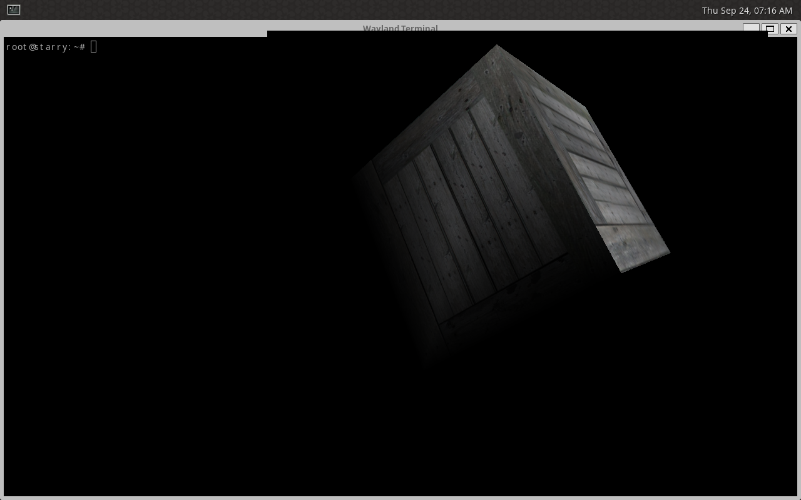

# GPU 与屏幕输出栈

## 1. 设备能力

GPU 负责资源、渲染上下文与命令完成，显示控制器负责把缓冲区提交到输出端。`rdif-gpu` 和 `rdif-display` 分别描述这两个操作系统无关的能力；同一块 VirtIO GPU 只注册一次设备，并由一个所有者协调共享的传输与资源。StarryOS 只从已探测的通用 GPU 能力建立 DRM 节点，不按 VirtIO 类型选择 GEM、PRIME 或 KMS 实现；VirtIO 控制命令留在 `virtio-gpu` 驱动内。

### 1.1 Linux 语义基线

本设计对照本地 Linux v7.1，提交 `8cd9520d35a6c38db6567e97dd93b1f11f185dc6`。`struct drm_gem_object` 管理缓冲区大小和引用，`struct drm_framebuffer` 把格式、步长与缓冲区关联；`drm_mode_config_funcs.atomic_check` 先验证完整显示状态，`atomic_commit` 才把状态交给硬件。`virtio_gpu_plane_atomic_update` 在设备内部完成必要的 2D 传输、scanout 绑定和 flush，通用显示接口不暴露这些线协议命令。

### 1.2 接口边界

`rdif-gpu::GpuDevice` 的调用者只持有设备作用域内的资源、上下文和完成标识。资源创建接收带所有权的 backing，驱动在硬件解除引用得到确认前保留它。`rdif-gpu::VirglOps` 是可选的渲染扩展，承载 capset、blob 和命令流；未协商能力返回明确的不支持错误。`rdif-display::DisplayController` 报告输出、格式和模式，检查并提交 framebuffer、damage 与 scanout 状态。显示控制器可以作为 GPU 设备的一项能力；无输出的 GPU 不宣称 modeset 能力。

通用资源与显示操作只表达缓冲区所有权和可观察效果。物理地址、Linux ioctl 编号、内核锁、任务和中断注册均不进入这些 trait。VirtIO resource ID 不作为通用缓冲区句柄；只有可选的 `VirglOps` 命令流扩展会把设备作用域内的句柄转换为 virgl 协议要求的 ID。`ax-driver` 探测设备并注册一次，`axgpu` 运行时拥有注册对象，`axdisplay` 只从同一对象获取屏幕输出能力。运行时通过 `device_identities` 枚举已探测设备，目前只激活第一台；其他设备对象和 DMA 映射保留至协调卸载，避免提前销毁仍被硬件引用的队列。默认 scanout 优先选择 XRGB8888，随后按输出公布的格式尝试；不支持设备图像资源时仍检查显示控制器是否接受直接 backing。

| 所有者 | 关键接口或对象 | Linux 对照 |
| --- | --- | --- |
| [`rdif-gpu`](../../../drivers/interface/rdif-gpu/src/lib.rs) | `Backing`、`GpuDevice`、`VirglOps` | `include/drm/drm_gem.h`、`drivers/gpu/drm/virtio/virtgpu_drv.h` |
| [`rdif-display`](../../../drivers/interface/rdif-display/src/interface.rs) | `DisplayController::check`、`commit`、`poll_event` | `include/drm/drm_mode_config.h`、`include/drm/drm_framebuffer.h` |
| [`virtio-gpu`](../../../drivers/gpu/virtio-gpu/src/rdif.rs) | `VirtIoGpuDevice` | `drivers/gpu/drm/virtio/virtgpu_plane.c` |
| [`axgpu`](../../../os/arceos/modules/axgpu/src/lib.rs) | `with_gpu`、`with_display`、`MappableBacking` | 操作系统的 DRM device、GEM 与 DMA 所有权层 |
| [Starry DRM](../../../os/StarryOS/kernel/src/pseudofs/dev/card0.rs) | `GpuResource`、`Framebuffer`、`GpuMappingLease` | `drm_gem_object`、`drm_framebuffer`、PRIME dma-buf |

## 2. 资源生命周期

创建缓冲区时，运行时先取得 backing 并验证尺寸、格式、步长及 DMA 可见性，再交给驱动创建硬件资源。提交到显示端会再持有资源引用；每个 VMA 保活对象持有 backing，映射建立时已有 GPU 资源的也同时持有该资源，PRIME fd 与导入对象持有相同引用。用户关闭 GEM handle、解除 mmap 或 PRIME 导入时，只减少相应引用。设备确认旧 scanout 不再使用且全部引用释放后，运行时才允许驱动解除 backing、释放硬件资源，最后释放页。失败或设备复位期间若不能确认停止 DMA，则保留 backing 直至复位完成。

### 2.1 显示提交

`DisplayController` 对一次提交先检查输出、模式、framebuffer、damage 和资源归属。`TEST_ONLY` 在检查后直接返回，不改变 scanout 或引用；正式提交先保留新资源，再由驱动执行硬件命令，成功后发布新状态并释放旧引用。中途失败仍保留旧 scanout，回滚尚未发布的新资源。同步完成令牌明确表示何时能释放旧 backing，不能以 ioctl 返回或固定延时推断 DMA 已结束。

### 2.2 并发与中断

`axgpu` 是 GPU 控制状态的单一任务上下文所有者。设备操作和资源表按固定顺序加锁，用户内存复制与可能阻塞的提交不在不可睡眠锁内进行。硬中断端点只确认来源并发布配置变化或队列完成事件，再唤醒 `axruntime` 的 GPU 工作任务；任务取得设备锁后推进控制队列和事件。IRQ 的申请、启用和工作任务由 `axruntime` 管理，不由 Starry 设备节点的构造时机决定。如果任务正在访问 VirtIO transport，中断端点只登记延迟确认，并在共享中断线上返回未确认来源，不能冒充其他设备的中断。注销时先禁止新请求，停用并同步中断，复位或排空在途命令，再释放 DMA backing 与设备对象。

VirtIO 的失败清理与正常析构写入设备状态 `0` 后，都必须读回 `0` 才把复位视为完成；随后解除队列，再放弃资源表中的 backing。这与本地 Linux PCI transport 的复位确认顺序一致。

Starry 的调用顺序为文件描述符的 `operation` 锁、必要时的 `modeset_operation` 锁、短时读取状态或资源表、释放表锁、最后进入 `axgpu` 设备锁。提交路径可在 `modeset_operation` 下进入设备锁，以串行化同一输出的检查与提交；资源表锁不得跨设备调用。硬中断不取得上述任一锁。删除 GEM、framebuffer 或 PRIME 别名时，先从表中移出 `Arc`，退出表锁后才让析构调用驱动的 `release_buffer`。

## 3. 操作系统接入

ArceOS 的 `axruntime` 把 `ax-driver` 注册对象交给 `axgpu`，`axdisplay` 通过同一实例访问显示端。StarryOS 的 DRM 核心维护 GEM handle、framebuffer、PRIME 与 modeset 状态；Linux 标准的 `DRM_IOCTL_VIRTGPU_*` 只在 VirtIO 兼容模块中转译到可选 `VirglOps`，不向通用 RDIF 泄漏 Linux UAPI，也不增加 Starry 专属 ioctl。同设备 PRIME 别名共享资源引用；外部 dma-heap 连续缓冲区只在 GPU 使用 Direct DMA 域时作为 backing 导入，其他 DMA 域须先提供映射能力。设备身份和 sysfs 信息来自已绑定驱动，VirtIO PCI 数值属性从探测到的 endpoint 读取；sysfs 父路径暂保留供现有 libdrm 使用的 platform 兼容层。没有 GPU 时不发布 DRM 节点，没有可映射 scanout 时不发布 `/dev/fb0`。无输出 GPU 的 dumb ioctl 仍按其图像资源能力工作，但 KMS ioctl 不发布显示能力。

### 3.1 迁移与回滚

迁移按 RDIF 契约、VirtIO 适配、运行时、StarryOS 用户态边界的顺序完成，并在同一变更中删除旧的 `rdif-display` virgl 方法和 `axdisplay` GPU 转发函数。Rust 调用方必须同步更新；`/dev/fb0`、DRM 和 VirtGPU 用户态 ABI 保持可用。变更不写入持久格式，回滚仅需恢复旧代码和原有配置。

### 3.2 验收证据

验收需要证明缓冲区创建失败可回滚、`TEST_ONLY` 无副作用、提交失败仍显示旧缓冲区、mmap 与 PRIME 引用保持 backing 存活，并覆盖设备缺席。项目入口运行 ArceOS 显示用例、StarryOS 各架构 DRM 用例；`virgl-test` 还需报告真实 `GL_RENDERER=virgl` 并检查输出画面。构建或节点存在本身不足以证明图形链路成功。

## 4. 本轮验证记录

以下命令在 2026-09-24 的工作树上运行。未提交时 `cargo xtask test --since 9a7b868bab8dcceb42acab516dcc88d5cc69985a` 尚不能识别本轮差异，因此先运行完整 `cargo xtask test`，得到 67/67 个软件包通过；提交后再运行增量入口，得到 14/14 个软件包通过。

| 命令 | 成功标记 |
| --- | --- |
| `cargo fmt`；`git diff --check` | 退出码 0，无格式或空白错误 |
| `cargo xtask clippy --package rdif-gpu`、`rdif-display`、`virtio-gpu`、`ax-driver`、`ax-gpu`、`ax-display`、`ax-api`、`ax-runtime`、`starry-kernel` | 各软件包均有 `all clippy checks passed` |
| `cargo xtask test` | `all std tests passed`，67/67 个软件包 |
| `cargo xtask test --since 9a7b868bab8dcceb42acab516dcc88d5cc69985a` | `all std tests passed`，14/14 个受影响软件包 |
| `cargo test -p virtio-gpu --features rdif --lib` | 2/2 passed；模拟 VirtQueue 覆盖检查无副作用、失败回滚、解绑失败后复位与 backing 释放，以及正常析构在解除队列前读回复位完成。任务工具的 std 清单未覆盖该驱动的 `rdif` 功能组合，因此使用此定向宿主测试。 |
| `cargo xtask arceos test qemu --test-group rust --test-case display-basic --arch x86_64` | `ARCEOS_TEST_END ... status=pass`、`ArceOS test suite run OK!` |
| `cargo xtask starry test qemu --arch x86_64 -c qemu/gpu-absent` | `STARRY_GPU_ABSENT_PASSED`、`all starry qemu tests passed` |

下面每行都使用 `cargo xtask starry test qemu --arch <架构> -c qemu/system/<用例>` 单独运行；每项都有 `STARRY_SYSTEM_TEST_PASSED`、`STARRY_GROUPED_TESTS_PASSED` 和 `all starry qemu tests passed` 终态。LoongArch 的客体通过 `--capture-failures` 只输出失败断言，因此以系统用例和任务工具终态为准。

| 架构 | `drm-test-drm-version` | `drm-test-drm-modeset` | `drm-test-drm-atomic` | `test-drm-perbuf-dumb` |
| --- | --- | --- | --- | --- |
| `x86_64` | 14 pass，0 fail | 87 pass，0 fail | 125 pass，0 fail | 54 pass，0 fail |
| `aarch64` | 14 pass，0 fail | 87 pass，0 fail | 125 pass，0 fail | 54 pass，0 fail |
| `riscv64` | 14 pass，0 fail | 87 pass，0 fail | 125 pass，0 fail | 54 pass，0 fail |
| `loongarch64` | 通过 | 通过 | 通过 | 通过 |

`cargo xtask starry app qemu -t virgl-test --arch x86_64` 已在 KVM/QEMU 的 `virtio-vga-gl` 上运行。客体 Weston 日志报告 `GL renderer: virgl`，`es2_info` 的 OpenGL core、compatibility 和 ES profile 均报告 `virgl`，`/tmp/glmark2.log` 报告 `GL_RENDERER: virgl`，且渲染过程中多个场景持续输出 FPS。同步从本次虚机的 VNC framebuffer 取得了实际画面：

QMP `screendump` 对 `egl-headless` 返回 `no surface`，因此画面由 VNC 原始 framebuffer 捕获；这不影响客体报告的 renderer。未运行实体板卡图形输出测试，以上图形证据只对应这次 QEMU/KVM 虚机与宿主 `/dev/dri/renderD128`。
