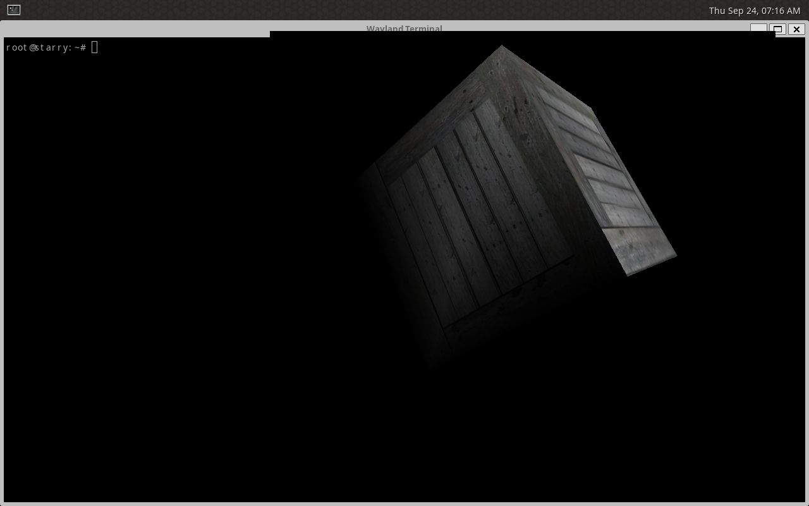

# GPU 与屏幕输出栈

## 1. 设备能力

GPU 负责资源、渲染上下文与命令完成，显示控制器负责把缓冲区提交到输出端。`rdif-gpu` 和 `rdif-display` 分别描述这两个操作系统无关的能力；同一块 VirtIO GPU 只注册一次设备，并由一个所有者协调共享的传输与资源。StarryOS 只从已探测的通用 GPU 能力建立 DRM 节点，不按 VirtIO 类型选择 GEM、PRIME 或 KMS 实现；VirtIO 控制命令留在 `virtio-gpu` 驱动内。

### 1.1 Linux 语义基线

本设计对照本地 Linux v7.1，提交 `8cd9520d35a6c38db6567e97dd93b1f11f185dc6`。`struct drm_gem_object` 管理缓冲区大小和引用，`struct drm_framebuffer` 把格式、步长与缓冲区关联；`drm_mode_config_funcs.atomic_check` 先验证完整显示状态，`atomic_commit` 才把状态交给硬件。`virtio_gpu_plane_atomic_update` 在设备内部完成必要的 2D 传输、scanout 绑定和 flush，通用显示接口不暴露这些线协议命令。

### 1.2 接口边界

`rdif-gpu::GpuDevice` 的调用者只持有设备作用域内的资源、上下文和完成标识。资源创建接收带所有权的 backing，驱动在硬件解除引用得到确认前保留它。`rdif-gpu::VirglOps` 是可选的渲染扩展，承载 capset、blob 和命令流；未协商能力返回明确的不支持错误。`rdif-display::DisplayController` 报告输出、格式和模式，检查并提交 framebuffer、damage 与 scanout 状态。显示控制器可以作为 GPU 设备的一项能力；无输出的 GPU 不宣称 modeset 能力。

通用资源与显示操作只表达缓冲区所有权和可观察效果。物理地址、Linux ioctl 编号、内核锁、任务和中断注册均不进入这些 trait。VirtIO resource ID 不作为通用缓冲区句柄；只有可选的 `VirglOps` 命令流扩展会把设备作用域内的句柄转换为 virgl 协议要求的 ID。`ax-driver` 探测设备并注册一次，`axgpu` 运行时拥有注册对象，`axdisplay` 只从同一对象获取屏幕输出能力。运行时通过 `device_identities` 枚举已探测设备，目前只激活第一台；其他设备对象和 DMA 映射保留至协调卸载，避免提前销毁仍被硬件引用的队列。默认 scanout 优先选择 XRGB8888，随后按输出公布的格式尝试；不支持设备图像资源时仍检查显示控制器是否接受直接 backing。

| 所有者 | 关键接口或对象 | Linux 对照 |
| --- | --- | --- |
| [`rdif-gpu`](../../../drivers/interface/rdif-gpu/src/lib.rs) | `Backing`、`GpuDevice`、`VirglOps` | `include/drm/drm_gem.h`、`drivers/gpu/drm/virtio/virtgpu_drv.h` |
| [`rdif-display`](../../../drivers/interface/rdif-display/src/interface.rs) | `DisplayController::check`、`commit`、`poll_event` | `include/drm/drm_mode_config.h`、`include/drm/drm_framebuffer.h` |
| [`virtio-gpu`](../../../drivers/gpu/virtio-gpu/src/rdif.rs) | `VirtIoGpuDevice` | `drivers/gpu/drm/virtio/virtgpu_plane.c` |
| [`axgpu`](../../../os/arceos/modules/axgpu/src/lib.rs) | `with_gpu`、`with_display`、`MappableBacking` | 操作系统的 DRM device、GEM 与 DMA 所有权层 |
| [Starry DRM](../../../os/StarryOS/kernel/src/pseudofs/dev/card0.rs) | `GpuResource`、`Framebuffer`、`GpuMappingLease` | `drm_gem_object`、`drm_framebuffer`、PRIME dma-buf |

## 2. 资源生命周期

创建缓冲区时，运行时先取得 backing 并验证尺寸、格式、步长及 DMA 可见性，再交给驱动创建硬件资源。提交到显示端会再持有资源引用；每个 VMA 保活对象持有 backing，映射建立时已有 GPU 资源的也同时持有该资源，PRIME fd 与导入对象持有相同引用。用户关闭 GEM handle、解除 mmap 或 PRIME 导入时，只减少相应引用。设备确认旧 scanout 不再使用且全部引用释放后，运行时才允许驱动解除 backing、释放硬件资源，最后释放页。失败或设备复位期间若不能确认停止 DMA，则保留 backing 直至复位完成。

同设备 PRIME 导入可能遇到资源已附着到当前渲染上下文的情况。导入 ioctl 的用户缓冲区回写失败时，只撤销此次新建的上下文附着；既有附着属于先前成功操作，必须保留。关闭文件描述符时，先从资源表移出其引用，释放模式设置锁后再析构可能触发驱动资源回收的对象。

文件关闭时由设备驱动执行一次 `CTX_DESTROY`，成功后移除该上下文的全部资源附着；不逐个执行可能失败的 `CTX_DETACH_RESOURCE`。如果销毁响应不能证明设备已完成操作，驱动先复位并读回设备停止状态，再清理附着及 backing。[VirtIO 1.2 GPU 控制队列规范](https://docs.oasis-open.org/virtio/virtio/v1.2/virtio-v1.2.html)允许设备在处理完成前交还响应，设置 `VIRTIO_GPU_FLAG_FENCE` 后则要求完成操作再返回，并回显 fence 标志和编号。协议核心统一请求并核对该完成 fence。

### 2.1 显示提交

`DisplayController` 对一次提交先检查输出、模式、framebuffer、damage 和资源归属。`TEST_ONLY` 在检查后直接返回，不改变 scanout 或引用；正式提交先保留新资源，再由驱动执行硬件命令，成功后发布新状态并释放旧引用。中途失败仍保留旧 scanout，回滚尚未发布的新资源。同步完成令牌明确表示何时能释放旧 backing，不能以 ioctl 返回或固定延时推断 DMA 已结束。

### 2.2 并发与中断

`axgpu` 是 GPU 控制状态的单一任务上下文所有者。设备操作和资源表按固定顺序加锁，用户内存复制与可能阻塞的提交不在不可睡眠锁内进行。硬中断端点只确认来源并发布配置变化或队列完成事件，再唤醒 `axruntime` 的 GPU 工作任务；任务取得设备锁后推进控制队列和事件。IRQ 的申请、启用和工作任务由 `axruntime` 管理，不由 Starry 设备节点的构造时机决定。如果任务正在访问 VirtIO transport，中断端点只登记延迟确认，并在共享中断线上返回未确认来源，不能冒充其他设备的中断。注销时先禁止新请求，停用并同步中断，复位或排空在途命令，再释放 DMA backing 与设备对象。

VirtIO 的失败清理与正常析构写入设备状态 `0` 后，都必须读回 `0` 才把复位视为完成；随后解除队列，再放弃资源表中的 backing。这与本地 Linux PCI transport 的复位确认顺序一致。

`GpuTransportCell` 只接受可跨处理器移动的 transport，并在 IRQ 端点确认时把状态锁存给任务端；任务端读取锁存状态后推进显示事件。`VirtIoGpuDevice::service_pending()` 在输出查询失败时保留显示变化标记，`gpu_irq_work` 对暂时性失败作有限次延迟重试。设备树探测的 DMA 一致性由 `dma_coherency_from_fdt()` 决定；没有设备树属性的静态设备使用平台默认值。当前运行时只为首台激活的 GPU 解析并注册 IRQ，其余已探测设备保留所有权但不启用中断。

普通 `axgpu::with_gpu`、`with_display` 和默认 scanout 恢复在访问前推进待处理事件，并向调用方返回失败。文件关闭、失败回滚和析构路径使用 `with_gpu_for_cleanup`，即使事件查询失败也能尝试解绑、销毁上下文和释放资源；新命令仍走普通入口。Starry 仅在停用旧 scanout 和查询旧提交完成状态时使用 `with_display_for_cleanup`，避免根据过时的输出信息提交新画面。待处理位留给工作任务重试，`service_irq_work` 向运行时返回错误。

VirtIO 显示提交同步返回 `Completion::Complete`，因此 `VirtIoGpuDevice::commit()` 不再为它另存一个待轮询的完成事件。`service_pending()` 对每个输出最多保留一个 `OutputChanged` 通知；后续变化更新输出状态，调用者通过 `poll_event()` 收到通知后重新查询最新状态。当前运行时尚未把显示变化事件转发给 Starry 的热插拔路径，这个有界队列不会因持续刷新 framebuffer 而增长。

Starry 的调用顺序为文件描述符的 `operation` 锁、必要时的 `modeset_operation` 锁、短时读取状态或资源表、释放表锁、最后进入 `axgpu` 设备锁。提交路径可在 `modeset_operation` 下进入设备锁，以串行化同一输出的检查与提交；资源表锁不得跨设备调用。硬中断不取得上述任一锁。删除 GEM、framebuffer 或 PRIME 别名时，先从表中移出 `Arc`，退出表锁后才让析构调用驱动的 `release_buffer`。合成 vblank 时钟只在成功提交后随 CRTC 状态和模式周期更新；待发事件在停用时按冻结的边沿完成。事件唤醒和可能释放最后一个文件引用的操作在 `modeset_operation` 锁外执行。

`Card0File::ioctl` 用 Linux `DRM_RENDER_ALLOW` 表限制 `renderD128`：它可以管理 GPU 资源和 PRIME 引用，但不能查询或改变 KMS 状态，也不能创建 dumb framebuffer。`Card0::handle_dirty_fb` 只重提交流水线当前正在扫描的 framebuffer；后备缓冲区要等正式翻页提交，停用的 CRTC 不会因 dirty 通知重新点亮。这使 `ModesetState::plane_fb_id` 与设备 scanout 保持一致。

Starry 的 KMS 门禁以显示控制器存在为准，不要求 GPU 实现 2D 图像资源。只有显示控制器的设备可把 dumb buffer 和 PRIME 导入 backing 直接交给 `DisplayController::check`、`commit`；支持图像资源的设备仍按原有资源创建路径处理，包括拒绝不支持的格式。当前 scanout 和待完成的旧 scanout 都保留 `FbBacking` 引用。异步提交返回 `Pending` 时，Card0 在任务上下文启动单个回收任务，每 20 ms 查询 `commit_status`；确认完成后才释放旧引用。回收任务进入设备锁前先放开 Card0 的引用表锁，因此 `GpuResource::drop` 可以安全地重新进入设备锁。没有 GPU IRQ 的显示设备只要能通过 `commit_status` 查询完成状态，也可走这条回收路径。

## 3. 操作系统接入

ArceOS 的 `axruntime` 把 `ax-driver` 注册对象交给 `axgpu`，`axdisplay` 通过同一实例访问显示端。StarryOS 的 DRM 核心维护 GEM handle、framebuffer、PRIME 与 modeset 状态；Linux 标准的 `DRM_IOCTL_VIRTGPU_*` 只在 VirtIO 兼容模块中转译到可选 `VirglOps`，不向通用 RDIF 泄漏 Linux UAPI，也不增加 Starry 专属 ioctl。同设备 PRIME 别名共享资源引用；外部 dma-heap 连续缓冲区只在 GPU 使用 Direct DMA 域时作为 backing 导入，其他 DMA 域须先提供映射能力。设备身份和 sysfs 信息来自已绑定驱动，VirtIO PCI 数值属性从探测到的 endpoint 读取；sysfs 父路径暂保留供现有 libdrm 使用的 platform 兼容层。没有 GPU 时不发布 DRM 节点，没有可映射 scanout 时不发布 `/dev/fb0`。无输出 GPU 的 dumb ioctl 仍按其图像资源能力工作，但 KMS ioctl 不发布显示能力。

当前 Starry DRM 向用户态只暴露一组 CRTC、connector 和 primary plane，首次提交选取第一个已连接输出；`rdif-display` 仍保留完整的输出枚举能力。后续提交由 `select_output_for_present` 保持原输出绑定；原输出断开时先拒绝新提交，避免切换到另一输出后提前释放旧 backing。`Card0::clear_scanout` 根据 `DisplayController::current_state` 找到实际持有 framebuffer 的输出，即使该输出已断开，也向它提交禁用状态并等待完成后释放旧 backing。多个输出同时运行和无停用阶段的热插拔切换不在本轮实现范围内。

### 3.1 迁移与回滚

迁移按 RDIF 契约、VirtIO 适配、运行时、StarryOS 用户态边界的顺序完成，并在同一变更中删除旧的 `rdif-display` virgl 方法和 `axdisplay` GPU 转发函数。Rust 调用方必须同步更新；`/dev/fb0`、DRM 和 VirtGPU 用户态 ABI 保持可用。变更不写入持久格式，回滚仅需恢复旧代码和原有配置。

### 3.2 验收证据

验收需要证明缓冲区创建失败可回滚、`TEST_ONLY` 无副作用、提交失败仍显示旧缓冲区、mmap 与 PRIME 引用保持 backing 存活，并覆盖设备缺席。项目入口运行 ArceOS 显示用例、StarryOS 各架构 DRM 用例；`virgl-test` 还需报告真实 `GL_RENDERER=virgl` 并检查输出画面。构建或节点存在本身不足以证明图形链路成功。

## 4. 本轮验证记录

以下命令在 2026-09-24 的工作树上运行。未提交时 `cargo xtask test --since 9a7b868bab8dcceb42acab516dcc88d5cc69985a` 尚不能识别本轮差异，因此先运行完整 `cargo xtask test`，得到 67/67 个软件包通过；提交后再运行增量入口，得到 14/14 个软件包通过。

| 命令 | 成功标记 |
| --- | --- |
| `cargo fmt`；`git diff --check` | 退出码 0，无格式或空白错误 |
| `cargo xtask clippy --package rdif-gpu`、`rdif-display`、`virtio-gpu`、`ax-driver`、`ax-gpu`、`ax-display`、`ax-api`、`ax-runtime`、`starry-kernel` | 各软件包均有 `all clippy checks passed` |
| `cargo xtask test` | `all std tests passed`，67/67 个软件包 |
| `cargo xtask test --since 9a7b868bab8dcceb42acab516dcc88d5cc69985a` | `all std tests passed`，14/14 个受影响软件包 |
| `cargo test -p virtio-gpu --features rdif --lib` | 2/2 passed；模拟 VirtQueue 覆盖检查无副作用、失败回滚、解绑失败后复位与 backing 释放，以及正常析构在解除队列前读回复位完成。任务工具的 std 清单未覆盖该驱动的 `rdif` 功能组合，因此使用此定向宿主测试。 |
| `cargo xtask arceos test qemu --test-group rust --test-case display-basic --arch x86_64` | `ARCEOS_TEST_END ... status=pass`、`ArceOS test suite run OK!` |
| `cargo xtask starry test qemu --arch x86_64 -c qemu/gpu-absent` | `STARRY_GPU_ABSENT_PASSED`、`all starry qemu tests passed` |

下面每行都使用 `cargo xtask starry test qemu --arch <架构> -c qemu/system/<用例>` 单独运行；每项都有 `STARRY_SYSTEM_TEST_PASSED`、`STARRY_GROUPED_TESTS_PASSED` 和 `all starry qemu tests passed` 终态。LoongArch 的客体通过 `--capture-failures` 只输出失败断言，因此以系统用例和任务工具终态为准。

| 架构 | `drm-test-drm-version` | `drm-test-drm-modeset` | `drm-test-drm-atomic` | `test-drm-perbuf-dumb` |
| --- | --- | --- | --- | --- |
| `x86_64` | 14 pass，0 fail | 87 pass，0 fail | 125 pass，0 fail | 54 pass，0 fail |
| `aarch64` | 14 pass，0 fail | 87 pass，0 fail | 125 pass，0 fail | 54 pass，0 fail |
| `riscv64` | 14 pass，0 fail | 87 pass，0 fail | 125 pass，0 fail | 54 pass，0 fail |
| `loongarch64` | 通过 | 通过 | 通过 | 通过 |

`cargo xtask starry app qemu -t virgl-test --arch x86_64` 已在 KVM/QEMU 的 `virtio-vga-gl` 上运行。客体 Weston 日志报告 `GL renderer: virgl`，`es2_info` 的 OpenGL core、compatibility 和 ES profile 均报告 `virgl`，`/tmp/glmark2.log` 报告 `GL_RENDERER: virgl`，且渲染过程中多个场景持续输出 FPS。同步从本次虚机的 VNC framebuffer 取得了实际画面：

QMP `screendump` 对 `egl-headless` 返回 `no surface`，因此画面由 VNC 原始 framebuffer 捕获；这不影响客体报告的 renderer。未运行实体板卡图形输出测试，以上图形证据只对应这次 QEMU/KVM 虚机与宿主 `/dev/dri/renderD128`。

### 4.1 2026-09-28 变基与审查修复

分支先变基到 `7c79828fefde`，合并上游新增的 vblank 支持，并修复同设备 PRIME 重复导入失败时误拆除既有 virgl 上下文附着的问题；随后无冲突变基到包含 PCI ECAM 测试修复的 `8af5f36698`。`cargo fmt`、`git diff --check` 和 DRM modeset 用例的 `cc -std=gnu11 -Wall -Wextra -Werror -fsyntax-only` 均通过。`cargo xtask clippy --package starry-kernel` 完成 76/76 项检查；`cargo xtask test --since 7c79828fefde` 完成 14/14 个软件包，包含模式切换后 vblank 周期与序号的单元测试。

本次 Starry x86_64 `qemu/system` 运行期间，四个 DRM 系统用例均报告 `STARRY_SYSTEM_TEST_PASSED`。用户随后收窄本地验证范围，完整套件已中断，不能视为整套通过；其他架构与 virgl 画面没有在变基后的提交上重新运行。上方四架构和图形输出记录属于 2026-09-24 的原提交。

### 4.2 2026-09-28 驱动复核

本次修正了 `VirtIoGpuDevice` 的 2D 格式编码、3D scanout 格式和尺寸检查、主机明确拒绝创建或确认资源不存在后的释放判定，以及输出查询失败后的事件保留；新增测试先在旧实现上失败，再在修复后通过。检查只覆盖受影响功能组合，不重复运行全量 Clippy 或 QEMU。

| 命令 | 结果 |
| --- | --- |
| `cargo fmt`；`git diff --check` | 通过 |
| `cargo xtask clippy --package virtio-gpu` | 2/2 功能组合通过 |
| `cargo test -p virtio-gpu --features rdif --lib` | 5/5 测试通过；新增的 3D 尺寸断言先在旧校验上失败 |
| `cargo clippy --no-deps -p ax-driver --no-default-features --features virtio-gpu -- -D warnings` | VirtIO GPU 功能组合通过 |
| `cargo clippy --no-deps -p ax-runtime --no-default-features --features display -- -D warnings` | display 功能组合通过 |
| `cargo clippy --no-deps -p starry-kernel --no-default-features -- -D warnings` | Starry 内核基础功能组合通过 |
| `cc -std=gnu11 -Wall -Wextra -Werror -fsyntax-only test-suit/starryos/qemu/system/drm-test-drm-modeset/src/main.c` | DRM 系统用例语法检查通过 |

`ax-driver`、`ax-runtime` 与 `starry-kernel` 的项目任务工具没有单一功能组合入口；上面三条原生 Cargo 命令按任务工具展开的参数定向检查，避免执行整个功能矩阵。本次没有获取新的实体板卡、QEMU 或 virgl 画面证据；系统用例的新增断言仍需在 CI 运行。

### 4.3 2026-09-28 通用 scanout 复核

补齐无 2D 图像资源的显示控制器：`/dev/fb0` 的直接 backing 刷新可识别当前 scanout；Starry 的 KMS、dumb buffer 与 `ADDFB2` 可以提交 backing，`DRM_CAP_DUMB_BUFFER` 与实际能力一致。提交成功后当前 scanout 和异步待释放的旧 scanout 都保留 backing 或 GPU 资源引用；回收任务在完成确认后释放旧引用。

`ax-display` 的直接 backing 身份测试先在旧匹配逻辑上失败，再在修复后以相同命令通过。`cargo fmt` 和 `git diff --check` 通过；`cargo xtask clippy --package ax-display` 的 2/2 组合通过。`cargo xtask clippy --package starry-kernel` 的 AArch64 基础组合已通过，随后按本地验证范围限制中止剩余矩阵；`cargo clippy --no-deps -p starry-kernel --no-default-features -- -D warnings` 定向通过。用户要求本地不运行全量 Clippy 或 QEMU；本次没有新的图形输出证据。

提交代码后运行 `cargo xtask test --since e5efb8291dfe0997341524e1d3f14b082000e421`，`ax-display` 和 `starry-kernel` 2/2 软件包通过，其中 `ax-display` 的直接 backing 回归测试在项目入口实际执行并通过。此前只覆盖 `ax-display` 的定向测试先在旧实现上报告断言失败。本次没有可用于直接 backing 显示控制器的 QEMU 设备，因此 Starry 的纯 backing KMS 路径仍待带相应驱动的系统用例验证。

### 4.4 2026-09-28 显示事件积压修复

VirtIO 的同步显示提交原先每次都向无人消费的队列加入 `CommitCompleted`，连续输出变化也会累积重复通知。增强现有协议测试后，`cargo test -p virtio-gpu --features rdif --lib` 在旧实现上有 2/5 个测试按预期失败；修复后同一命令 5/5 通过。`cargo fmt`、`git diff --check` 和 `cargo xtask clippy --package virtio-gpu` 均通过，后者覆盖 base 与 `rdif` 两个功能组合。本次未运行 QEMU 或全量 Clippy；任务工具的 std 测试清单未包含 `virtio-gpu`，故使用驱动自身的定向宿主测试。

### 4.5 2026-09-28 断开输出的 scanout 清理

Starry 在停用时查询驱动的 `current_state`，向仍持有 framebuffer 的输出提交禁用状态；原输出断开而另一输出连上时，`select_output_for_present` 拒绝直接切换，防止旧 backing 在设备解绑前释放。现有 Starry 单元测试加入这两种状态后，`cargo xtask test --since d3536651c219946371e253237a429362c46508c4` 在旧逻辑上分别得到 13/14 个软件包通过，`starry-kernel` 的新增断言失败；修复后同一命令 14/14 通过。`cargo fmt`、`git diff --check`、`cargo xtask clippy --package rdif-display` 和 `cargo clippy --no-deps -p starry-kernel --no-default-features -- -D warnings` 均通过。后者按单一功能组合检查，避免 `xtask` 的 Starry 多配置矩阵。本地按要求未运行 QEMU 或全量 Clippy；断开后的实际显示硬件行为仍需设备测试验证。

分支随后无冲突地变基到 `dev` 的 `ce1740fcad`，纳入 SG2002 网络用例的 curl 打包修复及项目验证范围说明。`git range-diff` 显示 GPU 栈的七个提交补丁保持不变；变基后的运行证据以新提交的 CI 终态为准。

### 4.6 2026-09-28 上下文关闭与完成确认

审查发现上下文中的单个资源解绑失败会阻止 `CTX_DESTROY`，进而使随后析构的 GPU 资源因仍有附着而无法释放。Starry 文件关闭现直接请求销毁上下文；驱动在确认销毁后清除附着，结果不明确时先复位设备再释放 backing。VirtIO 规范允许控制队列提前交还响应，故协议核心为同步命令设置 fence 并核对响应中的标志和编号，覆盖 scanout 切换、传输、上下文销毁与资源解绑。

`cargo test -p virtio-gpu --features rdif --lib` 的新增关闭路径测试在旧实现上失败，修复后 7/7 通过；同一测试中的未设置 fence 断言也先在旧请求实现上失败。模拟主机故意省略 `CTX_DESTROY` 的 fence 回显时，驱动返回 `DeviceLost`，测试确认复位已读回并且 backing 随后才释放。独立复核发现普通显示访问容忍输出查询失败会使用过期模式，已恢复错误传播；进一步按任意 GPU 驱动的契约把普通 GPU 访问也恢复为错误传播，仅明确的清理与回收路径使用容错入口。

`cargo fmt`、`git diff --check`、`cargo xtask clippy --package virtio-gpu`（2/2）、`rdif-gpu`（1/1）和 `ax-gpu`（2/2）通过。`cargo xtask clippy --package starry-kernel` 在首批 10 个组合通过后按本地范围限制中断，不能作为最终差异的完整证据；任务入口无单组合选项，随后按其展开参数定向运行最终差异的 Starry AArch64 基础组合并通过。本地未运行全量 Clippy 或 QEMU；真实主机的 fence 行为仍以本次提交的 CI 和后续图形运行证据为准。

### 4.7 2026-09-28 未确认的显示提交

控制队列交还已用描述符但未回显匹配的 fence 时，驱动无法确认 `SET_SCANOUT` 是否仍会在主机侧生效，也无法安全地仅靠后续回滚命令证明旧提交已经结束。协议核心此时先写入设备复位状态、读回确认并解除队列，再允许适配层放弃旧、新 scanout backing；调用者收到 `DeviceLost`，不会把这次提交误当成普通的可回滚错误。`DisplayController::commit` 的错误契约据此明确：设备仍可用时保留旧状态；设备丢失时旧 scanout 不再有效。

模拟主机省略 `SET_SCANOUT` fence 的测试先在旧实现上失败（实际得到 `Gpu(Io)`，且没有证明复位已完成），修复后验证 `DeviceLost`、复位读回以及两份 backing 均在设备停止后释放。`cargo test -p virtio-gpu --features rdif --lib` 8/8 通过，`cargo xtask clippy --package virtio-gpu` 2/2 组合和 `cargo xtask clippy --package rdif-display` 1/1 组合通过，`cargo fmt` 与 `git diff --check` 通过。本地不运行全量 Clippy 或 QEMU。

### 4.8 2026-09-28 设备丢失后的 scanout 回收

Starry 对异步旧 scanout 每隔 20 ms 查询 `commit_status`。原逻辑将任何错误都视作待完成；若驱动报告 `DeviceLost`，后台任务会永久重试并保留旧 backing。现在 `DeviceLost` 的通用接口语义明确要求驱动先停止对所有 backing 的访问，它也是所有待完成令牌的终态：回收任务释放所有旧 scanout 引用及当前 pin，最后一个 DRM 文件关闭时即使禁用提交因设备丢失失败，也会清理 framebuffer 表和 pin。暂时性查询错误仍保留引用并重试，避免在设备继续 DMA 时提前释放。

新增的资源生命周期测试以两个 `Arc` pin 模拟“先待完成、后设备丢失”，在旧逻辑上使 `cargo xtask test --since ce1740fcad707227a8e505adeda3942cfe647251` 失败（`starry-kernel` 276 pass、1 fail），修复后同一入口 14/14 个软件包通过，测试确认两个 pin 都已释放。`cargo fmt`、`git diff --check` 和 Starry 内核基础功能组合的定向 Clippy 通过。本地未运行全量 Clippy 或 QEMU；真实设备复位后的用户态行为仍需当前提交的系统级证据。
