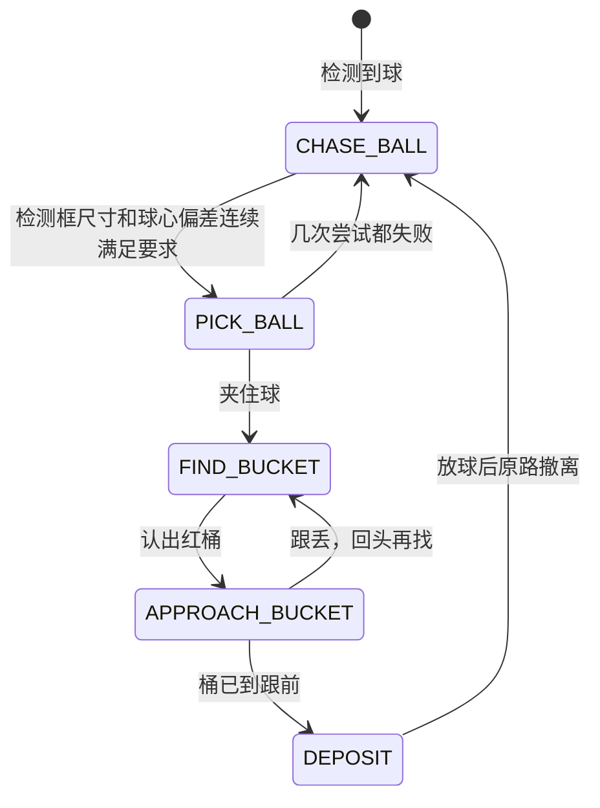

# 网球机器人上手指南

这份指南面向拿到小车硬件之后要动手做开发的人。内容按实际动手的顺序排列：先认识硬件，再准备开发环境，然后编译系统、制作 SD 卡、上电启动，最后让小车真正跑完一次"看到球、开过去、抓起来、放进桶里"的完整过程。每一步都给出可以照抄的命令和判断成功的方法。

这套硬件有 RK3588 和 SG2002 两条路线，两条路线各自配套底盘和机械臂，因此编译、写卡、启动方式都不一样。凡是不同的地方都分开写清楚，相同的部分合并说明。

## 1. 认识这套硬件

动手之前先弄清楚机器人由哪些部分组成、两块主控板各自是什么、以及程序要操作哪些设备。这一节的内容决定了后面每一步该用哪条命令。

### 1.1 机器人本体的组成

两条路线各自配套一套底盘和机械臂，不是同一台车换主控板。

RK3588 路线是三轮全向底盘小车。三个轮子和机械臂的六个关节挂在同一条 Feetech 总线上：轮子是 ID 7、8、9，机械臂是 ID 1～6，其中 ID 6 是夹爪。视觉用普通的 USB 摄像头（UVC 协议），另有一个红色的桶用来投放网球。

SG2002 路线是四轮差速小车。左右两侧各由一个编码电机驱动，底盘控制器是 ESP32-C3，电机驱动是 DRV8833 双路 H 桥，供电是锂电池加降压板；机械臂是 ZP10D 舵机臂；视觉同样用 USB 摄像头。底盘和机械臂各占一个串口，ESP32-C3 上跑的是自研固件，通过 UART 协议接收主控板发来的速度和方向指令，帧格式是 `[0xAA] [0x55] [CMD] [LEN] [PAYLOAD] [CHK]`，校验字取 `CMD ^ LEN ^ PAYLOAD` 的逐字节异或，协议测试见 `chenlongos/AKA-00` 的 `tests/test_uart.py`。

两条路线用同一个 YOLOv8n 网球模型的权重，导出成各自的格式，除此之外没有共用部件。两块主控板都跑 StarryOS，用户态程序根据摄像头画面决定底盘怎么走、机械臂什么时候动。

### 1.2 两条平台路线

两块主控板的算力、模型格式和用户态程序语言都不同，选择哪一块取决于你对算力和成本的要求。下表把主要差别列在一起，便于对照。

| 对比项 | RK3588 路线 | SG2002 路线 |
| --- | --- | --- |
| 主控板 | Orange Pi 5 Plus | 荔枝派 Nano（Sipeed LicheeRV Nano）或 AKA-00 车板 |
| 芯片架构 | ARM64，8 核（4×A76 + 4×A55） | RISC-V 双核 C906（1 GHz 大核 + 700 MHz 小核） |
| AI 加速 | NPU，6 TOPS，三核 | TPU，INT8，支持 BF16 |
| 图像硬件加速 | RGA 缩放、JPU 硬解 JPEG | 无，图像处理全部走 CPU |
| 模型格式 | RKNN（用 rknn-toolkit2 转换） | cvimodel（用 CVITEK TPU-MLIR 转换） |
| 推理运行时 | librknnrt.so | libcviruntime / libcvikernel |
| 用户态程序 | C++ 写的 `tennis`，构建脚本在 `apps/starry/aka-rk3588/`，仓库只存预编译产物 | Rust 写的 `akars`，代码不在本仓库 |
| 系统库 | glibc | musl |
| 联网方式 | 无板载无线，靠有线网络 | 板载 AIC8800DC WiFi，可连热点也可自己开热点 |
| 定位 | 算力充足，适合跑完整自主流程 | 成本低、功耗低，适合 RISC-V 生态验证 |

两条路线的差别会一直贯穿到后面的编译和部署：RK3588 的程序用 glibc 工具链编译，SG2002 的用 musl 工具链交叉编译，两者不能混用——用错了会在板子上报缺少 `GLIBC_2.34` 之类的错误。

还有一项能力只有 SG2002 侧有：WiFi 联网加上浏览器遥控。RK3588 没有板载无线网卡，所以"手机连上小车看画面、直接开"这条链路是 SG2002 独有的。

### 1.3 程序要操作的设备

用户态程序不直接操作硬件寄存器，而是通过设备文件读写。写程序和排查问题时对不上设备名是最常见的原因，所以先把两块板上实际存在的设备名记下来。

| 用途 | RK3588 | SG2002 |
| --- | --- | --- |
| 调试串口 | `/dev/ttyUSB0`，波特率 1500000 | `/dev/ttyUSB0`，波特率 115200 |
| 底盘驱动 | Feetech 总线 ID 7、8、9，设备名写 `auto` | `/dev/ttyS3` |
| 机械臂舵机 | Feetech 总线 ID 1～6，设备名写 `auto` | `/dev/ttyS2` |
| 摄像头 | UVC 摄像头，USB 接口 | `/dev/cvi-usb-camera0`，USB 接口 |

RK3588 的底盘和机械臂挂在同一条 Feetech 总线上，所以程序里这两个设备名都写 `auto`：Linux 下解析到 `/dev/ttyACM0`，StarryOS 下走 userspace libusb。查总线上的电机用 `./build/tennis test-feetech auto scan`，正常会列出 1 到 9 号。

`akars` 给这三个设备都设了默认值（`--camera /dev/cvi-usb-camera0`、`--motor /dev/ttyS3`、`--arm /dev/ttyS2`），接线和默认一致时不用写。这块板子的调试控制台占的是 `ttyS0`，接外设时避开它。

## 2. 准备开发环境

有两种准备方式，推荐用容器，因为 SG2002 需要的 RISC-V 交叉编译工具链在普通电脑上通常没有。不管你用哪种方式，最后都要能跑通一次 QEMU 启动，才算环境真的可用。

### 2.1 用容器

仓库提供了官方容器镜像，里面是 Ubuntu 24.04 加 Rust 工具链加 riscv64 musl 交叉编译器，直接挂载仓库目录就能用。在仓库根目录执行：

```bash
docker pull ghcr.io/rcore-os/tgoskits-container:latest
docker run --rm -it -v "$PWD":/workspace -w /workspace \
  ghcr.io/rcore-os/tgoskits-container:latest
```

镜像也可以自己构建：`docker build -t tgoskits-base:local -f container/Dockerfile .`。进入容器后，本文所有 `cargo starry` 命令都可以直接使用。容器把仓库目录挂载到了 `/workspace`，你在容器里编译产生的文件在宿主机上同样能看到。

### 2.2 在本机装工具

不想用容器的话，需要自己装 Rust 工具链和 QEMU。仓库用 `rust-toolchain.toml` 锁定了 nightly 版本，只要用 rustup 进入仓库目录就会自动装好。Debian 或 Ubuntu 上还需要下面这些系统包：

```bash
sudo apt install qemu-system-arm qemu-system-riscv64 qemu-system-x86 \
  gcc-aarch64-linux-gnu gcc-riscv64-linux-gnu cargo-binutils u-boot-tools
rustup show
```

其中 `u-boot-tools` 提供 `mkimage` 命令，后面校验 SG2002 内核镜像时必须用到。要在本机编 SG2002 的内核，还需要额外准备 riscv64-linux-musl 交叉编译器（`riscv64-linux-musl-cross`，或玄铁 V3.4.0 工具链），并确保它的 gcc 在 `PATH` 里。这几样凑不齐就直接用容器，不要在本机上硬凑。

### 2.3 先跑一次 QEMU 确认环境可用

不需要任何硬件就能验证环境是否装对。生成 rootfs 再启动一次 QEMU：

```bash
cargo starry rootfs --arch aarch64
cargo starry qemu --arch aarch64
```

串口窗口里出现 StarryOS 的命令行提示符，就说明工具链和 QEMU 都没问题。如果这一步就失败，问题出在开发机上，和板子无关，先解决环境再往下走。

## 3. 编译内核和用户程序

需要编译两样东西：StarryOS 内核，和跑在内核上的用户态程序。内核由 `cargo starry` 命令负责，用户态程序各有各的编译方式，不在内核构建流程里。

### 3.1 编译 StarryOS 内核

内核用板卡配置文件来区分平台，配置文件放在 `os/StarryOS/configs/board/` 下。RK3588 用 `orangepi-5-plus.toml`，SG2002 根据板子形态选一个：裸板用 `licheerv-nano-sg2002.toml`，带 WiFi 的版本用 `licheerv-nano-sg2002-wifi.toml`，AKA-00 车板用 `aka-00-sg2002.toml`。

```bash
# 先写入板卡配置（会持久化一份到 tmp/axbuild 下）
cargo starry defconfig licheerv-nano-sg2002

# 再编译
cargo starry build

# 或者一步到位，直接指定配置文件（推荐）
cargo starry build -c os/StarryOS/configs/board/aka-00-sg2002.toml
```

在容器里编译 SG2002 内核的完整命令是这样，注意 `-c` 不能省：

```bash
docker run --rm -v "$PWD":/work -w /work \
  ghcr.io/rcore-os/tgoskits-container:latest bash -lc \
  'cargo xtask starry build -c os/StarryOS/configs/board/aka-00-sg2002.toml'
```

SG2002 的产物在 `target/riscv64gc-unknown-none-elf/release/starryos.uimg`，同时需要一份设备树，在 `os/StarryOS/configs/board/` 下同名，比如 `licheerv-nano-sg2002.dtb` 或 `aka-00-sg2002.dtb`。功能项在板卡配置文件里选：三份 SG2002 配置都带 `ax-driver/serial` 和 `ax-driver/cv181x-sdhci`；`ax-driver/aic8800-wifi` 在 `licheerv-nano-sg2002-wifi.toml` 和 `aka-00-sg2002.toml` 里；决定摄像头能不能用的 `starry-kernel/sg2002-cvi-usb-camera` 和 `ax-driver/sg2002-dwc2` 只有 `aka-00-sg2002.toml` 带。这份指南里的推理和遥控都要用摄像头，所以车板一律编译 `aka-00-sg2002.toml`。

SG2002 的产物编译完必须校验一次加载地址：

```bash
mkimage -l target/riscv64gc-unknown-none-elf/release/starryos.uimg
```

输出里的 `Load Address` 和 `Entry Point` 必须都是 `0x80200000`。如果这里是 0，说明打包模板 `.its` 没有被正确解析，这个镜像烧进去 `bootm` 会跳到地址 0 直接崩溃。

### 3.2 编译用户态程序

两块平台的用户态程序来源完全不同，这一步最容易出错。

RK3588 上的程序是 `apps/starry/aka-rk3588/` 这个应用。仓库不重复保存源码，也不要求你在本地交叉编译：它保留了一份已经在 Orange Pi 的 Jammy 系统上用 GCC 11 原生编译并实机验证过的 AArch64 程序 `prebuilt/aarch64/build/tennis`，其余的运行文件由 `prepare-package.sh` 从固定提交的源码归档里取。这个程序最高依赖 `GLIBC_2.34`，只能跑在 glibc 系统上，这也是 4.2 里 RK3588 直接复用 Jammy 根文件系统的原因。

要生成部署包，在开发主机上执行：

```bash
cd apps/starry/aka-rk3588
./prepare-package.sh
```

脚本会下载 `source.env` 里固定提交号的源码归档、校验 SHA256，再用仓库里的预编译程序替换归档中的构建产物，最后在 `target/aka-rk3588/aka-rk3588.tar.gz` 生成部署包。要把源码版本换掉时，`source.env` 里的提交号和二进制 SHA256 必须一起更新，不要用分支名或 `HEAD` 当输入。

SG2002 上先跑仓库自带的最小推理校验，代码就在 `apps/starry/aka00-tennis-yolo/`，不用另外下载。它依赖玄铁 V3.4.0 musl 工具链和 Milk-V 的 SG200x TPU SDK，用脚本一次装好：

```bash
apps/starry/aka00-tennis-yolo/scripts/setup.sh
apps/starry/aka00-tennis-yolo/build-validator.sh
```

第一步会下载工具链和 TPU SDK 并校验哈希，联网不方便时可以用 `--toolchain-archive` 和 `--sdk-archive` 指定本地压缩包。第二步的产物在 `apps/starry/aka00-tennis-yolo/install/sg2002_riscv64_musl/akars_tennis/`，`install/` 是生成物，不进仓库。

需要完整自主捡球程序时，再用外部仓库 `BattiestStone4/akars`，它是一个独立的 Rust 项目，代码不在本仓库里：

```bash
git clone https://github.com/BattiestStone4/akars
cd akars
scripts/setup.sh    # 装 Rust target、初始化 TPU SDK 子模块、下载并校验玄铁 V3.4.0 musl 工具链
scripts/build.sh
```

同名的 C++ 版本在 `pengzechen/aka-sg2002`，Rust 版的推理、电机、机械臂和状态机都是照着它移植的，对照调试时有用。

这里有一个必须注意的地方：akars 的 `.cargo/config.toml` 默认指定的动态加载器是 `ld-musl-riscv64v0p7_xthead.so.1`，而板子的 rootfs 里只有标准的加载器。如果直接用它默认的配置编译，程序在板子上会因为找不到加载器而起不来。解决办法是把加载器改成标准路径后重新编译：

```bash
RUSTFLAGS="-C link-arg=-Wl,--dynamic-linker=/lib/ld-musl-riscv64.so.1" \
  cargo build --release --target riscv64gc-unknown-linux-musl
```

akars 在板子上运行还需要运行时库：`libcviruntime.so`、`libcvikernel.so`、`libstdc++.so.6`，以及 musl 程序基本都会用到的 `libgcc_s.so.1`，通过 `LD_LIBRARY_PATH` 能找到即可。`aka00-tennis-yolo` 的构建脚本已经把这些库一起收进产物目录的 `lib/`，可以直接照抄它的做法。

### 3.3 改了配置文件为什么没生效

这是编译阶段出现频率最高的问题，值得单独说清楚。`cargo starry build` 不带 `-c` 参数时，用的不是 `configs/board/` 下的模板文件，而是之前 `defconfig` 复制到 `tmp/axbuild/config/` 下的一份副本。所以你改了 board toml 里的内容，如果不带 `-c` 重新编译，生效的还是旧副本，看起来就像"改了没用"。

记住一条：**改过 board toml 之后，编译时一定带上 `-c` 参数**。

## 4. 制作启动 SD 卡

这一步是让板子能起系统、能跑程序。两块板要做的事完全不同：RK3588 的 eMMC 里已经烧好了 Orange Pi 官方系统，要做的是把程序部署进这套系统；SG2002 则要从镜像开始自己做启动卡。两者的写盘风险也不一样，先看通用规则，再看各自的操作。

### 4.1 写卡前的通用规则

写卡操作不可逆，写错了要重刷整卡，所以下面几条必须遵守。

第一条，任何写入之后都要执行 `sync`，等数据真正落盘再拔卡或断电。跳过 `sync` 直接断电会损坏 ext4 分区，表现是下次开机 rootfs 挂载失败或者文件莫名其妙消失，严重时开不了机只能重刷整卡。

第二条，优先往 FAT 分区写文件。FAT 分区结构简单，断电不容易坏。

第三条，每次换内核之前，先把旧的 `/starryos.uimg` 改名留一份备份，万一新内核起不来还能换回去。

第四条，手头保留一份能正常启动的底包镜像。卡写坏了直接重刷整卡，不要在已经损坏的卡上继续叠写，那样只会越写越乱。

还有一条容易被忽略的限制：**StarryOS 的 ext4 实现只支持 ext4 特性集里的一个子集**，分区带上了它不认识的特性，挂载时会直接被拒绝。清单在 `fs/rsext4/src/superblock/features.rs` 的 `SUPPORTED_RO_COMPAT_FEATURES` 里。较新的 `mke2fs`（1.47 起）默认会打开 `orphan_file`，这个特性不在清单内，所以自己新建分区时要显式关掉：

```bash
sudo mkfs.ext4 -b 4096 -O ^orphan_file /dev/sdXY
```

这里的 `-b 4096` 指的是**文件系统块大小**，不是分区起始偏移，两件事不要混。块大小在 1024 到 4096 之间都能挂上，写 4096 是为了和仓库里现成的镜像保持一致。

拿到一个别人做好的 ext4 分区（比如发行版给的 rootfs），先查它的块大小和特性，再决定要不要重建：

```bash
dumpe2fs -h /dev/sdXY | grep -E '^Block size|^Filesystem features'
```

块大小落在 1024 到 4096 之间、特性里没有 `orphan_file`，就可以直接用，不必重建。只有查出来不合格，才需要新建一个再把数据拷进去。

### 4.2 RK3588 部署应用

RK3588 用 eMMC 存储，rootfs 直接用 Orange Pi 官方的 Ubuntu 22.04（Jammy）系统，不另外做一个最小系统。板子在 Linux 下本来就能跑，出问题时可以先用 Linux 对照一次；StarryOS 启动后复用同一套已经部署好的根文件系统，应用程序不用维护两套。

这个选择不是可选的。用户态程序最高依赖 `GLIBC_2.34`，只能跑在 Jammy 这类 glibc 系统上，放在只含 musl 的 Alpine 或自建的精简 rootfs 里会因为找不到 glibc 而起不来。

先在 Linux 下把部署包解压到板子的固定目录：

```text
/home/orangepi/robot/aka-rk3588
```

装好之后目录不要再搬动。程序从这个路径启动，也按相对路径找 `config/`、`models/` 和 `lib/`。如果这台机器人已经做过实机校准，先用备份覆盖回来的方式保留它自己的 `config/lekiwi_calibration.json` 和 `config/lekiwi_pick_config.txt`——这两份文件是每台车各自调出来的，不要被部署包里的默认值盖掉。

板子已经能跑 Linux 时，最省事的做法是先在 Linux 下把程序调到能跑，再切到 StarryOS 上验证内核。改一次内核跑一次的场景不必每次都重新部署应用，直接用串口把内核送进 U-Boot 更快（`quick-start` 是仓库保留的兼容入口，仓库的快速开始文档里标注它后续会废弃）：

```bash
cargo starry quick-start orangepi-5-plus build
cargo starry quick-start orangepi-5-plus run --serial /dev/ttyUSB0
```

### 4.3 SG2002 写卡

SG2002 的卡上分两个区：第一个区是 FAT，放 `fip.bin`、设备树和旧内核；第二个区是 ext4，放 rootfs 和 StarryOS 内核。要换的是第二个区里的 `/starryos.uimg`，整个过程在开发机的容器里对镜像文件做，做完再整卡写入 SD 卡。

```bash
docker run --rm --privileged -v "$PWD/deploy":/deploy -w /deploy \
  ghcr.io/rcore-os/tgoskits-container:latest bash -lc '
    set -e
    LOOP=$(losetup -f --show -P sdcard_akars.img); partprobe $LOOP; sleep 1
    mount ${LOOP}p2 /mnt
    cp /mnt/starryos.uimg /mnt/starryos.uimg.prev-$(date +%m%d)   # 先备份旧的
    cp starryos.uimg /mnt/starryos.uimg                            # 换内核
    cp akars /mnt/root/akars; cp akars /mnt/usr/local/bin/akars
    chmod +x /mnt/root/akars /mnt/usr/local/bin/akars
    # 补上 musl 程序需要的两个库
    [ -e /mnt/lib/libgcc_s.so.1 ] || cp /opt/riscv64-linux-musl-cross/riscv64-linux-musl/lib/libgcc_s.so.1 /mnt/lib/
    [ -e /mnt/lib/libc.so ] || ln -s ld-musl-riscv64.so.1 /mnt/lib/libc.so
    sync; md5sum /mnt/starryos.uimg starryos.uimg
    umount /mnt; losetup -d $LOOP
  '
```

如果还要跑 6.3 里的固定图片推理校验，把 `apps/starry/aka00-tennis-yolo/install/sg2002_riscv64_musl/akars_tennis/` 整个目录复制到第二个分区根下的 `/akars_tennis`，`lib/`、`model/`、`validation/` 三份都要在，复制完同样要 `sync`。

上面的复制走的是开发机上宿主机的 ext4 驱动。仓库在自编译 rootfs 的实践里记过一条经验：宿主机写进去的文件，StarryOS 侧读回时可能因为元数据校验和对不上而报 I/O 错误，把 `metadata_csum` 关掉能避开，`scripts/prepare-selfhost-rootfs.sh` 建镜像时就是这么做的，细节在 `os/StarryOS/docs/starryos-self-compilation.md`。换内核是整文件覆盖，风险比逐块改写小，但真遇到读回报错，先往这个方向查。

如果 loop 分区节点没建好，可以改用 offset 直接挂载第二个分区（起于 32769 扇区，即 16777728 字节）：

```bash
mount -o loop,offset=16777728 sdcard_akars.img /mnt
```

设备树（`aka-00-sg2002.dtb`，在 `os/StarryOS/configs/board/` 下，`aka-00-sg2002-uboot.toml` 里的 `dtb_file` 指的就是它）要放进第一个 FAT 分区，引导时要用。准备完成后整卡写入 SD 卡：

```bash
# macOS
diskutil list                      # 先确认设备号，别烧错盘
diskutil unmountDisk /dev/diskN
sudo dd if=deploy/sdcard_akars.img of=/dev/rdiskN bs=4m
diskutil eject /dev/diskN

# Linux
lsblk                              # 找 SD 卡，如 /dev/sdX
sudo dd if=deploy/sdcard_akars.img of=/dev/sdX bs=4M conv=fsync
```

底包镜像的来源有三条路：用荔枝派官方的镜像，用 `chenlongos/AKA-00` 仓库 releases 里的 `sd_licheervnano_with_AKA00_v0_*.img.xz`（那是一个跑厂商 Linux 的镜像，适合做性能对照），或者用已经配好的 `sdcard_akars.img`。前面两个的 `fip.bin` 需要从荔枝派官方镜像里提取。

第一个分区里的 `fip.bin` **不要换**。这个文件和板型是绑死的，里面是 OpenSBI 加 SPL，负责初始化 DDR 和 SDIO 物理层，包含采样延迟参数，换错板型的 fip 会导致无线大包传输失败甚至启动异常。荔枝派 Nano 的 fip 是 440832 字节（sha1 `5b4d1faf…`），AKA-00 车板是 509440 字节。

判断手上这份 `fip.bin` 属于哪块板，查它的大小和 sha1：

```bash
stat -c %s fip.bin && sha1sum fip.bin
```

**尺寸相同不等于可以通用**：509440 字节这一档不止一块板在用，最终要靠 sha1 区分。换 fip 之前先比 sha1，并且确认它和提取它的那份镜像对得上。

这块板只能手动插拔 SD 卡刷写，没有网络刷机。仓库里 `cargo starry board` 那套远程开发板服务是给 OrangePi 这类板子用的，荔枝派 Nano 不走这条路。

### 4.4 把卡装进机器人

车板的 SD 卡位置比较隐蔽，换卡需要拆机。先把顶部盖板取下——用内六角螺丝刀拧下四颗螺丝，注意**先断开机械臂与主控之间的连线**，再拆盖板。盖板取下后会看到一个 Type-C 转 USB-A 的转接头，把它拔掉。SD 卡槽就在转接头附近，插拔稍微有点费力。

## 5. 上电启动

两块板的启动过程不一样。RK3588 由 U-Boot 自动加载内核，SG2002 每次都要手动敲命令，这一点要有心理准备。

### 5.1 RK3588 启动

接好串口线（波特率 1500000），上电后 U-Boot 会自动从网络加载 StarryOS 内核和设备树，然后挂载 eMMC 上的 rootfs 进入系统，不需要人工干预。完整链路是：

```
上电 → U-Boot → TFTP 加载 StarryOS 内核
              → 加载设备树 orangepi-5-plus.dtb
              → 挂载 eMMC rootfs（mmcblk0p2，ext4，即 Jammy 根文件系统）
              → 进入 shell，由使用者启动 /home/orangepi/robot/aka-rk3588 下的程序
```

看到 StarryOS 的命令行提示符就说明启动成功。想确认应用那一层也通了，先跑一次只推理不动作的检查，具体命令见 6.2。

### 5.2 SG2002 启动

SG2002 的 U-Boot 默认会去加载第一个分区里的旧内核 `boot.sd`（一个跑厂商 Linux 5.10 的镜像），那不是 StarryOS，直接回车走自动启动就会进旧系统。所以上电后要在倒计时结束前按键打断自动启动，进入 U-Boot 命令行手动引导：

```bash
fatload  mmc 0:1 0x81000000 aka-00-sg2002.dtb
ext4load mmc 0:2 0x82200000 /starryos.uimg
bootm    0x82200000 - 0x81000000
```

这三条命令里的地址不能改。内核镜像必须先加载到 `0x82200000`，再由 `bootm` 解包到 `0x80200000` 运行；如果直接把镜像加载到 `0x80200000`，解包时会覆盖掉自己，这是最常见的引导失败原因。设备树加载到 `0x81000000`。

如果第一个分区里没有放设备树，可以改用 U-Boot 自带的设备树：

```bash
bootm 0x82200000 - $fdtcontroladdr
```

另一个变通做法是把内核和设备树都放进 FAT 分区，从第一个分区引导，这样地址也不一样：

```bash
load mmc 0:1 0x82200000 starryos.uimg
load mmc 0:1 0x83000000 aka-00-sg2002.dtb
bootm 0x82200000 - 0x83000000
```

两条路径里的设备树文件名要和手上这块板对应，车板是 `aka-00-sg2002.dtb`，荔枝派 Nano 是 `licheerv-nano-sg2002.dtb`，都在 `os/StarryOS/configs/board/` 下。

这块板子没有保存环境变量的地方，所以**每次重启都要重新敲这几条命令**。"重启之后又回到旧系统了"不是故障，是这条默认链路本身的行为。

启动成功的标志是串口出现 shell 提示符 `root@starry:/root #`——这个串来自内核内置的 `init.sh`（`os/StarryOS/starryos/src/init.sh`，里面的 `PS1` 写成 `${USER}@${HOSTNAME}:${PWD} # `），各块板子都一样。板级测试就是靠匹配它的前缀 `root@starry:` 来判断系统起来了，车板的 `os/StarryOS/configs/board/aka-00-sg2002-board.toml` 里的 `shell_prefix` 写的就是这个前缀。

### 5.3 登录、配网与传文件

系统启动后可以通过串口或者 SSH 登录。SSH 服务需要手动拉起：

```bash
dropbear -R -p22
```

StarryOS 上 SSH 的默认密码是 `starry`。板子上没有装 scp 和 sftp 服务，传文件要用管道的方式：

```bash
cat akars | ssh root@<板子IP> 'cat > /root/akars && chmod +x /root/akars && sync'
```

写完记得 sync。板子根目录下有一个 `wifi_switch` 程序用来配网：

```bash
wifi_switch sta <SSID> <密码>   # 连到 WPA2 热点
wifi_switch ap <SSID>           # 把网卡设成热点
```

SG2002 的 IP 地址取决于它连的是哪个热点（比如 iPhone 热点通常是 `172.20.10.x`），昨天能连今天连不上，首先要怀疑 IP 变了而不是系统坏了。串口是最后的兜底手段，SSH 连不上时用串口进去执行 `ip addr` 查地址。如果 SSH 报 host key 冲突，先执行 `ssh-keygen -R <板子IP>` 清掉旧记录。

## 6. 跑通抓球闭环

这是整个项目的核心目标：让小车自己完成一次完整的捡球过程。先看 RK3588 上的完整流程有哪几个阶段，再看两块板各自怎么启动。

### 6.1 闭环的几个阶段

RK3588 上的 `tennis` 实现了完整的状态机，依次经过四个阶段，然后回到第一个继续找下一颗球。每个阶段之间靠摄像头看到的画面来切换，`config/lekiwi_pick_config.txt` 里的参数决定多近算"够近"、偏离多少算"对准"。



各阶段的职责是：`CHASE_BALL` 从画面里挑出最合适的检测框，按预测尺寸决定前进速度、按球心偏移决定左右轮差速，距离过近时先后退，长时间没有进展会做一次视觉重新对准；`PICK_BALL` 驱动机械臂走一遍 `HOME → 打开夹爪 → 安全接近 → 夹球姿态 → 闭合并检测接触 → 沿原路径抬升 → 平滑收臂`，失败会带偏移重试，几次都不成则退回 `CHASE_BALL`；`FIND_BUCKET` 原地转动搜索红色的桶；`APPROACH_BUCKET` 按桶在画面里的位置和 `metric=sqrt(w*h)` 算出的尺寸靠近，只在桶心落在容差内时才允许前进；`DEPOSIT` 是放球那一段，分两段 S 曲线越过桶沿、下降释放、再原路撤离，日志里这一整段也写成 `PUT_BALL`。

程序按 `AKA_STATE_LOG_INTERVAL_MS` 的间隔打印状态日志，这是判断状态机走到哪一步最直接的依据。抓球是否成功不靠猜：夹爪闭合过程中出现 `overload=0x20` 就算夹住了东西，日志里是 `slow move stopped: gripper overload while closing`。

SG2002 上的 `akars` 目前实现的是**追球和抓取两个阶段**，还没有做找桶和投放。它的抓取触发条件是目标面积占比达到 0.40 且已经对准，连续确认 5 帧后执行抓取；面积超过 0.55 时先后退一小段再抓，避免冲过目标。没有检测到球时原地慢速旋转搜索。

### 6.2 RK3588 上跑完整流程

程序装在 `/home/orangepi/robot/aka-rk3588/` 下，所有命令都在这个目录里执行。参数从 `config/lekiwi_pick_config.txt` 读，画面按 640×480 处理；速度和偏差这些阈值、以及接线变化，都在这个文件里改，不用重新编译。

先做三项不动作的检查。它们不驱动车轮，机械臂也不动作，是最快的"板子和接线到底通不通"判据：

```bash
cd /home/orangepi/robot/aka-rk3588
./build/tennis test-new-arm auto config-check   # 抓放轨迹是否在配置的安全限位内
./build/tennis test-feetech auto scan           # 总线上有哪些电机，应列出 1 到 9
./build/tennis test-new-arm auto calib-check    # 校准文件是否可用
```

再单独确认视觉链路。这两条命令只启动摄像头和识别，同样不初始化底盘和机械臂：

```bash
./run_vision_once.sh                            # 采集一帧并推理，输出 capture.jpg 和 result.jpg
./build/tennis test-yolo models/tennis.rknn 0   # 中间过程打印检测结果
```

两项都通过之后，按危险程度从低到高往上走，每一步单独排一类问题：

```bash
./run_lekiwi_test.sh        # 架空轮子，只验证追球和停车，确认后退出，不进抓球
./run_bucket_place_demo.sh  # 只做一次找桶和放球，不找球不抓球
./run_lekiwi_full.sh        # 完整闭环，会持续找下一颗球，Ctrl-C 停止
```

最后一步会真的驱动车轮和机械臂，必须在有人看管、场地空旷的条件下执行，手边随时能按 `Ctrl-C` 停车。

仓库里还有一条自动测试通道，用来在不改板子的前提下确认这套程序在 StarryOS 上跑得通：

```bash
cargo xtask starry app board -t aka-rk3588 -b OrangePi-5-Plus-robot
```

这个命令按 `apps/starry/aka-rk3588/board-orangepi-5-plus.toml` 编译内核、连上板子、执行 `init.sh`，只跑一次摄像头采集和 RKNN 识别，不驱动车轮和机械臂。板端还没按 4.2 部署过应用时，它会以 `linux_deployment_required` 失败，这是部署问题不是内核问题。

### 6.3 SG2002 上跑自主捡球

SG2002 上有两条路径，先跑通仓库内的推理自检，再上完整的自主捡球。

第一步是仓库里的 `apps/starry/aka00-tennis-yolo`。它用三张固定图片跑一遍 TPU 推理并比对结果，不接摄像头也不需要机械臂，是最快的"板子到底能不能推理"判据。按 3.2 编译、按 4.3 部署到 `/akars_tennis` 之后，在板子上执行：

```bash
cd /akars_tennis && ./run.sh
```

跑通会看到 `AKARS_TENNIS_VALIDATE_PASS images=3`，随后是 `STARRY_AKA00_TENNIS_DETECT_OK`。这条路径也进了自动测试：`cargo xtask starry app board -t aka00-tennis-yolo -b AKA-00-SG2002`。推理链路确认无误之后再往下走。

第二步是 `akars`，也就是完整的自主捡球程序。它按 3.2 的方式交叉编译后传到板子上，提供四个子命令，对应从粗到细的验证层次，调试时按这个顺序逐层往上走最省事。

| 子命令 | 用途 |
| --- | --- |
| `akars <model.cvimodel>` | 默认行为，自主捡球：采集、推理、状态机、控制电机和机械臂 |
| `akars detect <model> <image>` | 单张图片推理，打印检测结果并输出画框后的图，不碰摄像头和电机 |
| `akars capture` | 抓取单帧存图，会先丢弃前若干帧等曝光和白平衡稳定 |
| `akars serve` | 浏览器遥控，见 6.4 |

从上往下依次跑通，就能把问题定位到具体是哪一层：模型对不对、摄像头通不通、遥控链路通不通。三个设备名都有默认值，只有接线和默认不一致时才需要在命令行上覆盖：

```bash
akars yolov8n_tennis_v2.cvimodel \
  --camera /dev/cvi-usb-camera0 --motor /dev/ttyS3 --arm /dev/ttyS2
```

akars 在开发机上也能编译运行：没有 TPU 时用桩函数替代，Web 部分加 `--mock` 参数，这样图像管线、状态机和网页都能在没有硬件的情况下先调通。这是它相对 C++ 版本的一个明显好处——改逻辑不必每次都上板。

### 6.4 SG2002 上用浏览器遥控

遥控模式适合先把小车开起来看看，也适合调试接线。启动后板子会开一个网页服务，手机连上板子的热点，用浏览器打开就能看到摄像头画面并操作底盘和机械臂：

```bash
akars serve --listen 0.0.0.0:8080
# 设备名同 6.3，都有默认值，接线不同时再加 --motor / --arm / --camera
# 开发机上无硬件演示：加 --mock
```

网页前端是直接编译进程序的单个 HTML，不需要单独的前端构建步骤。后端基于 axum 加 tokio 多线程运行时，对外提供的接口包括：取页面、查状态、查控制信息、驱动底盘、操作机械臂、重连串口、取一帧画面。摄像头画面走的是前端轮询取单帧，不是长连接推送。

摄像头默认是关闭的，需要在网页上点"开始"才会拉取画面。这一点在排查"网页很卡"时很重要：页面每秒自动刷新的状态请求很小，如果没点开始也很卡，那就不是摄像头的问题，要去看网络带宽。

### 6.5 判断跑通的标准

每一步都有明确的标志，不要凭感觉判断。程序跑起来会输出固定的字符串，看到它才算通过：

| 平台 | 验证内容 | 看到的输出 |
| --- | --- | --- |
| RK3588 | 板级自动测试跑通 | `AKA_RK3588_DEMO_PASSED`；板端还没部署应用时是 `AKA_RK3588_DEMO_FAILED reason=linux_deployment_required` |
| RK3588 | 电机总线连通 | `./build/tennis test-feetech auto scan` 列出 1 到 9 号 |
| RK3588 | 摄像头和识别 | `./run_vision_once.sh` 产出 `capture.jpg` 和 `result.jpg` |
| RK3588 | 追球和停车 | `./run_lekiwi_test.sh` 能追到球并停下，打印 `[STATE] LEKIWI_CHASE` 一类的状态行 |
| RK3588 | 完整闭环跑完一轮 | `./run_lekiwi_full.sh` 的日志里依次出现 `[GAME] -> PICK_BALL`、`[GAME] -> FIND_BUCKET`、`[GAME] PUT_BALL done -> CHASE_BALL` |
| RK3588 | 追球自动测试 | 在板上执行 `./run_robot_ci_once.sh 15.0`，末尾是 `[ROBOT_CI] RESULT=PASS` |
| SG2002 | 固定图片 TPU 推理 | `AKARS_TENNIS_VALIDATE_PASS images=3` |
| SG2002 | 板级自动测试 | `STARRY_AKA00_TENNIS_DETECT_OK` |
| SG2002 | 浏览器遥控 | 网页能打开，底盘和机械臂响应操作 |
| SG2002 | 自主捡球 | 小车能自行完成一次追球和抓取 |

akars 运行时每帧还会打印分段耗时，用来定位慢在哪一步：

```
[time] capture=.. pre=..(dec=.. rsz=..) fwd=.. post=.. ms
[FPS]  <瞬时> avg: <平均> (<帧耗时>ms)
```

其中 `capture` 是采集，`pre` 是预处理（`dec` 是 JPEG 解码、`rsz` 是缩放），`fwd` 是 TPU 前向计算，`post` 是后处理。

## 7. 做性能优化并贡献回主线

如果你发现程序跑得不够快，想改进之后把成果提交回仓库，这一节说明怎么做。顺序很重要：先量、再改、后提交，跳过任何一步都容易白干。

### 7.1 先量出基线

改动之前必须先有一个数字，否则无法证明你的改动有效。

RK3588 的程序自带计时，完整闭环跑起来时每帧打印两行：

```
[PERF] frame_ms avg=.. p50=.. p95=.. max=..
[PERF] stage_ms input=.. run=.. output=.. post=.. release=.. control=.. unaccounted=..
```

`frame_ms` 是端到端耗时，看 `p50` 和 `p95` 比看 `avg` 更有意义；`stage_ms` 把这段时间拆到各个阶段上，`input` 是输入准备和缩放，`run` 是 NPU 前向计算，`output` 是取回输出，`unaccounted` 是没归到任何阶段的部分——这个值偏大说明计时点本身有遗漏。追球自动测试另外会打印一行 `[ROBOT_CI] PERF_SUMMARY`，把一个测试窗口内的统计汇总起来，适合前后对比。

SG2002 上则要关注摄像头采集帧率和每帧的分段耗时，`akars` 的 `[FPS]` 与 `[time]` 两行日志就是这两个数。`aka00-tennis-yolo` 的 `AKARS_TENNIS_BENCH_RESULT` 还会给出 `resize_us_avg`、`forward_us_avg`、`postprocess_us_avg`、`total_us_avg` 等分段均值：给 `akars-tennis-validator` 加上 `--warmup 1 --repeat 5` 就会输出这一行，预热那一轮不计入统计，而且每一轮都会重新和预期结果比对，避免用错误的检测结果换来更好看的耗时。

量测要在同样的条件下重复多次。场地光线、机器人的起始位置、热点距离都会影响结果，只测一次的数字不能用来说明问题。一个已知的参考量级：RK3588 上完整链路的端到端延迟在 Linux 上约 19 ms，在 StarryOS 上约 156 ms，差距集中在图像预处理和 NPU 输出两个环节。

### 7.2 找到瓶颈在哪一层

性能问题可能出在内核、驱动、用户态程序或者硬件本身。用排除法确定层次比盲目改代码有效得多。判断方法是从上往下看：用户态程序的耗时占了多少？把用户态排除之后，驱动层的等待时间有多长？硬件本身的物理上限是多少？

把端到端延迟拆成几段来量，是最有效的排除手段，`[PERF] stage_ms` 那一行就是为这件事准备的。一次实测中，RK3588 上完整链路的 156 ms 拆开是 `input` 69.65 ms、`output` 54.99 ms、`run` 28.28 ms，前两项加起来占了总延迟的 80%：`input` 慢是因为当时 RGA 硬件加速还没打通，缩放回退到 CPU 逐行拷贝；`output` 慢是因为每次提交前后都做了全量缓存刷新。

只看 `run` 会以为"NPU 慢"，拆开才发现真正的开销在数据搬运的路径上，而搬运路径是软件可以改的，换更快的模型反而没有用。这条路径上的硬件加速驱动后来已经合进主线，重新量一次会得到不同的数字——这也说明性能结论有保质期，改完要重新量。

### 7.3 改代码要遵守的规矩

仓库对代码改动有固定的要求，这些要求是为了保证改动可以被验证和回溯。

编译和检查必须走仓库统一的入口，不能用原生的 `cargo build` 或 `cargo test` 直接跑。静态检查用 `cargo xtask clippy --package <包名>` 做单包检查，改完之后执行 `cargo fmt` 格式化。看到警告不要用 `allow` 属性压掉，要找到根本原因修掉。

修 bug 的流程有明确的顺序要求：先写一个能稳定复现这个 bug 的测试，确认它在当前代码上会失败；然后改代码；最后确认同一个测试通过。只做后面的验证不算数，因为无法证明你修的确实是那个问题。

### 7.4 提交 PR

改动完成并验证之后，提交到上游仓库的 `dev` 分支。提交信息的格式有固定要求：标题用英文，写成 `type(scope): 内容` 的形式，比如 `fix(axtask): ...`；正文用中文，说明要解决的问题、实际改了什么、为什么这么改。

提交之前尽量在本地把 CI 流程跑一遍，只有实板测试和自托管项可以跳过。另外两条注意事项：提交信息里不要加任何和 AI 助手相关的标记；推送代码和发布对外评论之前先和仓库维护者确认。

## 8. 故障速查

遇到问题先判断卡在哪一个阶段，再对照下表。三个阶段的排查思路完全不同：编译阶段的问题基本都在配置，启动阶段的问题看串口输出停在哪一步，运行阶段的问题多与设备名和网络有关。

### 8.1 编译阶段

编译阶段的问题基本都出在配置和工具链上，报错信息通常已经指明了缺什么，照下表对号入座即可。

| 现象 | 原因 | 处理 |
| --- | --- | --- |
| 改了 board toml 但行为没变 | 编译时没带 `-c`，用了旧副本 | 重新执行带 `-c` 的编译命令 |
| SG2002 只产出 bin 没有 uimg | 打包模板 `.its` 缺失 | 确认模板文件在同一目录，重新编译 |
| 应用在板子上报缺少 `GLIBC_2.34` | 用 musl 工具链编了 RK3588 程序 | 换用 glibc 的 aarch64 工具链 |
| akars 启动报找不到加载器 | 用了 xthead 加载器 | 按 3.2 改成标准加载器重新编译 |
| 本机编不了 riscv 目标 | 缺 musl 工具链或 C sysroot | 改用官方容器编译 |

### 8.2 写卡与启动阶段

这个阶段的问题要先看串口输出停在哪个环节，再判断是镜像本身、分区结构还是固件不匹配。串口完全没有输出和串口有输出但崩溃，是两类完全不同的故障。

| 现象 | 原因 | 处理 |
| --- | --- | --- |
| SG2002 引导后立刻崩溃，`EPC=0` | 内核镜像加载地址写成了 `0x80200000` | 必须先加载到 `0x82200000` |
| SG2002 重启后回到旧系统 | 自动启动走了第一个分区的旧内核 | 每次手动引导，见 5.2 |
| 串口输出乱码 | 波特率不对，或 fip 和板型不匹配 | 核对 115200 和 1500000，核对 fip 尺寸 |
| rootfs 挂载失败或文件丢失 | 写入后没 `sync` 就断电 | 重刷整卡，以后遵守 4.1 的规则 |
| rootfs 挂载被直接拒绝，日志说特性不支持 | 分区的 ext4 带了 StarryOS 不认识的特性，多半是 `orphan_file` | 按 4.1 的办法查特性；确实带上了就重建分区再拷数据 |
| 挂载 rootfs 找不到分区 | `bootargs` 里的 `root=` 没指对 | 检查内核命令行里的 rootfs 分区参数 |
| 系统完全没有任何输出 | SD 卡或固件问题 | 换一张确认可用的卡重刷 |

### 8.3 板上运行阶段

程序能起来但功能不对，多半是设备名、共享库或者网络这三类原因。程序自己的报错一般就说明了缺哪个文件或者打不开哪个设备，先照着报错查，不要急着怀疑硬件。

| 现象 | 原因 | 处理 |
| --- | --- | --- |
| RK3588 报找不到配置文件或模型 | 启动目录不对，`config/` 和 `models/` 是按相对路径找的 | 在应用根目录 `/home/orangepi/robot/aka-rk3588` 下启动 |
| RK3588 报电机无应答 | 总线设备名不对，或底盘和机械臂没接在同一条总线上 | 用 `./build/tennis test-feetech auto scan` 确认能列出 1 到 9 号 |
| RK3588 摄像头出不了帧 | 摄像头没被识别，或者没有出帧 | 用 `./run_vision_once.sh` 单独确认采集这一层 |
| SG2002 底盘或机械臂没反应 | 串口设备名和实际接线不一致 | 按 1.3 核对，用 `--motor` / `--arm` 覆盖默认值，避开控制台 `ttyS0` |
| SG2002 报找不到共享库 | 缺 musl 运行库 | 按 4.3 补进 `/lib` |
| SG2002 推理程序报错 | rootfs 里的模型或库缺失 | 检查 `libcviruntime.so`、`libcvikernel.so`、`libstdc++.so.6` |
| SSH 连不上 | IP 随热点变化，或 host key 变更 | 串口查地址，执行 `ssh-keygen -R` |
| WiFi 报 CRC 错误、大包传输失败 | fip 和板型不匹配 | 换回对应板型的 fip，见 4.3 |
| 网页能开但很卡 | 没点开始就卡说明瓶颈在网络上 | 按 6.4 分辨是画面还是状态请求造成的 |

问题无法定位时，把完整的串口日志和复现步骤一起提供，这是排查所需的最少信息。
