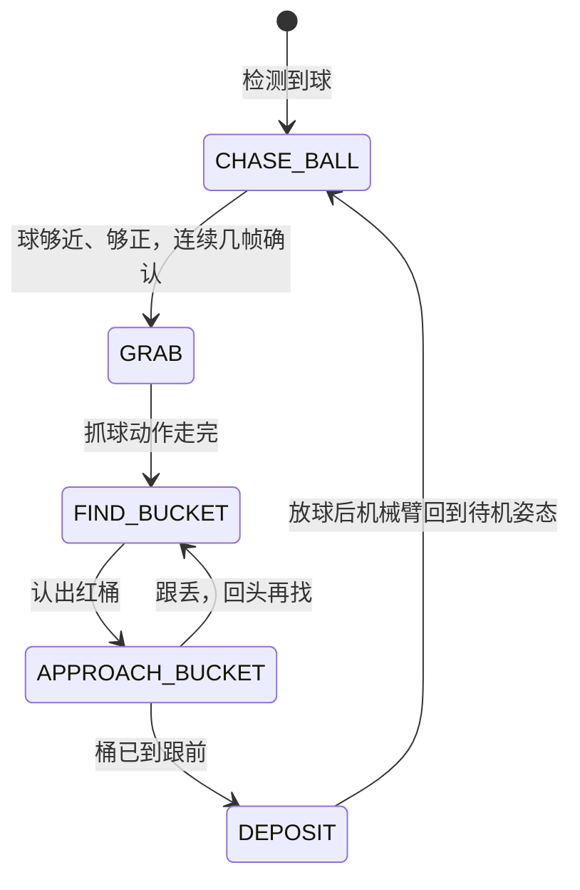

# 网球机器人上手指南

这份指南面向拿到小车硬件之后要动手做开发的人。内容按实际动手的顺序排列：先认识硬件，再准备开发环境，然后编译系统、制作 SD 卡、上电启动，最后让小车真正跑完一次"看到球、开过去、抓起来、放进桶里"的完整过程。每一步都给出可以照抄的命令和判断成功的方法。

这套硬件有 RK3588 和 SG2002 两条路线，它们共用同一台车，只有主控板不同，因此编译、写卡、启动方式都不一样。凡是不同的地方都分开写清楚，相同的部分合并说明。

## 1. 认识这套硬件

动手之前先弄清楚机器人由哪些部分组成、两块主控板各自是什么、以及程序要操作哪些设备。这一节的内容决定了后面每一步该用哪条命令。

### 1.1 机器人本体的组成

两条路线是同一台车，区别只在主控板：底盘、机械臂、摄像头都用同一套，把 Orange Pi 5 Plus 整板换成 AKA-00 车板（或者反过来）就算换了路线，不需要换车。

车体是一台四轮差速小车，轮半径 0.03 m、轮距 0.18 m。左右两侧各由一个编码电机驱动，底盘控制器是 ESP32-C3，电机驱动是 DRV8833 双路 H 桥，供电是锂电池加降压板；机械臂是三自由度舵机臂，三个舵机都是 ZP10S 总线舵机；视觉用普通的 USB 摄像头（UVC 协议），另有一个红色的桶用来投放网球。

底盘和机械臂各占一路串口，都是 115200 8N1。底盘这一路的固件跑在 ESP32-C3 上，主控板通过 UART 下发速度和方向指令，帧格式是 `[0xAA] [0x55] [CMD] [LEN] [PAYLOAD] [CHK]`，整帧长度是 5 加载荷长度，校验字取 `CMD ^ LEN ^ PAYLOAD` 的逐字节异或，接收侧先扫 `0xAA` 再扫 `0x55` 重新同步；速度用命令字 `0x13` 下发，载荷是一对大端有符号百分比，钳位到 ±100；里程计遥测走命令字 `0x20`，下位机以两帧 `0x90` 回报左右轮转速。协议测试见 `chenlongos/AKA-00` 的 `tests/test_uart.py`。机械臂这一路走 ASCII 舵机协议，程序是阻塞式的：移动命令形如 `#000P1611T1000!`（依次是舵机号、脉宽、耗时），位置回读形如 `#002PRAD!`，一条命令发完要等舵机走到位才发下一条；角度按 270° 满量程折算成脉宽并叠加 500 µs 偏置，钳位在 500～2500 µs。

两条路线的用户态程序互不相同：模型是同一个 YOLOv8n 网球模型，导出成各自要的格式；程序本体、运行方式和调参方式都不一样，分别在 3.2 里说明。两块主控板都跑 StarryOS，用户态程序根据摄像头画面决定底盘怎么走、机械臂什么时候动。

### 1.2 两条平台路线

两块主控板的算力、模型格式和用户态程序语言都不同，选择哪一块取决于你对算力和成本的要求。下表把主要差别列在一起，便于对照。

| 对比项 | RK3588 路线 | SG2002 路线 |
| --- | --- | --- |
| 主控板 | Orange Pi 5 Plus | 荔枝派 Nano（Sipeed LicheeRV Nano）或 AKA-00 车板 |
| 芯片架构 | ARM64，8 核（4×A76 + 4×A55） | RISC-V 双核 C906（1 GHz 大核 + 700 MHz 小核） |
| AI 加速 | NPU，6 TOPS，三核 | TPU，INT8，支持 BF16 |
| 图像硬件加速 | RGA 缩放、JPU 硬解 JPEG | 无，图像处理全部走 CPU |
| 模型格式 | RKNN（用 rknn-toolkit2 转换） | cvimodel（用 CVITEK TPU-MLIR 转换） |
| 推理运行时 | librknnrt.so | libcviruntime / libcvikernel |
| 用户态程序 | C++ 写的 `tennis`，构建脚本在 `apps/starry/aka-rk3588/`，仓库只存预编译产物 | Rust 写的 `akars`，代码不在本仓库 |
| 系统库 | glibc | musl |
| 联网方式 | 无板载无线，靠有线网络 | 板载 AIC8800DC WiFi，可连热点也可自己开热点 |
| 定位 | 算力充足，适合跑完整自主流程 | 成本低、功耗低，适合 RISC-V 生态验证 |

两条路线的差别会一直贯穿到后面的编译和部署：RK3588 的程序用 glibc 工具链编译，SG2002 的用 musl 工具链交叉编译，两者不能混用——用错了会在板子上报缺少 `GLIBC_2.34` 之类的错误。

还有一项能力只有 SG2002 侧有：WiFi 联网加上浏览器遥控。RK3588 没有板载无线网卡，所以"手机连上小车看画面、直接开"这条链路是 SG2002 独有的。

### 1.3 程序要操作的设备

用户态程序不直接操作硬件寄存器，而是通过设备文件读写。写程序和排查问题时对不上设备名是最常见的原因，所以先把两块板上实际存在的设备名记下来。

| 用途 | RK3588 | SG2002 |
| --- | --- | --- |
| 调试串口 | 板子侧 `ttyS2`，波特率 1500000 | 板子侧 `ttyS0`，波特率 115200 |
| 底盘驱动 | ESP32-C3，115200 8N1，`/dev/ttyS6` | ESP32-C3，115200 8N1，akars 默认 `/dev/ttyS3` |
| 机械臂舵机 | ZP10S 舵机，115200，`/dev/ttyS3` | ZP10S 舵机，115200，akars 默认 `/dev/ttyS2` |
| 摄像头 | UVC 摄像头，USB3 口，输出 MJPEG | `/dev/cvi-usb-camera0`，USB 接口 |

两条路线上的底盘和机械臂是同一套硬件，接法也一样：底盘控制器占一路串口，机械臂占另一路。设备节点的名字跟着接法走——接在板载 UART 上是 `ttyS*`，经 USB 转串口接是 `ttyUSB*`——两块板子枚举出来的编号不一定相同，所以拿到一台车先 `ls /dev/ttyS* /dev/ttyUSB*` 看一眼实际有哪些节点，再和上表对照。表里列的都是板子这一侧的节点名；开发机那一侧的 USB 转串口设备名随操作系统变化，见 9.1。

RK3588 的程序把这两个设备名当命令行参数收，底盘在前、机械臂在后：`./build/tennis <模型> <底盘串口> 0 <机械臂串口>`。程序里内置的默认值是底盘 `/dev/ttyS3`、机械臂 `/dev/ttyUSB1`，用法示例给的也是这两个，和实车接线不是同一组节点，所以命令里要把设备名显式写出来，别用默认值。单独试某一路用 `./build/tennis test-motor /dev/ttyS6 speed=30` 和 `./build/tennis test-arm /dev/ttyS3 pos`。

SG2002 侧的 `akars` 给这三个设备都设了默认值（`--camera /dev/cvi-usb-camera0`、`--motor /dev/ttyS3`、`--arm /dev/ttyS2`），接线和默认一致时不用写。这块板子的调试控制台占的是 `ttyS0`，接外设时避开它。

## 2. 准备开发环境

有两种准备方式，推荐用容器，因为 SG2002 需要的 RISC-V 交叉编译工具链在普通电脑上通常没有。不管你用哪种方式，最后都要能跑通一次 QEMU 启动，才算环境真的可用。

### 2.1 用容器

仓库提供了官方容器镜像，里面是 Ubuntu 24.04 加 Rust 工具链加 riscv64 musl 交叉编译器，直接挂载仓库目录就能用。在仓库根目录执行：

```bash
docker pull ghcr.io/rcore-os/tgoskits-container:latest
docker run --rm -it -v "$PWD":/workspace -w /workspace \
  ghcr.io/rcore-os/tgoskits-container:latest
```

镜像也可以自己构建：`docker build -t tgoskits-base:local -f container/Dockerfile .`。进入容器后，本文所有 `cargo starry` 命令都可以直接使用。容器把仓库目录挂载到了 `/workspace`，你在容器里编译产生的文件在宿主机上同样能看到。

### 2.2 在本机装工具

不想用容器的话，需要自己装 Rust 工具链和 QEMU。仓库用 `rust-toolchain.toml` 锁定了 nightly 版本，只要用 rustup 进入仓库目录就会自动装好。Debian 或 Ubuntu 上还需要下面这些系统包：

```bash
sudo apt install qemu-system-arm qemu-system-riscv64 qemu-system-x86 \
  gcc-aarch64-linux-gnu gcc-riscv64-linux-gnu cargo-binutils u-boot-tools
rustup show
```

其中 `u-boot-tools` 提供 `mkimage` 命令，后面校验 SG2002 内核镜像时必须用到；`cargo-binutils` 提供 `rust-objcopy` 和 `rust-nm`，内核构建要用这两个工具处理符号表。构建时还会用到生成符号表的 `gen_ksym`，它不在上面这些系统包里，默认由构建过程自己 `cargo install ksym` 装上（离线环境可以先手动装好）。要在本机编 SG2002 的内核，还需要额外准备 riscv64-linux-musl 交叉编译器（`riscv64-linux-musl-cross`，或玄铁 V3.4.0 工具链），并确保它的 gcc 在 `PATH` 里。这几样凑不齐就直接用容器，不要在本机上硬凑。

上面的包名是 Debian 和 Ubuntu 的写法。macOS 和 Windows 上默认没有 `mkimage` 这类命令，遇到它们的步骤改用容器执行，缺的命令在容器里临时装一次即可，写法见 9.1。

### 2.3 先跑一次 QEMU 确认环境可用

不需要任何硬件就能验证环境是否装对。生成 rootfs 再启动一次 QEMU：

```bash
cargo starry rootfs --arch aarch64
cargo starry qemu --arch aarch64
```

串口窗口里出现 StarryOS 的命令行提示符，就说明工具链和 QEMU 都没问题。如果这一步就失败，问题出在开发机上，和板子无关，先解决环境再往下走。

## 3. 编译内核和用户程序

需要编译两样东西：StarryOS 内核，和跑在内核上的用户态程序。内核由 `cargo starry` 命令负责，用户态程序各有各的编译方式，不在内核构建流程里。

### 3.1 编译 StarryOS 内核

内核用板卡配置文件来区分平台，配置文件放在 `os/StarryOS/configs/board/` 下。RK3588 用 `orangepi-5-plus.toml`，SG2002 根据板子形态选一个：裸板用 `licheerv-nano-sg2002.toml`，带 WiFi 的版本用 `licheerv-nano-sg2002-wifi.toml`，AKA-00 车板用 `aka-00-sg2002.toml`。

```bash
# 先写入板卡配置（会持久化一份到 tmp/axbuild 下）
cargo starry defconfig licheerv-nano-sg2002

# 再编译
cargo starry build

# 或者一步到位，直接指定配置文件（推荐）
cargo starry build -c os/StarryOS/configs/board/aka-00-sg2002.toml
```

在容器里编译 SG2002 内核的完整命令是这样，注意 `-c` 不能省：

```bash
docker run --rm -v "$PWD":/work -w /work \
  ghcr.io/rcore-os/tgoskits-container:latest bash -lc \
  'cargo xtask starry build -c os/StarryOS/configs/board/aka-00-sg2002.toml'
```

SG2002 的产物在 `target/riscv64gc-unknown-none-elf/release/starryos.uimg`，另外还需要一份设备树。用哪一份不看编译时选的 config 叫什么名字，而是由运行配置里的 `dtb_file` 指定：车板的 `aka-00-sg2002-board.toml` 和 `aka-00-sg2002-uboot.toml` 都指向 `os/StarryOS/configs/board/aka-00-sg2002.dtb`，荔枝派的两份指向同目录下的 `licheerv-nano-sg2002.dtb`。像 `licheerv-nano-sg2002-wifi.toml` 这样只写 `features` 的配置文件是编译用的，里面没有 `dtb_file`，别按它的名字去找同名的设备树。功能项在板卡配置文件里选：三份 SG2002 配置都带 `ax-driver/serial` 和 `ax-driver/cv181x-sdhci`；`ax-driver/aic8800-wifi` 在 `licheerv-nano-sg2002-wifi.toml` 和 `aka-00-sg2002.toml` 里；决定摄像头能不能用的 `starry-kernel/sg2002-cvi-usb-camera` 和 `ax-driver/sg2002-dwc2` 只有 `aka-00-sg2002.toml` 带。这份指南里的推理和遥控都要用摄像头，所以车板一律编译 `aka-00-sg2002.toml`。

SG2002 的产物编译完必须校验一次加载地址：

```bash
mkimage -l target/riscv64gc-unknown-none-elf/release/starryos.uimg
```

输出里的 `Load Address` 和 `Entry Point` 必须都是 `0x80200000`。如果这里是 0，说明打包模板 `.its` 没有被正确解析，这个镜像烧进去 `bootm` 会跳到地址 0 直接崩溃。

RK3588 的产物和 SG2002 不是一回事：它只有 `target/aarch64-unknown-none-softfloat/release/starryos.bin`，一个裸内核二进制，没有配套的 FIT 镜像。打不打 FIT 取决于板卡配置旁边有没有同名的打包模板：`scripts/axbuild/src/starry/build.rs` 里的 `uimage_generation_plan` 只在 `os/StarryOS/configs/board/` 下存在同名 `.its` 时才会调用 `mkimage` 产出 `starryos.uimg`，而这个目录里的三份 `.its` 都是 SG2002 的，没有 `orangepi-5-plus.its`。

所以 RK3588 拿不到 FIT 产物，`cargo starry uboot` 和 `quick-start` 这两条要上传 FIT 镜像的通道在这块板上没有东西可以送。它走的是另一条路：拿 `starryos.bin` 打一个只装内核的 legacy uImage，和设备树分开加载，打包见 4.2，引导命令见 5.1。

### 3.2 编译用户态程序

两块平台的用户态程序来源完全不同，这一步最容易出错。

RK3588 上的程序是 `apps/starry/aka-rk3588/` 这个应用，程序本体不在本仓库里。它是一个外部 C++ 工程，原始仓库是 `pengzechen/aka-rk3588`，后续开发在它派生出来的 `bullhh/aka-rk3588` 上继续，`source.env` 固定的就是后者的一个提交。本仓库不重复保存源码，也不要求你在本地交叉编译：它保留了一份已经在 Orange Pi 的 Jammy 系统上用 GCC 11 原生编译并实机验证过的 AArch64 程序 `prebuilt/aarch64/build/tennis`，其余的运行文件由 `prepare-package.sh` 从固定提交的源码归档里取。这个程序最高依赖 `GLIBC_2.34`，只能跑在 glibc 系统上，这也是 4.2 里 RK3588 直接复用 Jammy 根文件系统的原因。

要生成部署包，在开发主机上执行：

```bash
cd apps/starry/aka-rk3588
./prepare-package.sh
```

脚本会把 `source.env` 里固定提交号的源码归档下载下来、校验 SHA256，再用仓库里的预编译程序替换归档中的构建产物，最后在 `target/aka-rk3588/aka-rk3588.tar.gz` 生成部署包。源码来自 `source.env` 里的 `AKA_RK3588_REPOSITORY`，也就是 `bullhh/aka-rk3588` 的固定提交 `8408f1b9`；包里的 `config/`、`models/` 和几个 `run_*.sh` 都取自这份归档，本仓库只保存程序本体（预编译的 `prebuilt/aarch64/build/tennis`），其余文件都在那份归档里。后面 6.2、6.5 里引用的 `run_vision_once.sh` 和日志字符串都来自那份归档，要对照这个上游仓库看。要把源码版本换掉时，`source.env` 里的提交号和二进制 SHA256 必须一起更新，不要用分支名或 `HEAD` 当输入。

SG2002 上先跑仓库自带的最小推理校验，代码就在 `apps/starry/aka00-tennis-yolo/`，不用另外下载。它依赖玄铁 V3.4.0 musl 工具链和 Milk-V 的 SG200x TPU SDK，用脚本一次装好：

```bash
apps/starry/aka00-tennis-yolo/scripts/setup.sh
apps/starry/aka00-tennis-yolo/build-validator.sh
```

第一步会下载工具链和 TPU SDK 并校验哈希，联网不方便时可以用 `--toolchain-archive` 和 `--sdk-archive` 指定本地压缩包。第二步的产物在 `apps/starry/aka00-tennis-yolo/install/sg2002_riscv64_musl/akars_tennis/`，`install/` 是生成物，不进仓库。

需要完整自主捡球程序时，再用外部仓库 `BattiestStone4/akars`，它是一个独立的 Rust 项目，代码不在本仓库里：

```bash
git clone https://github.com/BattiestStone4/akars
cd akars
scripts/setup.sh    # 装 Rust target、初始化 TPU SDK 子模块、下载并校验玄铁 V3.4.0 musl 工具链
scripts/build.sh
```

同名的 C++ 版本在 `pengzechen/aka-sg2002`，Rust 版的推理、电机、机械臂和状态机都是照着它移植的，对照调试时有用。

这里有一个必须注意的地方：akars 的 `.cargo/config.toml` 默认指定的动态加载器是 `ld-musl-riscv64v0p7_xthead.so.1`，而板子的 rootfs 里只有标准的加载器。如果直接用它默认的配置编译，程序在板子上会因为找不到加载器而起不来。解决办法是把加载器改成标准路径后重新编译：

```bash
RUSTFLAGS="-C link-arg=-Wl,--dynamic-linker=/lib/ld-musl-riscv64.so.1" \
  cargo build --release --target riscv64gc-unknown-linux-musl
```

akars 在板子上运行还需要运行时库：`libcviruntime.so`、`libcvikernel.so`、`libstdc++.so.6`，以及 musl 程序基本都会用到的 `libgcc_s.so.1`，通过 `LD_LIBRARY_PATH` 能找到即可。`aka00-tennis-yolo` 的构建脚本已经把这些库一起收进产物目录的 `lib/`，可以直接照抄它的做法。

### 3.3 改了配置文件为什么没生效

这是编译阶段出现频率最高的问题，值得单独说清楚。`cargo starry build` 不带 `-c` 参数时，用的不是 `configs/board/` 下的模板文件，而是之前 `defconfig` 复制到 `tmp/axbuild/config/` 下的一份副本。所以你改了 board toml 里的内容，如果不带 `-c` 重新编译，生效的还是旧副本，看起来就像"改了没用"。

记住一条：**改过 board toml 之后，编译时一定带上 `-c` 参数**。

## 4. 制作启动 SD 卡

这一步是让板子能起系统、能跑程序。两块板要做的事完全不同：RK3588 的卡上跑的是一整套 Ubuntu 22.04（Jammy）系统，系统和数据都在 SD 卡里（这块板子没有 eMMC），卡在车到手时已经写好，要做的是把 StarryOS 内核和用户程序部署进这套系统；SG2002 则要从镜像开始自己做启动卡。两者的写盘风险也不一样，先看通用规则，再看各自的操作。

### 4.1 写卡前的通用规则

写卡操作不可逆，写错了要重刷整卡，所以下面几条必须遵守。

第一条，任何写入之后都要执行 `sync`，等数据真正落盘再拔卡或断电。跳过 `sync` 直接断电会损坏 ext4 分区，表现是下次开机 rootfs 挂载失败或者文件莫名其妙消失，严重时开不了机只能重刷整卡。

第二条，优先往 FAT 分区写文件。FAT 分区结构简单，断电不容易坏。

第三条，每次换内核之前，先把分区里旧的那份内核镜像改名留一份备份，万一新内核起不来还能换回去。

第四条，手头保留一份能正常启动的底包镜像。卡写坏了直接重刷整卡，不要在已经损坏的卡上继续叠写，那样只会越写越乱。

还有一条限制要知道：**StarryOS 的 ext4 实现只支持 ext4 特性集里的一个子集**。挂载时的检查在 `fs/rsext4/src/superblock/features.rs`。就特性位而言它只看两个字段——`s_feature_incompat` 和 `s_feature_ro_compat`，分别对照 `SUPPORTED_INCOMPAT_FEATURES` 和 `SUPPORTED_RO_COMPAT_FEATURES` 两份清单，清单外的特性位会让挂载失败（`s_feature_ro_compat` 只在读写挂载时才校验），第三个字段 `s_feature_compat` 不参与检查。特性位之外还有一项检查：`s_def_hash_version` 必须不超过 `MAX_DEFAULT_DIRECTORY_HASH_VERSION`（5），`mkfs.ext4` 的默认值在这之内。

这个区别有实际影响：较新的 `mke2fs`（1.47 起）默认开出的 `orphan_file` 正是 `s_feature_compat` 里的位（`EXT4_FEATURE_COMPAT_ORPHAN_FILE`，`0x1000`），**不在检查范围内，不会导致挂载失败**，不需要为它做任何处理。用默认参数 `mkfs.ext4` 建出来的文件系统可以直接挂上。

自己新建分区时块大小要落在 1024 到 4096 之间：

```bash
sudo mkfs.ext4 -b 4096 /dev/sdXY
```

这里的 `-b 4096` 指的是**文件系统块大小**，不是分区起始偏移，两件事不要混。写 4096 是为了和仓库里现成的镜像保持一致。

拿到一个别人做好的 ext4 分区（比如发行版给的 rootfs），如果挂不上，先查它的块大小和特性：

```bash
dumpe2fs -h /dev/sdXY | grep -E '^Block size|^Filesystem features'
```

块大小要在 1024 到 4096 之间。特性那一行里如果有不认识的名字，去 `features.rs` 的两份清单里对一下对不对得上，对不上就是它导致的。真遇到挂不上时先跑这条命令，比直接重建分区快，也不会白丢数据。

### 4.2 RK3588 写卡与部署

RK3588 用 SD 卡存储（这块板子没有 eMMC），rootfs 直接用现成的 Ubuntu 22.04（Jammy）系统，不另外做一个最小系统。板子在 Linux 下本来就能跑，出问题时可以先用 Linux 对照一次；**StarryOS 复用这同一份 rootfs**，用户程序在 Linux 侧部署一次，切到 StarryOS 之后在同一份根文件系统里直接运行，两套系统共用一个应用目录，不需要维护两份。这条路径在实机上验证过。

用 Jammy 不是随便挑的。用户态程序最高依赖 `GLIBC_2.34`，只能跑在 Jammy 这类 glibc 系统上，放在只含 musl 的 Alpine 或自建的精简 rootfs 里会因为找不到 glibc 而起不来。

#### 底包镜像

车到手时卡里已经写好这套系统，需要自己重做一张时才走这一步。用的镜像是 `ubuntu-22.04-preinstalled-server-arm64-orangepi-5-plus.img.xz`，来自社区移植项目 `Joshua-Riek/ubuntu-rockchip`——**它不是 Orange Pi 官方发布的镜像**，是社区把 Ubuntu 移植到 Rockchip 各板型之后发布的一份，系统是 Ubuntu 22.04 LTS Server，内核是 Rockchip 的 Linux 5.10。

镜像的下载入口有两个，按板型选 `orangepi-5-plus` 那一份：

- 项目仓库的 Releases：`https://github.com/Joshua-Riek/ubuntu-rockchip/releases`
- 项目的下载页：`https://joshua-riek.github.io/ubuntu-rockchip-download/boards/orangepi-5-plus.html`

下载目录里除了 `.img.xz`，还有一份同名的 `.sha256`，写卡之前先核对一次。这份 `.img.xz` 可以**直接**交给写卡工具：balenaEtcher、USBimager 这类工具在三个平台上都有，选文件、选卡、开始写即可，不需要先解压。只有用 `dd` 写的时候才要先展开成 raw 镜像，解压和 `dd` 的写法见 4.3。写完等工具报完成再拔卡，手工用 `dd` 的那种写法要额外 `sync`，理由见 4.1 第一条。

第一次上电要等一到两分钟才出登录提示。串口按 1.3 接好，波特率 1500000。系统的默认账号是 `ubuntu`，默认密码也是 `ubuntu`，**首次登录会被要求改密码**，改完记下来，后面 SSH 用的是新密码。

#### 部署用户程序

先在 Linux 下把部署包解压到板子的固定目录：

```text
/home/orangepi/robot/aka-rk3588
```

装好之后目录不要再搬动。程序从这个路径启动，也按相对路径找 `config/`、`models/` 和 `lib/`。覆盖部署之前，先把这台车原来的 `config/` 备份出来，免得被新包里的默认值盖掉。

#### 放入 StarryOS 内核与设备树

卡上还差 StarryOS 自己的内核和它的设备树，两者都放在卡上 ext4 分区的 `/boot/starry/` 下。先按 3.1 编出裸内核，再打一个 legacy uImage——这块板的 U-Boot 起不了 FIT，原因和现场表现见 5.1：

```bash
# 开发机上已经有 mkimage 时（Linux 装了 u-boot-tools，见 2.2）
mkimage -A arm64 -O linux -T kernel -C none \
  -a 0x00400000 -e 0x00400000 -n "StarryOS RK3588" \
  -d target/aarch64-unknown-none-softfloat/release/starryos.bin \
     target/aarch64-unknown-none-softfloat/release/starryos-legacy.uimg
```

开发机上没有 `mkimage` 时，借一个装有 `u-boot-tools` 的容器跑同一组参数，产物落在同一个位置：

```bash
docker run --rm -v "$PWD":/workspace -w /workspace ubuntu:22.04 bash -c '
  apt-get update -qq && apt-get install -y -qq u-boot-tools >/dev/null
  mkimage -A arm64 -O linux -T kernel -C none \
    -a 0x00400000 -e 0x00400000 -n "StarryOS RK3588" \
    -d target/aarch64-unknown-none-softfloat/release/starryos.bin \
       target/aarch64-unknown-none-softfloat/release/starryos-legacy.uimg
'
```

`-T kernel -C none` 说明这是一个不压缩的普通内核镜像，不是多组件打包的 FIT；`-a` 和 `-e` 是镜像头的加载地址和入口地址，两个都取 `0x00400000`，`bootm` 会照着它把内核放到这个位置。产物大小在 15 MB 上下，和 SG2002 那边 `0x80200000` 那一组地址没有关系。

打包好的镜像和设备树用 `scp` 送进卡里，板子上的 Linux 有完整的 SSH 服务，这样送文件不需要拆卡：

```bash
scp target/aarch64-unknown-none-softfloat/release/starryos-legacy.uimg \
    os/StarryOS/configs/board/orangepi-5-plus.dtb ubuntu@<板子IP>:/tmp/

ssh ubuntu@<板子IP> 'sudo mkdir -p /boot/starry && \
  sudo mv /tmp/starryos-legacy.uimg /tmp/orangepi-5-plus.dtb /boot/starry/ && \
  sync && ls -l /boot/starry/'
```

`sync` 不能省，理由见 4.1 第一条；换内核之前把 `/boot/starry/` 里旧的那份改名留一份，对应 4.1 第三条。设备树用的是仓库里 `os/StarryOS/configs/board/orangepi-5-plus.dtb` 这一份，它同时也是 `orangepi-5-plus-uboot.toml` 里 `dtb_file` 指向的文件，两份不要混。

这里的 ext4 写入是板子上运行着的 Linux 在写自己的 rootfs，和 4.3 里"开发机不碰 ext4 分区"不矛盾：那一条说的是开发机直接往卡上的 ext4 分区里塞文件，两者不是同一回事。

三样东西都在卡上之后，重启进 U-Boot 引导，命令见 5.1。

### 4.3 SG2002 写卡

SG2002 的卡上分两个区：第一个区是 FAT，放 `fip.bin`、设备树和内核；第二个区是 ext4，放 rootfs。

这两个区之间有一条写入界线：**第一个 FAT 分区可以由开发机直接写，第二个 ext4 分区不行。** 仓库在自编译 rootfs 的实践中记过这件事，出处是 `os/StarryOS/docs/starryos-self-compilation.md`：在宿主机侧挂载并写入 rootfs 之后，`rsext4` 会读不回来，表现为 `Block num already free!` 或 `Input/output error`。那份记录给出的操作结论是 ext4 的写入尽量交给运行中的 StarryOS，宿主机只负责用 `mkfs.ext4` 建空文件系统，把宿主机侧的修改压到最少。

那份记录后来在「根因分析（2026-05-25 更新）」里修正过归因：`rsext4` 本身不是根因，实际原因是宿主机侧的写法——`debugfs -w` 写裸块时不计算 `metadata_csum` 的校验和、`debugfs -w` 写出的目录项不可靠，以及反复 mount/unmount/e2fsck 累积损坏。归因变了，操作结论没变：宿主机侧的 ext4 写入越少越好。

落到这条流程上就是：**内核和设备树在烧卡之后由开发机写进 FAT 分区，用户程序等板子起来之后再在 StarryOS 里写进 rootfs。** 开发机始终不碰 ext4 分区。

第一步，把底包镜像整卡写入 SD 卡：

```bash
# <底包镜像> 指解压后的 raw 整卡镜像，不是 .img.xz 压缩包，展开写法见本步结尾
# macOS
diskutil list                      # 先确认设备号，别烧错盘
diskutil unmountDisk /dev/diskN
sudo dd if=<底包镜像> of=/dev/rdiskN bs=4m
diskutil eject /dev/diskN

# Linux
lsblk                              # 找 SD 卡，如 /dev/sdX
sudo dd if=<底包镜像> of=/dev/sdX bs=4M conv=fsync
```

`<底包镜像>` 换成整卡镜像的文件路径，来源有三条路：用荔枝派官方的镜像，用 `chenlongos/AKA-00` 仓库 releases 里的 `sd_licheervnano_with_AKA00_v0_*.img.xz`（那是一个跑厂商 Linux 的镜像，适合做性能对照），或者用已经配好的 `sdcard_akars.img`。前面两个的 `fip.bin` 需要从荔枝派官方镜像里提取。

**`dd` 的输入必须是解压后的 raw 整卡镜像。** AKA-00 releases 里那份文件名以 `.img.xz` 结尾，同目录还有一份 `.img.md5`，里面记的是解压后 `.img` 的摘要。把压缩包直接交给 `dd`，写进卡里的是压缩数据，卡上不会有分区表，第二步找 FAT 分区、第三步引导都无从谈起，所以下载完先解压。开发机上没有 `xz` 的话，按 9.1 的办法装一个或换工具：

```bash
# 解压成 raw 镜像，再拿它替换上面命令里的 <底包镜像>
xz -dc sd_licheervnano_with_AKA00_v0_5.img.xz > sdcard.img
md5 -q sdcard.img                  # macOS，和 .img.md5 里那 32 位十六进制对一遍
md5sum sdcard.img                  # Linux

# 也可以不落盘，直接管道进 dd
xz -dc sd_licheervnano_with_AKA00_v0_5.img.xz | sudo dd of=/dev/rdiskN bs=4m           # macOS
xz -dc sd_licheervnano_with_AKA00_v0_5.img.xz | sudo dd of=/dev/sdX bs=4M conv=fsync   # Linux
```

示例里的版本号按实际下载的那份替换。解压出来的是一个完整的整卡镜像，比压缩包大得多，先确认本地空间够再解压。

本节末尾核对 `fip.bin` 板型时，比对的是从解压后的 raw 镜像里取出来的那份：xz 是单一压缩流，没法按偏移直接从压缩包里取文件。

第二步，把内核和设备树放进第一个分区。整卡写完、重新插卡之后，第一个 FAT 分区就是一个普通移动盘：macOS 上会出现在 `/Volumes/` 下，Linux 上挂载 `/dev/sdX1` 即可。这一步不需要 loop 设备和分区偏移，直接往里拷文件。命令在仓库根目录执行，两个源文件都按仓库内的相对路径给：

```bash
cp target/riscv64gc-unknown-none-elf/release/starryos.uimg \
   os/StarryOS/configs/board/aka-00-sg2002.dtb /Volumes/<第一个分区>/
sync    # 写完先把数据落到盘上，再弹出
```

挂载点按平台替换：macOS 上是 `/Volumes/` 下的那个卷，Linux 上是 `mount` 里看到的那个挂载点。内核产物在 `target/riscv64gc-unknown-none-elf/release/` 下，编译出来的名字就是 `starryos.uimg`，和 3.1 里 `mkimage -l` 用的是同一个文件；设备树（`aka-00-sg2002.dtb`）在 `os/StarryOS/configs/board/` 下，`aka-00-sg2002-uboot.toml` 里的 `dtb_file` 指的就是它。换内核之前先把分区里那份旧的改名留一份备份，对应 4.1 第三条；FAT 分区结构简单，这一步在开发机上做没有问题。

第三步，上电并从第一个分区引导，命令见 5.2。

第四步，进系统之后把用户程序写进 rootfs。这一步的写入由板子上的 `rsext4` 完成，开发机只负责把数据送过去，走的是 5.3 里那条 SSH 管道：

```bash
# 在 akars 仓库目录下执行；编译产物在 target/riscv64gc-unknown-linux-musl/release/ 下
cat target/riscv64gc-unknown-linux-musl/release/akars | \
  ssh root@<板子IP> 'mkdir -p /usr/local/bin && cat > /usr/local/bin/akars && chmod +x /usr/local/bin/akars && sync'
```

管道左边是本机文件的路径，右边引号里是板子上的目标路径，两者不一样，别照着左边去板子上找。装到 `/usr/local/bin` 是因为板子的 `PATH` 里只有它：`os/StarryOS/starryos/src/init.sh` 把 `PATH` 设成 `/usr/local/sbin:/usr/local/bin:/usr/sbin:/usr/bin:/sbin:/bin`，里面没有 `/root`。装在别的目录就得每次写全路径，6.3 那张子命令表里的 `akars` 也就不能照着敲了。

`akars` 运行时需要的 `libcviruntime.so`、`libcvikernel.so`、`libstdc++.so.6` 和 `libgcc_s.so.1` 按同一条通道送进 `/lib`，送完 `sync`。这四个文件在 `apps/starry/aka00-tennis-yolo/install/sg2002_riscv64_musl/akars_tennis/lib/` 下，`build-validator.sh` 把 TPU SDK 里的 `.so` 和工具链里的 `libstdc++.so.6`、`libgcc_s.so.1` 一起收在这个目录。要跑 6.3 里的固定图片推理校验，还要把 `apps/starry/aka00-tennis-yolo/install/sg2002_riscv64_musl/akars_tennis/` 这个目录放到第二个分区根下的 `/akars_tennis`，`lib/`、`model/`、`validation/` 三份都要在。上面那条管道一次只送一个文件，装不下整个目录，先在开发机上打包再在板子上解开：

```bash
tar -C apps/starry/aka00-tennis-yolo/install/sg2002_riscv64_musl -cf - akars_tennis | \
  ssh root@<板子IP> 'cd / && tar -xf - && sync'
```

判断这一步是否成功，看的是**板子读得回来**，不是开发机写得进去：在 StarryOS 里 `ls -l` 一遍传上去的文件、再把程序实际跑一次，才算过。真遇到读回出错，往上面那三个方向查，不用怀疑内核镜像本身。

第一个分区里的 `fip.bin` **不要换**。这个文件和板型是绑死的，里面是 OpenSBI 加 SPL，负责初始化 DDR 和 SDIO 物理层，包含采样延迟参数，换错板型的 fip 会导致无线大包传输失败甚至启动异常。荔枝派 Nano 的 fip 是 440832 字节（sha1 `5b4d1faf…`），AKA-00 车板是 509440 字节。

判断手上这份 `fip.bin` 属于哪块板，查它的大小和 sha1。命令在 `fip.bin` 所在的目录执行，文件名按它实际存放的路径替换：

```bash
# Linux
stat -c %s fip.bin && sha1sum fip.bin

# macOS
stat -f %z fip.bin && shasum fip.bin
```

**尺寸相同不等于可以通用**：509440 字节这一档不止一块板在用，最终要靠 sha1 区分。换 fip 之前先比 sha1，并且确认它和提取它的那份镜像对得上。

刷写这块卡只能手动插拔 SD 卡，没有网络刷机这条捷径——远程板卡服务也不负责写卡，它做的是板卡申请、U-Boot 引导和串口连接这几件事。

但这两块 SG2002 板都在远程服务的覆盖范围内，卡写好插到板子上之后可以走这条路，省掉每次重启手动敲 U-Boot 的麻烦：

```bash
cargo starry board \
  --board-config os/StarryOS/configs/board/aka-00-sg2002-board.toml \
  --server "${OSTOOL_SERVER:?set OSTOOL_SERVER}" \
  --port "${OSTOOL_PORT:?set OSTOOL_PORT}"
```

车板用 `aka-00-sg2002-board.toml`，荔枝派 Nano 把 `--board-config` 换成 `os/StarryOS/configs/board/licheerv-nano-sg2002-board.toml`。板级测试的写法是 `cargo starry test board --board aka-00-sg2002`，荔枝派对应 `--board licheerv-nano-sg2002`，配置分别在 `test-suit/starryos/board-aka-00-sg2002` 和 `test-suit/starryos/board-licheerv-nano-sg2002` 下。两份板卡的 `shell_prefix` 都是 `root@starry:`，和 5.2 里的提示符一致。

和 6.3 里 `cargo xtask starry app board -t aka00-tennis-yolo -b AKA-00-SG2002` 那条应用级测试是两回事：这里跑的是内核启动验证，那里跑的是用户程序。

### 4.4 把卡装进机器人

车板的 SD 卡位置比较隐蔽，换卡需要拆机。先把顶部盖板取下——用内六角螺丝刀拧下四颗螺丝，注意**先断开机械臂与主控之间的连线**，再拆盖板。盖板取下后会看到一个 Type-C 转 USB-A 的转接头，把它拔掉。SD 卡槽就在转接头附近，插拔稍微有点费力。

## 5. 上电启动

两块板的启动过程不一样：内核在卡上的位置不同，能用的镜像格式也不一样，但都要在 U-Boot 里手动敲命令，没有哪块板是按一下电源就进 StarryOS 的。

### 5.1 RK3588 启动

接好串口线（波特率 1500000），上电，盯着串口输出。U-Boot 的自动启动会去引导卡上那套 Linux，所以要**在倒计时结束前按任意键打断它**，停在 `=>` 提示符上。这个窗口很短，上电后先守着串口，别同时干别的；真错过了也不要紧，板子照样会进 Linux，`sudo reboot` 重来一遍即可。

在 `=>` 提示符下敲三条命令，内核和设备树就是 4.2 里放进卡的那两个文件：

```text
ext4load mmc 1:2 0x02000000 /boot/starry/starryos-legacy.uimg
ext4load mmc 1:2 0x0a100000 /boot/starry/orangepi-5-plus.dtb
bootm 0x02000000 - 0x0a100000
```

- `mmc 1:2` 是 SD 卡的第二个分区，也就是放 rootfs 的那个 ext4 分区。卡对应的设备号按 `mmc list` 确认，固件不同枚举出来的编号可能不一样。
- 第一条把镜像读进内存的暂存位置 `0x02000000`，`bootm` 再按 uImage 头里写的加载地址（`0x00400000`）把内核搬过去；第二条把设备树读到 `0x0a100000`，这个地址只要不和内核、暂存位置重叠就行。
- 第三条里的第二个参数写成 `-`，表示这次引导没有 initrd，第三个参数是设备树所在的地址。设备树不打包进镜像、单独传给 `bootm`，这正是这套引导方式和 FIT 的区别。

**这块板的 U-Boot 起不了 FIT。** 多组件打包的 FIT 镜像在这块板子上三种写法都不通：`bootm <地址>` 打完 `BOOTM: transferring to board FIT` 就报 `bootm can't read dtb, ret=-1`，`bootm <地址>#conf-1` 报同样的错，Rockchip 私有的 `boot_fit <地址>` 则停在 `## Booting FIT Image =>` 不再往下走。把内核和设备树拆成两个文件、用只装内核的 legacy uImage 引导可以绕开 FIT 的多组件解析，也就是上面这三条命令。仓库侧同样没有这块板的 FIT 打包模板，3.1 里已经说明。

rootfs 的分区参数写在内核自带设备树的 `chosen` 节点里，值是 `root=/dev/mmcblk0p2`，指向卡上第二个分区。这块板子没有 eMMC，`/dev/mmcblk*` 这些节点指的就是 SD 卡本身，不要当成片上的内置存储。

启动成功的标志是串口出现 shell 提示符 `root@starry:/root #`（这个提示符的出处见 5.2）。这三条命令不在自动启动脚本里，**板子每次重启都要重新敲一遍**。想确认应用那一层也通了，先跑一次只推理不动作的检查，具体命令见 6.2。

### 5.2 SG2002 启动

SG2002 的 U-Boot 默认会去加载第一个分区里的旧内核 `boot.sd`（一个跑厂商 Linux 5.10 的镜像），那不是 StarryOS，直接回车走自动启动就会进旧系统。所以上电后要在倒计时结束前按键打断自动启动，进入 U-Boot 命令行手动引导。

按 4.3 的做法，内核和设备树都在第一个 FAT 分区里，从第一分区引导：

```bash
load mmc 0:1 0x82200000 starryos.uimg
load mmc 0:1 0x83000000 aka-00-sg2002.dtb
bootm 0x82200000 - 0x83000000
```

如果第二个分区的 rootfs 里也留着一份内核，可以改从第二个分区读内核，设备树仍从第一个分区读：

```bash
fatload  mmc 0:1 0x83000000 aka-00-sg2002.dtb
ext4load mmc 0:2 0x82200000 /starryos.uimg
bootm    0x82200000 - 0x83000000
```

这些地址里 `0x82200000` 和 `0x80200000` 对应板卡配置里的两个键，不能混。`0x82200000` 是 `fit_load_addr`——FIT 镜像 `starryos.uimg` 在内存里的落点；`0x80200000` 是 `kernel_load_addr`——内核自己的运行地址，由 `.its` 里的 `load` 和 `entry` 决定，`bootm` 负责把镜像解包过去。把 FIT 镜像直接加载到 `0x80200000`，这两个地址就重叠了：`bootm` 要在同一个位置把内核解开并跳过去，结果通常是引导失败。设备树那份 `0x83000000` 不是配置里的键，是这一段流程自己选的落点，只要不和内核、FIT 镜像重叠就可以，上面两段示例用的是同一个值。快速开始文档里讲本地串口启动的那一节（`docs/docs/quickstart/starryos.md`）用的是同一组键名和取值，可以对照。

如果第一个分区里没有放设备树，可以改用 U-Boot 自带的设备树：

```bash
bootm 0x82200000 - $fdtcontroladdr
```

两条路径里的设备树文件名要和手上这块板对应，车板是 `aka-00-sg2002.dtb`，荔枝派 Nano 是 `licheerv-nano-sg2002.dtb`，都在 `os/StarryOS/configs/board/` 下。

这块板子没有保存环境变量的地方，所以**每次重启都要重新敲这几条命令**。"重启之后又回到旧系统了"不是故障，是这条默认链路本身的行为。

启动成功的标志是串口出现 shell 提示符 `root@starry:/root #`——这个串来自内核内置的 `init.sh`（`os/StarryOS/starryos/src/init.sh`，里面的 `PS1` 写成 `${USER}@${HOSTNAME}:${PWD} # `），各块板子都一样。板级测试就是靠匹配它的前缀 `root@starry:` 来判断系统起来了，车板的 `os/StarryOS/configs/board/aka-00-sg2002-board.toml` 里的 `shell_prefix` 写的就是这个前缀。

### 5.3 登录、配网与传文件

系统启动后可以通过串口或者 SSH 登录。SSH 服务需要手动拉起：

```bash
dropbear -R -p22
```

StarryOS 上 SSH 的默认密码是 `starry`。板子上没有装 scp 和 sftp 服务，传文件要用管道的方式：

```bash
cat <本机文件路径> | ssh root@<板子IP> 'cat > <板子上的目标路径>'
```

左边是本机文件，右边引号里是板子上的落点，两边路径各写各的。以 `akars` 为例，完整命令和它为什么要装在 `/usr/local/bin` 见 4.3。写完记得 sync。配网用一个叫 `wifi_switch` 的程序，它装在板子的 `/usr/bin` 下，这个目录在 `PATH` 里，直接敲命令名就行。这个程序不参与内核构建，源码是 `apps/starry/picoclaw-cli/wifi_switch.c`，编译出来之后按同目录 `WIFI_SWITCH_DEMO.md` 里的步骤放到板子的 `/usr/bin` 下：

```bash
wifi_switch sta <SSID> <密码>   # 连到 WPA2 热点
wifi_switch ap <SSID>           # 把网卡设成热点
```

SG2002 的 IP 地址取决于它连的是哪个热点（比如 iPhone 热点通常是 `172.20.10.x`），昨天能连今天连不上，首先要怀疑 IP 变了而不是系统坏了。串口是最后的兜底手段，SSH 连不上时用串口进去执行 `ip addr` 查地址。如果 SSH 报 host key 冲突，先执行 `ssh-keygen -R <板子IP>` 清掉旧记录。

## 6. 跑通抓球闭环

这是整个项目的核心目标：让小车自己完成一次完整的捡球过程。先看 RK3588 上的完整流程有哪几个阶段，再看两块板各自怎么启动。

### 6.1 闭环的几个阶段

RK3588 上的 `tennis` 实现了完整的状态机：追球对准之后停车抓球，然后转头找桶、靠近桶、把球放进去，再回到追球找下一颗球。阶段之间靠摄像头看到的画面来切换，多近算"够近"、偏离多少算"对准"这些判定阈值是程序里的编译期常量，不在配置文件里，要改得改源码重新编译，见 6.2。



各阶段的职责是：`CHASE_BALL` 从画面里挑出最合适的检测框，按预测尺寸决定前进速度、按球心偏移决定左右轮差速，距离过近时先后退，长时间没有进展会做一次视觉重新对准；`GRAB` 是停车那一段，球占画面的比例落在停车窗口内、球心偏差也进入容差、连续确认几帧之后，先点刹一小段时间把车停稳，再让机械臂走一遍抓取序列，这一段是阻塞的，走完才继续往下；`FIND_BUCKET` 原地旋转搜索红色的桶；`APPROACH_BUCKET` 按桶在画面里的面积判断距离，偏置由桶心的列偏移折算并限幅，跟丢超过若干帧就退回去重新找；`DEPOSIT` 打开夹爪放球，停一下之后把机械臂收回待机姿态。

程序按 `AKA_STATE_LOG_INTERVAL_MS` 的间隔打印状态日志（默认 1000 ms），这是判断状态机走到哪一步最直接的依据：追球时是 `[STATE] CHASE zone=FAR` 这类带区域和左右轮速的行走日志，停车抓球是 `[STATE] STOPPED area=... -> GRAB`，换阶段时会打印 `[GAME] -> FIND_BUCKET`、`[GAME] -> CHASE_BALL (next round)` 这类箭头日志。

SG2002 上的 `akars` 目前实现的是**追球和抓取两个阶段**，还没有做找桶和投放。它的抓取触发条件是目标面积占比达到 0.40 且已经对准，连续确认 5 帧后执行抓取；面积超过 0.55 时先后退一小段再抓，避免冲过目标。没有检测到球时原地慢速旋转搜索。

### 6.2 RK3588 上跑完整流程

这套程序连同 `run_vision_once.sh`、`config/`、`models/` 都来自 3.2 生成的部署包，出处见 3.2；下面引用的脚本名和日志字符串都来自那份归档，在本仓库里搜不到，属于正常。程序装在 `/home/orangepi/robot/aka-rk3588/` 下，所有命令都在这个目录里执行。画面按 640×480 处理，两个串口按 1.3 的办法确认之后传给程序，下面示例用的是 1.3 表里那台车的实际节点。视觉那几条命令在 Linux 和 StarryOS 下都能跑；涉及底盘和机械臂的要在 Linux 侧跑，StarryOS 下那两路串口没有设备节点，原因见 9.2。

先单独确认视觉链路。这两条命令只启动摄像头和识别，不初始化底盘和机械臂：

```bash
cd /home/orangepi/robot/aka-rk3588
./run_vision_once.sh                            # 采集一帧并推理，输出 capture.jpg 和 result.jpg
./build/tennis test-yolo models/tennis.rknn 0   # 中间过程打印检测结果
```

视觉通了之后，底盘和机械臂各单独试一次，这两条会让车真的动起来。`test-motor` 让轮子前进 5 秒，执行前先架空车；`test-arm` 让机械臂动作，执行前确认机械臂活动范围内没有人手和杂物：

```bash
./build/tennis test-motor /dev/ttyS6 speed=30   # 底盘轮子前进 5 秒后停下
./build/tennis test-arm /dev/ttyS3 pos          # 机械臂回到待机姿态
./build/tennis test-arm /dev/ttyS3 demo         # 依次走待机、抓取、展示、释放
```

这三样都通了再跑完整闭环。命令行上除了模型文件和两个串口，只剩一个摄像头编号，其余参数都是程序里的常量：

```bash
./build/tennis models/tennis.rknn /dev/ttyS6 0 /dev/ttyS3
```

这条路径没有"只追球不抓球"的模式：车一旦把球对准停稳，机械臂就会开始抓球。所以第一次跑要在有人看管、场地空旷的条件下进行，手边随时能按 `Ctrl-C` 停车，需要急停就直接断电。想改追球的速度和判定阈值，改的是源码里的常量（`tennis.cpp` 顶部的 `AREA_*`、`STOP_*`、`CHASE_SPEED_*` 几组），改完要在板子的 Linux 上重新编译，源码就是 3.2 说的那份固定提交。

仓库里还有一条自动测试通道，用来在不改板子的前提下确认这套程序在 StarryOS 上跑得通：

```bash
cargo xtask starry app board -t aka-rk3588 -b OrangePi-5-Plus-robot
```

这个命令按 `apps/starry/aka-rk3588/board-orangepi-5-plus.toml` 编译内核、连上板子、执行 `init.sh`，只跑一次摄像头采集和 RKNN 识别，不驱动车轮和机械臂。板端还没按 4.2 部署过应用时，它会以 `linux_deployment_required` 失败，这是部署问题不是内核问题。

### 6.3 SG2002 上跑自主捡球

SG2002 上有两条路径，先跑通仓库内的推理自检，再上完整的自主捡球。

第一步是仓库里的 `apps/starry/aka00-tennis-yolo`。它用三张固定图片跑一遍 TPU 推理并比对结果，不接摄像头也不需要机械臂，是最快的"板子到底能不能推理"判据。按 3.2 编译、按 4.3 部署到 `/akars_tennis` 之后，在板子上执行：

```bash
cd /akars_tennis && ./run.sh
```

跑通会看到 `AKARS_TENNIS_VALIDATE_PASS images=3`，随后是 `STARRY_AKA00_TENNIS_DETECT_OK`。这条路径也进了自动测试：`cargo xtask starry app board -t aka00-tennis-yolo -b AKA-00-SG2002`。推理链路确认无误之后再往下走。

第二步是 `akars`，也就是完整的自主捡球程序。它按 3.2 的方式交叉编译后传到板子上，提供四个子命令，对应从粗到细的验证层次，调试时按这个顺序逐层往上走最省事。

| 子命令 | 用途 |
| --- | --- |
| `akars <model.cvimodel>` | 默认行为，自主捡球：采集、推理、状态机、控制电机和机械臂 |
| `akars detect <model> <image>` | 单张图片推理，打印检测结果并输出画框后的图，不碰摄像头和电机 |
| `akars capture` | 抓取单帧存图，会先丢弃前若干帧等曝光和白平衡稳定 |
| `akars serve` | 浏览器遥控，见 6.4 |

从上往下依次跑通，就能把问题定位到具体是哪一层：模型对不对、摄像头通不通、遥控链路通不通。三个设备名都有默认值，只有接线和默认不一致时才需要在命令行上覆盖：

```bash
akars yolov8n_tennis_v2.cvimodel \
  --camera /dev/cvi-usb-camera0 --motor /dev/ttyS3 --arm /dev/ttyS2
```

模型这一项给的是路径，例子用的是相对路径，所以执行时当前目录要在模型文件所在的那一级，或者直接写成绝对路径。程序本身在 `PATH` 里，不用带路径。

akars 在开发机上也能编译运行：没有 TPU 时用桩函数替代，Web 部分加 `--mock` 参数，这样图像管线、状态机和网页都能在没有硬件的情况下先调通。这是它相对 C++ 版本的一个明显好处——改逻辑不必每次都上板。

### 6.4 SG2002 上用浏览器遥控

遥控模式适合先把小车开起来看看，也适合调试接线。启动后板子会开一个网页服务，手机连上板子的热点，用浏览器打开就能看到摄像头画面并操作底盘和机械臂：

```bash
akars serve --listen 0.0.0.0:8080
# 设备名同 6.3，都有默认值，接线不同时再加 --motor / --arm / --camera
# 开发机上无硬件演示：加 --mock
```

网页前端是直接编译进程序的单个 HTML，不需要单独的前端构建步骤。后端基于 axum 加 tokio 多线程运行时，对外提供的接口包括：取页面、查状态、查控制信息、驱动底盘、操作机械臂、重连串口、取一帧画面。摄像头画面走的是前端轮询取单帧，不是长连接推送。

摄像头默认是关闭的，需要在网页上点"开始"才会拉取画面。这一点在排查"网页很卡"时很重要：页面每秒自动刷新的状态请求很小，如果没点开始也很卡，那就不是摄像头的问题，要去看网络带宽。

### 6.5 判断跑通的标准

每一步都有明确的标志，不要凭感觉判断。程序跑起来会输出固定的字符串，看到它才算通过：

| 平台 | 验证内容 | 看到的输出 |
| --- | --- | --- |
| RK3588 | 板级自动测试跑通 | `AKA_RK3588_DEMO_PASSED`；板端还没部署应用时是 `AKA_RK3588_DEMO_FAILED reason=linux_deployment_required` |
| RK3588 | 底盘串口连通 | `./build/tennis test-motor /dev/ttyS6 speed=30` 打完 `=== test-motor DONE ===`，轮子转起来 |
| RK3588 | 机械臂串口连通 | `./build/tennis test-arm /dev/ttyS3 demo` 依次走完待机、抓取、展示、释放 |
| RK3588 | 摄像头和识别 | `./run_vision_once.sh` 产出 `capture.jpg` 和 `result.jpg` |
| RK3588 | 追球 | 完整闭环跑起来，日志里出现 `[STATE] CHASE zone=FAR` 一类的状态行，车跟着球转向和前进 |
| RK3588 | 完整闭环跑完一轮 | 日志里依次出现 `[STATE] STOPPED area=... -> GRAB`、`[GAME] -> FIND_BUCKET`、`[GAME] DEPOSIT – releasing ball...`、`[GAME] -> CHASE_BALL (next round)` |
| SG2002 | 固定图片 TPU 推理 | `AKARS_TENNIS_VALIDATE_PASS images=3` |
| SG2002 | 板级自动测试 | `STARRY_AKA00_TENNIS_DETECT_OK` |
| SG2002 | 浏览器遥控 | 网页能打开，底盘和机械臂响应操作 |
| SG2002 | 自主捡球 | 小车能自行完成一次追球和抓取 |

akars 运行时每帧还会打印分段耗时，用来定位慢在哪一步：

```
[time] capture=.. pre=..(dec=.. rsz=..) fwd=.. post=.. ms
[FPS]  <瞬时> avg: <平均> (<帧耗时>ms)
```

其中 `capture` 是采集，`pre` 是预处理（`dec` 是 JPEG 解码、`rsz` 是缩放），`fwd` 是 TPU 前向计算，`post` 是后处理。

## 7. 做性能优化并贡献回主线

如果你发现程序跑得不够快，想改进之后把成果提交回仓库，这一节说明怎么做。顺序很重要：先量、再改、后提交，跳过任何一步都容易白干。

### 7.1 先量出基线

改动之前必须先有一个数字，否则无法证明你的改动有效。

RK3588 的程序自带计时，完整闭环跑起来后按统计窗口输出四行——默认窗口是 10 秒，不是每帧打印：

```
[PERF] window=..s captured=.. processed=.. camera=..fps effective=..fps busy=..fps
[PERF] frame_ms avg=.. p50=.. p95=.. max=..
[PERF] stage_ms wait=.. capture_copy=.. jpeg_header=.. jpeg_decode=.. letterbox_copy=..
[PERF] stage_ms input=.. run=.. output=.. post=.. release=.. control=.. unaccounted=..
```

第一行是这一个窗口的吞吐概况：`window` 是窗口长度，`captured` 是采集到的帧数，`processed` 是实际处理完的帧数，后面三个都是帧率——`camera` 是采集侧，`effective` 是端到端的有效值，`busy` 是处理侧。判断丢帧发生在哪一段，看 `captured` 和 `processed` 的差、以及 `camera` 和 `effective` 的差就够了：`camera` 高而 `effective` 低，说明采集跟得上但处理跟不上。

第二行的 `frame_ms` 是端到端耗时，看 `p50` 和 `p95` 比看 `avg` 更有意义。后两行都是 `stage_ms`，分工不同：第一行拆的是采集侧（`wait` 是等待取帧，`capture_copy` 是拷贝，`jpeg_header` 和 `jpeg_decode` 是解码，`letterbox_copy` 是缩放填充），第二行拆的是计算侧（`input` 是输入准备和缩放，`run` 是 NPU 前向计算，`output` 是取回输出，`post` 是后处理，`release` 是释放缓冲，`control` 是控制指令下发，`unaccounted` 是没归到任何阶段的部分）——`unaccounted` 偏大说明计时点本身有遗漏。两行名字一样，看数字时先认清楚是哪一行。

SG2002 上则要关注摄像头采集帧率和每帧的分段耗时，`akars` 的 `[FPS]` 与 `[time]` 两行日志就是这两个数。`aka00-tennis-yolo` 的校验程序还会在全部测量轮次都通过结果比对之后，打印一行 `AKARS_TENNIS_BENCH_RESULT`，给的是统计值而不是单次值：`pipeline` 是这一轮用的解码路径（硬件解码时形如 `jpu-<缩放比例>`，回退到软件解码时是 `software`），`measured_runs` 是测量轮数，`images` 是图片数，`samples` 是两者的乘积；后面 `decode_us`、`resize_us`、`preprocess_us`、`forward_us`、`postprocess_us`、`total_us` 六项各带 `_avg`、`_p50`、`_p95` 三个后缀，单位都是微秒。

这一行默认就会打印，不必特意加参数——默认是 `--warmup 0 --repeat 1`，也就是测一轮。`--warmup` 和 `--repeat` 调的是轮数：`--warmup 2 --repeat 5` 表示先热两轮不计入统计，再正式测五轮。轮数多一些数字才稳，跨机器比较时两边要用同样的参数。每一轮都会重新和预期结果比对，所以不会出现"用错误的检测结果换来更好看的耗时"这种情况。

量测要在同样的条件下重复多次。场地光线、机器人的起始位置、热点距离都会影响结果，只测一次的数字不能用来说明问题。一个已知的参考量级：RK3588 上完整链路的帧到指令延迟在 Linux 上约 19 ms，在 StarryOS 上约 156 ms，差距集中在图像预处理和 NPU 输出两个环节。这组数字来自移植自同一上游程序的另一份实现，口径是帧到指令延迟，和上面 `[PERF]` 的 `frame_ms` 不是同一个量，只能当量级参考。

### 7.2 找到瓶颈在哪一层

性能问题可能出在内核、驱动、用户态程序或者硬件本身。用排除法确定层次比盲目改代码有效得多。判断方法是从上往下看：用户态程序的耗时占了多少？把用户态排除之后，驱动层的等待时间有多长？硬件本身的物理上限是多少？

把端到端延迟拆成几段来量，是最有效的排除手段，`[PERF]` 里带 `input=` 的那一行 `stage_ms` 就是为这件事准备的（两行 `stage_ms` 里认准计算侧那一行，采集侧那行拆的是解码和缩放）。一次实测中，RK3588 上完整链路的 156 ms 拆开是 `input` 69.65 ms、`output` 54.99 ms、`run` 28.28 ms，前两项加起来占了总延迟的 80%：`input` 慢是因为当时 RGA 硬件加速还没打通，缩放回退到 CPU 逐行拷贝；`output` 慢是因为每次提交前后都做了全量缓存刷新。

只看 `run` 会以为"NPU 慢"，拆开才发现真正的开销在数据搬运的路径上，而搬运路径是软件可以改的，换更快的模型反而没有用。这条路径上的硬件加速驱动后来已经合进主线，重新量一次会得到不同的数字——这也说明性能结论有保质期，改完要重新量。

### 7.3 改代码要遵守的规矩

仓库对代码改动有固定的要求，这些要求是为了保证改动可以被验证和回溯。

编译和检查必须走仓库统一的入口，不能用原生的 `cargo build` 或 `cargo test` 直接跑。静态检查用 `cargo xtask clippy --package <包名>` 做单包检查，改完之后执行 `cargo fmt` 格式化。看到警告不要用 `allow` 属性压掉，要找到根本原因修掉。

修 bug 的流程有明确的顺序要求：先写一个能稳定复现这个 bug 的测试，确认它在当前代码上会失败；然后改代码；最后确认同一个测试通过。只做后面的验证不算数，因为无法证明你修的确实是那个问题。

### 7.4 提交 PR

改动完成并验证之后，提交到上游仓库的 `dev` 分支。提交信息的格式有固定要求：标题用英文，写成 `type(scope): 内容` 的形式，比如 `fix(ax-task): ...`（`ax-task` 这个软件包的目录名是 `axtask`，但 `Cargo.toml` 里的包名和提交历史里的 scope 都写 `ax-task`）；正文用中文，说明要解决的问题、实际改了什么、为什么这么改。

提交之前尽量在本地把 CI 流程跑一遍，只有实板测试和自托管项可以跳过。另外两条注意事项：提交信息里不要加任何和 AI 助手相关的标记；推送代码和发布对外评论之前先和仓库维护者确认。

## 8. 故障速查

遇到问题先判断卡在哪一个阶段，再对照下表。三个阶段的排查思路完全不同：编译阶段的问题基本都在配置，启动阶段的问题看串口输出停在哪一步，运行阶段的问题多与设备名和网络有关。

### 8.1 编译阶段

编译阶段的问题基本都出在配置和工具链上，报错信息通常已经指明了缺什么，照下表对号入座即可。

| 现象 | 原因 | 处理 |
| --- | --- | --- |
| 改了 board toml 但行为没变 | 编译时没带 `-c`，用了旧副本 | 重新执行带 `-c` 的编译命令 |
| SG2002 只产出 bin 没有 uimg | 打包模板 `.its` 缺失 | 确认模板文件在同一目录，重新编译 |
| RK3588 编完只有 `starryos.bin`，没有 `starryos.uimg` | 仓库里没有这块板的打包模板 `orangepi-5-plus.its`，本来就不产出 FIT | 正常现象，按 4.2 拿裸内核打 legacy uImage |
| 应用在板子上报缺少 `GLIBC_2.34` | 用 musl 工具链编了 RK3588 程序 | 换用 glibc 的 aarch64 工具链 |
| akars 启动报找不到加载器 | 用了 xthead 加载器 | 按 3.2 改成标准加载器重新编译 |
| 本机编不了 riscv 目标 | 缺 musl 工具链或 C sysroot | 改用官方容器编译 |

### 8.2 写卡与启动阶段

这个阶段的问题要先看串口输出停在哪个环节，再判断是镜像本身、分区结构还是固件不匹配。串口完全没有输出和串口有输出但崩溃，是两类完全不同的故障。

| 现象 | 原因 | 处理 |
| --- | --- | --- |
| SG2002 引导后立刻崩溃，`EPC=0` | 把 FIT 镜像 `starryos.uimg` 加载到了内核地址 `0x80200000`，两个地址重叠 | FIT 镜像要落在 `fit_load_addr`（`0x82200000`），再由 `bootm` 解包到 `kernel_load_addr`（`0x80200000`） |
| SG2002 重启后回到旧系统 | 自动启动走了第一个分区的旧内核 | 每次手动引导，见 5.2 |
| RK3588 重启后直接进了 Linux，没停在 U-Boot 命令行 | 没在倒计时结束前按键打断自动启动 | 重新上电，出现 `Hit any key to stop autoboot` 时按任意键 |
| RK3588 的 `bootm` 报 `bootm can't read dtb, ret=-1` | 拿 FIT 镜像去引导，这块板的 U-Boot 起不了 FIT | 改用 legacy uImage 加单独设备树，见 5.1 |
| RK3588 执行 `boot_fit` 后停在 `## Booting FIT Image =>` 不再输出 | 同上，这个私有命令在这块板上会卡住 | 同上 |
| `cargo starry uboot` 或 `quick-start` 报没有镜像可以烧 | 这两条通道要 FIT 产物，而仓库没有这块板的 `.its` | 改用 5.1 的三条命令手动引导 |
| RK3588 换了内核但引导的还是旧的 | 写进 `/boot/starry/` 之后没 `sync`，或者 `bootm` 读的是旧文件 | 按 4.2 重传并 `sync`，再确认 `ls -l /boot/starry/` 的时间和大小 |
| 串口输出乱码 | 波特率不对，或 fip 和板型不匹配 | 核对 115200 和 1500000，核对 fip 尺寸 |
| rootfs 挂载失败或文件丢失 | 写入后没 `sync` 就断电 | 重刷整卡，以后遵守 4.1 的规则 |
| rootfs 挂载被直接拒绝，日志说特性不支持 | 分区的 ext4 带了 rsext4 不认识的 `s_feature_incompat` 或 `s_feature_ro_compat` 位 | 按 4.1 的办法查特性，对照 `features.rs` 的两份清单；对不上就重建分区再拷数据 |
| 挂载 rootfs 找不到分区 | `bootargs` 里的 `root=` 没指对 | 检查内核命令行里的 rootfs 分区参数 |
| 系统完全没有任何输出 | SD 卡或固件问题 | 换一张确认可用的卡重刷 |

### 8.3 板上运行阶段

程序能起来但功能不对，多半是设备名、共享库或者网络这三类原因。程序自己的报错一般就说明了缺哪个文件或者打不开哪个设备，先照着报错查，不要急着怀疑硬件。

| 现象 | 原因 | 处理 |
| --- | --- | --- |
| RK3588 报找不到配置文件或模型 | 启动目录不对，`config/` 和 `models/` 是按相对路径找的 | 在应用根目录 `/home/orangepi/robot/aka-rk3588` 下启动 |
| RK3588 底盘或机械臂没反应 | 串口设备名和实际接线不一致 | 按 1.3 用 `ls /dev/ttyS* /dev/ttyUSB*` 核对节点，再用 `test-motor` / `test-arm` 单独试哪一路不通 |
| RK3588 摄像头出不了帧 | 摄像头没被识别，或者编号不是 `0` | 先用 `./build/tennis test-uvc <编号>` 逐个试，确认枚举出了 UVC 设备，再用 `./run_vision_once.sh` 确认采集这一层 |
| SG2002 底盘或机械臂没反应 | 串口设备名和实际接线不一致 | 按 1.3 核对，用 `--motor` / `--arm` 覆盖默认值，避开控制台 `ttyS0` |
| SG2002 报找不到共享库 | 缺 musl 运行库 | 按 4.3 补进 `/lib` |
| SG2002 推理程序报错 | rootfs 里的模型或库缺失 | 检查 `libcviruntime.so`、`libcvikernel.so`、`libstdc++.so.6` |
| SSH 连不上 | IP 随热点变化，或 host key 变更 | 串口查地址，执行 `ssh-keygen -R` |
| WiFi 报 CRC 错误、大包传输失败 | fip 和板型不匹配 | 换回对应板型的 fip，见 4.3 |
| 网页能开但很卡 | 没点开始就卡说明瓶颈在网络上 | 按 6.4 分辨是画面还是状态请求造成的 |

问题无法定位时，把完整的串口日志和复现步骤一起提供，这是排查所需的最少信息。

## 9. 跨平台与实机踩坑提醒

这一节不进前面的操作流程，单独收集两类容易卡住人的地方：一类是开发机操作系统不同带来的写法差异，一类是在这块板子上踩过的坑。前面某条命令在开发机上跑不起来时，先来这里对一下，不用怀疑板子和内核。

### 9.1 开发机平台差异

| 事项 | 差异 | 处理 |
| --- | --- | --- |
| 串口设备名 | Linux 上是 `/dev/ttyUSB*`、`/dev/ttyACM*`，macOS 上是 `/dev/tty.usbserial-*`、`/dev/tty.usbmodem*`，Windows 上是 `COM3` 这样的编号 | 命令里凡是写开发机串口的地方都按本机改；板子一侧的节点名不受影响，见 1.3 |
| `mkimage` | 只有 Linux 装了 `u-boot-tools` 才有，macOS 和 Windows 默认没有这个命令 | 用 4.2 里那条容器命令打 legacy uImage，SG2002 侧校验镜像同理 |
| `xz` | macOS 系统里不带这个命令，要 `brew install xz`；Windows 上可以用 7-Zip 之类的工具 | 解压 `.img.xz` 时按平台换工具，见 4.3 |
| 摘要与文件大小 | Linux 是 `md5sum`、`sha1sum`、`stat -c %s`；macOS 是 `md5`、`shasum`、`stat -f %z` | 核对镜像摘要和 `fip.bin` 尺寸时按平台选命令，见 4.3 |
| 写卡 | `dd` 在 Linux 和 macOS 上可用，Windows 的命令行里没有 | Windows 用 USBimager 或 balenaEtcher，`.img.xz` 可以直接选 |
| 容器挂载路径 | 2.1 和 4.2 里的 `-v "$PWD":...` 是 Unix shell 的写法 | Windows 的 cmd 里写 `%cd%`，PowerShell 里写 `${PWD}`，换成仓库的实际路径也一样 |
| 传文件 | Windows 上不一定装了 OpenSSH 客户端，`rsync` 默认没有 | 用 WinSCP 这类图形工具，或者在 WSL 里执行同样的命令 |
| 编译 RK3588 内核 | macOS 上的 `ar` 打出的是 Mach-O 归档，链接 aarch64 ELF 时会报找不到符号，`lwprintf` 这个依赖先撞上 | 指定一个交叉工具链的 `ar`，工具链来自 `brew install musl-cross`：`AR_aarch64_unknown_none_softfloat=$(brew --prefix)/bin/aarch64-linux-musl-ar cargo starry build -c os/StarryOS/configs/board/orangepi-5-plus.toml` |
| 组网 | 开发机和板子要在同一个网段里，接同一台交换机可以，网线直连也可以；直连时两侧都要手动配静态地址，地址要配在接板子那块网卡上 | 例如开发机 `192.168.99.1/24`、板子 `192.168.99.2/24`，板子一侧的地址在串口里用 `ip addr` 查；配错网卡是最常见的"网线是好的但不通" |

还有一条和操作系统无关：开发机上开着 VPN 时，去直连网段的流量会被 VPN 的虚拟网卡抢走，现象是网线明明插着却 `ping` 不通，排查网络之前先把 VPN 关掉。

### 9.2 实机上的坑

**底盘和机械臂那两路串口在 StarryOS 下没有设备节点。** 这块板的内核设备树（`os/StarryOS/configs/board/orangepi-5-plus.dtb`）里九条 uart 只有 `uart9` 是 `okay`，其余全是 `disabled`，连控制台走的那一条也是——控制台是内核按 bootargs 里的 `console=` 单独初始化的，不经过设备树枚举。驱动枚举会跳过 `disabled` 的节点（`drivers/rdrive/tests/fdt_probe.rs` 里有测试钉住这个行为），所以按 1.3 记下的那两路串口在 StarryOS 里打不开。想在 StarryOS 下真正驱动车轮和机械臂，要先把这两个节点在设备树里打开，那涉及 pinctrl 和时钟，属于仓库改动；在那之前，动作部分在 Linux 侧验证，StarryOS 侧先跑推理那一段。

**StarryOS 下板载网卡不稳。** 运行中会打印 `realtek-rtl8125: transmit failed: Again`，SSH 会话会断。跑耗时较长的命令时把结果从串口读，不要指望 SSH 撑到结束。

**换内核这一步没法全在开发机上完成。** 把新内核写进 `/boot/starry/` 可以在开发机上用 `scp` 做完（4.2），但从重启到进入新内核这三条 U-Boot 命令，只能在串口前手工敲（5.1）。`cargo starry uboot` 和 `quick-start` 这两条自动化通道要 FIT 产物，在这块板上没有东西可以送（3.1），排计划时要把"人守在串口前"这一步算进去。
