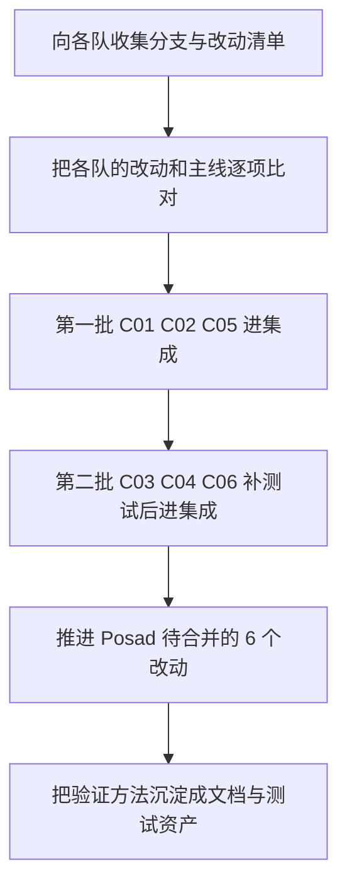

# Proj4 赛题总结

Proj4 的题目是"面向边缘智能的 AIOS 设计与优化"，任务是在 StarryOS 上打通一台网球捡拾机器人：摄像头采集画面，识别出网球，决定底盘怎么走，控制机械臂把球抓起来投进桶里。

这份总结讲两件事。前半部分讲各支队伍在这道题上分别做到了什么水平、谁领先、领先在哪里、别人又发现了哪些问题；后半部分讲这批工作现在放在什么地方、哪些值得收进 tgoskits 主线、按什么顺序推进。前半是读的，后半是动手用的。

比较只覆盖 RK3588 这一条线。这道题允许自由选硬件，但各队实际都落在 RK3588 这一代芯片上，数字可以直接并列。SG2002 是另一条独立路线，硬件档次差得远，放在一起比只能说明硬件差距，说明不了软件做得好不好，所以本篇不涉及，它的做法与部署见 [上手指南](./getting-started.md)。

## 1. 赛题与参赛队伍

这一节交代这道题考什么、有哪些队伍参加、各自从哪里出发，以及后面的数字该怎么读。

### 1.1 赛题内容

题目要求在一台真实的机器人上跑通完整的捡球闭环，并在这个过程中优化操作系统。完整闭环指：摄像头采到画面、识别出球的位置、底盘开过去、机械臂把球抓起来、再投进桶里，全程不需要人干预。

这道题的特殊之处在于它考的不是某个单点指标，而是一整条链路能不能连续稳定地跑。链路里任何一环出问题都会让机器人停下来，所以它同时压到了操作系统的好几个层面：USB 摄像头要能稳定采帧、NPU 要能跑推理、进程调度要跟得上控制回路的节奏、文件系统要扛得住长时间写入。后面各队发现的问题基本都出在这几个地方。

### 1.2 五支队伍与各自的起点

决赛材料可读的一共五支队伍，都用 StarryOS，都跑通了抓球闭环。

| 队伍 | 学校 | 硬件 | 做法取向 |
| --- | --- | --- | --- |
| Posad | 清华 | OrangePi 5 Plus / RK3588 | 边做边把成果拆成改动提回上游 |
| YatSenOS | 中山大学 | OrangePi 5 Plus / RK3588 | 从能跑示例到生产链路优化 |
| 火锅宇泡面 | 天津大学 | OrangePi 5 Plus / RK3588 | 用户态四层重构加系统层优化 |
| 大象飞出冰箱外 | 南开大学 | OrangePi 5 / RK3588S | 系统级适配加追球机器人 |
| 重返未来 | 吉林大学 | OrangePi 5 Plus / RK3588 | 现成机器人应用的内核迁移 |

既然五队都跑通了闭环，"能不能跑通"就没有区分度了，区分度在跑得有多快、跑的时候系统稳不稳。另有两支队伍（仪星队、球球别跑队）没有提供可读材料，不在本篇范围内。

大象用的是 RK3588S 而不是 5 Plus，芯片规格略低一档，看它的绝对数字时要留意。

五支队伍的分支起点差别很大，这一点直接决定了它们的改动里有多少是补上主线早就有的东西、有多少是真正的新增。下表列出各队的起点。

| 队伍 | 起点 | 与主线的关系 |
| --- | --- | --- |
| Posad | `oscomp-posad`，基于上游 `dev` 的 73409e079 | 接近主线，改动可以直接对照 |
| 大象 | 源自 atomgit 一条逆向移植线的本地版本，rdrive 0.18 | 结构和现在的代码差别很大 |
| 重返未来 | `pengzechen/tgoskits` 上一个旧布局的快照 | 旧线，部分能力上游已经重做过 |
| 火锅宇泡面 | StarryOS/tgoskits，没给分支版本 | 无法判断 |
| YatSenOS | StarryOS 分支，没给链接和版本 | 无法判断 |

这个表解释了很多后面的现象。Posad 的成果能大比例合进主线，一个前提就是它的起点接近主线，改动天然对得上。其他队伍要合进来，得先从各自的分支里把真正新增的部分挑出来，这一步做完之前，报告里的收益数字都不能直接搬过来用。

### 1.3 比较的口径

各队的计时方式并不统一，先说清楚，免得后面对数字产生误会。下表列出本篇用到的几类数字各自测的是什么。

| 指标 | 测的是什么 | 读的时候注意 |
| --- | --- | --- |
| 单帧推理 | 跑一次 `rknn_run()` 花的时间 | Posad 的 5.68 ms 是模型和驱动一起调过之后的结果，同一个模型没调过时约 37 ms |
| 采集到指令 | 从采集到发出电机指令的延迟 | 各队取的百分位不同，有的给 p50，有的给平均值 |
| 端到端 | 一整轮感知加控制的耗时 | 有的队把多帧流水线算进去，有的只算单帧 |
| 开机到可用 | 上电到程序能接受指令 | "可用"的定义不同，有算到进 shell 的，有算到程序起来的 |

比较只当量级看，不做精确排名。同一队的材料前后对不上时，取它标注得最清楚的那个，并在正文里说明。

## 2. 各队做到了什么水平

这一节把各队的数字摆在一起，并说明差距是怎么来的。只看数字容易得出错误结论，所以数字后面紧跟着讲各队起点的差异。

### 2.1 关键指标

下表把五支队伍在 RK3588 上的主要指标并列，用于判断差距是数量级级别还是几个百分点。

| 指标 | Posad | YatSenOS | 火锅宇泡面 | 大象 | 重返未来 |
| --- | --- | --- | --- | --- | --- |
| 单帧推理 | 5.68 ms | 34.5 ms | p50 约 177 ms | 没给单值 | 872 ms |
| 端到端 | p50 11.75 ms | 优化前 1147 ms | p50 约 398 ms | 控制循环 2.4–3.1 FPS | 首轮 5–6.5 s |
| 开机到可用 | 9.83 s | 优化后 6.8 s | 没给 | 约 26 s | 优化后 30–33 s |
| 其他 | 八线程跑分为 Linux 的 0.96 倍 | 输入链 18.05→8.92 ms | drive 成功率 94–98% | 三核墙钟约等于单核 | SD 卡写 185–213→13–24 ms |

即便只看量级，Posad 的单帧推理比第二名低六倍，端到端低一到两个数量级，这不是测量误差能解释的。

有两处数字本身就不自洽，引用时要小心。火锅宇泡面的端到端 p50 约 398 ms 来自一张图，评审时没能确认；重返未来记录了 872 ms 的单帧耗时，同时又说最高跑到约 10.7 FPS，两者对不上，它最后的终值也没有给出。

火锅宇泡面另有一组完整闭环总耗时（1959 ms 降到 363 ms），取自它的优化过程记录，和上表那一栏的 398 ms 不是同一次测量，两个数不要混用。

### 2.2 差距的三种性质

把数字和各队起点放在一起看，差距可以分成三类，性质完全不同，处理方式也不同。

第一类是**平台能力缺口**。Posad 把 RK3588 上从 NPU 到图像加速到调度的驱动补齐了，这些工作已经合进主线。其他队伍在各自的分支上重造了其中一部分，最典型的是三家各自修了不同版本的 NPU 驱动。这类差距不是能力问题，是各队分支互相看不见造成的重复劳动。

第二类是**起点差异带来的数字虚高**。有些队伍优化掉的瓶颈，在最新代码上早就修好了，他们的收益数字搬不到主线。判断方法很简单：拿最新的 `dev` 重跑一次，数字还在不在就清楚了。

第三类是**真正的新增**。有少数改动是主线确实还没有、其他队伍做出来了的。这部分是这次比赛相对主线最有价值的收获，第 4 节和第 6 节专门讲。

## 3. 领先队伍做到了哪一步

要给"哪项值得合并"下判断，先得把已经合进来的部分说清楚，免得把主线已有的能力当成待争取的目标。

### 3.1 已经合进主线的能力

Posad 一共提了 102 个改动，72 个被合入，其中 71 个进了 `dev`，另外 1 个进了别的分支。下表列出其中影响最大的几项。

| 层面 | 内容 | 编号 | 合入时间 |
| --- | --- | --- | --- |
| NPU 加速器 | NPU 显存管理与缓存标记 | #1364 | 2026-06-25 |
| 图像加速 | RGA2 二维加速驱动（`/dev/rga` 加 dma-heap） | #1388 | 2026-07-21 |
| 视频解码 | JPEG 硬解 VDPU720（`/dev/mpp_service`） | #1456 | 2026-07-02 |
| 板级 | PWM 接口、按需调频 | #1468、#1657 | 2026-07-02、2026-07-28 |
| 调度 | 跨核唤醒延迟、调度测试套 | #1495、#986 | 2026-07-08、2026-05-29 |
| 网络配置 | 配置 IPv4 地址的接口 | #1497 | 2026-07-05 |

这六项合起来覆盖了 RK3588 上视觉链路的整条硬件加速路径。有了它们，图像缩放、JPEG 解码和 NPU 推理都不再需要 CPU 顶上，这是 Posad 能跑到 5.68 ms 的硬件前提。现在的 `dev` 已经带着这些能力，下面讨论其他队伍的工作时要把这一层刨掉，只看它们在这之上还做了什么。

### 3.2 还没合完的部分

Posad 还有 6 个改动停在待合并状态，方向集中在：线程分发与大小核摆放（#1656）、缺页处理与页表维护（#1993、#2000、#2009）、大页拆分（#1990）、设备驱动的锁（#2003）。这个数按 2026-09-15 核对。

这批内容和已经合入的部分是同一档次，只是还没走完评审。对主线来说这是最省事的一块增量——作者还在，起点就是主线，不需要再找谁要代码，也不需要做分支比对。

另有三组已经由上游接续。性能测量那四个（#1577、#1601、#1602、#1603）由 #2274 整合，2026-09-13 合入 `dev`。从设备树读每核算力的 #2001、进程退出时回收设备锁的 #2072，按现在的分层重做成了 #2386 和 #2387，这两个也在 2026-09-13 当天合入 `dev`。依赖 #2001 那份算力数据的 #2064 没有跟进，已经关闭且没有合入，要做得按 #2386 的新接口重写。同一批关闭的还有大小核性能测量工具的 #1658，也在 2026-09-13。

这两项虽然没有进 `dev`，工作内容都在 `next` 上——`d66a5e476` 和 `cf836cfb1`，都是原作者提交的。`d66a5e476` 消费的是 `next` 自己那份算力数据（`76a81f4ce`），和 `dev` 里 #2386 落地的接口不是同一个，接主线时要把这一层对上。

### 3.3 领先来自哪里

Posad 的单帧推理 5.68 ms 比第二名低六倍，端到端 11.75 ms 比第二名低一到两个数量级。这个差距不是单点优化能解释的，拆开看有三个来源。

一是**硬件加速链完整**。RGA2、VDPU720、NPU 三项驱动打通之后，整条图像通路不需要 CPU 参与，而其他队伍大多还在用 CPU 做缩放和缓存维护。这一项的差距是数量级的。

二是**模型和驱动一起调**。5.68 ms 不是拿来一个模型直接跑的结果，同一个模型没做协同优化时约 37 ms。差距里有相当一部分来自模型侧的裁剪和后处理重写，比如后处理用四十万网格的整数域预筛把耗时从 12 ms 压到 1 ms，这部分和驱动无关，是纯算法工作。

三是**不追多核**。YatSenOS 实测多核只带来约 3% 的提升，Posad 也回退了第三个 NPU 核。两家从不同方向得到同一个结论：把公共提交路径改瘦比上多核并行更值钱。

## 4. 其他队伍发现了什么

Posad 的长处是把已知的路走通，其他队伍的价值则在发现了主线上还没人注意的问题。这一节按类别把这些真正新增的内容讲清楚，每一条都说三件事：这是什么毛病、影响多大、值不值得做。它们对应的具体处置动作在第 6 节。

### 4.1 内核本身的缺陷

这一类修的是内核缺陷，和 RK3588 无关，任何平台都可能踩到，通用价值最高。

**同页并发缺页的判定错误（大象）。** 两个线程同时访问同一个还没映射的页，后到的那个看到计数为零，误判成失败，而不是等前一个把页映射好。这个毛病单线程永远碰不到，是大象在三核跑基准时第一次撞上的。判断逻辑改起来不复杂，价值在于它揭示了一类问题：只在并发下才出现的缺陷，靠单线程测试是测不出来的。

**写时复制之后没刷指令缓存（重返未来）。** 一个可执行页被复制之后，指令缓存里还是旧的，取指取到全零，程序收到非法指令信号挂掉。这一条报告里说得比较含糊，证据不够硬，要先造出稳定的复现再说。

**先查锁后注册等待者（大象）。** 正确的顺序是先把自己登记进等待队列再去查锁，反过来的话，解锁方的通知会落在登记的间隙里被丢掉，线程就此睡死。这一条的目标代码已经从主线移走了，如果上游还有同样的写法，应该提到 arceos 去。

### 4.2 加速器与驱动路径

这一类是 RK3588 上特有的问题，集中在图像加速、NPU 和 USB 三条路径上。

**可缓存的 dma-heap 加按方向做缓存维护（YatSenOS）。** CPU 去读加速器写出来的内存，现在走的堆不能缓存，一次要 149.88 ms；换成可缓存的堆、再按读写方向分别做缓存维护，降到 6.15 ms，整条输入链从 18.05 ms 降到 8.92 ms。这个毛病不绑 RK3588，任何"CPU 读加速器输出"的场景都会遇到，是这一批里通用价值最高的一个。

**NPU 三核并发提交（大象）。** 三个核要一起跑的图，用串行提交会死锁，因为核和核之间有数据依赖。改法是每个核各自一个状态机，发射完就返回，统一轮询完成情况。主线现在的 NPU 驱动只有显存管理，没有这块。

**NPU 提交路径的错误处理（大象）。** 提交失败被日志吞掉、显存同步接口是个空壳、核编号数组会越界。这几处都是小改动，但都是真问题。

**USB 侧的两处修正。** 一处是 EHCI 的帧号回绕处理，另一处是 USB2 PHY 的复位顺序。都是通用控制器层面的问题，和具体应用无关。前者实测把完整 JPEG 的帧率从 19.9 提到 24.9。

### 4.3 调度与文件系统的策略

这一类的改动改的是系统行为而不是某个缺陷，收益大，风险也大，合并前要单独评审。

**按优先级分层的轮转调度加优先级感知唤醒（火锅宇泡面）。** 每一步改动单独测一遍的结果是：只把单队列改成分层队列，推理的 p50 就从 1741 ms 降到 626 ms；再叠加唤醒时的抢占判断，完整闭环总耗时从 1959 ms 降到 363 ms。这两个数字说明调度策略在这道题上的分量比想象中大得多。要注意的是，他们加的是一套新机制，不是第三套调度器，主线已有的两种调度器不能重复。

**文件系统写回改成显式（重返未来）。** 原来的实现在写数据和写元数据时都顺手做一次全量落盘，把这种隐式落盘去掉、只保留显式的 fsync、靠日志保证一致之后，close 从几秒降到毫秒级，启动时间从数百秒降到约 30 秒。方向是对的，和 Linux 上 ext4 的做法一致，但他们没有做掉电测试，合并前必须补上——这是策略变更，测不充分会丢数据。

**SD 卡识别阶段的修正（重返未来）。** 识别期把时钟降到约 100 kHz（原来 6.25 MHz 超出了规范）、排空 SCR 的接收缓冲、升频后验证失败自动退回。改动不大但设计完整，尤其是自动退回那一环。

### 4.4 用户态工具与验证方法

这一类不改内核，但决定了后面接手的人能不能快速判断改动有没有效。价值在方法，不在代码。

**JPEG 跨回调流式组装器（YatSenOS）。** UVC 的 MJPEG 帧会被拆成好几段回调送达，需要一个状态机按帧头帧尾标记重新拼起来，还要处理嵌套帧头、大小上限这些情况。任何处理 MJPEG 的用户态程序都用得上。这一项的验证也是所有候选里最扎实的：两千次随机分片、二十万帧、内存错误和未定义行为两类检查全开，再加上真机上的跨片恢复。

**四层验证（大象）。** 把测试分成四层：真实模型加字节级协议断言、静态链接自检、多核基准、真机跑。好处是没有硬件也能回归。

**完整闭环基准体系（火锅宇泡面）。** 用两个模式（一个只观察、一个真驱动）加九项阶段计时，输出 CSV，再配合每次只改一处的版本对照，能干净地判断每一步优化各自的贡献。

这三个方法，加上 Posad 的数值判定和重返未来的提交二分，互相印证了同一件事：不依赖硬件就能判定结果的验证，加上每次只动一处的对照，是这几支队伍共同的做法。这套方法值得沉淀成文档站的指南和测试资产，也可以直接用作以后邀请队伍贡献时的验收模板。

## 5. 这批工作现在在哪

前面讲的是比赛本身，从这一节开始转到动手的部分。先交代仓库的分支怎么组织，再说明这批工作分别停在哪个位置。

### 5.1 分支是怎么组织的

主线是 `dev`，所有改动都通过 PR 合进这里，克隆下来就能用，本篇说的"已经在主线"指的就是它。开发本身在各自的 `feat/*` 分支上做。

另有一条 `next`，是这批工作自己维护的集成缓冲区：把各个功能分支上验证过的工作合到一起做集成测试。要留意的是**它不在 `rcore-os/tgoskits` 上**，克隆主线是看不到的，目前放在 `BattiestStone4/tgoskits`。`next` 可以随时推倒重建，所以不要在上面写只属于它的代码。本篇后面提到 `next`，指的都是这一条。

日常的走法是：从 `dev` 切出 `feat/*` 开发，验证后进 `next` 做集成测试，最后以 PR 合回 `dev`。`next` 只负责集成验证，冲突回原来的功能分支去解。

### 5.2 仓库里已经有的资产

除了第 3 节列的驱动能力，主线上还有两块东西是接手时必须知道的，否则容易重做。

一块是**板级配置**。两块平台的板级描述文件、设备树都在 `os/StarryOS/configs/board/` 下，已经入库，加新板子能力优先加配置项而不是改代码路径。镜像打包模板（`.its`）也在同一个目录，目前只有 SG2002 那几块板有，RK3588 的还没有，见下表的缺口清单。

另一块是**板级测试用例**。`test-suit/starryos/` 下已经注册了各块目标板的用例，是用例发现规则的唯一入口，加测试要先看它的 `GUIDE.md`。

应用方面，主线上有一个 RK3588 的采集加推理示例：摄像头取 MJPEG 画面、跑 YOLOv8 推理、再把结果用 MJPEG 推出来，串口出现 `YOLO_RESULT` 就说明采集到推理这条链路是通的。动手改内核之前可以先拿它确认板子和环境都正常。

### 5.3 在 next 等合入

`next` 相对 `dev` 一共 108 个提交。合并前有两件事要注意：本地这份 `next` 领先远端 42 个提交还没推上去，得先推并重新验证；另外要按主题拆成多个 PR 分批合，每批合完直接更新这张表。

| 主题 | 内容 | 量级 |
| --- | --- | --- |
| 虚拟化与实时 | 实时执行器、预留实时核与心跳、虚拟机之间的有界邮箱、virtio-net 与统一的设备服务 | 约 32 个提交 |
| 内存与大页 | 透明大页、大页拆分、大页切分顺序、中间页表回收前刷新、驻留计数、预读窗口、页框分配 | 约 20 个提交 |
| 调度与多核运行 | 线程按核分发、CPU 亲和性继承、每线程 CPU 时间支持多核、调度内省 | 约 17 个提交 |
| 大小核基准与容量表 | 大小核基准、板级测试用例、从设备树读每核容量 | 约 16 个提交 |
| 设备锁与回收 | 设备锁按代标记、进程退出时回收、释放顺序 | 7 个提交 |
| 系统调用快路径 | 无定时器进程跳过定时器轮询、缺页返 ENOMEM | 2 个提交 |
| 合并与仓库杂项 | 与 `dev` 的合并提交、工作区依赖、忽略规则 | 约 14 个提交 |

表里的数是按提交信息归类数出来的，一条提交同时涉及多个主题时只算一次，所以各行是粗略值；总数 108 是可以精确复核的，把 `next` 从 `BattiestStone4/tgoskits` 取下来之后 `git rev-list --count <dev>..next` 就是。

这批里有一组编号（#2008、#2009、#1656、#1601、#1602）在本地所有分支的提交记录里都查不到，页表和大页的工作实际是以没有编号的提交落地的。#1577 和 #1603 是例外：整合性能测量那批的合并提交在正文里点到了它们，说吸收了这两份工作里的 ABI 部分、没有采用它们当时的分配器和 PID 模型。

这些编号对应的是上游的 PR，2026-09-13 核对的结论是：#2009 和 #1656 还开着，#2008、#1577 以及 #1601 到 #1603 已经关闭，其中性能测量那四个由 #2274 整合进 `dev`。

### 5.4 还没入库的

下面这些材料不在任何分支上，是这批工作收尾时的主要待办。每一项都给了建议去向。

| 材料 | 现在在哪 | 建议怎么办 |
| --- | --- | --- |
| 全流程捡球应用 | 只在工作区，没提交过 | 先提交进 `next` 做集成验证；其中的二进制和模型按 prebuilt 的方式处理 |
| RK3588 镜像打包模板 | 缺失，导致镜像生成不可复现 | 从构建产物恢复后入库，独立提交 |
| 镜像组装脚本 | 没入库 | 和上一条一起做成脚本放进 `scripts/` |
| 之前那份 SG2002 实操手册 | 已丢失 | 从备份重建后入库 |
| 两块板的底包镜像、固件二进制 | 本地或外部 | 不入库，在文档里写清获取方式 |
| 各队决赛报告原件 | 本地 | 永不提交进仓库 |

其中镜像打包模板和组装脚本这两项是卡住的——不补上，RK3588 的启动镜像就没法稳定复现。

## 6. 合并候选清单

这一节把第 4 节讲过的内容转成可执行的清单，按"该先做什么"分成四档。表里的编号只是为了讨论时方便指代某一条，没有别的含义。

### 6.1 建议优先评估

这几项通用价值高、改动集中，建议优先评估并入主线。

| 编号 | 来源 | 是什么 | 现在该做什么 |
| --- | --- | --- | --- |
| C01 | YatSenOS | 可缓存的 dma-heap 加按方向的缓存维护 | 向作者要分支，和现在的 dma-heap 代码对照 |
| C02 | 火锅宇泡面 | 按优先级分层的轮转调度加优先级感知唤醒 | 向作者要分支；拆成三块分别提交 |
| C03 | 大象 | NPU 三核并发提交 | 和主线的 NPU 驱动比对，先确认新增了什么 |
| C04 | 大象 | NPU 提交路径的错误处理 | 同上 |
| C05 | 大象 | 同页并发缺页的判定修正 | 先在最新代码上复现，写成主机侧测例 |
| C06 | 重返未来 | 文件系统写回改成显式 | 先确认现在的代码还在不在隐式落盘，再补掉电测试 |

排在最前面的是 C01 和 C02。C01 的效果用一组开关对照就能验证，C02 的收益有完整的逐项数据支撑，两项都不依赖具体的机器人应用。C03 和 C04 要先和主线比对，C05 和 C06 要先把测试补上。

### 6.2 建议先确认再评估

这几项有价值，但各队的分支起点和主线差别较大，必须先和主线逐项比对、弄清真正新增了什么，再决定要不要合。

| 编号 | 来源 | 是什么 | 先要确认什么 |
| --- | --- | --- | --- |
| C07 | YatSenOS | EHCI 帧号回绕加错误按包传播 | 和主线已有的 USB 主控代码逐行比对 |
| C08 | 大象 | USB2 PHY 的复位顺序 | 从那份九百多行的实现里剥出来，对照主线现状 |
| C09 | YatSenOS | JPEG 跨回调流式组装器 | 新增基本确定，要定放在共享库还是参考应用里 |
| C10 | 大象 | 四层验证 | 提成独立工具；模型和库走下载脚本，不进仓库 |
| C11 | 火锅宇泡面 | 完整闭环基准体系 | 作为板级应用的测试样板，和它的应用一起评估 |
| C12 | 重返未来 | SD 卡识别阶段的修正 | 和主线已有的 SD 改动比对，它的时钟策略可能和主线方向冲突 |
| C13 | 重返未来 | 校验和初值、文件系统标志两处小问题 | 先确认主线还有没有同样的毛病 |
| C14 | 重返未来 | 写时复制后没刷指令缓存 | 证据弱，先造复现 |
| C15 | 大象 | 先查锁后注册等待者 | 目标代码已不在主线，应该提到 arceos 上游 |
| C16 | 大象 | UVC 帧校验、中断传输的滚动环 | 只吸收设计点，不整体照搬 |

这一组的共同特点是报告里说得清楚，但代码和主线对不上。花的时间主要在比对和剥离，不在写代码。有两支队伍（火锅宇泡面、YatSenOS）没给出分支链接，要在这一步额外联系作者要材料。

### 6.3 只参考做法

有几项做法值得借鉴，但代码形态不适合直接合，建议作为设计参考重做；另有几项经核对后不建议采纳。

| 来源 | 做法 | 怎么用 |
| --- | --- | --- |
| YatSenOS | 启动优化：去掉登录脚本、精简 init、改用 shell 内建命令 | 背景是各自定制的根文件系统，不照搬；"用十四段计时定位瓶颈"和"降级三百多处日志只换来 2.86%"两个结论记下来 |
| YatSenOS | 模型重建与"多核收益只占 3%"的结论 | 支持"把公共提交路径改瘦比上多核并行值钱"这个判断 |
| 火锅宇泡面 | NPU 电源域的上电顺序 | 不直接合，按主线的时钟和电源框架重做 |
| 大象 | UVC 直接驱动 USB 主控的整体路线 | 和主线的通用栈方向相反，只取设计点 |
| 重返未来 | 页缓存改成无上限 | 方向对，但要有内存紧张时的回收 |
| 重返未来 | 从模拟到 QEMU 到真机的递进验证加提交二分 | 方法成熟，可以整理成指南 |
| 大象 | 排障纪律：先测量、再兜底保住现场、再挖根因、最后拆脚手架 | 那份十三个提交的复盘时间线可以当案例 |
| 重返未来 | 下位机应答失败改成限频的三分类日志 | 随应用生态一起吸收 |

下面三项经过核对不建议采纳：把 DMA 缓冲区的清零去掉（报告的因果解释不成立，疑似掩盖了底层真正的问题）、给每个显存对象加保护页（只是绕开越界，根因没修）、把每核定时器改成全局定时器（和 USB 刷新耦合，没有单独验证）。

### 6.4 已经在上游

有相当一部分被报告写成自研的内容，核对主线之后发现早就有了。接手时不要再重复提交。

| 来源 | 报告里的说法 | 主线的情况 |
| --- | --- | --- |
| 火锅宇泡面 | 显存池和显存缓冲区的生命周期管理 | 已有同构实现，对应 #1364 |
| 火锅宇泡面 | 调度相关的几组系统调用 | 已全量实现，比它给的子集更全，对应 #986 |
| 大象 | 终端对空格和 Tab 的处理、回显时换行转换 | 已放行，实现见 `os/StarryOS/kernel/src/pseudofs/dev/tty/terminal/ldisc.rs`，回显换行那部分来自 #1265 |
| 大象 | 终端控制命令 | 已有且更全 |
| 大象 | 计时用 128 位整数换算 | 已用 128 位 |
| 大象 | 跨核唤醒 | 已有，对应 #1495 |

还有一项要单独说明：大象用的动态驱动框架来自它接手的基线，该队在报告里自己就声明了不作原创主张。

## 7. 建议的推进顺序

清单要落到动作上才有意义。综合考虑依赖关系和验证成本，建议按下面的顺序推进，每一步做完再开始下一步。

第一步是收集材料。没有分支和提交范围就没法判断真正新增了什么，这一步不做，后面所有判断都只能靠报告里的文字。两支没给链接的队伍要优先联系。

第二步的比对是个分岔口：比下来发现主线已经有了的，直接记进 6.4 结掉；确认是新增的，按 6.1 和 6.2 分档。这一步的产出是一份收敛后的清单，而不是一份更长的清单。

第三步和第四步按验证成本排序，验证方式明确的先走。第一批三项里，C01 用一组开关对照就能看出效果，C02 有现成的逐项数据可以复算，C05 能写成主机侧的并发测例；第二批三项都要先补测试才敢上板，C06 要补掉电测试，C03 和 C04 可以先用 QEMU 上的 NPU 仿真做无板验证。

第五步那 6 个改动虽然是待评审状态，但数量不少，排在这里可以让前面几批先把集成的流程跑顺。

最后一步容易被省掉，但它是这次比赛最不该丢的东西：验证方法比某个具体改动活得久，沉淀下来之后，下一批队伍的成果可以直接按同一套标准验收。

除了其他队伍的候选，仓库自己这边还有两件事要先做：把本地领先的 42 个提交推到远端并重新验证，以及补齐第 5.4 节里那两个卡住的镜像文件。

## 8. 接手一条候选要做什么

这一节给出从一个候选到一次提交的完整动作，以及没有硬件时怎么验证。

### 8.1 标准流程

拿到一条候选，按这五步走：

第一，向原作者要分支和它的起点版本。没有这两样，后面每一步都做不了。

第二，从分叉的地方开始比对，把真正新增的部分挑出来。不要整条分支合进来——各队的起点和主线差得远，直接合会把大量旧代码和已被取代的实现一起带进来。

第三，在最新的 `dev` 上重做一次对照。报告里的收益数字多数是在各队自己的旧基线上测的，必须在现在的代码上重新测一遍，数字还在才算数。

第四，补一个确定性的回归测例。这一步不能省：先写测例、确认它在改之前是失败的，再改代码、确认同一个测例通过。只做事后验证的改动不算数。

第五，按下面的要求提交。

### 8.2 没有硬件也能验证的部分

大部分内核工作不需要板子就能推进，按成本从低到高有三层：QEMU 系统测试、主机侧单元测试、内核测试。写回归测例时优先选这三层里最低的一层——能在主机上确定性复现的毛病不必上 QEMU，能上 QEMU 的不必等板卡。

NPU 相关的改动也有无板验证的办法：Posad 做了一个 QEMU 上的 NPU 功能级仿真，能覆盖一部分验证，不用等真机。

### 8.3 提交时的要求

验证入口统一走 `cargo xtask` 命令族，直接用原生的 `cargo build`、`cargo test`、`cargo clippy` 跑 StarryOS 属于违规。改完代码先跑定向的静态检查，再跑格式化，不要用 `allow` 属性把警告压下去。

集成验证分三层，提交前对照自己改动的影响面选要过哪几层：第一层是受影响的配置在容器里全量编译，第二层是 QEMU 加各套测试，第三层是真机验证。前两层本地就能复现，第三层需要板卡。

PR 提交到 `dev`，标题用英文、按约定式提交的格式写，正文用中文，说清要解决的问题、实际改了什么、每一步为什么这么做。分支上补了提交之后记得同步更新 PR 描述。纯文档改动不需要跑集成验证。push 和对外发言之前先跟维护者确认。

写代码前要遵守的规范、以及具体的命令，见 [上手指南](./getting-started.md) 的 7.3 和 7.4 两节。

## 9. 结论

这次比赛在 RK3588 上留下的东西可以分三类看。

第一类是**已经拿到的能力**。Posad 把整条硬件加速链路补齐并合进了主线，71 个改动覆盖 NPU、图像加速、视频解码、板级、调度和网络配置。这部分不需要再争取，它是当前主线的起点，也是后面所有比较的基准。

第二类是**各队在主线之外找到的问题**。这一类最有价值。内核里那个只在并发下才出现的缺页判定错误、"CPU 读加速器输出"这条路径的缓存处理、调度分层带来的数量级收益、文件系统隐式落盘的代价——这些都不是某一块板特有的问题，而是主线自己还没暴露出来的。它们的共同点是短时间演示里不会出现，只有在真实负载、多核并发、长时间运行下才会现形。

第三类是**重复劳动**。五支队伍里有三家各自修了不同版本的 NPU 驱动，两家没给分支链接导致无法判断改了什么。根源是各队从较旧的主线快照起步，互相看不见，也看不见上游已经有的能力。这类工作对主线的贡献有限，但它是可以避免的，办法就是第一步里那份收集清单——把起点和改动范围先对齐。

从 tgoskits 的角度看，这次比赛真正的收获不是某一个性能数字，而是第二类问题和方法。机器人这类连续运行的场景，确实是检验操作系统质量的有效手段：单线程测试永远碰不到并发缺页，短时间演示也永远碰不到文件系统写回的代价。

最后要如实说明的是，Posad 的成绩有很大一部分来自它自己的工作方式——保持接近主线的起点，边做边把成果拆成可以独立评审的改动提上来。这个做法本身也值得其他队伍借鉴，它决定了做出来的东西最后能留下多少。

## 10. 相关材料

下面这些是跟进这批工作时会反复用到的文档和入口，按用途列在一起。

| 材料 | 位置 | 用途 |
| --- | --- | --- |
| 仓库说明 | `README.md`、`README_CN.md` | 环境准备与三条系统路径入口 |
| 官方文档站 | https://rcore-os.cn/tgoskits/ | 在线阅读版 |
| StarryOS 快速上手 | 站内快速入门分类 | `xtask` 命令与板级测试通道的细节 |
| 测试用例指南 | `test-suit/starryos/GUIDE.md` | 用例的发现与增改规则 |
| 编码规范 | `AGENTS.md`，以及 `.agents/skills/` 下与改动类型匹配的技能 | 写代码前按情况选读 |
| 贡献说明 | `os/StarryOS/CONTRIBUTING.md` | 行为准则与提交流程 |
| 各队决赛报告原件 | 本地保存，不入库 | 本篇数字与说法的原始出处 |
