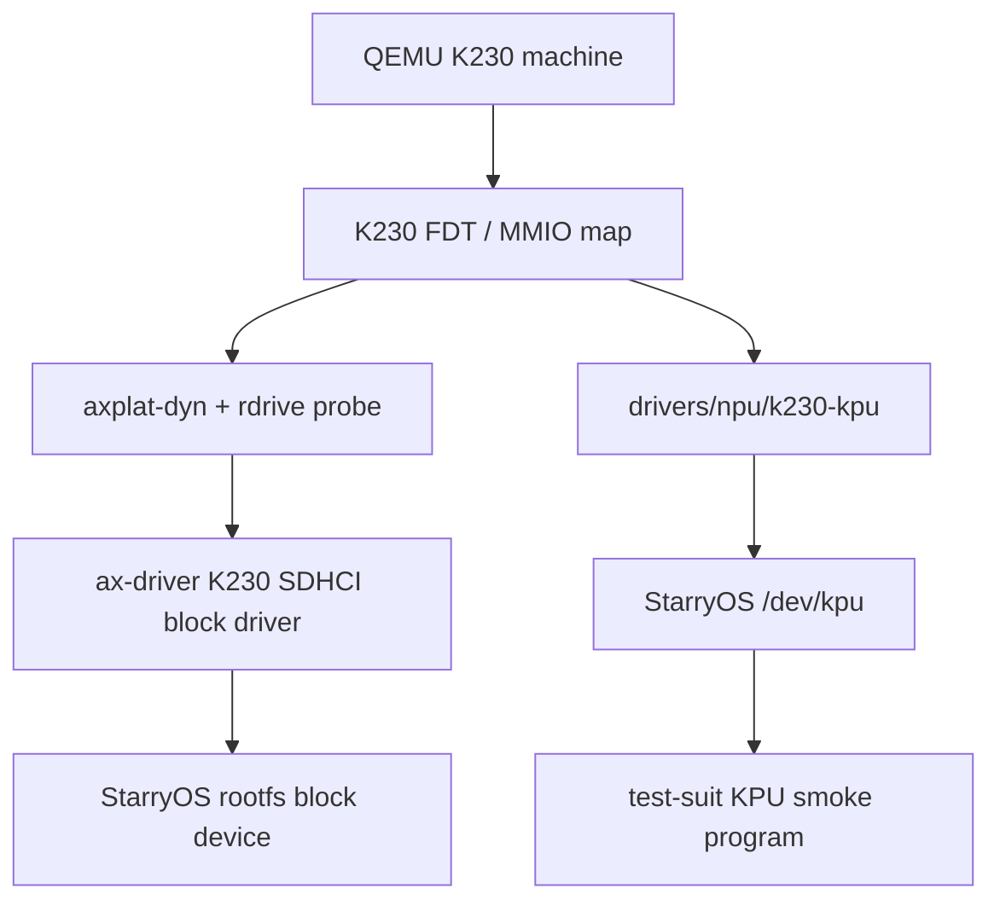

# StarryOS K230 KPU QEMU 适配报告

## 1. 任务目标

本阶段任务是在 StarryOS 中基于 QEMU 的 K230 machine 完成 K230 NPU
基础适配。K230 的 NPU 在芯片文档和 QEMU 模型中称为 KPU，因此代码和
用户态 ABI 均使用 `kpu` 命名。

本阶段交付目标包括：

1. 在 StarryOS 中提供 `/dev/kpu` 和 `/dev/kpu0` 设备节点。
2. 提供最小但可扩展的 KPU 寄存器级 driver crate。
3. 提供用户态可共享的 KPU UAPI 头文件，避免测试程序复制 ioctl 和 mmap 常量。
4. 在 K230 QEMU machine 上跑通一个 KPU smoke test。
5. 基于当前上游重构方向继续推进 `plat-dyn` 和 `rdif-block` 适配，避免继续依赖旧的静态 RISC-V 平台。

## 2. 相关仓库和基线

本任务涉及三个代码来源：

| 仓库 | 用途 |
| --- | --- |
| `rcore-os/tgoskits` | StarryOS/ArceOS 主仓库，本适配代码提交到这里 |
| `zevorn/qemu` 的 `chao-k230-dev` 分支 | 提供 K230 machine、KPU 模型、K230 SDHCI 模型 |
| `zevorn/kunos` | 前期发行版参考，主要用于确认 K230 QEMU 启动参数 |

本地 QEMU 代码位于：

```text
/Users/joshua/tmp/qemu
```

已确认该 QEMU 分支中与本任务相关的关键硬件事实：

| 项 | 值 |
| --- | --- |
| QEMU machine | `-machine k230` |
| KPU CFG MMIO | `0x8040_0000`, size `0x800` |
| KPU L2 memory | `0x8000_0000`, size `0x20_0000` |
| KPU IRQ | `189` |
| KPU command start register | `0x100` |
| KPU command end register | `0x104` |
| KPU command high register | `0x108` |
| KPU control register | `0x128` |
| KPU status low/high registers | `0x130`, `0x134` |
| SDHCI1 MMIO | `0x9158_1000`, size `0x1000` |
| SDHCI1 IRQ | `144` |
| SD rootfs 参数 | `-drive if=sd,format=raw,file=...` |

## 3. 上游 PR 评论和路线调整

PR 评论中给出的关键信息是：

1. RISC-V 平台已经在 #961 中转向 `plat-dyn`/FDT 动态平台。
2. block 设备栈正在 #976 中从旧的 `rd-block` 迁移到 `rdif-block` submit/poll 接口。
3. 旧的静态 `ax-plat-riscv64-k230` 路线会与 #961 和 #976 产生方向冲突。

因此当前桥接分支采用如下策略：

| 决策 | 原因 |
| --- | --- |
| 不继续推进静态 K230 platform crate | 它会和 `plat-dyn` 方向冲突 |
| 基于最新 `upstream/dev` 建立干净 PR 分支 | #976 已合并，K230 适配应直接面向老师要求的 `upstream/dev` |
| 保留已经验证过的 KPU driver/UAPI/devfs 代码 | 这些部分不依赖旧 block 栈，迁移风险低 |
| 将 K230 SD rootfs 支持放到 `ax-driver` 的 FDT block driver | 符合 #961 的动态平台探测路径 |
| 保留旧验证分支但不作为 PR 基线 | 旧分支保留完整实验历史，提交 PR 使用干净 upstream/dev 分支 |

当前本地 PR worktree：

```text
/Users/joshua/tmp/tgoskits/target/worktrees/tgoskits-k230-upstream-dev
```

当前本地 PR 分支：

```text
codex/k230-kpu-upstream-dev
```

该分支基于：

```text
upstream/dev
```

## 4. 总体架构

当前适配采用四层结构：



各层职责：

| 层 | 职责 |
| --- | --- |
| QEMU K230 machine | 提供 K230 CPU、PLIC、UART、SDHCI、KPU MMIO 和 IRQ 模型 |
| FDT | 描述 K230 外设地址、IRQ、compatible 字符串和启动内存 |
| `axplat-dyn` | 根据 FDT 初始化动态平台和 rdrive probe |
| `ax-driver/k230-sdhci` | 根据 FDT 发现 K230 SDHCI，注册 `rdif-block` block device |
| `drivers/npu/k230-kpu` | 封装 KPU 寄存器和命令流编程规则 |
| StarryOS devfs | 暴露 `/dev/kpu` 和 `/dev/kpu0` 给用户态 |
| test-suit | 构建并运行 KPU smoke program，验证设备节点、ioctl、mmap、寄存器写入和一次最小命令提交 |

## 5. 文件变更清单

### 5.1 KPU driver crate

```text
drivers/npu/k230-kpu/
```

该 crate 是 no_std driver crate，提供：

| 符号 | 含义 |
| --- | --- |
| `KPU_CFG_PADDR` | KPU CFG MMIO 物理地址 |
| `KPU_CFG_SIZE` | KPU CFG MMIO 大小 |
| `KPU_L2_PADDR` | KPU L2 memory 物理地址 |
| `KPU_L2_SIZE` | KPU L2 memory 大小 |
| `CommandRange` | 用户态传入的命令流物理地址范围 |
| `KpuInfo` | 用户态查询到的 KPU CFG/L2/IRQ 资源描述 |
| `Kpu::program_command` | 写入 command start/end/high 三个寄存器 |
| `Kpu::run_command` | clear done、program command、start |
| `Kpu::wait_done` | driver core 内的轮询等待 KPU done status，StarryOS glue 会优先使用 IRQ 等待 |

命令地址约束：

1. `start_paddr < end_paddr`，空范围会被拒绝。
2. `start_paddr` 和 `end_paddr` 必须位于同一个 4GiB 地址窗口。
3. 低 32 位分别写入 `COMMAND_START` 和 `COMMAND_END`。
4. 高 32 位写入 `COMMAND_HI`。

这些约束对应 QEMU KPU 模型的 command stream 地址组合方式：

```text
command_start = COMMAND_HI << 32 | COMMAND_START
command_end   = COMMAND_HI << 32 | COMMAND_END
```

### 5.2 用户态 UAPI 头文件

```text
drivers/npu/k230-kpu/include/k230_kpu_uapi.h
```

该头文件提供：

| 内容 | 目的 |
| --- | --- |
| `/dev/kpu` 和 `/dev/kpu0` 路径宏 | smoke test 和未来用户态 runtime 共享 |
| KPU ioctl 常量 | 避免测试代码复制魔数 |
| KPU mmap offset 常量 | 约定 CFG 和 L2 的 mmap 入口 |
| KPU MMIO 寄存器 offset | smoke test 可读回寄存器验证 ioctl 行为 |
| KPU done status 常量 | smoke test 和未来用户态 runtime 可直接判断完成状态 |
| `struct k230_kpu_command_range` | 与 Rust `CommandRange` 保持 ABI 一致 |
| `struct k230_kpu_info` | 与 Rust `KpuInfo` 保持 ABI 一致，供用户态展示 FDT 探测到的资源 |

Rust crate 中有单元测试检查 UAPI header 和 Rust 常量一致，包括：

1. `CommandRange` size 为 16 字节。
2. `start_paddr` offset 为 0。
3. `end_paddr` offset 为 8。
4. `KpuInfo` size 为 40 字节，字段 offset 为 `0/8/16/24/32/36`。
5. ioctl、mmap、MMIO 常量和 header 完全一致。

### 5.3 StarryOS devfs 设备节点

```text
os/StarryOS/kernel/src/pseudofs/dev/kpu.rs
os/StarryOS/kernel/src/pseudofs/dev/mod.rs
```

启用 `starry-kernel/k230-kpu` feature 后，devfs 会注册：

| 节点 | DeviceId | 说明 |
| --- | --- | --- |
| `/dev/kpu` | major `240`, minor `1` | 主 KPU 设备节点 |
| `/dev/kpu0` | major `240`, minor `1` | 兼容别名 |

当前支持的文件操作：

| 操作 | 行为 |
| --- | --- |
| `read_at` | 以 32-bit little/native endian 读取 KPU CFG 寄存器 |
| `write_at` | 以 32-bit 写 KPU CFG 寄存器 |
| `ioctl(KPU_IOC_GET_STATUS)` | 返回 64-bit status |
| `ioctl(KPU_IOC_GET_INFO)` | 返回 CFG/L2/IRQ 资源信息和来源 flag |
| `ioctl(KPU_IOC_GET_IRQ_COUNT)` | 返回 KPU IRQ handler 已处理的中断次数，供 smoke 验证 IRQ 路径 |
| `ioctl(KPU_IOC_CLEAR)` | 写 control clear bit |
| `ioctl(KPU_IOC_PROGRAM_COMMAND)` | 写 command start/end/high 寄存器 |
| `ioctl(KPU_IOC_START)` | 写 control start bit |
| `ioctl(KPU_IOC_RUN)` | program command 后 start |
| `ioctl(KPU_IOC_WAIT_DONE)` | IRQ 优先等待 done，超时后使用轮询兜底 |
| `mmap(KPU_MMAP_CFG_OFFSET)` | mmap KPU CFG MMIO |
| `mmap(KPU_MMAP_L2_OFFSET)` | mmap KPU L2 memory |

在 `plat-dyn` 下，`KpuDevice::probe()` 会从 rdrive 保存的 FDT 中查找
`compatible = "canaan,k230-kpu"` 的 enabled node。探测成功后：

1. 第一个 `reg` range 作为 KPU CFG MMIO。
2. 第二个 `reg` range 作为 KPU L2 memory。
3. `interrupts` 解码为 KPU IRQ，目前在 K230 QEMU 中为 `189`。
4. 用户态可通过 `KPU_IOC_GET_INFO` 看到这些资源，并通过 `KPU_INFO_F_FDT`
   确认资源来自 FDT。
5. 如果 IRQ handler 注册成功，`KPU_IOC_GET_INFO` 会设置
   `KPU_INFO_F_IRQ_WAIT`，表示 `KPU_IOC_WAIT_DONE` 已启用 IRQ 优先等待。

内核态 `read_at`/`write_at`/`ioctl` 访问 KPU CFG 寄存器时不能直接使用
`phys_to_virt`。在 `plat-dyn` 下，RAM 会被线性映射，但 KPU CFG 是 MMIO 设备
窗口，不属于 RAM 线性区。最终实现使用 `axklib::mem::iomap` 为
`0x8040_0000..0x8040_0800` 建立内核 MMIO 映射；否则在 K230 QEMU 上执行
`pread(/dev/kpu)` 会触发 supervisor page fault，fault address 为
`0xffffffc080400000`，也就是 `phys_to_virt(0x8040_0000)`。

当前 `WAIT_DONE` 已接入 KPU IRQ 189：KPU probe 成功后注册 IRQ handler，
handler 只负责唤醒 `WaitQueue`，不在中断上下文中执行长路径；用户态调用
`KPU_IOC_WAIT_DONE` 时先等待 IRQ/状态条件，短超时后再使用 driver core 的
轮询逻辑兜底。

### 5.4 K230 动态平台配置

```text
os/StarryOS/configs/board/k230-canmv.toml
os/StarryOS/configs/board/k230-canmv.dts
os/StarryOS/configs/board/k230-canmv.dtb
os/StarryOS/configs/qemu/qemu-k230.toml
```

`k230-canmv.toml` 现在使用动态平台：

```toml
env = { SOMEBOOT_RISCV64_KERNEL_LOAD_PADDR = "0x08200000" }
features = [
  "k230",
]
log = "Info"
plat_dyn = true
target = "riscv64gc-unknown-none-elf"
```

`starryos` 的 `k230` feature 展开为：

```toml
k230 = [
  "plat-dyn",
  "starry-kernel/k230-kpu",
  "ax-driver/k230-sdhci",
  "ax-driver/serial",
]
```

这意味着 K230 启动不再选择静态 `ax-hal/riscv64-*` 平台，而是走：

```text
StarryOS feature k230
  -> plat-dyn
  -> axplat-dyn
  -> rdrive FDT probe
  -> ax-driver/k230-sdhci
```

`SOMEBOOT_RISCV64_KERNEL_LOAD_PADDR` 必须保留。`someboot` 的 RISC-V 默认
kernel load paddr 是 QEMU virt 常用的 `0x8020_0000`；K230 QEMU/OpenSBI
direct boot 的 Domain0 next address 是 `0x0820_0000`。如果不覆盖，
StarryOS 早期输出会显示：

```text
Domain0 Next Address : 0x0000000008200000
VM Load @0x80200000
KImg 0x00000080200000 - 0x00000008e00000
Mapping early memory regions...
```

这会让 someboot 以错误的物理加载地址构造 KImage 映射，并在 early mapping
阶段卡住。最终修复是在 `someboot` build script 中生成
`KERNEL_LOAD_ADDRESS` 常量，并允许 RISC-V 目标通过
`SOMEBOOT_RISCV64_KERNEL_LOAD_PADDR` 覆盖物理加载地址。默认值仍保持
`0x8020_0000`，因此默认 QEMU virt 路径不变。

K230 DTS 的 `chosen.bootargs` 使用：

```text
console=ttyS0,115200 earlycon=sbi root=/dev/mmcblk0 rootwait rw
```

这里没有使用 `root=/dev/mmcblk1p2`，原因是当前 test-suit 生成的是整盘 raw
ext4 image，没有分区表。StarryOS block root 选择器发现 `k230-sdhci` 后将其
作为 disk0 raw device，因此应显式匹配 `/dev/mmcblk0`。实际 smoke 日志中已确认：

```text
block device 0 (k230-sdhci) has no usable partition table; treating the whole disk as a candidate
matched root by raw device path on disk0 raw device
selected root device: disk0 raw device
```

K230 DTS 中关键节点：

```dts
sd1: mmc@91581000 {
    compatible = "canaan,k230-sdhci", "snps,dwcmshc-sdhci";
    reg = <0x0 0x91581000 0x0 0x1000>;
    interrupts = <144>;
    interrupt-parent = <&plic>;
    bus-width = <4>;
    max-frequency = <50000000>;
    cap-sd-highspeed;
    disable-wp;
    no-mmc;
    no-sdio;
    status = "okay";
};

kpu: kpu@80400000 {
    compatible = "canaan,k230-kpu";
    reg = <0x0 0x80400000 0x0 0x800>;
    interrupts = <189>;
    interrupt-parent = <&plic>;
    status = "okay";
};
```

### 5.5 K230 SDHCI `rdif-block` driver

```text
drivers/ax-driver/src/block/k230_sdhci.rs
```

该 driver 是 #976 基线上的新增 bridge 适配，目标是替代旧的静态平台 SDHCI1 注册。

Probe 入口：

```text
compatible = "canaan,k230-sdhci", "snps,dwcmshc-sdhci"
```

初始化流程：

1. 从 FDT `reg` 读取 SDHCI MMIO base 和 size。
2. 使用 `axklib::mmio::ioremap_raw` 映射 MMIO。
3. 构造 `sdhci_host::Sdhci`。
4. 执行 `reset_all`。
5. 打开 3.3V power。
6. 启用 SDHCI interrupt status。
7. 安装 DMA capability。
8. 使用 `sdmmc_protocol::SdioSdmmc` 初始化 SD 卡。
9. 根据 FDT `interrupts` 解码 IRQ。
10. 使用 `PlatformDeviceBlock::register_block_with_irq` 注册 `rdif-block` device。

I/O 路径：

```text
rdif-block Request
  -> K230 BlockQueue::submit_request
  -> sdhci_host::submit_read_blocks / submit_write_blocks
  -> DMA path first
  -> FIFO fallback if DMA cannot be used
  -> poll_block_request
```

该实现复用 #976 中已有的 `sdhci-host` 和 `sdmmc-protocol` submit/poll 合约，避免新写一套 block 协议层。

### 5.6 QEMU rootfs patch

```text
scripts/axbuild/src/rootfs/qemu.rs
```

K230 QEMU rootfs 使用：

```text
-drive if=sd,format=raw,file=...
```

这和默认 virtio rootfs 不同。若不特殊处理，通用 rootfs patch 会额外追加：

```text
-device virtio-blk-pci,drive=disk0
-drive id=disk0,if=none,format=raw,file=...
-device virtio-net-pci,netdev=net0
-netdev user,id=net0
```

这会污染 K230 machine 的启动参数。因此当前逻辑新增：

1. 识别 `-drive` 参数中的 `if=sd`。
2. 只替换该 drive 的 `file=`。
3. 如果配置中没有显式网络参数，不额外注入 virtio net。
4. 不额外注入 virtio block device。

新增单元测试：

```text
ensure_disk_boot_net_patches_sd_drive_without_adding_virtio
```

该测试验证 K230 风格 `if=sd` drive 只替换 rootfs image 路径。

### 5.7 K230 QEMU test-suit

```text
test-suit/starryos/k230-qemu/
```

该 test group 独立于默认 StarryOS `normal` group，因为它依赖带 K230 machine/KPU model 的 QEMU binary。

Smoke case：

```text
test-suit/starryos/k230-qemu/qemu-k230/kpu-smoke/
```

测试程序覆盖：

| 检查项 | 目的 |
| --- | --- |
| open `/dev/kpu` | 验证主设备节点存在 |
| open `/dev/kpu0` | 验证别名设备节点存在 |
| `pread` reg0 | 验证 CFG MMIO read path |
| `KPU_IOC_GET_STATUS` | 验证 status ioctl |
| `KPU_IOC_CLEAR` | 验证 clear done ioctl |
| empty command range | 验证非法 command range 被拒绝 |
| valid command range | 验证 command start/end/high 寄存器被正确写入 |
| mmap CFG | 验证 CFG mmap |
| mmap L2 | 验证 L2 memory mmap 和读写 |
| `KPU_IOC_RUN` + `KPU_IOC_WAIT_DONE` | 往 KPU L2 写入一个最小 command word，通过 QEMU KPU 模型触发 start、done status 和 clear 路径 |

成功标志：

```text
KPU_SMOKE_PASS
```

失败标志：

```text
KPU_SMOKE_FAIL:
```

## 6. QEMU 启动参数

K230 QEMU 配置：

```toml
args = [
  "-L",
  "${workspace}/target/qemu-k230/pc-bios",
  "-machine",
  "k230",
  "-smp",
  "1",
  "-m",
  "2G",
  "-nographic",
  "-dtb",
  "${workspace}/os/StarryOS/configs/board/k230-canmv.dtb",
  "-drive",
  "if=sd,format=raw,file=${workspace}/tmp/axbuild/rootfs/rootfs-riscv64-alpine.img",
]
```

其中：

1. `-machine k230` 选择 QEMU K230 machine。
2. `-dtb` 使用仓库内 K230 DTB，使 StarryOS 动态平台能走 FDT probe。
3. `-drive if=sd` 将 rootfs 挂到 QEMU K230 SD1 插槽。
4. `-L target/qemu-k230/pc-bios` 指向 K230 QEMU 分支匹配的固件目录。

KPU node 当前声明两个 `reg` range：

```dts
kpu: kpu@80400000 {
    compatible = "canaan,k230-kpu";
    reg = <0x0 0x80400000 0x0 0x800>,
          <0x0 0x80000000 0x0 0x200000>;
    reg-names = "cfg", "l2";
    interrupts = <189>;
    interrupt-parent = <&plic>;
    status = "okay";
};
```

这样 StarryOS devfs 可以从 DTB 中确认 CFG、L2 和 IRQ，而不是只依赖内核
常量。

## 7. 验证方法

### 7.1 Docker 环境

项目默认实验环境为 Docker/Linux。后续验证均应在 Docker 环境下进行。

基础镜像：

```text
starryos-dev:ubuntu-qemu10.2.1
```

常用 PATH：

```sh
export PATH=/opt/qemu-10.2.1/bin:/opt/x86_64-linux-musl-cross/bin:/opt/riscv64-linux-musl-cross/bin:/opt/aarch64-linux-musl-cross/bin:/opt/loongarch64-linux-musl-cross/bin:$PATH
```

### 7.2 Rust 单元测试

KPU driver crate：

```sh
cargo test -p k230-kpu
```

axbuild rootfs patch：

```sh
cargo test -p axbuild ensure_disk_boot_net_patches_sd_drive_without_adding_virtio
```

### 7.3 Clippy

KPU driver crate：

```sh
cargo xtask clippy --package k230-kpu
```

K230 SDHCI driver 所在 crate：

```sh
cargo clippy -p ax-driver \
  --target riscv64gc-unknown-none-elf \
  --features k230-sdhci \
  -- -D warnings
```

StarryOS K230 目标 clippy 应使用 K230 实际 target、feature 和 someboot
加载地址配置：

```sh
SOMEBOOT_RISCV64_KERNEL_LOAD_PADDR=0x08200000 \
cargo clippy -p starry-kernel \
  --target scripts/targets/pie/riscv64gc-unknown-none-elf.json \
  -Z unstable-options -Z json-target-spec -Z build-std=core,alloc \
  --features k230-kpu,plat-dyn \
  -- -D warnings
```

K230 board 构建验证：

```sh
cargo xtask starry build -c os/StarryOS/configs/board/k230-canmv.toml --arch riscv64
```

### 7.4 K230 QEMU smoke test

准备本地 QEMU wrapper：

```sh
mkdir -p target/qemu-k230/bin
ln -sf /mnt/tmp/tgoskits/target/qemu-k230-docker-build/qemu-system-riscv64 \
  target/qemu-k230/bin/qemu-system-riscv64
ln -sfn /mnt/tmp/qemu/pc-bios target/qemu-k230/pc-bios
```

运行：

```sh
PATH="$PWD/target/qemu-k230/bin:$PATH" \
cargo xtask starry test qemu --test-group k230-qemu --arch riscv64 -c kpu-smoke
```

期望输出包含：

```text
KPU_SMOKE: opened /dev/kpu
KPU_SMOKE: opened /dev/kpu0
KPU_SMOKE: reg0=0x00000000
KPU_SMOKE: info cfg=0x80400000+0x800 l2=0x80000000+0x200000 irq=189 flags=0x3
KPU_SMOKE: status=0x0000000000000000
KPU_SMOKE: clear_done ok
KPU_SMOKE: empty_command_rejected errno=22
KPU_SMOKE: program_command start=0x80000000 end=0x80000004 hi=0x00000000
KPU_SMOKE: mmap_status=0x0000000000000000
KPU_SMOKE: l2_mmap_rw=0x4b505532
KPU_SMOKE: run_wait_done status=0x0000000400000004 irq_count=0->1
KPU_SMOKE_PASS
```

## 8. 当前完成状态

| 项 | 状态 |
| --- | --- |
| KPU no_std driver crate | 已完成 |
| KPU UAPI header | 已完成，包含 command range、info 查询 ABI、done status 常量和 IRQ 计数查询 |
| StarryOS `/dev/kpu` 和 `/dev/kpu0` | 已完成，节点来自 K230 FDT 探测 |
| K230 DTS/DTB | 已迁移到 `plat-dyn` 路线，KPU node 描述 CFG/L2/IRQ |
| K230 QEMU 参数 | 已完成 |
| K230 `if=sd` rootfs patch | 已完成 |
| K230 SDHCI `rdif-block` bridge driver | 已完成并通过 QEMU rootfs 挂载验证 |
| KPU smoke test | 已通过 K230 QEMU，覆盖 FDT info ioctl、IRQ-backed wait flag、IRQ 计数递增、CFG/L2 mmap、寄存器编程和最小命令 run/wait done |
| someboot RISC-V K230 load paddr 覆盖 | 已完成并通过 `VM Load @0x8200000` 验证 |
| 现有 PR 上的静态平台路线 | 不再继续扩展，等待 bridge 验证后替换 |

## 9. 风险和后续工作

### 9.1 K230 SDHCI 行为差异

K230 QEMU 使用自定义 `k230-sdhci` 设备，标准 SDHCI register window 为前 `0x100` 字节，后续为 vendor register window。当前 StarryOS driver 只依赖标准 SDHCI register 和 QEMU capability register。

如果后续真实硬件或更完整模型需要 vendor PHY 初始化，应在 `drivers/ax-driver/src/block/k230_sdhci.rs` 中加入 K230 专用 vendor init，而不是把逻辑放回平台层。

### 9.2 KPU IRQ

当前 KPU 完成等待已经接入 IRQ 189。QEMU KPU 模型会在完成时拉高 IRQ，
StarryOS devfs 的 IRQ handler 唤醒等待队列，`KPU_IOC_WAIT_DONE` 再通过
读取 status 确认 done。该实现仍保留轮询兜底，以覆盖 IRQ 注册失败或非 IRQ
环境。

后续增强方向：

1. 在 `/dev/kpu` 中提供 poll/eventfd 语义，支持用户态事件循环。
2. 在真实硬件或更完整 QEMU 模型上验证 IRQ 电平清除和 PLIC complete 时序。
3. 将 IRQ 计数暴露为调试文件，方便不用专用 ioctl 的人工检查。

### 9.3 更完整的 KPU runtime

本阶段已经验证 command register 编程、CFG/L2 mmap、基础 ioctl，以及向 QEMU
KPU 模型提交一个最小 command word 并等待 done。后续如果要跑真实模型，还需要：

1. 确认用户态模型 runtime 的 command stream 格式。
2. 确认输入/输出 buffer 的物理地址分配方式。
3. 确认 KPU L2 与普通内存之间的数据搬运策略。
4. 补充模型级 smoke test，例如可检查输出 buffer 内容的 GNNE command 或 QEMU KPU fake output 验证。

## 10. 推荐合并策略

当前推荐流程：

1. 在 bridge 分支上完成 Docker 内完整验证。
2. 等 #976 合入 `dev` 后，把 bridge 分支 rebase 到最新 `upstream/dev`。
3. 确认 rebase 后仍通过：
   - `cargo fmt --check`
   - `cargo test -p k230-kpu`
   - `cargo test -p axbuild ensure_disk_boot_net_patches_sd_drive_without_adding_virtio`
   - `cargo xtask clippy --package k230-kpu`
   - `cargo xtask clippy --package axbuild`
   - `cargo clippy -p ax-driver --target riscv64gc-unknown-none-elf --features k230-sdhci -- -D warnings`
   - `SOMEBOOT_RISCV64_KERNEL_LOAD_PADDR=0x08200000 cargo clippy -p starry-kernel --target scripts/targets/pie/riscv64gc-unknown-none-elf.json -Z unstable-options -Z json-target-spec -Z build-std=core,alloc --features k230-kpu,plat-dyn -- -D warnings`
   - `cargo xtask starry build -c os/StarryOS/configs/board/k230-canmv.toml --arch riscv64`
   - K230 QEMU smoke test
4. 用 bridge 分支替换现有 PR 中旧的静态 platform 改动。

这样既不阻塞当前开发进度，也避免把已经被上游路线淘汰的静态平台代码继续做大。
