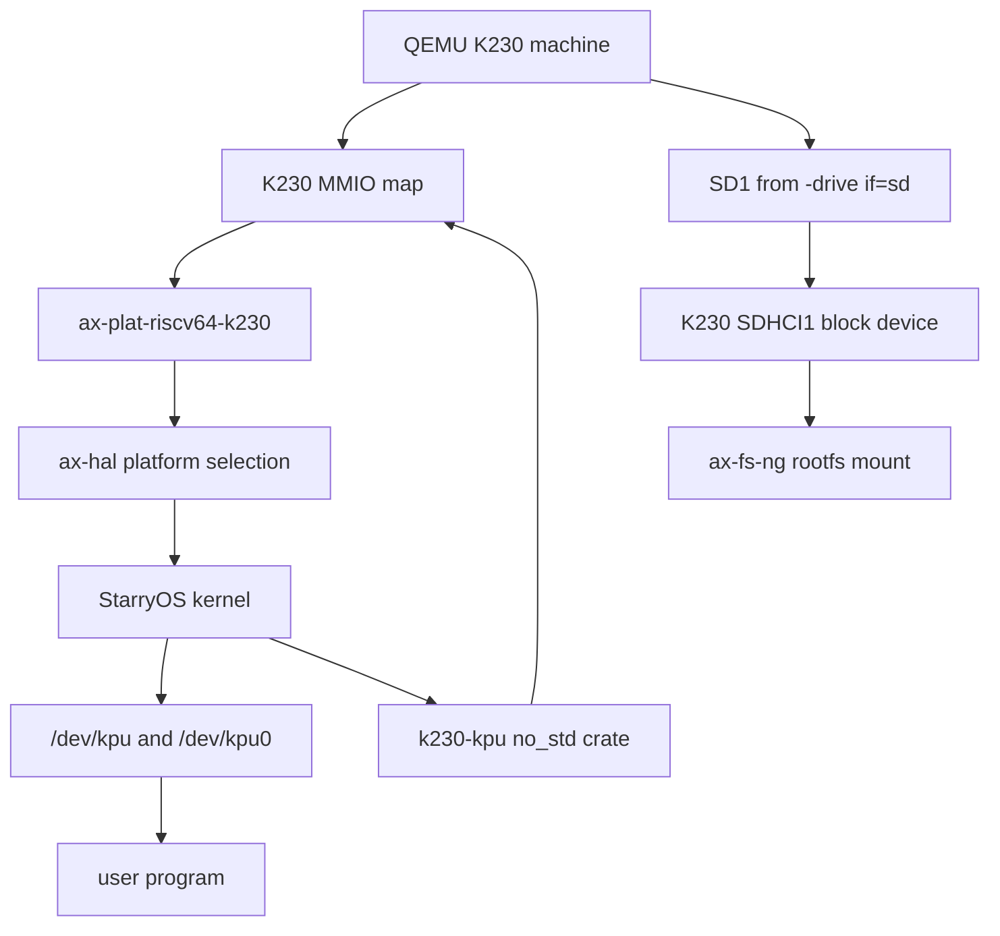

# StarryOS K230 KPU/NPU QEMU 适配阶段一报告

最后更新：2026-05-27

## 摘要

本报告记录 StarryOS 基于 QEMU K230 平台完成 KPU/NPU 第一阶段适配的背景、设计依据、实现路径、调试过程和验证结果。K230 芯片中的 NPU 设备在官方命名中称为 KPU，因此本文统一使用“KPU”指代该 NPU 设备。

阶段一的目标不是完成完整 AI 推理应用栈，而是先建立可在 QEMU K230 上启动 StarryOS、识别 SD rootfs、暴露 KPU 设备节点，并提供用户态访问 KPU 模型所需的最小内核接口。当前结果已经达到以下状态：

- StarryOS 能通过 QEMU K230 direct boot 启动。
- K230 SD1/SDHCI rootfs 路径可用，系统能从 SD raw ext4 镜像挂载根文件系统。
- StarryOS 能进入用户态 shell。
- `/dev/kpu` 与 `/dev/kpu0` 已创建，用户态可读取 KPU CFG 寄存器。
- 内核提供 KPU 命令流编程、启动、清 done、查询状态、等待完成和 mmap 的基础 ABI。
- K230 平台、设备树、QEMU 参数和 axbuild rootfs patch 均已纳入仓库配置。
- 关键构建、单元测试、clippy 和 QEMU smoke 均已完成验证。

## 背景与输入资料

本任务围绕以下两个外部参考仓库展开：

- `https://github.com/zevorn/qemu/tree/chao-k230-dev`：QEMU K230 平台与 KPU 模型来源。用户已将该仓库 clone 到 `/Users/joshua/tmp/qemu`。
- `https://github.com/zevorn/kunos`：已能在 QEMU K230 上启动的发行版参考，提供 K230 QEMU 启动参数、设备树和 rootfs 接入方式。

StarryOS 适配工作目录：

```sh
/Users/joshua/tmp/tgoskits/target/worktrees/tgoskits-k230-kpu
```

开发分支：

```sh
codex/k230-kpu-starry
```

目标 PR 基线：

```sh
upstream/dev
```

默认实验环境为 Docker/Linux，使用项目已有镜像：

```sh
starryos-dev:ubuntu-qemu10.2.1
```

本阶段记录对应的版本基线：

| 项目 | 分支或版本 | commit/说明 |
| --- | --- | --- |
| StarryOS 基线 | `upstream/dev` | `567de5162` |
| StarryOS 开发分支 | `codex/k230-kpu-starry` | 基于 `upstream/dev` 创建，用于提交阶段一适配 |
| QEMU K230 模型 | `chao-k230-dev` | `/Users/joshua/tmp/qemu`，commit `539bd41` |
| Docker 镜像 | `starryos-dev:ubuntu-qemu10.2.1` | StarryOS 构建、QEMU 构建和 smoke 验证环境 |
| rootfs 镜像 | `rootfs-riscv64-alpine.img` | raw ext4 filesystem，不带分区表 |

## 阶段一目标与边界

### 已完成目标

阶段一重点解决“StarryOS 能不能在 QEMU K230 上启动，并把 QEMU KPU 模型以稳定内核接口暴露给用户态”的问题。具体目标如下：

1. 增加 K230 平台支持，使 StarryOS 可选择 `riscv64-k230` 平台构建。
2. 对齐 QEMU K230 direct boot 的内存布局、UART、timer、PLIC、CLINT、SDHCI 和 KPU 地址。
3. 接入 QEMU `-drive if=sd,...` 对应的 SD1 rootfs，使 StarryOS 能挂载根文件系统。
4. 新增可复用的 no_std KPU 驱动 crate，封装 KPU MMIO 寄存器与命令流编程逻辑。
5. 在 StarryOS `/dev` 下提供 `/dev/kpu` 和 `/dev/kpu0`，支持 read/write/ioctl/mmap。
6. 增加 board/qemu 配置，使 K230 构建和手动 QEMU smoke 可复现。
7. 记录适配过程中的关键问题、根因、修复方式和验证命令。

### 暂未纳入阶段一的内容

以下内容属于后续阶段工作，不作为本阶段完成标准：

- 使用真实 KPU command stream 完成端到端模型推理。
- 将 KPU IRQ completion 接入 StarryOS 用户态事件通知。本阶段已记录 KPU IRQ，并提供轮询等待路径。
- 固化面向应用的高级 KPU runtime 或 SDK API。本阶段只提供低层设备 ABI。
- 在物理 K230 板卡上验证。本阶段目标为 QEMU K230。
- 验证多核启动。本阶段 QEMU 参数与平台配置均采用 `-smp 1`。

## QEMU K230 与 KPU 事实整理

### QEMU 启动模型

QEMU K230 使用机器型号：

```sh
-machine k230
```

当前验证路径采用 direct boot，核心参数包括：

- `-smp 1`
- `-m 2G`
- `-nographic`
- `-dtb os/StarryOS/configs/board/k230-canmv.dtb`
- `-drive if=sd,format=raw,file=...`

StarryOS 构建配置中设置 `to_bin = true`，使 `cargo xtask starry build` 生成可被 QEMU direct boot 加载的 `starryos.bin`。运行 QEMU 时使用 `-kernel target/riscv64gc-unknown-none-elf/release/starryos.bin` 加载内核，并用 `-L /mnt/tmp/qemu/pc-bios` 指向 QEMU 仓库中的 firmware/BIOS 资源目录。

direct boot 相关地址：

| 项目 | 地址或值 | 说明 |
| --- | --- | --- |
| OpenSBI 加载地址 | `0x0800_0000` | QEMU K230 固定布局 |
| kernel 加载地址 | `0x0820_0000` | StarryOS kernel direct boot 起点 |
| DTB 加载地址 | `0x0a00_0000` | QEMU K230 direct boot 传入设备树 |
| timebase | `27_000_000` | 设备树和平台配置保持一致 |
| UART0 | `0x9140_0000`, IRQ `16` | 控制台使用 |
| SD0 | `0x9158_0000`, IRQ `142` | 当前未作为 rootfs 使用 |
| SD1 | `0x9158_1000`, IRQ `144` | QEMU `-drive if=sd` 对应路径 |
| PLIC | `0xf000_00000`, size `0x0040_0000` | 外部中断控制器 |
| CLINT | `0xf040_00000`, size `0x0040_0000` | timer/IPI |

### KPU 模型

QEMU `chao-k230-dev` 分支中 KPU 模型的关键信息：

| 项目 | 值 | 说明 |
| --- | --- | --- |
| KPU L2 base | `0x8000_0000` | KPU L2/cache 窗口 |
| KPU L2 size | `0x0020_0000` | 2 MiB |
| KPU CFG base | `0x8040_0000` | KPU 控制寄存器窗口 |
| KPU CFG size | `0x800` | 2 KiB |
| KPU IRQ | `189` | QEMU 模型完成后触发 |
| `COMMAND_START` | `0x100` | 命令流起始物理地址低 32 位 |
| `COMMAND_END` | `0x104` | 命令流结束物理地址低 32 位 |
| `COMMAND_HI` | `0x108` | 命令流物理地址高 32 位 |
| `CONTROL` | `0x128` | 控制寄存器 |
| `STATUS_LO` | `0x130` | 状态低 32 位 |
| `STATUS_HI` | `0x134` | 状态高 32 位 |
| clear done | `0x4` 写入 `CONTROL` | 清完成状态 |
| start | `0x9` 写入 `CONTROL` | 启动命令流执行 |
| done status | `0x0000_0004_0000_0004` | QEMU 模型完成后的 done mask |

QEMU 模型的执行路径是：guest 将命令流物理地址写入 `COMMAND_START`、`COMMAND_END` 和 `COMMAND_HI`，随后向 `CONTROL` 写入 start 值。QEMU 读取该物理地址范围内的命令流，执行 GNNE 模型逻辑，完成后设置 done 状态并触发 KPU IRQ。

## 总体设计

本次适配按“可复用驱动 crate、平台层、StarryOS 设备节点、构建配置”四层拆分，避免把 QEMU/K230 专用逻辑散落在 StarryOS 通用路径中。



设计原则：

- KPU 寄存器常量和命令流编程逻辑放入 `drivers/npu/k230-kpu`，便于未来被其他 OS glue 或测试复用。
- K230 地址空间、启动页表、UART、PLIC、CLINT 和 SDHCI1 block 设备放入 `platforms/ax-plat-riscv64-k230`。
- StarryOS 只负责将 KPU 作为 `/dev` 字符设备暴露给用户态，并完成 user pointer copy、VFS error 映射和 mmap 策略。
- axbuild 只处理 QEMU 参数 patch，不把 K230 rootfs 错误地转换成 VirtIO 设备。

## 代码改动清单

| 路径 | 类型 | 作用 |
| --- | --- | --- |
| `drivers/npu/k230-kpu/` | 新增 crate | KPU no_std 驱动核心，定义寄存器、ioctl、mmap offset 和命令流编程接口 |
| `platforms/ax-plat-riscv64-k230/` | 新增平台 crate | K230 平台配置、启动页表、UART、timer、PLIC、SDHCI1 block 注册 |
| `os/StarryOS/kernel/src/pseudofs/dev/kpu.rs` | 新增设备节点实现 | `/dev/kpu` 与 `/dev/kpu0` 的 read/write/ioctl/mmap |
| `os/StarryOS/kernel/src/pseudofs/dev/mod.rs` | 修改 | 在启用 `k230-kpu` feature 时创建 KPU 设备节点 |
| `os/StarryOS/kernel/Cargo.toml` | 修改 | 增加 `k230-kpu` feature 和依赖 |
| `os/StarryOS/starryos/Cargo.toml` | 修改 | 增加 `k230` feature，联动 `ax-hal/riscv64-k230` 与 `starry-kernel/k230-kpu` |
| `os/arceos/modules/axhal/Cargo.toml` | 修改 | 接入 `ax-plat-riscv64-k230` optional dependency 和 feature |
| `os/arceos/modules/axhal/build.rs` | 修改 | 增加 `riscv64-k230 -> ax_plat_riscv64_k230` 平台选择 |
| `os/arceos/modules/axhal/src/lib.rs` | 修改 | 更新平台支持说明 |
| `scripts/axbuild/src/build.rs` | 修改 | 识别 `riscv64-k230` 平台 feature |
| `scripts/axbuild/src/starry/build.rs` | 修改 | Starry build 中将 `k230` 转换为 K230 平台 feature |
| `scripts/axbuild/src/rootfs/qemu.rs` | 修改 | 保留并 patch `-drive if=sd,...`，避免注入 VirtIO rootfs |
| `os/StarryOS/configs/board/k230-canmv.*` | 新增 | K230 board 配置和 DTB |
| `os/StarryOS/configs/qemu/qemu-k230.toml` | 新增 | QEMU K230 参数 |
| `Cargo.toml`, `Cargo.lock` | 修改 | 纳入新增 crate |

## KPU 驱动 crate 设计

新增 crate：

```text
drivers/npu/k230-kpu
```

该 crate 为 `#![no_std]`，只封装与 KPU 模型直接相关的硬件语义，不依赖 StarryOS VFS 或用户态 ABI。核心类型和常量包括：

- `KPU_CFG_PADDR = 0x8040_0000`
- `KPU_CFG_SIZE = 0x800`
- `KPU_L2_PADDR = 0x8000_0000`
- `KPU_L2_SIZE = 0x20_0000`
- `KPU_IRQ = 189`
- `CommandRange { start_paddr: u64, end_paddr: u64 }`
- `Kpu { base_vaddr }`

`CommandRange` 使用物理地址表示命令流范围。驱动会把命令流地址拆成 KPU 模型需要的三个 32 位寄存器字段：

```text
COMMAND_START = start_paddr[31:0]
COMMAND_END   = end_paddr[31:0]
COMMAND_HI    = start_paddr[63:32]
```

当前校验规则：

- `start_paddr < end_paddr`，空范围视为无效。
- `start_paddr` 与 `end_paddr` 必须位于同一个 4 GiB window 内，否则无法用一个 `COMMAND_HI` 表达。

主要方法：

| 方法 | 作用 |
| --- | --- |
| `program_command(range)` | 写入命令流起止地址 |
| `run_command(range)` | clear done、program command、start 三步合并 |
| `clear_done()` | 向 `CONTROL` 写入 `0x4` |
| `start()` | 向 `CONTROL` 写入 `0x9` |
| `status()` | 读取 `STATUS_HI:STATUS_LO` 组成 64 位状态 |
| `is_done()` | 使用 `DONE_STATUS` mask 判断完成 |
| `wait_done(poll_limit)` | 轮询 done 状态，超限返回 timeout |
| `read_reg(offset)` | 32 位 volatile MMIO read |
| `write_reg(offset, value)` | 32 位 volatile MMIO write |

该 crate 自带单元测试，覆盖命令流地址拆分、空范围拒绝和跨 4 GiB window 拒绝。

## StarryOS `/dev/kpu` ABI

StarryOS 在启用 `k230-kpu` feature 时创建两个设备节点：

```text
/dev/kpu
/dev/kpu0
```

两个节点指向同一个底层 KPU 设备，设备号为：

```text
major = 240
minor = 1
```

节点 flags：

```text
NodeFlags::NON_CACHEABLE
```

### read/write 语义

`read_at` 和 `write_at` 用于低层调试 KPU CFG 寄存器：

- 访问单位为 32 bit。
- offset 必须 4 字节对齐。
- offset 必须位于 KPU CFG window 内。
- read 返回 native endian 的 4 字节寄存器值。
- write 使用输入 buffer 前 4 字节写寄存器。

该接口主要用于 smoke 和调试，例如：

```sh
od -An -tx4 -N4 /dev/kpu
```

### ioctl 语义

当前 ioctl 编号在 `k230-kpu` crate 中集中定义：

| ioctl | 值 | arg | 语义 |
| --- | --- | --- | --- |
| `KPU_IOC_GET_STATUS` | `0x4b00` | `u64 *status` | 复制 64 位状态到用户态 |
| `KPU_IOC_CLEAR` | `0x4b01` | ignored | 清 done 状态 |
| `KPU_IOC_PROGRAM_COMMAND` | `0x4b02` | `CommandRange *range` | 编程命令流地址 |
| `KPU_IOC_START` | `0x4b03` | ignored | 启动已编程命令流 |
| `KPU_IOC_RUN` | `0x4b04` | `CommandRange *range` | clear、program、start 合并操作 |
| `KPU_IOC_WAIT_DONE` | `0x4b05` | `usize poll_limit` | 轮询等待 done；arg 为 0 时使用默认 `1_000_000` |

用户态传入的 `CommandRange` C ABI 布局：

```c
struct CommandRange {
    uint64_t start_paddr;
    uint64_t end_paddr;
};
```

StarryOS 设备层使用 `user_copy` 在内核态和用户态之间复制 ioctl 参数。空指针或 copy 失败会转换为 VFS error。

### mmap 语义

`/dev/kpu` 支持将 KPU CFG 和 KPU L2 映射给用户态：

| mmap offset | 等价物理地址 offset | 映射目标 | 最大长度 |
| --- | --- | --- | --- |
| `0` | `0x8040_0000` | KPU CFG | `0x800` |
| `0x1000` | `0x8000_0000` | KPU L2 | `0x20_0000` |

设计上同时接受短 offset 和物理地址 offset，是为了兼容两类用户态写法：

- 以设备内部 offset 表达资源，例如 offset `0x1000` 表示 KPU L2。
- 以物理地址表达资源，例如 offset `0x8000_0000` 表示 KPU L2。

## K230 平台 crate 设计

新增平台 crate：

```text
platforms/ax-plat-riscv64-k230
```

该平台基于现有 RISC-V QEMU virt 平台结构调整，但移除了 K230 不使用的 VirtIO/PCI 默认路径，改为静态注册 K230 外设。

### 地址空间配置

核心配置位于 `platforms/ax-plat-riscv64-k230/axconfig.toml`：

| 项目 | 值 |
| --- | --- |
| `arch` | `riscv64` |
| `platform` | `riscv64-k230` |
| `package` | `ax-plat-riscv64-k230` |
| `max-cpu-num` | `1` |
| `phys-memory-base` | `0x0820_0000` |
| `phys-memory-size` | `0x77e0_0000` |
| `kernel-base-paddr` | `0x0820_0000` |
| `kernel-base-vaddr` | `0xffff_ffc0_0820_0000` |
| `phys-virt-offset` | `0xffff_ffc0_0000_0000` |
| `timer-frequency` | `27_000_000` |
| `uart-paddr` | `0x9140_0000` |
| `uart-irq` | `16` |
| `uart-clock` | `50_000_000` |
| `sd1-paddr` | `0x9158_1000` |
| `sd1-irq` | `144` |
| `kpu-cfg-paddr` | `0x8040_0000` |
| `kpu-l2-paddr` | `0x8000_0000` |
| `kpu-irq` | `189` |

### MMIO 范围

平台声明的 MMIO ranges 包含：

- KPU L2：`[0x8000_0000, 0x0020_0000]`
- SRAM：`[0x8020_0000, 0x0020_0000]`
- KPU CFG + FFT + AI2D：`[0x8040_0000, 0x0000_2000]`
- RTC：`[0x9100_0c00, 0x0000_0400]`
- STC：`[0x9110_8000, 0x0000_0800]`
- UART0：`[0x9140_0000, 0x0000_1000]`
- SD0：`[0x9158_0000, 0x0000_1000]`
- SD1：`[0x9158_1000, 0x0000_1000]`
- PLIC：`[0xf000_00000, 0x0040_0000]`
- CLINT：`[0xf040_00000, 0x0040_0000]`

这里将 KPU CFG、FFT、AI2D 合并成一段 `0x2000` 范围，是为了解决页粒度映射时的重复映射问题，详见“问题与修复记录”。

### 启动页表

K230 direct boot 的 kernel base 为 `0x0820_0000`。平台启动页表需要覆盖：

- kernel 物理加载区。
- high-half kernel 映射。
- KPU/L2/外设所需的 direct map 区间。
- PLIC/CLINT 所在的高地址 MMIO 区间。

这保证进入 Rust 代码后，`phys_to_virt` 与早期 MMIO 访问都能使用一致地址规则。

### UART

K230 UART0 使用 DW APB UART 路径，初始化参数：

- baud rate：`115200`
- UART clock：`50_000_000`
- MMIO base：`0x9140_0000`

设备树中 `stdout-path` 也指向 `serial0:115200n8`，与 StarryOS 控制台保持一致。

## SDHCI1 与 rootfs 路径

QEMU K230 的 rootfs 接入方式与常规 QEMU virt 不同。常规 virt 平台常用 VirtIO block；K230 参考启动路径使用：

```sh
-drive if=sd,format=raw,file=...
```

该参数会把镜像挂到 K230 SD1，而不是 VirtIO block。为此阶段一做了两部分适配。

### 平台侧 SDHCI1 block 注册

`ax-plat-riscv64-k230` 新增静态 SDHCI1 probe：

- probe level：`PostKernel`
- 设备名：`k230-sdhci1`
- MMIO：`0x9158_1000`
- size：`0x1000`
- IRQ：`144`

初始化流程：

1. 使用 `axklib::mmio::ioremap_raw` 映射 SD1 MMIO。
2. 创建 `sdhci_host::Sdhci`。
3. 执行 `reset_all()`。
4. 设置 3.3V power。
5. 开启 controller interrupts。
6. 使用 `sdmmc_protocol::SdioSdmmc` 初始化卡。
7. 初始化策略设置为 `CardInitPreference::SdFirst`。
8. 关闭 UHS 和高速模式选择，优先保证 QEMU SD card 基础路径稳定。
9. 使用 `rd-block` 封装成 StarryOS 可注册 block device。

当前 block queue 使用 FIFO 传输模式：

```text
BlockTransferMode::Fifo
```

这样可以避免第一阶段引入额外 DMA/IOMMU 变量，先确保 rootfs 可读写路径稳定。

### axbuild QEMU rootfs patch

`scripts/axbuild/src/rootfs/qemu.rs` 原本在 `EnsureDiskBootNet` 模式下会补充标准 VirtIO disk/net 参数。该逻辑对 QEMU virt 合理，但对 K230 会破坏预期路径，因为 K230 已经显式配置了 `-drive if=sd,...`。

阶段一调整为：

- 如果 QEMU args 中已存在 `-drive` 且参数包含 `if=sd`，只替换其中的 `file=`。
- 不额外注入 VirtIO block device。
- 不额外注入 VirtIO net device。
- 如果不存在 SD drive，则保留原有 VirtIO fallback 逻辑。

新增测试覆盖：

```sh
cargo test -p axbuild ensure_disk_boot_net_patches_sd_drive_without_adding_virtio
```

## Board 与 QEMU 配置

### Board 配置

新增：

```text
os/StarryOS/configs/board/k230-canmv.toml
```

内容要点：

```toml
features = [
  "k230",
]
log = "Info"
plat_dyn = false
target = "riscv64gc-unknown-none-elf"
```

`k230` feature 会联动：

- `ax-hal/riscv64-k230`
- `starry-kernel/k230-kpu`

### 设备树

新增：

```text
os/StarryOS/configs/board/k230-canmv.dts
os/StarryOS/configs/board/k230-canmv.dtb
```

DTS 基于 Kunos 的 K230 CANMV 设备树整理，并补充：

- `timebase-frequency = <27000000>`
- memory 起点与 direct boot kernel 地址对齐。
- UART0 stdout。
- SD1 `compatible = "snps,dwcmshc-sdhci"`。
- KPU node：

```dts
kpu: kpu@80400000 {
    compatible = "canaan,k230-kpu";
    reg = <0x0 0x80400000 0x0 0x800>,
          <0x0 0x80000000 0x0 0x200000>;
    interrupts = <189>;
};
```

### QEMU 配置

新增：

```text
os/StarryOS/configs/qemu/qemu-k230.toml
```

关键参数：

```toml
args = [
  "-machine", "k230",
  "-smp", "1",
  "-m", "2G",
  "-nographic",
  "-dtb", "${workspace}/os/StarryOS/configs/board/k230-canmv.dtb",
  "-drive", "if=sd,format=raw,file=${workspace}/tmp/axbuild/rootfs/rootfs-riscv64-alpine.img",
]
uefi = false
to_bin = true
fail_regex = ["(?i)\\bpanic(?:ked)?\\b"]
```

`to_bin = true` 用于生成 QEMU direct boot 可加载的 `starryos.bin`。

## 问题与修复记录

### QEMU 源码获取

最初尝试从远端直接 clone 或下载 `zevorn/qemu` 的 `chao-k230-dev` 分支时，受网络和沙箱限制影响，出现过 HTTP/2 cancel、early EOF、archive 下载中断等现象。后续用户已将仓库 clone 到：

```sh
/Users/joshua/tmp/qemu
```

因此后续 QEMU 构建和 smoke 验证均使用该本地路径。

### Docker QEMU 构建依赖

项目镜像可用于 StarryOS 构建与 QEMU K230 验证：

```sh
starryos-dev:ubuntu-qemu10.2.1
```

构建 QEMU K230 时需要额外安装：

```sh
apt-get update
apt-get install -y libfdt-dev device-tree-compiler
```

运行已构建的 QEMU K230 binary 时需要 `libfdt1`。如果在同一容器内安装 `libfdt-dev`，运行时依赖通常会一并满足；如果把 QEMU binary 复制到其他运行环境，需要确认 `libfdt1` 是否存在。

### KPU/FFT/AI2D MMIO overlap

早期 Starry K230 smoke 进入内核后，在 `axmm` 初始化阶段 panic：

```text
failed to initialize kernel address space: AxErrorKind::AlreadyExists
```

根因是 KPU CFG、FFT、AI2D 三段 MMIO 在 QEMU 地址图中相邻，且每段小于 4 KiB。平台配置按子页粒度分别声明后，页表映射时会按 4 KiB 对齐，导致同一页或相邻页被重复映射。

修复方式：

```text
[0x8040_0000, 0x0000_2000]
```

将 KPU CFG、FFT、AI2D 合并为一段 MMIO range 后，`axmm` 初始化通过。

### rootfs block device 缺失

修复 MMIO overlap 后，系统继续进入平台设备和文件系统初始化，但出现：

```text
failed to determine root device from available block devices
```

panic 位置：

```text
os/arceos/modules/axfs-ng/src/lib.rs:39:13
```

根因是 K230 平台当时还没有把 QEMU K230 的 SDHCI1 注册成 StarryOS block device。QEMU 参数和 axbuild rootfs patch 已经把 rootfs 指向 `-drive if=sd,...`，但内核侧没有 block 设备可供 `ax-fs-ng` 挂载。

修复方式：

- 在 `ax-plat-riscv64-k230` 中增加静态 SDHCI1 注册。
- 使用 `sdhci-host` + `sdmmc-protocol` 初始化 SD card。
- 使用 `rd-block` 适配 StarryOS block device interface。
- 保持 rootfs QEMU 参数为 `if=sd`，不切换到 VirtIO。

修复后 QEMU smoke 日志确认：

```text
k230-sdhci: probe SD1 at [PA:0x91581000, SZ:0x1000)
k230-sdhci: card kind=... capacity_blocks=Some(2097152)
k230-sdhci: block device registered irq=144
```

随后 `ax-fs-ng` 能识别并挂载 ext4 rootfs。

### raw ext4 镜像识别

当前测试使用的 rootfs：

```sh
/Users/joshua/tmp/tgoskits/tmp/axbuild/rootfs/rootfs-riscv64-alpine.img
```

该镜像是 raw ext4，而不是带分区表的整盘镜像。因此 `ax-fs-ng` 会输出类似：

```text
no usable partition table; treating the whole disk as a candidate
```

这是镜像形态导致的预期结果，不是 SDHCI 注册失败，也不是 rootfs mount 异常。

当前 QEMU smoke 的 `-append` 中仍保留 `root=/dev/mmcblk0p2 rootwait rw`，用于对齐 Kunos/Linux 风格启动参数。但 StarryOS 当前 rootfs 识别实际依赖 `ax-fs-ng` 对 block device 的探测：由于测试镜像是 whole-disk raw ext4，最终会按整盘 ext4 candidate 挂载，而不是按 `p2` 分区挂载。后续若切换为带分区表镜像，需要重新确认 `root=`、SD1 设备命名和分区选择策略。

### clippy 目标选择

默认实验环境为 Docker/Linux。通用命令：

```sh
cargo xtask clippy --package starry-kernel
```

不会读取 `k230-canmv.toml`，也不会自动切换到 `riscv64gc-unknown-none-elf`。从 `scripts/axbuild/src/clippy.rs` 的展开逻辑看，如果 crate 没有 docs.rs target 元数据，它会生成不带 `--target` 的 `cargo clippy -p starry-kernel` 以及 feature 矩阵检查。因此在 Docker 中该命令对应 Linux host target 检查，不等价于 K230 board/target 检查。

为覆盖本次真实启动路径，阶段一按 `cargo xtask starry build` 打印出的 K230 target 参数执行 clippy，目标是：

```text
target = scripts/targets/no-pie/riscv64gc-unknown-none-elf.json
features = ax-hal/riscv64-k230,k230
binary = starryos
build-std = core,alloc
```

该 K230 target clippy 已通过。

## 验证记录

### 验证矩阵

| 验证项 | 命令或方式 | 结果 |
| --- | --- | --- |
| 格式化 | `cargo fmt` | 通过 |
| KPU crate 单元测试 | `cargo test -p k230-kpu` | 通过 |
| KPU crate clippy | `cargo xtask clippy --package k230-kpu` | 通过 |
| K230 platform clippy | `cargo xtask clippy --package ax-plat-riscv64-k230` | 通过 |
| axbuild SD drive patch 测试 | `cargo test -p axbuild ensure_disk_boot_net_patches_sd_drive_without_adding_virtio` | 通过 |
| axbuild clippy | `cargo xtask clippy --package axbuild` | 通过 |
| StarryOS K230 build | `cargo xtask starry build -c os/StarryOS/configs/board/k230-canmv.toml --arch riscv64` | 通过 |
| StarryOS K230 target clippy | K230 target 参数下 `cargo clippy -p starryos ...` | 通过 |
| QEMU K230 smoke | Docker 中运行 QEMU K230 direct boot | 通过，进入用户态 shell |
| `/dev/kpu` 节点 | guest 中 `ls -l /dev/kpu /dev/kpu0` | 通过，设备号 `240:1` |
| KPU CFG 读 | guest 中 `od -An -tx4 -N4 /dev/kpu` | 通过，读数 `00000000` |
| whitespace | `git diff --check` | 通过 |

### StarryOS K230 构建

```sh
cd /Users/joshua/tmp/tgoskits/target/worktrees/tgoskits-k230-kpu
cargo xtask starry build -c os/StarryOS/configs/board/k230-canmv.toml --arch riscv64
```

构建产物：

```text
target/riscv64gc-unknown-none-elf/release/starryos.bin
```

### K230 target clippy

```sh
AX_CONFIG_PATH=/Users/joshua/tmp/tgoskits/target/worktrees/tgoskits-k230-kpu/tmp/axbuild/axconfig/starryos/riscv64gc-unknown-none-elf/.axconfig.toml \
CARGO_UNSTABLE_JSON_TARGET_SPEC=true \
AX_PLATFORM=riscv64-k230 \
AX_ARCH=riscv64 \
AX_LOG=info \
AX_TARGET=riscv64gc-unknown-none-elf \
cargo clippy -p starryos \
  --target scripts/targets/no-pie/riscv64gc-unknown-none-elf.json \
  -Z unstable-options \
  --target-dir /Users/joshua/tmp/tgoskits/target/worktrees/tgoskits-k230-kpu/target \
  --features ax-hal/riscv64-k230,k230 \
  -Z json-target-spec \
  -Z build-std=core,alloc \
  --bin starryos \
  --release \
  -- -D warnings
```

### QEMU K230 构建

使用用户提供的 QEMU 源码目录：

```sh
/Users/joshua/tmp/qemu
```

推荐 Docker 构建方式：

```sh
docker run --rm -it \
  -v /Users/joshua/tmp/qemu:/qemu \
  -w /qemu \
  starryos-dev:ubuntu-qemu10.2.1 \
  bash -lc 'apt-get update && \
    apt-get install -y libfdt-dev device-tree-compiler && \
    mkdir -p build-k230 && \
    cd build-k230 && \
    ../configure --target-list=riscv64-softmmu --disable-werror && \
    ninja -j$(nproc)'
```

当前验证使用的 QEMU K230 binary：

```text
/Users/joshua/tmp/tgoskits/target/qemu-k230-docker-build/qemu-system-riscv64
```

该路径是为了便于在 StarryOS worktree 侧复用 QEMU K230 binary；源码和构建依据仍来自 `/Users/joshua/tmp/qemu` 的 `chao-k230-dev` 分支。

### QEMU smoke 命令

```sh
docker run --rm -it \
  -v /Users/joshua/tmp:/mnt/tmp \
  -w /mnt/tmp/tgoskits/target/worktrees/tgoskits-k230-kpu \
  starryos-dev:ubuntu-qemu10.2.1 \
  bash -lc '/mnt/tmp/tgoskits/target/qemu-k230-docker-build/qemu-system-riscv64 \
    -L /mnt/tmp/qemu/pc-bios \
    -machine k230 \
    -smp 1 \
    -m 2G \
    -nographic \
    -kernel target/riscv64gc-unknown-none-elf/release/starryos.bin \
    -dtb os/StarryOS/configs/board/k230-canmv.dtb \
    -append "console=ttyS0,115200 earlycon=sbi root=/dev/mmcblk0p2 rootwait rw" \
    -drive if=sd,file=/mnt/tmp/tgoskits/tmp/axbuild/rootfs/rootfs-riscv64-alpine.img,format=raw'
```

关键通过点：

- early boot 正常进入 StarryOS。
- `axmm` 初始化通过。
- K230 UART 控制台输出正常。
- SDHCI1 probe 成功。
- SD card 初始化成功。
- block device 注册成功。
- ext4 rootfs 挂载成功。
- 进入用户态 shell。

### guest 内 KPU smoke

进入 StarryOS shell 后执行：

```sh
ls -l /dev/kpu /dev/kpu0
od -An -tx4 -N4 /dev/kpu
```

已确认：

```text
/dev/kpu  -> 240:1
/dev/kpu0 -> 240:1
od 读数   -> 00000000
```

这说明 StarryOS `/dev` 节点创建、KPU CFG MMIO 映射和 read path 已经打通。

## 当前阶段结论

阶段一已经完成 QEMU K230 上 StarryOS 启动与 KPU 基础设备暴露。最关键的系统路径已经闭环：

```text
QEMU K230 direct boot
  -> StarryOS riscv64-k230 platform
  -> UART console
  -> SDHCI1 block device
  -> ext4 rootfs mount
  -> user shell
  -> /dev/kpu basic MMIO access
```

KPU 侧已经完成以下底座能力：

- KPU CFG/L2 地址与寄存器常量固化。
- 命令流物理地址编程接口就绪。
- start/clear/status/wait_done 接口就绪。
- `/dev/kpu` ioctl ABI 初步成型。
- KPU CFG 与 KPU L2 mmap 路径就绪。

这意味着后续可以在用户态构造或移植 KPU command stream，然后通过 `/dev/kpu` 完成更接近真实推理的验证。

## 后续计划

建议后续阶段按以下顺序推进：

1. 固化 `/dev/kpu` 用户态头文件或 Rust 绑定，避免 ioctl 编号和结构体布局在用户程序中重复手写。
2. 编写最小 KPU smoke 用户程序，覆盖 `mmap KPU L2 -> 写 command stream -> KPU_IOC_RUN -> KPU_IOC_WAIT_DONE -> KPU_IOC_GET_STATUS`。
3. 引入真实 KPU command stream 样例，验证 QEMU KPU GNNE 执行路径。
4. 根据 QEMU 模型行为决定是否把 KPU IRQ 接入等待队列或 event/poll 语义，减少纯轮询。
5. 补充 qemu-k230 自动化测试配置，使 smoke 能进入常规 Starry test flow。
6. 在 rootfs 镜像切换为带分区表镜像时，重新确认 `root=`、SD1 block 命名和 `ax-fs-ng` 分区选择策略。
7. 如果后续需要支持真实硬件，再对照 K230 手册检查 QEMU 模型和真实 KPU 寄存器行为差异。
