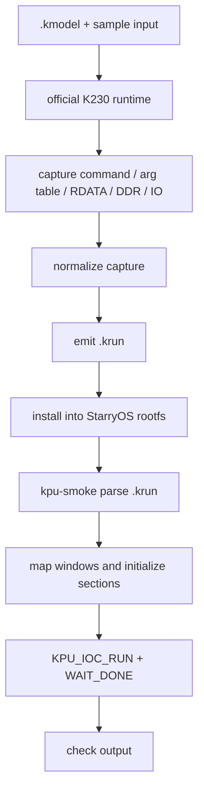

# K230 KPU 真实 Runtime 路线整理

本文档面向课程报告，目标是把当前 StarryOS K230 KPU/NPU 适配从“QEMU fake output 可展示”推进到“真实 runtime command stream 可接入”所需的事实、边界、已实现验证和后续设计整理清楚。

本文依据当前本地分支：

```text
codex/k230-kpu-upstream-dev
```

以及 QEMU K230 KPU qtest：

```text
/Users/joshua/tmp/qemu/tests/qtest/k230-kpu-test.c
```

当前结论是：StarryOS 已经完成 KPU 设备发现、寄存器访问、命令提交、done/IRQ 等待、QEMU fake output buffer 可验证 side effect，并已复刻 QEMU qtest 中最关键的 runtime 风格路径：`l2-store-runtime-ddr-mirror` 和 `runtime-arg-table-direct-io`。当前 smoke 已进一步抽出用户态 `runtime image` 装载层，可以用数据结构描述 command buffer、输入/参数初始化 section、run-level delta 和输出检查。随后基于 kunOS/K230 SDK YOLOv8n reference 生成了 compact full-sequence-delta `.krun`，并在 StarryOS 上验证 54 条真实 KPU command 均能通过 `/dev/kpu` 执行、触发 IRQ、写出与官方 reference 对齐的 per-run output hash。最新进展是：StarryOS 已新增 `kpu-nncase-runtime` case，能在 guest 内加载真实 `yolov8n_320.kmodel`，调用官方 NNCase runtime 现场生成 54 条 KPU command，并通过 `/dev/kpu` 完成 minimal 和图片 demo 两条路径；`_Exit(0)` workaround 已限定在 PASS 后执行，用于避开官方 SDK 静态析构清理，不影响 KPU command、done/IRQ 或 output hash 证据。

最新补充：kunOS 自带的 K230 SDK big-core RT-Smart `rtt_system.bin` 已在本地 QEMU K230 环境复现到 YOLOv8n 完整推理阶段。该 ROMFS 的 `/bin/init.sh` 会进入 `/bin/object_detect_yolov8n` 并启动 `/bin/object_detect_yolov8n/ob_det.elf yolov8n_320.kmodel 0.15 0.2 bus.jpg 0`。我们已把这份 prebuilt RTT 注入官方 no-initapp SD 镜像，并在 QEMU K230 上拿到真实 KPU trace：`/Users/joshua/tmp/tgoskits/target/official-k230/kunos-yolov8n-kpu-trace.log` 记录到 54 次 `k230_kpu_start`、54 次 `k230_kpu_gnne_summary`，且 observed `unknown=0`。另一次 debug=1 运行的 `/Users/joshua/tmp/tgoskits/target/official-k230/kunos-yolov8n-debug1-uart3.log` 显示 `OBDet run`、`OBDet get_output`、`OBDet post_process` 均已完成。详细证据见 `docs/k230-kpu-yolov8n-target.md`。

第一份完整 StarryOS 可复放材料已经完成：从官方 RT-Smart YOLOv8n full-series capture 中提取 54 条真实 KPU command，并用每次 pre-start snapshot 的 low16m/L2/DDR 差分生成 `yolov8n-full-sequence-delta.krun`。StarryOS `kpu-smoke` 在 Docker/Linux + K230 QEMU 下通过该 `.krun` 复放完整 command 序列，观察到 `runtime_image kunos_yolov8n_full_sequence_delta runs=54`、IRQ `0->54`、真实模型资产 `magic=LDMK version=6`，最终输出 `KPU_SMOKE_PASS`。

原生 runtime 路线也已经从可行性验证推进到完整 case 通过：`kpu-nncase-runtime` 使用官方 K230 SDK/NNCase 静态库、Linux riscv64-musl CRT/libc 和 StarryOS 用户态 compat shim，在 StarryOS guest 内完成 `interpreter.load_model()`、`interpreter.run()`、54 次 `gnne_enable`、done/IRQ、output hash 和图片 demo 的输出统计。最新诊断确认官方 `gnne_get_l2()` 固定返回 `0x80000000`，因此 Starry/Linux ABI 下必须只 identity-map L2 window；低位 runtime/RDATA/direct-io 通过受限 mmap、runtime alias mirror 和 arg table patch 接住。YOLO 检测框语义仍未和 official reference 对齐，后续仍要抓 StarryOS QEMU KPU trace，与 kunOS trace 逐条 diff，定位第一个 `l2_load`/`l2_store`/hash 分叉点。

## 1. 当前完成状态

当前 StarryOS 侧已经具备以下能力：

| 能力 | 状态 | 说明 |
| --- | --- | --- |
| QEMU K230 启动 | 已完成 | StarryOS 可在 QEMU K230 machine 上启动到用户态测试 |
| KPU FDT probe | 已完成 | 通过 `plat-dyn`/FDT/rdrive 从 `canaan,k230-kpu` 节点发现 KPU 资源 |
| `/dev/kpu` 和 `/dev/kpu0` | 已完成 | devfs 暴露 KPU 设备节点 |
| CFG MMIO 访问 | 已完成 | 支持 `pread`/`write_at` 访问 32-bit KPU CFG register |
| L2 mmap | 已完成 | 用户态可通过 `/dev/kpu` mmap KPU L2 window |
| command range 编程 | 已完成 | `KPU_IOC_PROGRAM_COMMAND` 写入 command start/end/hi |
| command run | 已完成 | `KPU_IOC_RUN` 清 done、编程 command range、写 start |
| done wait | 已完成 | `KPU_IOC_WAIT_DONE` 优先 IRQ/WaitQueue，超时后轮询兜底 |
| IRQ 统计 | 已完成 | `KPU_IOC_GET_IRQ_COUNT` 可验证 IRQ count 递增 |
| fake output mmap | 已完成 | 仅在 FDT 标注 QEMU fake output reserved-memory 时开放 |
| output buffer smoke | 已完成 | smoke 验证 QEMU KPU completion 会清零 fake output page |
| synthetic GNNE data-copy smoke | 未完成 | 还没有复刻 qtest 中 L2 load/store 的可预测数据搬运 |
| runtime arg table smoke | 已完成 | 已复刻 qtest 中 runtime direct I/O 参数表路径 |
| runtime DDR mirror smoke | 已完成 | 已复刻 qtest 中 L2 store 写 RDATA alias 并 mirror 到 DDR 的路径 |
| runtime image 装载层 | 已完成 | smoke 通过 `kpu_runtime_image` 描述 command、section、check，为接真实模型预留用户态边界 |
| 真实模型 runtime | 已通过 | `kpu-nncase-minimal` 在 StarryOS guest 内加载 `yolov8n_320.kmodel`，调用 NNCase interpreter 生成并提交 54 条 KPU command，输出 4 个 tensor hash，并打印 `NNCASE_MINIMAL_PASS` |
| 图片 YOLOv8n demo | 已通过展示链路 | `bus.jpg` decode、CPU resize/NCHW 预处理、run、output hash、postprocess、annotated PPM 路径已跑通并打印 `YOLOV8N_DEMO_PASS`；检测框语义仍未和官方 reference 对齐 |

当前 runtime smoke 的代表性输出为：

```text
KPU_SMOKE: info cfg=0x80400000+0x800 l2=0x80000000+0x200000 irq=189 flags=0xf
KPU_SMOKE: run_wait_done status=0x0000000400000004 irq_count=0->1
KPU_SMOKE: fake_output_zeroed paddr=0x10090000 status=0x0000000400000004 irq_count=1->2
KPU_SMOKE: runtime_image runtime_ddr_mirror status=0x0000000400000004 irq_count=2->3
KPU_SMOKE: runtime_image runtime_arg_table_direct_io status=0x0000000400000004 irq_count=3->4
KPU_SMOKE: runtime_image file_runtime_arg_table_direct_io status=0x0000000400000004 irq_count=4->5
KPU_SMOKE: runtime_image file_runtime_arg_table_direct_io_blob status=0x0000000400000004 irq_count=5->6
KPU_SMOKE: runtime_image_progress name=kunos_yolov8n_full_sequence_delta run=54/54 irq_count=54
KPU_SMOKE: runtime_image kunos_yolov8n_full_sequence_delta runs=54 status=0x0000000400000004 irq_count=0->54
KPU_SMOKE: real_kmodel path=/usr/share/k230-kpu-smoke/models/yolov8n_320.kmodel size=3493048 magic=LDMK version=6 hash=0x0585d1887f7dd46c
KPU_SMOKE_PASS
```

原生 NNCase runtime case 的代表性输出为：

```text
NNCASE_MINIMAL: load_model ok
NNCASE_MINIMAL: model io inputs=1 outputs=4
K230_SDK_COMPAT: identity mmap l2 0x80000000..0x80200000
K230_SDK_COMPAT: mirrored runtime rdata 0x3c000020 -> 0x10000020 bytes=5242848
K230_SDK_COMPAT: gnne_enable raw=0x3c348b48..0x3c3548fc len=48564 mode=runtime-alias submit=0x10348b48 arg_patch=1
K230_SDK_COMPAT: arg_table words=0x3c373020 0x3c596020 0x10000020 0x00000000
K230_SDK_COMPAT: stats mmz_alloc=15 kpu_run=54
NNCASE_MINIMAL_PASS
YOLOV8N_DEMO_PASS
K230_NNCASE_RUNTIME_PASS
```

这段输出的含义是：真实 `.kmodel -> NNCase -> 54 条 KPU command` 路径已经发生在 StarryOS guest 内；PASS 后的 `_Exit(0)` workaround 只用于跳过官方 SDK 静态析构清理，不改变 KPU 运行证据。

其中 `flags=0xf` 表示：

| flag | 值 | 含义 |
| --- | --- | --- |
| `KPU_INFO_F_FDT` | `0x1` | KPU 资源来自 FDT |
| `KPU_INFO_F_IRQ_WAIT` | `0x2` | wait done 已接入 IRQ |
| `KPU_INFO_F_FAKE_OUTPUT` | `0x4` | QEMU fake output mmap 可用 |
| `KPU_INFO_F_RUNTIME_SCRATCH` | `0x8` | QEMU runtime scratch mmap 可用 |

## 2. QEMU KPU runtime 相关物理地址

QEMU qtest 中定义了一组 KPU/GNNE 地址。它们可以分成四类：寄存器窗口、fake output 窗口、synthetic qtest 窗口、runtime 风格窗口。

### 2.1 CFG MMIO 和 IRQ

| 名称 | 地址/值 | 用途 |
| --- | --- | --- |
| `K230_KPU_CFG_BASE` | `0x80400000` | KPU CFG MMIO base |
| `K230_GNNE_COMMAND_START` | `0x100` | command start register offset |
| `K230_GNNE_COMMAND_END` | `0x104` | command end register offset |
| `K230_GNNE_COMMAND_HI` | `0x108` | command start 高 32 位 register offset |
| `K230_GNNE_CONTROL` | `0x128` | control/start/clear register offset |
| `K230_GNNE_CLEAR` | `0x128` | 与 control register 共用，用于清 done |
| `K230_GNNE_STATUS` | `0x130` | 64-bit done status low offset |
| `K230_GNNE_SETUP` | `0x190` | setup register，在 qtest 中用于检查无启动时不产生 done |
| `K230_GNNE_START` | `0x0000000900000009` | qtest 写入 control 的 64-bit start value |
| `K230_GNNE_DONE` | `0x0000000400000004` | qtest 期望的 done status |
| `K230_GNNE_IRQ` | `189` | KPU IRQ number |

StarryOS 当前 UAPI 使用同一组核心寄存器语义，但 control/start/clear 目前以 32-bit register access 封装：

| StarryOS 常量 | 值 | 说明 |
| --- | --- | --- |
| `KPU_COMMAND_START` | `0x100` | command start low 32 bits |
| `KPU_COMMAND_END` | `0x104` | command end low 32 bits |
| `KPU_COMMAND_HI` | `0x108` | command start high 32 bits |
| `KPU_CONTROL` | `0x128` | start/clear |
| `KPU_STATUS_LO` | `0x130` | done status low |
| `KPU_STATUS_HI` | `0x134` | done status high |
| `KPU_DONE_STATUS` | `0x0000000400000004` | done mask |

### 2.2 QEMU fake output window

| 名称 | 地址/大小 | 用途 |
| --- | --- | --- |
| `K230_FAKE_KPU_OUTPUT_BASE` | `0x10090000` | QEMU fake output 起始地址 |
| `K230_FAKE_KPU_OUTPUT_SIZE` | `0x00100000` | QEMU fake output 大小，1 MiB |
| `K230_KPU_OUTPUT_TEST0` | `0x10090000` | qtest 第一个 output page |
| `K230_KPU_OUTPUT_TEST1` | `0x10093000` | qtest 第二个 output page |
| `K230_KPU_OUTPUT_LAST` | `0x1018f000` | fake output window 最后一页 |

QEMU qtest 的 fake output 规则是：command stream 中出现落在 fake output window 内的地址时，completion 会把该地址所在的 4 KiB page 清零。当前 StarryOS smoke 已经复刻这一点：

1. 用户态通过 `/dev/kpu` mmap L2。
2. 用户态通过 `/dev/kpu` mmap fake output。
3. 先把 fake output page 填成 `0xa5`。
4. 在 L2 中写入一个 32-bit command word：`KPU_FAKE_OUTPUT_PADDR | 2`。
5. 通过 `KPU_IOC_RUN` 提交 `[KPU_L2_PADDR, KPU_L2_PADDR + 4)`。
6. 等待 done 和 IRQ。
7. 验证 fake output page 全部变成 `0x00`。

这证明当前 StarryOS 不只是能读到 done status，还能观察到 KPU 模型对 guest physical memory 的可检查写入。

### 2.3 synthetic qtest window

QEMU qtest 中大量基础 GNNE 单元测试使用 synthetic command window：

| 名称 | 值 | 用途 |
| --- | --- | --- |
| `K230_GNNE_COMMAND_TEST` | `0x01000000` | qtest 默认 command stream 地址 |
| `K230_GNNE_COMMAND_BASE_OFFSET` | `0x003a6000` | 从 command start 推导 GLB base 的偏移 |
| `K230_GNNE_SYNTH_GLB_BASE` | `0x00c5a000` | `0x01000000 - 0x003a6000` |
| `K230_GNNE_SYNTH_OUTPUT` | `0x00c5a180` | synthetic L2 store 输出地址 |
| `K230_GNNE_SYNTH_LOAD_OUTPUT` | `0x00c5a240` | synthetic L2 load 输出地址 |
| `K230_GNNE_SYNTH_STORE_SOURCE` | `0x00c5a340` | synthetic L2 store 输入地址 |
| `K230_GNNE_SYNTH_SOURCE` | `0x02000000` | synthetic DDR/source 地址 |

这些地址对 StarryOS 下一步的 synthetic smoke 很重要，但要注意：它们位于当前 K230 memory node 之外。当前 `k230-canmv.dts` 的 RAM 从 `0x08200000` 开始，因此 `0x01000000`、`0x02000000`、`0x00c5a000` 不能直接假设为普通用户态内存。若要在 StarryOS 用户态复刻 qtest，需要通过 FDT reserved-memory 和 `/dev/kpu` 的受限 mmap 暴露这些 QEMU-only scratch window。

### 2.4 runtime 风格 window

QEMU qtest 中还定义了一组更接近真实 runtime 的地址：

| 名称 | 值 | 用途 |
| --- | --- | --- |
| `K230_GNNE_RUNTIME_RDATA_BASE` | `0x10000020` | runtime RDATA base |
| `K230_GNNE_RUNTIME_FUNCTION_COMMAND` | `0x1032b020` | runtime function command stream 地址 |
| `K230_GNNE_RUNTIME_ARG_TABLE` | `0x80000000` | runtime argument table，当前也等于 KPU L2 base |
| `K230_GNNE_RUNTIME_DIRECT_SOURCE` | `0x10500020` | runtime direct input/source buffer |
| `K230_GNNE_RUNTIME_DIRECT_OUTPUT` | `0x10501020` | runtime direct output buffer |
| `K230_GNNE_RUNTIME_DDR_BASE` | `0x3c000000` | runtime DDR base |
| `K230_GNNE_RDATA_ALIAS_BASE` | `0xfc000000` | RDATA alias base |
| `K230_GNNE_RDATA_FALLBACK_BASE` | `0x10000000` | RDATA fallback base |

这些地址是下一步 StarryOS runtime smoke 的核心。它们和 fake output 不同，不是“command 中写一个 output 地址即可触发清零”，而是通过 GNNE command stream、arg table、RDATA、DDR/source/output buffer 组合出真实 runtime 风格的数据路径。

## 3. command buffer 格式

QEMU qtest 展示的 command stream 是一个以 little-endian 方式写入 guest memory 的指令序列。大多数指令是 32-bit word，少量测试通过 `k230_kpu_command_u16()` 写 16-bit word。当前适配路线优先处理 32-bit command word，因为 runtime direct I/O、L2 load/store、RDATA alias 等关键用例都可以用 32-bit command 复刻。

qtest 中的 command 写入流程如下：

```c
qtest_memwrite(qts, start, commands, size);
qtest_writel(qts, K230_KPU_CFG_BASE + K230_GNNE_COMMAND_START, start);
qtest_writel(qts, K230_KPU_CFG_BASE + K230_GNNE_COMMAND_END, start + size);
qtest_writeq(qts, K230_KPU_CFG_BASE + K230_GNNE_CONTROL, K230_GNNE_START);
```

StarryOS 当前 UAPI 对应为：

```c
struct k230_kpu_command_range {
    uint64_t start_paddr;
    uint64_t end_paddr;
};

ioctl(fd, KPU_IOC_RUN, &range);
ioctl(fd, KPU_IOC_WAIT_DONE, poll_limit);
ioctl(fd, KPU_IOC_GET_STATUS, &status);
ioctl(fd, KPU_IOC_CLEAR, 0);
```

驱动侧会把 command range 拆成：

| register | 写入内容 |
| --- | --- |
| `COMMAND_START` | `start_paddr` 低 32 位 |
| `COMMAND_END` | `end_paddr` 低 32 位 |
| `COMMAND_HI` | `start_paddr` 高 32 位 |

当前 `command_words()` 要求：

1. `start_paddr < end_paddr`。
2. `start_paddr` 和 `end_paddr` 必须处于同一个 4 GiB window。

这说明真实 runtime 的 command buffer 最好放在一个连续物理区间内，且一次提交不要跨 4 GiB 边界。

### 3.1 qtest 中的基础 GNNE 指令编码

qtest 用宏构造 GNNE command word。宏本身不等于完整 ISA 文档，但已经足以说明当前 QEMU 模型接受的最小 command 格式。

基础字段宏：

```c
#define GNNE_FIELD(value, shift) ((uint32_t)(value) << (shift))
```

常用指令：

| 宏 | opcode/编码模式 | 作用 |
| --- | --- | --- |
| `GNNE_LUI(rd, imm)` | `0x02 | rd << 7 | imm << 12` | 向寄存器写高位立即数 |
| `GNNE_LW(rd, rs, offset)` | `0x06 | rd << 7 | rs << 12 | offset << 20` | 从 `rs + offset` 读取 32-bit 值到寄存器 |
| `GNNE_ADDI(rd, rs, imm)` | `0x0e | rd << 7 | rs << 12 | imm << 20` | 寄存器加立即数 |
| `GNNE_MMU_CONF(rstart, rdepth, id)` | `0x44 | rstart << 7 | rdepth << 12 | id << 17` | 配置 MMU/地址转换相关参数 |
| `GNNE_SS_PACK_SHAPE(rn, rc, rh, rw, rss)` | `0x40 | ...` | 配置 shape |
| `GNNE_SS_PACK_STRIDE(rn, rc, rh, rss)` | `0x42 | ...` | 配置 stride |
| `GNNE_L2_LOAD_CONF(rstride_d, rstride_s, l2_dt, ddr_dt)` | `0x46 | ...` | 配置 DDR/source 到 L2/GLB 的 load |
| `GNNE_L2_STORE_CONF(rstride_d, rstride_s, l2_dt, ddr_dt)` | `0x4a | ...` | 配置 L2/GLB 到 DDR/output 的 store |
| `GNNE_L2_LOAD(raddr_d, raddr_s, rshape)` | `0x4c | ...` | 执行 L2 load |
| `GNNE_L2_STORE(raddr_d, raddr_s, rshape)` | `0x4e | ...` | 执行 L2 store |
| `GNNE_L2_LOAD_W_CONF(rlen_c, rlen_d, l2_dt, ddr_dt, decomp)` | `0x48 | ...` | 配置 weight/load_w |
| `GNNE_L2_LOAD_W(raddr_d, raddr_s, rvalid_c_num)` | `0x57 | ...` | 执行 weight/load_w |

由 qtest 可见，command stream 本质上是在一个 KPU/GNNE 内部寄存器文件上执行。`ADDI/LUI/LW` 先布置寄存器，`MMU_CONF/SS_PACK_*` 配置本次搬运的形状和 stride，最后由 `L2_LOAD/L2_STORE/L2_LOAD_W` 触发具体数据搬运。

### 3.2 最小 L2 store 数据搬运命令

qtest 的 `test_l2_store_copies_parsed_output()` 展示了最小可预测 L2 store：

```c
const uint8_t source[] = {
    0x91, 0x92, 0x93, 0x94, 0x95, 0x96, 0x97, 0x98,
    0xa1, 0xa2, 0xa3, 0xa4, 0xa5, 0xa6, 0xa7, 0xa8,
};

const uint32_t commands[] = {
    GNNE_ADDI(2, 0, 0x100),
    GNNE_ADDI(3, 0, 0x180),
    GNNE_ADDI(7, 0, 0x340),
    GNNE_ADDI(4, 0, 1),
    GNNE_ADDI(5, 0, sizeof(source)),
    GNNE_MMU_CONF(0, 2, 0),
    GNNE_SS_PACK_SHAPE(4, 4, 4, 5, 0),
    GNNE_SS_PACK_STRIDE(5, 5, 5, 0),
    GNNE_SS_PACK_STRIDE(5, 5, 5, 1),
    GNNE_L2_STORE_CONF(1, 0, 0, 0),
    GNNE_L2_STORE(3, 7, 0),
};
```

数据布局为：

| 地址 | 内容 |
| --- | --- |
| `K230_GNNE_SYNTH_STORE_SOURCE = 0x00c5a340` | source bytes |
| `K230_GNNE_SYNTH_OUTPUT = 0x00c5a180` | 预填 `0xa5` 的 output buffer |
| `K230_GNNE_COMMAND_TEST = 0x01000000` | command stream |

预期结果：

1. output 前 16 字节等于 source。
2. output 后续字节保持 `0xa5`。
3. KPU status 变为 `K230_GNNE_DONE`。
4. PLIC claim 得到 IRQ 189。

这类用例适合作为 StarryOS 第二阶段 smoke，因为它从 fake output 的“清零页面”升级为“GNNE command 真的按 source/output buffer 搬运数据”。

## 4. runtime arg table 与 direct I/O

qtest 的 `test_runtime_arg_table_drives_direct_io()` 是最接近真实 runtime 接口形态的用例。它体现了三件事：

1. command stream 不在 synthetic `0x01000000`，而在 runtime function command 地址 `0x1032b020`。
2. 参数表放在 `0x80000000`，即当前 KPU L2 base。
3. source/output/rdata 由参数表提供，command stream 通过 `LW` 读取参数表项，再执行 `L2_LOAD` 和 `L2_STORE`。

### 4.1 参数表布局

qtest 中的参数表大小为 16 字节，其中前 12 字节有明确含义：

| offset | value | 含义 |
| --- | --- | --- |
| `0x0` | `K230_GNNE_RUNTIME_DIRECT_SOURCE = 0x10500020` | 输入/source buffer 物理地址 |
| `0x4` | `K230_GNNE_RUNTIME_DIRECT_OUTPUT = 0x10501020` | 输出/output buffer 物理地址 |
| `0x8` | `K230_GNNE_RUNTIME_RDATA_BASE = 0x10000020` | RDATA base |
| `0xc` | `0` | qtest 未使用，保留 |

qtest 写法为：

```c
stl_le_p(table, K230_GNNE_RUNTIME_DIRECT_SOURCE);
stl_le_p(table + 4, K230_GNNE_RUNTIME_DIRECT_OUTPUT);
stl_le_p(table + 8, K230_GNNE_RUNTIME_RDATA_BASE);
qtest_memwrite(qts, K230_GNNE_RUNTIME_ARG_TABLE, table, sizeof(table));
```

### 4.2 command stream

runtime direct I/O 用例的 command stream 如下：

```c
GNNE_ADDI(2, 0, 0x200),
GNNE_ADDI(4, 0, 1),
GNNE_ADDI(5, 0, sizeof(source)),
GNNE_MMU_CONF(0, 4, 0),
GNNE_LW(6, 0, 0),
GNNE_SS_PACK_SHAPE(4, 4, 4, 5, 0),
GNNE_SS_PACK_STRIDE(5, 5, 5, 0),
GNNE_SS_PACK_STRIDE(5, 5, 5, 1),
GNNE_L2_LOAD_CONF(1, 0, 0, 0),
GNNE_L2_LOAD(2, 6, 0),
GNNE_LW(7, 0, 4),
GNNE_L2_STORE_CONF(1, 0, 0, 0),
GNNE_L2_STORE(7, 2, 0),
```

执行过程可以按如下方式理解：

| 步骤 | command | 作用 |
| --- | --- | --- |
| 1 | `ADDI r2, r0, 0x200` | 设置 L2/GLB 中间 buffer offset |
| 2 | `ADDI r4, r0, 1` | 设置 shape 相关参数 |
| 3 | `ADDI r5, r0, sizeof(source)` | 设置数据长度 |
| 4 | `MMU_CONF(0, 4, 0)` | 配置地址转换/参数表深度 |
| 5 | `LW r6, r0, 0` | 从 arg table offset 0 读取 source pointer |
| 6 | `SS_PACK_SHAPE/STRIDE` | 配置搬运形状和 stride |
| 7 | `L2_LOAD_CONF` | 配置 source 到 L2 的 load |
| 8 | `L2_LOAD r2, r6, 0` | 从 source 读入 L2 offset `0x200` |
| 9 | `LW r7, r0, 4` | 从 arg table offset 4 读取 output pointer |
| 10 | `L2_STORE_CONF` | 配置 L2 到 output 的 store |
| 11 | `L2_STORE r7, r2, 0` | 把 L2 offset `0x200` 的数据写到 output |

输入输出为：

```c
source = { 0x41, 0x42, 0x43, 0x44 };
output 初始填充 0xa5;
```

预期结果：

| output byte range | 预期 |
| --- | --- |
| `[0, 4)` | `0x41 0x42 0x43 0x44` |
| `[4, 8)` | 仍为 `0xa5` |

这条路径已经在 StarryOS smoke 中实现。它证明 command buffer、arg table、input buffer、output buffer 四者可以在用户态组织，并通过 `/dev/kpu` 提交给 QEMU KPU 模型执行。

## 5. RDATA alias 与 fallback

qtest 中有多组 RDATA alias 相关测试，说明 QEMU runtime 模型不只是按普通物理地址读写，还会对 RDATA window 和 alias 做特殊处理。

关键地址：

| 名称 | 值 | 含义 |
| --- | --- | --- |
| `K230_GNNE_RUNTIME_RDATA_BASE` | `0x10000020` | runtime RDATA base |
| `K230_GNNE_RDATA_ALIAS_BASE` | `0xfc000000` | RDATA alias marker/base |
| `K230_GNNE_RDATA_FALLBACK_BASE` | `0x10000000` | fallback RDATA base |

### 5.1 alias destination

`test_l2_store_accepts_rdata_alias_destination()` 中：

1. 在 `K230_GNNE_RUNTIME_RDATA_BASE + 8` 写入 `0xfc000000`。
2. 在 `K230_GNNE_RUNTIME_RDATA_BASE + 0x100` 写入 source。
3. command 通过 `LW r3, r0, 8` 读取 alias base。
4. `ADDI r3, r3, 0x180` 得到 alias destination。
5. `L2_STORE` 最终把 source 写到 `K230_GNNE_RUNTIME_RDATA_BASE + 0x180`。

这说明 QEMU 对 `0xfc000000` alias 有特殊解释：command stream 中看到 alias destination 后，最终可映射回 runtime RDATA window。

### 5.2 runtime rdata shadow

`test_runtime_rdata_shadow_survives_glb_mutation()` 先运行一个 warm command，然后修改 runtime RDATA 中的 alias 和 source，再运行真实测试 command。预期输出仍读取 warm 阶段的 source，而不是后续 poison source。

这说明 QEMU 模型可能在 runtime command path 下保存了 RDATA prefix/shadow。对 StarryOS 来说，runtime smoke 需要注意：

1. 同一个 QEMU 实例内，某些 RDATA 状态可能跨 command 保留。
2. 测试用例要主动清理/初始化相关 buffer。
3. 如果设计多次 submit smoke，必须明确每次 submit 之前哪些 RDATA bytes 是输入，哪些是上一次运行留下的状态。

### 5.3 fallback base

`test_l2_load_w_uses_rdata_fallback_base()` 使用 `K230_GNNE_RDATA_FALLBACK_BASE + 8` 和 `+0x120`，说明 QEMU 在非 runtime function command path 或某些缺省路径下可能回退到 `0x10000000` 作为 RDATA base。

对 StarryOS 适配的影响是：不要在驱动里硬编码“所有 runtime 数据都从 `0x10000020` 开始”。更合理的边界是：

1. `/dev/kpu` 只负责暴露经 FDT 声明的物理 window 和提交 command range。
2. RDATA base、alias base、fallback base 的选择属于用户态 runtime/smoke 的职责。
3. 驱动只做安全边界和资源描述，不解释模型 command stream。

## 6. L2/DDR 数据搬运路径

真实 runtime 路线最关键的问题之一是：输入、权重、临时中间结果、输出究竟放在 L2、RDATA 还是 DDR window。qtest 已经覆盖了多条路径。

### 6.1 L2 store：GLB/L2 到 output/RDATA/DDR

基础 L2 store 的模式是：

```c
GNNE_L2_STORE_CONF(...);
GNNE_L2_STORE(raddr_d, raddr_s, rshape);
```

含义按 qtest 行为可总结为：

| 字段 | 作用 |
| --- | --- |
| `raddr_d` | 目的地址寄存器，可指向 synthetic output、runtime output 或 RDATA alias |
| `raddr_s` | 源地址寄存器，通常是 GLB/L2 offset |
| `rshape` | shape descriptor 寄存器 |
| `L2_STORE_CONF` | 控制 stride、L2 datatype、DDR datatype 等 |

重要用例：

| qtest 用例 | 验证内容 |
| --- | --- |
| `l2-store-copies-parsed-output` | 从 synthetic source 搬到 synthetic output |
| `l2-store-converts-fp16-to-fp32` | store 时做 datatype 转换 |
| `l2-store-rdata-alias-destination` | alias destination 可写回 runtime RDATA |
| `l2-store-runtime-ddr-mirror` | store 后 DDR mirror 可被后续 load 读回 |

### 6.2 L2 load：DDR/source 到 GLB/L2

基础 L2 load 的模式是：

```c
GNNE_L2_LOAD_CONF(...);
GNNE_L2_LOAD(raddr_d, raddr_s, rshape);
```

含义按 qtest 行为可总结为：

| 字段 | 作用 |
| --- | --- |
| `raddr_d` | 目的 GLB/L2 offset |
| `raddr_s` | source/DDR/input 物理地址寄存器 |
| `rshape` | shape descriptor 寄存器 |
| `L2_LOAD_CONF` | 控制 stride、L2 datatype、DDR datatype 等 |

重要用例：

| qtest 用例 | 验证内容 |
| --- | --- |
| `l2-load-copies-to-glb` | 从 synthetic source 搬到 GLB/L2 output |
| `l2-load-converts-fp32-to-fp16` | load 时做 datatype 转换 |
| `l2-load-rdata-prefix-shadow` | runtime RDATA prefix/shadow 影响 load |
| `runtime-arg-table-direct-io` | 从 arg table 读 source pointer，再 load 到 L2 |

### 6.3 L2 load_w：权重和 runtime DDR rebasing

`L2_LOAD_W` 系列测试覆盖 weight/load_w 路径：

```c
GNNE_L2_LOAD_W_CONF(rlen_c, rlen_d, l2_dt, ddr_dt, decomp);
GNNE_L2_LOAD_W(raddr_d, raddr_s, rvalid_c_num);
```

qtest 中值得关注的 runtime 行为：

| 用例 | 地址/行为 | 含义 |
| --- | --- | --- |
| `l2-load-w-translates-low-source` | 从 `0x3c000000 + 0x100` 和 `+0x500` 选择 translated source | QEMU 会根据 MMU/shape 配置做 source translation |
| `l2-load-w-rebases-function-source` | command 位于 `0x1032b020` 时，source 可被 rebase 到 runtime DDR |
| `l2-load-w-rebases-absolute-rdata-source` | absolute RDATA source 可能被 rebase |
| `l2-load-w-keeps-absolute-rdata-source` | 某些 absolute RDATA source 保持原地址 |
| `l2-load-w-synthesizes-function-arg` | QEMU 可合成 function arg 数据 |
| `l2-load-w-synthesizes-rdata-function-args` | 不同 RDATA offset 合成不同函数参数 |

这部分已经接近真实模型中的 weight/arg/runtime 常量处理。它不应作为第一版 StarryOS runtime smoke 的起点，因为行为更复杂、隐含 QEMU 模型规则更多。建议先完成 direct I/O，再补 L2 load_w。

### 6.4 DDR mirror

`test_l2_store_runtime_mirrors_to_ddr_source()` 是理解 runtime DDR 的关键用例。它做了以下事情：

1. 在 runtime RDATA 中写入 alias base。
2. 在 runtime RDATA `+0x100` 写入 source `{0x61, 0x62, 0x63, 0x64}`。
3. 清零 `K230_GNNE_RUNTIME_DDR_BASE = 0x3c000000`。
4. 执行 command：
   - 先 `L2_STORE`，把 RDATA source 写到 alias/RDATA destination。
   - 再 `L2_LOAD`，从 DDR base 读回到 RDATA `+0x180`。
5. 验证 DDR base 和 RDATA output 都等于 source。

这说明 QEMU runtime 路线中，L2 store 可能不只是写 RDATA alias destination，还会 mirror 到 DDR source window。真实 runtime 需要搞清楚：

1. DDR window 是否代表模型权重/输入/输出所在的大块内存。
2. RDATA 是否代表 runtime 内部参数区或函数参数区。
3. L2 store/load 是否通过 alias 和 DDR mirror 串起真实模型的数据流。

## 7. 当前 StarryOS `/dev/kpu` 适配边界

当前 StarryOS `/dev/kpu` 的设计原则是“驱动只提供 KPU 资源访问和提交，不在内核解释 runtime command stream”。

### 7.1 当前 FDT 资源

当前 `k230-canmv.dts` 的 KPU 节点：

```dts
kpu: kpu@80400000 {
    compatible = "canaan,k230-kpu";
    reg = <0x0 0x80400000 0x0 0x800>,
          <0x0 0x80000000 0x0 0x200000>;
    reg-names = "cfg", "l2";
    memory-region = <&kpu_fake_output>;
    interrupts = <189>;
    interrupt-parent = <&plic>;
    status = "okay";
};
```

fake output reserved-memory：

```dts
kpu_fake_output: kpu-fake-output@10090000 {
    compatible = "canaan,k230-kpu-qemu-fake-output";
    reg = <0x0 0x10090000 0x0 0x100000>;
    no-map;
};
```

### 7.2 当前 UAPI

当前 UAPI 主要包括：

| ioctl/mmap | 作用 |
| --- | --- |
| `KPU_IOC_GET_INFO` | 返回 cfg/l2/irq/flags |
| `KPU_IOC_GET_STATUS` | 读取 64-bit done status |
| `KPU_IOC_CLEAR` | 清 done |
| `KPU_IOC_PROGRAM_COMMAND` | 只编程 command start/end/hi |
| `KPU_IOC_START` | 只启动 |
| `KPU_IOC_RUN` | 清 done、编程 command range、启动 |
| `KPU_IOC_WAIT_DONE` | 等待 done，优先 IRQ |
| `KPU_IOC_GET_IRQ_COUNT` | 返回 IRQ 计数 |
| `KPU_MMAP_CFG_OFFSET` | mmap CFG MMIO |
| `KPU_MMAP_L2_OFFSET` | mmap KPU L2 |
| `KPU_MMAP_FAKE_OUTPUT_OFFSET` | mmap QEMU fake output window |

### 7.3 当前边界

当前 `/dev/kpu` 已经能支撑 fake output smoke，但还不能直接支撑 runtime direct I/O，原因如下：

| 缺口 | 说明 |
| --- | --- |
| runtime command 地址未映射 | `0x1032b020` 目前没有通过 `/dev/kpu` 暴露给用户态 |
| runtime source/output 地址未映射 | `0x10500020`、`0x10501020` 目前没有 mmap UAPI |
| runtime RDATA 地址未映射 | `0x10000020` 当前没有直接 mmap |
| runtime DDR 地址未映射 | `0x3c000000` 当前没有 mmap |
| synthetic low window 未映射 | `0x01000000`、`0x02000000`、`0x00c5a000` 不属于当前 RAM node |
| 无 DMA buffer 分配 ABI | 真实 runtime 需要稳定获得 physical address |
| 无 session/busy 语义 | 真实 runtime 后续需要处理并发、取消、超时、错误状态 |

这里不建议引入泛化 `/dev/mem` 或任意物理地址 mmap。更合适的路线是：

1. 在 K230 QEMU DTS 中为 runtime smoke 需要的物理 window 增加明确的 reserved-memory 节点。
2. 每个节点使用 QEMU-only compatible，例如 `canaan,k230-kpu-qemu-runtime-rdata`。
3. KPU node 通过 phandle 引用这些 memory-region。
4. `/dev/kpu` 只对这些受信任、明确声明的 QEMU-only window 开放 mmap。
5. 真实硬件路径默认不开放这些 QEMU-only window。

这样既能推进展示验证，也不会把 QEMU qtest 的特殊地址语义误当成真实硬件 ABI。

## 8. 已实现的 runtime smoke

本轮已经实现 runtime scratch mmap，并在 `kpu-smoke` 中复刻两条 QEMU qtest runtime 路径：

1. `l2-store-runtime-ddr-mirror`：验证 RDATA alias 目标既写回 RDATA window，又 mirror 到 runtime DDR window。
2. `runtime-arg-table-direct-io`：验证 command stream 通过 L2 arg table 取得 source/output 指针，并完成 direct input 到 direct output 的可预测搬运。

两个 runtime 子用例必须注意执行顺序。QEMU KPU 模型会在第一次 runtime-window command 时缓存 RDATA shadow，而 qtest 每个函数都会重新启动一台 QEMU。StarryOS smoke 是同一个进程连续提交多条 command，因此先运行需要 RDATA alias anchor 的 DDR mirror，再运行 direct I/O；这样等价于 qtest 中 DDR mirror 用例的初始 shadow 条件。

### 8.1 方案 A：synthetic GNNE data-copy smoke

目标：复刻 qtest `test_l2_store_copies_parsed_output()` 或 `test_l2_load_copies_to_glb()`，证明 GNNE command stream 可以产生可预测数据搬运。

需要暴露的 QEMU-only window：

| window | 地址范围建议 | 用途 |
| --- | --- | --- |
| synthetic command | 覆盖 `0x01000000` | command stream |
| synthetic GLB | 覆盖 `0x00c5a000` 附近 | source/output/temporary |
| synthetic source | 覆盖 `0x02000000` | L2 load source |

最小测试步骤：

1. 用户态 mmap synthetic GLB/source/command window。
2. 在 source 地址写入固定 bytes，例如 `0x91..0xa8`。
3. 在 output 地址预填 `0xa5`。
4. 在 command 地址写入 qtest 同款 32-bit command words。
5. 通过 `KPU_IOC_RUN` 提交 `[0x01000000, 0x01000000 + command_size)`。
6. 等待 done 和 IRQ。
7. 验证 output 前 N 字节等于 source，后续仍为 `0xa5`。

优点：

1. 数据结果直观，适合展示。
2. command stream 短，便于报告解释。
3. 不需要 runtime arg table。

缺点：

1. 地址低于当前 RAM node，需要额外 QEMU-only reserved-memory。
2. 与真实 runtime 的 arg table 组织方式仍有距离。

### 8.2 runtime arg table direct I/O smoke

目标：复刻 qtest `test_runtime_arg_table_drives_direct_io()`，证明 StarryOS 用户态可以组织 runtime 风格 command buffer、arg table、input buffer、output buffer。该项已经完成。

需要暴露的 QEMU-only/runtime window：

| window | 地址 | 用途 |
| --- | --- | --- |
| arg table / L2 | `0x80000000` | 参数表，当前已经可通过 `KPU_MMAP_L2_OFFSET` mmap |
| command buffer | `0x1032b020` | runtime function command stream |
| direct source | `0x10500020` | 输入 buffer |
| direct output | `0x10501020` | 输出 buffer |
| RDATA | `0x10000020` | runtime RDATA base |

最小测试步骤：

1. mmap L2，并在 `0x80000000` 写入 16-byte arg table。
2. mmap runtime source，写入 `{0x41, 0x42, 0x43, 0x44}`。
3. mmap runtime output，预填 8 字节 `0xa5`。
4. mmap runtime command buffer，在 `0x1032b020` 写入 qtest 同款 direct I/O command stream。
5. 通过 `KPU_IOC_RUN` 提交 `[0x1032b020, 0x1032b020 + command_size)`。
6. 等待 done 和 IRQ。
7. 读取 output，验证前 4 字节等于 source，后 4 字节仍为 `0xa5`。

实际验证输出：

```text
KPU_SMOKE: runtime_image runtime_arg_table_direct_io status=0x0000000400000004 irq_count=3->4
```

优点：

1. 最接近真实 runtime 的 buffer 组织。
2. 能证明 command/arg/input/output 四类 buffer 已经联通。
3. 后续接真实模型时，可以把手写 command stream 替换成 runtime 生成 command stream。

缺点：

1. 需要新增 runtime scratch window mmap。
2. 需要谨慎设计 UAPI，避免暴露任意物理地址。
3. qtest 中 runtime RDATA/alias 行为复杂，第一版 smoke 应限制在 direct I/O 的最小路径。

### 8.3 runtime DDR mirror smoke

目标：复刻 qtest `test_l2_store_runtime_mirrors_to_ddr_source()`，证明 RDATA alias 目标和 runtime DDR mirror 路径可观测。

实际验证布局：

| window | 地址 | 用途 |
| --- | --- | --- |
| runtime command | `0x1032b020` | command stream |
| runtime RDATA | `0x10000020` | alias anchor、source、RDATA output |
| runtime DDR | `0x3c000000` | mirror output |

实际验证输出：

```text
KPU_SMOKE: runtime_image runtime_ddr_mirror status=0x0000000400000004 irq_count=2->3
```

### 8.4 推荐实现顺序

当前已完成阶段 1 到阶段 6 中的 runtime 相关部分：

| 阶段 | 目标 | 原因 |
| --- | --- | --- |
| 1 | 文档确认 runtime 地址和 UAPI 边界 | 已完成 |
| 2 | 新增 QEMU-only runtime reserved-memory 描述 | 已完成 |
| 3 | `/dev/kpu` 增加受限 runtime scratch mmap | 已完成 |
| 4 | 新增 runtime direct I/O smoke | 已完成 |
| 5 | 新增 DDR mirror smoke | 已完成 |
| 6 | 抽出用户态 runtime image 装载层 | 已完成，runtime smoke 不再把 command/source/output 检查全部写死在流程里 |
| 7 | 外部 runtime image 文件装载 | 已完成，rootfs 中的 `.krun` 文件可由 smoke 解析并提交给 `/dev/kpu` |
| 8 | synthetic data-copy smoke | 尚未完成，主要价值是覆盖低地址 synthetic GLB/qtest window |
| 9 | 接真实 runtime blob | 阶段性完成，已接入 kunOS/RT-Smart YOLOv8n full-sequence-delta capture，完整 54 条 command 序列已可复放 |

因此当前展示版本已经能从“fake output 可展示”升级为“runtime 风格 command/input/output/RDATA/DDR 可展示”，并进一步升级到“真实 YOLOv8n 54 条 KPU command 可复放且 per-run output hash 可检查”。下一步如果继续向完整真实模型推进，优先级应从 offline capture replay 转向固化官方 capture 流程、压缩/管理 capture 资产，以及评估官方 runtime 入口，让 StarryOS 后续能原生完成 `.kmodel` 加载、command 生成和整轮推理。

### 8.5 runtime image 装载层

本轮新增的 `kpu_runtime_image` 是接真实模型前的关键中间层。它不把模型解析放进内核，也不让 `/dev/kpu` 理解 `.kmodel`，而是在用户态 smoke 中定义一份“已经编译好的 runtime 执行描述”：

| 字段 | 含义 | 当前使用方式 |
| --- | --- | --- |
| `name` | runtime image 名称 | 用于输出 `runtime_image <name>` 日志 |
| `command_paddr` | command stream 物理起始地址 | 当前为 `0x1032b020` |
| `commands` / `command_count` | GNNE command words | 当前仍来自 qtest 等价手写数组 |
| `sections` | 执行前需要写入的 buffer 区段 | 用于填充 source、output、RDATA alias、arg table、DDR mirror |
| `checks` | 执行后需要验证的 output 区段 | 用于检查 direct output、RDATA output、DDR mirror |

通用执行流程为：

1. 根据 `command_paddr` 确认 command stream 落在 runtime command reserved-memory window 中。
2. 按 `sections` 自动 mmap 需要的窗口，包括 L2、runtime RDATA、runtime direct I/O 和 runtime DDR。
3. 写入 command stream 和所有输入/参数/输出预填 section。
4. 调用 `KPU_IOC_RUN` 和 `KPU_IOC_WAIT_DONE`。
5. 读取 `checks` 描述的 output 区段，验证 KPU/GNNE side effect。
6. 输出稳定日志，例如 `KPU_SMOKE: runtime_image runtime_arg_table_direct_io ...`。

这层的意义是把“当前手写 qtest 等价命令”与“未来真实模型产物”隔开。后续真实接入时，可以保持 `/dev/kpu` UAPI 不变，只需要新增一个用户态转换器，把真实模型 runtime 产物转换成同样的三类数据：

1. command stream：真实 KPU runtime 生成的 GNNE command buffer。
2. section 列表：模型输入、权重、RDATA 常量、arg table、输出预填或清零规则。
3. check/output 描述：模型输出 tensor 的物理位置、长度和验证策略。

当前 smoke 的两个 runtime image 分别覆盖：

| image | 覆盖路径 | 验证点 |
| --- | --- | --- |
| `runtime_ddr_mirror` | runtime command + RDATA alias + DDR mirror | RDATA source 经 L2 store/load 后写入 DDR 和 RDATA output |
| `runtime_arg_table_direct_io` | runtime command + L2 arg table + direct I/O | arg table 指向 source/output 后，output 前 4 字节等于 source |
| `file_runtime_arg_table_direct_io` | rootfs `.krun` 文件 + L2 arg table + direct I/O | 证明 runtime image 可以作为外部文件被装载，而不需要重新编译 smoke |
| `kunos_yolov8n_full_sequence_delta` | rootfs `.krun` 文件 + 54 次真实 KPU submit + run-level delta | 证明官方 RT-Smart YOLOv8n 展开后的完整 KPU workload 可以在 StarryOS 上复放 |

### 8.6 外部 runtime image 文件格式

为了让后续真实模型转换器有明确落点，当前 smoke 新增了一个文本型 runtime image 文件格式。示例文件安装在：

```text
/usr/share/k230-kpu-smoke/runtime-direct-io.krun
```

该文件随 C asset pipeline 被注入 rootfs，guest 中的 `/usr/bin/k230-kpu-smoke` 会读取它并走同一套 `run_runtime_image()` 执行路径。当前格式刻意保持简单，方便后续由 Python、Rust 或 nncase 工具链脚本生成：

```text
kpu-runtime-image-v1
name file_runtime_arg_table_direct_io
command_paddr 0x1032b020
commands 0x2000010e ...
copy direct_io 0x20 0x51 0x52 0x53 0x54
fill direct_io 0x1020 8 0xa5
copy l2 0x0 ...
check direct_io 0x1020 8 0xa5 0x51 0x52 0x53 0x54
check_hash direct_io 0x1020 8 0x6776b1f15e3b4847
```

语义如下：

| 指令 | 含义 |
| --- | --- |
| `name` | 给 image 命名，出现在 smoke 日志中 |
| `command_paddr` | command stream 的物理地址 |
| `commands` | 一组 32-bit GNNE command words |
| `copy <window> <offset> <bytes...>` | 执行前向指定 window 写入字节 |
| `fill <window> <offset> <len> <byte>` | 执行前向指定 window 填充值 |
| `check <window> <offset> <total_len> <tail> <expected...>` | 执行后检查输出，`expected` 之外的尾部应保持 `tail` |
| `check_hash <window> <offset> <total_len> <fnv1a64>` | 执行后对输出区间计算 FNV-1a 64-bit hash，适合真实模型大 tensor 摘要检查 |

当前支持的 window 名称为 `l2`、`rdata`、`command`、`direct_io`、`ddr`，它们对应 `/dev/kpu` 已暴露的受限 mmap window。guest loader 已从固定小数组改为堆分配，当前上限为 65536 个 command word、4096 个 section、1024 个 check 和 16 MiB inline payload；`capture-to-krun.py` 会把 command 和 bytes 分块输出，避免真实 capture 因单行过长而无法加载。这一步的意义是：真实模型转换器无需链接 StarryOS 内核，也无需修改 smoke C 源码，只要生成 `.krun` 文件即可进入 K230 QEMU 端到端验证。

## 9. 真实模型 runtime 还需要确认的资料

公开 K230/CanMV nncase runtime 文档给出的上层接口形态是 `kpu.load_kmodel(...)`、`set_input_tensor(...)`、`run()`、`get_output_tensor(...)`，模型文件使用已编译的 `.kmodel` 格式。参考资料：

1. CanMV K230 `nncase_runtime` API manual: <https://www.kendryte.com/k230_canmv/en/v1.3/api/nncase/K230_CanMV_nncase_runtime_API_Manual.html>
2. K230 nncase development guide: <https://gitee.com/kendryte/k230_docs/blob/main/en/01_software/board/ai/K230_nncase_Development_Guide.md>

这说明 StarryOS 当前应该先实现底层 command/buffer/submit 能力，而不是在内核中直接解析 `.kmodel`。从当前 QEMU qtest 到真实 KPU runtime，还缺以下资料或工程接口：

| 缺口 | 需要确认的问题 |
| --- | --- |
| 模型格式 | 已拿到官方 K230 `.kmodel` 文件；仍需确认它与后续 runtime/capture 环境版本匹配 |
| command stream 提取 | 如何从模型/runtime 产物中拿到 KPU command buffer |
| arg table 格式 | 真实 runtime 的 arg table 是否与 qtest 的 16-byte direct I/O 表一致，还是更复杂 |
| input/output layout | 输入 tensor、输出 tensor 的物理地址、stride、datatype、对齐要求 |
| RDATA layout | RDATA 中哪些 offset 是函数参数、scale、bias、bbox 等常量 |
| L2 使用策略 | 哪些数据必须放 L2，哪些可放 DDR |
| DDR/window 策略 | `0x3c000000` 在真实硬件和 QEMU 中分别代表什么内存区域 |
| DMA buffer | StarryOS 用户态如何申请可被 KPU 访问且能获得物理地址的 buffer |
| cache coherency | CPU 写 input/command 后是否需要 cache flush；KPU 写 output 后是否需要 invalidate |
| submit/session | 多次提交、并发打开、超时、取消、错误状态如何定义 |

当前 `/dev/kpu` 适合作为最小提交接口，但不足以作为完整 runtime ABI。真实 runtime 至少还需要一个“DMA buffer/物理地址管理”层，或者在 QEMU 演示阶段用 FDT reserved-memory 先替代。

当前本地已经从官方模型包获取了一个真实模型资产：

| 项 | 值 |
| --- | --- |
| 官方包 | `kmodel_v2.1.0.tgz` |
| 下载地址 | `https://kendryte-download.canaan-creative.com/k230/downloads/kmodel/kmodel_v2.1.0.tgz` |
| 当前模型 | `yolov8n_320.kmodel` |
| SHA-256 | `8e45b6083019429181a5cfa2853404eb2e2b61b6570651d341e92ca347a66bd1` |
| 本地安装脚本 | `test-suit/starryos/k230-qemu/qemu-k230/kpu-smoke/c/tools/prepare-real-kmodel.sh` |

smoke test 现在会在构建时检测 `assets/kmodels/yolov8n_320.kmodel`。如果该文件存在，CMake 会把它安装进 guest rootfs，用户态测试会验证 `LDMK` magic、文件大小、版本字段和内容 hash。这一步还不等于“真实模型已经在 KPU 上完成推理”，但它已经把真实 `.kmodel` 纳入可重复测试资产链路，后续 capture 生成 `.krun` 后可以共用同一测试入口。

## 10. 面向报告的阶段性结论

本阶段可以向老师说明：

1. StarryOS 已经在 QEMU K230 machine 上完成 KPU/NPU 设备发现和用户态设备节点暴露。
2. KPU 资源来自 FDT，符合 riscv64 动态平台迁移要求。
3. `/dev/kpu` 已经支持寄存器访问、L2 mmap、command range 编程、run、wait done、IRQ 统计。
4. smoke 已经验证 QEMU KPU 不只是置 done/IRQ，还会对 fake output buffer 产生可检查写入。
5. 当前尚未声称“StarryOS 已经原生加载 `.kmodel` 并完整跑通真实 YOLOv8n 模型”。但已经复刻 QEMU qtest 中的 runtime direct I/O 和 DDR mirror，并把手写 command stream 收敛到 `kpu_runtime_image` 装载层；本轮还复放了 kunOS/RT-Smart YOLOv8n 完整 54 条真实 KPU command，证明官方 runtime 展开后的 command/buffer 材料能通过 StarryOS `/dev/kpu` 执行并产生可检查 output。
6. QEMU qtest 已经给出足够清晰的 runtime 路线：`0x1032b020` command stream、`0x80000000` arg table、`0x10500020` input、`0x10501020` output、`0x10000020` RDATA。
7. 为保持驱动边界清晰，StarryOS 内核不应解释 KPU command stream；解释模型、构造 command、布置 arg table 应放在用户态 runtime/smoke。
8. 当前 smoke 已能从 rootfs 文件加载 `.krun` runtime image，证明后续真实模型转换器已有可执行目标格式。
9. 下一阶段实现重点是固化 full-sequence-delta capture 复现流程，补充 output tensor 或 YOLO 检测结果摘要，并评估官方 runtime 到 StarryOS 用户态的最小移植路径。

## 11. 建议的下一步交付物

当前 P0 runtime smoke 已完成，后续可交付物建议如下：

| 优先级 | 交付物 | 验证标准 |
| --- | --- | --- |
| P1 | YOLO 输出语义摘要 | 已获得官方 `yolov8n_320.kmodel` 并完成 54 条 command replay；仍需补 output tensor hash、bbox 数量或后处理结果摘要 |
| P1 | `runtime capture -> .krun` 转换器 | 已加入 JSON capture 到 `.krun` 的脚手架、分块输出、fixture 回归和 YOLOv8n full-sequence-delta 产物；仍需固化复现脚本和资产管理 |
| P2 | synthetic L2 store/load smoke | 可预测 source 到 output 搬运通过 |
| P2 | DMA buffer API 设计 | 给真实 runtime 提供可管理的物理连续/可映射 buffer |

推荐当前继续推进输出语义摘要、复现脚本和 StarryOS 原生 runtime 可行性设计，同时保留 synthetic L2 store/load 作为可展示性补强。StarryOS KPU 适配现在已经具备“runtime 风格 command/input/output/RDATA/DDR 可展示”和“官方 YOLOv8n 展开后 54 条 command 可复放”的本地验证闭环，并已经把接真实模型所需的用户态装载边界固定下来。

## 12. 真实 `.kmodel` 接入闭环设计

本节补充面向后续实现的闭环设计。当前 StarryOS 侧已经完成 `.krun` 文件装载和 runtime image 执行，因此真实 `.kmodel` 接入的关键不再是证明 `/dev/kpu` 能否提交 command，而是把官方 runtime 展开后的运行材料稳定转换成 `.krun`。

### 12.1 为什么不直接在内核解析 `.kmodel`

真实 K230 模型文件是 nncase 编译后的 `.kmodel`。它面向用户态 runtime，而不是硬件寄存器 ABI。模型文件中可能包含图结构、函数表、权重、tensor metadata、target 版本信息和 runtime 需要的私有布局。即使某些 command 或权重可以从文件中找到，也不应该把这些格式细节放进 StarryOS 内核。

当前更合理的分层是：

| 层 | 职责 | 当前状态 |
| --- | --- | --- |
| StarryOS 内核 `/dev/kpu` | 暴露 KPU 资源、受限 mmap、command submit、done/IRQ wait | 已具备 |
| `kpu-smoke` runtime image 执行层 | 根据描述初始化 buffer、提交 command、检查 output | 已具备 |
| `.krun` 文件 | 描述 command、section、check，作为用户态可装载 runtime image | 已具备 |
| converter/capture 工具 | 从官方 runtime 或真实模型运行记录生成 `.krun` | 待实现 |
| 官方 nncase/K230 runtime | 负责加载 `.kmodel` 并生成真实 KPU 运行材料 | 待接入 |

这样分层后，`.kmodel` 格式变化主要影响用户态 converter，而不会影响内核 UAPI。报告中也可以明确说明：当前适配的内核边界是 KPU command/buffer/IRQ 设备接口，不是把 nncase runtime 迁移进内核。

### 12.2 capture 内容清单

从真实 `.kmodel` 到 `.krun`，中间最重要的是 capture。capture 的目标不是记录所有 runtime 日志，而是记录 StarryOS 重新执行一次 KPU command 所需的最小材料。

建议 capture 至少包含以下内容：

| 类别 | 必要字段 | 说明 |
| --- | --- | --- |
| 模型元信息 | 模型文件名、nncase/runtime 版本、target、输入 shape、输出 shape | 用于定位版本兼容问题 |
| command stream | command 物理地址、word 列表、byte length | 对应 `.krun` 的 `command_paddr` 和 `commands` |
| arg table | 物理地址、长度、bytes | 当前 direct I/O 路径常放在 L2 `0x80000000` |
| input buffer | 物理地址、长度、bytes 或样本文件引用 | 对应 `.krun` 的 `copy` section |
| output buffer | 物理地址、长度、初始填充值或清零规则 | 对应 `.krun` 的 `fill` section |
| RDATA | base、offset、长度、bytes | 对应 `.krun` 的 `copy rdata` |
| DDR/weight | base、offset、长度、bytes 或外部 blob 引用 | 对应 `.krun` 的 `copy ddr` |
| 参考输出 | 输出 bytes、checksum、top-k、bbox 或 tensor 摘要 | 对应 `.krun` 的 `check` 或 `check_hash` |
| submit 顺序 | clear、program、start、wait 的时序和多 submit 次数 | 避免 RDATA shadow 或多 run 状态污染 |

第一版 capture 不需要覆盖完整 profiler 或所有 tensor。只要能复现一个最小模型的一次 forward，并能检查一个稳定输出即可。

### 12.3 `.krun` 转换策略

当前 `.krun` 文本格式已经支持 `name`、`command_paddr`、`commands`、`copy`、`fill` 和 `check`。真实模型转换器可以先采用最保守的策略：把 capture 中每个必须初始化的 buffer 都显式写成 section。

转换关系如下：

| capture 字段 | `.krun` 指令 |
| --- | --- |
| command stream 地址 | `command_paddr <paddr>` |
| command words | `commands <u32>...` |
| arg table bytes | `copy l2 <offset> <bytes...>` |
| RDATA bytes | `copy rdata <offset> <bytes...>` |
| direct input bytes | `copy direct_io <offset> <bytes...>` |
| DDR/weight bytes | `copy ddr <offset> <bytes...>` |
| output 初值 | `fill <window> <offset> <len> <byte>` |
| 输出前缀/完整输出 | `check <window> <offset> <total_len> <tail> <expected...>` |
| 输出摘要 | `check_hash <window> <offset> <total_len> <fnv1a64>` |

如果真实模型输出较大，第一版不必把完整 tensor 都塞进 `check`。可按以下顺序逐步增强：

1. 检查固定前 N 字节和尾部填充值，验证 output buffer 被写入。
2. 检查 checksum 或简单 hash，降低 `.krun` 体积。
3. 检查 top-k、bbox 数量或少量关键 tensor 值，贴近模型语义。
4. 需要完整比对时再扩展 `.krun` 的二进制 section 或外部 blob 引用。

### 12.4 推荐的最小真实模型路线

真实 `.kmodel` 获取和运行建议按以下优先级：

| 优先级 | 来源 | 原因 |
| --- | --- | --- |
| 1 | K230 SDK 或 CanMV 官方预编译 `.kmodel` | runtime、模型和 demo 版本最容易匹配 |
| 2 | K230 SDK `ai_poc` demo 中已经使用的模型 | 通常自带输入样本、前后处理和运行命令 |
| 3 | 用 nncase 将一个极小 ONNX/TFLite 编译成 K230 `.kmodel` | 可控但需要确认 nncase target/version |

第一版模型应满足：

1. 输入尺寸小，便于把输入 bytes 写入 `.krun`；
2. 输出尺寸小或输出摘要稳定，便于 `check`；
3. 不依赖复杂前后处理，或者前后处理可以先放在 capture 之外；
4. 使用的 KPU 指令和内存路径尽量接近 QEMU qtest 已覆盖路径；
5. 官方 runtime 能独立跑通并给出参考输出。

如果官方模型是检测模型，例如 YOLO 系列，第一阶段不建议在 StarryOS 内复刻完整后处理。更稳妥的验证方式是直接检查 KPU output tensor 的部分 bytes、checksum 或 shape，而不是要求最终 bbox 结果完全一致。

### 12.5 capture/convert/load 验证闭环

后续实现应把工作拆成两条流水线：一条在官方 runtime 侧生成 capture，一条在 StarryOS smoke 侧加载 `.krun`。



建议验收标准分三档：

| 档位 | 验证内容 | 成功标准 |
| --- | --- | --- |
| L1 converter 自测 | 用 qtest 等价 direct I/O capture 生成 `.krun` | 生成文件行为等同当前 `runtime-direct-io.krun` |
| L2 真实 runtime capture | 用官方 runtime 运行真实 `.kmodel` 并生成 `.krun` | StarryOS 能加载，KPU done/IRQ 正常，output buffer 有稳定写入 |
| L3 真实输出比对 | StarryOS 输出与官方 runtime 参考输出比对 | checksum、前缀、top-k 或关键 tensor 值一致 |

其中 L1 是必要的中间校验。它能先排除 converter 和 `.krun` 格式问题，避免一上来把真实模型、QEMU 支持度、buffer layout 和转换器 bug 混在一起调试。

### 12.6 当前风险边界

真实模型接入阶段应提前说明以下边界，避免把 QEMU 演示结论扩大成真实硬件结论：

1. 当前 runtime scratch window 是 QEMU-only reserved-memory，适合展示和调试，不等同于最终真实硬件 DMA ABI。
2. 当前 QEMU KPU 模型覆盖了 qtest 中的多条 GNNE/runtime 路径，但不保证支持所有 nncase 编译出的算子和 command。
3. 当前 `.krun` 文本格式适合小模型或小输出摘要。大模型权重和完整 tensor 可能需要二进制 blob 或外部 section。
4. QEMU 中的 cache coherency 问题可能被简化；真实板卡仍需要 flush/invalidate 策略。
5. RDATA shadow 和多次 submit 顺序会影响结果，capture 必须记录初始化顺序和运行次数。
6. `.kmodel`、nncase runtime、K230 SDK 版本必须匹配，否则 capture 本身可能不可信。

因此下一步最关键的交付物不是继续扩大内核接口，而是获得一个版本匹配的真实 `.kmodel`，在官方 runtime 中跑通并捕获出可转换的 command/buffer 布局。当前 StarryOS 侧已经准备好了 `.krun` 的加载和执行落点。

## 13. fake output 与真实 runtime 的阶段边界

当前路线必须明确区分两个阶段：QEMU fake output 是“设备通路和可观察 side effect”验证，真实 runtime 是“模型运行材料可复放”验证。二者都很有价值，但不能互相替代，也不能在报告里混成“真实模型已经运行”。

### 13.1 fake output 阶段验证了什么

fake output 阶段使用的是 QEMU KPU 模型的 completion zero 规则：command stream 中出现 `0x10090000..0x10190000` 内的 output 地址时，QEMU 在 completion 阶段把对应 4 KiB page 清零。StarryOS 侧已经通过 FDT reserved-memory 和 `/dev/kpu` 受限 mmap 验证了这条路径。

这一阶段能证明：

1. KPU 资源可以从 FDT probe 到 StarryOS。
2. `/dev/kpu` 可以向用户态暴露 CFG、L2、fake output window 和 ioctl。
3. 用户态可以布置 command buffer 并通过 `KPU_IOC_RUN` 提交。
4. `KPU_IOC_WAIT_DONE` 可以通过 IRQ-backed wait 等到完成。
5. QEMU KPU completion 对 guest physical memory 的 side effect 可以被 StarryOS 用户态观测。

这一阶段不能证明：

1. `.kmodel` 已经被 nncase runtime 解析。
2. 真实 KPU command stream 已经来自官方 runtime。
3. RDATA、权重、输入输出 tensor 和 DDR buffer 的真实布局已经被复刻。
4. YOLOv8n 的输出 tensor 已经与官方 runtime 参考输出一致。

因此 fake output 是必要的第一阶段展示证据，但它本质上是 QEMU completion 规则验证，不是模型 runtime 验证。

### 13.2 runtime image 阶段验证了什么

当前 `runtime_ddr_mirror`、`runtime_arg_table_direct_io` 和 `file_runtime_arg_table_direct_io` 已经比 fake output 更接近真实 runtime。它们使用 QEMU qtest 等价的 GNNE command stream，显式组织 command、arg table、RDATA、direct input/output 和 DDR window，并通过 `.krun` 文件进入同一执行路径。

这一阶段能证明：

1. StarryOS 已具备 runtime 风格受限 mmap window，包括 command、RDATA、direct I/O、DDR 和 L2。
2. 用户态可以按 runtime image 描述初始化多类 buffer。
3. command stream 可以通过 L2 arg table 找到 source/output 指针。
4. RDATA alias 和 DDR mirror 路径有可检查输出。
5. `.krun` 已经可以作为外部文件被 rootfs 中的 smoke 装载和执行。

这一阶段仍然不能证明真实 YOLOv8n 已运行，因为 command stream 仍来自 qtest 等价手写数组，而不是官方 K230 nncase runtime 对 `yolov8n_320.kmodel` 展开后的结果。

### 13.3 真实模型 runtime 阶段需要补齐什么

要从当前 runtime image 阶段推进到真实 `yolov8n_320.kmodel`，缺口集中在“真实 runtime capture”，而不是 `/dev/kpu` 基础能力。

必须补齐的材料如下：

| 材料 | 需要从哪里来 | 转换到 `.krun` 的方式 |
| --- | --- | --- |
| 真实 command stream | RT-Smart、CanMV SDK 或 K230 nncase runtime 运行模型时捕获 | `command_paddr` 和 `commands` |
| RDATA 初始内容 | runtime 展开函数参数、常量、scale/bias 等时捕获 | `copy rdata <offset> ...` |
| direct I/O 参数 | runtime 的 arg table 或函数调用参数区 | `copy l2 <offset> ...` 或专门 window |
| DDR/weight 区 | runtime 加载权重、常量和临时 DDR buffer 时捕获 | `copy ddr <offset> ...` 或外部 blob |
| 输入 buffer | 固定样本图片或 tensor，经官方前处理后得到的 bytes | `copy direct_io <offset> ...` 或 `copy ddr ...` |
| 输出 buffer 初值 | runtime 提交前清零或填充值 | `fill <window> <offset> <len> <byte>` |
| reference output/hash | 同一次官方 runtime 运行后的输出 tensor | `check`、`check_hash` 或后续扩展的 tensor check |
| submit 时序 | clear/program/start/wait、多 command 提交顺序 | `.krun` v1 单 submit；多 submit 需要扩展格式 |

第一版真实模型验证不要求在 StarryOS 内实现 YOLO 后处理。更稳妥的验收标准是：同一输入样本下，StarryOS 复放 `.krun` 后的 output tensor hash、前缀或关键片段与官方 runtime capture 的 reference output 一致。

## 14. 推荐 capture 到 `.krun` 流程

下一步建议继续把工作放在 Docker/Linux 实验环境中完成。当前已经通过 kunOS prebuilt RT-Smart 路线在 QEMU K230/KPU 中跑通 YOLOv8n reference，因此后续重点不再是寻找可启动的官方入口，而是捕获这次运行的底层 KPU 材料。

推荐流程如下：

1. 以 kunOS prebuilt RT-Smart `object_detect_yolov8n` 作为 reference，固定 `rtt_system.bin`、模型、输入样本和 debug 参数。
2. 固定 runtime、nncase、模型包和输入样本版本，记录模型 SHA-256、runtime 版本、输入 tensor shape 和输出 tensor shape。
3. 在 runtime 与 KPU device/MMIO/DDR 交界处加 capture：记录 command buffer 写入、RDATA 初始化、arg table/direct I/O、DDR/weight 写入、输入输出 buffer 地址和长度。
4. 运行一次模型，保存同一次运行后的 reference output 或 hash。
5. 将 capture 规范化成 JSON。字段至少包含 `commands`、`sections`、`checks`、模型元信息和 submit 顺序。
6. 用 `capture-to-krun.py` 把 JSON 转成 `.krun`，先只支持单 submit、显式 section 和 `check_hash`。
7. 把生成的 `.krun` 安装进 K230 QEMU rootfs，用现有 `kpu-smoke` 加载执行。
8. 若输出不一致，优先比较 capture 中的物理地址、RDATA shadow、DDR 初始化和输入 tensor bytes，再判断是否是 QEMU KPU 模型未覆盖真实 command。

建议把 `capture-to-krun.py` 的第一版输入格式保持保守：

```json
{
  "name": "yolov8n_320_capture",
  "command_paddr": "0x1032b020",
  "commands": ["0x2000010e"],
  "sections": [
    { "kind": "copy", "window": "l2", "offset": "0x0", "data_hex": "20005010" },
    { "kind": "copy", "window": "direct_io", "offset": "0x20", "data": ["0x00", "0x01"] },
    { "kind": "fill", "window": "direct_io", "offset": "0x1020", "len": 4096, "byte": "0x00" }
  ],
  "checks": [
    { "window": "direct_io", "offset": "0x1020", "total_len": 4096, "fnv1a64": "0x..." }
  ]
}
```

这个格式不要求直接解析 `.kmodel`，只要求捕获一次官方 runtime 已经展开好的底层运行材料。当前转换器会把长 command stream 和 `data`/`data_hex` 分块写成 `.krun`，以避开 guest loader 的单行长度限制。等单 submit 路径稳定后，再扩展多 submit、外部大 blob、tensor metadata 和更强的输出比对。

## 15. 当前路线的阶段性判断

当前 StarryOS 侧已经完成真实模型 runtime 前置条件中的“设备、提交、等待、受限 window 和外部 runtime image 装载”。因此接下来判断进度时应按以下标准区分：

| 阶段 | 是否完成 | 判断标准 |
| --- | --- | --- |
| KPU 设备通路 | 已完成 | `/dev/kpu`、FDT CFG/L2/IRQ、L2 mmap、command submit、done/IRQ |
| QEMU output side effect | 已完成 | fake output page 被 completion 清零 |
| QEMU runtime 风格 smoke | 已完成 | DDR mirror、arg table direct I/O 和 rootfs `.krun` 通过 |
| 真实模型资产链路 | 部分完成 | StarryOS 侧已能下载/安装/校验 `yolov8n_320.kmodel`；kunOS reference 已在 QEMU K230/KPU 中运行同类 YOLOv8n 资产 |
| kunOS/官方 reference 运行 | 已完成 | kunOS prebuilt RT-Smart `ob_det.elf` 已在 QEMU K230/KPU 中运行 YOLOv8n，KPU trace 与 debug=1 日志均已保存 |
| 真实 runtime capture | 阶段性完成 | 已整理出官方 YOLOv8n 54 条 KPU command 的 pre-start low16m/L2/DDR snapshot，并生成 StarryOS full-sequence-delta `.krun` |
| 真实模型复放 | 阶段性完成 | 已在 StarryOS 上复放 YOLOv8n 完整 KPU command 序列并验证 per-run output hash；StarryOS 原生 `.kmodel` 整轮推理尚未完成 |

因此报告中的准确表述应是：StarryOS 已经具备承载 K230 KPU 真实 runtime capture 的底层接口和 `.krun` 装载路径；kunOS/K230 SDK big-core RT-Smart 已经在 QEMU K230/KPU 上完成 `yolov8n_320.kmodel` 推理阶段；StarryOS 已经复放这次 reference 的完整 54 条 KPU command 并验证 per-run output buffer。距离“StarryOS 原生完整跑真实模型”，还差接入官方 runtime 或等价实现，让 StarryOS 用户态直接解析 `.kmodel`、布置 tensor/buffer、生成 command，并补齐 YOLO output 语义层摘要。

## 16. 官方 K230/CanMV runtime 路线记录

本轮并行工作的定位是记录官方 K230/CanMV runtime 路线，不参与 StarryOS 或 smoke 代码实现。目标是先在官方系统镜像或板端 runtime 中确认同一组模型、输入和 runtime 版本可以独立跑通，再把官方 runtime 展开的底层运行材料转成 StarryOS 已能装载的 `.krun`。

### 16.1 为什么先跑官方 runtime

当前不建议从 `.kmodel` 文件直接逆向 command stream，也不建议把 nncase 模型解析逻辑放入 StarryOS 内核。优先跑官方 runtime 的原因如下：

1. 官方 runtime 是 `.kmodel` 格式、nncase 版本、tensor metadata、权重布局和 KPU command 生成逻辑的权威实现。
2. 先在官方环境跑通，可以得到参考输出或输出 hash，避免 StarryOS 侧调试时同时面对模型版本、前后处理、KPU command、QEMU 支持度和 `.krun` 转换器多个变量。
3. 官方 runtime 能暴露或间接确认 command buffer、arg table、RDATA、DDR/weight、input/output buffer 的真实布局，这是 `.krun` 复放真正缺少的材料。
4. StarryOS 当前已经具备设备通路、受限 mmap、command submit、done/IRQ 和 `.krun` 文件装载；下一步瓶颈在真实 runtime capture，而不是继续扩内核 UAPI。

因此本阶段验收顺序应是：

```text
官方镜像/板端 runtime 跑通模型
    -> 固定模型、输入、runtime 和输出
    -> capture command/RDATA/arg/DDR/input/output
    -> 转换成 .krun
    -> StarryOS kpu-smoke 复放并比对输出摘要
```

### 16.2 历史官方镜像候选

跑通 kunOS prebuilt reference 之前，优先候选曾是 CanMV 官方系统镜像：

```text
CanMV-K230_micropython_v0.3_sdk_v1.1_nncase_v2.4.0.img.gz
```

选择它作为第一候选的原因：

1. 文件名同时固定了 CanMV、K230、MicroPython、SDK `v1.1` 和 nncase `v2.4.0`，便于后续报告和 capture 记录追溯版本。
2. CanMV 镜像通常包含面向 K230 的 `nncase_runtime` 使用路径，适合先用官方高级接口验证 `.kmodel` 加载、输入设置、运行和输出读取。
3. 如果它能在 QEMU K230 或板端启动并运行 `nncase_runtime`，就能作为官方 reference runtime，给 StarryOS `.krun` 复放提供参考输出。

候选管理原则：

| 优先级 | 候选 | 用途 |
| --- | --- | --- |
| P0 | `CanMV-K230_micropython_v0.3_sdk_v1.1_nncase_v2.4.0.img.gz` | 首先尝试启动并运行官方 `nncase_runtime` |
| P1 | 同 SDK/nncase 版本的 K230 SDK demo 或 RT-Smart 镜像 | 当 CanMV 镜像启动或 Python runtime 路径不方便 capture 时替代 |
| P2 | 其他官方 CanMV/K230 镜像 | 仅在版本不匹配或启动链路不稳定时作为备选 |

记录镜像时必须至少保存镜像文件名、来源 URL、解压后镜像 hash、SDK 版本、nncase/runtime 版本、模型文件 hash、输入样本 hash 和输出摘要。只有这些信息固定后，StarryOS 侧 `.krun` 比对才可复现。

### 16.3 QEMU 启动依赖

默认实验环境按 Docker/Linux 处理。

当前 QEMU K230 启动依赖优先使用以下二选一：

```text
/Users/joshua/tmp/qemu
/Users/joshua/tmp/tgoskits/target/qemu-k230-docker-build/qemu-system-riscv64
```

其中第一项是本地 QEMU 源码/构建目录，第二项是 Docker 构建产物中的 `qemu-system-riscv64`。实际实验中应优先保证 QEMU 版本与 K230 machine、KPU model、SDHCI model 和 runtime scratch/fake output 行为一致。

官方 CanMV/K230 系统镜像启动还依赖 kunos 侧的 prebuilt U-Boot。记录启动命令时应把以下材料写完整：

1. `qemu-system-riscv64` 的实际路径和版本。
2. `-machine k230` 及 CPU、内存、串口、SD 卡或 loader 参数。
3. kunos prebuilt U-Boot 的文件路径、来源和 hash。
4. 官方镜像的解压路径、分区选择和只读/可写挂载策略。
5. 串口日志中能证明系统进入 CanMV/K230 runtime 环境的关键行。

如果同一镜像在不同 QEMU 构建之间行为不同，应优先按 Docker/Linux 中可复现的 QEMU 构建记录，并把差异归类为实验环境差异，而不是 StarryOS 或 `.krun` 路线本身的问题。

### 16.4 nncase PC simulator 当前观察

已经观察到：在非默认 PC simulator 路线中，Python `import nncase` 或实际使用 nncase 会触发 `Illegal instruction`。

该现象当前按以下边界处理：

1. 这是 nncase PC simulator 路线的指令集/仿真兼容性问题。
2. 它不能证明 K230 `.kmodel`、官方板端 runtime、CanMV 系统镜像或 StarryOS KPU 通路有问题。
3. 当前不把 PC simulator 作为主线 capture 入口，也不把该失败写成项目 blocker。
4. 当前主线已经切换到 kunOS/K230 SDK big-core RT-Smart reference：先复现 QEMU K230/KPU 中已经跑通的 YOLOv8n，再做 capture。

后续如果需要重新启用 PC simulator，应在原生 amd64 Linux 或明确支持的容器环境中复验，并记录 CPU feature、容器镜像 digest、Python 版本、nncase wheel/so 版本和最小复现脚本。

### 16.5 从官方 runtime 到 StarryOS `.krun`

kunOS/K230 SDK big-core RT-Smart reference 跑通后，下一步不是把官方 runtime 移植进 StarryOS，而是把一次运行展开后的材料转换成 StarryOS 可复放的 capture。

建议 capture 产物包含：

| 字段 | 内容 |
| --- | --- |
| `runtime` | 镜像名、SDK 版本、nncase 版本、runtime API 路径 |
| `model` | `.kmodel` 文件名、大小、SHA-256、target/version 字段 |
| `input` | 输入样本来源、shape、dtype、预处理后 bytes/hash |
| `command` | command 物理地址、word 列表、长度、submit 次序 |
| `arg_table` | arg table 物理地址、长度、bytes |
| `rdata` | RDATA base、offset、bytes/hash |
| `ddr` | 权重、常量、临时 buffer 的地址、长度、bytes/hash |
| `output` | output buffer 地址、长度、运行前初值、运行后 bytes/hash |
| `reference` | 官方 runtime 输出摘要，用于 StarryOS 复放比对 |

转换到 `.krun` 时先采用保守策略：所有必须初始化的 buffer 都显式写成 `copy` 或 `fill` section；输出先使用 hash、固定前缀或关键片段比对，不在第一版要求完整 YOLO 后处理。

推荐的复现链路：

1. 在官方 CanMV/K230 runtime 中用固定输入运行模型，保存 reference output。
2. 在 runtime 与 KPU 设备、MMIO、DDR buffer 的交界处捕获 command、arg table、RDATA、DDR、input 和 output。
3. 规范化为 capture JSON，保证所有地址和 bytes 都能映射到现有 `.krun` window。
4. 用 `capture-to-krun.py` 生成 `.krun`。
5. 把 `.krun` 安装进 StarryOS K230 QEMU rootfs，用 `kpu-smoke` 加载执行。
6. 比对 StarryOS output hash 或关键片段与官方 runtime reference output。

第一版成功标准不是“StarryOS 内运行完整 CanMV 应用”，而是“官方 runtime 产生的一次 KPU 运行材料可以被 StarryOS 复放，并得到同一输出摘要”。这样可以保持边界清晰：官方 runtime 负责解释 `.kmodel`，StarryOS 负责提供 KPU command/buffer/IRQ 执行环境，`.krun` 负责连接两者。

### 16.6 无 K230 实卡条件下的验证边界

当前阶段没有 K230 实卡，因此“确认官方 `.kmodel` 在 K230 环境里能跑”必须严格表述为：官方 K230/CanMV runtime 作为 guest 软件运行在 QEMU K230 machine 中，runtime 解析 `.kmodel` 后对 KPU/GNNE 的 MMIO、command buffer 和 DMA 访问由 QEMU 的 K230/KPU 设备模型处理。也就是说，此时所谓推理不是发生在真实 K230 硅片上，而是发生在宿主机上的 QEMU 进程里，具体 KPU 行为由本地 QEMU 源码中的设备模型决定：

```text
/Users/joshua/tmp/qemu/hw/misc/k230_kpu.c
```

这一路线对当前任务是合理的，但合理性来自明确的目标边界，而不是把 QEMU 结果等同于实卡结果。当前 StarryOS 的适配目标首先是 QEMU K230/KPU：StarryOS 需要在同一个虚拟平台上发现 KPU、映射受限 buffer、提交 command、等待 done/IRQ，并复放官方 runtime 展开的命令流。因此，只要官方 runtime 能在 QEMU K230 中加载同一份 `.kmodel`、生成 KPU command stream，并在 QEMU KPU 模型上产出稳定 output/reference，就可以作为 StarryOS `.krun` 复放的直接参考。这个参考的价值在于固定了软件栈边界：`.kmodel` 解释、tensor metadata、权重布局和 command 生成由官方 runtime 负责；StarryOS 只验证 KPU command/buffer/IRQ 执行环境能否承载这次运行材料。

需要避免的表述是“已经完成真实 K230 硬件推理验证”。在没有实卡的情况下，当前路线不能证明以下内容：

1. 真实 K230 硅片上的 KPU 执行结果与 QEMU 完全一致。
2. 真实硬件上的性能、吞吐、延迟、IRQ 时序或 DMA/cache 一致性。
3. 所有 nncase/K230 runtime 可能生成的算子、指令序列和边界条件都已被 QEMU 覆盖。
4. 官方模型在真实板卡外设、内存带宽、缓存维护和驱动栈条件下已经完成系统级验证。

数值可信度取决于 `/Users/joshua/tmp/qemu/hw/misc/k230_kpu.c` 的模型完整度。当前 QEMU KPU 模型已经不是单纯的 done/IRQ stub：它包含 fake output completion、runtime window、arg table、RDATA alias、DDR mirror 以及多类 GNNE 数据搬运/算子相关逻辑；这些能力足以支撑 StarryOS 的 QEMU 适配和 runtime command 复放验证。但是如果真实 `.kmodel` 触发的 command、算子或数据布局超出该模型覆盖范围，QEMU reference 可能失败或只反映 QEMU 模型的近似行为，而不能自动外推到真实硬件。

因此报告中应采用以下结论口径：当前阶段的目标是“在官方 K230 runtime + QEMU K230/KPU 模型中跑通 `.kmodel`，获得一次可复放的 command/buffer/reference capture，并在 StarryOS 上复放同一份 capture”。这可以证明 StarryOS 的 QEMU KPU 适配和官方 runtime capture 链路成立；若要证明真实产品级 KPU 推理，还必须补充 K230 实卡验证、性能/时序验证以及必要的 cache/DMA 一致性验证。

### 16.7 当前官方镜像实验事实记录

本节保留的是跑通 kunOS prebuilt YOLOv8n reference 之前的官方镜像探索记录，用于说明为什么主线从 small-core Linux 用户态、CanMV MicroPython 和默认 vicap demo 收敛到 big-core RT-Smart。最新已确认结论见下一节 `16.8`：kunOS prebuilt `rtt_system.bin` 中的 K230 SDK big-core RT-Smart YOLOv8n 已经在 QEMU K230/KPU 中跑到真实 KPU trace，并通过 debug=1 日志确认 `OBDet run/get_output/post_process` 完成。

截至当前记录，已经确认的事实如下：

| 项目 | 当前事实 | 状态 |
| --- | --- | --- |
| `v0.3` MicroPython 镜像 | 镜像已完成 MD5 校验 | 已确认 |
| `v0.3` MicroPython 镜像启动 | 使用 kunos prebuilt U-Boot 可以启动 small-core Linux | 已确认 |
| 官方文件注入 | 在 small-core Linux 中，通过 USB FAT 注入的官方文件可以挂载到 `/sdcard` | 已确认 |
| `/sdcard/app/micropython` | 文件属于 RT-Smart/big-core 链接形态；直接在 Linux 用户态运行会触发 `SIGSEGV` | 已确认 |
| `v0.3` MicroPython `boot-both-cores` | UART0 能进 Linux，UART3 目前只看到 OpenSBI，没有进入 MicroPython/RT-Smart shell | 已观察 |
| `v1.7 only_rtt` 镜像 | 使用旧 U-Boot 时，读固定块失败 | 已观察 |
| `v1.7 full sdcard` 官方镜像 | 使用 kunos prebuilt U-Boot 可以启动 small-core Linux，rootfs 从 `mmcblk1p3` 挂载，`/sharefs` 从 `mmcblk1p4` 自动挂载 | 已确认 |
| `v1.7 full sdcard` RT-Smart | `boot-both-cores=on -smp 2` 下 UART3 出现 `RT-SMART Hello RISC-V.` 和 `msh />` | 已确认 |
| `v1.7 full sdcard` 默认 RT app | 默认 `auto_boot` 会启动 `fastboot_app.elf`/vicap 流程，在 QEMU 中因摄像头/视频链路未完整建模卡在 `sample_vicap...kd_mpi_vicap_dump_frame failed.` | 已确认 |
| 官方 `sample_face_detect.elf` | 该 ELF 是 `src/big/...`/RT-Smart 侧程序，入口 `0x200000000`，单一 `RWE` LOAD 段；在 small-core Linux 用户态直接运行会 `SIGSEGV` | 已确认 |
| U-Boot 参数 | `help k230_boot` 显示第二参数支持 `auto_boot|rtt|linux|...|rtapp`；默认 `bootcmd=k230_boot auto auto_boot` | 已确认 |
| 跳过默认 vicap demo | 解压 RTT 分区后定位内置 ROMFS 中的 `/bin/init.sh`，其内容为 `/bin/fastboot_app.elf /bin/test.kmodel`；将该脚本置空后重新生成 RTT gzip/uImage/K230 header，得到 `CanMV-K230_sdcard_v1.7_nncase_v2.9.0.no-initapp.img` | 已完成 |
| 干净 RT-Smart shell | 使用 `-machine k230 -smp 2`、不启用 `boot-both-cores`，从 no-initapp 镜像启动后 UART3 停在 `msh />`；`ps`/`list_process` 中无 `fastboot_app.elf` 进程 | 已确认 |

这组记录的边界如下：

1. `v0.3` MicroPython 镜像已经证明 kunos U-Boot 到 small-core Linux 的启动链路可用。
2. USB FAT 注入路径已经证明官方文件可以进入 small-core Linux 并出现在 `/sdcard`。
3. `/sdcard/app/micropython` 在 Linux 用户态 `SIGSEGV` 的记录不等于官方 runtime 已失败；该文件当前记录为 RT-Smart/big-core 链接形态。
4. `v1.7 full sdcard` 已经证明 QEMU K230 可以把官方 Linux 和 RT-Smart 双核链路拉起来；这一步的失败点不是 StarryOS 支持能力，而是官方默认 app 进入了 QEMU 尚不适合的摄像头/vicap 路径。
5. `sample_face_detect.elf`、`sample_fft.elf`、`sample_sys_init.elf` 在 Linux 用户态 `SIGSEGV` 也不代表这些 sample 不能运行；它们的 ELF 形态和构建路径表明应该在 RT-Smart/big-core 环境中运行。
6. `v1.7 only_rtt` 与旧 U-Boot 的固定块读取失败只记录为该组合的启动问题；`v1.7 full sdcard` 已经绕过该问题并给出 RT-Smart UART3 输出。
7. `v0.3` MicroPython 镜像仍未拿到 UART3 MicroPython shell；它自带的 `nncase_runtime/kpu.py` 仍是纯 KPU runtime 的更理想验证对象，但需要先解决该镜像的 big-core 启动/console 问题，或找到匹配的官方 U-Boot/启动参数。
8. 跳过默认 app 的有效方式不是改 Linux rootfs，也不是只改 `/sharefs/app/sample_vicap.elf`；默认 app 来自 RTT 镜像内置 ROMFS 的 `/bin/init.sh`。因此 patch 点必须在 RTT 分区内。
9. 在 `boot-both-cores=on` 同时启动 Linux 与 RT-Smart 时，即使跳过 `fastboot_app.elf`，RT-Smart IPC discovery 仍可能访问共享区并触发 Store/AMO fault。当前用于纯 RT-Smart 验证的稳定组合是 `-machine k230 -smp 2` 且不启用 `boot-both-cores`。

本轮补充的关键日志位置：

| 日志 | 内容 |
| --- | --- |
| `target/official-k230/v17full-uart0.log` | `v1.7 full sdcard` small-core Linux 启动、SDK/nncase 版本、登录提示 |
| `target/official-k230/v17both-uart3.log` | `v1.7 full sdcard` RT-Smart UART3 输出、默认 vicap app 卡点 |
| `target/official-k230/v17rt4-uart3.log` | 禁用 Linux 侧 `sharefs` 守护进程后的 RT-Smart exception 记录 |
| `target/official-k230/v17bigonly-noinit-uart3.log` | 只启动 big-core/RTT 且置空 `/bin/init.sh` 后的干净 `msh />` 记录 |
| `target/official-k230/v17rtsh-uart0.log` | UART3 交互验证期间对应的 U-Boot/RTT 加载记录 |
| `target/official-k230/mp-v03-file-uart0.log` | `v0.3` MicroPython 镜像 small-core Linux 启动记录 |
| `target/official-k230/mp-v03-file-uart3.log` | `v0.3` MicroPython 镜像 UART3 仅 OpenSBI 输出 |

这些早期实验当时给出的阶段性结论如下；其中“还没有得到真实 `.kmodel` 完成推理”的判断已经被下一节的 kunOS prebuilt reference 复现实验更新：

1. 官方 `v1.7 full sdcard` 镜像在当前 QEMU/Kunos U-Boot 组合下可以启动到 Linux 与 RT-Smart。
2. 官方默认相机/vicap app 已经可以跳过；当前可用入口是 no-initapp RTT 镜像加 `-machine k230 -smp 2`，UART3 可交互进入 `msh />`。
3. 官方 KPU sample 不能用 small-core Linux 直接执行；后续必须从 RT-Smart/big-core 侧启动，或使用一个不会先进入 vicap 的官方 runtime/demo。
4. 早期官方镜像探索没有直接得到“真实 `.kmodel` 完成推理并产出 output buffer”的 reference；后续通过 kunOS prebuilt `rtt_system.bin` 找到了更直接的 K230 SDK big-core RT-Smart YOLOv8n 入口。

下一步文档应继续补充 kunOS reference capture 的提取结果，包括 command stream、arg table、RDATA、DDR/input/output buffer、reference output/hash，以及这些材料转换为 StarryOS `.krun` 后的复放结果。

### 16.8 kunOS prebuilt YOLOv8n reference 复现结果

zevorn 确认 kunOS 已经跑过 K230 SDK big-core RT-Smart 的 YOLOv8n 后，当前对标目标从“继续寻找官方 runtime 入口”收敛为“复现 kunOS 已跑通的 RT-Smart 固件，并把它产生的 KPU runtime 行为转成 StarryOS 可复放材料”。

已确认的 reference 固件为：

```text
/Users/joshua/tmp/tgoskits/target/upstreams/kunos/prebuilt/k230-sdk/riscv-nomtee/rtt_system.bin
```

解析该 `rtt_system.bin` 的 ROMFS 后，确认 `/bin/init.sh` 会启动：

```sh
#!/bin/sh
cd /bin/object_detect_yolov8n
./ob_det.elf yolov8n_320.kmodel 0.15 0.2 bus.jpg 0
```

也就是说，实际运行入口是：

```text
/bin/object_detect_yolov8n/ob_det.elf yolov8n_320.kmodel 0.15 0.2 bus.jpg
```

其中 `ob_det.elf`、`yolov8n_320.kmodel` 和 `bus.jpg` 均位于 RT-Smart ROMFS 的 `/bin/object_detect_yolov8n` 目录中。这个入口与 small-core Linux 用户态无关，也不依赖默认相机/vicap demo。

本轮已将 kunOS prebuilt `rtt_system.bin` 注入官方 no-initapp SD 镜像：

| 产物 | 路径 |
| --- | --- |
| 官方 no-initapp SD 镜像 | `/Users/joshua/tmp/tgoskits/target/official-k230/CanMV-K230_sdcard_v1.7_nncase_v2.9.0.no-initapp.img` |
| 注入 kunOS RTT 后的 SD 镜像 | `/Users/joshua/tmp/tgoskits/target/official-k230/CanMV-K230_sdcard_v1.7_kunos-yolov8n-rtt.img` |
| KPU trace | `/Users/joshua/tmp/tgoskits/target/official-k230/kunos-yolov8n-kpu-trace.log` |
| debug=1 串口日志 | `/Users/joshua/tmp/tgoskits/target/official-k230/kunos-yolov8n-debug1-uart3.log` |

KPU trace 结论：

| 指标 | 结果 |
| --- | --- |
| `k230_kpu_start` | 54 次 |
| `k230_kpu_gnne_summary` | 54 次 |
| `unknown` | 观察到的 summary 均为 `unknown=0` |

该 trace 证明 kunOS/K230 SDK big-core RT-Smart YOLOv8n 已经进入 QEMU K230 KPU 设备模型，而不是只启动了应用进程。

为了确认推理阶段确实走完，又把 `init.sh` 的最后一个参数从 `0` patch 为 `1`，让官方 `ob_det.elf` 打印 timing。debug=1 日志中的关键行如下：

```text
OBDet set_input init took 2.24511 ms
OBDet set_output_init took 5.07222 ms
OBDet pre_process image took 64.7141 ms
OBDet run took 30442.4 ms
OBDet get_output took 0.517037 ms
OBDet post_process took 155.852 ms
```

因此当前可以写入报告的最新结论是：

```text
kunOS/K230 SDK big-core RT-Smart 的 YOLOv8n reference 已经在本地 QEMU K230/KPU 中跑到真实 KPU trace；debug=1 日志确认 OBDet run、get_output 和 post_process 完成。StarryOS 已经复放这份 reference 的完整 54 条真实 KPU command，并在 /dev/kpu 上验证 per-run hash、done/IRQ 和真实 kmodel asset 识别。下一步是固化 capture/replay 复现链路，并评估官方 runtime 接入 StarryOS 用户态，让 StarryOS 原生完成 .kmodel 加载和 command 生成。
```

这一步更新了早期“官方 runtime 尚未跑通模型”的判断，也更新了“StarryOS 尚未复放真实材料”的判断。当前主要差距已经不是寻找能启动 YOLOv8n 的官方入口，也不是证明真实 command 能在 StarryOS 上执行，而是把已跑通的 kunOS reference 从“QEMU trace + RT-Smart 日志 + full-sequence-delta `.krun`”推进到 StarryOS 原生 runtime。
