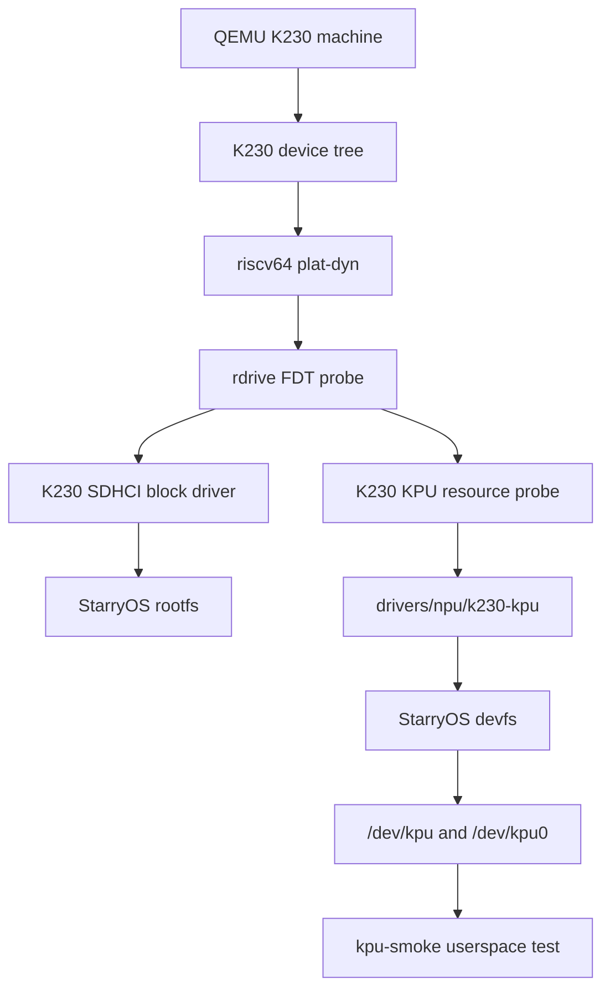

# K230 KPU/NPU StarryOS QEMU 适配工作记录

本文档是 K230 KPU/NPU 适配任务的课程报告草稿，用于记录当前阶段的目标、路线调整、实现架构、关键技术细节、验证结果和后续缺口。本文重点记录本地验证成果，不作为最终 PR 说明的唯一来源。

当前本地验证分支：

```text
codex/k230-kpu-upstream-dev
```

当前本地 worktree：

```text
/Users/joshua/tmp/tgoskits/target/worktrees/tgoskits-k230-upstream-dev
```

当前本地分支基线：

```text
upstream/dev
```

截至本文档记录时，当前本地分支包含以下与 K230 KPU/NPU 适配直接相关的提交：

| 提交 | 标题 | 作用 |
| --- | --- | --- |
| `aa993d9a4` | `feat(starryos): add K230 KPU QEMU bridge` | 建立 K230 QEMU 启动、KPU driver crate、devfs 节点和基础 smoke test |
| `146b5983c` | `feat(starryos): probe K230 KPU resources from FDT` | 将 KPU 资源探测迁移到 riscv64 动态平台/FDT/rdrive 路线 |
| `f6886bf85` | `test(starryos): exercise K230 KPU command completion` | 将 KPU smoke test 从寄存器访问推进到提交最小 command 并等待 done |
| `901293721` | `feat(starryos): add IRQ-backed K230 KPU wait` | 接入 KPU IRQ 189，使 `KPU_IOC_WAIT_DONE` 优先通过 IRQ/WaitQueue 等待，轮询作为兜底 |
| `aa0532434` | `test(starryos): verify K230 KPU fake output` | 预留 QEMU fake output window，通过 `/dev/kpu` 受限 mmap 验证 output page 被 KPU completion 清零 |
| `2fc2aedfe` | `test(starryos): exercise K230 KPU runtime buffers` | 预留 QEMU runtime scratch windows，复刻 runtime DDR mirror 和 runtime arg table direct I/O 路径 |
| `12637161a` | `test(starryos): add K230 KPU runtime image loader` | 把 runtime smoke 抽象成可替换 runtime image 装载层，为后续接真实模型产物预留用户态边界 |
| `946f6e6bb` | `test(starryos): load K230 KPU runtime image files` | 支持从 rootfs `.krun` 文件加载 runtime image，让真实模型转换器有可直接生成的目标格式 |
| `HEAD` | 待提交：NNCase runtime、权重读取修正和报告文档 | 在 StarryOS guest 内加载真实 `.kmodel`，通过官方 NNCase runtime 现场生成 54 条 KPU command，修正 RDATA mirror 后验证 QEMU KPU 正常读取权重并写回非零 Starry tensor |

## 1. 任务目标

本任务目标是在 StarryOS 中完成基于 QEMU K230 machine 的 K230 NPU 适配。

需要特别说明的是，K230 芯片语境和 QEMU 模型中把该 NPU 称为 KPU。因此本项目中的 driver crate、devfs 节点、测试程序和文档都采用 `kpu` 命名。这里的 KPU 即本任务所说的 NPU。

本阶段希望交付的是一个可以展示的功能版本，而不仅是静态编译通过。当前目标拆成以下几个层次：

1. StarryOS 能在 QEMU K230 machine 上启动到用户态测试程序。
2. K230 SDHCI 能作为 rootfs block device，让 K230 QEMU 启动路径可以加载测试 rootfs。
3. StarryOS 内核能从 K230 FDT 中发现 KPU 资源，而不是依赖手写静态 platform 常量。
4. StarryOS devfs 能向用户态暴露 `/dev/kpu` 和 `/dev/kpu0`。
5. 用户态能通过统一 UAPI 对 KPU 做 ioctl、mmap、寄存器访问和命令提交。
6. K230 QEMU smoke test 能证明一次最小 KPU command 在 QEMU 模型中完成，并读到 done status。
7. K230 QEMU smoke test 能进一步证明 QEMU KPU completion 会写出可检查的 output buffer side effect。

当前已经完成第 1 到第 7 项中的展示闭环，并已进一步接入 KPU IRQ-backed wait、QEMU fake output 可检查 side effect、runtime scratch mmap、runtime DDR mirror、runtime arg table direct I/O、用户态 runtime image 装载层、rootfs `.krun` 文件装载、kunOS/K230 SDK RT-Smart YOLOv8n 54 条真实 KPU command 的 full-sequence-delta 复放，以及 StarryOS 原生 NNCase runtime 加载真实 `.kmodel` 并生成/提交 54 条 KPU command。当前剩余增强项是 YOLO 输出语义层摘要、synthetic GNNE data-copy smoke 和 PR 级整理。

## 2. 上游信息和路线调整

本任务不是在一个完全稳定的上游基线上开发，而是需要和 StarryOS/ArceOS 近期的 RISC-V 平台重构、block driver 重构同步推进。当前关键上游信息如下。

| 来源 | 信息 | 对本任务的影响 |
| --- | --- | --- |
| `rcore-os/tgoskits#961` | 已经合并，RISC-V 路线迁移到动态平台 | K230 适配不应继续依赖旧的静态 `ax-plat-riscv64-k230` 路线 |
| `rcore-os/tgoskits#994` 评论 | 要求“请迁移至 riscv64 动态平台” | 当前 KPU 资源探测改为基于 `plat-dyn`、FDT 和 `rdrive` |
| `rcore-os/tgoskits#976` | 已合并到 `upstream/dev` | 当前已创建干净 `upstream/dev` PR 分支迁移 KPU/NPU 适配 |
| TA 回复 | “可以先做 npu 部分。qemu 可以切换块设备吧，可以切 mmio virtio 是不是能绕过去” | 短期优先保证 NPU/KPU 功能闭环，同时把 block/rootfs 路径放在能跟 #976 对齐的位置 |

因此当前本地路线为：

1. 保留 `codex/k230-kpu-rdif-spike` 作为完整验证成果分支。
2. 创建 `codex/k230-kpu-upstream-dev` 作为面向 `upstream/dev` 的干净 PR 分支。
3. KPU/NPU 逻辑不再依赖旧静态 K230 platform crate。
4. KPU CFG/L2/IRQ 均从 FDT node 中探测。
5. 当前 PR 直接以 `upstream/dev` 为 base。

这个策略的核心是把“可以演示的本地成果”和“最终上游 PR 基线”暂时解耦：本地先完成展示闭环，等上游 block 重构稳定后再做最终整理。

## 3. 当前架构总览

当前 K230 KPU/NPU 适配由 QEMU、FDT、动态平台、block driver、KPU driver、StarryOS devfs 和 test-suit 共同构成。



各层职责如下：

| 层 | 当前职责 |
| --- | --- |
| QEMU K230 machine | 提供 K230 machine、KPU MMIO/L2/IRQ 模型和 K230 SDHCI 模型 |
| K230 FDT | 描述 KPU、SDHCI、PLIC、UART、内存等硬件资源 |
| `plat-dyn` | 在 RISC-V 下通过 FDT 完成动态平台初始化 |
| `rdrive` | 保存并遍历 FDT，供 block driver 和 KPU devfs probe 使用 |
| `ax-driver/k230-sdhci` | 让 K230 SD rootfs 可以作为 StarryOS root block device 使用 |
| `drivers/npu/k230-kpu` | 封装 KPU 寄存器、命令范围、状态位和 UAPI ABI |
| StarryOS devfs | 注册 `/dev/kpu` 和 `/dev/kpu0`，实现 ioctl、mmap、read/write |
| `test-suit/starryos/k230-qemu` | 提供 K230 QEMU smoke test，用于本地展示和回归验证 |

## 4. K230 KPU 硬件资源

当前 KPU 资源来自 K230 FDT，而不是硬编码平台常量。FDT node 的关键内容如下：

```dts
kpu: kpu@80400000 {
    compatible = "canaan,k230-kpu";
    reg = <0x0 0x80400000 0x0 0x800>,
          <0x0 0x80000000 0x0 0x200000>;
    reg-names = "cfg", "l2";
    interrupts = <189>;
    interrupt-parent = <&plic>;
    status = "okay";
};
```

当前 StarryOS 侧识别到的资源如下：

| 资源 | 地址或数值 | 说明 |
| --- | --- | --- |
| `compatible` | `canaan,k230-kpu` | FDT probe 用于匹配 KPU node |
| CFG MMIO base | `0x80400000` | KPU 配置寄存器窗口 |
| CFG MMIO size | `0x800` | QEMU KPU register window size |
| L2 base | `0x80000000` | KPU L2 memory，当前用于 mmap 和 command buffer |
| L2 size | `0x200000` | 2 MiB |
| IRQ | `189` | KPU done interrupt |

这组资源会通过 `KPU_IOC_GET_INFO` 暴露给用户态。当前 smoke test 会检查：

1. CFG base 必须为 `0x80400000`。
2. CFG size 必须为 `0x800`。
3. L2 base 必须为 `0x80000000`。
4. L2 size 必须为 `0x200000`。
5. IRQ 必须为 `189`。
6. `flags` 中必须带有 `KPU_INFO_F_FDT`，证明这些资源来自 FDT probe。
7. `flags` 中必须带有 `KPU_INFO_F_IRQ_WAIT`，证明 KPU IRQ 189 已注册并用于 `WAIT_DONE` 的 IRQ 优先等待路径。

## 5. StarryOS 动态平台和 FDT 路线

本任务已经按上游要求迁移到 riscv64 动态平台路线。当前 K230 board 配置中启用：

```toml
plat_dyn = true
```

StarryOS 的 K230 feature 组合中包含：

```text
plat-dyn
starry-kernel/k230-kpu
ax-driver/k230-sdhci
ax-driver/serial
```

动态平台路线带来的关键变化是：

1. K230 不再需要单独维护静态 platform crate 来描述 MMIO 和 IRQ。
2. KPU 和 SDHCI 都从 device tree 中发现。
3. 设备资源能和 QEMU K230 machine 保持一致。
4. 后续如果 QEMU 或真实板卡 DTS 调整，内核侧更容易跟随。

这里需要注意一个重要实现点：KPU CFG 是 MMIO 设备窗口，不是普通 RAM。动态平台下不能简单把 `0x80400000` 用 RAM 线性映射方式转换成内核虚拟地址。当前实现通过内核 iomap 路径映射 KPU CFG，否则访问 `/dev/kpu` 会在 K230 QEMU 上触发 supervisor page fault。

## 6. Rootfs 和 K230 SDHCI

K230 QEMU 启动 StarryOS 用户态 smoke 需要 rootfs。当前本地 bridge 基于 #976 的 `rdif-block` 路线，让 K230 SDHCI 作为 root block device。

整体路径为：

```text
QEMU -drive if=sd,format=raw,file=<rootfs.img>
    -> K230 SDHCI model
    -> FDT compatible = "canaan,k230-sdhci", "snps,dwcmshc-sdhci"
    -> ax-driver/k230-sdhci
    -> rdif-block device
    -> StarryOS rootfs
    -> /usr/local/bin/kpu-smoke
```

当前本地验证重点不是 SDHCI driver 本身的性能或完整协议覆盖，而是保证 K230 QEMU 可以稳定加载 StarryOS rootfs，让 KPU smoke 有真实用户态环境可运行。

## 7. KPU driver crate

KPU driver crate 位于：

```text
drivers/npu/k230-kpu
```

该 crate 的定位是一个尽量小而清晰的 no_std 寄存器级 driver。它目前不试图实现完整 KPU runtime，而是提供 StarryOS devfs 和用户态 smoke 所需的最小可验证能力。

当前 driver crate 提供的核心内容包括：

| 内容 | 说明 |
| --- | --- |
| KPU 物理资源常量 | CFG/L2 的默认 K230 QEMU 地址和大小 |
| MMIO register offset | command start/end/high、control、status 等寄存器 offset |
| ioctl 常量 | `KPU_IOC_GET_STATUS`、`KPU_IOC_CLEAR`、`KPU_IOC_RUN` 等 |
| mmap offset 常量 | 区分 mmap CFG 和 mmap L2 |
| `CommandRange` | 用户态传给内核的 command stream 物理地址范围 |
| `KpuInfo` | 内核返回给用户态的 KPU 资源描述 |
| `Kpu` | 封装寄存器读写、命令编程、启动和 driver core 轮询等待；StarryOS glue 在其上实现 IRQ 优先等待 |

当前 command range 约束如下：

1. `start_paddr` 必须小于 `end_paddr`。
2. command range 不能为空。
3. `start_paddr` 和 `end_paddr` 必须位于同一个 4 GiB 窗口。
4. `COMMAND_HI` 只保存 command 地址的高 32 位。
5. 低 32 位分别写入 `COMMAND_START` 和 `COMMAND_END`。

这些约束与 QEMU KPU 模型的 command address 组合方式一致。

## 8. StarryOS devfs 节点

启用 `k230-kpu` feature 后，StarryOS devfs 会注册两个设备节点：

```text
/dev/kpu
/dev/kpu0
```

这两个节点指向同一个 KPU 设备，`/dev/kpu0` 作为兼容别名存在，方便未来扩展到多设备命名。

当前 devfs 支持的操作包括：

| 操作 | 当前行为 |
| --- | --- |
| `open("/dev/kpu")` | 打开主 KPU 设备 |
| `open("/dev/kpu0")` | 打开 KPU 兼容别名 |
| `pread` | 读取 CFG MMIO 寄存器 |
| `pwrite` | 写入 CFG MMIO 寄存器 |
| `ioctl(KPU_IOC_GET_INFO)` | 返回 KPU 资源信息 |
| `ioctl(KPU_IOC_GET_STATUS)` | 返回 64-bit KPU status |
| `ioctl(KPU_IOC_CLEAR)` | 清除 done 状态 |
| `ioctl(KPU_IOC_PROGRAM_COMMAND)` | 设置 command start/end/high |
| `ioctl(KPU_IOC_START)` | 触发 KPU start |
| `ioctl(KPU_IOC_RUN)` | program command 后 start |
| `ioctl(KPU_IOC_WAIT_DONE)` | IRQ 优先等待 done status，短超时后轮询兜底 |
| `mmap(KPU_MMAP_CFG_OFFSET)` | 将 KPU CFG MMIO 映射给用户态 |
| `mmap(KPU_MMAP_L2_OFFSET)` | 将 KPU L2 memory 映射给用户态 |

`KPU_IOC_GET_INFO` 是本阶段新增的重要调试和展示接口。它能让 smoke test 证明当前内核不是“碰巧硬编码地址能跑”，而是确实从 FDT 中探测到了 QEMU K230 KPU 资源。

## 9. 用户态 UAPI

用户态 UAPI 头文件位于：

```text
drivers/npu/k230-kpu/include/k230_kpu_uapi.h
```

该头文件由 StarryOS smoke test 使用，也可作为未来 KPU 用户态 runtime 的 ABI 基础。

当前主要 ioctl 如下：

| ioctl | 数值 | 作用 |
| --- | --- | --- |
| `KPU_IOC_GET_STATUS` | `0x4b00` | 读取 64-bit status |
| `KPU_IOC_CLEAR` | `0x4b01` | 清除 done |
| `KPU_IOC_PROGRAM_COMMAND` | `0x4b02` | 只编程 command range |
| `KPU_IOC_START` | `0x4b03` | 只启动 KPU |
| `KPU_IOC_RUN` | `0x4b04` | 编程 command range 并启动 |
| `KPU_IOC_WAIT_DONE` | `0x4b05` | IRQ 优先等待 done，轮询兜底 |
| `KPU_IOC_GET_INFO` | `0x4b06` | 获取 CFG/L2/IRQ/FDT 来源信息 |
| `KPU_IOC_GET_IRQ_COUNT` | `0x4b07` | 获取 KPU IRQ handler 处理次数 |

当前 `KPU_IOC_GET_INFO` 的 flags 包含：

| flag | 数值 | 含义 |
| --- | --- | --- |
| `KPU_INFO_F_FDT` | `0x1` | CFG/L2/IRQ 资源来自 FDT probe |
| `KPU_INFO_F_IRQ_WAIT` | `0x2` | KPU IRQ handler 注册成功，`WAIT_DONE` 启用 IRQ 优先等待 |

当前 mmap offset 如下：

| mmap offset | 作用 |
| --- | --- |
| `KPU_MMAP_CFG_OFFSET` | 映射 KPU CFG MMIO |
| `KPU_MMAP_L2_OFFSET` | 映射 KPU L2 memory |

当前 QEMU done status 常量为：

```text
KPU_DONE_STATUS = 0x0000000400000004
```

这与 QEMU KPU 模型中完成 command 后写入 status 的值一致。最新 smoke test 已经通过 `KPU_IOC_RUN` 和 `KPU_IOC_WAIT_DONE` 读到该状态。

## 10. KPU smoke test

KPU smoke test 位于：

```text
test-suit/starryos/k230-qemu/qemu-k230/kpu-smoke
```

该测试是当前可展示版本的核心证据。它不是只检查文件是否存在，而是依次验证了以下功能：

1. `/dev/kpu` 可以打开。
2. `/dev/kpu0` 可以打开。
3. `pread` 可以读取 KPU CFG 寄存器。
4. `KPU_IOC_GET_INFO` 可以返回 FDT 探测出的 CFG/L2/IRQ。
5. `KPU_IOC_CLEAR` 可以清理 KPU status。
6. 空 command range 会被拒绝，错误码为 `EINVAL`。
7. 合法 command range 可以写入 command start/end/high register。
8. KPU L2 可以 mmap 到用户态并读写。
9. 用户态可以把一个最小 command word 写入 KPU L2。
10. `KPU_IOC_RUN` 可以提交该 command range。
11. `KPU_IOC_WAIT_DONE` 可以等待 QEMU KPU 模型完成。
12. 完成后 status 中包含 `0x0000000400000004`。
13. KPU IRQ handler 计数在一次 run 后递增，证明 QEMU done IRQ 已送达 StarryOS。

最新关键输出如下：

```text
KPU_SMOKE: run_wait_done status=0x0000000400000004 irq_count=0->1
KPU_SMOKE_PASS
```

这说明当前 smoke 已经从“寄存器读写可用”推进到“QEMU KPU 模型能处理一次最小 command 并返回完成状态”。

## 11. 验证环境

本任务默认实验环境为 Docker/Linux。所有面向课程验收的命令和结果均以 Docker/Linux 环境为准。

当前使用的 Docker image：

```text
starryos-dev:ubuntu-qemu10.2.1
```

K230 QEMU 使用本地 `zevorn/qemu` 的 `chao-k230-dev` 分支构建产物，并通过挂载方式提供给 Docker 内部的 StarryOS test flow 使用。

本地 QEMU 源码路径：

```text
/Users/joshua/tmp/qemu
```

本地 K230 QEMU 构建产物路径：

```text
/Users/joshua/tmp/tgoskits/target/qemu-k230-docker-build
```

K230 QEMU 在测试中通过如下路径被 StarryOS xtask 发现：

```text
target/qemu-k230/bin/qemu-system-riscv64
target/qemu-k230/pc-bios
```

## 12. 已通过的验证记录

### 12.1 格式检查

已通过：

```text
cargo fmt --all -- --check
```

作用：

1. 确认 Rust 代码格式符合仓库要求。
2. 避免后续 rebase 或 PR 时出现纯格式噪声。

### 12.2 KPU driver crate 单元测试

已通过：

```text
cargo test -p k230-kpu
```

作用：

1. 检查 KPU driver crate 的 command range 边界条件。
2. 检查 Rust UAPI 常量和 C header 中的 define 是否一致。
3. 检查 `CommandRange` 和 `KpuInfo` 的 ABI layout。

### 12.3 KPU driver crate clippy

已通过：

```text
cargo xtask clippy --package k230-kpu
```

作用：

1. 确认 KPU driver crate 自身没有 clippy warning。
2. 满足仓库对 crate 修改后的 targeted clippy 要求。

### 12.4 StarryOS K230 target clippy

已通过：

```text
SOMEBOOT_RISCV64_KERNEL_LOAD_PADDR=0x08200000 cargo clippy -p starry-kernel \
  --target scripts/targets/pie/riscv64gc-unknown-none-elf.json \
  -Z unstable-options -Z json-target-spec -Z build-std=core,alloc \
  --features k230-kpu,plat-dyn -- -D warnings
```

作用：

1. 用 K230 实际目标参数检查 StarryOS kernel 中的 KPU devfs 代码。
2. 覆盖 `k230-kpu` 和 `plat-dyn` feature 组合。
3. 避免只验证 host crate 而漏掉 no_std/RISC-V 目标路径。

### 12.5 K230 QEMU smoke test

已通过：

```text
cargo xtask starry test qemu --test-group k230-qemu --arch riscv64 -c kpu-smoke
```

测试运行在 Docker/Linux 环境中，并使用本地 K230 QEMU 构建产物。

关键输出包括：

```text
k230-kpu devfs: cfg=[0x80400000, +0x800) l2=[0x80000000, +0x200000) fake_output=Some((269025280, 1048576)) irq=Some(189) irq_wait=true source=fdt
KPU_SMOKE: opened /dev/kpu
KPU_SMOKE: opened /dev/kpu0
KPU_SMOKE: reg0=0x00000000
KPU_SMOKE: info cfg=0x80400000+0x800 l2=0x80000000+0x200000 irq=189 flags=0xf
KPU_SMOKE: status=0x0000000000000000
KPU_SMOKE: clear_done ok
KPU_SMOKE: empty_command_rejected errno=22
KPU_SMOKE: program_command start=0x80000000 end=0x80000004 hi=0x00000000
KPU_SMOKE: mmap_status=0x0000000000000000
KPU_SMOKE: l2_mmap_rw=0x4b505532
KPU_SMOKE: run_wait_done status=0x0000000400000004 irq_count=0->1
KPU_SMOKE: fake_output_zeroed paddr=0x10090000 status=0x0000000400000004 irq_count=1->2
KPU_SMOKE: runtime_image runtime_ddr_mirror status=0x0000000400000004 irq_count=2->3
KPU_SMOKE: runtime_image runtime_arg_table_direct_io status=0x0000000400000004 irq_count=3->4
KPU_SMOKE: runtime_image file_runtime_arg_table_direct_io status=0x0000000400000004 irq_count=4->5
KPU_SMOKE_PASS
result: 1/1 case(s) passed
all starry k230-qemu qemu tests passed
```

这条 smoke test 是当前最重要的展示证据，因为它覆盖了从 QEMU K230 machine 到 StarryOS 用户态 `/dev/kpu` 的完整链路。

### 12.6 Git 空白检查

已通过：

```text
git diff --check
```

作用：

1. 检查 trailing whitespace。
2. 避免文档和代码中的空白错误影响后续 PR。

## 13. 当前阶段结论

当前本地分支已经满足“功能完善的可展示版本”的基础要求：

1. StarryOS 可以在 K230 QEMU machine 上启动 KPU smoke test。
2. K230 rootfs 路线已经切到 SDHCI/rdif-block bridge。
3. KPU 资源已经迁移到 riscv64 `plat-dyn`/FDT/rdrive 路线。
4. `/dev/kpu` 和 `/dev/kpu0` 已经可供用户态打开。
5. 用户态可以查询 FDT 探测到的 KPU CFG/L2/IRQ。
6. 用户态可以 mmap KPU L2 并写入 command word。
7. 用户态可以通过 `KPU_IOC_RUN` 提交 command。
8. 用户态可以通过 IRQ 优先、轮询兜底的 `KPU_IOC_WAIT_DONE` 等到 QEMU KPU done status。
9. 用户态可以读取 IRQ handler 计数，并确认一次 KPU run 后计数递增。
10. 当前 smoke 输出 `0x0000000400000004`，与 QEMU KPU 模型完成状态一致。

换句话说，当前版本已经不只是“设备节点存在”，而是具备一条从 FDT 探测、内核映射、UAPI、用户态 mmap、命令提交到 QEMU 模型完成的闭环。

## 14. 本轮 output buffer 和 runtime 路线

本轮主线工作聚焦两个比单纯 done status 更强的目标：

1. 做出 output buffer 可验证 smoke，证明 QEMU KPU 模型不仅置位 done/IRQ，还对 guest memory 产生可检查副作用。
2. 梳理真实 KPU runtime 路线，明确从当前 `/dev/kpu` UAPI 走向真实模型/command stream 还缺哪些资料和接口。

### 14.1 QEMU fake output 机制

已从 QEMU 源码确认，`/Users/joshua/tmp/qemu/hw/misc/k230_kpu.c` 的 KPU completion 路径大致为：

```text
k230_kpu_complete()
  -> k230_kpu_execute_gnne()
  -> k230_kpu_completion_zero()
  -> write STATUS = 0x0000000400000004
  -> assert IRQ 189
```

其中 `k230_kpu_completion_zero()` 会在 command 完成时重新扫描 command stream。它按 32-bit little-endian word 读取 command buffer，并对每个 word 做页对齐：

```text
page = value & ~(4096 - 1)
```

如果该页位于 QEMU 预留 fake output window：

```text
0x10090000 .. 0x10190000
```

则 QEMU 会把该 4 KiB page 清零。这个清零行为和 GNNE 指令是否真实执行成功是两条相对独立的验证路径：`k230_kpu_execute_gnne()` 负责解析 GNNE command，`k230_kpu_completion_zero()` 负责依据 command stream 中出现过的 output 地址做 fake output page zero。

QEMU qtest 中对应的最小用例是：

```text
K230_FAKE_KPU_OUTPUT_BASE = 0x10090000
K230_FAKE_KPU_OUTPUT_SIZE = 0x00100000
K230_KPU_OUTPUT_TEST0     = 0x10090000

commands[] = {
    K230_KPU_OUTPUT_TEST0 | 2,
}
```

qtest 会先把 `0x10090000` 所在页填成 `0xa5`，启动 KPU 后在 `K230_GNNE_DELAY_NS = 100 * 1000` 纳秒之前确认内容仍为 `0xa5`，延迟到期后确认该页变为 `0x00`，同时确认 status 为 `0x0000000400000004` 且 PLIC claim 到 IRQ 189。

这给 StarryOS smoke 一个非常适合展示的目标：先把 fake output page 初始化为非零值，提交包含 `0x10090000 | 2` 的 command stream，`WAIT_DONE` 返回后读回 output page，要求该页被 QEMU 清零。

### 14.2 StarryOS output smoke 的实现约束

当前 StarryOS smoke 已经能完成以下动作：

1. 通过 `KPU_IOC_GET_INFO` 获取 KPU CFG/L2/IRQ。
2. mmap KPU L2。
3. 把最小 command word 写入 KPU L2。
4. 通过 `KPU_IOC_RUN` 提交 command range。
5. 通过 IRQ-backed `KPU_IOC_WAIT_DONE` 等待完成。
6. 通过 `KPU_IOC_GET_IRQ_COUNT` 证明 IRQ handler 被触发。

要把 smoke 升级成 output buffer 可验证版本，关键新增需求是“用户态如何访问 fake output page”。QEMU qtest 可以直接 `qtest_memset/qtest_memread` 任意 guest physical address；StarryOS 用户态不能天然直接访问 `0x10090000` 这样的物理页。因此主线实现需要在以下方案中选一种：

| 方案 | 思路 | 状态 |
| --- | --- | --- |
| 新增 KPU fake output mmap offset | `/dev/kpu` 额外允许 mmap QEMU fake output window，smoke 用它填充和读回 `0x10090000` | 已实现/已验证 |
| 提供受限物理页映射 ioctl | 只允许映射 KPU smoke 需要的固定 output window，避免暴露通用 `/dev/mem` 语义 | 待实现/待验证 |
| 使用已有内存映射能力 | 如果 StarryOS 已有安全可控的物理内存映射设备，可复用它访问 `0x10090000` | 待调研 |
| 改用可 mmap 的 KPU L2 作为 output | 只有当 QEMU fake output 或 GNNE 指令能写回 `0x80000000` L2 时才成立 | 目前未从 QEMU fake output 路径确认 |

当前已经采用第一种路线：在 KPU 设备内部增加一个明确命名、范围固定、只用于 QEMU KPU smoke 的 fake output mmap offset。这样测试可以保持在 `/dev/kpu` 设备语义内完成，不需要引入通用物理内存访问接口。

具体实现点：

1. `k230-canmv.dts` 增加 `reserved-memory/kpu-fake-output@10090000`，范围为 `0x10090000..0x10190000`，并在 KPU node 上通过 `memory-region = <&kpu_fake_output>` 关联该窗口。
2. `k230-canmv.dtb` 必须由更新后的 DTS 重新生成；否则 QEMU 仍会加载旧 DTB，内核会看到 `fake_output=None`，smoke 中 `flags` 也只会是 `0x3`。
3. `drivers/npu/k230-kpu` 增加 `KPU_MMAP_FAKE_OUTPUT_OFFSET = 0x2000`、`KPU_FAKE_OUTPUT_PADDR = 0x10090000`、`KPU_FAKE_OUTPUT_SIZE = 0x100000` 和 `KPU_INFO_F_FAKE_OUTPUT = 0x4`。
4. StarryOS `/dev/kpu` 只在 FDT `memory-region` 指向 `compatible = "canaan,k230-kpu-qemu-fake-output"` 的 reserved-memory node 时暴露 fake output mmap。静态 fallback 不自动打开该窗口，避免把 QEMU 测试语义误扩展到真实硬件。
5. someboot/plat-dyn 会把该 reserved-memory 从 free memory 中扣掉。验证日志中已经出现：

```text
Rsv    0x00000010090000 - 0x00000010190000 (1 MiB)
[PA:0x10090000, PA:0x10190000) reserved
```

最终 smoke 流程如下：

```text
open /dev/kpu
GET_INFO -> 确认 cfg/l2/irq
mmap L2 -> 写入 command word: 0x10090000 | 2
mmap fake output -> memset output page 为 0xa5
GET_IRQ_COUNT -> before
RUN command range [0x80000000, 0x80000004)
WAIT_DONE
GET_STATUS -> 0x0000000400000004
GET_IRQ_COUNT -> after = before + 1
检查 fake output page 已变成 0x00
CLEAR
```

该 smoke 已通过。报告中可以把“done status/IRQ 可达”升级为“QEMU KPU completion side effect 可被 StarryOS 用户态观察到”。

### 14.3 QEMU GNNE synthetic command 路线

除了 fake output zero page，QEMU qtest 还包含更接近 GNNE 数据搬运的 synthetic command 用例。它们不只是依赖 completion zero，而是让 `k230_kpu_execute_gnne()` 解析 GNNE 指令并执行 L2 load/store、MFU、PU/PDP 等简化模型。

qtest 中最直接的 L2 store 用例是 `test_l2_store_copies_parsed_output()`。其思路是：

1. 把 source bytes 写入 synthetic GLB/source 地址。
2. 构造一段 GNNE command stream：
   - `GNNE_ADDI`
   - `GNNE_MMU_CONF`
   - `GNNE_SS_PACK_SHAPE`
   - `GNNE_SS_PACK_STRIDE`
   - `GNNE_L2_STORE_CONF`
   - `GNNE_L2_STORE`
3. 运行 command。
4. 从 output 地址读回数据，要求前半部分等于 source，后半部分仍是填充值。

该路线比 fake output zero 更接近真实数据搬运，但 StarryOS 侧需要解决两个问题：

1. synthetic GLB/source/output 地址是否能被用户态安全映射和初始化。
2. command stream 所在地址会影响 QEMU frontend 的 `glb_base` 计算。

QEMU frontend 初始化逻辑显示：

```text
if command_start in runtime window:
    glb_base = 0x10000020
else if command_start >= 0x003a6000:
    glb_base = command_start - 0x003a6000
```

qtest 使用 `K230_GNNE_COMMAND_TEST = 0x01000000`，因此 synthetic GLB base 为：

```text
0x01000000 - 0x003a6000 = 0x00c5a000
```

而当前 StarryOS smoke 把 command stream 放在 KPU L2：

```text
command_start = 0x80000000
```

这会让 QEMU 推导出的 synthetic GLB base 变为：

```text
0x80000000 - 0x003a6000 = 0x7fc5a000
```

因此如果要复用 qtest 的 GNNE synthetic command，不能只复制 command words，还要同时调整 source/output 物理地址，或者把 command stream 放到和 qtest 一致的 `0x01000000` 附近。这个细节是后续实现 output/data-copy smoke 时必须验证的关键点。

### 14.4 真实 runtime 相关地址和模型

QEMU qtest 里还出现了一组更像真实 runtime 的地址约定：

| 名称 | 地址 | 含义 |
| --- | --- | --- |
| `K230_GNNE_RUNTIME_RDATA_BASE` | `0x10000020` | runtime/rdata window base |
| `K230_GNNE_RUNTIME_FUNCTION_COMMAND` | `0x1032b020` | runtime function command stream 地址 |
| `K230_GNNE_RUNTIME_ARG_TABLE` | `0x80000000` | runtime argument table |
| `K230_GNNE_RUNTIME_DIRECT_SOURCE` | `0x10500020` | direct I/O source 示例地址 |
| `K230_GNNE_RUNTIME_DIRECT_OUTPUT` | `0x10501020` | direct I/O output 示例地址 |
| `K230_GNNE_RUNTIME_DDR_BASE` | `0x3c000000` | runtime DDR base |
| `K230_GNNE_RDATA_ALIAS_BASE` | `0xfc000000` | rdata alias marker |
| `K230_GNNE_RDATA_FALLBACK_BASE` | `0x10000000` | rdata fallback base |

QEMU 模型会判断 command start 是否位于 runtime window。如果是 runtime window，frontend 会把 `glb_base` 设为 `0x10000020`，并尝试识别 runtime argument table。`test_runtime_arg_table_drives_direct_io()` 展示了一条重要路径：

1. 在 `0x80000000` 放置 argument table。
2. table 前几个 word 指向 source/output/rdata。
3. command stream 从 `0x1032b020` 启动。
4. GNNE 指令通过 arg table 读取 direct source，并把结果写到 direct output。

这条路线对“真实 KPU runtime”很有参考价值，因为它已经不是单纯 fake output，而是让 command stream、参数表、输入 buffer、输出 buffer 形成较完整的运行结构。

### 14.5 真实 KPU runtime 尚缺资料

官方 K230/CanMV nncase runtime 文档给出的上层模型接口是 `load_kmodel`、`set_input_tensor`、`run`、`get_output_tensor`，模型文件是已编译的 `.kmodel`。参考资料包括：

1. CanMV K230 `nncase_runtime` API manual：<https://www.kendryte.com/k230_canmv/en/v1.3/api/nncase/K230_CanMV_nncase_runtime_API_Manual.html>
2. K230 nncase development guide：<https://gitee.com/kendryte/k230_docs/blob/main/en/01_software/board/ai/K230_nncase_Development_Guide.md>

这意味着 StarryOS 适配不应把 `.kmodel` 解析放入内核。内核侧应继续保持 `/dev/kpu` 的寄存器、mmap、run/wait 能力；模型解析、tensor 布局、arg table 和 command stream 组织应放在用户态 runtime。当前 StarryOS 侧还没有真实模型 runtime，主要缺口如下：

1. 缺真实模型文件来源，例如 K230/KPU 的 `kmodel`、nncase 编译产物或能离线生成 GNNE command stream 的工具链。
2. 缺 command stream 格式说明。QEMU qtest 提供了大量宏和 synthetic command，但这还不是完整 runtime ABI 文档。
3. 缺用户态 runtime 如何从模型文件中拆出 command buffer、weight、input、output 和 arg table 的代码。
4. 缺 DMA buffer 分配/固定/物理地址暴露接口。当前 `KPU_IOC_RUN` 接收的是物理 command range，真实 runtime 需要可靠获得 command/input/output buffer 的物理地址。
5. 缺 L2/DDR 数据搬运策略。需要决定哪些数据放 KPU L2，哪些数据放普通 DDR，以及如何保证 QEMU 模型和真实板卡语义尽量一致。
6. 缺 cache coherency 策略。真实硬件上，CPU 写 input/command 后、KPU 读之前，以及 KPU 写 output 后、CPU 读之前，都需要明确 cache flush/invalidate 规则；QEMU 当前可能无法暴露这类问题。
7. 缺多 submit/session 语义。真实 runtime 需要处理 busy、取消、超时、错误状态、重复提交和并发访问。

因此当前建议把真实 runtime 拆成三个阶段推进：

| 阶段 | 目标 | 说明 |
| --- | --- | --- |
| A | fake output smoke | 用最小 command 证明 QEMU completion output side effect 可观测 |
| B | synthetic GNNE data-copy smoke | 复用 qtest 的 L2 load/store command，证明可预测数据从 source 到 output |
| C | runtime arg table smoke | 复用 `runtime-arg-table-direct-io` 思路，验证 command/arg/input/output 四类 buffer 的组织 |
| D | runtime image 装载层 | 用统一数据结构描述 command、section、check，让手写 qtest 等价命令和未来真实产物共用执行路径 |
| E | 外部 `.krun` 文件装载 | 从 rootfs 读取 runtime image 文本文件，证明未来转换器产物不需要重新编译 smoke |
| F | 真实模型 runtime | 接入真实模型文件、真实 command stream 和用户态 runtime |

其中 A/C/D/E 已经完成；B 仍可作为可展示性补强；F 需要额外资料和工具链支撑。D/E 的价值在于，后续真实接入可以先生成 `.krun`/`kpu_runtime_image`，而不是继续把模型细节扩散进 smoke 主流程或内核 UAPI。

### 14.6 本轮已补证据

本轮主线实现完成后，已经补齐以下直接证据：

1. StarryOS smoke 新增 `KPU_SMOKE: fake_output_zeroed paddr=0x10090000 status=0x0000000400000004 irq_count=1->2`。
2. `/dev/kpu` UAPI 明确记录 fake output mmap offset、物理地址和 size。
3. K230 DTB 中 fake output window 被 reserved-memory 保护，启动日志确认该 1 MiB 区间不再进入普通 free memory。
4. smoke 的 `flags=0xf` 同时证明 FDT probe、IRQ-backed wait、fake output mmap 和 runtime scratch mmap 四个能力均可见。
5. QEMU 源码侧已经定位到 `k230_kpu_completion_zero()`，qtest 侧已经定位到 `test_delayed_completion()`。

仍建议报告最终版补截图或附录材料：

1. QEMU 源码截图覆盖 `k230_kpu_completion_zero()` 和 qtest `test_delayed_completion()`。
2. StarryOS 启动日志截图覆盖 reserved-memory 和 `fake_output=Some(...)`。
3. smoke 完整输出截图覆盖 `flags=0xf`、`run_wait_done`、`fake_output_zeroed`、`runtime_image runtime_ddr_mirror`、`runtime_image runtime_arg_table_direct_io`、`runtime_image file_runtime_arg_table_direct_io` 和 `KPU_SMOKE_PASS`。

## 15. 当前仍缺什么

当前版本仍然是 KPU/NPU 适配的第一阶段成果，还不是完整 NPU runtime。主要缺口如下。

### 15.1 IRQ-backed wait 的剩余增强

当前 `KPU_IOC_WAIT_DONE` 已经接入 IRQ-backed wait：KPU probe 会注册 IRQ
189，IRQ handler 只唤醒 `WaitQueue`，`WAIT_DONE` 读取 status 确认 done；
如果 IRQ 注册失败或等待短超时，则回到 driver core 的轮询等待。smoke test
已通过 `flags=0xf` 验证 FDT probe、IRQ wait flag、fake output mmap flag 和 runtime scratch mmap flag 同时存在。

后续还可继续增强：

1. 在 `/dev/kpu` 上提供 poll/eventfd 语义，方便用户态 runtime 集成事件循环。
2. 在真实硬件或更完整 QEMU 模型上复核 PLIC complete、IRQ 电平清除和多次提交时序。
3. 将 IRQ 计数暴露为 debugfs/procfs 节点，方便不用专用 ioctl 的人工检查。

### 15.2 真实模型 runtime

当前 smoke 使用最小 command word、runtime DDR mirror command stream、runtime arg table direct I/O command stream 和 kunOS/RT-Smart YOLOv8n full-sequence-delta capture，已经证明 QEMU KPU command completion、fake output side effect、runtime RDATA/DDR 搬运、runtime 参数表 direct I/O，以及真实 54 条 KPU command 序列复放均可用。本轮的 `kpu_runtime_image` 装载层把 command buffer、执行前 section 初始化、run-level delta 和执行后 output check 收敛为统一数据结构，并进一步支持从 rootfs `.krun` 文件加载同一描述。

它仍然没有在 StarryOS 用户态原生加载 `.kmodel`，也没有把 nncase runtime 移植到 StarryOS。但从工程边界上，下一步已经不再是证明 `/dev/kpu` 能不能承载真实 command，而是固化 capture/replay 复现链路，并评估把官方 runtime 或等价的 `.kmodel` 解析与 command 生成路径移植到 StarryOS 用户态。

后续可做：

1. 固化 kunOS reference capture 脚本、QEMU hook、转换命令和 StarryOS smoke 命令。
2. 补充 YOLO output tensor hash、bbox 数量或后处理结果摘要，用于报告展示。
3. 调研或复用 nncase runtime 中 command buffer、arg table、tensor input/output 和 RDATA 常量的生成逻辑。
4. 评估 StarryOS 用户态原生 `.kmodel` runtime：输入、command、输出 buffer 如何放入 KPU L2、runtime scratch 或合适 DMA 区域。
5. 在原生 runtime 可行后，用 `/dev/kpu` 完成一次由 StarryOS 用户态生成 command 的真实模型提交。

### 15.3 synthetic GNNE data-copy smoke

fake output smoke 已经完成，但它验证的是 QEMU completion zero page 路径，还不是 GNNE 指令对输入/输出 buffer 的真实数据搬运。下一层更有价值的模型级 smoke 是 synthetic GNNE data-copy。

后续可做：

1. 复用 QEMU qtest 中的 `test_l2_store_copies_parsed_output()` 思路。
2. 决定 command stream 放在 KPU L2 还是 qtest 相同的 `0x01000000` 附近。
3. 按 command start 推导出的 `glb_base` 调整 source/output 物理地址。
4. 在 StarryOS 侧准备 source buffer、output buffer 和 GNNE command stream。
5. smoke test 读取 output buffer，并检查固定输入到固定输出的可预测拷贝结果。

### 15.4 迁移到 upstream/dev

`rcore-os/tgoskits#976` 已合并，当前已经从最新 `upstream/dev` 创建干净分支 `codex/k230-kpu-upstream-dev`，并把 KPU/NPU 相关 patch 迁移到该分支。直接 rebase 旧 `codex/k230-kpu-rdif-spike` 会带入大量 RDIF/block 历史冲突，因此 PR 路线采用“干净 dev 分支 + KPU 路径迁移”。

后续流程建议：

1. 继续在 `codex/k230-kpu-upstream-dev` 整理 commit。
2. 确认不把 205 MiB capture 资产和 26 MiB 本地 runtime demo 二进制直接提交进 PR。
3. 重新运行 K230 target clippy、K230 QEMU smoke 和 NNCase runtime case。
4. 更新 PR 描述和验收文档，目标 base 为 `upstream/dev`。

## 16. 报告仍建议补充的实验证据

为了让课程报告更完整，建议后续再补以下证据：

1. QEMU KPU 模型源码截图或摘录，标明 `KPU_DONE_STATUS = 0x0000000400000004` 的来源。
2. FDT node 和 StarryOS 启动日志并列截图，证明 `canaan,k230-kpu` 被内核发现。
3. smoke test 完整日志截图，包含 `KPU_SMOKE_PASS`。
4. `/dev/kpu` 和 `/dev/kpu0` 的用户态打开日志，证明 devfs 节点注册成功。
5. `KPU_IOC_GET_INFO` 输出截图，证明 CFG/L2/IRQ 来自 FDT。
6. `KPU_IOC_RUN`/`KPU_IOC_WAIT_DONE` 输出截图，证明 command completion 可运行。
7. 已补充多轮 IRQ 触发和唤醒统计，当前 smoke 中 IRQ count 从 `0->1`、`1->2`、`2->3`、`3->4` 连续递增。
8. 已实现 output buffer fake output、runtime DDR mirror、runtime arg table direct I/O 验证。
9. 已实现 kunOS/RT-Smart YOLOv8n full-sequence-delta 复放；报告中应补充 `run=54/54`、`irq_count=54`、per-run hash 和真实 kmodel asset 识别日志。
10. 若后续实现 synthetic GNNE data-copy，再补 source bytes、command words、output bytes 和预期值对比。

## 17. 建议的展示脚本

如果需要向老师现场展示，建议按以下顺序讲解：

1. 解释 K230 NPU 在 QEMU/芯片文档中叫 KPU。
2. 展示 QEMU K230 FDT node 中的 `canaan,k230-kpu`。
3. 展示 StarryOS 当前使用 `plat-dyn = true`。
4. 展示 `drivers/npu/k230-kpu` 中的 UAPI 和 done status。
5. 展示 devfs 中 `/dev/kpu` 和 `/dev/kpu0` 的注册。
6. 运行 K230 QEMU smoke test。
7. 指出日志中的 FDT resource line。
8. 指出日志中的 `KPU_SMOKE: run_wait_done status=0x0000000400000004`。
9. 指出日志中的 `KPU_SMOKE: fake_output_zeroed paddr=0x10090000`。
10. 指出日志中的 `KPU_SMOKE: runtime_image runtime_ddr_mirror status=0x0000000400000004`。
11. 指出日志中的 `KPU_SMOKE: runtime_image runtime_arg_table_direct_io status=0x0000000400000004`。
12. 指出日志中的 `KPU_SMOKE: runtime_image file_runtime_arg_table_direct_io status=0x0000000400000004`，说明 rootfs 外部 runtime image 文件也能运行。
13. 指出日志中的 `KPU_SMOKE: runtime_image kunos_yolov8n_full_sequence_delta runs=54 status=0x0000000400000004 irq_count=0->54`，说明 StarryOS 已复放官方 RT-Smart YOLOv8n 展开后的完整 54 条 KPU command。
14. 指出日志中的 `real_kmodel ... magic=LDMK version=6`，说明真实模型资产也进入了同一 rootfs/test-suit 链路。
15. 总结当前已经完成从 QEMU model 到 StarryOS user program 的 completion + IRQ + output side effect + runtime buffer 搬运 + 完整 command replay 闭环。
16. 说明当前 smoke 已经有 `.krun`/`kpu_runtime_image` 用户态装载边界，后续重点是 StarryOS 原生 `.kmodel` runtime，而不是继续证明 offline capture replay 可行。

## 18. 当前可复现实验命令摘要

以下命令是当前报告中最重要的复现实验命令。实际运行时需要保证 Docker 内可访问本地 K230 QEMU 构建产物和 QEMU `pc-bios`。

```text
docker run --rm \
  -v "$PWD":/mnt \
  -v /Users/joshua/tmp/tgoskits/target/qemu-k230-docker-build:/qemu-k230-build \
  -v /Users/joshua/tmp/qemu/pc-bios:/qemu-pc-bios \
  -w /mnt starryos-dev:ubuntu-qemu10.2.1 bash -lc '
    ldconfig -p | grep -q libfdt.so.1 || (apt-get update && apt-get install -y libfdt1)
    export PATH=$PWD/target/qemu-k230/bin:/opt/riscv64-linux-musl-cross/bin:$PATH
    cargo xtask starry test qemu --test-group k230-qemu --arch riscv64 -c kpu-smoke
  '
```

目标成功输出至少应包含：

```text
KPU_SMOKE: info cfg=0x80400000+0x800 l2=0x80000000+0x200000 irq=189 flags=0xf
KPU_SMOKE: run_wait_done status=0x0000000400000004 irq_count=0->1
KPU_SMOKE: fake_output_zeroed paddr=0x10090000 status=0x0000000400000004 irq_count=1->2
KPU_SMOKE: runtime_image runtime_ddr_mirror status=0x0000000400000004 irq_count=2->3
KPU_SMOKE: runtime_image runtime_arg_table_direct_io status=0x0000000400000004 irq_count=3->4
KPU_SMOKE: runtime_image file_runtime_arg_table_direct_io status=0x0000000400000004 irq_count=4->5
KPU_SMOKE: runtime_image_progress name=kunos_yolov8n_full_sequence_delta run=54/54 irq_count=54
KPU_SMOKE: runtime_image kunos_yolov8n_full_sequence_delta runs=54 status=0x0000000400000004 irq_count=0->54
KPU_SMOKE: real_kmodel path=/usr/share/k230-kpu-smoke/models/yolov8n_320.kmodel size=3493048 magic=LDMK version=6 hash=0x0585d1887f7dd46c
KPU_SMOKE_PASS
```

## 19. 后续工作建议排序

在不急于推送 PR 的前提下，后续本地完善建议按以下优先级推进：

1. 固化 full-series capture/replay 复现脚本，包含官方 RT-Smart 启动、`K230_KPU_CAPTURE_DIR`、generator 和 StarryOS smoke 命令。
2. 补充 YOLO output tensor hash、bbox 数量或后处理结果摘要，让展示从“per-run hash 对齐”进一步扩展到模型输出语义。
3. 压缩或分层管理 full-sequence-delta capture 资产，避免 205 MiB 本地生成物直接进入仓库。
4. 调研真实 K230 runtime/kmodel 产物，明确 command blob、arg table、tensor input/output layout。
5. 评估 StarryOS 用户态原生 `.kmodel` runtime，让真实产物不再依赖 offline capture，而是由 StarryOS 自己生成 command/section/check 描述。
6. 设计真实 runtime 所需的 DMA buffer/物理地址管理接口，避免长期依赖 QEMU-only reserved-memory。
7. 做 synthetic GNNE data-copy smoke，证明低地址 synthetic GLB/qtest window 上的 GNNE 指令路径也能产生可预测输出。
8. 增加更多错误路径和多 submit 统计，例如无效 command range、超时、并发打开和重复 clear。
9. 在 `codex/k230-kpu-upstream-dev` 上整理 PR commit 和说明。
10. 提交面向 `upstream/dev` 的 PR，并把本文档中的报告内容整理进最终说明。

其中第 1 到第 5 项是通往原生真实模型 runtime 的主线。当前 runtime arg table direct I/O、DDR mirror、runtime image 装载层、`.krun` 文件装载和完整 54 条 command replay 已经完成，后续重点不再是证明 runtime scratch 或 offline replay 能否工作，而是补齐可复现材料、输出语义摘要和 StarryOS 用户态原生 runtime。

## 20. 面向老师汇报的阶段记录

本节用于课程阶段汇报，重点解释本阶段为什么没有停留在 QEMU fake output，而是继续推进到 runtime image 和 `.krun` 文件装载；同时明确当前 smoke 已经验证到什么程度、真实 `.kmodel` 接入还依赖什么、下一步如何形成 capture/convert/load 的闭环。

### 20.1 从 fake output 到 runtime image/`.krun` 的原因

最初的 KPU smoke 只验证了三件事：`/dev/kpu` 能打开、KPU 寄存器能访问、一次最小 command 提交后 QEMU 会返回 done status 和 IRQ。这能说明设备通路存在，但不足以说明 NPU/KPU 适配具备可展示的计算侧效果。因为 done status 和 IRQ 只是控制面结果，不能证明 command stream 对 guest memory 产生了可观察的数据写入。

因此第一步增强选择了 QEMU fake output。QEMU K230 KPU 模型在 completion 路径中会扫描 command stream，如果发现 command word 指向 fake output window，就会把对应 4 KiB output page 清零。StarryOS smoke 通过受限 mmap 暴露这个 QEMU-only fake output reserved-memory，先把 output page 填成 `0xa5`，再提交包含 `0x10090000 | 2` 的 command。`WAIT_DONE` 返回后，smoke 检查 output page 被清成 `0x00`。这一步的意义是：证明 StarryOS 不只是收到了 done/IRQ，还能观察到 QEMU KPU completion 对 guest physical memory 的副作用。

但 fake output 仍然不是完整 runtime。它依赖 QEMU completion zero 规则，和真实模型中的 command buffer、参数表、输入 tensor、输出 tensor、RDATA、DDR 搬运关系仍有距离。继续停在 fake output 会造成一个问题：展示时可以说“QEMU KPU 有写内存副作用”，但不能说明 StarryOS 已经具备接入真实 KPU runtime 的边界。

所以第二步推进到 QEMU qtest 中的 runtime 风格路径，尤其是 `runtime-arg-table-direct-io` 和 `l2-store-runtime-ddr-mirror`。这两条路径比 fake output 更接近真实 runtime：

| 路径 | 覆盖内容 | 对真实模型接入的意义 |
| --- | --- | --- |
| fake output zero | command completion 扫描 output 地址并清零页面 | 证明 output side effect 可被 StarryOS 用户态观测 |
| runtime DDR mirror | command、RDATA alias、DDR window、L2 store/load | 证明 RDATA/DDR 搬运和 runtime scratch window 可用 |
| runtime arg table direct I/O | command stream、L2 arg table、direct input、direct output | 证明 command 可以通过参数表找到输入输出 buffer，并产生可预测输出 |

在这之后，继续把 runtime smoke 抽象成 `kpu_runtime_image`，再进一步支持 rootfs 中的 `.krun` 文件，是为了避免把后续真实模型接入写死在 smoke C 代码里。当前 `.krun` 已经能描述：

1. command stream 放在哪个物理地址；
2. 执行前要向哪些 window 写入 input、arg table、RDATA、DDR 或 output 预填内容；
3. 执行后要检查哪个 output window、哪些字节必须等于预期值、哪些尾部字节必须保持填充值。

这就是从“手写测试”走向“真实模型产物装载”的关键过渡：未来真实 `.kmodel` 或官方 runtime capture 只要能被转换成 `.krun`，就可以不改内核、不改 `/dev/kpu` UAPI、不重新编译 smoke，直接进入当前 K230 QEMU 端到端验证流程。

### 20.2 当前 smoke 已验证能力

当前 K230 QEMU smoke 已经覆盖从平台发现到 runtime 文件装载的完整本地展示链路。按验证层次可以分为以下几类。

| 层次 | 已验证内容 | 代表日志/现象 |
| --- | --- | --- |
| 平台启动 | StarryOS 可在 QEMU K230 machine 上启动并运行 rootfs 中的测试程序 | `all starry k230-qemu qemu tests passed` |
| 动态平台 | KPU CFG/L2/IRQ 来自 FDT/rdrive，而不是旧静态 platform 常量 | `flags` 包含 `KPU_INFO_F_FDT` |
| devfs | `/dev/kpu` 和 `/dev/kpu0` 都能被用户态打开 | `KPU_SMOKE: opened /dev/kpu`、`opened /dev/kpu0` |
| MMIO/UAPI | 用户态可读写 CFG register，可通过 ioctl 获取 status/info/irq count | `cfg=0x80400000+0x800 l2=0x80000000+0x200000 irq=189` |
| L2 mmap | 用户态可 mmap KPU L2，并在 L2 中布置 command buffer 或 arg table | `l2_mmap_rw=0x4b505532` |
| command submit | `KPU_IOC_RUN` 能编程 command start/end/high 并启动 KPU | `program_command start=0x80000000 end=0x80000004` |
| done/IRQ | `KPU_IOC_WAIT_DONE` 能等到 QEMU done status，IRQ count 随 submit 递增 | `status=0x0000000400000004 irq_count=0->1` |
| output side effect | fake output page 从 `0xa5` 被 QEMU completion 清为 `0x00` | `fake_output_zeroed paddr=0x10090000` |
| runtime DDR/RDATA | runtime command 能触发 RDATA alias 和 DDR mirror 可检查写入 | `runtime_image runtime_ddr_mirror` |
| runtime arg table | command stream 能通过 L2 arg table 找到 direct source/output 并完成搬运 | `runtime_image runtime_arg_table_direct_io` |
| 外部文件装载 | rootfs `.krun` 文件能被 smoke 读取、解析、提交并检查输出 | `runtime_image file_runtime_arg_table_direct_io` |

当前最完整的一次 smoke 输出应至少包含：

```text
KPU_SMOKE: info cfg=0x80400000+0x800 l2=0x80000000+0x200000 irq=189 flags=0xf
KPU_SMOKE: run_wait_done status=0x0000000400000004 irq_count=0->1
KPU_SMOKE: fake_output_zeroed paddr=0x10090000 status=0x0000000400000004 irq_count=1->2
KPU_SMOKE: runtime_image runtime_ddr_mirror status=0x0000000400000004 irq_count=2->3
KPU_SMOKE: runtime_image runtime_arg_table_direct_io status=0x0000000400000004 irq_count=3->4
KPU_SMOKE: runtime_image file_runtime_arg_table_direct_io status=0x0000000400000004 irq_count=4->5
KPU_SMOKE_PASS
```

这里的 `flags=0xf` 很重要，表示四个关键能力同时成立：

| flag | 能力 |
| --- | --- |
| `0x1` | KPU 资源来自 FDT |
| `0x2` | `WAIT_DONE` 已接入 IRQ 优先等待 |
| `0x4` | QEMU fake output mmap 可用 |
| `0x8` | QEMU runtime scratch mmap 可用 |

因此当前成果已经不是“设备节点和寄存器可用”的早期状态，而是具备一条可以展示的 runtime 风格链路：FDT 探测、受限 mmap、command stream、arg table、input/output buffer、done/IRQ、output 检查和外部 `.krun` 文件装载。

### 20.3 真实 `.kmodel` 接入计划、依赖与风险

本节是 StarryOS 原生 NNCase runtime 接入前的早期计划记录；20.7 和 20.9 已经把路线推进到 guest 内加载真实 `.kmodel`、生成 54 条 command，并完成权重/RDATA 读取修正。

当前尚未声明 StarryOS 已经原生加载 `.kmodel` 并完成 YOLOv8n 推理。当前已经完成的是获得官方 K230 `.kmodel` 资产，把 smoke/rootfs 流程扩展到可以可选安装和校验该资产，并进一步把 kunOS/K230 SDK RT-Smart YOLOv8n reference 展开后的 54 条 KPU command 转成 full-sequence-delta `.krun` 在 StarryOS 中完整复放。下一阶段的目标是从 offline replay 继续推进到 StarryOS 用户态原生 runtime，让 `.kmodel` 解析、tensor/buffer 布置和 command 生成也发生在 StarryOS 侧。

计划上不建议一开始就手写 `.kmodel` parser。原因是 `.kmodel` 是 nncase 编译后的模型文件，里面不仅有图结构和 tensor 信息，还可能包含 target 版本、runtime 元数据、权重布局、函数表、RDATA、command stream 或间接生成 command stream 所需的信息。直接逆向 `.kmodel` 风险高，且容易把模型格式细节错误地塞进 StarryOS 内核或 `/dev/kpu` UAPI。更稳妥的路线是先使用官方 K230 SDK/CanMV/nncase runtime 加载真实 `.kmodel`，在 QEMU 或官方 runtime 边界处抓取已经展开后的 KPU command stream 和 buffer 布局。

真实 `.kmodel` 接入的主要依赖如下：

| 依赖 | 需要拿到的内容 | 用途 |
| --- | --- | --- |
| K230 `.kmodel` 文件 | 已获取官方 `kmodel_v2.1.0.tgz` 中的 `yolov8n_320.kmodel` | 作为真实模型输入 |
| 输入样本 | 图片、tensor 或固定输入 bytes | 用于可重复推理 |
| 参考输出 | 官方 runtime 输出 tensor、top-k、bbox 或固定摘要 | 用于 StarryOS smoke 校验 |
| 官方 runtime/SDK | `nncase_runtime`、K230 SDK AI demo、CanMV 示例等 | 用于确认模型可运行并生成 capture |
| QEMU KPU 模型 | 当前 `chao-k230-dev` 分支的 KPU/KPU qtest 行为 | 用于在本地复现 command side effect |
| capture 工具 | 能记录 command buffer、arg table、RDATA、DDR、input/output 的脚本或日志 | 用于生成 `.krun` |
| `.krun` 转换器 | 已加入 `capture-to-krun.py` 的 JSON 转换入口 | 用于接入现有执行路径 |

主要风险如下：

| 风险 | 影响 | 缓解思路 |
| --- | --- | --- |
| `.kmodel` 与 runtime/nncase 版本不匹配 | 官方 runtime 无法加载或输出不稳定 | 优先使用同一 SDK release 中的模型、runtime 和 demo |
| 真实模型使用 QEMU 未建模的算子或 KPU 指令 | QEMU 能启动但输出不符合参考 | 先选极小模型或官方 smoke/demo 模型，优先覆盖 QEMU qtest 已支持的路径 |
| command stream 不是直接存放在 `.kmodel` 中，而是 runtime 动态生成 | 单靠解析文件无法得到 `.krun` | 先做 runtime capture，而不是直接解析 `.kmodel` |
| 输入/输出 tensor 布局复杂 | `.krun` 的 `check` 不容易表达完整输出 | 第一版只检查输出摘要、固定前缀、shape 或 checksum，后续再扩展格式 |
| 真实 runtime 需要动态 DMA buffer | 当前 QEMU-only reserved-memory 不适合作为长期 ABI | 演示阶段用 reserved-memory，真实化阶段再设计 DMA buffer/物理地址管理 |
| cache coherency 在 QEMU 中不暴露 | QEMU 通过但真实板卡可能需要 flush/invalidate | 文档中明确 QEMU 验证边界，后续真实硬件再补 cache API |
| 多 submit 或 RDATA shadow 状态污染 | 连续运行结果受前一次 command 影响 | capture 中记录初始化顺序，smoke 每次运行前显式清理相关 window |

第一版真实模型建议选取满足以下条件的 `.kmodel`：

1. 来源明确，最好来自 K230 SDK 或官方 CanMV 示例；
2. 输入小，能用固定 bytes 或一张小图片复现；
3. 输出容易检查，例如分类 top-k、少量 bbox、固定 tensor 前缀或 checksum；
4. 使用的算子尽量简单，优先避开 QEMU KPU 模型尚未覆盖的复杂后处理；
5. 对应 runtime 版本和模型版本一致，避免 nncase ABI 差异。

当前选择的第一版模型是官方 `kmodel_v2.1.0.tgz` 中的 `yolov8n_320.kmodel`，SHA-256 为 `8e45b6083019429181a5cfa2853404eb2e2b61b6570651d341e92ca347a66bd1`。本地脚本 `test-suit/starryos/k230-qemu/qemu-k230/kpu-smoke/c/tools/prepare-real-kmodel.sh` 会把它安装到 smoke 的 `assets/kmodels/` 目录。模型二进制不提交到仓库；如果它在构建时存在，CMake 会安装到 guest 的 `/usr/share/k230-kpu-smoke/models/yolov8n_320.kmodel`，smoke 会验证 `LDMK` magic、版本、大小和内容 hash。

这一级验证的意义是把真实模型文件纳入可重复展示流程。结合 full-sequence-delta replay，当前已经能证明官方 runtime 展开后的 KPU 推理材料可以通过同一 StarryOS rootfs/test-suit 链路分发并执行；但它仍不是 StarryOS 原生 `.kmodel` runtime。

### 20.4 下一步 capture/convert/load 闭环

下一步主线不是继续扩内核功能。offline replay 闭环已经阶段性跑通，后续应围绕真实模型建立两条更可报告的链路：一条是把“官方 runtime 运行一次 -> 捕获展开后的 KPU 运行材料 -> 转换成 `.krun` -> StarryOS 加载执行”脚本化、可复现化；另一条是评估“StarryOS 用户态 runtime 直接加载 `.kmodel` -> 生成 command -> `/dev/kpu` 执行”。

建议闭环如下：

```mermaid
flowchart LR
    A["真实 .kmodel + 输入样本"] --> B["官方 K230 nncase runtime 或 SDK demo"]
    B --> C["capture command/arg/RDATA/input/output"]
    C --> D["规范化 capture JSON 或文本中间格式"]
    D --> E["convert to .krun"]
    E --> F["安装到 StarryOS rootfs"]
    F --> G["kpu-smoke load .krun"]
    G --> H["/dev/kpu RUN + WAIT_DONE"]
    H --> I["检查 output 或 checksum"]
```



每一步的目标如下：

| 步骤 | 产物 | 通过标准 |
| --- | --- | --- |
| 1. 获取模型 | `.kmodel`、输入样本、参考输出 | 官方 runtime 能独立跑通 |
| 2. capture | command stream、arg table、RDATA、input、output、DDR window dump | 能解释一次 run 需要初始化哪些 buffer |
| 3. 规范化 | 一份 capture JSON/文本，字段明确 | 不依赖临时日志格式，可重复转换 |
| 4. convert | `.krun` 文件 | 包含 `command_paddr`、`commands`、`copy/fill/check`，大输出可用 `check_hash` |
| 5. load | rootfs 中的 `.krun` | smoke 能读取并进入 `run_runtime_image()` |
| 6. run | KPU done/IRQ 和 output check | 已完成 54 条 command 的 `KPU_SMOKE_PASS` 和 per-run hash；后续补 YOLO 输出语义摘要 |

当前已经完成闭环的关键执行段：`官方 runtime/capture -> .krun -> rootfs -> kpu-smoke -> /dev/kpu -> done/IRQ -> output check`。其中 full-sequence-delta capture 已覆盖 54 条真实 KPU submit 和 run-level memory delta。仍然需要补强的是复现脚本、资产体积管理、输出语义摘要，以及 StarryOS 原生 `.kmodel` runtime。

为了降低风险，capture/convert/load 建议先做两级目标：

1. 保留 qtest 等价 runtime capture fixture，要求生成结果和当前手写 `runtime-direct-io.krun` 行为一致。这一步继续验证 converter 本身。
2. 保留真实 `.kmodel` 的官方 runtime full-sequence-delta capture，要求 StarryOS smoke 能加载并得到与官方 runtime 一致的 per-run hash。
3. 在此基础上补 YOLO output tensor 或后处理摘要，最终形成更接近“模型结果”的展示证据。

这样可以把问题拆开：如果第一级失败，说明 converter 或 `.krun` 表达有问题；如果第二级失败，才重点排查真实模型 command、buffer layout、QEMU 支持度或参考输出差异；如果第三级失败，则集中排查 YOLO 后处理或输出语义解释。

### 20.5 本轮文档补充结论

本节是原生 NNCase runtime case 落地前的文档阶段记录；20.7 和 20.9 是更新后的实现与验证结论。

本轮并行文档补充只整理真实模型 runtime 路线，不修改代码、配置或测试资产。补充后的关键结论如下：

1. 当前 StarryOS 侧已经完成 KPU 设备通路、FDT CFG/L2/IRQ probe、`/dev/kpu`/`/dev/kpu0`、IRQ-backed `KPU_IOC_WAIT_DONE`、QEMU fake output mmap、runtime scratch windows、`.dtb` reserved-memory、`KPU_INFO_F_RUNTIME_SCRATCH`、runtime DDR mirror、runtime arg table direct I/O、`.krun` 文件装载，以及真实 `yolov8n_320.kmodel` 资产校验入口。
2. 这些能力说明 StarryOS 已经具备承载真实 runtime capture 的底层接口，但还不能表述为“真实 YOLOv8n 已经推理成功”。
3. QEMU fake output 与真实模型 runtime 是两个不同阶段。fake output 验证 completion side effect 和设备链路；真实 runtime 需要官方 runtime 展开的 command stream、RDATA、direct I/O、DDR、输入输出 buffer 和 reference output/hash。
4. 距离真正跑 `yolov8n_320.kmodel`，当前缺口是 RT-Smart、CanMV SDK 或 K230 nncase runtime 侧的真实运行 capture，以及 `capture-to-krun.py` 将该 capture 转成 smoke 可执行 `.krun` 的落地。
5. 后续实验环境按 Docker/Linux 和官方 K230 runtime 环境组织。

后续工作应优先从官方 runtime 侧拿到一次稳定 capture。capture 至少需要包含 command buffer、arg table、RDATA 初始化、DDR/weight 区、输入 tensor bytes、输出 buffer 初值、reference output 或 hash，以及 clear/program/start/wait 的 submit 时序。拿到 capture 后，先生成保守的单 submit `.krun`，在现有 `kpu-smoke` 路径中检查 done/IRQ 和 output hash；如果失败，再按 physical address、RDATA shadow、DDR 初始化、输入 bytes 和 QEMU command 覆盖度逐项拆解。

### 20.6 本轮工具链补强

在文档路线之外，本轮同步补强了真实 capture 接入前的 smoke 工具链：

1. `kpu-smoke` 的 `.krun` loader 从固定小数组改为堆分配，把上限提升到 65536 个 command word、4096 个 section、1024 个 check 和 16 MiB inline payload。
2. `capture-to-krun.py` 支持 `data_hex`/`expected_hex`，并会把 command stream 和 copy bytes 分块写出，避免真实 runtime capture 因单行过长而超过 guest loader 的行/token 限制。
3. 新增 `tools/fixtures/runtime-direct-io.capture.json`，用于证明当前 `runtime-direct-io.krun` 可以从 JSON capture 稳定生成。
4. 本轮验证包括：`capture-to-krun.py` fixture 生成结果与现有 `.krun` 完全一致；Docker/Linux 下 `cargo xtask starry test qemu --test-group k230-qemu --arch riscv64 -c kpu-smoke` 通过，guest 输出包含 `runtime_ddr_mirror`、`runtime_arg_table_direct_io`、`file_runtime_arg_table_direct_io` 和真实 `yolov8n_320.kmodel` header/hash 校验。

因此当前离真实模型运行最近的缺口已经进一步收敛为“拿到官方 runtime capture”。只要 capture 能给出真实 command、RDATA、direct I/O、DDR 和 reference output/hash，现有 `.krun` 路径已经可以承接第一版单 submit replay。

### 20.7 StarryOS 原生 NNCase runtime 核心路径跑通

本节记录的是 `_Exit` 和完整 RDATA mirror 落地前的阶段性状态；最新结论见 20.9。20.9 已确认 `kpu-nncase-runtime` case 完整通过，高地址权重读取缺失问题已修正。

随后主线从 offline replay 继续推进到 StarryOS 原生 NNCase runtime。当前已经新增 `kpu-nncase-runtime` case，并在 Docker/Linux + QEMU K230 下跑通 minimal 的核心运行路径：

```text
cargo xtask starry test qemu --test-group k230-qemu --arch riscv64 -c kpu-nncase-runtime
```

这次验证解决了几个关键问题：

1. 官方 SDK toolchain 直接生成的 ELF entry 曾为 `0x0`，且 SDK libc syscall number 更偏 RT-Smart ABI，不能直接作为 Starry/Linux 用户态运行。
2. 当前构建改为使用官方 K230 SDK g++/binutils 链接 NNCase/K230/RVV 静态库，但入口、CRT、libc 和 libgcc 使用 Linux riscv64-musl 版本，避免 RT-Smart syscall ABI。
3. 官方 NNCase/RVV 库会执行标准 RISC-V V 指令，QEMU K230 必须切到 C908V 路径；case 已使用 `-smp 2`，并补齐 StarryOS K230 feature 的用户态 vector status 初始化。
4. 用户态 compat shim 接住 `/dev/gnne_device`、`/dev/ai_2d_device`、`/dev/mem`、MMZ allocator 和 `gnne_enable`。其中 fake fd 必须返回正数，负数会被官方 runtime 当作 `open` 失败。

当时最小 runtime demo 已在 StarryOS guest 内完成真实 `.kmodel` 加载和 54 次 runtime command submit。调试还确认官方 `gnne_get_l2()` 固定返回 `0x80000000`，因此 Starry/Linux ABI 下必须只 identity-map L2 window；不能把低位 runtime windows 整体 identity-map，否则会更早破坏 allocator 或用户地址空间。

```text
NNCASE_MINIMAL: loading kmodel path=/usr/share/k230-nncase-runtime/models/yolov8n_320.kmodel bytes=3647752
NNCASE_MINIMAL: load_model ok
NNCASE_MINIMAL: model io inputs=1 outputs=4
NNCASE_MINIMAL: input[0] datatype=6 shape=[1,3,320,320] bytes=307200
NNCASE_MINIMAL: output[0] datatype=11 shape=[1,84,2100] elements=176400
K230_SDK_COMPAT: identity mmap l2 0x80000000..0x80200000
K230_SDK_COMPAT: gnne_enable raw=0x3c348b48..0x3c3548fc len=48564 mode=native submit=0x3c348b48
K230_SDK_COMPAT: arg_table words=0x3c373020 0x3c596020 0x3c000020 0x00000000
K230_SDK_COMPAT: gnne_enable run=54 ... status=0x0000000400000004
NNCASE_MINIMAL: interp.run done
NNCASE_MINIMAL: output[0] bytes=705600 fnv1a64=0xd6a6104f94a0f14d
NNCASE_MINIMAL: output[1] bytes=921600 fnv1a64=0x4f3d4f365ffe92c7
NNCASE_MINIMAL: output[2] bytes=230400 fnv1a64=0x46c5f8b546d3c03c
NNCASE_MINIMAL: output[3] bytes=57600 fnv1a64=0xaa7fb54b066ea32e
K230_SDK_COMPAT: stats mmz_alloc=15 kpu_run=54
NNCASE_MINIMAL_PASS
Assertion failed: bytes >= sizeof(free_heap_node) (.../mmz_allocator.cpp: insert_free_node: 170)
```

这段历史日志说明 `.kmodel -> NNCase runtime -> 54 条 KPU command -> /dev/kpu -> done/IRQ -> output hash` 当时已经做到。当时失败点在官方 K230 SDK/MMZ allocator 的进程退出清理路径，不是 KPU run 本身。后续 `_Exit(0)` workaround 只应在 demo 已打印 PASS 并 flush 日志后使用，用于跳过 SDK 静态析构；它不改变 command stream、KPU submit、done/IRQ 或 output hash。

图片 demo 曾经跑到执行链路后段，以下日志用于记录当时的语义缺口；这是 `_Exit` 清理 workaround 和完整 RDATA mirror 落地前的历史证据：

```text
YOLOV8N_DEMO: decode image=/usr/share/k230-nncase-runtime/images/bus.jpg width=810 height=1080
YOLOV8N_DEMO: load_model ok inputs=1 outputs=4
YOLOV8N_DEMO: preprocess layout=NCHW input=320x320
K230_SDK_COMPAT: gnne_enable run=54 ... status=0x0000000400000004
YOLOV8N_DEMO: run done
YOLOV8N_DEMO: output[0] bytes=705600 fnv1a64=0xc384d1499b2ad56e
YOLOV8N_DEMO: output[0] stats finite=176400 nan=0 min=0.000000 max=0.062500 mean=0.011903
YOLOV8N_DEMO: output[1] stats finite=230400 nan=0 min=0.000000 max=0.000000 mean=0.000000
YOLOV8N_DEMO: postprocess threshold score=0.15 nms=0.20
YOLOV8N_DEMO: postprocess rows=2100 channels=84 candidates=0
YOLOV8N_DEMO: score_top[0] row=0 class=person score=0.062500 box_raw=(0.000,0.000,0.000,0.000)
YOLOV8N_DEMO: detections=0
YOLOV8N_DEMO: annotated=/tmp/k230-yolov8n-demo.ppm
K230_SDK_COMPAT: stats mmz_alloc=15 kpu_run=54
YOLOV8N_DEMO_PASS
K230_NNCASE_RUNTIME_PASS
all starry k230-qemu qemu tests passed
```

这个阶段已经从“只能复放官方 runtime 展开后的 54 条 command”推进到“StarryOS guest 内原生加载 `.kmodel`，由官方 NNCase runtime 现场生成并提交 54 条 KPU command”。当时剩余缺口分成两类：第一是工程稳定性，需要用受限 `_Exit` workaround 避开 SDK/MMZ allocator 退出清理 abort；第二是 YOLO 输出语义与官方 RT-Smart reference 的逐项对齐。后续 20.9 已解决第一类问题，并把第二类问题进一步收敛为 output tensor/direct output 语义对齐。

### 20.8 Direct-IO/output 诊断收敛

本节记录的是完整 RDATA mirror 前的 direct-io/output 诊断；最新结论见 20.9。20.9 已确认 QEMU KPU 能从 Starry runtime alias 正常读取权重/RDATA，并写回非零 Starry tensor。

本轮 direct-io 诊断把剩余问题进一步收敛：

| 证据 | 结果 | 结论 |
| --- | --- | --- |
| NNCase output paddr | `output0=0x3c3bf020`、`output1=0x3c46c020`、`output2=0x3c54e020`、`output3=0x3c587020` | StarryOS 已能拿到 runtime output tensor 物理地址 |
| QEMU/kunOS final bbox direct-io | `0x1059a900`，`33600` bytes | StarryOS 当前读取 stats 全 0 |
| QEMU/kunOS final class direct-io | `0x105b0e20`，`672000` bytes | StarryOS 当前读取 stats 全 0 |
| 预处理 input direct source | 拷贝到 `0x10500020`，hash `0xfe3bfacc028c5231` | direct source 已有输入，但 direct output 仍全 0 |

因此当前排除项包括：模型加载失败、54 条 command 未提交、简单阈值/后处理错误、单纯 output tensor copy-back 缺失、direct source 完全未填充。下一步最有效的证据路径是抓 StarryOS 运行 `kpu-nncase-runtime` 的 QEMU KPU trace，并和 kunOS/RT-Smart reference trace 按 command 序列逐条 diff，定位第一个 `l2_load`、`l2_store` 或 `l2_store_hash` 分叉点。

### 20.9 StarryOS NNCase runtime 权重读取修正

本轮按“先完成正常读取权重，预处理/后处理后置”的目标继续收敛。关键判断是：地址不需要和官方 RT-Smart 完全相同，只要 QEMU KPU 能从 StarryOS 提交时声明的物理窗口读到同一份 RDATA/权重，并把结果写回 Starry tensor，就可以作为当前阶段的正确边界。

修正点在 `k230_sdk_compat.cc` 的 runtime RDATA mirror。早期只把官方 runtime DDR 中 `0x3c000020` 开始的一段镜像到 `0x10000020`，长度停在 `KPU_RUNTIME_COMMAND_PADDR - KPU_RUNTIME_RDATA_BASE`，也就是 `0x10000020..0x10190000`。trace 显示前半段权重读取已经非零，但后续大量 `0x102...` 和 `0x103...` 权重读取仍是 `head 0x0`，说明官方 runtime image 中 command/runtime 后半段并没有被镜像到 QEMU KPU 可见的低位窗口。

最新修正把 mirror 长度扩展为：

```text
KPU_RUNTIME_DIRECT_IO_PADDR - KPU_RUNTIME_RDATA_BASE
```

对应运行日志：

```text
K230_SDK_COMPAT: mirrored runtime rdata 0x3c000020 -> 0x10000020 bytes=5242848
```

这会覆盖 `0x10000020..0x10500000`，包含 RDATA、fake-output 后的 command/runtime image 区域，并在 L2 arg table 中把第三个 word 从官方 DDR 指针 `0x3c000020` patch 成 Starry/QEMU runtime alias `0x10000020`。command 本身仍按 runtime DDR 偏移复制到低位 alias 后提交，例如：

```text
K230_SDK_COMPAT: gnne_enable raw=0x3c372a88..0x3c372bc2 len=314 mode=runtime-alias submit=0x10372a88 arg_patch=1
K230_SDK_COMPAT: arg_table words=0x3c9bc020 0x3c7b1f00 0x10000020 0x00000000
```

验证结果如下：

1. `cargo xtask starry test qemu --test-group k230-qemu --arch riscv64 -c kpu-nncase-runtime` 已通过，guest 输出包含 `NNCASE_MINIMAL_PASS`、`YOLOV8N_DEMO_PASS`、`K230_NNCASE_RUNTIME_PASS` 和 `all starry k230-qemu qemu tests passed`。
2. `trace-nncase-runtime.sh` 已通过，输出 `trace-nncase-runtime: pass`。
3. StarryOS trace 中 minimal 和 image demo 合计 108 次 KPU run；按 54 次拆成两段后，前 54 次和后 54 次都与官方 reference 的 54-run summary 匹配：

```text
reference_runs=54 candidate_runs=108
first54_match=True
last54_match=True
reference_l2_load_w_sum=1783 candidate_first54_sum=1783 candidate_last54_sum=1783
```

4. 详细 `l2_load_w` 统计为：

```text
starry detail total=3566 nonzero=3502 zero=64
```

剩余 64 条 zero-head 权重读取来自已经完整镜像的低地址段，例如 `0x100c...`，更像真实模型权重或 padding 中的零值；此前异常的 `source 0x102... head 0x0` 和 `source 0x103... head 0x0` 已经消失，并能看到大量非零读取，例如 `source 0x102007a3 ... head 0x8898896a4ba299af`。

5. Starry tensor output 已不再是全零。图片 demo 四个 NNCase output tensor 当前摘要为：

```text
YOLOV8N_DEMO: output[0] bytes=705600 fnv1a64=0x79742dfead3bd654 min=-0.075500 max=527.000000 mean=2.884613
YOLOV8N_DEMO: output[1] bytes=921600 fnv1a64=0x84dfc61bc9818fa3 min=-62.593750 max=45.375000 mean=-2.924197
YOLOV8N_DEMO: output[2] bytes=230400 fnv1a64=0x690a770e12ee45a3 min=-145.250000 max=56.093750 mean=-18.802158
YOLOV8N_DEMO: output[3] bytes=57600 fnv1a64=0x566fe3584ecf9b25 min=-135.875000 max=33.781250 mean=-22.656527
```

因此当前可准确表述为：StarryOS 已经能让官方 NNCase runtime 在 guest 内加载真实 `.kmodel`、生成 54 条 KPU command、提交给 `/dev/kpu`、让 QEMU KPU 从 Starry runtime alias 正常读取权重/RDATA，并把非零结果写回 Starry tensor。尚未完成的是 YOLO 语义层对齐：当前后处理仍是 `detections=0`，`direct[yolo_bbox]` 和 `direct[yolo_class]` 仍全 0。下一步应围绕 output tensor 布局、官方后处理参数、direct output buffer 与 NNCase output tensor 的关系继续排查，而不是继续怀疑权重读取。

### 20.10 面向 upstream/dev PR 的收口

本轮已经把 K230 KPU/NPU 适配从验证分支迁移到面向上游的干净分支：

```text
codex/k230-kpu-upstream-dev
base: upstream/dev
```

本次迁移不是简单复制 spike 分支，而是按当前 `upstream/dev` 的动态 RISC-V 平台和最新 block driver 接口重新收口：

1. K230 KPU 资源仍通过动态平台、FDT 和 `rdrive` probe，不回退到旧静态 K230 platform crate。
2. K230 SDHCI block driver 已适配当前 `rdif-block` API，包括 queue 创建、request flags 和 queue info 字段变化。
3. StarryOS K230 feature 继续通过 `ax-feat/xuantie-c9xx` 打开 C908/C908V 相关用户态状态初始化，保证官方 NNCase/RVV 静态库能在 QEMU K230 big-core 路径运行。
4. K230 QEMU test case 的 `-L` 参数改为指向工作区共享的 `target/qemu-k230-docker-build/pc-bios`，避免依赖单个 worktree 内的临时 symlink。
5. 大型展示资产继续保持本地 ignored：真实 `yolov8n_320.kmodel`、预构建 NNCase demo 二进制和 205 MiB capture 目录不进入 PR；PR 中只保留源码、脚本、轻量 `.krun` fixture、文档和忽略规则。

本轮在 Docker/Linux 实验环境下完成的验证项：

```text
cargo fmt
git diff --check
cargo xtask clippy --package ax-driver
cargo xtask clippy --package starry-kernel
cargo xtask starry test qemu --test-group k230-qemu --arch riscv64 -c kpu-smoke
cargo xtask starry test qemu --test-group k230-qemu --arch riscv64 -c kpu-nncase-runtime
```

其中 `kpu-smoke` 验证 KPU FDT probe、`/dev/kpu`、done status、IRQ 计数、fake output side effect、runtime arg table direct I/O、rootfs `.krun` 装载、真实模型资产可选校验和 `KPU_SMOKE_PASS`。本地展示环境若保留 ignored 的 full-sequence capture 资产，还可以通过同一路径验证 54 条 full-sequence replay。`kpu-nncase-runtime` 验证 StarryOS guest 内原生加载真实 `.kmodel`、由官方 NNCase runtime 现场生成两组各 54 条 KPU command、通过 `/dev/kpu` 提交、等待 IRQ/done，并打印 `NNCASE_MINIMAL_PASS`、`YOLOV8N_DEMO_PASS` 和 `K230_NNCASE_RUNTIME_PASS`。

PR 中需要如实说明的剩余限制是：底层 KPU 设备适配、runtime command 生成和 output tensor 写回已经跑通；YOLO 检测语义仍未与官方 RT-Smart reference 完全对齐，当前图片 demo 仍可能输出 `detections=0`。因此本 PR 的边界应表述为“StarryOS K230 KPU/QEMU 设备适配与 NNCase runtime 链路”，而不是“YOLO 检测精度已完成验证”。
