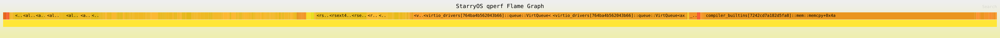
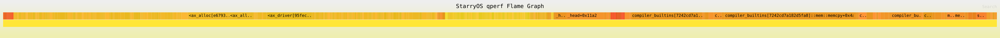

# qperf 宿主 QEMU 重跑与 virtio 瓶颈分析报告

## 1. 结论摘要

本轮使用宿主侧 `qemu-system-riscv64` 重新跑了 qperf profile，并用 marker window 与 `qperf-metrics` 重新验证 virtio 相关瓶颈。结论如下：

| 子系统 | 主要瓶颈 | 证据强度 | 结论 |
| --- | --- | --- | --- |
| virtio-blk | 同步 `VirtQueue::add_notify_wait_pop`，近 4 KiB 粒度频繁 submit/notify/wait/pop | 高 | blk 读路径没有持续利用 queue depth，应优先做 pending read / async completion / 批量 notify |
| virtio-blk | `memcpy` 和 ext4/data block cache 管理 | 中 | copy 是真实热点，但当前 profile 不能证明所有 copy 都来自 blk driver |
| virtio-net | RX `copy_within()` 等 copy 开销 | 高 | RX 收包后把 header 后面的 packet 前移，copy bytes 与下载字节数同量级 |
| virtio-net | TX staging copy | 中 | 计数明确存在，但本次下载 workload 以 RX 为主，TX 字节较小 |
| virtio-net | inflight `BTreeMap<u16, ...>` 管理规模 | 中 | counters 显示每 60.6 MiB 下载有约 4.6 万级 insert/remove/get；分类器当前没有把它聚成热点类别 |

最值得优先做 A/B 的优化：

1. blk：把同步 read path 改成 pending read / async queue 原型，降低 `add_notify_wait_pop_count` 与 notify/kick per MB。
2. net：先做 RX 去 `copy_within()`，目标是让 `virtio_net_rx_copy_within_bytes` 明显下降。
3. net：把 inflight `BTreeMap` 替换为固定数组/slab/token-indexed table，观察 allocator、BTree/inflight counters 与吞吐变化。

## 2. 验证环境与数据来源

宿主侧 QEMU 已安装到用户目录：

```text
qemu-system-riscv64: /home/cg24/.cargo/bin/qemu-system-riscv64
QEMU version: 10.2.1
```

本轮没有通过 Docker 执行 QEMU；完整 workload profile 使用宿主 QEMU 与 harness：

```bash
python3 tools/starry-syscall-harness/harness.py perf-profile --no-docker ...
```

主要证据路径：

| 用例 | 结果目录 |
| --- | --- |
| blk | `target/qperf-host-rerun/blk-harness/perf/riscv64/latest/` |
| net | `target/qperf-host-rerun/net-harness-ok/perf/riscv64/latest/` |

重要文件：

| 文件 | 说明 |
| --- | --- |
| `report.json` | qperf 机器可读报告 |
| `report.md` | qperf 自动生成 Markdown 报告 |
| `hotspots.csv` | symbol hotspot |
| `hotspot_categories.csv` | 工程归因类别 |
| `qperf/flamegraph.workload.svg` | workload window 火焰图 |
| `qperf/stack.folded` | folded stack |
| `profile.stdout` | guest stdout，含 marker、workload 输出、`QPERF_METRIC` |

本报告引用的 PNG 是从最新 workload SVG 转换得到：

| PNG | SVG 来源 |
| --- | --- |
| `docs/flamegraphs/qperf-host-rerun-blk-workload.png` | `target/qperf-host-rerun/blk-harness/perf/riscv64/latest/qperf/flamegraph.workload.svg` |
| `docs/flamegraphs/qperf-host-rerun-blk-focus.png` | `target/qperf-host-rerun/blk-harness/perf/riscv64/latest/qperf/flamegraph.focus.svg` |
| `docs/flamegraphs/qperf-host-rerun-net-workload.png` | `target/qperf-host-rerun/net-harness-ok/perf/riscv64/latest/qperf/flamegraph.workload.svg` |

## 3. 工具状态说明

`cargo starry perf` 已经能在宿主找到 QEMU 并启动 qperf QEMU，但本轮该路径在 StarryOS root device detection 阶段 panic：

```text
failed to determine root device from available block devices
```

因此，本轮完整 workload profile 改用 harness 的 `perf-profile --no-docker` 路径。这个路径仍然使用宿主 `qemu-system-riscv64`，且 blk/net workload 均进入 marker window。

net 用例的最终 `report.json.result` 为 `incomplete`，但 workload 数据有效。原因是 stop marker 之后没有 post-window 样本，后处理尝试生成 `flamegraph.post.svg` 时返回：

```text
No stack counts found
```

这属于 qperf 后处理边界，不是 wget 失败。net 的 `profile.stdout` 中有 `'/dev/null' saved`、`QPERF_END` 和完整 `QPERF_METRIC` 输出。

## 4. 火焰图说明

当前 qperf workload flamegraph 高度只有 123px，说明本轮采样恢复出的调用链仍较浅。它可以直观看到宽热点分布，但不能替代 `hotspot_categories.csv` 与 counters。瓶颈判断以三类证据交叉确认：

1. 火焰图宽热点。
2. `hotspots.csv` / `hotspot_categories.csv` 采样占比。
3. `/proc/qperf_metrics` 导出的 driver-visible counters。

## 5. virtio-blk 分析

### 5.1 workload 与窗口

blk workload：

```bash
echo reset > /proc/qperf_metrics
echo QPERF_BEGIN:blk-read
dd if=/usr/bin/lto-dump of=/dev/null bs=64k
cat /proc/qperf_metrics
echo QPERF_END:blk-read
```

执行结果：

| 字段 | 数值 |
| --- | ---: |
| qperf result | `ok` |
| dd bytes | 53,601,104 |
| dd elapsed | 6.136393 s |
| dd throughput | 8,734,952.93 B/s |
| workload window | 6.299259501 s |
| boot samples excluded | 174 |
| post-window samples excluded | 495 |
| samples per MB | 11.622895 |
| host elapsed sec per MB | 0.243827 |

### 5.2 blk workload 火焰图



blk focused 火焰图：


图中能看到 `memcpy` 与 `VirtQueue::add_notify_wait_pop` 都是宽热点。由于当前 stack 较浅，具体归因应看下面的分类表和 counters。

### 5.3 工程分类热点

`hotspot_categories.csv` 的 top categories：

| category | samples | percent |
| --- | ---: | ---: |
| `memcpy` | 177 | 28.4109% |
| `virtio_notify_kick` | 174 | 27.9294% |
| `virtqueue_add_notify_wait_pop` | 171 | 27.4478% |
| `block_io_path` | 117 | 18.7801% |
| `allocator` | 89 | 14.2857% |

`hotspots.csv` 的 top functions：

| function | samples | percent |
| --- | ---: | ---: |
| `compiler_builtins::mem::memcpy+0x4a` | 169 | 27.1268% |
| `VirtQueue::add_notify_wait_pop::<PciTransport>+0xcc` | 84 | 13.4831% |
| `VirtQueue::add_notify_wait_pop::<PciTransport>+0xc8` | 81 | 13.0016% |
| `DataBlockCache::evict_lru::<Ext4Disk>+0x68` | 14 | 2.2472% |
| `DataBlockCache::evict_lru::<Ext4Disk>+0x6a` | 10 | 1.6051% |

### 5.4 blk virtio counters

`/proc/qperf_metrics` 导出的关键计数：

| counter | value |
| --- | ---: |
| `virtqueue_add_notify_wait_pop_count` | 14,354 |
| `virtqueue_add_count` | 14,421 |
| `virtio_notify_kick_count` | 14,421 |
| `virtqueue_pop_complete_count` | 14,357 |
| `virtqueue_depth_max` | 63 |
| `virtio_blk_read_requests` | 13,629 |
| `virtio_blk_read_bytes` | 55,813,632 |
| `virtio_blk_write_requests` | 725 |
| `virtio_blk_write_bytes` | 2,973,696 |

派生指标：

| 指标 | 数值 |
| --- | ---: |
| `add_notify_wait_pop` per MB | 267.79 |
| notify/kick per MB | 269.04 |
| average blk read request size | 4,095.21 bytes |

这里最关键的是平均 read request size。guest 命令使用 `bs=64k`，但 driver-visible read request 平均仍约 4 KiB，说明上层 read 没有变成更少、更大的 virtio request。

### 5.5 blk 代码对应关系

相关代码在 `drivers/ax-driver/src/virtio/block.rs`：

| 代码位置 | 现象 |
| --- | --- |
| `VirtIoBlkDevice::new()` | 调用 `raw.disable_interrupts()` |
| `BlockQueue::submit_request()` read 分支 | 直接调用 `self.raw.raw.read_blocks(request.block_id, &mut buffer)` |
| `BlockQueue::poll_request()` | 当前直接 `Ok(())`，没有真正完成异步轮询 |

这意味着当前 blk submit 是同步完成语义。qperf 的 `VirtQueue::add_notify_wait_pop` 热点和 counters 正好对应这个实现。

### 5.6 blk 瓶颈判断

blk 的主瓶颈是：

**大量约 4 KiB 粒度的同步 virtqueue 读请求，每个请求接近一次 add/notify/wait/pop，queue depth 没有被稳定用于隐藏等待成本。**

证据链：

* `virtqueue_add_notify_wait_pop` category 占 27.4478%。
* `virtio_notify_kick` category 占 27.9294%。
* `virtqueue_add_notify_wait_pop_count = 14,354`，`virtio_notify_kick_count = 14,421`。
* `virtio_blk_read_bytes / virtio_blk_read_requests = 4095.21 bytes`。
* `BlockQueue::submit_request()` 调用同步 `read_blocks()`，`poll_request()` 没有异步完成逻辑。

次级瓶颈是 copy 与 ext4/data block cache 管理：

* `memcpy` 占 28.4109%。
* `block_io_path` 占 18.7801%。
* `allocator` 占 14.2857%。

但当前 qperf 还不能把所有 copy 精确拆分到 FS cache、用户/内核 buffer、driver DMA buffer，因此 copy 优化应在 blk async 原型之后用更细 counters 继续定位。

## 6. virtio-net 分析

### 6.1 workload 与窗口

net workload：

```bash
echo reset > /proc/qperf_metrics
echo QPERF_BEGIN:net-wget
wget -O /dev/null http://10.0.2.2:8000/target/qperf-host-rerun/blk-read/perf/riscv64/latest/axbuild-tmp/rootfs/rootfs-riscv64-alpine.img.tar.xz
cat /proc/qperf_metrics
echo QPERF_END:net-wget
```

执行结果：

| 字段 | 数值 |
| --- | ---: |
| wget bytes | 63,543,705 |
| wget saved | `true` |
| wget elapsed | 7.778458149 s |
| wget throughput | 8,169,190.32 B/s |
| workload window | 7.778458149 s |
| boot samples excluded | 171 |
| post-window samples excluded | 0 |
| samples per MB | 12.101907 |
| guest instructions per MB | 19,153,281.10 |
| guest blocks per MB | 2,978,337.95 |
| host elapsed sec per MB | 0.151217 |

### 6.2 net workload 火焰图



火焰图中 `memcpy` 仍是最宽热点之一，右侧可以看到 virtio queue / net path 相关 frame。由于栈较浅，net 结论主要依赖 category 与 counters。

### 6.3 工程分类热点

`hotspot_categories.csv` 的 top categories：

| category | samples | percent |
| --- | ---: | ---: |
| `memcpy` | 204 | 26.5280% |
| `allocator` | 165 | 21.4564% |
| `net_rx_tx_path` | 149 | 19.3758% |
| `memmove` | 55 | 7.1521% |
| `scheduler_wait_preempt` | 18 | 2.3407% |

`hotspots.csv` 的 top functions：

| function | samples | percent |
| --- | ---: | ---: |
| `compiler_builtins::mem::memcpy+0x4a` | 100 | 13.0039% |
| `compiler_builtins::mem::memcpy+0x10c` | 55 | 7.1521% |
| `NetRxQueue::submit+0x22c` | 35 | 4.5514% |
| `PercpuSlab::alloc+0xfa` | 32 | 4.1612% |
| `_head+0x11a2` | 29 | 3.7711% |

### 6.4 net virtio counters

`/proc/qperf_metrics` 导出的关键计数：

| counter | value |
| --- | ---: |
| `virtqueue_add_count` | 47,858 |
| `virtio_notify_kick_count` | 47,858 |
| `virtqueue_pop_complete_count` | 47,794 |
| `virtqueue_add_notify_wait_pop_count` | 1,177 |
| `virtqueue_depth_max` | 63 |
| `virtio_net_rx_packets` | 44,140 |
| `virtio_net_rx_bytes` | 65,937,048 |
| `virtio_net_rx_copy_within_count` | 44,140 |
| `virtio_net_rx_copy_within_bytes` | 65,937,048 |
| `virtio_net_tx_packets` | 2,478 |
| `virtio_net_tx_bytes` | 149,375 |
| `virtio_net_tx_staging_copy_count` | 2,478 |
| `virtio_net_tx_staging_copy_bytes` | 149,375 |
| `virtio_net_inflight_insert_count` | 46,681 |
| `virtio_net_inflight_remove_count` | 46,617 |
| `virtio_net_inflight_get_count` | 46,617 |

派生指标：

| 指标 | 数值 |
| --- | ---: |
| RX copy bytes / wget bytes | 1.0377 |
| inflight insert+remove+get per MB | 2,201.87 |
| notify/kick per MB | 753.15 |

### 6.5 net 代码对应关系

相关代码在 `drivers/ax-driver/src/virtio/net.rs`：

| 代码位置 | 现象 |
| --- | --- |
| `NetInner` | 使用 `BTreeMap<u16, TxInflight>` 与 `BTreeMap<u16, RxInflight>` 管理 inflight |
| `submit_tx()` | 创建 `staging = vec![0; header + packet]`，再 `copy_from_slice(packet)` |
| `submit_tx()` | 将 token 插入 `tx_inflight` |
| `submit_rx()` | 将 RX buffer token 插入 `rx_inflight` |
| `reclaim_rx()` | `rx_inflight.remove(&token)` 后调用 `receive_complete()` |
| `reclaim_rx()` | `buffer.copy_within(header_len..header_len + packet_len, 0)` |

这些代码路径与 counters 对应：

* `virtio_net_rx_copy_within_count = virtio_net_rx_packets = 44,140`。
* `virtio_net_rx_copy_within_bytes = virtio_net_rx_bytes = 65,937,048`。
* `virtio_net_tx_staging_copy_count = virtio_net_tx_packets = 2,478`。
* `virtio_net_inflight_insert/remove/get` 都是 4.6 万级。

### 6.6 net 瓶颈判断

net 的主瓶颈是：

**RX 收包路径对几乎全部接收字节执行 `copy_within()`，copy bytes 与下载大小同量级，并且 `memcpy/memmove` 采样占比合计超过 33%。**

证据链：

* `memcpy` category 占 26.5280%。
* `memmove` category 占 7.1521%。
* `net_rx_tx_path` category 占 19.3758%。
* `virtio_net_rx_copy_within_bytes = 65,937,048`，wget bytes 为 63,543,705，比例为 1.0377。
* `reclaim_rx()` 中明确执行 `buffer.copy_within(header_len..header_len + packet_len, 0)`。

net 的次级瓶颈是 allocator 与 inflight 管理：

* `allocator` category 占 21.4564%。
* `virtio_net_inflight_insert_count = 46,681`。
* `virtio_net_inflight_remove_count = 46,617`。
* `virtio_net_inflight_get_count = 46,617`。
* `NetInner` 使用 `BTreeMap<u16, ...>` 管理 token 到 buffer 的映射。

需要注意：本轮 `hotspot_categories.csv` 中 `net_inflight_btree` 仍为 0。这不表示 inflight 没有成本，而是分类规则没有命中当前 demangled symbol 或成本被 allocator/copy/net path 分类覆盖。counters 已经证明 inflight 操作规模足够大，后续应补强分类规则或增加更细的 BTree/slab counters。

## 7. 综合瓶颈排序

| 优先级 | 方向 | 为什么先做 |
| --- | --- | --- |
| P0 | blk pending read / async queue | blk 的同步 queue 热点与 counters 同时非常强，优化目标清晰 |
| P0 | net RX 去 `copy_within()` | RX copy bytes 与下载 bytes 同量级，`memcpy/memmove` 合计占比高 |
| P1 | net inflight BTreeMap 替换 | counters 显示 4.6 万级 token map 操作，可能贡献 allocator 与路径开销 |
| P1 | net TX buffer/staging pool | 本次 TX 字节小，但代码中每次 TX 都有 staging Vec copy |
| P2 | blk/fs copy 来源细分 | `memcpy` 是 blk top category，但需要更多 counters 区分 FS cache 和 driver copy |

## 8. 建议的 A/B 验证指标

### 8.1 blk pending read / async queue

优化前后对比以下字段：

| 指标 | 期望变化 |
| --- | --- |
| `virtqueue_add_notify_wait_pop_count` | 明显下降 |
| `virtio_notify_kick_count` per MB | 明显下降 |
| `virtio_blk_read_requests` per MB | 如有 request merge，应下降 |
| `virtqueue_depth_hist_*` | 低 depth 计数下降，中高 depth 更稳定 |
| `virtqueue_add_notify_wait_pop` category percent | 下降 |
| dd throughput | 上升 |
| host elapsed sec per MB | 下降 |

### 8.2 net RX 去 `copy_within()`

优化前后对比以下字段：

| 指标 | 期望变化 |
| --- | --- |
| `virtio_net_rx_copy_within_bytes` | 明显下降，最好接近 0 |
| `virtio_net_rx_copy_within_count` | 明显下降，最好接近 0 |
| `memcpy` / `memmove` category percent | 下降 |
| `net_rx_tx_path` category percent | 下降或路径更分散 |
| wget throughput | 上升 |
| guest instructions per MB | 下降 |

### 8.3 net inflight map 替换

优化前后对比以下字段：

| 指标 | 期望变化 |
| --- | --- |
| `virtio_net_inflight_insert/remove/get_count` | 操作次数可能相同，但每次成本应下降 |
| allocator category percent | 下降 |
| `net_rx_tx_path` category percent | 下降 |
| BTreeMap 相关 symbol | 消失或下降 |
| wget throughput | 上升 |
| host elapsed sec per MB | 下降 |

## 9. 当前 qperf 局限

本报告的结论已经足以指导下一轮 A/B 优化，但仍有以下边界：

* marker window 是后处理 timestamp filter，不是 runtime pause/resume。
* virtio counters 是 driver-visible 近似值，不是 ring-level 精确事件。
* 火焰图纵向较浅，说明当前 frame pointer / QEMU plugin 采样链不能稳定恢复完整 Rust 调用栈。
* net `result: incomplete` 来自 post-window 空样本 flamegraph 生成失败，workload 数据有效，但工具应进一步修复该返回码策略。
* host perf 未启用，blk 的 guest instructions/blocks per MB 为空；net 有 guest instruction/block 归一化值。
* `net_inflight_btree` 分类规则当前没有命中，但 counters 已能证明 inflight 操作规模。

## 10. 下一步任务建议

建议下一轮按以下顺序执行：

1. 实现 net RX 去 `copy_within()` 最小补丁，跑 baseline/candidate A/B。
2. 实现 net inflight `BTreeMap` 到固定数组/slab 的替换原型，跑 A/B。
3. 实现 blk pending read / async completion 最小原型，跑 A/B。
4. 修复 qperf post-window 空样本时返回 `incomplete` 的问题。
5. 增加更接近 `virtio-drivers` ring 的精确 counters：avail depth、used depth、notify skipped、wait time、per-queue counters。
