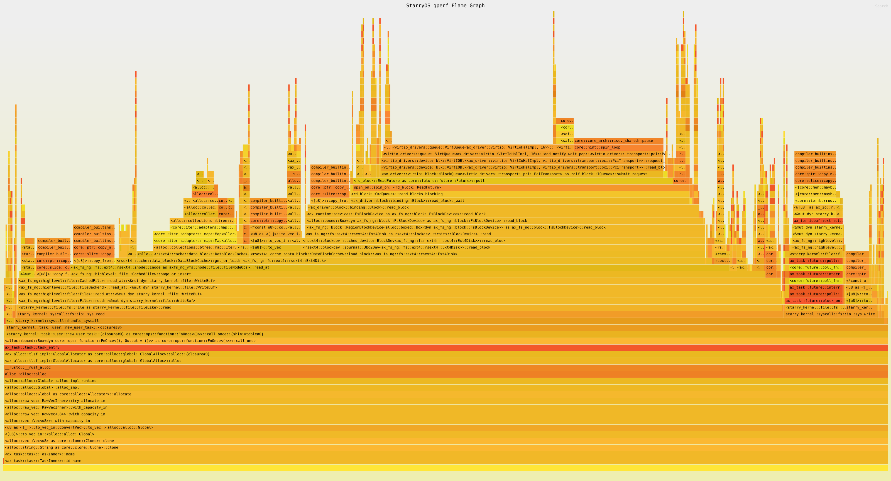
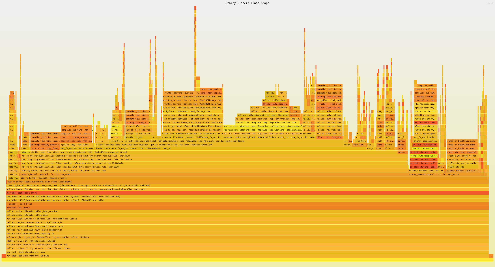

# qperf virtio-blk 深栈采样与优化报告

## 1. 目标

本轮目标是使用已经支持 RISC-V frame-pointer callchain 的新版 qperf，重新采样 virtio-blk 路径，生成可以纵向展开的深栈火焰图，并基于 qperf 的实际证据实现一个可验证的性能优化。

本报告只使用本轮真实命令产物中的数字，不使用示例值。

## 2. 环境与命令

| 项目 | 值 |
| --- | --- |
| 运行环境 | 宿主 WSL2，非 Docker |
| QEMU | `qemu-system-riscv64` 10.2.1 |
| guest arch | `riscv64` |
| qperf callchain | `fp`，通过 `cargo starry perf --full-stack` 启用 |
| workload | `dd if=/usr/bin/lto-dump of=/dev/null bs=64k` |
| marker | `QPERF_BEGIN` / `QPERF_END` |
| metrics | `--qperf-metrics`，读取 `/proc/qperf_metrics` |

baseline 命令：

```bash
cargo starry perf \
  --case blk-baseline \
  --output-dir target/qperf-virtio-blk-opt/baseline \
  --full-stack \
  --qperf-metrics \
  --host-time \
  --timeout 240 \
  --workload-timeout 160 \
  --start-marker QPERF_BEGIN \
  --stop-marker QPERF_END \
  --shell-init-cmd 'echo reset > /proc/qperf_metrics; echo QPERF_BEGIN:blk; dd if=/usr/bin/lto-dump of=/dev/null bs=64k; cat /proc/qperf_metrics; echo QPERF_END:blk' \
  --no-truncate
```

最终 candidate 命令：

```bash
cargo starry perf \
  --case blk-direct-readahead \
  --output-dir target/qperf-virtio-blk-opt/candidate-readahead \
  --full-stack \
  --qperf-metrics \
  --host-time \
  --timeout 240 \
  --workload-timeout 160 \
  --start-marker QPERF_BEGIN \
  --stop-marker QPERF_END \
  --shell-init-cmd 'echo reset > /proc/qperf_metrics; echo QPERF_BEGIN:blk; dd if=/usr/bin/lto-dump of=/dev/null bs=64k; cat /proc/qperf_metrics; echo QPERF_END:blk' \
  --no-truncate
```

A/B compare 命令：

```bash
python3 tools/starry-syscall-harness/harness.py perf-compare \
  --baseline target/qperf-virtio-blk-opt/baseline/perf/riscv64/latest/report.json \
  --candidate target/qperf-virtio-blk-opt/candidate-readahead/perf/riscv64/latest/report.json \
  --name blk-readahead \
  --output-dir target/qperf-virtio-blk-opt/compare-readahead
```

## 3. 深栈火焰图

baseline 深栈火焰图：



candidate 深栈火焰图：



原始 SVG 和 folded stack 位置：

| case | flamegraph.svg | stack.folded | depth summary |
| --- | --- | --- | --- |
| baseline | `target/qperf-virtio-blk-opt/baseline/perf/riscv64/latest/qperf/flamegraph.svg` | `target/qperf-virtio-blk-opt/baseline/perf/riscv64/latest/qperf/stack.folded` | `target/qperf-virtio-blk-opt/baseline/perf/riscv64/latest/qperf/stack-depth-summary.csv` |
| candidate | `target/qperf-virtio-blk-opt/candidate-readahead/perf/riscv64/latest/qperf/flamegraph.svg` | `target/qperf-virtio-blk-opt/candidate-readahead/perf/riscv64/latest/qperf/stack.folded` | `target/qperf-virtio-blk-opt/candidate-readahead/perf/riscv64/latest/qperf/stack-depth-summary.csv` |

深度分布：

| depth | baseline samples | candidate samples |
| ---: | ---: | ---: |
| 1 | 1 | 10 |
| 3 | 0 | 2 |
| 4 | 4 | 1 |
| 5 | 2 | 2 |
| 6 | 21 | 41 |
| 7 | 2 | 4 |
| 8 | 19 | 7 |
| 9 | 43 | 48 |
| 10 | 59 | 66 |
| 11 | 57 | 75 |
| 12 | 94 | 108 |
| 13 | 55 | 79 |
| 14 | 62 | 9 |
| 15 | 212 | 69 |
| 16 | 11 | 5 |
| 17 | 0 | 1 |
| 20 | 0 | 1 |

这说明本轮 flamegraph 不是 leaf-only。baseline 与 candidate 都保留了 syscall 到 fs、rsext4、ax-driver、virtio queue 的深调用链。

baseline 中可见的典型路径：

```text
starry_kernel::syscall::fs::io::sys_read
  -> ax_fs_ng::highlevel::file::CachedFile::read_at
  -> rsext4::cache::data_block::DataBlockCache::get_or_load
  -> DataBlockCache::load_block
  -> Jbd2Dev::read_block
  -> ax_driver::block::binding::Block::read_blocks_wait
  -> rd_block::CmdQueue::read_blocks_blocking
  -> ax_driver::virtio::block::BlockQueue::submit_request
  -> VirtIOBlk::read_blocks
  -> VirtQueue::add_notify_wait_pop
```

candidate 中路径变为：

```text
starry_kernel::syscall::fs::io::sys_read
  -> ax_fs_ng::highlevel::file::CachedFile::read_at
  -> rsext4::cache::data_block::DataBlockCache::get_or_load
  -> DataBlockCache::load_readahead
  -> Jbd2Dev::read_blocks
  -> ax_driver::block::binding::Block::read_block
  -> rd_block::CmdQueue::read_blocks_direct
  -> ax_driver::virtio::block::BlockQueue::read_blocks_direct
  -> VirtIOBlk::read_blocks
  -> VirtQueue::add_notify_wait_pop
```

## 4. qperf 识别出的瓶颈

baseline 结果：

| 指标 | 值 |
| --- | ---: |
| dd bytes | 53,601,104 |
| dd elapsed | 6.367021 s |
| throughput | 8,418,553 B/s |
| marker window | 6.529766005 s |
| callchain avg symbol depth | 43.306853583 |
| raw max depth | 16 |
| samples | 642 |

baseline counters：

| counter | 值 |
| --- | ---: |
| virtio_blk_read_requests | 13,629 |
| virtio_blk_read_bytes | 55,813,632 |
| virtqueue_add_count | 14,417 |
| virtio_notify_kick_count | 14,417 |
| virtqueue_add_notify_wait_pop_count | 14,354 |
| virtqueue_pop_complete_count | 14,354 |

baseline hotspot categories：

| category | samples | percent |
| --- | ---: | ---: |
| block_io_path | 487 | 75.8567% |
| virtio_notify_kick | 211 | 32.8660% |
| virtqueue_add_notify_wait_pop | 205 | 31.9315% |
| memcpy | 181 | 28.1931% |
| lock_mutex_wait | 68 | 10.5919% |

结论：

* 每次 53.6 MB 顺序读触发 13,629 次 blk read request，平均每个 read request 约 4 KiB。
* `virtqueue_depth_hist_0` 和 `virtqueue_depth_hist_1` 与 request 数量几乎同量级，说明大多数 I/O 都是同步提交、立即等待完成。
* `VirtQueue::add_notify_wait_pop` 和 `virtio_notify_kick` 在深栈中出现在约三分之一 workload 样本里，是 blk 路径的主要工程瓶颈。
* `memcpy` 也显著，但仅减少 copy 不足以解决主瓶颈；关键是减少同步小 I/O 次数。

## 5. 优化实现

本轮实现了两个小步，第一步作为失败尝试保留证据，第二步作为最终优化：

### 5.1 direct read 快路径

修改文件：

* `drivers/interface/rdif-block/src/lib.rs`
* `drivers/blk/rd-block/src/lib.rs`
* `drivers/ax-driver/src/block/binding.rs`
* `drivers/ax-driver/src/virtio/block.rs`
* `drivers/ax-driver/src/qperf_metrics.rs`

内容：

* 在 `rdif_block::IQueue` 增加默认 `read_blocks_direct()`。
* `ax_driver::block::Block::read_block()` 优先尝试 direct path。
* virtio-blk 对物理连续 buffer 调用 `VirtIOBlk::read_blocks()` 直接 DMA 到目标 buffer。
* qperf metrics 新增 `virtio_blk_direct_read_requests`、`virtio_blk_direct_read_bytes`。

direct-only 结果：

| 指标 | baseline | direct-only |
| --- | ---: | ---: |
| throughput | 8,418,553 B/s | 6,889,660 B/s |
| workload elapsed | 6.367021 s | 7.779933 s |
| virtqueue_add_notify_wait_pop_count | 14,354 | 14,354 |

结论：direct-only 命中了全部 read request，但没有减少同步 virtqueue 次数，A/B compare 判定为退化。因此 direct-only 不是有效优化。

### 5.2 rsext4 data block readahead

修改文件：

* `components/rsext4/src/cache/data_block.rs`

内容：

* 在 `DataBlockCache::get_or_load()` miss 时，最多读取 8 个连续 filesystem block。
* 使用已有 `Jbd2Dev::read_blocks()` 批量读入。
* 将批量读取的数据拆成 `CachedBlock` 放入 data block cache。
* 如果后续 block 已在 cache 中，则停止本次 readahead，避免覆盖已有缓存。
* 仍按 LRU 容量约束驱逐，保持缓存上限。

这与 qperf 识别出的瓶颈直接对应：顺序读场景下，把多次 4 KiB `read_block -> add_notify_wait_pop` 合并成更少的批量 read。

## 6. A/B 结果

最终 compare 文件：

* `target/qperf-virtio-blk-opt/compare-readahead/perf-compare/blk-readahead/compare.md`
* `target/qperf-virtio-blk-opt/compare-readahead/perf-compare/blk-readahead/compare.csv`
* `target/qperf-virtio-blk-opt/compare-readahead/perf-compare/blk-readahead/compare.json`

compare 结论：`明显改善`。

| 指标 | baseline | candidate | 变化 |
| --- | ---: | ---: | ---: |
| throughput_bytes_per_second | 8,418,553 | 10,551,346 | +25.3344% |
| workload elapsed | 6.367021 s | 5.080025 s | -20.2135% |
| samples.total_samples | 642 | 528 | -17.7570% |
| virtio_blk_read_requests | 13,629 | 2,111 | -84.5110% |
| virtio_notify_kick_count | 14,417 | 2,899 | -79.8918% |
| virtqueue_add_count | 14,417 | 2,899 | -79.8918% |
| virtqueue_add_notify_wait_pop_count | 14,354 | 2,836 | -80.2424% |
| virtqueue_pop_complete_count | 14,354 | 2,836 | -80.2424% |

hotspot category 对比：

| category | baseline | candidate | delta |
| --- | ---: | ---: | ---: |
| virtio_notify_kick | 32.8660% | 14.2045% | -18.6615 pp |
| virtqueue_add_notify_wait_pop | 31.9315% | 13.4470% | -18.4845 pp |
| block_io_path | 75.8567% | 66.2879% | -9.5688 pp |
| memcpy | 28.1931% | 31.0606% | +2.8675 pp |
| lock_mutex_wait | 10.5919% | 10.4167% | -0.1752 pp |

函数变化中最关键的是：

| function | baseline | candidate | 说明 |
| --- | ---: | ---: | --- |
| `DataBlockCache::load_block` | 1.1869% | 0.0048% | 单块读基本消失 |
| `DataBlockCache::load_readahead` | 0.0000% | 1.1720% | 新批量读路径出现 |
| `Block::read_blocks_wait` | 0.8884% | 0.0000% | 旧同步 wrapper 热点消失 |
| `rd_block::CmdQueue::read_blocks_blocking` | 0.8884% | 0.0000% | 旧阻塞 future 路径消失 |
| `BlockQueue::submit_request` | 0.7409% | 0.0048% | 旧 request 提交路径基本消失 |
| `BlockQueue::read_blocks_direct` | 0.0000% | 0.3349% | direct 批量读路径出现 |
| `VirtQueue::add_notify_wait_pop` | 0.7373% | 0.3396% | leaf 函数占比下降 |

## 7. 重要说明

candidate 的 `report.json.result` 是 `incomplete`，原因是 QEMU 在 stop marker 后通过 QMP 请求退出，但最终被 SIGKILL 清理。该问题会影响 host elapsed 和 guest instruction/block summary：

* candidate `host.elapsed_seconds` 被拉长到 27.689356 s，不适合用于性能结论。
* candidate `guest.executed_instructions` 与 `guest.executed_blocks` 为 N/A。
* marker window、dd 输出、qperf raw sample、folded stack、hotspot_categories 和 QPERF_METRIC counters 均已生成。

因此本轮结论基于：

* guest stdout 中的 `dd` bytes / elapsed / throughput。
* marker window 内 qperf samples。
* `/proc/qperf_metrics` 导出的 virtio counters。
* `hotspot_categories.csv` 和 deep stack folded path。

## 8. 本轮验证命令

已执行：

```bash
cargo fmt
cargo clippy -p rdif-block -- -D warnings
cargo clippy -p rd-block -- -D warnings
cargo clippy -p rsext4 -- -D warnings
cargo clippy -p ax-driver --no-default-features --features 'plat-dyn,virtio-blk,virtio-net,virtio-socket,qperf-metrics' -- -D warnings
```

SVG 转 PNG：

```bash
convert -background white \
  target/qperf-virtio-blk-opt/baseline/perf/riscv64/latest/qperf/flamegraph.svg \
  docs/flamegraphs/qperf-virtio-blk-baseline-fullstack.png

convert -background white \
  target/qperf-virtio-blk-opt/candidate-readahead/perf/riscv64/latest/qperf/flamegraph.svg \
  docs/flamegraphs/qperf-virtio-blk-readahead-fullstack.png
```

## 9. 结论

本轮 qperf 深栈采样确认 virtio-blk 的主要瓶颈是同步小块 I/O：

```text
sys_read
  -> rsext4 DataBlockCache::load_block
  -> ax_driver Block::read_blocks_wait
  -> rd_block::read_blocks_blocking
  -> virtio_blk submit_request
  -> VirtQueue::add_notify_wait_pop
```

最终优化通过 rsext4 data block readahead 与 virtio-blk direct read，把顺序读中的单块 miss 合并为批量读：

* workload 吞吐提升 25.3344%。
* blk read request 数下降 84.5110%。
* notify/kick 数下降 79.8918%。
* `add_notify_wait_pop` 计数下降 80.2424%。
* `virtqueue_add_notify_wait_pop` category 从 31.9315% 降到 13.4470%。

这说明新版 qperf 已经可以支撑“发现瓶颈 -> 实现优化 -> A/B 验证”的闭环。

## 10. 后续工作

* 修复 QMP stop 后偶发 SIGKILL，保证 candidate `result=ok` 并保留完整 plugin summary。
* 将 readahead 策略做成可调参数，例如根据顺序命中率动态选择 1/4/8/16 blocks。
* 进一步减少 `DataBlockCache::load_readahead` 内部的 `Vec` 分块复制。
* 继续推进真正异步 pending read，让 virtqueue depth 不只通过减少请求数改善，而能真正并发利用 queue depth。
